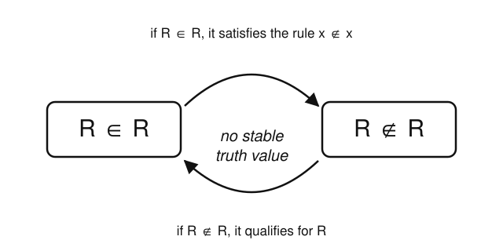

# Logic & Set Theory · Lesson 3.1: Naive Sets & Russell's Paradox

> ⏱ ~15 min · Module 3: From Paradox to ZFC · Builds on: [Lesson 2.2](02-02-structures-satisfaction.md) (structures & satisfaction), [Lesson 2.3](02-03-translation-quantifier-order.md) (negating quantifiers) · Unlocks: [Lesson 3.2](03-02-extensionality-to-power-set.md) (extensionality to power set)

## Why this matters

For thirty years, sets ran on one gorgeously simple rule: name a property, and the things with that property form a set. Frege built the entire foundation of arithmetic on it. Then in 1901 Russell wrote him a two-line letter that brought the whole edifice down. This lesson is that letter. Understanding *exactly* which assumption exploded — and it is one specific assumption, not "sets" or "logic" in general — is the reason every axiom in the next three lessons looks the way it does. ZFC is not a random list; it is the minimal repair to the crack you're about to find.

## The idea

Naive set theory has one engine, called **comprehension**: any property you can state carves out the set of exactly the things satisfying it. "Even numbers," "red houses," "sets with three elements" — each is a legal property, so each names a set. It feels unimpeachable. What could go wrong with *describing a collection*?

The trap is **self-reference**. Sets can be members of other sets, so nothing stops us from asking whether a set is a member of *itself*. Most aren't: the set of all cats is not a cat, so it's not one of its own members. Now cook up the property "$x$ is **not** a member of itself" and collect everything with that property into one set $R$. Ask the fatal question: is $R$ a member of $R$? If it is, then by its own defining rule it isn't. If it isn't, then it exactly fits the rule, so it is. There is no third option, and both options refute themselves.

The cleanest everyday cousin is the **village barber** who shaves every man who does not shave himself, and no one else. Does the barber shave himself? Either answer contradicts the rule. Russell's set is that riddle made mathematically exact — and unlike the barber (who can simply not exist), $R$ was *guaranteed to exist* by comprehension. That guarantee is the bug.

## The formal version

Naive set theory's engine, written as a schema — one axiom for each property $P$:

**Naive (unrestricted) comprehension.** For every property $P(x)$ expressible in the language, there is a set
$$\{x : P(x)\}$$
whose members are exactly the objects satisfying $P$. Formally, for each formula $P(x)$ there is a set $A$ with
$$\forall x\,\big(x \in A \leftrightarrow P(x)\big).$$

*In words:* whatever condition you can write down, the things meeting it form a set — no strings attached.

Now instantiate the schema with the property $P(x) \equiv (x \notin x)$, "$x$ is not a member of itself." Comprehension hands us **Russell's set**:
$$R = \{\, x : x \notin x \,\}, \qquad \forall x\,\big(x \in R \leftrightarrow x \notin x\big).$$

*In words:* $R$ collects precisely those sets that do not contain themselves.

The defining equivalence holds for *every* $x$, so it holds when we plug in $x := R$:
$$\boxed{\,R \in R \;\leftrightarrow\; R \notin R\,.}$$

*In words:* "$R$ contains itself" is logically equivalent to "$R$ does not contain itself." That's a statement of the form $Q \leftrightarrow \neg Q$, and no truth value makes it true. Recall from [Lesson 1.2](01-02-semantics-truth-tables.md): if $Q$ is true, $Q \leftrightarrow \neg Q$ reads $\top \leftrightarrow \bot$ = false; if $Q$ is false, it reads $\bot \leftrightarrow \top$ = false. The biconditional is a **contradiction** — a formula false under every valuation. We derived $\bot$ from the axioms alone. Naive set theory is inconsistent.

## Picture

The two possible states bounce into each other forever. There's no fixed point to land on — which is exactly what "$Q \leftrightarrow \neg Q$" means geometrically.

## Worked examples

**Example 1 (the derivation, every step spelled out).** We show $R \in R$ leads to a contradiction, and so does $R \notin R$ — closing every exit.

Start from the defining property, specialized to $R$:
$$R \in R \;\leftrightarrow\; R \notin R. \tag{$\ast$}$$

*Case A: suppose $R \in R$.* Reading ($\ast$) left-to-right, $R \in R$ implies $R \notin R$. So we have both $R \in R$ and $R \notin R$ — a flat contradiction.

*Case B: suppose $R \notin R$.* Reading ($\ast$) right-to-left, $R \notin R$ implies $R \in R$. So again both $R \in R$ and $R \notin R$ — contradiction.

By the law of excluded middle exactly one of $R \in R$, $R \notin R$ holds; both lead to $\bot$. Therefore the *existence* of $R$ is impossible. But comprehension asserted that existence. Hence comprehension is the false premise. $\blacksquare$

Notice there is no arithmetic, no infinity, no clever trick — just one instance of the axiom schema and pure propositional logic. That's what makes it lethal: you cannot blame some exotic corner of mathematics.

**Example 2 (the same fault line, three more places).** Self-referential comprehension breaks in several guises; they are all one disease.

- **Cantor's paradox (the set of all sets).** Naively, $V = \{x : x = x\}$ — "the set of everything" — is a set. But Cantor's theorem ([Lesson 4.3](04-03-cardinals-cantors-theorem.md)) says every set has strictly more subsets than members: $|\mathcal{P}(V)| > |V|$. Yet every subset of $V$ *is* a set, hence a member of $V$, forcing $|\mathcal{P}(V)| \le |V|$. Contradiction. The universe cannot be a set.
- **Burali-Forti paradox.** The collection of all ordinals ([Lesson 4.2](04-02-ordinals-transfinite-induction.md)), if it were a set, would itself be a well-ordered thing with an ordinal larger than every ordinal in it — larger than itself. So "the set of all ordinals" cannot exist either.
- **The liar.** "This sentence is false" is $Q \leftrightarrow \neg Q$ wearing a linguistic coat instead of a set-theoretic one — the *identical* shape as ($\ast$). This self-reference-plus-negation pattern is not just a curiosity to quarantine; formalized as the **diagonal lemma**, it becomes Gödel's engine for building "this sentence is unprovable" in [Lesson 5.1](05-01-incompleteness-first-theorem.md). Russell's $R$ and Gödel's sentence are cousins.

## Watch out

- You might think the villain is *self-membership* ($x \in x$) or infinite sets — but neither appears in the derivation. The villain is **unrestricted** comprehension: the license to summon a set from a property with no set to draw its members from. Ban that one move and $R \notin R$ becomes harmless (in [Lesson 3.2](03-02-extensionality-to-power-set.md), "$\{x \in A : x \notin x\}$" is perfectly fine — it just isn't a member of $A$).
- You might think the barber paradox proves a contradiction in logic — but it only proves *no such barber exists*. The English version has an escape hatch (deny the barber). Russell's version doesn't: comprehension *forced* $R$ to exist, so denying $R$ means denying the axiom. That asymmetry is the whole point.
- You might think Russell's paradox killed set theory. It killed *naive* set theory. The response was not retreat but repair: replace the reckless comprehension schema with **separation** (restricted comprehension) — you may carve a subset out of a set you *already have*, $\{x \in A : P(x)\}$, but you can't conjure a set from a bare property. That single restriction, coming in Lesson 3.2, blocks $R$ while keeping every set mathematics actually needs.

## One-liner

> "The set of all sets that don't contain themselves" both must and cannot contain itself — so no axiom may hand you a set from a property alone; you may only sieve subsets from sets you already hold.

## Problems

**P1 (🟢)** Let $P(x) \equiv (x \notin x)$ and $R = \{x : P(x)\}$. Without appeal to memory, plug $x := R$ into the defining equivalence $\forall x\,(x \in R \leftrightarrow x \notin x)$ and, in two lines, show the result is a contradiction. Name the single axiom you'd blame.

**P2 (🟡)** Consider instead $S = \{x : x \in x\}$ — the set of all sets that *do* contain themselves. Ask whether $S \in S$. Does naive comprehension produce a paradox here? Explain why or why not. (Contrast carefully with $R$.)

**P3 (🔴, optional)** Fix a set $A$ and use only **separation** — that is, only sets of the form $\{x \in A : P(x)\}$ — to define $R_A = \{x \in A : x \notin x\}$. Show that assuming $R_A \in A$ leads to a contradiction, and conclude $R_A \notin A$. (Moral: separation converts Russell's paradox from "contradiction" into the harmless theorem *no set contains all sets* — you'll meet this again in Lesson 3.2.)

Solutions

**P1** The equivalence holds for every $x$, so in particular for $x = R$:
$$R \in R \;\leftrightarrow\; R \notin R.$$
This has the form $Q \leftrightarrow \neg Q$ (with $Q \equiv (R \in R)$). If $Q$ is true, the biconditional is $\top \leftrightarrow \bot$ = false; if $Q$ is false, it is $\bot \leftrightarrow \top$ = false. So the statement the axiom forced upon us is false under every valuation — a contradiction. The premise to blame is **naive (unrestricted) comprehension**, which asserted that $R$ exists. $\blacksquare$

**P2** No paradox. By comprehension the defining rule gives, at $x = S$,
$$S \in S \;\leftrightarrow\; S \in S,$$
which is a tautology ($Q \leftrightarrow Q$), true under either truth value. So *both* worlds are consistent: a naive theory could have $S \in S$ or $S \notin S$ with no contradiction — the question is merely undetermined, not explosive. The difference from $R$ is the **negation**: $R$'s rule was $x \notin x$, yielding $Q \leftrightarrow \neg Q$ (unsatisfiable), whereas $S$'s rule is $x \in x$, yielding $Q \leftrightarrow Q$ (always satisfiable). Self-reference alone is not the bug; self-reference *through a negation* is.

**P3** By separation, $R_A = \{x \in A : x \notin x\}$ is a legitimate set (it sieves a subset of the given $A$). Its membership rule is: for all $x$,
$$x \in R_A \;\leftrightarrow\; (x \in A \ \land\ x \notin x). \tag{$\dagger$}$$
Suppose toward contradiction that $R_A \in A$. Instantiate ($\dagger$) at $x = R_A$:
$$R_A \in R_A \;\leftrightarrow\; (R_A \in A \ \land\ R_A \notin R_A).$$
Since we assumed $R_A \in A$, the conjunction's first clause is true, so it simplifies to
$$R_A \in R_A \;\leftrightarrow\; R_A \notin R_A,$$
the familiar contradiction. Hence the assumption $R_A \in A$ is false: $R_A \notin A$. $\blacksquare$

Because $A$ was arbitrary, *every* set $A$ omits some set (namely $R_A$), so **no set contains all sets** — the paradox, defanged. Separation doesn't produce $\bot$; it produces a theorem. That is exactly the trade Lesson 3.2 makes on purpose.

## Flashback

**From [Lesson 2.3](02-03-translation-quantifier-order.md) (negating quantifiers):** The property behind Russell's set was "$x$ is not a member of any set equal to itself" — but stated sloppily. Do it carefully. (a) Using a binary predicate $M(u,v)$ for "$u$ is a member of $v$," formalize the sentence **"$x$ is a member of itself."** (b) Now formalize **"$x$ is not a member of itself,"** and (c) formalize **"every set is a member of some set"** and push the negation all the way inside to write **"some set is a member of no set."**

Solution

(a) "$x$ is a member of itself" is simply $M(x,x)$.

(b) "$x$ is not a member of itself" is $\neg M(x,x)$ — this is precisely the defining condition $x \notin x$ of Russell's set.

(c) "Every set is a member of some set": $\forall x\, \exists y\, M(x,y)$. Its negation is $\neg \forall x\, \exists y\, M(x,y)$. Push $\neg$ inward using the quantifier-negation rules from 2.3 — $\neg\forall$ becomes $\exists\neg$, and $\neg\exists$ becomes $\forall\neg$:
$$\neg \forall x\, \exists y\, M(x,y) \;\equiv\; \exists x\, \neg\exists y\, M(x,y) \;\equiv\; \exists x\, \forall y\, \neg M(x,y).$$
The last reads "there is a set $x$ such that for every set $y$, $x$ is not a member of $y$" — i.e. **"some set is a member of no set."** Watch the order: the witness $x$ is chosen first and must dodge *all* $y$, which is why the $\exists$ stays outside the $\forall$. $\blacksquare$

## Connections

- **Backward:** the contradiction is pure [Lesson 1.2](01-02-semantics-truth-tables.md) propositional logic — $Q \leftrightarrow \neg Q$ is a contradiction on the two-row truth table — dressed with the membership relation and satisfaction machinery of [Lesson 2.2](02-02-structures-satisfaction.md). No set theory beyond the naive axiom itself is used.
- **Forward:** [Lesson 3.2](03-02-extensionality-to-power-set.md) replaces unrestricted comprehension with **separation**, $\{x \in A : P(x)\}$, which blocks $R$ (P3 shows how) while keeping the sets you need; the rest of ZFC (Lessons 3.3–3.4) supplies the other construction rules that comprehension used to give for free.
- **Sideways (within this course):** the *same* self-reference-through-negation drives Cantor's diagonal argument ([Lesson 4.3](04-03-cardinals-cantors-theorem.md)) and, formalized as the diagonal lemma, Gödel's first incompleteness theorem ([Lesson 5.1](05-01-incompleteness-first-theorem.md)) — the liar sentence and Russell's $R$ are the same shape.
- **Sideways (computation):** that diagonal pattern reappears as the undecidability of the halting problem in the future [theory-of-computation](../../theory-of-computation/syllabus.md) course — "does this program halt on itself?" is the barber in a lab coat.
