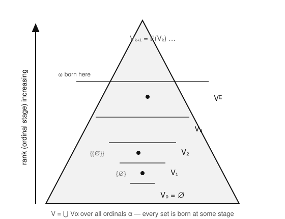

# Logic & Set Theory · Lesson 3.3: Infinity, Replacement & Foundation

> ⏱ ~15 min · Module 3: From Paradox to ZFC · Builds on: [Lesson 3.2](03-02-extensionality-to-power-set.md) (extensionality, pairing, union, power set, separation) · Unlocks: [Lesson 3.4](03-04-axiom-of-choice.md) (the Axiom of Choice)

## Why this matters

The axioms from Lesson 3.2 are stingy: pairing, union, power set, and separation only ever build *finite* sets out of finite sets, and they never rule out pathological objects like a set that contains itself. Three more axioms fix both gaps. **Infinity** hands you an actual infinite set — without it there is no $\mathbb{N}$, no $\mathbb{R}$, no analysis. **Replacement** lets you carry a set along a definable rule to build things power set alone can't reach, and it is the axiom that makes transfinite recursion legal in [Lesson 4.2](04-02-ordinals-transfinite-induction.md). **Foundation** organizes the entire universe into clean, non-circular layers, killing $x \in x$ once and for all. After this lesson you have all of ZF except Choice.

## The idea

Think of building the set-theoretic universe as stacking floors. Floor $0$ is empty. Each new floor holds every possible collection of things from the floors below. Keep stacking — and here's the leap — you're even allowed a floor "at infinity" that gathers everything from *all* the finite floors at once. The three axioms are the permissions you need for this construction:

- **Infinity** says: yes, you may take that step past all the finite floors. Concretely it hands you a set that starts with $\varnothing$ and is closed under "add one more," so it contains $0, 1, 2, 3, \dots$ all at once.
- **Replacement** says: if you have a set and a *rule* that renames each element to some other set, the collection of renamed elements is again a set. Rules can send you to floors far above where you started, so this reaches sets that just piling on power sets never will.
- **Foundation** says: the stacking has a bottom and never loops. Every nonempty set has a member that is "earliest" — built before all its siblings — so you can never have an infinite chain $\cdots \in x_2 \in x_1 \in x_0$ descending forever, and in particular no set is a member of itself.

The picture these three describe together is the **cumulative hierarchy**: the universe $V$ is exactly the union of all those floors.

## The formal version

First, how to *encode* numbers as sets, so that "infinite set" and "the natural numbers" become the same object. The **von Neumann ordinals** define each natural number to be the set of all smaller ones:
$$0 = \varnothing, \qquad n+1 = n \cup \{n\}.$$
So $1 = \{0\} = \{\varnothing\}$, $\;2 = \{0,1\} = \{\varnothing, \{\varnothing\}\}$, $\;3 = \{0,1,2\}$, and in general $n = \{0, 1, \dots, n-1\}$. The operation $S(x) := x \cup \{x\}$ is the **successor**. A set $I$ is **inductive** if $\varnothing \in I$ and $x \in I \Rightarrow S(x) \in I$.

**Axiom of Infinity.** There exists an inductive set:
$$\exists I \,\big(\varnothing \in I \;\land\; \forall x\,(x \in I \to x \cup \{x\} \in I)\big).$$
*In words:* some set contains $0$ and is closed under successor, so it contains every natural number.

An inductive $I$ may contain junk beyond the naturals, but separation (Lesson 3.2) carves out the smallest inductive set — the intersection of all inductive subsets of $I$ — which we name $\omega = \{0, 1, 2, 3, \dots\}$, the first infinite ordinal. That $\omega$ *exists* is the whole point of the axiom.

**Axiom Schema of Replacement.** If $\varphi(x, y)$ defines a function on a set $A$ — meaning for each $x \in A$ there is exactly one $y$ with $\varphi(x,y)$ — then the image $\{\, y : \exists x \in A\ \varphi(x,y)\,\}$ is a set.
*In words:* the image of a set under any definable function is again a set.

It's a *schema* (one axiom per formula $\varphi$) for the same reason separation is: you can't quantify over formulas inside the language. Separation lets you take a *subset* of an existing set; replacement is stronger — the image can consist of sets much "bigger" than anything in $A$. For instance, the sequence
$$\omega,\ \mathcal{P}(\omega),\ \mathcal{P}(\mathcal{P}(\omega)),\ \dots$$
is a definable rule on the set $\omega$ (send $n$ to the $n$-fold power set of $\omega$); replacement makes the *collection of all these* a set, which you can then union. No amount of pairing/union/power set applied to $\omega$ gets you that set in one legal move.

**Axiom of Foundation (Regularity).** Every nonempty set $x$ has a member $y \in x$ that is disjoint from $x$: $y \cap x = \varnothing$.
$$\forall x\,\big(x \neq \varnothing \to \exists y\,(y \in x \land y \cap x = \varnothing)\big).$$
*In words:* every nonempty set contains an $\in$-minimal element — one none of whose members are also in the set. Equivalently: there is no infinite descending membership chain $\cdots \in x_2 \in x_1 \in x_0$.

Foundation is the axiom that stratifies the universe. Define the stages by recursion on the ordinals (this recursion is itself *licensed by replacement*):
$$V_0 = \varnothing, \qquad V_{\alpha+1} = \mathcal{P}(V_\alpha), \qquad V_\lambda = \bigcup_{\alpha < \lambda} V_\alpha \ \ (\lambda \text{ a limit}),$$
and let $V = \bigcup_{\alpha} V_\alpha$. Foundation is exactly the statement that **every set lives in some $V_\alpha$** — the universe is nothing but this cumulative tower, no rogue self-membering sets floating outside it.

## Picture

Each floor $V_{\alpha+1}$ is *all subsets* of the floor below, so the cone widens fast. A set's **rank** is the first stage it appears in: $\varnothing$ has rank $0$, $\{\varnothing\}$ appears in $V_2$, and $\omega$ — the first set that needs the limit step — is born at $V_\omega$. Foundation says nothing lives outside the cone.

## Worked examples

**Example 1 (successor arithmetic, mechanically).** Compute $S(2)$ and confirm it is $3$. By definition $2 = \{0, 1\}$, so
$$S(2) = 2 \cup \{2\} = \{0,1\} \cup \{2\} = \{0, 1, 2\} = 3. \checkmark$$
Note the two faces of a von Neumann ordinal that make everything tick: $n$ is simultaneously an *element* of every larger ordinal and a *subset* of every larger ordinal ($2 \in 3$ and $2 \subseteq 3$). Membership *is* the order $<$ on $\omega$.

**Example 2 (why replacement earns its keep).** Build the set $V_{\omega + \omega}$'s little cousin: $\{\omega, \mathcal{P}(\omega), \mathcal{P}(\mathcal{P}(\omega)), \dots\}$, one set for each $n \in \omega$. Define $\varphi(n, y)$ to say "$y$ is the result of applying $\mathcal{P}$ to $\omega$ exactly $n$ times." This is a genuine function on the *set* $\omega$: each $n$ yields exactly one $y$. Replacement therefore delivers the image
$$A = \{\, \mathcal{P}^{(n)}(\omega) : n \in \omega \,\}$$
as a set. Now union it: $\bigcup A$ is a legal set too. Try to reach $A$ using only Lesson 3.2's axioms and you're stuck — power set gives you *one* level up at a time, pairing bundles two sets, but nothing assembles the infinite family in a single stroke. That gap is precisely what replacement fills, and it is the same move that will let [Lesson 4.2](04-02-ordinals-transfinite-induction.md) define functions by transfinite recursion.

**Worked theorem (Foundation $\Rightarrow$ no set satisfies $x \in x$).** Suppose, for contradiction, that some set $a$ satisfies $a \in a$. Form the singleton $x = \{a\}$ (legal by pairing: $\{a\} = \{a, a\}$). This $x$ is nonempty, so Foundation gives a member $y \in x$ with $y \cap x = \varnothing$. But $x = \{a\}$ has exactly one member, so $y = a$. Then $y \cap x = a \cap \{a\}$. Now our assumption $a \in a$ means $a$ is a member of $a$, and $a$ is also the sole member of $x = \{a\}$ — so $a$ is a common element of $a$ and $\{a\}$, giving $a \in a \cap \{a\}$. Thus $a \cap x \neq \varnothing$, i.e. $y \cap x \neq \varnothing$, contradicting the choice of $y$. Hence no such $a$ exists: $\forall x\, (x \notin x)$. $\blacksquare$

The same trick kills 2-cycles: if $a \in b$ and $b \in a$, apply Foundation to $\{a, b\}$ — neither $a$ nor $b$ can be the disjoint-from-$\{a,b\}$ member, contradiction.

## Watch out

- You might think the Axiom of Infinity directly asserts "$\omega$ exists," but it only asserts *some* inductive set exists — possibly cluttered with extra elements. You still need **separation** to trim it down to the least inductive set $\omega$. Infinity provides the raw material; separation shapes it.
- You might think replacement is just a fancier separation, but separation can only ever return a *subset* of a set you already have, while replacement's image can contain sets of far higher rank than anything in the domain. Separation shrinks; replacement can launch you upward.
- You might think Foundation forbids infinite sets or infinite chains of any kind — it doesn't. $\omega$ is infinite and perfectly legal. What's banned is an infinite chain *descending under $\in$*: $\cdots \in x_2 \in x_1 \in x_0$. Ascending is fine ($0 \in 1 \in 2 \in \cdots$); it's the bottomless descent that Foundation rules out.

## One-liner

> Infinity gives you $\omega$, Replacement lets a set's image be a set, and Foundation stacks the whole universe into ranked floors with no set inside itself.

## Problems

**P1 (🟢)** Working from $n+1 = n \cup \{n\}$, write out $4$ explicitly as a set of sets (all braces, no numerals), and verify that $3 \in 4$ and $3 \subseteq 4$ both hold.

**P2 (🟡)** Use Foundation to prove there is no 3-cycle of membership: no sets $a, b, c$ with $a \in b$, $b \in c$, and $c \in a$. (Hint: apply the axiom to the right three-element set.)

**P3 (🔴, optional)** Show that the successor operation is injective on $\omega$: if $S(m) = S(n)$ then $m = n$. You may use the result that no set is a member of itself. (This is one of the Peano axioms falling out of the von Neumann encoding.)

Solutions

**P1** Build up: $0 = \varnothing$, $1 = \{\varnothing\}$, $2 = \{\varnothing, \{\varnothing\}\}$, $3 = \{\varnothing, \{\varnothing\}, \{\varnothing, \{\varnothing\}\}\}$. Then $4 = 3 \cup \{3\}$, i.e. $4 = \{0,1,2,3\}$, spelled out:
$$4 = \big\{\ \varnothing,\ \{\varnothing\},\ \{\varnothing, \{\varnothing\}\},\ \{\varnothing, \{\varnothing\}, \{\varnothing, \{\varnothing\}\}\}\ \big\}.$$
- $3 \in 4$: the fourth element listed *is* $3$, so yes, $3$ is a member of $4$. ✓
- $3 \subseteq 4$: the elements of $3$ are $0, 1, 2$, and all three appear as elements of $4 = \{0,1,2,3\}$. So every member of $3$ is a member of $4$. ✓

(These two facts — $n \in n{+}1$ and $n \subseteq n{+}1$ — hold for every von Neumann ordinal, since $n+1 = n \cup \{n\}$ contains $n$ as an element and contains all of $n$'s elements too.)

**P2** Suppose such $a, b, c$ exist with $a \in b$, $b \in c$, $c \in a$. Form the set $x = \{a, b, c\}$ (legal by pairing + union, or the finite-set construction from Lesson 3.2). It's nonempty, so Foundation supplies a member $y \in x$ with $y \cap x = \varnothing$. Check each candidate:
- If $y = a$: since $c \in a$ and $c \in x$, we get $c \in a \cap x$, so $a \cap x \neq \varnothing$. Rejected.
- If $y = b$: since $a \in b$ and $a \in x$, we get $a \in b \cap x$, so $b \cap x \neq \varnothing$. Rejected.
- If $y = c$: since $b \in c$ and $b \in x$, we get $b \in c \cap x$, so $c \cap x \neq \varnothing$. Rejected.

Every member of $x$ meets $x$, so *no* $\in$-minimal member exists — contradicting Foundation. Hence no such 3-cycle exists. $\blacksquare$ (The same argument voids any finite membership cycle.)

**P3** Suppose $S(m) = S(n)$, i.e. $m \cup \{m\} = n \cup \{n\}$. We show $m = n$.

Since $m \in m \cup \{m\}$, we have $m \in n \cup \{n\}$, so either $m \in n$ or $m = n$. Symmetrically, from $n \in n \cup \{n\} = m \cup \{m\}$, either $n \in m$ or $n = m$.

If $m = n$ we're done. Otherwise both "$\in$" options must hold: $m \in n$ and $n \in m$. But that is a 2-cycle of membership, which Foundation forbids (shown in the lesson: apply Foundation to $\{m, n\}$ — neither element can be disjoint from the pair). Contradiction. Therefore $m = n$. $\blacksquare$

(Note where the axioms enter: the encoding gives $S(m) = m \cup \{m\}$, and Foundation rules out the $m \in n \in m$ escape. Without Foundation, injectivity of successor could actually fail for weird self-membering "numbers.")

## Flashback

**From [Lesson 3.2](03-02-extensionality-to-power-set.md) (Extensionality to Power Set):** Starting from $\varnothing$ alone and using only pairing, union, and power set, produce a set with exactly $4$ elements. State which axiom you use at each step.

Solution

One clean route:

1. **Pairing** on $\varnothing, \varnothing$ gives $\{\varnothing\}$ (a $1$-element set). Call it $a$.
2. **Pairing** on $\varnothing, a$ gives $\{\varnothing, \{\varnothing\}\}$, a $2$-element set. Call it $b$. (Its two members are distinct by extensionality: $\varnothing \neq \{\varnothing\}$, since $\varnothing$ has no members and $\{\varnothing\}$ has one.)
3. **Power set** of $b$: since $b$ has $2$ elements, $\mathcal{P}(b)$ has $2^2 = 4$ elements, namely
$$\mathcal{P}(b) = \big\{\ \varnothing,\ \{\varnothing\},\ \{\{\varnothing\}\},\ \{\varnothing, \{\varnothing\}\}\ \big\}.$$

That is a $4$-element set built with pairing (twice) and power set (once); union wasn't even needed here. All four listed subsets are pairwise distinct by extensionality, so the count is exactly $4$. ✓

(Alternatively: build $\{\varnothing\}$ and $\{\{\varnothing\}\}$ separately by pairing, pair *them* to get another $2$-element set, then use **union** to merge two $2$-element sets into a $4$-element one — provided they're disjoint.)

## Connections

- **Backward:** This lesson stands on [Lesson 3.2](03-02-extensionality-to-power-set.md) — separation trims the inductive set down to $\omega$, and pairing/power set generate each finite floor $V_{\alpha+1} = \mathcal{P}(V_\alpha)$. Foundation also finishes the job [Lesson 3.1](03-01-russells-paradox.md) started: Russell's paradox scared us off self-membering sets, and Foundation now *proves* $x \notin x$ outright.
- **Forward:** [Lesson 3.4](03-04-axiom-of-choice.md) adds the last ZFC axiom, Choice. And $\omega$, the successor operation, and Replacement-backed recursion are the launch pad for [Lesson 4.2](04-02-ordinals-transfinite-induction.md), where the von Neumann ordinals continue past $\omega$ into the transfinite and transfinite induction becomes a proof technique.
- **Sideways (analysis):** The set $\omega$ built here is the same $\mathbb{N}$ that [real-analysis](../../real-analysis/syllabus.md) takes as given when it constructs $\mathbb{R}$; the "some inductive set exists" axiom is the ultimate source of the natural numbers every limit and sequence argument relies on.
