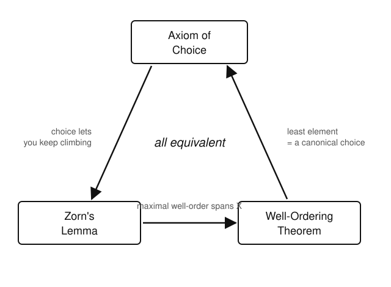

# Logic & Set Theory · Lesson 3.4: The Axiom of Choice & Its Equivalents

> ⏱ ~15 min · Module 3: From Paradox to ZFC · Builds on: [Lesson 3.3](03-03-infinity-replacement-foundation.md) (Infinity, Replacement, Foundation) · Unlocks: [Lesson 4.1](04-01-relations-orderings-well-ordering.md) (relations, orderings & well-ordering)

## Why this matters

Every one of the previous ZFC axioms tells you a *specific* set exists — a pair, a union, a power set, an infinite set. The Axiom of Choice is different: it asserts a set exists *without telling you a single one of its members*. That non-constructive flavor makes it the most argued-over axiom in mathematics, and also one of the most useful: it's the hidden engine behind "every vector space has a basis," "every ring has a maximal ideal," and "every product topology is compact" (Tychonoff). If you've ever waved your hand and "just picked one from each," you were using Choice. This lesson pins down what you were assuming — and shows it wears two other disguises, Zorn's lemma and the well-ordering theorem, that you'll reach for constantly in later courses.

## The idea

Suppose I hand you infinitely many nonempty boxes and ask you to pick exactly one item from each, all at once. If the boxes come with a rule — "take the smallest number in each" — you're fine, no axiom needed. The trouble is when there's *no rule*: infinitely many pairs of identical socks, say, with nothing to distinguish left from right. Can you still form a set holding one sock from each pair?

Intuition says yes, of course. But "of course" is doing real work: you're asserting the existence of a **selection** with no formula defining it. That assertion is the Axiom of Choice. For finitely many boxes it's a theorem (just pick, one at a time — ordinary logic). For infinitely many boxes, "pick from each" is not something the other axioms give you, and Choice is exactly the axiom that says you may.

The surprise is that this humble-sounding selection principle is *logically identical* to two statements that look nothing like it: **Zorn's lemma** (a maximality principle) and the **well-ordering theorem** (every set can be lined up so every nonempty piece has a least element). Assume any one, prove the other two.

## The formal version

**Axiom of Choice (AC), choice-function form.** For any family $\{A_i\}_{i \in I}$ of nonempty sets, there is a function $f : I \to \bigcup_{i\in I} A_i$ with $f(i) \in A_i$ for every $i \in I$. Such an $f$ is a **choice function**.

*In words:* one function that reaches into every box at once and pulls out a legal element.

Two equivalent phrasings you'll meet everywhere — each is a one-line restatement of the same content:

- **Right-inverse form.** Every surjection $g : X \to Y$ has a *right inverse*: a function $s : Y \to X$ with $g \circ s = \operatorname{id}_Y$. (Choose one preimage $s(y) \in g^{-1}(y)$ from each nonempty fiber.)
- **Nonempty-product form.** If every $A_i$ is nonempty, then the product $\prod_{i \in I} A_i \neq \varnothing$. (An element of the product *is* literally a choice function $i \mapsto f(i) \in A_i$ — same object, different notation.)

**Zorn's Lemma.** Let $(P, \le)$ be a nonempty partially ordered set in which every **chain** (a totally ordered subset $C \subseteq P$) has an upper bound in $P$. Then $P$ has a **maximal element** — an $m \in P$ with no $x \in P$ satisfying $m < x$.

*In words:* if every "tower" inside your poset is capped, then the poset has a top-most element you can't climb past. Note "maximal" means nothing sits strictly above it — not that it sits above everything.

**Well-Ordering Theorem.** Every set $X$ admits a **well-ordering**: a total order $\preceq$ on $X$ under which every nonempty subset has a $\preceq$-least element.

*In words:* any set — even $\mathbb{R}$ — can be relabeled so that "the smallest one remaining" always makes sense, exactly as it does for $\mathbb{N}$.

**Theorem (the equivalence).** Over the other axioms of ZF,
$$\text{AC} \iff \text{Zorn's Lemma} \iff \text{Well-Ordering Theorem}.$$

We sketch the cycle $\text{AC} \Rightarrow \text{Zorn} \Rightarrow \text{Well-ordering} \Rightarrow \text{AC}$ at the level of *why*, not full transfinite bookkeeping (that waits for ordinals in [Lesson 4.2](04-02-ordinals-transfinite-induction.md)).

- **AC $\Rightarrow$ Zorn.** Suppose $P$ had *no* maximal element. Then above every $x$ sits at least one strictly larger element, so the set of strict upper bounds of $x$ is nonempty. A choice function picks one for you, so you can always "take a step up." Start anywhere and keep stepping — through limit stages take the upper bound of the chain so far (guaranteed by hypothesis) and step again. This manufactures a strictly increasing chain indexed by *every* ordinal, injecting a proper class of ordinals into the set $P$ — impossible. So a maximal element must exist.
- **Zorn $\Rightarrow$ Well-ordering.** Order the *partial well-orderings of subsets of $X$* by end-extension (one extends another by appending new elements on top). Every chain of these has an upper bound — their union is again a well-ordering. Zorn hands you a maximal well-ordered piece; if it missed some $x \in X$, you could append $x$ on top and extend, contradicting maximality. So the maximal piece is all of $X$, now well-ordered.
- **Well-ordering $\Rightarrow$ AC.** Well-order $\bigcup_i A_i$. Define $f(i) = $ the $\preceq$-least element of $A_i$. Every $A_i$ is a nonempty subset, so it *has* a least element — a canonical, formula-given choice. That's your choice function.

## Picture

The three faces of one axiom — assume any box, derive the other two around the cycle:

## Worked examples

**Example 1 (a choice function with no formula).** Consider the family of *all* nonempty subsets of $\mathbb{R}$: $\{A_i\}$ where $i$ ranges over $A_i \in \mathcal{P}(\mathbb{R}) \setminus \{\varnothing\}$. Is there a function assigning to each nonempty $A \subseteq \mathbb{R}$ some element $f(A) \in A$?

For subsets of $\mathbb{N}$ this is trivial: $f(A) = \min A$ works because $\mathbb{N}$ is well-ordered. But $\mathbb{R}$ under its usual order is *not* well-ordered — the open interval $(0,1)$ has no least element — so "take the min" fails, and there's no other explicit rule known. AC (equivalently, the well-ordering theorem) nonetheless guarantees $f$ exists: well-order $\mathbb{R}$ by some $\preceq$, and set $f(A) = \preceq\text{-least element of } A$. We can prove $f$ exists without ever exhibiting the values it takes — the signature move of a non-constructive axiom.

**Example 2 (Zorn produces a maximal object: every vector space has a basis).** Let $V$ be a vector space over a field $\mathbb{F}$. Claim: $V$ has a basis. Here is the whole Zorn template, with the chain step done explicitly.

*Set up the poset.* Let
$$P = \{\, S \subseteq V : S \text{ is linearly independent} \,\}, \qquad \text{ordered by } \subseteq.$$
$P$ is nonempty: $\varnothing \in P$ (the empty set is vacuously independent).

*Check the chain hypothesis — the crux.* Let $\mathcal{C} = \{S_j\}_{j}$ be a chain in $P$, and put $U = \bigcup_j S_j$. We must show $U \in P$, i.e. $U$ is linearly independent, so that $U$ is an upper bound for $\mathcal{C}$. Take any finite subset $\{v_1, \dots, v_n\} \subseteq U$. Each $v_k$ lies in some $S_{j_k}$. Because $\mathcal{C}$ is a chain, the finitely many sets $S_{j_1}, \dots, S_{j_n}$ are linearly ordered by $\subseteq$, so *one of them contains all the others* — call it $S^*$. Then $v_1, \dots, v_n \in S^*$, and $S^*$ is linearly independent, so no nontrivial combination of $v_1,\dots,v_n$ vanishes. Every finite subset of $U$ is independent, hence $U$ is linearly independent. So $U \in P$ and $U \supseteq S_j$ for all $j$: an upper bound. *(This "a finite subset lands inside a single member of the chain" step is the reusable heart of almost every Zorn argument.)*

*Apply Zorn.* Every chain has an upper bound, so $P$ has a maximal element $B$.

*Read off the conclusion.* $B$ is a basis. It's independent by membership in $P$; it spans because if some $v \in V$ were *not* in $\operatorname{span}(B)$, then $B \cup \{v\}$ would still be linearly independent (a standard fact), contradicting the maximality of $B$. So $\operatorname{span}(B) = V$, and $B$ is a basis. $\blacksquare$

The exact same three moves — poset of "partial gadgets," union-of-a-chain is an upper bound, maximal element is total/spanning/complete — prove that every ring with $1 \neq 0$ has a maximal ideal (Problem 2), that every filter extends to an ultrafilter, and that every field has an algebraic closure.

## Watch out

- **You might think** "AC just says pick one, that's obvious." **Actually** it's obvious *only* for finitely many sets, where ordinary $\exists$-elimination does the job step by step. The content of AC is doing infinitely many independent picks *simultaneously* with no unifying rule. Choosing from one nonempty set is never AC.
- **You might think** a maximal element is a maximum (greatest) element. **Actually** "maximal" means nothing is strictly *above* it; a poset can have many maximal elements and no greatest one. Zorn delivers *a* maximal element, not a top of the whole order.
- **You might think** the well-ordering theorem lets you write down $\mathbb{R}$'s least element or "the next real after $0$." **Actually** it only asserts a well-order *exists*; it's provably impossible to define one explicitly in ZFC. Existence without construction, again.
- **The weirdness, in one line:** AC implies the **Banach–Tarski paradox** — a solid ball can be cut into finitely many pieces and reassembled by rigid motions into *two* balls each the size of the original. The pieces are non-measurable sets built by choosing one point per orbit; you can prove they exist but never draw them.

## One-liner

> The Axiom of Choice is the right to pick one from each of infinitely many boxes with no rule — and that single right is exactly Zorn's "every capped tower has a top" and the power to well-order any set at all.

## Problems

**P1 (🟢)** Let $g : X \to Y$ be a surjection, and assume a choice function $f$ on the family $\{\, g^{-1}(y) : y \in Y \,\}$ of fibers. Construct an explicit right inverse $s : Y \to X$ and verify $g \circ s = \operatorname{id}_Y$. Then say in one sentence why the fibers being nonempty is where surjectivity is used.

**P2 (🟡)** Let $R$ be a ring with identity $1 \neq 0$. Use Zorn's lemma to prove $R$ has a maximal ideal. Set up the poset of *proper* ideals ordered by $\subseteq$, show the union of a chain of proper ideals is again a proper ideal (this is the step that needs an idea), and conclude. Which single fact keeps the union *proper*?

**P3 (🔴, optional)** Prove **Zorn $\Rightarrow$ AC** directly, without routing through well-ordering. Given a family $\{A_i\}_{i \in I}$ of nonempty sets, apply Zorn to the poset of *partial* choice functions (functions $p$ defined on some $J \subseteq I$ with $p(i) \in A_i$), ordered by extension. Show a maximal such $p$ must be defined on all of $I$. Where — and why — is it legitimate to "pick an element" in the maximality step without already having AC?

Solutions

**P1** Define $s(y) = f\big(g^{-1}(y)\big)$. Since $g$ is surjective, each fiber $g^{-1}(y)$ is a nonempty subset of $X$, so it's a legal input to the choice function $f$, and $f\big(g^{-1}(y)\big) \in g^{-1}(y)$. Thus $s(y) \in g^{-1}(y)$, which by definition of the fiber means $g\big(s(y)\big) = y$. As this holds for every $y \in Y$, we have $g \circ s = \operatorname{id}_Y$. $\blacksquare$
Surjectivity is used precisely to guarantee every fiber is nonempty; if some $y$ had $g^{-1}(y) = \varnothing$, there would be nothing to choose and no right inverse could exist.

**P2** Let $P = \{\, I \subsetneq R : I \text{ is an ideal} \,\}$, the *proper* ideals, ordered by $\subseteq$. Recall an ideal $I$ is proper iff $1 \notin I$ (if $1 \in I$ then $r = r\cdot 1 \in I$ for all $r$, so $I = R$). $P$ is nonempty since the zero ideal $(0)$ is proper ($1 \neq 0$).

*Chain hypothesis.* Let $\mathcal{C} = \{I_\alpha\}$ be a chain in $P$ and $U = \bigcup_\alpha I_\alpha$. First, $U$ is an ideal: given $a, b \in U$, both lie in some single $I_\alpha$ (chain: one member contains both), so $a - b \in I_\alpha \subseteq U$; and for $r \in R$, $ra, ar \in I_\alpha \subseteq U$. Second, $U$ is *proper*: $1 \notin I_\alpha$ for every $\alpha$, so $1 \notin U$. Hence $U \in P$, and it is an upper bound for $\mathcal{C}$.

*Apply Zorn.* $P$ is nonempty and every chain has an upper bound, so $P$ has a maximal element $M$ — a proper ideal with no proper ideal strictly containing it. That is exactly a maximal ideal. $\blacksquare$
The single fact keeping the union proper is that **$1$ lies outside every member of the chain**, so it lies outside their union; without an identity to exclude, "proper" could collapse in the limit.

**P3** Let $P$ be the set of *partial choice functions*: functions $p$ with domain $J = \operatorname{dom}(p) \subseteq I$ and $p(i) \in A_i$ for all $i \in J$. Order by extension: $p \le q$ iff $\operatorname{dom}(p) \subseteq \operatorname{dom}(q)$ and $q$ agrees with $p$ on $\operatorname{dom}(p)$. $P$ is nonempty: the empty function $\varnothing$ (domain $\varnothing$) is a partial choice function.

*Chain hypothesis.* Let $\mathcal{C} = \{p_\alpha\}$ be a chain and let $p = \bigcup_\alpha p_\alpha$ (union of their graphs). This $p$ is a *function*: if $(i, a), (i, a') \in p$, they come from some $p_\alpha, p_\beta$, and since $\mathcal{C}$ is a chain one extends the other, forcing $a = a'$. Its domain is $\bigcup_\alpha \operatorname{dom}(p_\alpha)$ and $p(i) \in A_i$ wherever defined, so $p \in P$; it extends every $p_\alpha$, an upper bound.

*Apply Zorn.* $P$ has a maximal element $p^*$. Suppose $\operatorname{dom}(p^*) \neq I$; pick any $i_0 \in I \setminus \operatorname{dom}(p^*)$. Since $A_{i_0}$ is nonempty, it *has* an element $a$; extend $p^*$ to $p^{**}$ by setting $p^{**}(i_0) = a$. Then $p^{**} \in P$ and $p^* < p^{**}$, contradicting maximality. So $\operatorname{dom}(p^*) = I$: a full choice function. $\blacksquare$
The "pick $a \in A_{i_0}$" step is legitimate because it's a *single* choice from *one* nonempty set — that's ordinary $\exists$-elimination, valid in plain logic. AC is only about making infinitely many such choices *simultaneously and coherently*, which is precisely what Zorn assembled for us in one shot as $p^*$.

## Flashback

**From [Lesson 3.3](03-03-infinity-replacement-foundation.md) (Infinity, Replacement & Foundation):** The Axiom of Foundation says every nonempty set $S$ has an element $m \in S$ with $m \cap S = \varnothing$ (an $\in$-minimal member). Use it to prove there is no pair of sets $x, y$ with $x \in y$ **and** $y \in x$ (no "membership 2-cycle"). *(A fresh variant of the standard "no $x \in x$" result.)*

Solution

Suppose, for contradiction, that $x \in y$ and $y \in x$. By Pairing the set $S = \{x, y\}$ exists. Apply Foundation to $S$: it has an $\in$-minimal element $m \in \{x,y\}$ with $m \cap S = \varnothing$. There are two cases.

- If $m = x$: then $x \cap S = \varnothing$. But $y \in x$ (hypothesis) and $y \in S$, so $y \in x \cap S$, contradicting $x \cap S = \varnothing$.
- If $m = y$: then $y \cap S = \varnothing$. But $x \in y$ (hypothesis) and $x \in S$, so $x \in y \cap S$, contradicting $y \cap S = \varnothing$.

Either way we reach a contradiction, so no such $x, y$ exist. $\blacksquare$
(The special case $x = y$ recovers "no set satisfies $x \in x$": apply Foundation to $\{x\}$ and the same argument forbids $x \in x$.)

## Connections

- **Backward:** This completes the ZFC axiom list begun in [Lesson 3.2](03-02-extensionality-to-power-set.md) and [Lesson 3.3](03-03-infinity-replacement-foundation.md). Choice sits apart from the rest — the "C" in ZFC — because it alone asserts existence without construction; the Foundation axiom from 3.3 reappears above in the flashback.
- **Forward:** The well-ordering theorem is what makes [Lesson 4.1](04-01-relations-orderings-well-ordering.md) and the ordinals of [Lesson 4.2](04-02-ordinals-transfinite-induction.md) apply to *every* set, not just the naturally-ordered ones; the transfinite "keep climbing" step sketched in AC $\Rightarrow$ Zorn is made rigorous there via transfinite recursion.
- **Sideways (the Zorn bridge):** The Example 2 / Problem 2 template — *poset of partial gadgets → union of a chain is an upper bound → maximal element is the object you wanted* — is exactly how [topology](../../topology/syllabus.md) produces maximal filters (ultrafilters) and how [real-analysis](../../real-analysis/syllabus.md) and algebra produce Hamel bases and maximal ideals. Learn the move once here; you will run it a dozen times across those courses.
