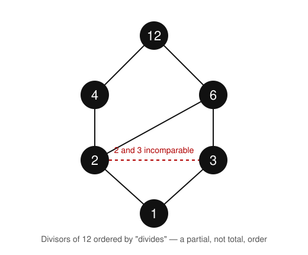

# Logic & Set Theory · Lesson 4.1: Relations, Orderings & Well-Ordering

> ⏱ ~15 min · Module 4: Ordinals, Cardinals & the Infinite · Builds on: 3.4 ([The Axiom of Choice & Its Equivalents](03-04-axiom-of-choice.md)) · Unlocks: 4.2 ([Ordinals & Transfinite Induction](04-02-ordinals-transfinite-induction.md))

## Why this matters

To count *past* infinity — the whole point of this module — you first need to know what "in order" even means, and which orders are strong enough to count along. That strongest kind is a **well-ordering**, and it is not a technicality: it is the exact structural fact that makes induction and recursion legitimate. Once you see *why* you can do induction on $\mathbb{N}$ but not on $\mathbb{Z}$ or $\mathbb{Q}$, the ordinals of Lesson 4.2 stop being mysterious — they are just the well-orderings, catalogued. The Axiom of Choice you met in 3.4 promised that *every* set can be well-ordered; this lesson is what that promise is a promise *about*.

## The idea

A **relation** is the humblest object in mathematics: a yes/no answer to "does $x$ relate to $y$?" for every pair. Formally it is just the set of pairs where the answer is yes. "$<$", "$\subseteq$", "is a sibling of", "divides" — all the same species.

**Orders** are the relations that behave like "$\le$": you can compare things, and comparisons stack up without contradicting themselves. Two flavors:

- A **partial order** lets some pairs be *incomparable*. Subset inclusion $\subseteq$ is the model: $\{a\}$ and $\{b\}$ are neither $\subseteq$ the other, yet everything is still consistently arranged. "Divides" on the whole numbers is another: $2$ and $3$ just don't compare.
- A **total (linear) order** lines everyone up single file — any two elements compare. "$\le$" on the real line is the model.

A **well-ordering** is a total order with one extra, decisive property: *no bottomless pits*. Every nonempty chunk of the set has a smallest element. Equivalently — and this is the version to keep in your pocket — you can never fall forever: there is no infinite strictly-descending sequence $x_0 > x_1 > x_2 > \cdots$. That missing bottom is precisely the foothold induction needs. If you *could* descend forever, "smallest counterexample" arguments would loop; because you can't, they terminate.

## The formal version

Fix a set $A$. A **binary relation on $A$** is a subset $R \subseteq A \times A$; we write $x \mathbin{R} y$ for $(x,y) \in R$. The properties that matter:

| name | condition (for all $x,y,z \in A$) |
|---|---|
| reflexive | $x \mathbin{R} x$ |
| irreflexive | never $x \mathbin{R} x$ |
| symmetric | $x \mathbin{R} y \Rightarrow y \mathbin{R} x$ |
| antisymmetric | $x \mathbin{R} y \text{ and } y \mathbin{R} x \Rightarrow x = y$ |
| transitive | $x \mathbin{R} y \text{ and } y \mathbin{R} z \Rightarrow x \mathbin{R} z$ |

**Definition (partial order).** A **(non-strict) partial order** is a relation that is reflexive, antisymmetric, and transitive; the pair $(A, \le)$ is a **poset**. Its **strict** version $x < y$ means $x \le y$ and $x \ne y$; a strict order is irreflexive and transitive.

*In words:* $\le$ arranges $A$ consistently, but may leave some pairs unranked.

**Definition (total order).** A partial order is **total** (or **linear**) if it also satisfies **comparability**: for all $x,y$, either $x \le y$ or $y \le x$. Equivalently the strict order obeys **trichotomy**: exactly one of $x < y$, $x = y$, $y < x$ holds.

*In words:* everyone is on one line; no two elements dodge comparison.

**Definition (well-ordering).** A total order $(A, \le)$ is a **well-ordering** if every nonempty subset $S \subseteq A$ has a **least element** — an $m \in S$ with $m \le x$ for all $x \in S$.

*In words:* not just the whole set, but *any* piece of it, has a genuine bottom.

Two remarks that carry real weight:

**"Least" is stronger than "minimal," and it forces totality.** In a poset a *minimal* element of $S$ has nothing strictly below it inside $S$ — but there may be several, sitting in incomparable heaps. A *least* element sits below *everything* in $S$, so it is unique when it exists. Demanding a *least* element of every nonempty subset is so strong that totality comes for free: apply it to a two-element subset $\{a,b\}$ and its least element makes $a,b$ comparable (you prove this in P2). So one may equally define a well-order as *any* partial order in which every nonempty subset has a least element.

**The no-descent characterization.** A total order is a well-order **iff** it admits no infinite strictly-descending sequence $x_0 > x_1 > x_2 > \cdots$. ($\Rightarrow$) such a sequence's range would be a nonempty subset with no least element. ($\Leftarrow$) if some nonempty $S$ had no least element, then from any $x_0 \in S$ you could always pick a strictly smaller $x_1 \in S$, and so on forever — building the forbidden descent. (That reverse direction quietly uses a mild choice principle, dependent choice — a cousin of the Axiom of Choice from 3.4.)

**Definition (order isomorphism, order type).** Posets $(A, \le_A)$ and $(B, \le_B)$ are **order-isomorphic** if there is a bijection $f: A \to B$ with $x \le_A y \iff f(x) \le_B f(y)$ for all $x,y$ — a relabeling that preserves the order both ways. An **order type** is an isomorphism class: two orders share an order type exactly when they are "the same shape." The order types of *well*-orderings are what Lesson 4.2 will name the **ordinals**.

## Picture

This is a **Hasse diagram**: draw $a$ below $b$ with a line whenever $b$ *covers* $a$ (that is, $a < b$ with nothing strictly between), and read every other relation off by following lines *upward* through transitivity. Here $A = \{1,2,3,4,6,12\}$ ordered by "divides." You can see $1 \mid 12$ without a direct edge — the path $1 \to 2 \to 4 \to 12$ carries it. What you *cannot* find is any path between $2$ and $3$: neither divides the other, so they are **incomparable**. One incomparable pair is all it takes: divisibility is a partial order, not a total one. (Contrast $(\mathbb{N}, \le)$, whose Hasse diagram is a single vertical ladder — the visual signature of a total order.)

## Worked examples

**Example 1 (checking the axioms).** Is divisibility a partial order on $\mathbb{Z}^+ = \{1,2,3,\dots\}$? Check each axiom against the definition $a \mid b \iff b = ak$ for some $k \in \mathbb{Z}$.

- *Reflexive:* $a \mid a$ since $a = a \cdot 1$. ✓
- *Antisymmetric:* if $a \mid b$ and $b \mid a$ with $a,b > 0$, then $b = ak$ and $a = bj$, so $a = akj$, giving $kj = 1$; for positive integers this forces $k = j = 1$, hence $a = b$. ✓ *(This is exactly why we restrict to positives — on all of $\mathbb{Z}$, $2 \mid -2$ and $-2 \mid 2$ but $2 \ne -2$, so antisymmetry fails and it's only a preorder.)*
- *Transitive:* $a \mid b$ and $b \mid c$ give $b = ak$, $c = bm$, so $c = a(km)$, i.e. $a \mid c$. ✓

So $(\mathbb{Z}^+, \mid)$ is a poset. Is it **total**? No: $2 \nmid 3$ and $3 \nmid 2$, so $2$ and $3$ are incomparable — comparability fails. It is a genuine *partial* order, exactly as the picture shows.

**Example 2 (is it a well-order?).** Compare three total orders on subsets of the integers.

- $(\mathbb{N}, <)$ with $\mathbb{N} = \{0,1,2,\dots\}$ **is** a well-order. Any nonempty $S \subseteq \mathbb{N}$ has a least element — this is the Least Number Principle, the twin of ordinary induction. Order type: call it $\omega$.
- $(\mathbb{Z}, <)$ is total but **not** a well-order. The failing subset is $\mathbb{Z}$ itself (or just the negatives $\{-1,-2,-3,\dots\}$): there is no smallest integer — $\cdots < -3 < -2 < -1$ descends forever. *This is precisely why you cannot run plain induction on $\mathbb{Z}$:* "smallest counterexample" has no anchor.
- Now the punchline. Well-ordering is a property of the **order, not the set**. Re-list the *same* integers in the sequence
$$0,\ 1,\ -1,\ 2,\ -2,\ 3,\ -3,\ \dots$$
and order them by *position in this list*. This is a total order on $\mathbb{Z}$ in which every nonempty subset has a least element (the one appearing earliest), so it **is** a well-order — of order type $\omega$. Same underlying set, and $(\mathbb{Z}, <)$ fails while this reordering succeeds. The Well-Ordering Theorem of Lesson 3.4 guarantees such a rescue always exists: *every* set admits *some* well-ordering, even $\mathbb{R}$ — though no one can write one down explicitly.

## Watch out

- **Antisymmetric is not "not symmetric."** Antisymmetry says $x \mathbin{R} y$ *and* $y \mathbin{R} x$ can only happen when $x = y$. Equality $=$ is simultaneously symmetric *and* antisymmetric — no contradiction. Orders are antisymmetric; equivalence relations are symmetric; don't conflate the two words.
- **Total order $\ne$ well-order.** $(\mathbb{R}, <)$, $(\mathbb{Z}, <)$, and $(\mathbb{Q}_{\ge 0}, <)$ are all perfectly total, yet none is well-ordered. For $\mathbb{Q}_{\ge 0}$ the failing subset is the *positive* rationals $\{q \in \mathbb{Q} : q > 0\}$: it has no least element, since for any $q > 0$ the number $q/2$ is smaller and still positive. Note $\mathbb{Q}_{\ge 0}$ *does* have an overall least element, $0$ — well-ordering demands a least element for *every* subset, and this one subset already sinks it.
- **Minimal $\ne$ least in a partial order.** In the divisors-of-$12$ poset with $1$ removed, both $2$ and $3$ are *minimal* (nothing below them), but neither is *least* (neither is below the other). "Least" requires comparability with everything; a well-order, needing a least element in every subset, can have no such ambiguity.

## One-liner

> A well-ordering is a total order with no bottomless descent — and that guaranteed foothold at the bottom of every subset is exactly what lets induction catch and hold.

## Problems

**P1 (🟢)** On $\mathbb{Z}$, define $a \mathbin{R} b$ to mean $|a| \le |b|$. Check reflexivity, antisymmetry, and transitivity. Which one fails? Give an explicit counterexample, and name what kind of relation $R$ is (it satisfies all order axioms *except* the one that fails).

**P2 (🟡)** Let $(P, \le)$ be a poset in which *every* nonempty subset has a least element. Prove that $\le$ is total. (This is the "totality comes for free" fact from the notes — it justifies defining well-orders without separately assuming totality.)

**P3 (🔴, optional)** For each order below, decide whether it is a well-order; if not, exhibit a nonempty subset with no least element.
(a) $\mathbb{N} \times \mathbb{N}$ under the **lexicographic** order: $(a,b) \le (c,d)$ iff $a < c$, or ($a = c$ and $b \le d$).
(b) The set $\{\,1/n : n \in \mathbb{Z}^+\,\} = \{1, \tfrac12, \tfrac13, \dots\}$ under the usual $<$.

Solutions

**P1** Write $b = ak$-style checks directly from $|a| \le |b|$.
- *Reflexive:* $|a| \le |a|$ always. ✓
- *Transitive:* $|a| \le |b|$ and $|b| \le |c|$ give $|a| \le |c|$ by transitivity of $\le$ on reals. ✓
- *Antisymmetric:* **fails.** Take $a = 1$, $b = -1$: $|1| \le |-1|$ and $|-1| \le |1|$ both hold (both are $1 \le 1$), yet $1 \ne -1$.

So $R$ is reflexive and transitive but not antisymmetric. A reflexive, transitive relation is a **preorder**; because it is also comparable (for any $a,b$, one of $|a|\le|b|$, $|b|\le|a|$ holds), $R$ is a **total preorder** — an order in which "ties" ($a \ne b$ but $|a| = |b|$) are allowed. Quotienting by the tie relation $|a| = |b|$ recovers a genuine total order on the absolute values.

**P2** Let $a, b \in P$ be arbitrary. The subset $S = \{a, b\}$ is nonempty, so by hypothesis it has a least element $m \in S$ satisfying $m \le a$ and $m \le b$. Since $m \in \{a,b\}$, either $m = a$ or $m = b$.
- If $m = a$: then $a \le b$.
- If $m = b$: then $b \le a$.

Either way $a$ and $b$ are comparable. As $a, b$ were arbitrary, $\le$ is total. $\blacksquare$

**P3**
(a) **It is a well-order.** Let $S \subseteq \mathbb{N} \times \mathbb{N}$ be nonempty. Let $a^* = \min\{a : (a,b) \in S \text{ for some } b\}$ — this minimum exists because the first coordinates form a nonempty subset of $\mathbb{N}$, which is well-ordered. Among the pairs in $S$ with first coordinate $a^*$, let $b^* = \min\{b : (a^*, b) \in S\}$, again existing by well-ordering of $\mathbb{N}$. Then $(a^*, b^*) \in S$, and it is the least element: any $(c,d) \in S$ has $c \ge a^*$, and if $c = a^*$ then $d \ge b^*$ — exactly the lexicographic condition $(a^*,b^*) \le (c,d)$. So $S$ has a least element; the order is a well-order. *(Its order type, "$\omega$ copies of $\omega$ stacked end to end," is the ordinal $\omega \cdot \omega = \omega^2$ you'll meet in 4.2.)*

(b) **Not a well-order.** Take the whole set $S = \{1, \tfrac12, \tfrac13, \dots\}$. It has no least element: for any $\tfrac1n \in S$, the element $\tfrac{1}{n+1} \in S$ is strictly smaller. Equivalently, $1 > \tfrac12 > \tfrac13 > \cdots$ is an infinite strictly-descending sequence — the forbidden descent. (This set is order-isomorphic to $\mathbb{N}$ *reversed*, the mirror image of $\omega$, which is the canonical non-well-order.)

## Flashback

**From Lesson 3.4 (The Axiom of Choice & Its Equivalents):** Recall that AC, Zorn's lemma, and the Well-Ordering Theorem are equivalent, and that **Zorn's lemma** says: if $(P, \le)$ is a nonempty poset in which every *chain* (totally ordered subset) has an upper bound in $P$, then $P$ has a **maximal element**. Use Zorn to prove the **order-extension principle**: every partial order $\le$ on a set $A$ can be extended to a *total* order $\preceq$ on $A$ (meaning $x \le y \Rightarrow x \preceq y$, and $\preceq$ is total).

Solution

Let $\mathcal{P}$ be the set of all partial orders on $A$ that **contain** $\le$ (viewing each order as its set of pairs), ordered by inclusion $\subseteq$. It is nonempty since $\le \in \mathcal{P}$.

*Chains have upper bounds.* Let $\mathcal{C} \subseteq \mathcal{P}$ be a chain, and set $U = \bigcup \mathcal{C}$. Then $U$ contains $\le$, and $U$ is itself a partial order: it is reflexive (each member is), and for antisymmetry/transitivity note that any *two* pairs of $U$ lie in a common member of $\mathcal{C}$ (the larger of the two orders that contain them, which exists because $\mathcal{C}$ is a chain), where those axioms already hold. So $U \in \mathcal{P}$ is an upper bound for $\mathcal{C}$.

*Apply Zorn.* $\mathcal{P}$ has a **maximal** element $M$ — a partial order extending $\le$ that cannot be enlarged.

*Maximal forces total.* Suppose $M$ were not total: some $a, b$ are $M$-incomparable. Form $M'$ by adding the pair $(a,b)$ and taking the transitive closure. A cycle (which would break antisymmetry) could only arise if $b \le_M a$ already held — but incomparability rules that out — so $M'$ is again a partial order, and it properly contains $M$. That contradicts maximality of $M$. Hence $M$ is total, and $\preceq \; := M$ is the desired total extension of $\le$. $\blacksquare$

This is Zorn's lemma in its characteristic role — manufacturing a **maximal object** you could never build by hand — the same move that produces bases of vector spaces, maximal ideals in rings, and (Lesson 4.2) the machinery behind the ordinals.

## Connections

- **Backward:** this rests on 3.4's [Well-Ordering Theorem](03-04-axiom-of-choice.md) — that lesson *asserted* every set can be well-ordered; this one defines the property being asserted and shows why it is the special one. The divisibility example reuses the transitivity proof from `number-theory` Lesson 1.1.
- **Forward:** Lesson 4.2 ([Ordinals & Transfinite Induction](04-02-ordinals-transfinite-induction.md)) makes the *order types of well-orderings* into concrete objects, the ordinals, and turns "no infinite descent" into transfinite induction and recursion — the engines that count past $\omega$.
- **Sideways (Zorn everywhere):** the flashback's order-extension proof is the same maximal-object machine that gives every vector space a basis and every ring a maximal ideal — bridges you'll cross again in [topology](../../topology/syllabus.md) (maximal filters/ultrafilters, bases) and [real-analysis](../../real-analysis/syllabus.md). Whenever you hear "there exists a maximal $\dots$," suspect Zorn.
