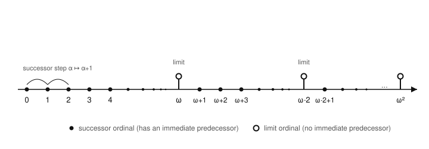

# Logic & Set Theory · Lesson 4.2: Ordinals & Transfinite Induction

> ⏱ ~15 min · Module 4: Ordinals, Cardinals & the Infinite · Builds on: [Lesson 4.1](04-01-relations-orderings-well-ordering.md) (well-orderings, order isomorphism), [Lesson 3.3](03-03-infinity-replacement-foundation.md) (Infinity, Replacement) · Unlocks: [Lesson 4.3](04-03-cardinals-cantors-theorem.md) (cardinals & Cantor's theorem)

## Why this matters

Ordinary induction proves a statement for all of $\mathbb{N}$ by climbing $0, 1, 2, \dots$ one step at a time. But some structures are longer than $\mathbb{N}$: you climb through *all* the naturals, reach a first "infinity-th" stage, and keep climbing. The cumulative hierarchy $V_\alpha$ from [Lesson 3.3](03-03-infinity-replacement-foundation.md) is built exactly this way, and so are constructions all over mathematics — the Borel sets of [real-analysis](../../real-analysis/syllabus.md), derived sequences in set-theoretic topology, the ranks that make every set well-founded. To prove things about these you need induction that survives the jump past infinity. The **ordinals** are the numbers that measure "how far along" you are, and **transfinite induction** is the proof technique that rides them.

## The idea

Count normally: $0, 1, 2, 3, \dots$. Now imagine you've finished *all* of them. Instead of stopping, invent a new number that sits immediately *after* the entire sequence — call it $\omega$. It is not any particular natural; it's the first number past all of them. Then keep going: $\omega+1, \omega+2, \dots$, exhaust those, and land on $\omega\cdot 2$. Again, and you reach $\omega\cdot 3$; run through all the $\omega\cdot n$ and you arrive at $\omega^2$. The ordinals are this never-ending ruler.

Two flavors of ordinal live here, and telling them apart is the whole game:

- A **successor** ordinal has an *immediate predecessor* — it's "the one right after" some particular ordinal. $5$ comes right after $4$; $\omega+1$ comes right after $\omega$.
- A **limit** ordinal has *no* immediate predecessor. $\omega$ has nothing right before it — every natural is *strictly* below it, but there's no "largest natural" for it to follow. $\omega$ is the least upper bound of $\{0,1,2,\dots\}$, not the successor of anything. Same for $\omega\cdot 2$ and $\omega^2$.

The slick set-theoretic trick (von Neumann): **make each ordinal literally the set of all smaller ordinals.** Then $0 = \varnothing$, $1 = \{0\}$, $2 = \{0,1\}$, $\omega = \{0,1,2,\dots\}$ — and "$\alpha$ is smaller than $\beta$" becomes just "$\alpha \in \beta$." Size *is* membership.

## The formal version

**Definition (ordinal, von Neumann).** A set $\alpha$ is an **ordinal** if
1. $\alpha$ is **transitive** — every element of $\alpha$ is also a subset of $\alpha$ (equivalently, every member of a member of $\alpha$ is a member of $\alpha$), and
2. $\alpha$ is **well-ordered by $\in$** — the membership relation strictly well-orders the elements of $\alpha$ (every nonempty subset has an $\in$-least element; recall well-orderings from [Lesson 4.1](04-01-relations-orderings-well-ordering.md)).

*In words:* an ordinal is a set that is exactly "everything below some point on the ruler," and membership plays the role of $<$.

We write $\alpha < \beta$ to mean $\alpha \in \beta$. The smallest ordinals are
$$0 = \varnothing, \quad 1 = \{0\}, \quad 2 = \{0,1\}, \quad 3 = \{0,1,2\}, \ \dots$$
each obtained from the last by the

**Successor operation.** $\alpha + 1 := \alpha \cup \{\alpha\}$.

*In words:* to get the next ordinal, throw $\alpha$ itself in as a new top element. Indeed $\alpha + 1$ is the least ordinal strictly greater than $\alpha$, and $\alpha \in \alpha+1$.

The [Axiom of Infinity](03-03-infinity-replacement-foundation.md) hands you the first ordinal that is *not* a successor:
$$\omega = \{0, 1, 2, 3, \dots\}, \qquad \omega + 1 = \omega \cup \{\omega\}, \ \dots$$

**Definition (successor vs. limit).** A nonzero ordinal $\alpha$ is a **successor** if $\alpha = \beta + 1$ for some ordinal $\beta$ (that $\beta$ is its immediate predecessor). Otherwise $\alpha$ is a **limit** ordinal: it is nonzero and equals the least upper bound of everything below it, $\alpha = \sup\{\beta : \beta < \alpha\} = \bigcup \alpha$. Every ordinal is exactly one of: $0$, a successor, or a limit. Examples of limits: $\omega,\ \omega\cdot 2,\ \omega^2$.

**Theorem (order type).** Every well-ordered set is order-isomorphic to *exactly one* ordinal, called its **order type**.

*In words:* ordinals are the official representatives of well-orderings — one canonical ruler per "shape" of well-order, no duplicates. (This is why $4.1$'s well-orderings and this lesson's ordinals are two views of one thing.)

**Transfinite Induction (proof principle).** To prove $\varphi(\alpha)$ holds for *every* ordinal $\alpha$, it suffices to prove three cases:
- **(0)** $\varphi(0)$;
- **(successor)** $\varphi(\beta) \Rightarrow \varphi(\beta+1)$;
- **(limit)** if $\lambda$ is a limit and $\varphi(\beta)$ holds for all $\beta < \lambda$, then $\varphi(\lambda)$.

*In words:* ordinary induction plus one extra obligation — at each limit stage you must show the property survives the jump, using that it held at *all* earlier stages. (Why it works: if some ordinal failed $\varphi$, the well-ordering of the ordinals gives a *least* failure $\alpha$; then $\alpha$ can't be $0$, a successor, or a limit — contradiction.)

**Transfinite Recursion (definition principle).** You may *define* a function $F$ on all ordinals by specifying $F(0)$, specifying $F(\beta+1)$ in terms of $F(\beta)$, and specifying $F(\lambda)$ for limits in terms of $\{F(\beta) : \beta < \lambda\}$. Such an $F$ exists and is unique. The existence proof needs the [Axiom of Replacement](03-03-infinity-replacement-foundation.md): at a limit stage you must collect the set $\{F(\beta) : \beta < \lambda\}$, which is the *image* of $\lambda$ under a definable rule — precisely what Replacement licenses.

## Picture

The filled dots are successors — each sits one step after the previous. The open circles $\omega$, $\omega\cdot 2$, $\omega^2$ are limits: the dots *pile up toward* them but nothing sits immediately before. Transfinite induction is the promise that if you can survive every one of those pile-up points, you've covered the entire line.

## Worked examples

**Example 1 (mechanical — classify each ordinal).** For each, say whether it is $0$, a successor (and name its predecessor), or a limit.

| ordinal | type | predecessor |
|---|---|---|
| $0$ | zero | — |
| $7$ | successor | $6$ |
| $\omega$ | limit | none |
| $\omega + 5$ | successor | $\omega + 4$ |
| $\omega \cdot 2$ | limit | none |
| $\omega \cdot 2 + 1$ | successor | $\omega \cdot 2$ |
| $\omega^2$ | limit | none |

The test is mechanical: does the ordinal end in "$\,+1$" (peel off a top element)? If yes, successor. If it's a nonzero "landing point" that a sequence climbs toward — anything of the form $\omega\cdot k$, $\omega^2$, $\dots$ — it's a limit. $\omega+5 = (\omega+4)+1$ is a successor even though it lives past infinity: being "past $\omega$" and being "a limit" are different questions.

**Example 2 (transfinite recursion in action — why $1+\omega \neq \omega+1$).** Ordinal addition $\beta + \alpha$ is *defined by transfinite recursion on the right argument* $\alpha$:
$$\beta + 0 = \beta, \qquad \beta + (\alpha+1) = (\beta+\alpha)+1, \qquad \beta + \lambda = \sup_{\gamma < \lambda}(\beta + \gamma)\ \ (\lambda \text{ limit}).$$
Now compute both "one and infinity" orders:
$$1 + \omega = \sup_{n<\omega}(1 + n) = \sup\{1, 2, 3, \dots\} = \omega,$$
because $\omega$ is a limit, so the limit clause applies and the finite head "$1+$" gets swallowed. But
$$\omega + 1 = (\omega + 0) + 1 = \omega + 1,$$
a *successor* — it has $\omega$ as a member ($\omega \in \omega+1$) that $\omega$ itself lacks ($\omega \notin \omega$), so $\omega + 1 \neq \omega$ and in fact $\omega + 1 > \omega$. **Ordinal addition is not commutative**, and the limit clause is exactly where the asymmetry is born: adding on the *left* of a limit is absorbed, adding on the *right* creates a genuine successor.

## Watch out

- You might think every ordinal past $\omega$ is a limit — but $\omega + 1, \omega + 2, \dots$ are honest successors. "Infinite" and "limit" are unrelated: a limit is about having *no immediate predecessor*, not about size.
- You might think $\omega$ is "the last natural number" or the successor of some biggest natural — but there is no biggest natural. $\omega$ is a *limit*: the least ordinal above all of them, equal to $\sup\{0,1,2,\dots\} = \bigcup\{0,1,2,\dots\}$, the successor of nothing.
- You might think transfinite induction is just ordinary induction with bigger numbers — but the **limit case is a genuinely new obligation**. Proving $\varphi(\beta)\Rightarrow\varphi(\beta+1)$ and $\varphi(0)$ covers $0,1,2,\dots$ only; it says *nothing* about $\omega$. A statement can hold at every finite stage and fail at $\omega$ (e.g. "$\alpha$ is finite"), which is precisely why the limit step exists.
- You might reach for ordinary recursion to define $V_\alpha$ or ordinal addition — but the limit clause references *all* earlier values at once, so you need **transfinite** recursion, and its existence leans on Replacement ([3.3](03-03-infinity-replacement-foundation.md)). Forget Replacement and you cannot even prove $V_\omega$ is a set.

## One-liner

> An ordinal is "everything below here"; transfinite induction covers the whole ruler by handling zero, every $+1$ step, and — the part ordinary induction forgets — every pile-up point.

## Problems

**P1 (🟢)** Classify each ordinal as $0$, a successor (name the immediate predecessor), or a limit: (a) $\omega + 3$, (b) $\omega \cdot 2$, (c) $1$, (d) $\omega^2 + \omega$, (e) $\omega^2 + 1$.

**P2 (🟡)** Using the recursive definition of ordinal addition from Example 2, prove by **transfinite induction** on $\alpha$ that $0 + \alpha = \alpha$ for every ordinal $\alpha$. (Note the asymmetry with $\alpha + 0 = \alpha$, which is true *by definition* with no induction — a hint that addition is one-sided.)

**P3 (🔴, optional — the Burali-Forti paradox)** Show that there is no *set* $\Omega$ of all ordinals. Assume such an $\Omega$ exists and derive a contradiction, using two facts you may take as given: every element of an ordinal is an ordinal, and any set of ordinals is well-ordered by $\in$. (Recall from [Lesson 3.1](03-01-russells-paradox.md) how "too big to be a set" contradictions run; and that no ordinal satisfies $\alpha \in \alpha$, by Foundation from [Lesson 3.3](03-03-infinity-replacement-foundation.md).)

Solutions

**P1**
- (a) $\omega + 3 = (\omega + 2) + 1$: **successor**, predecessor $\omega + 2$.
- (b) $\omega \cdot 2$: **limit** (it is $\sup\{\omega + n : n < \omega\}$, no immediate predecessor).
- (c) $1 = 0 + 1 = \{0\}$: **successor**, predecessor $0$.
- (d) $\omega^2 + \omega$: **limit** (it is $\sup\{\omega^2 + n : n < \omega\}$; the "$+\,\omega$" tail is itself a limit landing point).
- (e) $\omega^2 + 1 = (\omega^2) + 1$: **successor**, predecessor $\omega^2$.

**P2** We prove $\varphi(\alpha):\ 0 + \alpha = \alpha$ by transfinite induction, checking all three cases.

*Zero.* By the base clause of the definition, $0 + 0 = 0$. So $\varphi(0)$ holds. ✓

*Successor.* Assume $\varphi(\beta)$: $0 + \beta = \beta$. Then by the successor clause,
$$0 + (\beta + 1) = (0 + \beta) + 1 = \beta + 1,$$
using the inductive hypothesis in the middle step. So $\varphi(\beta+1)$ holds. ✓

*Limit.* Let $\lambda$ be a limit ordinal and assume $\varphi(\beta)$ for all $\beta < \lambda$, i.e. $0 + \beta = \beta$. By the limit clause,
$$0 + \lambda = \sup_{\beta < \lambda}(0 + \beta) = \sup_{\beta < \lambda} \beta = \lambda,$$
where the middle equality is the inductive hypothesis applied to each $\beta < \lambda$, and the last equality is because a limit ordinal *equals* the supremum of everything below it ($\lambda = \sup\{\beta : \beta < \lambda\}$). So $\varphi(\lambda)$ holds. ✓

All three cases hold, so $0 + \alpha = \alpha$ for every ordinal $\alpha$. $\blacksquare$

The limit case is doing real work: it is where "$0 +$" could in principle have leaked, and the inductive hypothesis at *all* smaller stages is exactly what plugs the leak.

**P3** Suppose for contradiction that $\Omega = \{\alpha : \alpha \text{ is an ordinal}\}$ is a set. We check $\Omega$ satisfies the definition of an ordinal.

*Transitive.* Let $\alpha \in \Omega$ and $\beta \in \alpha$. Since $\alpha$ is an ordinal, its element $\beta$ is an ordinal (given fact), so $\beta \in \Omega$. Thus every element of an element of $\Omega$ lies in $\Omega$: $\Omega$ is transitive.

*Well-ordered by $\in$.* $\Omega$ is a set of ordinals, hence well-ordered by $\in$ (given fact).

So $\Omega$ meets both conditions: **$\Omega$ is itself an ordinal.** But then $\Omega$ is an ordinal, so by definition of $\Omega$ we get $\Omega \in \Omega$. That is impossible: no ordinal is a member of itself (Foundation, [3.3](03-03-infinity-replacement-foundation.md); or directly, $\in$ strictly orders $\Omega$, so it is irreflexive). Contradiction.

Therefore no such set $\Omega$ exists — the ordinals form a **proper class**, "too big to be a set," in the same spirit as Russell's collection in [Lesson 3.1](03-01-russells-paradox.md). $\blacksquare$

## Flashback

**From [Lesson 4.1](04-01-relations-orderings-well-ordering.md) (well-orderings):** Is $(\mathbb{Q}_{>0}, \le)$ — the *positive* rationals under the usual order — a well-ordering? Decide, and justify with the definition of a well-order.

Solution

**No.** A well-ordering requires that *every* nonempty subset have a least element. But $(\mathbb{Q}_{>0}, \le)$ fails this on multiple subsets:

- Take $S = \{\, 1/n : n = 1, 2, 3, \dots \} = \{1, \tfrac12, \tfrac13, \dots\}$. It is nonempty, but has no least element: for any $1/n \in S$, the element $1/(n+1) \in S$ is strictly smaller. So no member is $\le$ all others.
- Even the whole set $\mathbb{Q}_{>0}$ has no least element: given any positive rational $q$, the rational $q/2$ is positive and smaller.

$(\mathbb{Q}_{>0}, \le)$ *is* a total order (any two positive rationals are comparable), but "totally ordered" is strictly weaker than "well-ordered" — well-ordering additionally demands a least element in every nonempty subset, and the rationals' density kills that. Contrast $(\mathbb{N}, \le)$, which *is* a well-order and whose order type is exactly the ordinal $\omega$.

## Connections

- **Backward:** transfinite induction is ordinary induction (proofs-primer) with the extra limit case; and by the order-type theorem, every well-ordered set from [Lesson 4.1](04-01-relations-orderings-well-ordering.md) *is* an ordinal, so this lesson makes 4.1's abstract well-orders concrete. The recursion principle is powered by Replacement from [Lesson 3.3](03-03-infinity-replacement-foundation.md) — the same axiom that builds the hierarchy $V_\alpha$ stage by stage.
- **Forward:** [Lesson 4.3](04-03-cardinals-cantors-theorem.md) uses ordinals to *count* — cardinals are special ordinals — and transfinite recursion to enumerate. The well-ordering theorem in [Lesson 3.4](03-04-axiom-of-choice.md) says every set can be indexed by an ordinal, which is what lets you run transfinite constructions on *any* set at all.
- **Sideways (analysis & topology):** the same climb-through-limits pattern builds the Borel hierarchy in [real-analysis](../../real-analysis/syllabus.md) and derived/perfect-set constructions in [topology](../../topology/syllabus.md) — anywhere you iterate an operation "$\omega$ times and then keep going," you are doing transfinite recursion on the ordinals.
