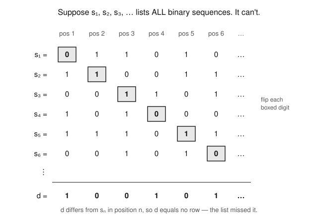

# Logic & Set Theory · Lesson 4.3: Cardinals & Cantor's Theorem

> ⏱ ~15 min · Module 4: Ordinals, Cardinals & the Infinite · Builds on: [Lesson 4.1](04-01-relations-orderings-well-ordering.md) (relations, orderings, well-ordering) · Unlocks: [Lesson 4.4](04-04-continuum-cardinal-arithmetic.md) (the continuum & cardinal arithmetic)

## Why this matters

"Infinity" is not one thing. The integers, the rationals, and the reals are all infinite, yet you can match $\mathbb{Z}$ and $\mathbb{Q}$ up one-for-one while $\mathbb{R}$ is provably *bigger* — there is no way to list the reals. Cantor's theorem pushes this further: **every** set has a strictly larger set (its power set), so the infinities never stop climbing. The engine behind all of it is one trick — diagonalization — and it is the single most reused idea in this course: it kills any list of the reals here, and in Lesson 5.1 it builds the self-referential sentence at the heart of Gödel's incompleteness theorem. Learn it once, deeply.

## The idea

Forget numbers for a second. How would a shepherd with no counting words check whether the sheep match the fenceposts? Pair them off — one sheep to one post. If the pairing is perfect, the two collections are the *same size*, no counting required. That pairing is a **bijection**, and it is the whole definition of "same size," even for infinite collections.

Two surprises follow. First, an infinite set can be the same size as a proper part of itself: the even numbers pair perfectly with all of $\mathbb{N}$ via $n \mapsto 2n$, even though half of $\mathbb{N}$ is "missing." That is not a paradox — it is the *definition* of infinite. Second, and this is Cantor's bombshell: no matter how you try to pair a set $A$ with its power set $\mathcal{P}(A)$ (the set of all its subsets), you always miss at least one subset. So $\mathcal{P}(A)$ is strictly bigger — always, for every $A$, finite or infinite. There is no largest size.

## The formal version

**Definition (equinumerous).** Sets $A$ and $B$ are *equinumerous*, written $A \approx B$, if there is a bijection $f : A \to B$. We say they have the same **cardinality**, $|A| = |B|$.

*In words:* same size means "can be matched up one-for-one, nothing left over on either side."

$\approx$ behaves like an equality: it is reflexive ($A \approx A$ via the identity), symmetric (invert the bijection), and transitive (compose two bijections) — exactly the equivalence-relation axioms from [Lesson 4.1](04-01-relations-orderings-well-ordering.md).

**Definition (countable).** $A$ is *countable* if $A \approx \mathbb{N}$ (countably infinite) or $A$ is finite. Otherwise $A$ is *uncountable*. A countably infinite set is one whose elements can be listed as $a_0, a_1, a_2, \dots$ with every element appearing exactly once — the list *is* the bijection $n \mapsto a_n$.

**Definition (size comparison).** We write $|A| \le |B|$ if there is an **injection** $f : A \to B$, and $|A| < |B|$ if $|A| \le |B|$ but $A \not\approx B$.

*In words:* $A$ is no bigger than $B$ if you can slot every element of $A$ into $B$ without collisions (an injection); it is *strictly* smaller if you can do that but can never make it a perfect pairing.

Two workhorses we'll use constantly:

**Cantor–Schröder–Bernstein (CSB).** If $|A| \le |B|$ and $|B| \le |A|$, then $|A| = |B|$.

*In words:* if you can inject each set into the other, then some bijection exists — you don't have to exhibit it directly. This is the "$\le$ both ways $\Rightarrow$ $=$" law for cardinality, and it is genuinely nontrivial to prove (we state it and use it; the proof interleaves the two injections). It is the tool that turns "$A$ fits in $B$ and $B$ fits in $A$" into "$A$ and $B$ are the same size."

**Cantor's Theorem.** For every set $A$, $\;|A| < |\mathcal{P}(A)|$.

*In words:* the set of all subsets of $A$ is strictly larger than $A$ — no exceptions, ever.

*Proof.* Two parts. **(i) $|A| \le |\mathcal{P}(A)|$:** the map $a \mapsto \{a\}$ is an injection $A \to \mathcal{P}(A)$ (distinct elements give distinct singletons). **(ii) No surjection $A \to \mathcal{P}(A)$ exists**, so in particular no bijection, giving strict $<$. Suppose for contradiction $f : A \to \mathcal{P}(A)$ is *any* function. Each $f(a)$ is a subset of $A$, so for each $a$ the question "$a \in f(a)$?" has a yes/no answer. Collect the "no" elements:
$$D = \{\, a \in A : a \notin f(a) \,\} \subseteq A, \qquad\text{so } D \in \mathcal{P}(A).$$
Is $D$ in the range of $f$? Suppose $D = f(d)$ for some $d \in A$. Ask whether $d \in D$:
- If $d \in D$, then by $D$'s definition $d \notin f(d) = D$ — contradiction.
- If $d \notin D$, then $d$ satisfies $D$'s membership test ($d \notin f(d)=D$), so $d \in D$ — contradiction.

Either way we're stuck, so no such $d$ exists: $D$ is a subset that $f$ never outputs. Hence $f$ is not surjective. Since $f$ was arbitrary, no surjection exists, so no bijection exists, and $|A| < |\mathcal{P}(A)|$. $\blacksquare$

The set $D$ is the diagonal set: it disagrees with each $f(a)$ precisely at the element $a$. That "disagree at position $a$" move is the *same* move that builds a missing real below and the same one Gödel exploits in 5.1.

## Picture

The uncountability of $\{0,1\}^{\mathbb{N}}$ (infinite binary sequences) laid bare. Assume you have a complete list $s_1, s_2, s_3, \dots$. Read down the diagonal, flip every digit, and the resulting sequence $d$ differs from row $n$ in position $n$ — so it is on no row.

## Worked examples

**Example 1 ($\mathbb{Z}$ and $\mathbb{Q}$ are countable).**
$\mathbb{Z}$ *looks* twice as big as $\mathbb{N}$, but zig-zag through it: $0, 1, -1, 2, -2, 3, -3, \dots$. Every integer appears exactly once, so this list is a bijection $\mathbb{N} \to \mathbb{Z}$; explicitly $f(0)=0$, $f(2k-1)=k$, $f(2k)=-k$. Thus $|\mathbb{Z}| = |\mathbb{N}| = \aleph_0$.

$\mathbb{Q}$ looks *far* bigger — the rationals are dense, packed infinitely tightly. Yet arrange the positive rationals $p/q$ in a grid with numerator $p$ across and denominator $q$ down, and sweep the diagonals ($1/1;\ 2/1, 1/2;\ 3/1, 2/2, 1/3;\ \dots$), skipping any fraction not in lowest terms. Every positive rational is hit exactly once, so $\mathbb{Q}^+$ is countable; splice in $0$ and the negatives as in the $\mathbb{Z}$ trick to get all of $\mathbb{Q}$. So $|\mathbb{Q}| = \aleph_0$ too. Density does **not** mean uncountable.

**Example 2 ($\{0,1\}^{\mathbb{N}}$ is uncountable — full diagonalization).**
Let $\{0,1\}^{\mathbb{N}}$ be the set of all infinite sequences of $0$s and $1$s (equivalently, functions $\mathbb{N} \to \{0,1\}$). Claim: it is uncountable.

Suppose not. Then there is a bijection listing every sequence as $s_1, s_2, s_3, \dots$. Write $s_n(k)$ for the $k$-th digit of the $n$-th sequence. Define a new sequence $d$ by flipping the diagonal:
$$d(n) = 1 - s_n(n) = \begin{cases} 1 & \text{if } s_n(n) = 0,\\ 0 & \text{if } s_n(n) = 1.\end{cases}$$
Then $d \in \{0,1\}^{\mathbb{N}}$ — it is a genuine binary sequence. But for **every** $n$, $d(n) \neq s_n(n)$, so $d$ disagrees with $s_n$ in position $n$, hence $d \neq s_n$. So $d$ is a binary sequence appearing nowhere on the list — contradicting that the list was complete. Therefore no such list exists: $\{0,1\}^{\mathbb{N}}$ is uncountable. $\blacksquare$

This is Cantor's theorem in disguise: a subset $S \subseteq \mathbb{N}$ is the same data as its indicator sequence $n \mapsto [n \in S]$, so $\{0,1\}^{\mathbb{N}} \approx \mathcal{P}(\mathbb{N})$, and $d$ is exactly the diagonal set $D$ for the attempted enumeration. That $\mathbb{R}$ is uncountable is the same argument dressed in decimal expansions — diagonalize the digits after the point (flipping to avoid the $0.4999\ldots = 0.5000\ldots$ ambiguity, e.g. always using $3$ and $7$), and you build a real on no row.

## Watch out

- You might think an infinite subset of a countable set could be uncountable — but every subset of a countable set is countable. Injecting into $\mathbb{N}$ is inherited by any subset, so "smaller than countable" can't escape countable.
- You might think "countable" means finite — it does not. $\mathbb{N}$ itself is countably *infinite*. "Countable" means "listable as $a_0, a_1, \dots$," which includes infinite lists.
- You might think a dense set (like $\mathbb{Q}$, with rationals between any two reals) must be uncountable — density and cardinality are unrelated. $\mathbb{Q}$ is dense yet countable; a finite set is not dense yet trivially countable.
- You might think Cantor's diagonal set $D$ depends on cleverness — it doesn't. Given *any* $f$, the single set $D = \{a : a \notin f(a)\}$ is forced and automatically missed. There's nothing to optimize; the "no" set always defeats $f$.

## One-liner

> To beat any list, walk down its diagonal and disagree with every row at its own position — the thing you build is guaranteed to be missing.

## Problems

**P1 (🟢)** Give an explicit bijection $\mathbb{N} \to \mathbb{Z}$ and verify it is one (injective and surjective, in one line each). Then explain in a sentence why "the evens are a proper subset of $\mathbb{N}$" does **not** contradict $|\text{evens}| = |\mathbb{N}|$.

**P2 (🟡)** Prove directly (no CSB) that the open interval $(0,1)$ is uncountable, by adapting the diagonal argument to decimal expansions. Be explicit about (a) which digit you put in position $n$ of the constructed number and (b) how you dodge the $0.4999\ldots = 0.5000\ldots$ non-uniqueness trap.

**P3 (🔴, optional)** Use Cantor–Schröder–Bernstein to prove $|(0,1)| = |[0,1]|$ by exhibiting injections both ways (you should *not* try to write a direct bijection — that's exactly the pain CSB spares you). Then say in one sentence what would go wrong if you tried the naive "just map the endpoints somewhere" bijection.

Solutions

**P1** Define $f : \mathbb{N} \to \mathbb{Z}$ by
$$f(n) = \begin{cases} n/2 & n \text{ even},\\ -(n+1)/2 & n \text{ odd}.\end{cases}$$
So $f(0)=0, f(1)=-1, f(2)=1, f(3)=-2, f(4)=2, \dots$
*Injective:* evens map to $\ge 0$ and odds to $< 0$, so the two cases never collide; within each case the formula is strictly monotone in $n$, so distinct inputs give distinct outputs. *Surjective:* an integer $m \ge 0$ is $f(2m)$; an integer $m < 0$ is $f(2|m|-1)$. Hence $f$ is a bijection and $|\mathbb{N}| = |\mathbb{Z}|$.
The evens being a proper subset is fine because *for infinite sets, matching a proper subset is allowed* — that is the definition of infinite, not a contradiction. Equinumerosity asks only for *some* bijection ($n \mapsto 2n$), not that the subset inclusion be one.

**P2** Suppose $(0,1)$ is countable, listed as $x_1, x_2, x_3, \dots$. Write each in decimal, $x_n = 0.d_{n1}d_{n2}d_{n3}\ldots$ (choosing the non-terminating form when a number has two expansions, so each $x_n$ has one fixed representation). Build $y = 0.e_1 e_2 e_3 \ldots$ by
$$e_n = \begin{cases} 5 & \text{if } d_{nn} \neq 5,\\ 6 & \text{if } d_{nn} = 5.\end{cases}$$
(a) Position $n$ of $y$ is chosen to differ from digit $d_{nn}$ of $x_n$. (b) Every digit of $y$ is $5$ or $6$, so $y$ never ends in an all-$0$ or all-$9$ tail — it has a *unique* decimal expansion, so "$y = x_n$ as numbers" would force equal digit strings, which fails at position $n$. Also $y \in (0,1)$ (it is $0.\text{(5s and 6s)}$). Since $e_n \neq d_{nn}$ for all $n$, $y \neq x_n$ for every $n$: $y$ is on no row. Contradiction, so $(0,1)$ is uncountable. $\blacksquare$

**P3** *Injection $(0,1) \to [0,1]$:* the inclusion $x \mapsto x$; it's injective since it's the identity on its domain, and every value lands in $[0,1]$. So $|(0,1)| \le |[0,1]|$.
*Injection $[0,1] \to (0,1)$:* squeeze the closed interval into the open one, e.g. $x \mapsto \tfrac{1}{4} + \tfrac{x}{2}$, which maps $[0,1]$ onto $[\tfrac14, \tfrac34] \subset (0,1)$ and is injective (it's affine with nonzero slope). So $|[0,1]| \le |(0,1)|$.
Both inequalities hold, so by CSB $|(0,1)| = |[0,1]|$. $\blacksquare$
The naive fix fails because moving the two endpoints $0,1$ "somewhere inside" displaces the points already there, which must be displaced in turn — you'd need to shift infinitely many points to absorb just two, and there's no clean closed form. CSB sidesteps this by only demanding injections each way and manufacturing the bijection for you.

## Flashback

**From [Lesson 4.1](04-01-relations-orderings-well-ordering.md) (relations & orderings):** Consider $\mathbb{N}$ under the *divisibility* relation, $a \preceq b \iff a \mid b$ (restrict to $\mathbb{N}_{\ge 1}$). (a) Show $\preceq$ is a partial order: check reflexivity, antisymmetry, and transitivity. (b) Is it a *total* order? (c) Does it have a least element?

Solution

(a) *Reflexive:* $a \mid a$ since $a = a\cdot 1$. *Antisymmetric:* if $a \mid b$ and $b \mid a$ with $a,b \ge 1$, then $b = ak$ and $a = bm$, so $a = akm$, giving $km = 1$; with positive integers this forces $k = m = 1$, hence $a = b$. *Transitive:* $a \mid b$ and $b \mid c$ give $b = ak$, $c = bj$, so $c = a(kj)$, i.e. $a \mid c$. All three hold, so $\preceq$ is a partial order.
(b) *Not total:* $2$ and $3$ are incomparable — neither $2 \mid 3$ nor $3 \mid 2$. A total order would require every pair to be comparable.
(c) *Yes:* $1$ is the least element, since $1 \mid b$ for every $b \ge 1$ (take $b = 1\cdot b$), so $1 \preceq b$ for all $b$. $\blacksquare$

## Connections

- **Backward:** equinumerosity $\approx$ is the equivalence relation from [Lesson 4.1](04-01-relations-orderings-well-ordering.md), and $|A| \le |B|$ is a preorder on sets that CSB collapses into a genuine order on cardinalities. The listing "$a_0, a_1, \dots$" of a countable set is exactly a well-ordering of type $\omega$ (Lesson 4.2).
- **Forward:** [Lesson 4.4](04-04-continuum-cardinal-arithmetic.md) names these sizes — $|\mathbb{N}| = \aleph_0$, $|\mathcal{P}(\mathbb{N})| = |\mathbb{R}| = 2^{\aleph_0}$ (proved via CSB) — and asks the Continuum Hypothesis: is there a cardinal strictly between them? Cantor's theorem is what guarantees the tower $\aleph_0 < 2^{\aleph_0} < 2^{2^{\aleph_0}} < \cdots$ never terminates.
- **Sideways (this course → 5.1):** the diagonal set $D = \{a : a \notin f(a)\}$ is the blueprint for Gödel's [first incompleteness theorem](05-01-incompleteness-first-theorem.md) — "this sentence is unprovable" is built by diagonalizing a list of formulas exactly as $d$ diagonalizes a list of sequences.
- **Sideways (CS):** the very same diagonal argument proves the halting problem undecidable in the future course [theory of computation](../../theory-of-computation/syllabus.md) — assume a program deciding halting, feed the diagonal machine its own code, and it must do the opposite of what it predicts. Cantor, Gödel, and Turing are one idea in three costumes.
