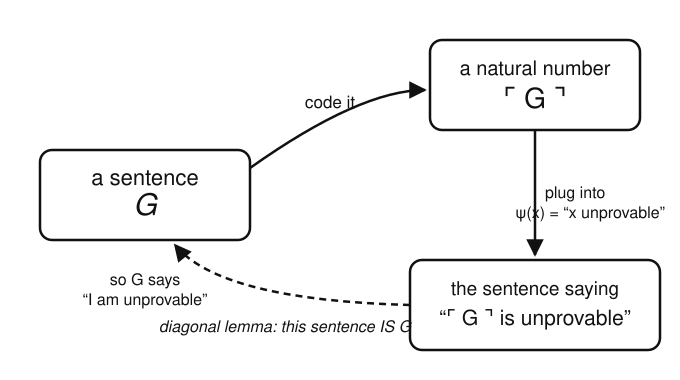

# Logic & Set Theory · Lesson 5.1: Coding, Diagonalization & the First Incompleteness Theorem

> ⏱ ~15 min · Module 5: Incompleteness & Undecidability (a taste) · Builds on: [4.3 Cantor's theorem](04-03-cardinals-cantors-theorem.md), [2.4 soundness & completeness for FOL](02-04-soundness-completeness-fol.md) · Unlocks: [5.2 the second theorem & undecidability](05-02-second-theorem-undecidability.md)

## Why this matters

In Lesson 2.4 you proved Gödel's *completeness* theorem: a first-order proof system can derive every sentence that is true in every model. That sounds like the dream is finished — pick the right axioms and grind out every truth. Gödel's *incompleteness* theorem, five years later, is the cold water: **any** honest axiom system strong enough to do ordinary arithmetic contains a sentence that is true yet the system cannot prove it. Not "hard to prove" — *impossible*, from those axioms, forever. This is the hard ceiling on the whole formalist program, and the engine that turns it — a sentence built to talk about its own unprovability — is the exact self-reference trick Cantor used against the reals in Lesson 4.3. Same move, deployed inside arithmetic.

## The idea

Here is the whole plan in four moves.

**1. Numbers can encode syntax.** A formula is just a finite string of symbols. Assign each symbol a number, then bundle a string of symbols into a single natural number — its *Gödel number* $\ulcorner\varphi\urcorner$. Now every formula, and every finite sequence of formulas (i.e. every proof), *is* a number.

**2. "Provable" becomes arithmetic.** Once proofs are numbers, "$n$ is the code of a valid proof of the formula coded by $m$" is a relation between two numbers — checkable by pure arithmetic. So "$m$ codes a provable sentence" is an arithmetical property, expressible as a formula $\operatorname{Prov}(x)$ *in the very language of the theory*. The theory can now discuss its own provability.

**3. The theory can build self-reference.** The **diagonal lemma** says: for *any* property $\psi(x)$ you can write down, there is a sentence $G$ that provably says "*my own code has property $\psi$*." Feed it any property; you get a sentence asserting that property holds of itself.

**4. Aim self-reference at "unprovable."** Take $\psi(x)$ to be "$x$ is **not** provable." The diagonal lemma hands you a sentence $G$ that says *"I am not provable."* Now corner it: if the theory proved $G$, then $G$ (which asserts its own unprovability) would be false — a sound theory doesn't prove false things. So the theory can't prove $G$. But that is exactly what $G$ claims — so $G$ is **true**. A true sentence the theory cannot prove: incompleteness.

The one-sentence summary: *code syntax as numbers, so the theory can say "I am unprovable," and that sentence is true precisely because it's out of reach.*

## The formal version

We need to pin down what kind of theory this applies to. Let $T$ be a first-order theory (a set of axioms in some language) satisfying three conditions:

- **Consistent** — $T$ proves no contradiction ($T \not\vdash \bot$). A theory that proves everything is useless, so this is the bare minimum for "honest."
- **Effectively axiomatized** — there is a mechanical procedure (equivalently, its axiom set is *recursively enumerable*) that can list the axioms. You must be able to *check* what counts as a proof; a theory whose axioms you can't even recognize isn't a usable system.
- **Sufficiently strong** — $T$ interprets enough basic arithmetic (it contains, or defines, addition and multiplication on the naturals with their basic laws). The standard benchmark is **Peano Arithmetic (PA)**. This is the muscle that lets $T$ encode and reason about syntax.

*In words:* $T$ is any recognizable, non-self-contradicting axiom system that can do grade-school arithmetic — which is essentially every foundational system mathematicians actually use, including PA and ZFC.

**Definition (Gödel numbering / arithmetization).** A *Gödel numbering* is an injective, mechanically computable map $\varphi \mapsto \ulcorner\varphi\urcorner \in \mathbb{N}$ from expressions (symbols, formulas, and finite sequences of formulas) to natural numbers, whose inverse is also mechanical: given a number you can decode whether it's a legal formula and, if so, which one.

*In words:* a reversible code that turns every piece of syntax into a unique number, and every number back into the syntax it encodes (if any).

**Representability (why the coding is usable).** Because $T$ is strong enough for arithmetic and its axioms are effectively listable, the key syntactic relations are *representable* in $T$: there is a formula $\operatorname{Proof}_T(y, x)$ such that, for actual numbers,

$$m \text{ codes a } T\text{-proof of the formula coded by } n \quad\Longleftrightarrow\quad T \vdash \operatorname{Proof}_T(\overline{m}, \overline{n}),$$

where $\overline{k}$ is the numeral (the formal term) for the number $k$. Setting $\operatorname{Prov}_T(x) := \exists y\, \operatorname{Proof}_T(y, x)$ gives a formula meaning "$x$ codes a provable formula."

*In words:* $T$ can not only encode its syntax as numbers but *prove the true facts about that encoding* — so "provable" is an honest arithmetical predicate inside $T$.

**The Diagonal Lemma (Fixed-Point Lemma).** For every formula $\psi(x)$ with one free variable, there is a sentence $G$ such that

$$T \vdash \; G \leftrightarrow \psi(\ulcorner G\urcorner).$$

*In words:* whatever property $\psi$ names, there is a sentence $G$ that provably asserts "$\psi$ holds of my own Gödel number" — $G$ is a fixed point of $\psi$, self-reference made rigorous. (The construction mirrors "apply a function to its own code," the same diagonal step behind Cantor; see [4.3](04-03-cardinals-cantors-theorem.md).)

**Gödel's First Incompleteness Theorem.** Let $T$ be consistent, effectively axiomatized, and sufficiently strong. Then $T$ is **incomplete**: there is a sentence $G$ such that

$$T \nvdash G \qquad\text{and}\qquad T \nvdash \neg G,$$

and moreover $G$ is *true* in the standard model $\mathbb{N}$.

*In words:* such a $T$ can neither prove nor refute the sentence $G$ — it is formally undecided by $T$ — yet $G$ is genuinely true about the natural numbers. (Historically Gödel needed a slightly stronger hypothesis, $\omega$-consistency, to rule out $T\vdash\neg G$; Rosser later reduced it to plain consistency. We state the clean modern version.)

**The sketch (not the full proof).** Apply the diagonal lemma to $\psi(x) := \neg\operatorname{Prov}_T(x)$, "$x$ is not provable." It yields a sentence

$$T \vdash \; G \leftrightarrow \neg\operatorname{Prov}_T(\ulcorner G\urcorner),$$

so $G$ provably asserts *"my own code is not provable."* Now argue:

- **$T \nvdash G$.** Suppose $T \vdash G$. Then some number $m$ codes a proof of $G$, so $\operatorname{Proof}_T(\overline m, \ulcorner G\urcorner)$ is a true, hence ($T$-provable) fact, giving $T \vdash \operatorname{Prov}_T(\ulcorner G\urcorner)$. But the fixed-point equivalence gives $T \vdash \neg\operatorname{Prov}_T(\ulcorner G\urcorner)$. Now $T$ proves both a statement and its negation — $T$ is inconsistent, contradicting our hypothesis. So $T \nvdash G$.
- **$G$ is true.** We just showed $T$ does not prove $G$. That is *precisely* what $G$ asserts about itself. So $G$ is a true statement (about $\mathbb{N}$).
- **$T \nvdash \neg G$.** If $T$ proved $\neg G$, then $T$ would prove the false statement $\neg G$ (since $G$ is true) — impossible for a sound theory over $\mathbb{N}$. (This is the step Gödel originally secured with $\omega$-consistency; the conclusion is the same.)

Hence $T$ decides neither $G$ nor $\neg G$. $\blacksquare$

Notice the shape: we did **not** find a mysterious hard theorem. We *manufactured* $G$ to slip through the exact gap between "true" and "provable" — and the reason we could is that the theory is strong enough to describe its own provability.

## Picture

The loop below is the heart of the argument: a sentence is coded into a number, the number is fed into the property "…is unprovable," and the diagonal lemma glues the resulting sentence back onto the original. Follow the arrows and you arrive back where you started — $G$ ends up saying, of itself, "I am unprovable."

The dashed arrow is the diagonal lemma doing the only magic in the room: forcing the newly built sentence to *be* the very sentence it talks about.

## Worked examples

**Example 1 (the diagonal lemma is a general machine, not a one-off).** The lemma takes *any* $\psi(x)$, not just "unprovable." Feed it $\psi(x) := \operatorname{Prov}_T(x)$, the property "$x$ **is** provable." You get a sentence $H$ with

$$T \vdash \; H \leftrightarrow \operatorname{Prov}_T(\ulcorner H\urcorner),$$

a sentence asserting *"I am provable."* Unlike $G$, this one is harmless: by **Löb's theorem** such an $H$ is in fact provable (and true), no paradox. The moral: self-reference by itself isn't contradictory — the punch comes entirely from pointing $\psi$ at the *negation* of provability. Swap in $\neg$ and the same machine produces the undecidable $G$; that single sign flip is the whole difference between a triviality and incompleteness.

**Example 2 (why "sufficiently strong" is not fine print — a complete theory next door).** Incompleteness is not a law about *all* theories. Consider **Presburger arithmetic**: the first-order theory of $(\mathbb{N}, 0, 1, +)$ — addition but **no multiplication**. Presburger arithmetic is consistent, effectively axiomatized, *and complete*: it proves or refutes every sentence in its language, and there is even a decision algorithm. No contradiction with Gödel, because it is *not sufficiently strong* — without multiplication you cannot build the Gödel-numbering/provability machinery, so no self-referential $G$ can be assembled. Add multiplication back (reaching PA) and completeness instantly dies. This is the sharp lesson: incompleteness is the *price of arithmetical expressive power*, paid exactly when a theory becomes rich enough to encode its own syntax.

## Watch out

- You might think $G$ is "neither true nor false" or some spooky third value — but $G$ is flatly **true** about the natural numbers. "Undecidable in $T$" means *$T$ can't settle it*, not that it has no truth value. The gap Gödel exposes is between **provable-in-$T$** and **true-in-$\mathbb{N}$**, two different things that Lesson 2.4's completeness theorem might have lulled you into conflating.
- You might think you can patch the hole by adding $G$ as a new axiom — but the *bigger* theory $T' = T + G$ is still consistent, effectively axiomatized, and strong, so the theorem applies again and hands you a fresh $G'$ it can't prove. Incompleteness is not a missing brick; it's a permanent property of every honest tower.
- You might conflate this with the **completeness** theorem of [2.4](02-04-soundness-completeness-fol.md) — the words collide but the claims are opposite in spirit. *Completeness:* $\vdash$ captures $\models$ (provable = true-in-all-models), a property of the **logic**. *Incompleteness:* a fixed **theory** $T$ fails to prove some sentence true in its intended model $\mathbb{N}$. Completeness is about all models at once; incompleteness is about the standard model in particular. Different "complete," no contradiction.
- You might think the argument needs $\psi$ to somehow "know" $G$'s code before $G$ exists — but that circularity is exactly what the diagonal lemma dissolves. It *constructs* $G$ as a fixed point, so $\ulcorner G\urcorner$ is well-defined and the self-reference is a theorem, not a hand-wave.

## One-liner

> Any consistent, mechanically-axiomatized theory that can do arithmetic can encode "I am unprovable" — and that sentence is true exactly because the theory can't prove it.

## Problems

**P1 (🟢)** State, without looking back, the three hypotheses on $T$ in the first incompleteness theorem, and for each give one sentence explaining what goes wrong if you drop it. (Hint for one of them: what does Presburger arithmetic in Example 2 tell you?)

**P2 (🟡)** The diagonal lemma applied to $\psi(x) := \neg\operatorname{Prov}_T(x)$ gives $T \vdash G \leftrightarrow \neg\operatorname{Prov}_T(\ulcorner G\urcorner)$. Using only this equivalence and the assumption that $T$ is *sound* (proves only true sentences about $\mathbb{N}$), argue in a short paragraph that (a) $T \nvdash G$, and then (b) $G$ is true. Where exactly does soundness get used?

**P3 (🔴, optional)** A tempting "shortcut" incompleteness proof: "By the diagonal lemma there's a sentence $L$ with $T \vdash L \leftrightarrow \neg L$, an outright contradiction, so $T$ is inconsistent!" This is wrong. Explain precisely why the diagonal lemma does **not** produce such an $L$ — i.e., why "$\neg L$" (with $L$ a *sentence*, having no free variable) is not a legal choice of $\psi(x)$, and how the real construction with $\psi(x) = \neg\operatorname{Prov}_T(x)$ avoids this trap.

Solutions

**P1** The three hypotheses:

1. **Consistent** ($T \not\vdash \bot$). If $T$ is inconsistent it proves *everything*, including $G$ and $\neg G$, so it is trivially "complete" but worthless — the theorem (and the very notion of a meaningful undecided sentence) needs $T$ not to prove contradictions.
2. **Effectively axiomatized** (recursively enumerable axioms). If you can't mechanically recognize the axioms, you can't build the checkable predicate $\operatorname{Proof}_T(y,x)$, so "provable" isn't representable and the whole coding argument collapses. (Also, a non-effective "theory" can cheat: the set of *all* true arithmetic sentences is complete but not effectively axiomatizable — no contradiction, because it fails this hypothesis.)
3. **Sufficiently strong** (interprets enough arithmetic, e.g. PA). Without the arithmetical muscle you can't encode syntax or form $G$ at all. Example 2's Presburger arithmetic — addition but no multiplication — is consistent, effective, and yet *complete*, precisely because it is too weak to arithmetize its own provability.

**P2** (a) Suppose toward contradiction $T \vdash G$. By soundness $G$ is true; by the fixed-point equivalence $G$ is equivalent to $\neg\operatorname{Prov}_T(\ulcorner G\urcorner)$, so $\neg\operatorname{Prov}_T(\ulcorner G\urcorner)$ is true, i.e. $G$ is *not* provable — contradicting $T \vdash G$. Hence $T \nvdash G$.

(b) From (a), $G$ is not provable, so $\operatorname{Prov}_T(\ulcorner G\urcorner)$ is false, so $\neg\operatorname{Prov}_T(\ulcorner G\urcorner)$ is true; by the equivalence, $G$ is true.

Soundness is used in (a): it converts the *syntactic* fact "$T \vdash G$" into the *semantic* fact "$G$ is true," which is what lets us apply the fixed-point equivalence to conclude non-provability. (Part (b) needs no separate soundness appeal — it's a direct reading of the equivalence once non-provability is established.)

**P3** The diagonal lemma inputs a **formula with one free variable** $\psi(x)$ and outputs a sentence $G$ with $T \vdash G \leftrightarrow \psi(\ulcorner G\urcorner)$. The catch: the substitution $\psi(\ulcorner G\urcorner)$ replaces the *free variable* $x$ by the numeral for $G$'s code. If you try to take "$\psi = \neg L$" you have no free variable to substitute into — $L$ is a closed sentence, a fixed truth value, not a predicate of a number. There is nothing for $\ulcorner G\urcorner$ to plug into, so "$G \leftrightarrow \neg G$" is simply not an instance of the lemma. The genuine construction uses $\psi(x) = \neg\operatorname{Prov}_T(x)$, which *does* have a free variable $x$ ranging over codes. Substituting gives $G \leftrightarrow \neg\operatorname{Prov}_T(\ulcorner G\urcorner)$ — self-reference through the *arithmetical predicate "provable,"* not through raw negation. That indirection is exactly why the result is "true but unprovable" rather than a flat contradiction: $\neg\operatorname{Prov}_T(\ulcorner G\urcorner)$ can be *true* (when $G$ is genuinely unprovable) without being a negation of itself.

## Flashback

**From Lesson 4.3 (Cantor's theorem):** Let $S$ be the set of all infinite binary sequences (functions $f:\mathbb{N}\to\{0,1\}$). Suppose someone hands you a list $f_0, f_1, f_2, \dots$ claiming it enumerates *all* of $S$. Construct explicitly a sequence $d \in S$ that appears nowhere on the list, and prove it differs from every $f_n$. What does this show about $|S|$?

Solution

Define $d:\mathbb{N}\to\{0,1\}$ by flipping the diagonal:

$$d(n) := 1 - f_n(n) \qquad (\text{so } d(n)=1 \text{ if } f_n(n)=0, \text{ and } d(n)=0 \text{ if } f_n(n)=1).$$

Then $d \in S$ (it's a well-defined function $\mathbb{N}\to\{0,1\}$). For every $n$, $d$ and $f_n$ disagree at input $n$: $d(n) = 1 - f_n(n) \neq f_n(n)$. So $d \neq f_n$ for every $n$ — $d$ is on no line of the supposed list. Thus no enumeration of $S$ can be complete: there is no surjection $\mathbb{N} \to S$, so $S$ is uncountable, $|S| > \aleph_0$.

This is the same self-reference/diagonalization move that builds $G$ in this lesson: index the objects by numbers, then construct a new object designed to differ from (Cantor) or evade (Gödel) every one on the list. Cantor diagonalizes to escape an enumeration of *sequences*; Gödel diagonalizes to escape an enumeration of *proofs*. It reappears once more in the halting problem — see the future course [theory-of-computation](../../theory-of-computation/syllabus.md).

## Connections

- **Backward:** the diagonal lemma is Cantor's diagonal argument from [4.3](04-03-cardinals-cantors-theorem.md) transplanted into arithmetic — build an object (a sentence) engineered to differ from everything on a list (of proofs). And the contrast partner is [2.4](02-04-soundness-completeness-fol.md): "completeness of the logic" ($\vdash = \models$) versus "incompleteness of a theory" ($T$ misses a truth about $\mathbb{N}$) — same word, opposite lesson.
- **Forward:** [5.2](05-02-second-theorem-undecidability.md) turns the argument on the theory itself — encode "$T$ is consistent" as an arithmetic sentence $\operatorname{Con}(T)$ and show $T \nvdash \operatorname{Con}(T)$ (the second theorem), then recast the whole story as the *undecidability* of provability and the Entscheidungsproblem.
- **Sideways (theory of computation):** the very same diagonalization powers the **halting problem** in the future course [theory-of-computation](../../theory-of-computation/syllabus.md): "provable" becomes "halts," the Gödel sentence becomes a program that runs iff it doesn't, and undecidability of the halting problem gives an independent, computational route to incompleteness.
