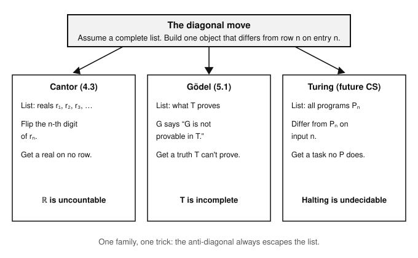

# Logic & Set Theory · Lesson 5.2: The Second Theorem & (Un)decidability

> ⏱ ~15 min · Module 5: Incompleteness & Undecidability (a taste) · Builds on: [Lesson 5.1](05-01-incompleteness-first-theorem.md) · Unlocks: nothing — this is the final lesson of the course

## Why this matters

Around 1920 David Hilbert set the agenda for the century: pin mathematics down with a fixed list of axioms, then (1) *prove that list consistent* using only safe, finitary reasoning, and (2) find a *mechanical procedure* that decides whether any given mathematical statement is a theorem. Two results demolished both halves. Gödel's **second incompleteness theorem** says a system strong enough to be interesting cannot prove its own consistency from the inside — so the safe consistency proof Hilbert wanted can't be finished within the mathematics it certifies. The **Church–Turing** answer to Hilbert's *Entscheidungsproblem* says no algorithm decides logical validity. And the punchline: both are the exact diagonal trick you already saw twice — Cantor building a real off the list ([Lesson 4.3](04-03-cardinals-cantors-theorem.md)) and Gödel building a sentence off the provable list ([Lesson 5.1](05-01-incompleteness-first-theorem.md)). This lesson closes the course by tying logic to computation.

## The idea

**The second theorem, in one breath.** In 5.1 you built a sentence $G$ that says "I am not provable in $T$," and $T$ couldn't prove it. Now watch: the *whole argument* for "if $T$ is consistent, then $G$ is unprovable" is elementary enough that $T$ can carry it out about itself. So $T$ proves the implication "if $T$ is consistent, then $G$." If $T$ could also prove "$T$ is consistent," it would prove $G$ by modus ponens — but $G$ is exactly what $T$ *can't* prove. Therefore $T$ can't prove its own consistency. A sufficiently strong, consistent system can never certify itself; to trust it you must stand outside it.

**Decidability, in one breath.** A property is **decidable** if there is a single algorithm — a mechanical, always-halting yes/no procedure — that settles it for every input. Hilbert asked whether *validity in first-order logic* is decidable: is there a machine that reads any FOL sentence and correctly answers "valid" or "not valid"? The answer is **no**. The obstruction is the **halting problem**: no program can decide whether an arbitrary program halts, and the proof is Cantor's diagonal wearing a lab coat.

## The formal version

Fix an **effectively axiomatized** theory $T$ (you can mechanically check what counts as an axiom) that interprets enough arithmetic — the same hypotheses as the first theorem, plus that $T$ can verify the basic bookkeeping facts about its own proof relation.

Inside such a $T$ live two arithmetic gadgets from 5.1: the Gödel number $\ulcorner\varphi\urcorner$ of a sentence $\varphi$, and a **provability predicate** $\operatorname{Prov}_T(x)$ — an arithmetic formula for which $\operatorname{Prov}_T(\ulcorner\varphi\urcorner)$ holds exactly when $\varphi$ is provable in $T$. From these:

**Definition (consistency sentence).** $\operatorname{Con}(T) \;:=\; \neg\,\operatorname{Prov}_T(\ulcorner 0 = 1 \urcorner)$.

*In words:* $\operatorname{Con}(T)$ is a single arithmetic sentence asserting "$T$ never proves $0=1$" — i.e. $T$ proves no contradiction. It is a statement *about numbers* that happens to encode a statement *about $T$*.

**Second Incompleteness Theorem (Gödel, 1931).** If $T$ is consistent (and satisfies the hypotheses above), then
$$T \nvdash \operatorname{Con}(T).$$

*In words:* a consistent, effectively axiomatized system strong enough to talk about arithmetic cannot prove the sentence that says it is consistent.

*Why it follows from the first.* The Gödel sentence $G$ satisfies $T \vdash G \leftrightarrow \neg\operatorname{Prov}_T(\ulcorner G\urcorner)$. When the first theorem's argument ("consistency forces $G$ unprovable, and $G$ asserts its own unprovability, so $G$ holds") is formalized inside $T$, it yields
$$T \vdash \operatorname{Con}(T) \to G.$$
Now if $T \vdash \operatorname{Con}(T)$ we could detach $T \vdash G$ — contradicting the first theorem's $T \nvdash G$. So $T \nvdash \operatorname{Con}(T)$. $\blacksquare$

**Decidability and the Entscheidungsproblem.** A set $S$ of finite objects (strings, numbers, sentences) is **decidable** (recursive) if some algorithm halts on every input and answers "$\in S$?" correctly. It is **recursively enumerable** (r.e., semi-decidable) if some algorithm halts and says "yes" on exactly the members of $S$, but may run forever on non-members. Decidable $=$ both $S$ and its complement are r.e.

**Church–Turing Theorem (1936).** The set of *valid* first-order sentences is **undecidable**: no algorithm decides, for every FOL sentence, whether it is logically valid.

*But it is r.e.* By Gödel's completeness theorem ([Lesson 2.4](02-04-soundness-completeness-fol.md)), valid $=$ provable, and proofs are finite objects you can enumerate one after another. So a machine that grinds through all candidate proofs will *eventually* confirm any valid sentence — validity is semi-decidable. What's missing is the other half: there is no matching procedure to confirm *in*validity, so the two together never give a decision procedure.

**Halting Problem (Turing, 1936).** There is no algorithm $H$ that, given (a description of) a program $P$ and an input $x$, always halts and correctly answers whether $P$ halts on $x$.

The Entscheidungsproblem reduces to this: you can write a FOL sentence that is valid exactly when a given machine halts, so a validity-decider would decide halting. Undecidability flows downhill from Turing to Hilbert's logical question.

## Picture

The three diagonal siblings are one family — same move, three costumes.

Read each column top to bottom: assume the list is complete, build the object that disagrees with row $n$ at position $n$, and derive a contradiction. Cantor's object is a missing real; Gödel's is an unprovable truth; Turing's is an uncomputable task.

## Worked examples

**Example 1 (the second theorem in two lines).** Assume the formalized first theorem, $T \vdash \operatorname{Con}(T) \to G$, and the first theorem itself, "$T$ consistent $\Rightarrow T \nvdash G$." Suppose for contradiction that $T \vdash \operatorname{Con}(T)$. Modus ponens on the implication gives $T \vdash G$. But $T$ is consistent, so the first theorem says $T \nvdash G$ — contradiction. Hence $T \nvdash \operatorname{Con}(T)$. Notice how little arithmetic this last step needs: *all* the difficulty is packed into justifying the implication $\operatorname{Con}(T)\to G$ inside $T$ (the "derivability conditions"), which is why the second theorem's hypotheses are slightly stronger than the first's.

**Example 2 (halting is undecidable — the diagonal, explicitly).** Suppose an always-halting decider $H(P, x)$ exists, returning "halts" or "loops." Build a new program $D$ that takes a program $P$ as input and does:
$$D(P): \quad \text{if } H(P, P) = \text{``halts''} \text{ then loop forever; else halt.}$$
$D$ is a perfectly good program, so ask what it does on *its own* description, $D(D)$:

- If $D(D)$ halts, then by construction $H(D,D) = $ "halts," which makes $D(D)$ loop forever — contradiction.
- If $D(D)$ loops, then $H(D,D) = $ "loops," which makes $D(D)$ halt — contradiction.

Both branches explode, so $H$ cannot exist. $D$ was engineered to differ from program $P$'s behavior precisely on input $P$ — the diagonal entry — so $D$'s own behavior sits off the entire list of "what $H$ predicts." Same skeleton as flipping Cantor's $n$-th digit or coding Gödel's "not provable."

## Watch out

- You might think "$T$ can't prove $\operatorname{Con}(T)$" means $\operatorname{Con}(T)$ is *unknowable* — but it's only unprovable *from inside $T$*. A stronger theory can prove it: ZFC proves $\operatorname{Con}(\mathsf{PA})$, and Gentzen proved $\operatorname{Con}(\mathsf{PA})$ using induction up to the ordinal $\varepsilon_0$. What's forbidden is a system certifying *itself* — the snake eating its own tail.
- You might think incompleteness dooms *every* theory — but "sufficiently strong" is load-bearing. Presburger arithmetic (the naturals with $+$ but no $\times$) is both complete *and* decidable; the whole phenomenon needs enough multiplication to encode sequences. Weak or narrow theories escape.
- You might think r.e. means decidable — but FOL validity is r.e. and *not* decidable. Semi-decidability is a genuine consolation prize: hunt through proofs and you'll confirm every valid sentence, yet on an invalid one the search may run forever with no verdict. Decidability demands a guaranteed halt on *both* answers.
- You might think any sentence honestly named "$\operatorname{Con}(T)$" is unprovable — but the theorem is about the *standard* consistency statement built from a well-behaved provability predicate. Pathologically re-phrased "consistency" sentences (Rosser-style, or ones violating the derivability conditions) can behave differently; the honest arithmetic $\operatorname{Con}(T)$ is the one $T$ can't reach.

## One-liner

> A strong enough consistent system can neither prove its own consistency nor be replaced by a machine that decides validity — because the same diagonal that built Cantor's missing real builds Gödel's unprovable truth and Turing's uncomputable task.

## Problems

**P1 (🟢)** Write $\operatorname{Con}(T)$ as an arithmetic sentence in terms of the provability predicate $\operatorname{Prov}_T$, and say in one sentence what it asserts about $T$. Then, using only the two ingredients $T \vdash \operatorname{Con}(T) \to G$ and "first theorem: $T$ consistent $\Rightarrow T \nvdash G$," show $T \nvdash \operatorname{Con}(T)$.

**P2 (🟡)** The set of valid FOL sentences is recursively enumerable but not decidable. (a) Explain precisely which earlier theorem of this course guarantees the "r.e." half, and how it lets you enumerate the valid sentences. (b) Explain what *additional* procedure you would need to upgrade "r.e." to "decidable," and why Church–Turing says it doesn't exist.

**P3 (🔴, optional — bridge to computation)** Presburger arithmetic — first-order logic over $(\mathbb{N}, +, 0, 1, <)$ with no multiplication symbol — is a *complete and decidable* theory. Reconcile this with Gödel's first incompleteness theorem: exactly which hypothesis of the theorem does Presburger arithmetic fail, and why does adding a multiplication symbol change the answer? (One or two sentences.)

Solutions

**P1** $\operatorname{Con}(T) := \neg\,\operatorname{Prov}_T(\ulcorner 0 = 1\urcorner)$ — the sentence asserting that $T$ does not prove $0=1$, i.e. that $T$ proves no contradiction. (Any fixed refutable sentence works in place of $0=1$; a theory that proves one contradiction proves them all, so this single instance captures full consistency.)

Now the argument. Suppose toward contradiction that $T \vdash \operatorname{Con}(T)$. Combine with the given $T \vdash \operatorname{Con}(T) \to G$ by modus ponens: $T \vdash G$. But we assumed $T$ is consistent, so the first theorem gives $T \nvdash G$ — a direct contradiction. Therefore the supposition fails and $T \nvdash \operatorname{Con}(T)$. $\blacksquare$

**P2** (a) **Gödel's completeness theorem** (Lesson 2.4): a FOL sentence is valid ($\models \varphi$) if and only if it is provable ($\vdash \varphi$). Because $T$'s proof system is effective, all finite proof-objects can be listed in a mechanical order (e.g. by length, then lexicographically); run a machine that generates them one by one and checks each for validity of its conclusion — it halts with "yes" on exactly the valid sentences. That is precisely the definition of recursively enumerable.

(b) To *decide* validity you would also need to confirm *invalidity* — an algorithm that halts with "yes" on exactly the *non-valid* sentences (making the complement r.e. too; decidable $=$ both halves r.e.). Church–Turing says no such procedure exists: validity is r.e. but its complement is not, so no single always-halting decider can exist. Concretely, on an invalid sentence the proof-search of part (a) simply runs forever, and nothing can be bolted on to force a "no" in finite time in general.

**P3** Presburger arithmetic fails the "**sufficiently strong**" hypothesis: without a multiplication symbol it cannot represent all computable relations (it can't encode finite sequences / the proof relation), so the arithmetization and diagonal lemma behind the first theorem never get off the ground — there is no $\operatorname{Prov}$ predicate to self-reference. Adding multiplication (giving full $\mathsf{PA}$) restores the coding power needed to build the Gödel sentence, and completeness/decidability are both lost. In short: incompleteness is a tax on *expressive strength*, and Presburger arithmetic is deliberately too weak to owe it.

## Flashback

**From [Lesson 5.1](05-01-incompleteness-first-theorem.md) (First Incompleteness Theorem):** A colleague states the first theorem as "Every mathematical system has true statements it can't prove." State the theorem *precisely*: list the three standing hypotheses on the theory $T$, and give the exact conclusion. Then name which single hypothesis the sloppy version omits that makes it false.

Solution

**Precise statement.** Let $T$ be a theory that is:
1. **consistent** — $T$ proves no contradiction (otherwise it proves *everything*, including all its own consistency claims, and nothing is unprovable);
2. **effectively axiomatized** (recursively axiomatizable) — there is an algorithm deciding what counts as an axiom, so "proof in $T$" is a checkable, arithmetizable relation;
3. **sufficiently strong** — $T$ interprets enough arithmetic (essentially Robinson arithmetic $\mathsf{Q}$ / basic facts about $+$ and $\times$) to carry out Gödel coding.

**Conclusion.** There is a sentence $G$ in the language of $T$ such that $T \nvdash G$ and $T \nvdash \neg G$ — $G$ is *independent* of $T$, so $T$ is **incomplete**. (In the standard model $G$ is moreover *true*, since it correctly asserts its own unprovability.)

**What the sloppy version omits.** It drops "**sufficiently strong**" (and, quietly, "effectively axiomatized"). Both matter: complete-*and*-consistent theories exist when a hypothesis is dropped — Presburger arithmetic (too weak) and the full first-order theory of $(\mathbb{R}, +, \cdot)$, i.e. real-closed fields (also lacks the coding power for integers), are both complete and decidable. And the set of *all* true arithmetic sentences is complete but not effectively axiomatized. "Every system" is exactly the false generalization the hypotheses rule out.

## Connections

- **Backward:** this is the third face of the **diagonal argument** — Cantor's uncountability ([4.3](04-03-cardinals-cantors-theorem.md)) and Gödel's self-referential sentence ([5.1](05-01-incompleteness-first-theorem.md)) are the first two. The second theorem is just the first theorem *formalized inside $T$*; the halting proof is Cantor's flip applied to program behaviors. One trick, three theorems.
- **Forward (course complete):** the halting problem, undecidability, and the theory of computation are developed properly in the future CS course [theory-of-computation](../../theory-of-computation/syllabus.md) — same diagonalization, now with Turing machines, reductions, and the full undecidability zoo. The bridge is explicit: **the anti-diagonal that escapes every row is the shared engine of Cantor (4.3), Gödel (5.1), and Turing.**
- **Sideways (foundations & philosophy):** the second theorem is the formal obituary of **Hilbert's program** — you cannot secure a strong theory's consistency by means available inside it. It also sets up **Löb's theorem** (a theory can only prove "$\varphi$ is provable $\to \varphi$" when it already proves $\varphi$), the natural next statement past the ones here.
- **Course wrap-up:** with this lesson the **Dangerous Checklist** is fully covered — you can now state both incompleteness theorems and explain why no consistent, sufficiently strong system proves its own consistency, closing the arc from truth tables and $\vdash$ vs. $\models$ all the way to the limits of formal proof.
