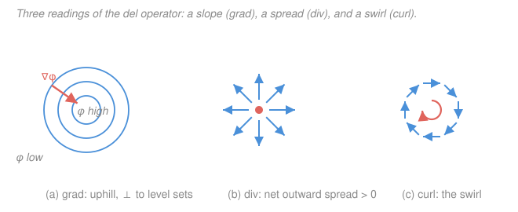

# Mathematical Methods for Physics · Lesson 1.1: Fields, grad, div, curl — the physics reading

> ⏱ ~15 min · Module 1: Vector calculus & tensors in physics · Builds on: [`calc-refresher` syllabus](../../calc-refresher/syllabus.md) · Unlocks: [1.2 Line, surface, and volume integrals](01-02-line-surface-volume-integrals.md)

## Why this matters

Almost every field theory in physics is written in the language of $\nabla$. Temperature, pressure, electric potential — these are **scalar fields**, one number at each point. Velocity, force, the electric and magnetic fields — **vector fields**, an arrow at each point. Maxwell's equations, heat flow, fluid dynamics, and gravity are all just statements about how three operators — **gradient, divergence, curl** — act on those fields. You almost certainly learned the formulas in calculus. The job of this lesson is to make you *read* them: grad as a slope, div as a spread, curl as a swirl. Once each operator has a physical meaning, the equations of physics stop being symbols to memorize and start being sentences you can understand.

## The idea

Picture a hill. The height above each map coordinate is a scalar field. **Gradient** answers: which way is steepest uphill, and how steep? It's a vector that points in the direction of fastest increase, and it's long where the hill is steep, short where it's flat. Water flows *down* the gradient; heat flows from hot to cold, i.e. down the temperature gradient. Grad turns a scalar field into a vector field.

Now picture a fluid, with a velocity arrow at every point. **Divergence** asks a purely local question: at this point, is fluid being *created* (spraying outward, like a sprinkler head) or *destroyed* (draining, like a sink)? It measures the net outward flow per unit volume — the **source density**. Where nothing is created or lost — an incompressible fluid — the divergence is zero. Div turns a vector field into a scalar field.

Same fluid, different question. **Curl** asks: if I drop a tiny paddlewheel here, does it spin? It measures the local circulation — how much the field wraps around a point — and it's a vector pointing along the spin axis by the right-hand rule. A field that swirls has curl; a field that flows straight or spreads radially has none. Curl turns a vector field into a vector field.

Three questions — *how steep, how much spreading, how much spinning* — and three operators that answer them. That's the whole module in one breath.

## The formal version

Everything is built from the **del operator**, a vector whose components are partial derivatives:

$$\nabla \equiv \left(\frac{\partial}{\partial x},\ \frac{\partial}{\partial y},\ \frac{\partial}{\partial z}\right).$$

*In words: $\nabla$ is a "vector of slopes" waiting for something to differentiate.* Let $\varphi(x,y,z)$ be a scalar field and $\mathbf{F}(x,y,z) = (F_x, F_y, F_z)$ a vector field.

**Gradient** (acts on a scalar, gives a vector):

$$\nabla\varphi = \left(\frac{\partial\varphi}{\partial x},\ \frac{\partial\varphi}{\partial y},\ \frac{\partial\varphi}{\partial z}\right).$$

*In words: $\nabla\varphi$ points in the direction of steepest ascent of $\varphi$; its magnitude $|\nabla\varphi|$ is the maximum rate of increase, and it is everywhere perpendicular to the level surfaces $\varphi = \text{const}$.* The perpendicularity is the key fact: moving *along* a level surface, $\varphi$ doesn't change, so the direction of fastest change must be at right angles to it. Physics reads this as $\mathbf{q} = -k\nabla T$ (heat flows *down* the temperature gradient) and $\mathbf{F} = -\nabla V$ (force points *down* the potential-energy hill).

**Divergence** (acts on a vector, gives a scalar):

$$\nabla\cdot\mathbf{F} = \frac{\partial F_x}{\partial x} + \frac{\partial F_y}{\partial y} + \frac{\partial F_z}{\partial z}.$$

*In words: $\nabla\cdot\mathbf{F}$ is the net outward flux of $\mathbf{F}$ per unit volume at a point — the local source strength.* Positive means a source (net outflow), negative a sink (net inflow), zero means "whatever flows in flows out." Physics: $\nabla\cdot\mathbf{E} = \rho/\varepsilon_0$ (electric charge density $\rho$ is the source of $\mathbf{E}$; $\varepsilon_0$ is the permittivity of free space), and an incompressible flow obeys $\nabla\cdot\mathbf{v} = 0$.

**Curl** (acts on a vector, gives a vector):

$$\nabla\times\mathbf{F} = \left(\frac{\partial F_z}{\partial y} - \frac{\partial F_y}{\partial z},\ \ \frac{\partial F_x}{\partial z} - \frac{\partial F_z}{\partial x},\ \ \frac{\partial F_y}{\partial x} - \frac{\partial F_x}{\partial y}\right),$$

conveniently remembered as the symbolic determinant

$$\nabla\times\mathbf{F} = \begin{vmatrix} \hat{\mathbf{x}} & \hat{\mathbf{y}} & \hat{\mathbf{z}} \\[2pt] \partial_x & \partial_y & \partial_z \\[2pt] F_x & F_y & F_z \end{vmatrix}.$$

*In words: $\nabla\times\mathbf{F}$ measures the circulation of $\mathbf{F}$ per unit area; its direction is the local axis of rotation (right-hand rule), its magnitude the rotation rate.* Physics: $\nabla\times\mathbf{B} = \mu_0\mathbf{J}$ (an electric current density $\mathbf{J}$ makes $\mathbf{B}$ circulate; $\mu_0$ is the permeability of free space), and an irrotational flow obeys $\nabla\times\mathbf{v} = 0$.

**Two identities you should know now** (they will be *proved* cleanly with index notation in [1.5](01-05-index-notation-cartesian-tensors.md)):

$$\nabla\cdot(\nabla\times\mathbf{F}) = 0, \qquad \nabla\times(\nabla\varphi) = 0.$$

*In words: the curl of any field has no sources (a pure swirl neither spreads nor drains), and a gradient never swirls (walking straight uphill can't loop you around).* These are not accidents — they are why magnetic fields have no monopoles ($\nabla\cdot\mathbf{B}=0$ makes $\mathbf{B}$ a curl) and why a conservative force ($\mathbf{F}=-\nabla V$) does no work around a closed loop.

## Picture

## Worked examples

**Example 1 (gradient — heat flowing off a hot spot).** A thin plate has temperature $T(x,y) = 100 - (x^2 + y^2)$, hottest at the origin. The gradient is

$$\nabla T = \left(\frac{\partial T}{\partial x},\ \frac{\partial T}{\partial y}\right) = (-2x,\ -2y).$$

At the point $(1,2)$: $\nabla T = (-2,-4)$, with magnitude $|\nabla T| = \sqrt{4+16} = \sqrt{20} \approx 4.47$. This vector points *toward* the origin — the direction of steepest temperature *increase*, straight back to the hot center, exactly perpendicular to the circular isotherm through $(1,2)$. Heat, by Fourier's law $\mathbf{q} = -k\nabla T$, flows the *opposite* way: $\mathbf{q} \propto (2,4)$, radially outward, away from the hot spot. The gradient told us both the direction and (through its magnitude) how fast the temperature climbs.

**Example 2 (div and curl — source versus swirl).** Compare two flat vector fields side by side.

*Radial field* $\mathbf{G} = (x, y, 0)$ — arrows pointing straight out from the origin, like our sprinkler:

$$\nabla\cdot\mathbf{G} = \frac{\partial x}{\partial x} + \frac{\partial y}{\partial y} + 0 = 2, \qquad \nabla\times\mathbf{G} = (0-0,\ 0-0,\ 0-0) = \mathbf{0}.$$

Positive divergence everywhere (a source, fluid spraying outward) and zero curl (a paddlewheel dropped in wouldn't spin — it just gets pushed outward). This is panel (b).

*Rotational field* $\mathbf{F} = (-y, x, 0)$ — arrows wrapping counterclockwise around the origin:

$$\nabla\cdot\mathbf{F} = \frac{\partial(-y)}{\partial x} + \frac{\partial x}{\partial y} + 0 = 0, \qquad \nabla\times\mathbf{F} = \left(0,\ 0,\ \frac{\partial x}{\partial x} - \frac{\partial(-y)}{\partial y}\right) = (0,0,2).$$

Zero divergence (nothing created or lost — the fluid just goes around) and constant curl $2\hat{\mathbf{z}}$ (every paddlewheel spins counterclockwise at the same rate, axis out of the page by the right-hand rule). This is panel (c). Two fields that look superficially similar — arrows all over the plane — but the operators cleanly separate "spreading" from "spinning."

## Watch out

- **You might think divergence is about the field being big.** It isn't — it's about the field *changing* as you move outward. A uniform wind $\mathbf{F} = (5,0,0)$, however strong, has $\nabla\cdot\mathbf{F} = 0$: as much air enters a box on the left as leaves on the right. Div and curl are *derivatives*; a constant field has both equal to zero.
- **You might think zero divergence means the field is zero somewhere, or "small."** No: $\nabla\cdot\mathbf{F} = 0$ can happen by cancellation, e.g. $\mathbf{F} = (2x, -3y, z)$ has $\nabla\cdot\mathbf{F} = 2 - 3 + 1 = 0$ everywhere while the field itself is nowhere zero. Divergence-free means "no net local source," not "no field."
- **You might mix up what eats what.** Grad takes a scalar and returns a vector; div takes a vector and returns a scalar; curl takes a vector and returns a vector. Writing $\nabla\cdot\varphi$ or $\nabla\varphi\cdot\mathbf{F}$ (as if grad acted on a vector) is a type error — check the "shapes" before you compute.

## One-liner

> $\nabla\varphi$ is the steepest slope of a scalar, $\nabla\cdot\mathbf{F}$ is how much a vector field spreads, $\nabla\times\mathbf{F}$ is how much it spins — a slope, a source, and a swirl.

## Problems

**P1 (🟢)** For $\varphi(x,y,z) = xyz$, compute $\nabla\varphi$. Evaluate it at the point $(1,2,3)$: give the direction of steepest ascent and the maximum rate of increase there.

**P2 (🟡)** The field $\mathbf{F} = (2x,\ -3y,\ z)$ appeared above. Compute $\nabla\cdot\mathbf{F}$ and $\nabla\times\mathbf{F}$, and state in words whether this field has any net sources/sinks and whether it rotates.

**P3 (🔴, optional)** Verify the identity $\nabla\times(\nabla\varphi) = \mathbf{0}$ explicitly for $\varphi = x^2 y + y z^2$ by first computing $\nabla\varphi$ and then taking its curl.

Solutions

**P1** Differentiate $\varphi = xyz$ in each variable, treating the other two as constants:

$$\nabla\varphi = \left(\frac{\partial(xyz)}{\partial x},\ \frac{\partial(xyz)}{\partial y},\ \frac{\partial(xyz)}{\partial z}\right) = (yz,\ xz,\ xy).$$

At $(1,2,3)$: $\nabla\varphi = (2\cdot3,\ 1\cdot3,\ 1\cdot2) = (6, 3, 2)$. The **direction** of steepest ascent is the unit vector

$$\hat{\mathbf{n}} = \frac{(6,3,2)}{\sqrt{6^2+3^2+2^2}} = \frac{(6,3,2)}{\sqrt{49}} = \frac{1}{7}(6,3,2),$$

and the **maximum rate of increase** is the magnitude $|\nabla\varphi| = 7$.

*Check.* $6^2+3^2+2^2 = 36+9+4 = 49$, so $|\nabla\varphi| = 7$ exactly — a clean magnitude confirms the arithmetic. Units: if $\varphi$ has units of (say) potential, $\nabla\varphi$ carries "per length," matching a rate of change with position. ✓

**P2** Divergence:

$$\nabla\cdot\mathbf{F} = \frac{\partial(2x)}{\partial x} + \frac{\partial(-3y)}{\partial y} + \frac{\partial z}{\partial z} = 2 - 3 + 1 = 0.$$

Curl (each component is a difference of cross-derivatives; every term here vanishes because $F_x$ depends only on $x$, etc.):

$$\nabla\times\mathbf{F} = \left(\frac{\partial z}{\partial y} - \frac{\partial(-3y)}{\partial z},\ \ \frac{\partial(2x)}{\partial z} - \frac{\partial z}{\partial x},\ \ \frac{\partial(-3y)}{\partial x} - \frac{\partial(2x)}{\partial y}\right) = (0,0,0).$$

In words: **no net sources or sinks** (the divergence cancels to zero everywhere — outflow in $x$ and $z$ is exactly balanced by inflow in $y$) and **no rotation** (curl is zero, so it is irrotational). It is both source-free and swirl-free even though the field itself is nonzero — the misconception-buster from "Watch out."

*Check.* A field of the form $(ax, by, cz)$ always has curl zero (each component depends on its own variable only) and divergence $a+b+c$; here $2-3+1=0$. Consistent. ✓

**P3** First the gradient of $\varphi = x^2 y + y z^2$:

$$\nabla\varphi = \left(2xy,\ \ x^2 + z^2,\ \ 2yz\right).$$

Now take the curl of this vector, calling its components $(P,Q,R) = (2xy,\ x^2+z^2,\ 2yz)$:

$$\nabla\times(\nabla\varphi) = \left(R_y - Q_z,\ \ P_z - R_x,\ \ Q_x - P_y\right).$$

Component by component:
- $R_y - Q_z = \dfrac{\partial(2yz)}{\partial y} - \dfrac{\partial(x^2+z^2)}{\partial z} = 2z - 2z = 0.$
- $P_z - R_x = \dfrac{\partial(2xy)}{\partial z} - \dfrac{\partial(2yz)}{\partial x} = 0 - 0 = 0.$
- $Q_x - P_y = \dfrac{\partial(x^2+z^2)}{\partial x} - \dfrac{\partial(2xy)}{\partial y} = 2x - 2x = 0.$

So $\nabla\times(\nabla\varphi) = \mathbf{0}$, confirming the identity for this $\varphi$.

*Check.* Each component canceled because it was a difference of two equal mixed second partials — e.g. $2x = \partial^2\varphi/\partial x\partial y = \partial^2\varphi/\partial y\partial x = 2x$. That equality of mixed partials (Clairaut's theorem) is exactly *why* the identity holds in general, which [1.5](01-05-index-notation-cartesian-tensors.md) makes into a one-line proof. ✓

## Connections

- **Backward:** this rests entirely on partial derivatives and the multivariable chain rule from the [`calc-refresher` syllabus](../../calc-refresher/syllabus.md) — $\nabla$ is just those partials bundled into a vector. The "steepest ascent" reading of the gradient is the multivariable version of "the derivative is the slope."
- **Forward:** [1.2 Line, surface, and volume integrals](01-02-line-surface-volume-integrals.md) builds the flux and circulation *integrals* that div and curl are the per-unit-volume and per-unit-area densities of; [1.3 Integral theorems](01-03-integral-theorems.md) then ties them together (Gauss and Stokes), and [1.5](01-05-index-notation-cartesian-tensors.md) proves the two identities above in a single line.
- **Sideways (electromagnetism):** the four physical readings here — $\nabla\cdot\mathbf{E}=\rho/\varepsilon_0$, $\nabla\cdot\mathbf{B}=0$, and the curl laws for $\mathbf{B}$ and $\mathbf{E}$ — *are* Maxwell's equations. The whole subject of the [`em-refresher` syllabus](../../em-refresher/syllabus.md) is reading those four grad/div/curl sentences fluently.
