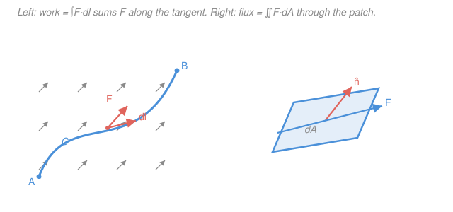

# Mathematical Methods for Physics · Lesson 1.2: Line, surface, and volume integrals; flux and circulation

> ⏱ ~15 min · Module 1: Vector calculus & tensors in physics · Builds on: [1.1 Fields, grad, div, curl](01-01-fields-grad-div-curl.md) · Unlocks: [1.3 The integral theorems](01-03-integral-theorems.md)

## Why this matters

Lesson 1.1 gave you the *local* verbs — grad, div, curl — that describe a field point by point. But physics almost always asks a *global* question: how much work does a force do along this path? How much charge sits inside this box? How much fluid pours through this window per second? Each answer is an integral of a field over a curve, a surface, or a volume. These three integrals are the raw material of every conservation law you will meet — Gauss's law, Ampère's law, work–energy — and the next lesson's big theorems ([1.3](01-03-integral-theorems.md)) are nothing but rules for trading one of them for another. Get comfortable *setting them up and orienting them correctly* now, and the theorems will feel like shortcuts rather than new material.

## The idea

All three integrals are the same move: **chop the region into tiny pieces, weight each piece by the field, add up.** What changes is the shape of the piece and how the field couples to it.

- Along a **curve**, the natural piece is a little tangent step $\mathrm{d}\mathbf{l}$ pointing along your direction of travel. Dotting a force with it, $\mathbf{F}\cdot\mathrm{d}\mathbf{l}$, keeps only the part of the force *along* the motion — that is exactly **work**. Add it up around a closed loop and you get **circulation**: how much the field "pushes you along" as you go around.
- Across a **surface**, the natural piece is a little patch with an area *and a facing direction* — a vector $\mathrm{d}\mathbf{A} = \hat{\mathbf{n}}\,\mathrm{d}A$ pointing straight out of the patch. Dotting the field with it, $\mathbf{F}\cdot\mathrm{d}\mathbf{A}$, keeps only the part of the field *piercing* the patch head-on — that is **flux**, the throughput. A patch held edge-on to the field catches nothing.
- Inside a **volume**, the piece is just a little box $\mathrm{d}V$, and you weight it by a scalar density $\rho$. Adding up $\rho\,\mathrm{d}V$ gives a total: mass, charge, probability.

The one subtlety that trips everyone: a surface and a curve each have **two possible orientations**, and you must pick one. Reverse the direction you walk the curve, or flip which way the surface "faces," and the answer flips sign. Choosing that direction *is* part of setting up the problem.

## The formal version

**Scalar vs. vector line integrals.** Given a curve $C$ traced by a position vector $\mathbf{r}(t)$ for $t\in[a,b]$, the tangent step is $\mathrm{d}\mathbf{l} = \mathbf{r}'(t)\,\mathrm{d}t$, and its length is $\mathrm{d}l = |\mathbf{r}'(t)|\,\mathrm{d}t$. There are two things you might integrate:

$$\int_C f\,\mathrm{d}l = \int_a^b f(\mathbf{r}(t))\,|\mathbf{r}'(t)|\,\mathrm{d}t \qquad\text{(scalar: mass of a wire, arc length)}$$

$$\int_C \mathbf{F}\cdot\mathrm{d}\mathbf{l} = \int_a^b \mathbf{F}(\mathbf{r}(t))\cdot\mathbf{r}'(t)\,\mathrm{d}t \qquad\text{(vector: work)}$$

*In words: the scalar version weights arc length by a number and never cares about direction; the vector version weights each step by the component of $\mathbf{F}$ along it, and flips sign if you reverse the path.* Here $\mathbf{F}$ is a vector field and $f$ a scalar field. A closed loop is written $\oint_C$, and $\oint_C\mathbf{F}\cdot\mathrm{d}\mathbf{l}$ is the **circulation** of $\mathbf{F}$ around $C$.

**Surface integral (flux).** Orient the surface $S$ by choosing a continuous unit normal $\hat{\mathbf{n}}$ (for a closed surface, the convention is *outward*). With the oriented area element $\mathrm{d}\mathbf{A} = \hat{\mathbf{n}}\,\mathrm{d}A$,

$$\Phi = \iint_S \mathbf{F}\cdot\mathrm{d}\mathbf{A} = \iint_S \mathbf{F}\cdot\hat{\mathbf{n}}\,\mathrm{d}A.$$

*In words: flux adds up the component of $\mathbf{F}$ poking through the surface, patch by patch; tilt the patch away from the field and its contribution shrinks like $\cos\theta$, vanishing when it lies parallel to $\mathbf{F}$.* Here $\theta$ is the angle between $\mathbf{F}$ and $\hat{\mathbf{n}}$, so $\mathbf{F}\cdot\hat{\mathbf{n}} = |\mathbf{F}|\cos\theta$.

**Volume integral.** For a scalar density $\rho(\mathbf{r})$ (units: quantity per volume),

$$Q = \iiint_V \rho\,\mathrm{d}V,$$

the total amount of that quantity in $V$. *In words: density times volume, summed over the region.*

**Conservative fields.** A field $\mathbf{F}$ is **conservative** when the line integral between two points doesn't depend on the path taken. Three statements are equivalent (on a suitable region):

$$\oint_C \mathbf{F}\cdot\mathrm{d}\mathbf{l} = 0 \ \text{for every loop} \quad\Longleftrightarrow\quad \int_A^B\mathbf{F}\cdot\mathrm{d}\mathbf{l}\ \text{is path-independent} \quad\Longleftrightarrow\quad \mathbf{F} = \nabla\varphi$$

for some scalar **potential** $\varphi$. *In words: no net push around any loop, so the "cost" of getting from $A$ to $B$ depends only on the endpoints — which is exactly what having a potential means.* When $\mathbf{F}=\nabla\varphi$, the work collapses to a difference of potentials, the fundamental theorem for line integrals:

$$\int_A^B \nabla\varphi\cdot\mathrm{d}\mathbf{l} = \varphi(B) - \varphi(A).$$

A fourth equivalent condition — $\nabla\times\mathbf{F}=\mathbf{0}$ on a simply connected region — is the local test, and we prove it belongs in this list in [1.3](01-03-integral-theorems.md) via Stokes' theorem.

## Picture

## Worked examples

**Example 1 (line integral — work, and a taste of path dependence).** Take the rotational field $\mathbf{F} = (-y,\,x)$ and the quarter-circle $C$ from $A=(1,0)$ to $B=(0,1)$. Parametrize the unit circle: $\mathbf{r}(t) = (\cos t,\ \sin t)$, $t\in[0,\tfrac{\pi}{2}]$, so $\mathbf{r}'(t) = (-\sin t,\ \cos t)$. On the curve $\mathbf{F} = (-\sin t,\ \cos t)$, hence

$$\mathbf{F}\cdot\mathbf{r}' = (-\sin t)(-\sin t) + (\cos t)(\cos t) = \sin^2 t + \cos^2 t = 1,$$

$$\int_C \mathbf{F}\cdot\mathrm{d}\mathbf{l} = \int_0^{\pi/2} 1\,\mathrm{d}t = \frac{\pi}{2}.$$

The field lines up perfectly with this circular path, so it does positive work the whole way. Go all the way around the full circle and you get the **circulation** $\oint\mathbf{F}\cdot\mathrm{d}\mathbf{l} = 2\pi \neq 0$ — a warning flag we cash in below.

**Example 2 (flux — the throughput of a field).** Flux is easiest when symmetry aligns the field with the normal. Take the radial field $\mathbf{F} = \mathbf{r} = (x,y,z)$ and the sphere $S$ of radius $R$ centered at the origin, oriented outward. On the sphere the outward normal is $\hat{\mathbf{n}} = \mathbf{r}/R$, so

$$\mathbf{F}\cdot\hat{\mathbf{n}} = \mathbf{r}\cdot\frac{\mathbf{r}}{R} = \frac{|\mathbf{r}|^2}{R} = \frac{R^2}{R} = R,$$

a *constant* over the whole sphere. The flux is then that constant times the sphere's area:

$$\Phi = \iint_S \mathbf{F}\cdot\hat{\mathbf{n}}\,\mathrm{d}A = R\cdot(4\pi R^2) = 4\pi R^3.$$

Everything hard about the surface integral evaporated because $\mathbf{F}\cdot\hat{\mathbf{n}}$ was uniform — the payoff of matching the coordinate system to the symmetry, which is what [1.4](01-04-curvilinear-coordinates.md) is about. (Preview: $\nabla\cdot\mathbf{F} = 3$ here, and $3\times\tfrac{4}{3}\pi R^3 = 4\pi R^3$ — the divergence theorem of [1.3](01-03-integral-theorems.md), already whispering.)

**Example 3 (volume integral — total from a density).** A rectangular tank has base area $A$ and height $H$, filled so the density grows linearly with height, $\rho(z) = \rho_0\,z/H$ (light on top, heavy at the bottom is $\rho_0(1-z/H)$; here it is the reverse). The total mass slices horizontally, each slab of thickness $\mathrm{d}z$ contributing $\rho(z)\,A\,\mathrm{d}z$:

$$M = \iiint_V \rho\,\mathrm{d}V = \int_0^H \rho_0\frac{z}{H}\,A\,\mathrm{d}z = \frac{\rho_0 A}{H}\cdot\frac{H^2}{2} = \tfrac12\rho_0 A H.$$

*That is exactly the tank's volume $AH$ times the average density $\tfrac12\rho_0$* — the density runs from $0$ at the bottom to $\rho_0$ at the top, averaging $\rho_0/2$, so the answer had to come out this way.

## Watch out

- **You might think the line integral only depends on the endpoints.** Only for *conservative* fields. In Example 1, $\mathbf{F}=(-y,x)$ gave $\tfrac{\pi}{2}$ along the arc from $(1,0)$ to $(0,1)$ — but the *straight* segment between the same endpoints gives $1$ (Problem 1). Different answers, same endpoints: this field is **not** conservative, flagged already by its nonzero circulation.
- **You might forget that flux needs an orientation.** $\mathrm{d}\mathbf{A} = \hat{\mathbf{n}}\,\mathrm{d}A$ carries a sign choice. Flip $\hat{\mathbf{n}}$ and the flux flips sign; "flux out" and "flux in" differ only by that choice. For a closed surface, *always* take $\hat{\mathbf{n}}$ outward unless told otherwise.
- **You might confuse the scalar and vector line integrals.** $\int_C f\,\mathrm{d}l$ uses the *length* $|\mathbf{r}'|\,\mathrm{d}t$ and is direction-blind (a wire's mass is the same whichever end you start from). $\int_C\mathbf{F}\cdot\mathrm{d}\mathbf{l}$ uses the *vector* step $\mathbf{r}'\,\mathrm{d}t$ and reverses sign when you reverse the path. Don't drop the dot product into the first or the magnitude into the second.

## One-liner

> Chop and weight: $\int\mathbf{F}\cdot\mathrm{d}\mathbf{l}$ is force along the path (work/circulation), $\iint\mathbf{F}\cdot\mathrm{d}\mathbf{A}$ is field through the oriented surface (flux), $\iiint\rho\,\mathrm{d}V$ is density summed to a total — and if $\mathbf{F}=\nabla\varphi$, the first collapses to $\varphi(B)-\varphi(A)$.

## Problems

**P1 (🟢)** For the same field $\mathbf{F}=(-y,\,x)$ as Example 1, compute the work along the *straight line* $C'$ from $A=(1,0)$ to $B=(0,1)$. Compare with the $\tfrac{\pi}{2}$ found along the arc — what does the comparison tell you about $\mathbf{F}$?

**P2 (🟡)** Compute the flux of the cylindrical radial field $\mathbf{F} = (x,\,y,\,0)$ outward through the curved (side) surface of a cylinder of radius $R$ and height $h$ whose axis is the $z$-axis. (The two flat caps are not part of the surface here.)

**P3 (🔴, optional)** Show that $\mathbf{F} = (2xy + z^2,\ x^2 + 2y,\ 2xz)$ is conservative, find a potential $\varphi$ with $\mathbf{F}=\nabla\varphi$, and use it to compute the work done from $(0,0,0)$ to $(1,1,1)$ along *any* path.

Solutions

**P1** Parametrize the segment: $\mathbf{r}(t) = (1-t,\ t)$, $t\in[0,1]$, so $\mathbf{r}'(t) = (-1,\ 1)$. On it $\mathbf{F} = (-y,x) = (-t,\ 1-t)$, giving

$$\mathbf{F}\cdot\mathbf{r}' = (-t)(-1) + (1-t)(1) = t + 1 - t = 1,\qquad \int_{C'}\mathbf{F}\cdot\mathrm{d}\mathbf{l} = \int_0^1 1\,\mathrm{d}t = 1.$$

Along the arc the same endpoints gave $\tfrac{\pi}{2}\approx 1.57$, but the straight path gives $1$. **The value depends on the path**, so $\mathbf{F}$ is not conservative — consistent with its nonzero circulation $2\pi$ around the full circle.

*Check.* Two legitimate parametrizations, two different numbers, so no potential $\varphi$ can exist (a difference $\varphi(B)-\varphi(A)$ would be path-independent). Units/sanity: both integrands were $+1$, so both works are positive, as the field pushes "counterclockwise" and both paths head counterclockwise from $(1,0)$ to $(0,1)$. ✓

**P2** On the side surface, points are at fixed distance $R$ from the axis, and the outward normal points radially, $\hat{\mathbf{n}} = (x,y,0)/R$. Then

$$\mathbf{F}\cdot\hat{\mathbf{n}} = (x,y,0)\cdot\frac{(x,y,0)}{R} = \frac{x^2+y^2}{R} = \frac{R^2}{R} = R,$$

constant over the side. The side area is (circumference)$\times$(height) $= 2\pi R\,h$, so

$$\Phi = \iint_S \mathbf{F}\cdot\hat{\mathbf{n}}\,\mathrm{d}A = R\cdot 2\pi R h = 2\pi R^2 h.$$

*Check.* Units: field $\sim$ length, area $\sim$ length$^2$, flux $\sim$ length$^3$ ✓. Sanity via divergence: $\nabla\cdot\mathbf{F} = \partial_x x + \partial_y y = 2$, and $2\times(\text{volume }\pi R^2 h) = 2\pi R^2 h$ — matches, because the flat caps have $\hat{\mathbf{n}}=\pm\hat{\mathbf{z}}$ while $\mathbf{F}$ has no $z$-component, so they contribute zero flux and the side carries all of it. ✓

**P3** *Test:* the local condition is $\nabla\times\mathbf{F}=\mathbf{0}$. With $\mathbf{F}=(P,Q,R)=(2xy+z^2,\ x^2+2y,\ 2xz)$,

$$\partial_y R - \partial_z Q = 0-0 = 0,\quad \partial_z P - \partial_x R = 2z - 2z = 0,\quad \partial_x Q - \partial_y P = 2x - 2x = 0,$$

so $\nabla\times\mathbf{F}=\mathbf{0}$; on all of $\mathbb{R}^3$ (simply connected) this makes $\mathbf{F}$ conservative. *Find $\varphi$* by integrating $P$ in $x$:

$$\varphi = \int (2xy+z^2)\,\mathrm{d}x = x^2 y + x z^2 + g(y,z).$$

Match $\partial_y\varphi = x^2 + g_y \stackrel{!}{=} Q = x^2 + 2y \Rightarrow g_y = 2y \Rightarrow g = y^2 + h(z)$. Then $\partial_z\varphi = 2xz + h'(z) \stackrel{!}{=} R = 2xz \Rightarrow h'=0$. So

$$\varphi = x^2 y + x z^2 + y^2.$$

*Work* is path-independent: $W = \varphi(1,1,1) - \varphi(0,0,0) = (1 + 1 + 1) - 0 = 3.$

*Check.* Recompute $\nabla\varphi = (2xy+z^2,\ x^2+2y,\ 2xz) = \mathbf{F}$ ✓. Because $\mathbf{F}=\nabla\varphi$, no parametrization was needed — the whole point of a conservative field. ✓

## Connections

- **Backward:** these are the *global* counterparts of [1.1](01-01-fields-grad-div-curl.md)'s local operators — circulation density (curl) integrated over a loop gives circulation; source density (divergence) integrated over a volume gives net flux. The gradient of a scalar field reappears here as the potential $\varphi$ whose line integral is trivial.
- **Forward:** [1.3 The integral theorems](01-03-integral-theorems.md) makes those pairings exact — Stokes swaps circulation for a curl-flux, the divergence theorem swaps flux for a volume integral of divergence — and completes the conservative-field equivalence with $\nabla\times\mathbf{F}=\mathbf{0}$. [1.4](01-04-curvilinear-coordinates.md) gives the area/volume elements $\mathrm{d}A$, $\mathrm{d}V$ in cylindrical and spherical coordinates so symmetric flux integrals stay as painless as Example 2.
- **Sideways:** flux and circulation *are* the left-hand sides of Maxwell's integral laws in [`em-refresher`](../../em-refresher/syllabus.md) — Gauss's law is a flux integral, Faraday's and Ampère's laws are circulations. The path-independent work of a conservative field is the potential energy of [`mechanics-refresher` 2.2](../../mechanics-refresher/lessons/02-02-potential-energy-conservation.md), where $\mathbf{F}=-\nabla U$ is the same statement with a sign convention.
