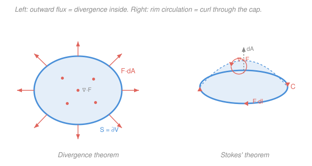

# Mathematical Methods for Physics · Lesson 1.3: The integral theorems: divergence, Stokes, Green

> ⏱ ~15 min · Module 1: Vector calculus & tensors in physics · Builds on: [1.2 Line, surface, and volume integrals](01-02-line-surface-volume-integrals.md) · Unlocks: [1.4 Curvilinear coordinates](01-04-curvilinear-coordinates.md)

## Why this matters

In 1.2 you learned to *set up* flux and circulation integrals. The trouble is that half of them are miserable to evaluate as written — a surface integral over an awkwardly shaped boundary, a line integral around a bent loop. The integral theorems are the escape hatch: they say the boundary integral equals a "bulk" integral over the region inside, so **you get to pick whichever side is easier**. That single move — trade a hard boundary integral for an easy interior one, or vice versa — is the workhorse behind Gauss's law, Ampère's law, conservation laws, and every "flux = enclosed charge" argument in electromagnetism. It is also the payoff of the whole module: it fuses grad/div/curl (1.1) with flux/circulation (1.2) into one idea.

## The idea

Here is the one sentence to keep. **What a field does on the boundary of a region is completely determined by what it does throughout the interior — and vice versa.**

You already met the baby version in first-year calculus. The Fundamental Theorem of Calculus says $\int_a^b f'(x)\,dx = f(b) - f(a)$: sum the *local* rate of change $f'$ over the interior $[a,b]$, and you get a *global* answer that only looks at the two boundary points. The integral theorems are exactly this idea in 2D and 3D, where the "boundary" is a loop or a closed surface instead of two endpoints.

- **Divergence theorem (3D).** Divergence measures how much a point acts as a source (1.1). Add up all the little sources filling a volume and the total has to escape somewhere — through the enclosing surface. So *total divergence inside = net flux out*. If your region has lots of tiny sources but you only care about the net outflow, sum the sources instead of chasing the surface integral.
- **Stokes' theorem (surfaces in 3D).** Curl measures local swirl (1.1). Tile a surface with tiny paddle-wheels; neighboring wheels cancel along their shared edges, and only the outermost rim survives. So *total curl through the surface = circulation around its boundary loop*.
- **Green's theorem** is just Stokes flattened into the plane — the 2D special case, and often the cleanest place to see the mechanism.

## The formal version

**Divergence theorem (Gauss).** For a vector field $\mathbf{F}$ with continuous derivatives on a volume $V$ bounded by the closed surface $S=\partial V$ with outward-pointing area element $d\mathbf{A}$,

$$\iiint_V (\nabla\cdot\mathbf{F})\,dV \;=\; \oiint_S \mathbf{F}\cdot d\mathbf{A}.$$

*In words: the divergence summed over the volume equals the net flux out through its boundary.* Here $\nabla\cdot\mathbf{F}=\partial_x F_x+\partial_y F_y+\partial_z F_z$ is the divergence (a scalar at each point), $dV$ is the volume element, and $\oiint$ is a surface integral over a *closed* surface. The outward orientation of $d\mathbf{A}$ is essential — flip it and you flip the sign.

**Stokes' theorem.** For an oriented open surface $S$ bounded by the closed curve $C=\partial S$,

$$\iint_S (\nabla\times\mathbf{F})\cdot d\mathbf{A} \;=\; \oint_C \mathbf{F}\cdot d\mathbf{l}.$$

*In words: the curl summed over the surface equals the circulation around its boundary.* The orientation rule (right-hand rule): curl the fingers of your right hand along $C$'s direction of travel and your thumb points along $d\mathbf{A}$. Get this handedness wrong and you get a sign error, nothing worse.

**Green's theorem** is Stokes for a flat region $R$ in the $xy$-plane with $\mathbf{F}=(P,Q,0)$. Then $(\nabla\times\mathbf{F})\cdot\hat{\mathbf{z}}=\partial_x Q-\partial_y P$, and the theorem collapses to

$$\oint_C (P\,dx + Q\,dy) \;=\; \iint_R \left(\frac{\partial Q}{\partial x}-\frac{\partial P}{\partial y}\right)dA,$$

with $C$ traversed counterclockwise. *In words: the circulation around a planar loop equals the integrated "swirl" $\partial_x Q-\partial_y P$ over the region it encloses.*

All three, plus the Fundamental Theorem of Calculus, are the **same statement**: *integrate a derivative over a region, get the original quantity evaluated on the boundary.* (In the language of forms you'll meet in [`differential-geometry`](../../differential-geometry/syllabus.md), they are one equation, $\int_M d\omega=\int_{\partial M}\omega$.)

**The payoff for conservative fields.** Stokes closes a loose end from 1.2. On a **simply connected** region (no holes — every loop can shrink to a point), these are all equivalent:

$$\nabla\times\mathbf{F}=\mathbf{0} \iff \mathbf{F}=\nabla\phi \text{ for some }\phi \iff \oint_C\mathbf{F}\cdot d\mathbf{l}=0 \text{ for every loop} \iff \text{work is path-independent}.$$

*Why:* if $\nabla\times\mathbf{F}=\mathbf{0}$, Stokes makes *every* loop integral zero (the surface integrand vanishes), so the work between two points can't depend on the path — which is exactly what having a potential $\phi$ means. The "simply connected" caveat is not a technicality, as the boss problem below shows.

## Picture

## Worked examples

**Example 1 (verify the divergence theorem — do both sides).** Take $\mathbf{F}=\mathbf{r}=(x,y,z)$ and $V$ the unit ball $r\le 1$, $S$ its surface.

*Volume side.* The divergence is $\nabla\cdot\mathbf{r}=\partial_x x+\partial_y y+\partial_z z=3$, a constant, so

$$\iiint_V 3\,dV = 3\cdot\text{Vol}(V)=3\cdot\tfrac{4}{3}\pi(1)^3 = 4\pi.$$

*Surface side.* On the unit sphere the outward normal is $\hat{\mathbf{r}}$ and $\mathbf{F}=\mathbf{r}=\hat{\mathbf{r}}$ has magnitude $1$, so $\mathbf{F}\cdot d\mathbf{A}=1\cdot dA$ and

$$\oiint_S \mathbf{F}\cdot d\mathbf{A}=\oiint_S dA=\text{Area}(S)=4\pi(1)^2=4\pi. \checkmark$$

Both give $4\pi$. Notice the volume side was almost free (constant integrand) while the surface side needed the sphere's area — the theorem let us *choose* the trivial one.

**Example 2 (use Stokes to dodge a nasty line integral).** Evaluate the circulation $\oint_C \mathbf{F}\cdot d\mathbf{l}$ of $\mathbf{F}=(-y,\,x,\,0)$ around the unit circle $C$ in the $xy$-plane, counterclockwise. Doing the line integral directly means parametrizing and integrating trig; instead compute the curl once:

$$\nabla\times\mathbf{F}=\left(\partial_y F_z-\partial_z F_y,\;\partial_z F_x-\partial_x F_z,\;\partial_x F_y-\partial_y F_x\right)=(0,0,\,1-(-1))=(0,0,2).$$

The curl is the constant vector $2\hat{\mathbf{z}}$. Take $S$ = the flat unit disk (any surface bounded by $C$ works — pick the easy one), with $d\mathbf{A}=\hat{\mathbf{z}}\,dA$:

$$\oint_C\mathbf{F}\cdot d\mathbf{l}=\iint_S(\nabla\times\mathbf{F})\cdot d\mathbf{A}=\iint_S 2\,dA=2\cdot\pi(1)^2=2\pi.$$

The circulation is $2\pi$ — a swirling field ($\mathbf{F}=(-y,x,0)$ is rigid rotation) has nonzero circulation, and Stokes turned the loop integral into "constant curl times area."

## Watch out

- **You might think $\nabla\cdot\mathbf{F}=0$ everywhere in a region forces zero flux out of it — but only if $\mathbf{F}$ is smooth *everywhere inside*.** If there's a singular point (a source hiding at $r=0$), the divergence theorem doesn't apply to a volume containing it, and the flux can be nonzero. This is the boss-problem paradox below.
- **You might forget orientation.** Divergence theorem needs the *outward* normal; Stokes needs the right-hand rule linking $C$'s direction to $d\mathbf{A}$. A wrong orientation just flips the sign — but that turns a source into a sink.
- **You might think "$\nabla\times\mathbf{F}=\mathbf{0}\Rightarrow$ conservative" always holds.** It needs the region to be **simply connected**. On a region with a hole (e.g. the plane minus the origin), a curl-free field can still have nonzero loop integrals around the hole. Topology matters.

## One-liner

> Every integral theorem says the same thing — integrate a derivative over a region and you get the field back on the boundary — so always integrate the *easier* side.

## Problems

**P1 (🟢)** Verify the divergence theorem for $\mathbf{F}=(x,\,0,\,0)$ on the unit cube $0\le x,y,z\le 1$: compute $\iiint_V \nabla\cdot\mathbf{F}\,dV$ and the total flux $\oiint_S\mathbf{F}\cdot d\mathbf{A}$ separately and check they match.

**P2 (🟡)** Use Stokes' theorem to evaluate $\oint_C\mathbf{F}\cdot d\mathbf{l}$ for $\mathbf{F}=(y,\,-x,\,0)$ around the circle of radius $3$ in the $xy$-plane, oriented counterclockwise. (Find the curl, then integrate over the disk.)

**P3 (🔴, the boss-problem paradox — conceptual).** For the inverse-square field $\mathbf{F}=\dfrac{\hat{\mathbf{r}}}{r^2}$: (a) using the spherical divergence formula $\nabla\cdot\mathbf{F}=\dfrac{1}{r^2}\dfrac{\partial}{\partial r}\!\left(r^2 F_r\right)$, show $\nabla\cdot\mathbf{F}=0$ for all $r>0$; (b) compute the flux through a sphere of radius $R$ centered at the origin directly; (c) reconcile: the divergence theorem seems to say the flux should be $\iiint 0\,dV=0$, yet it isn't. What has to be true at the origin?

Solutions

**P1** Divergence: $\nabla\cdot\mathbf{F}=\partial_x x=1$, so $\iiint_V 1\,dV=\text{Vol}=1$.

Flux: $\mathbf{F}=(x,0,0)$ only pierces the two faces perpendicular to $x$. On the face $x=1$ the outward normal is $+\hat{\mathbf{x}}$ and $\mathbf{F}\cdot d\mathbf{A}=x\,dA=1\cdot dA$, giving $\iint dA=1$. On the face $x=0$ the outward normal is $-\hat{\mathbf{x}}$ and $\mathbf{F}\cdot d\mathbf{A}=-x\,dA=0$ (since $x=0$). The four faces with normals along $\pm\hat{\mathbf{y}},\pm\hat{\mathbf{z}}$ contribute $0$ because $\mathbf{F}$ has no $y$ or $z$ component. Total flux $=1+0=1$. $\checkmark$

*Check.* Both sides equal $1$; units are consistent (field $\times$ area vs. divergence $\times$ volume, both dimensionless here). The flux "enters flat" at $x=0$ and "leaves stronger" at $x=1$ — the net $=1$ is exactly the uniform source density filling the cube.

**P2** Curl: with $F_x=y,\,F_y=-x,\,F_z=0$,

$$\nabla\times\mathbf{F}=(0,\,0,\;\partial_x(-x)-\partial_y(y))=(0,0,-2).$$

Over the disk $S$ of radius $3$ with $d\mathbf{A}=\hat{\mathbf{z}}\,dA$:

$$\oint_C\mathbf{F}\cdot d\mathbf{l}=\iint_S(-2)\,dA=-2\cdot\pi(3)^2=-18\pi.$$

*Check.* $\mathbf{F}=(y,-x,0)$ is *clockwise* rotation, so its counterclockwise circulation is negative — the sign is right. Magnitude scales as radius$^2$ (area), matching Example 2's $\mathbf{F}=(-y,x,0)$ which gave $+2\pi$ for radius $1$: flip the field's sign, scale area by $9$, get $-18\pi$. $\checkmark$

**P3** (a) Here $F_r=1/r^2$, so $r^2 F_r=1$, a constant, and

$$\nabla\cdot\mathbf{F}=\frac{1}{r^2}\frac{\partial}{\partial r}(1)=0\qquad(r>0).$$

(b) On the sphere of radius $R$, $\mathbf{F}=\hat{\mathbf{r}}/R^2$ and $d\mathbf{A}=\hat{\mathbf{r}}\,dA$, so $\mathbf{F}\cdot d\mathbf{A}=dA/R^2$:

$$\oiint_S\mathbf{F}\cdot d\mathbf{A}=\frac{1}{R^2}\oiint_S dA=\frac{1}{R^2}\cdot 4\pi R^2=4\pi.$$

The flux is $4\pi$ for *every* $R$ — independent of the sphere's size.

(c) The divergence theorem requires $\mathbf{F}$ to be smooth *throughout* the enclosed volume, but $\mathbf{F}=\hat{\mathbf{r}}/r^2$ blows up at $r=0$. The point $r=0$ is excluded from the "$\nabla\cdot\mathbf{F}=0$" calculation, so we may *not* conclude the flux is zero. The mismatch — zero divergence everywhere except one point, yet a flux of $4\pi$ — is the signature of a **point source at the origin**: all the divergence is concentrated there, infinitely dense. The honest statement is $\nabla\cdot\mathbf{F}=4\pi\,\delta^3(\mathbf{r})$, a **Dirac delta function** (built and justified in [4.2](../../mathematical-methods-physics/syllabus.md)). Physically this is Gauss's law: $\mathbf{F}$ is the field of a unit point charge, and the flux $4\pi$ counts the charge inside.

*Check.* $R$-independence is the tell: flux $\propto (1/R^2)\times(\text{area}\propto R^2)$ cancels, so no matter how big the sphere, it captures the same enclosed source — exactly what a single point charge should give. $\checkmark$

## Flashback

**From Lesson 1.2 (Line, surface, and volume integrals):** Compute the flux of the uniform field $\mathbf{F}=(0,0,5)$ through the disk of radius $2$ lying in the plane $z=0$, oriented with normal $+\hat{\mathbf{z}}$. (Fresh variant — a flat surface, do it directly.)

Solution

The field is constant and parallel to the normal, so $\mathbf{F}\cdot d\mathbf{A}=5\,dA$ everywhere on the disk:

$$\iint_S\mathbf{F}\cdot d\mathbf{A}=5\iint_S dA=5\cdot\pi(2)^2=20\pi.$$

*Check.* Flux = (field strength) $\times$ (projected area) since $\mathbf{F}\parallel\hat{\mathbf{n}}$; units of field $\times$ area, and the answer scales with area (radius$^2$) as flux through a flat sheet should. $\checkmark$ This is the "easy side" the integral theorems try to hand you — a constant integrand over a simple region.

## Connections

- **Backward:** this fuses [1.1](01-01-fields-grad-div-curl.md) (div as source density, curl as circulation density) with [1.2](01-02-line-surface-volume-integrals.md) (flux and circulation integrals), and it settles 1.2's open question about when a field is conservative — via the equivalence chain closed by Stokes.
- **Forward:** [1.4 Curvilinear coordinates](01-04-curvilinear-coordinates.md) gives the spherical/cylindrical forms of $\nabla\cdot$ and $\nabla\times$ that P3 leaned on; the point-source paradox is fully resolved with the **delta function** in Module 4, and the same $\int_M d\omega=\int_{\partial M}\omega$ unification reappears in [`differential-geometry`](../../differential-geometry/syllabus.md).
- **Sideways (electromagnetism):** the divergence theorem *is* the machinery behind Gauss's law and Stokes *is* the machinery behind Ampère's law in [`em-refresher`](../../em-refresher/syllabus.md) — Maxwell's equations are usually stated in the local (differential) form, and these theorems are how you convert them to the global (integral) form you actually compute with.
