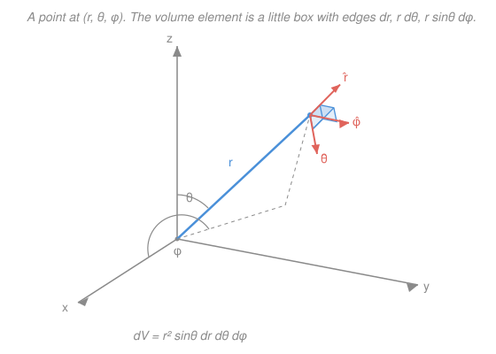

# Mathematical Methods for Physics · Lesson 1.4: Curvilinear coordinates: cylindrical and spherical

> ⏱ ~15 min · Module 1: Vector calculus & tensors in physics · Builds on: [1.3 The integral theorems](01-03-integral-theorems.md), [1.1 Fields, grad, div, curl](01-01-fields-grad-div-curl.md) · Unlocks: [1.5 Index notation & Cartesian tensors](01-05-index-notation-cartesian-tensors.md)

## Why this matters

Nature's problems come with a shape. A point charge, a hydrogen atom, a collapsing star — spherical. A coaxial cable, a whirlpool, a laser beam — cylindrical. Force these onto the $x,y,z$ grid and a one-line problem becomes a page of chain rule. The whole point of curvilinear coordinates is to **match the coordinates to the symmetry**, so that a spherically symmetric field depends on $r$ alone and three of your derivatives vanish before you write them. Every operator you know — $\nabla f$, $\nabla\cdot\mathbf{F}$, $\nabla\times\mathbf{F}$, $\nabla^2 f$ — has a clean form in *any* orthogonal system, and it is controlled by three numbers called **scale factors**. Learn those, and Laplace's equation in the hydrogen atom is suddenly tractable.

## The idea

Think of coordinates as **knobs**. In Cartesian coordinates, turning the $x$ knob by $\mathrm{d}x$ always moves you the same physical distance $\mathrm{d}x$ — one meter of knob, one meter of travel. But turn the *angle* knob $\phi$ in polar coordinates and how far you actually move depends on how far out you are: a degree of longitude is a few meters at the pole and thousands of kilometers at the equator. The conversion factor between "amount of knob turned" and "distance traveled" is the **scale factor** $h_i$.

That single idea powers everything. Distance is $h_i$ per unit knob, so a tiny box has edge lengths $h_1\,\mathrm{d}u_1$, $h_2\,\mathrm{d}u_2$, $h_3\,\mathrm{d}u_3$ and volume $h_1h_2h_3\,\mathrm{d}u_1\mathrm{d}u_2\mathrm{d}u_3$. A gradient measures change *per unit distance*, so along the $u_i$ direction you divide by $h_i$. Div and curl are fluxes and circulations of those little boxes, so scale factors appear there too. Get the three $h_i$ right and every vector-calculus formula follows mechanically.

## The formal version

Let three coordinates $(u_1,u_2,u_3)$ label space through a position function $\mathbf{r}(u_1,u_2,u_3)$. Moving one coordinate traces a curve; its tangent is $\partial\mathbf{r}/\partial u_i$. The **scale factor** is that tangent's length,

$$h_i \equiv \left|\frac{\partial \mathbf{r}}{\partial u_i}\right|,\qquad \hat{\mathbf{e}}_i \equiv \frac{1}{h_i}\frac{\partial \mathbf{r}}{\partial u_i}.$$

*In words: $h_i$ is the physical distance you move per unit change in $u_i$, and $\hat{\mathbf{e}}_i$ is the unit vector pointing that way.* The system is **orthogonal** when $\hat{\mathbf{e}}_i\cdot\hat{\mathbf{e}}_j=\delta_{ij}$ — the three coordinate directions meet at right angles (cylindrical and spherical both do). Everything below assumes orthogonality.

Because the edges are perpendicular, the **line element** (squared distance of a small step) is a clean Pythagorean sum, and the **volume element** is the product of the edge lengths:

$$\mathrm{d}s^2 = h_1^2\,\mathrm{d}u_1^2 + h_2^2\,\mathrm{d}u_2^2 + h_3^2\,\mathrm{d}u_3^2,\qquad \mathrm{d}V = h_1 h_2 h_3\,\mathrm{d}u_1\,\mathrm{d}u_2\,\mathrm{d}u_3.$$

**The two systems you need.** For **cylindrical** $(\rho,\phi,z)$ — distance from the axis, angle around it, height — and **spherical** $(r,\theta,\phi)$ — distance from the origin, polar angle down from the $z$-axis, azimuthal angle around it:

| system | coordinates | $(h_1,h_2,h_3)$ | $\mathrm{d}V$ |
|---|---|---|---|
| cylindrical | $(\rho,\phi,z)$ | $(1,\ \rho,\ 1)$ | $\rho\,\mathrm{d}\rho\,\mathrm{d}\phi\,\mathrm{d}z$ |
| spherical | $(r,\theta,\phi)$ | $(1,\ r,\ r\sin\theta)$ | $r^2\sin\theta\,\mathrm{d}r\,\mathrm{d}\theta\,\mathrm{d}\phi$ |

*In words: turning the $\phi$ knob in cylindrical moves you $\rho\,\mathrm{d}\phi$; in spherical the same azimuthal turn moves you $r\sin\theta\,\mathrm{d}\phi$, shrinking to zero as you approach the poles ($\theta\to0$).* You can read these off the picture below without memorizing.

**The operators.** With $f$ a scalar field and $\mathbf{F}=F_1\hat{\mathbf{e}}_1+F_2\hat{\mathbf{e}}_2+F_3\hat{\mathbf{e}}_3$:

$$(\nabla f)_i = \frac{1}{h_i}\frac{\partial f}{\partial u_i},\qquad \nabla\cdot\mathbf{F} = \frac{1}{h_1h_2h_3}\left[\frac{\partial (h_2h_3F_1)}{\partial u_1}+\frac{\partial (h_3h_1F_2)}{\partial u_2}+\frac{\partial (h_1h_2F_3)}{\partial u_3}\right],$$

$$\nabla\times\mathbf{F} = \frac{1}{h_1h_2h_3}\begin{vmatrix} h_1\hat{\mathbf{e}}_1 & h_2\hat{\mathbf{e}}_2 & h_3\hat{\mathbf{e}}_3 \\[2pt] \partial_{u_1} & \partial_{u_2} & \partial_{u_3} \\[2pt] h_1F_1 & h_2F_2 & h_3F_3 \end{vmatrix},\qquad \nabla^2 f = \frac{1}{h_1h_2h_3}\sum_{i}\frac{\partial}{\partial u_i}\!\left[\frac{h_1h_2h_3}{h_i^2}\frac{\partial f}{\partial u_i}\right].$$

*In words: gradient divides each derivative by its scale factor; divergence and Laplacian weight each derivative so that flux is counted correctly through the curved box.* These four formulas, plus the table of $h_i$, generate every coordinate-specific expression — there is nothing else to memorize.

**Spherical Laplacian, written out.** Substituting $(h_r,h_\theta,h_\phi)=(1,r,r\sin\theta)$, so $h_1h_2h_3=r^2\sin\theta$:

$$\boxed{\ \nabla^2 f = \frac{1}{r^2}\frac{\partial}{\partial r}\!\left(r^2\frac{\partial f}{\partial r}\right) + \frac{1}{r^2\sin\theta}\frac{\partial}{\partial\theta}\!\left(\sin\theta\,\frac{\partial f}{\partial\theta}\right) + \frac{1}{r^2\sin^2\theta}\frac{\partial^2 f}{\partial\phi^2}\ }$$

The first term is the **radial** part; the last two make up the **angular** part $\frac{1}{r^2}$ times the operator whose eigenfunctions are the [Legendre polynomials and spherical harmonics](03-02-legendre-spherical-harmonics.md) (Lesson 3.2). That is not a coincidence: separation of variables in any spherical boundary problem hands you exactly that angular operator.

**Use by symmetry.** If $f=f(r)$ depends on radius alone, the angular derivatives vanish and the whole Laplacian collapses to

$$\nabla^2 f(r) = \frac{1}{r^2}\frac{\mathrm{d}}{\mathrm{d}r}\!\left(r^2\frac{\mathrm{d}f}{\mathrm{d}r}\right).$$

*In words: for anything spherically symmetric, the three-dimensional Laplacian becomes one ordinary derivative in $r$.* This is the payoff — matching coordinates to symmetry turns a PDE into an ODE.

## Picture

## Worked examples

**Example 1 (mechanical — the symmetry collapse).** Compute $\nabla^2(r^2)$. Here $f=r^2$ is radial, so use the collapsed form with $f'=2r$:

$$\nabla^2(r^2) = \frac{1}{r^2}\frac{\mathrm{d}}{\mathrm{d}r}\!\left(r^2\cdot 2r\right) = \frac{1}{r^2}\frac{\mathrm{d}}{\mathrm{d}r}\!\left(2r^3\right) = \frac{1}{r^2}\cdot 6r^2 = 6.$$

*Check.* In Cartesian, $r^2=x^2+y^2+z^2$, so $\nabla^2 r^2 = 2+2+2 = 6$. ✓ One derivative did the work of three.

**Example 2 (why you'd care — Coulomb's potential is harmonic).** The electrostatic (and gravitational) potential of a point source is $f=1/r$. Is it a solution of Laplace's equation $\nabla^2 f=0$ away from the source? It is radial, so with $f'=-1/r^2$:

$$\nabla^2\!\left(\frac{1}{r}\right) = \frac{1}{r^2}\frac{\mathrm{d}}{\mathrm{d}r}\!\left(r^2\cdot\left(-\frac{1}{r^2}\right)\right) = \frac{1}{r^2}\frac{\mathrm{d}}{\mathrm{d}r}(-1) = \frac{1}{r^2}\cdot 0 = 0\qquad(r>0).$$

So $1/r$ is **harmonic** everywhere except the origin — the deep reason the Coulomb and Newtonian potentials have the shape they do. The origin is special: that is where the source (the delta-function charge) lives, and the $1/r^2$ inside the derivative is exactly what makes $r^2 f'$ constant, killing the derivative. This is the same structure that will make $1/r$ the free-space Green's function for $\nabla^2$ in [`em-refresher`](../../em-refresher/syllabus.md).

## Watch out

- **You might grab Cartesian formulas by habit.** In curvilinear coordinates $\nabla^2 f \ne \partial_r^2 f + \partial_\theta^2 f + \partial_\phi^2 f$. The scale factors are not decoration — dropping them is the single most common error. Always route through the $h_i$.
- **You might think the unit vectors are constant.** $\hat{\mathbf{r}},\hat{\boldsymbol\theta},\hat{\boldsymbol\phi}$ *point in different directions at different places*, unlike $\hat{\mathbf{x}},\hat{\mathbf{y}},\hat{\mathbf{z}}$. That is precisely why the derivative operators carry extra $h_i$ terms rather than acting component-by-component — the basis itself is turning as you move.
- **Watch which angle is which.** Physics convention (used here and in the table): $\theta$ is the **polar** angle measured down from the $z$-axis, $\phi$ is the **azimuthal** angle around it. Math texts often swap the names. The scale factor $r\sin\theta$ belongs to the azimuthal angle — the one that shrinks to zero at the poles.

## One-liner

> Match the coordinates to the symmetry: three scale factors $h_i$ turn every operator into a mechanical formula, and a radial field's Laplacian collapses to $\tfrac{1}{r^2}(r^2 f')'$.

## Problems

**P1 (🟢)** Compute the volume of a sphere of radius $R$ by integrating the spherical volume element $\mathrm{d}V=r^2\sin\theta\,\mathrm{d}r\,\mathrm{d}\theta\,\mathrm{d}\phi$ over $r\in[0,R]$, $\theta\in[0,\pi]$, $\phi\in[0,2\pi]$.

**P2 (🟡)** For a radial power law $f(r)=r^n$, show that $\nabla^2 r^n = n(n+1)\,r^{n-2}$. Which two integer values of $n$ make $f$ harmonic ($\nabla^2 f=0$ for $r>0$), and what physical potentials do they correspond to?

**P3 (🔴, optional)** The electric field of an infinite line charge (density $\lambda$) is $\mathbf{E} = \dfrac{\lambda}{2\pi\varepsilon_0\,\rho}\,\hat{\boldsymbol\rho}$ in cylindrical coordinates, where $\varepsilon_0$ is the permittivity of free space. Using the cylindrical divergence formula, show $\nabla\cdot\mathbf{E}=0$ for $\rho>0$. Why is this the expected answer between the charges?

Solutions

**P1** The integrand separates into three one-variable integrals:

$$V = \int_0^{2\pi}\!\mathrm{d}\phi \int_0^{\pi}\!\sin\theta\,\mathrm{d}\theta \int_0^{R}\! r^2\,\mathrm{d}r = \big(2\pi\big)\Big(\big[-\cos\theta\big]_0^{\pi}\Big)\left(\frac{R^3}{3}\right) = (2\pi)(2)\left(\frac{R^3}{3}\right) = \frac{4}{3}\pi R^3.$$

*Check.* The known volume of a sphere is $\tfrac{4}{3}\pi R^3$. ✓ Note the $\theta$-integral gave exactly $2$ (the full solid-angle factor $4\pi$ split as $2\pi\times2$), and the $r^2$ — the product $h_\theta h_\phi = r\cdot r\sin\theta$ — is what makes it a *volume* and not an area.

**P2** Use the collapsed radial Laplacian with $f=r^n$, $f'=n\,r^{n-1}$:

$$\nabla^2 r^n = \frac{1}{r^2}\frac{\mathrm{d}}{\mathrm{d}r}\!\left(r^2\cdot n r^{n-1}\right) = \frac{1}{r^2}\frac{\mathrm{d}}{\mathrm{d}r}\!\left(n\,r^{n+1}\right) = \frac{1}{r^2}\,n(n+1)\,r^{n} = n(n+1)\,r^{n-2}.$$

This vanishes when $n(n+1)=0$, i.e. $n=0$ or $n=-1$. So the two harmonic radial solutions are $f=\text{const}$ (a uniform potential, zero field) and $f=1/r$ (the **Coulomb / Newtonian point-source potential**). These are the two independent solutions of the radial Laplace equation, the building blocks of every spherically symmetric boundary problem.

*Check.* Setting $n=2$ recovers Example 1: $2\cdot3\,r^0 = 6$. ✓ Setting $n=-1$ recovers Example 2: $(-1)(0)\,r^{-3}=0$. ✓

**P3** Only the $\rho$-component of $\mathbf{E}$ is nonzero, $E_\rho = \dfrac{\lambda}{2\pi\varepsilon_0\,\rho}$, with $E_\phi=E_z=0$. The cylindrical divergence is

$$\nabla\cdot\mathbf{E} = \frac{1}{\rho}\frac{\partial(\rho\,E_\rho)}{\partial\rho} + \frac{1}{\rho}\frac{\partial E_\phi}{\partial\phi} + \frac{\partial E_z}{\partial z}.$$

The last two terms are zero. For the first, $\rho\,E_\rho = \dfrac{\lambda}{2\pi\varepsilon_0}$ is a **constant** in $\rho$, so its derivative vanishes:

$$\nabla\cdot\mathbf{E} = \frac{1}{\rho}\cdot 0 = 0\qquad(\rho>0).$$

The scale-factor weighting $\rho\,E_\rho$ is exactly what cancels the $1/\rho$ falloff of the field. *Check.* By Gauss's law, $\nabla\cdot\mathbf{E}=\varrho/\varepsilon_0$ where $\varrho$ is the charge density; away from the line ($\rho>0$) there is no charge, so the divergence must be zero — the field spreads as $1/\rho$ precisely so that no flux is created in empty space. ✓

## Flashback

**From Lesson 1.3 (The integral theorems):** Verify the divergence theorem for the radial position field $\mathbf{F}=\mathbf{r}=r\,\hat{\mathbf{r}}$ over a ball of radius $R$: compute the outward flux $\oint_{\partial V}\mathbf{F}\cdot\mathrm{d}\mathbf{A}$ through the sphere directly, and separately compute $\int_V \nabla\cdot\mathbf{F}\,\mathrm{d}V$, and check they agree. (Fresh variant — a spherical surface, using this lesson's volume element.)

Solution

**Flux side.** On the sphere the outward normal is $\hat{\mathbf{r}}$, so $\mathbf{F}\cdot\mathrm{d}\mathbf{A} = (r\,\hat{\mathbf{r}})\cdot(\hat{\mathbf{r}}\,\mathrm{d}A) = r\,\mathrm{d}A = R\,\mathrm{d}A$ at $r=R$. The surface area is $4\pi R^2$, so

$$\oint_{\partial V}\mathbf{F}\cdot\mathrm{d}\mathbf{A} = R\cdot 4\pi R^2 = 4\pi R^3.$$

**Divergence side.** Using the spherical divergence with $F_r=r$, $F_\theta=F_\phi=0$:

$$\nabla\cdot\mathbf{r} = \frac{1}{r^2}\frac{\partial}{\partial r}\!\left(r^2\cdot r\right) = \frac{1}{r^2}\cdot 3r^2 = 3.$$

Then $\displaystyle\int_V 3\,\mathrm{d}V = 3\cdot\frac{4}{3}\pi R^3 = 4\pi R^3.$

*Check.* Both sides give $4\pi R^3$. ✓ The constant $\nabla\cdot\mathbf{r}=3$ is the dimension of space — a clean sanity check you will reuse constantly. This is the same $\nabla\cdot\mathbf{r}=3$ you would get in Cartesian ($\partial_x x+\partial_y y+\partial_z z$), now confirmed through the curvilinear divergence formula.

## Connections

- **Backward:** the $\mathrm{d}V=h_1h_2h_3\,\mathrm{d}u_1\mathrm{d}u_2\mathrm{d}u_3$ element is what makes the volume integrals of [1.3 The integral theorems](01-03-integral-theorems.md) actually computable, and the operators here are the coordinate-specific forms of the grad/div/curl defined abstractly in [1.1](01-01-fields-grad-div-curl.md).
- **Forward:** the angular part of the spherical Laplacian is the operator behind [3.2 Legendre polynomials and spherical harmonics](03-02-legendre-spherical-harmonics.md); the cylindrical radial part leads to [3.3 Bessel functions](03-03-bessel-functions.md). Separation of variables in [`pdes`](../../pdes/syllabus.md) starts exactly from these boxed Laplacians.
- **Sideways (quantum mechanics):** the hydrogen-atom Schrödinger equation *is* $\nabla^2\psi$ in spherical coordinates — the radial collapse $\tfrac{1}{r^2}(r^2\psi')'$ plus the angular operator gives the radial equation and the spherical harmonics of [`quantum-mechanics`](../../quantum-mechanics/syllabus.md), and the same harmonic $1/r$ potential drives Laplace/Poisson problems in [`em-refresher`](../../em-refresher/syllabus.md).
