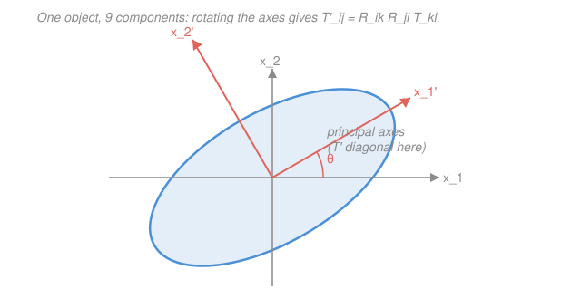

# Mathematical Methods for Physics · Lesson 1.5: Index notation, Einstein summation, and Cartesian tensors

> ⏱ ~15 min · Module 1: Vector calculus & tensors in physics · Builds on: [1.4 Curvilinear coordinates](01-04-curvilinear-coordinates.md), [1.1 Fields, grad, div, curl](01-01-fields-grad-div-curl.md) · Unlocks: [2.1 Analytic functions and the Cauchy–Riemann equations](02-01-analytic-functions-cauchy-riemann.md)

## Why this matters

Every physicist eventually stops proving vector identities with pictures and clever tricks and starts *computing* them — turning $\nabla\times(\nabla\phi)=0$ from a fact you memorize into two lines of index pushing anyone can reproduce. The same notation that mechanizes those identities is the only sane way to write down the objects that need *two* directions to specify them: the moment of inertia that relates spin axis to angular momentum, the stress that relates a surface's orientation to the force on it, the polarizability that relates an applied field to the dipole it induces. These are **rank-2 tensors**, and index notation is their native language. Master it here and the tensor algebra of relativity and continuum mechanics is just more of the same alphabet.

## The idea

Vector equations hide their machinery. Write $\mathbf{a}\cdot\mathbf{b}$ and you're secretly summing three products; write $\mathbf{a}\times\mathbf{b}$ and you're doing a determinant in your head. Index notation makes the machinery explicit: name the components, write the sum, and let two bookkeeping symbols do all the geometry.

The first bookkeeping trick is **Einstein's convention**: whenever an index appears *twice* in a single term, you sum it over $1,2,3$ — and you stop writing the $\sum$. So $a_i b_i$ *means* $a_1b_1+a_2b_2+a_3b_3$, the dot product, automatically. An index that's summed away (like $i$ here) is a **dummy** — it names nothing in the answer and you can rename it freely. An index left over (appearing once) is **free** — it labels which component of the result you're looking at, and it must match on both sides of every equation.

The second trick is two special symbols that encode *all* of $\mathbb{R}^3$ geometry. The **Kronecker delta** $\delta_{ij}$ is "are these the same axis?" — 1 if yes, 0 if no. The **Levi–Civita symbol** $\varepsilon_{ijk}$ is "are these axes a right-handed set?" — $+1$ for a cyclic order like $123$, $-1$ for a swap like $132$, $0$ if any repeat. Dot products are made of $\delta$; cross products are made of $\varepsilon$; and one identity linking the two lets you prove essentially every vector identity by pure algebra.

## The formal version

Work in Cartesian coordinates with orthonormal axes $\hat{\mathbf{e}}_1,\hat{\mathbf{e}}_2,\hat{\mathbf{e}}_3$; a vector is $\mathbf{a}=a_i\hat{\mathbf{e}}_i$ (sum on $i$). Latin indices run over $1,2,3$.

**Summation convention.** In any single term, a repeated index is summed:
$$a_i b_i \equiv \sum_{i=1}^{3} a_i b_i .$$
*In words: see an index twice, sum it.* A repeated index is **dummy** (rename at will: $a_i b_i = a_k b_k$); an unrepeated index is **free** and must appear identically in every term and on both sides. A legal index equation never has the same index appearing three or more times in one term.

**Kronecker delta.**
$$\delta_{ij} = \begin{cases}1 & i=j\\ 0 & i\neq j\end{cases}, \qquad \delta_{ii}=3, \qquad \delta_{ij}\,a_j = a_i .$$
*In words: $\delta_{ij}$ is the identity matrix; its trace is 3, and summing it against a vector just renames the index* — the "substitution" property you'll use constantly.

**Levi–Civita symbol.** Totally antisymmetric, fixed by $\varepsilon_{123}=1$:
$$\varepsilon_{ijk}=\begin{cases}+1 & (ijk)\ \text{an even permutation of }123\\ -1 & (ijk)\ \text{an odd permutation}\\ 0 & \text{any index repeats.}\end{cases}$$
*In words: $+1$ for cyclic $123,231,312$; $-1$ for anticyclic $132,321,213$; $0$ otherwise.* Swapping any two indices flips the sign: $\varepsilon_{ijk}=-\varepsilon_{jik}$.

**The whole toolkit in indices.** With $\partial_i \equiv \partial/\partial x_i$:
$$\mathbf{a}\cdot\mathbf{b}=a_i b_i, \qquad (\mathbf{a}\times\mathbf{b})_i=\varepsilon_{ijk}a_j b_k, \qquad \nabla\cdot\mathbf{F}=\partial_i F_i, \qquad (\nabla\times\mathbf{F})_i=\varepsilon_{ijk}\,\partial_j F_k .$$
*In words: dots are built from $\delta$ (hidden inside $a_ib_i=\delta_{ij}a_ib_j$), curls and cross products from $\varepsilon$; the free index $i$ on the last two tells you which component you're computing.*

**The $\varepsilon$–$\delta$ identity** (the workhorse — contract two Levi–Civitas over their *first* index):
$$\boxed{\;\varepsilon_{ijk}\,\varepsilon_{ilm} = \delta_{jl}\delta_{km}-\delta_{jm}\delta_{kl}\;}$$
*In words: a cross-of-a-cross collapses into dot products.* (Memory aid: the surviving deltas pair the "outer" indices in order minus swapped order. Fully contracted, $\varepsilon_{ijk}\varepsilon_{ijk}=6$.)

**Rank-2 Cartesian tensors.** A **rank-2 tensor** $T_{ij}$ is a 9-component object (a $3\times3$ array) that relates one vector to another linearly — e.g. angular momentum to angular velocity via inertia, $L_i=I_{ij}\omega_j$; or force-per-area to surface normal via stress, $t_i=\sigma_{ij}n_j$; or induced dipole to field via polarizability, $p_i=\alpha_{ij}E_j$. What makes it a *tensor* (not just an array) is how it transforms when you rotate the axes by an orthogonal matrix $R$ (so $x_i'=R_{ij}x_j$, with $R_{ik}R_{jk}=\delta_{ij}$):
$$T'_{ij}=R_{ik}R_{jl}\,T_{kl}.$$
*In words: each of the tensor's two indices rotates the same way a vector's single index does — one factor of $R$ per slot.* A vector ($T_i'=R_{ij}T_j$) is the rank-1 case; a scalar (rank-0) doesn't transform at all. A **symmetric** tensor $T_{ij}=T_{ji}$ (inertia, stress, and polarizability all are) can always be rotated into a frame where it's diagonal — its **principal axes** — which is exactly eigenvector diagonalization in disguise.

## Picture

The blue ellipse *is* the tensor — a fixed physical object (think: the inertia ellipsoid of a rigid body). Its shape doesn't move; only your axes do. In the grey frame the tensor has off-diagonal components; rotate to the coral frame aligned with the ellipse's principal axes and $T'$ goes diagonal. The rule $T'_{ij}=R_{ik}R_{jl}T_{kl}$ is just the bookkeeping for that re-labeling.

## Worked examples

**Example 1 (mechanical — $\varepsilon$–$\delta$ in action: the BAC–CAB rule).** Prove $\mathbf{a}\times(\mathbf{b}\times\mathbf{c})=\mathbf{b}\,(\mathbf{a}\cdot\mathbf{c})-\mathbf{c}\,(\mathbf{a}\cdot\mathbf{b})$.

Take the $i$-th component and unpack the two cross products, reusing a dummy index carefully. The inner curl is $(\mathbf{b}\times\mathbf{c})_k=\varepsilon_{klm}b_l c_m$, so
$$[\mathbf{a}\times(\mathbf{b}\times\mathbf{c})]_i=\varepsilon_{ijk}\,a_j\,(\mathbf{b}\times\mathbf{c})_k=\varepsilon_{ijk}\,\varepsilon_{klm}\,a_j b_l c_m .$$
Cycle the first $\varepsilon$ so both share their summed index in the *first* slot: $\varepsilon_{ijk}=\varepsilon_{kij}$. Now $\varepsilon_{kij}\varepsilon_{klm}=\delta_{il}\delta_{jm}-\delta_{im}\delta_{jl}$ by the identity. Substituting,
$$=(\delta_{il}\delta_{jm}-\delta_{im}\delta_{jl})\,a_j b_l c_m=\underbrace{a_j b_i c_j}_{\delta_{il}\to l=i,\ \delta_{jm}\to m=j}-\underbrace{a_j b_j c_i}_{\delta_{im}\to m=i,\ \delta_{jl}\to l=j}=b_i\,(a_j c_j)-c_i\,(a_j b_j).$$
That is exactly the $i$-th component of $\mathbf{b}\,(\mathbf{a}\cdot\mathbf{c})-\mathbf{c}\,(\mathbf{a}\cdot\mathbf{b})$. No geometry, no memory — just the identity. $\blacksquare$

**Example 2 (why you'd care — curl of a gradient is zero).** Show $\nabla\times(\nabla\phi)=\mathbf{0}$ for any twice-differentiable scalar field $\phi$. This is the second half of **Boss problem 1**, and it exposes the single most useful move in the subject: *an antisymmetric symbol contracted with a symmetric object vanishes.*

The $i$-th component is
$$[\nabla\times(\nabla\phi)]_i=\varepsilon_{ijk}\,\partial_j(\partial_k\phi)=\varepsilon_{ijk}\,\partial_j\partial_k\phi .$$
Mixed partials commute (Clairaut): $\partial_j\partial_k\phi=\partial_k\partial_j\phi$, so the double-derivative is **symmetric** in $j\leftrightarrow k$. But $\varepsilon_{ijk}$ is **antisymmetric** in $j\leftrightarrow k$. Summing a symmetric quantity against an antisymmetric one over the same pair gives zero — swapping the dummy names $j\leftrightarrow k$ reproduces the same sum with a minus sign, so it equals its own negative:
$$\varepsilon_{ijk}\,\partial_j\partial_k\phi=\varepsilon_{ikj}\,\partial_k\partial_j\phi=-\varepsilon_{ijk}\,\partial_j\partial_k\phi \;\Longrightarrow\; \varepsilon_{ijk}\,\partial_j\partial_k\phi=0 .$$
Hence every component vanishes: $\nabla\times(\nabla\phi)=\mathbf{0}$. The identical argument on $\varepsilon_{ijk}\partial_i\partial_j F_k$ gives $\nabla\cdot(\nabla\times\mathbf{F})=0$ — a divergence of a curl is zero for the same reason.

## Watch out

- **You might write an index three times in one term.** That's meaningless — the convention only ever pairs indices. If you find yourself with $a_i b_i c_i$, you've collided two independent sums; rename one dummy (e.g. $a_i b_i c_j$) to say what you actually mean.
- **You might drop or mismatch a free index across the equals sign.** Free indices are a type-check: if the left side has a free $i$, every term on the right must too. $(\mathbf{a}\times\mathbf{b})_i=\varepsilon_{ijk}a_j b_k$ is legal; "$=\varepsilon_{ijk}a_i b_k$" is nonsense because $i$ is now both free and summed.
- **You might apply the $\varepsilon$–$\delta$ identity with the shared index in the wrong slot.** $\varepsilon_{ijk}\varepsilon_{ilm}=\delta_{jl}\delta_{km}-\delta_{jm}\delta_{kl}$ requires the common index ($i$) *first* in both. If it isn't, cyclically rotate ($\varepsilon_{ijk}=\varepsilon_{jki}=\varepsilon_{kij}$) or swap-with-a-sign first — don't just read off deltas.
- **You might think every $3\times3$ array is a tensor.** Not so: a genuine tensor must transform as $T'_{ij}=R_{ik}R_{jl}T_{kl}$. An array of nine unrelated numbers that doesn't obey that rule under rotation is just a table.

## One-liner

> Repeated index means sum; $\delta$ carries dots and $\varepsilon$ carries crosses; and $\varepsilon_{ijk}\varepsilon_{ilm}=\delta_{jl}\delta_{km}-\delta_{jm}\delta_{kl}$ turns every vector identity — and the vanishing of curl-grad and div-curl — into two lines of algebra.

## Problems

**P1 (🟢)** Evaluate each fully-contracted expression: (a) $\delta_{ii}$, (b) $\delta_{ij}\delta_{ij}$, (c) $\varepsilon_{ijk}\delta_{jk}$, (d) $\varepsilon_{ijk}\varepsilon_{ijk}$.

**P2 (🟡)** Prove the identity $\nabla\cdot(\nabla\times\mathbf{F})=0$ in index notation, stating exactly which symmetry/antisymmetry cancellation you use. (This is the div-of-curl companion to Boss problem 1b's curl-of-grad.)

**P3 (🔴, optional)** Use the $\varepsilon$–$\delta$ identity to prove $(\mathbf{a}\times\mathbf{b})\cdot(\mathbf{c}\times\mathbf{d})=(\mathbf{a}\cdot\mathbf{c})(\mathbf{b}\cdot\mathbf{d})-(\mathbf{a}\cdot\mathbf{d})(\mathbf{b}\cdot\mathbf{c})$ (the Binet–Cauchy identity), and read off the special case $\mathbf{c}=\mathbf{a},\ \mathbf{d}=\mathbf{b}$.

Solutions

**P1**
(a) $\delta_{ii}=\delta_{11}+\delta_{22}+\delta_{33}=3$ (trace of the identity).
(b) $\delta_{ij}\delta_{ij}$: use substitution once, $\delta_{ij}\delta_{ij}=\delta_{jj}=3$. (Equivalently, it's $\sum_{i,j}\delta_{ij}^2$ = number of diagonal 1's = 3.)
(c) $\varepsilon_{ijk}\delta_{jk}$ sets $k=j$ and sums: $\varepsilon_{ijj}=0$ for every $i$ (a repeated index kills $\varepsilon$). So the answer is $0$ — an antisymmetric symbol summed against the symmetric $\delta_{jk}$ must vanish.
(d) $\varepsilon_{ijk}\varepsilon_{ijk}$: contract the $\varepsilon$–$\delta$ identity with $l=j,m=k$: $\varepsilon_{ijk}\varepsilon_{ijk}=\delta_{jj}\delta_{kk}-\delta_{jk}\delta_{kj}=3\cdot3-\delta_{jk}\delta_{jk}=9-3=6$.

*Check.* $\varepsilon$ has exactly 6 nonzero entries, each $\pm1$, so summing their squares gives $6$ ✓; and (c) had to be zero by the same symmetric-times-antisymmetric principle used in Example 2. ✓

**P2** Write the scalar in indices: $\nabla\cdot(\nabla\times\mathbf{F})=\partial_i(\nabla\times\mathbf{F})_i=\partial_i(\varepsilon_{ijk}\partial_j F_k)=\varepsilon_{ijk}\,\partial_i\partial_j F_k$. The second-derivative operator $\partial_i\partial_j$ is **symmetric** under $i\leftrightarrow j$ (mixed partials commute), while $\varepsilon_{ijk}$ is **antisymmetric** under $i\leftrightarrow j$. Renaming the dummies $i\leftrightarrow j$,
$$\varepsilon_{ijk}\partial_i\partial_j F_k=\varepsilon_{jik}\partial_j\partial_i F_k=-\varepsilon_{ijk}\partial_i\partial_j F_k,$$
so the expression equals its own negative and is therefore $0$.

*Check.* Same mechanism as curl-grad (Example 2): $\varepsilon$ antisymmetric in the two derivative indices, $\partial\partial$ symmetric in them. Physically, a curl field is always source-free — magnetic fields $\mathbf{B}=\nabla\times\mathbf{A}$ obey $\nabla\cdot\mathbf{B}=0$ automatically. ✓

**P3** Take components: $(\mathbf{a}\times\mathbf{b})\cdot(\mathbf{c}\times\mathbf{d})=(\varepsilon_{ijk}a_j b_k)(\varepsilon_{ilm}c_l d_m)=\varepsilon_{ijk}\varepsilon_{ilm}\,a_j b_k c_l d_m$. The two $\varepsilon$'s already share their first index $i$, so apply the identity directly:
$$=(\delta_{jl}\delta_{km}-\delta_{jm}\delta_{kl})\,a_j b_k c_l d_m=a_j b_k c_j d_k - a_j b_k c_k d_j=(a_j c_j)(b_k d_k)-(a_j d_j)(b_k c_k).$$
That is $(\mathbf{a}\cdot\mathbf{c})(\mathbf{b}\cdot\mathbf{d})-(\mathbf{a}\cdot\mathbf{d})(\mathbf{b}\cdot\mathbf{c})$. Setting $\mathbf{c}=\mathbf{a}$, $\mathbf{d}=\mathbf{b}$:
$$|\mathbf{a}\times\mathbf{b}|^2=|\mathbf{a}|^2|\mathbf{b}|^2-(\mathbf{a}\cdot\mathbf{b})^2,$$
which is $|\mathbf{a}|^2|\mathbf{b}|^2\sin^2\theta$ — Lagrange's identity, the "$\sin^2+\cos^2=1$" of vector algebra.

*Check.* The special case has the right units (length$^4$) and reduces to $|\mathbf{a}|^2|\mathbf{b}|^2$ when $\mathbf{a}\perp\mathbf{b}$ ($\mathbf{a}\cdot\mathbf{b}=0$), matching a maximal cross product. ✓

## Flashback

**From Lesson 1.4 (Curvilinear coordinates):** In spherical coordinates $(r,\theta,\phi)$ the scale factors are $h_r=1,\ h_\theta=r,\ h_\phi=r\sin\theta$. Using the divergence formula $\nabla\cdot\mathbf{F}=\dfrac{1}{h_r h_\theta h_\phi}\Big[\partial_r(h_\theta h_\phi F_r)+\partial_\theta(h_r h_\phi F_\theta)+\partial_\phi(h_r h_\theta F_\phi)\Big]$, compute $\nabla\cdot\mathbf{F}$ for the purely radial field $\mathbf{F}=r^2\,\hat{\mathbf{r}}$ (so $F_r=r^2,\ F_\theta=F_\phi=0$).

Solution

Only the radial term survives. With $h_\theta h_\phi=r\cdot r\sin\theta=r^2\sin\theta$ and $h_r h_\theta h_\phi=r^2\sin\theta$,
$$\nabla\cdot\mathbf{F}=\frac{1}{r^2\sin\theta}\,\partial_r\big(r^2\sin\theta\cdot r^2\big)=\frac{1}{r^2\sin\theta}\,\sin\theta\,\partial_r(r^4)=\frac{4r^3}{r^2}=4r.$$

*Check.* For a radial field $\mathbf{F}=f(r)\hat{\mathbf{r}}$ the compact form is $\nabla\cdot\mathbf{F}=\frac{1}{r^2}\frac{d}{dr}(r^2 f)$; here $\frac{1}{r^2}\frac{d}{dr}(r^4)=\frac{4r^3}{r^2}=4r$ ✓. Contrast the inverse-square field $f=1/r^2$ of Boss problem 1, where $r^2 f=1$ is constant and the divergence is $0$ away from the origin — the whole point of that puzzle. ✓

## Connections

- **Backward:** this rewrites the operators of [1.1](01-01-fields-grad-div-curl.md) ($\nabla\cdot\mathbf{F}=\partial_i F_i$, $(\nabla\times\mathbf{F})_i=\varepsilon_{ijk}\partial_j F_k$) and the integral-theorem identities of [1.3](01-03-integral-theorems.md) into a form you can *derive* rather than recall. The $\delta_{ij}$ substitution is orthonormality of the Cartesian basis, $\hat{\mathbf{e}}_i\cdot\hat{\mathbf{e}}_j=\delta_{ij}$.
- **Forward:** the transformation rule $T'_{ij}=R_{ik}R_{jl}T_{kl}$ is the Cartesian ancestor of the general tensor transformation law in [`relativity`](../../relativity/syllabus.md), where indices split into up/down and $R$ becomes the Lorentz transformation; and $\varepsilon_{ijk}$ reappears as the structure constants of angular momentum in [`quantum-mechanics`](../../quantum-mechanics/syllabus.md).
- **Sideways (linear algebra):** diagonalizing a symmetric tensor to find its principal axes *is* eigenvector diagonalization — the principal axes are the eigenvectors, the principal moments/stresses are the eigenvalues. See [`linalg-refresher` syllabus](../../linalg-refresher/syllabus.md) (spectral theorem for symmetric matrices), which guarantees a symmetric $T_{ij}$ has a real orthonormal eigenbasis, i.e. an orthogonal $R$ that diagonalizes it.
