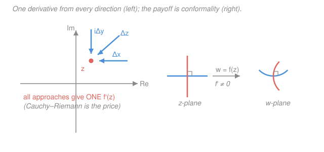

# Mathematical Methods for Physics · Lesson 2.1: Analytic functions and the Cauchy–Riemann equations

> ⏱ ~15 min · Module 2: Complex methods and contour integration · Builds on: [1.5 Index notation & Cartesian tensors](01-05-index-notation-cartesian-tensors.md), [`calc-refresher` syllabus](../../calc-refresher/syllabus.md) · Unlocks: [2.2 Contour integrals, Cauchy's theorem](02-02-contour-integrals-cauchy-theorem.md)

## Why this matters

The entire machinery of contour integration — the trick that turns a nightmare real integral into "sum the poles and go home" — rests on one property: the integrand is **analytic**. Analytic functions are absurdly rigid. Know one on a tiny disk and you know it everywhere it can be continued; its real and imaginary parts can't wiggle independently but are locked together, each forced to be **harmonic** ($\nabla^2 = 0$). That last fact is the bridge from this module back to Module 1's Laplacian: every 2D electrostatics or ideal-fluid problem is secretly a problem about the real part of some analytic function. This lesson is where that rigidity is born, in a single innocent-looking demand about a derivative.

## The idea

In real calculus, a derivative is a slope: you approach a point from the left and from the right and, if the two limits agree, $f'(x)$ exists. There are only two directions, and they're opposite.

In the complex plane a point $z$ has a whole *disk* of directions to approach from — along the real axis, along the imaginary axis, along any diagonal, in a spiral. **Complex differentiability demands that the difference quotient give the *same* limit no matter which way you come in.** That is a wildly stronger condition than real differentiability. A generic function of $(x,y)$ has no reason to cooperate: approach along $x$ and you sample how it changes horizontally; approach along $y$ and you sample the vertical change; there's no law forcing those to be compatible.

Forcing them to be compatible is exactly the content of the **Cauchy–Riemann equations**. They're two equations linking the four partial derivatives of the real and imaginary parts, and they are the price of admission to the whole beautiful theory. Pay it, and you get harmonicity, angle-preserving maps, and (next lesson) Cauchy's theorem for free.

## The formal version

Write a complex function by splitting it into real and imaginary parts:

$$f(z) = u(x,y) + i\,v(x,y), \qquad z = x + iy,$$

where $u$ and $v$ are ordinary real-valued functions of the two real coordinates $(x,y)$. *In words: a complex function is just two real fields on the plane, bundled together.*

**Complex derivative.** $f$ is complex-differentiable at $z$ if

$$f'(z) = \lim_{\Delta z \to 0} \frac{f(z + \Delta z) - f(z)}{\Delta z}$$

exists **and takes the same value for every way** $\Delta z \to 0$. *In words: the slope must not care about the direction you approach from.*

**Deriving Cauchy–Riemann.** Force just two of those directions to agree.

*Approach along the real axis*, $\Delta z = \Delta x$:

$$f'(z) = \lim_{\Delta x \to 0}\frac{\big[u(x+\Delta x,y)+iv(x+\Delta x,y)\big]-\big[u+iv\big]}{\Delta x} = \frac{\partial u}{\partial x} + i\,\frac{\partial v}{\partial x}.$$

*Approach along the imaginary axis*, $\Delta z = i\,\Delta y$ (so $1/\Delta z = 1/(i\,\Delta y) = -i/\Delta y$):

$$f'(z) = \lim_{\Delta y \to 0}\frac{\big[u(x,y+\Delta y)+iv(x,y+\Delta y)\big]-\big[u+iv\big]}{i\,\Delta y} = -i\left(\frac{\partial u}{\partial y} + i\,\frac{\partial v}{\partial y}\right) = \frac{\partial v}{\partial y} - i\,\frac{\partial u}{\partial y}.$$

For $f'(z)$ to be one number, these two expressions must be equal. Match real parts and imaginary parts separately:

$$\boxed{\;\frac{\partial u}{\partial x} = \frac{\partial v}{\partial y}, \qquad \frac{\partial u}{\partial y} = -\frac{\partial v}{\partial x}\;}$$

These are the **Cauchy–Riemann (CR) equations**. *In words: the horizontal push on $u$ equals the vertical push on $v$; the vertical push on $u$ is minus the horizontal push on $v$.* If $u,v$ have continuous partials **and** satisfy CR, then $f$ is complex-differentiable there, with $f'(z) = u_x + i\,v_x$ (using subscripts for partials).

**Analytic (holomorphic).** $f$ is **analytic** at a point if it is complex-differentiable not just there but in an *open neighborhood* around it — on a whole little disk. *In words: differentiable at one isolated point isn't enough; you need a patch.* This distinction has teeth (see Watch out).

**Consequence — $u$ and $v$ are harmonic.** Differentiate the first CR equation by $x$ and the second by $y$:

$$u_{xx} = v_{yx}, \qquad u_{yy} = -v_{xy}.$$

Add them, and since mixed partials commute ($v_{yx}=v_{xy}$) they cancel:

$$\nabla^2 u = u_{xx} + u_{yy} = 0, \qquad \text{and identically} \qquad \nabla^2 v = 0.$$

*In words: both parts of an analytic function automatically solve Laplace's equation.* We call $v$ a **harmonic conjugate** of $u$: given a harmonic $u$, CR lets you reconstruct the $v$ that completes it into an analytic $f$ (Worked example 2). This is the exact link to [Module 1's Laplacian](01-04-curvilinear-coordinates.md) — and the reason analytic functions solve 2D electrostatics and ideal fluid flow.

**Conformal maps (a taste).** Where $f'(z) \neq 0$, an analytic map $w = f(z)$ **preserves angles**: two curves crossing at some angle in the $z$-plane map to two curves crossing at the *same* angle in the $w$-plane. The reason is that near such a point $f$ acts, to first order, as multiplication by the single complex number $f'(z) = re^{i\theta}$ — a uniform scale by $r$ and rotation by $\theta$, applied identically to every direction. Uniform rotation can't change the angle *between* two directions. Angle-preserving maps are called **conformal**, and they're a workhorse for reshaping hard boundary-value regions into easy ones.

## Picture

## Worked examples

**Example 1 (the exponential is analytic everywhere).** Define $e^z$ by Euler's formula:

$$e^z = e^{x+iy} = e^x(\cos y + i\sin y), \qquad u = e^x\cos y,\quad v = e^x\sin y.$$

Check CR:

$$u_x = e^x\cos y,\quad v_y = e^x\cos y \;\Rightarrow\; u_x = v_y \checkmark$$
$$u_y = -e^x\sin y,\quad v_x = e^x\sin y \;\Rightarrow\; u_y = -v_x \checkmark$$

Both hold for **all** $(x,y)$, and the partials are continuous, so $e^z$ is analytic on the whole plane (an *entire* function). Bonus, the derivative is what you'd hope:

$$f'(z) = u_x + i\,v_x = e^x\cos y + i\,e^x\sin y = e^z.$$

And $u=e^x\cos y$ is harmonic: $u_{xx}=e^x\cos y$, $u_{yy}=-e^x\cos y$, sum $=0$. ✓

**Example 2 (build the conjugate: recover $f$ from its real part).** You're told $u = x^2 - y^2$ is the real part of some analytic $f$. Find $v$. First, CR's first equation:

$$v_y = u_x = 2x \;\Longrightarrow\; v = 2xy + g(x)$$

integrating in $y$, where $g(x)$ is an unknown "constant of integration" that may depend on $x$. Pin it down with the second CR equation, $v_x = -u_y = -(-2y) = 2y$:

$$v_x = 2y + g'(x) \stackrel{!}{=} 2y \;\Longrightarrow\; g'(x) = 0 \;\Longrightarrow\; g = \text{const}.$$

So $v = 2xy + C$, and

$$f = (x^2-y^2) + i(2xy) = (x+iy)^2 = z^2.$$

The two real fields $x^2-y^2$ and $2xy$ looked unrelated; CR reveals they're the halves of $z^2$. *That* is the rigidity — you don't get to choose $v$ freely.

**Counterexamples ($\bar z$ and $|z|^2$ fail).** Take $f(z) = \bar z = x - iy$, so $u=x$, $v=-y$:

$$u_x = 1, \quad v_y = -1 \;\Rightarrow\; u_x \neq v_y.$$

CR fails at *every* point — conjugation is nowhere analytic. Now $f(z) = |z|^2 = x^2 + y^2$, so $u = x^2+y^2$, $v=0$:

$$u_x = 2x = v_y = 0 \;\Rightarrow\; x=0; \qquad u_y = 2y = -v_x = 0 \;\Rightarrow\; y=0.$$

CR holds *only* at the single point $z=0$. So $|z|^2$ is complex-differentiable at the origin — yet **not analytic even there**, because analyticity needs a whole neighborhood and every other point fails. This is exactly why "differentiable at a point" and "analytic" are different words.

## Watch out

- **You might think checking $f'$ exists at one point makes $f$ analytic there.** It doesn't — $|z|^2$ is differentiable at $z=0$ and analytic nowhere. Analytic means CR holds on an open patch around the point, not just at it.
- **You might drop the minus sign in the second CR equation.** It's $u_y = -v_x$, not $+$. With the wrong sign you'd conclude $\bar z$ is analytic (it isn't) and $z^2$ isn't (it is) — the sign is the whole distinction between $z$ and $\bar z$.
- **You might expect any smooth $u(x,y)$ to have a harmonic conjugate.** Only *harmonic* $u$ do. If $\nabla^2 u \neq 0$ the integration in Example 2 hits a contradiction ($g'(x)$ would have to depend on $y$), and no analytic $f$ has that real part.

## One-liner

> Demanding one derivative from every direction forces the Cauchy–Riemann equations $u_x=v_y,\ u_y=-v_x$, which lock $u$ and $v$ together as harmonic conjugates and make the map conformal.

## Problems

**P1 (🟢)** Use the Cauchy–Riemann equations to show $f(z) = 1/z$ is analytic everywhere except $z=0$, and verify that $f'(z) = -1/z^2$. (Hint: write $1/z = \bar z/|z|^2 = (x - iy)/(x^2+y^2)$.)

**P2 (🟡)** The function $u = x^3 - 3xy^2$ is harmonic. Find its harmonic conjugate $v$ and identify the analytic function $f = u + iv$ in closed form.

**P3 (🔴, optional)** Suppose $f = u + iv$ is analytic on a domain and is **real-valued** there (so $v \equiv 0$). Prove that $f$ must be *constant*. (This is rigidity in one line — a real-valued analytic function can't vary at all.)

Solutions

**P1** With $u = \dfrac{x}{x^2+y^2}$ and $v = \dfrac{-y}{x^2+y^2}$ (valid for $z\neq 0$), differentiate using the quotient rule. Let $D = x^2+y^2$.

$$u_x = \frac{D - x(2x)}{D^2} = \frac{y^2 - x^2}{D^2}, \qquad v_y = \frac{-\big(D - y(2y)\big)}{D^2} = \frac{y^2 - x^2}{D^2} \;\Rightarrow\; u_x = v_y \checkmark$$

$$u_y = \frac{-x(2y)}{D^2} = \frac{-2xy}{D^2}, \qquad v_x = \frac{-y(-1)(2x)}{D^2} = \frac{2xy}{D^2} \;\Rightarrow\; u_y = -v_x \checkmark$$

Both hold with continuous partials for every $z\neq 0$, so $f$ is analytic off the origin. Its derivative:

$$f'(z) = u_x + i\,v_x = \frac{y^2-x^2}{D^2} + i\,\frac{2xy}{D^2}.$$

*Check.* Compare to $-1/z^2 = -\bar z^2/|z|^4 = -\dfrac{(x-iy)^2}{D^2} = -\dfrac{x^2 - y^2 - 2ixy}{D^2} = \dfrac{y^2 - x^2 + 2ixy}{D^2}$ — identical. ✓ And at $z=0$ the field blows up, correctly flagging the one non-analytic point.

**P2** CR's first equation gives $v_y = u_x = 3x^2 - 3y^2$, so integrate in $y$:

$$v = 3x^2 y - y^3 + g(x).$$

Second equation: $v_x = -u_y = -(-6xy) = 6xy$. But from our $v$, $v_x = 6xy + g'(x)$. Matching forces $g'(x)=0$, so $g = C$:

$$v = 3x^2 y - y^3 + C.$$

Then $f = (x^3 - 3xy^2) + i(3x^2y - y^3) = (x+iy)^3 = z^3$ (taking $C=0$).

*Check.* Confirm $u$ was harmonic: $u_{xx} = 6x$, $u_{yy} = -6x$, sum $=0$ ✓ (needed, or no conjugate would exist). And $\operatorname{Re}(z^3) = \operatorname{Re}\big((x+iy)^3\big) = x^3 - 3xy^2$ ✓.

**P3** Analyticity gives the CR equations; $v\equiv 0$ kills every derivative of $v$, so $v_x = v_y = 0$. Feed that in:

$$u_x = v_y = 0, \qquad u_y = -v_x = 0.$$

Both partials of $u$ vanish everywhere on the (connected) domain, so $u$ is constant. With $v\equiv 0$ constant too, $f = u + iv$ is constant.

*Check.* Sanity via the geometry: an analytic map is a local scale-and-rotate by $f'(z)$; if the output is confined to the real axis it can't rotate, forcing $f' = 0$, hence no variation — matching $u_x=u_y=0$. ✓

## Flashback

**From Lesson 1.4 (Curvilinear coordinates & the Laplacian):** In two dimensions the Laplacian is $\nabla^2 \phi = \phi_{xx} + \phi_{yy}$. Show that the 2D point-source potential $\phi = \tfrac12\ln(x^2 + y^2) = \ln r$ (with $r = \sqrt{x^2+y^2}$) is harmonic, i.e. $\nabla^2\phi = 0$ everywhere except the origin.

Solution

With $\phi = \tfrac12\ln(x^2+y^2)$ and $D = x^2+y^2$:

$$\phi_x = \frac{x}{D}, \qquad \phi_{xx} = \frac{D - x(2x)}{D^2} = \frac{y^2 - x^2}{D^2}.$$

By the $x\leftrightarrow y$ symmetry of $\phi$,

$$\phi_{yy} = \frac{x^2 - y^2}{D^2}, \qquad \nabla^2\phi = \phi_{xx} + \phi_{yy} = \frac{(y^2-x^2)+(x^2-y^2)}{D^2} = 0 \quad (r\neq 0).$$

*Check.* This $\phi = \ln r$ is precisely $\operatorname{Re}(\ln z)$ — a harmonic function, exactly as this lesson predicts, and the potential of a 2D line charge. The origin is excluded because $\ln r \to -\infty$ there (the source itself), foreshadowing the delta-function source of Module 4's [Dirac delta](04-02-dirac-delta-distributions.md). ✓

## Connections

- **Backward:** the harmonicity $\nabla^2 u = \nabla^2 v = 0$ is [Module 1's Laplacian](01-04-curvilinear-coordinates.md) reappearing — every analytic function hands you two solutions of Laplace's equation for free, and the CR derivation is exactly the kind of mixed-partial bookkeeping you drilled with [index notation in 1.5](01-05-index-notation-cartesian-tensors.md).
- **Forward:** [2.2 Contour integrals & Cauchy's theorem](02-02-contour-integrals-cauchy-theorem.md) uses analyticity to prove $\oint f\,dz = 0$ around any loop where $f$ is analytic — the CR equations are the hidden engine (they make the relevant Green's-theorem integrand vanish).
- **Sideways (electrostatics & fluids):** "$u$ and $v$ are harmonic conjugates" is the mathematician's name for a **2D potential + its stream/field lines**. In `em-refresher`, $u$ is an electrostatic potential and the curves $v=\text{const}$ are its field lines (they cross the equipotentials at right angles — that's conformality). The dedicated [`complex-analysis` syllabus](../../complex-analysis/syllabus.md) develops all of this with the rigor deliberately skipped here.
