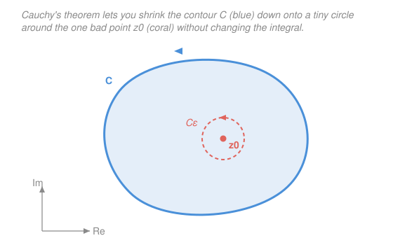

# Mathematical Methods for Physics · Lesson 2.2: Contour integrals, Cauchy's theorem and integral formula

> ⏱ ~15 min · Module 2: Complex methods and contour integration · Builds on: [2.1 Analytic functions and the Cauchy–Riemann equations](02-01-analytic-functions-cauchy-riemann.md), [1.3 The integral theorems](01-03-integral-theorems.md) · Unlocks: [2.3 Singularities, Laurent series, and residues](02-03-singularities-laurent-residues.md)

## Why this matters

In [2.1](02-01-analytic-functions-cauchy-riemann.md) you saw that analytic functions are absurdly rigid — the Cauchy–Riemann equations lock the real and imaginary parts together. This lesson cashes that rigidity out as a superpower for *integration*. The headline is almost unbelievable: if a function is analytic inside a loop, the integral around the loop is **exactly zero**, and you may bend and slide the loop through analytic territory without changing anything — only the *bad points* it encircles matter. That single fact is the engine that will let you evaluate real integrals like $\int_{-\infty}^{\infty}\frac{\cos x}{x^2+a^2}\,dx$ (Boss problem 2) by pure bookkeeping over poles, and it underlies dispersion relations, propagators in quantum field theory, and the Kramers–Kronig relations in optics.

## The idea

A **contour integral** is just a line integral, but in the complex plane: you march a point $z$ along a path $C$ and add up $f(z)\,dz$ as you go. Nothing exotic — it's the [1.2](01-02-line-surface-volume-integrals.md) line integral wearing complex clothing.

The magic starts when $f$ is analytic. Recall from [1.3](01-03-integral-theorems.md) that a *conservative* (curl-free) field has zero circulation around any loop. Analyticity is the complex-plane version of exactly that condition — the Cauchy–Riemann equations are precisely "no curl, no divergence" for the pair of real fields hiding inside $f$. So an analytic function integrated around a closed loop gives **zero circulation**: $\oint_C f\,dz = 0$. That's **Cauchy's theorem**, and it is the whole lesson in one line.

The consequence is a rubber-sheet freedom. If $f$ is analytic everywhere between two loops, the integrals around them are equal — you can **deform** one contour into the other, stretch it, wobble it, as long as you never drag it across a point where $f$ blows up. And when there *is* a bad point inside, you can shrink your big ugly contour down to a tiny circle hugging that point, where $f$ is easy to approximate. Hard integral, easy circle: that trade is the technique.

## The formal version

**Contour integral.** For a path $C$ parametrized by $z(t)$, $t \in [a,b]$ (with $z(t)$ a complex number tracing the curve), define

$$\int_C f(z)\,dz \;=\; \int_a^b f\big(z(t)\big)\,z'(t)\,dt.$$

*In words: substitute the parametrization and let $dz = z'(t)\,dt$ — it collapses to an ordinary integral in the real variable $t$.* A closed contour (start = end) gets the loop symbol $\oint_C$. Unless stated otherwise, closed contours run **counterclockwise** (the positive sense).

**The fundamental non-zero integral.** Take $f(z) = 1/z$ around the unit circle $z(t) = e^{it}$, $t \in [0, 2\pi]$. Then $z'(t) = i e^{it}$, so

$$\oint_C \frac{dz}{z} = \int_0^{2\pi} \frac{1}{e^{it}}\,\big(i e^{it}\big)\,dt = \int_0^{2\pi} i\,dt = 2\pi i.$$

*In words: circling the origin once picks up $2\pi i$ — memorize this number.* It is non-zero precisely because $1/z$ is **not** analytic at $z=0$, the point the loop surrounds. This one integral is the seed of everything in Module 2.

**Cauchy–Goursat theorem.** If $f$ is analytic on and everywhere inside a simple closed contour $C$, then

$$\oint_C f(z)\,dz = 0.$$

*In words: no bad points inside means no circulation — the loop integral vanishes.* Here is the one-line motivation via [Green's theorem](01-03-integral-theorems.md). Write $f = u + iv$ and $dz = dx + i\,dy$, so

$$\oint_C f\,dz = \oint_C (u\,dx - v\,dy) + i\oint_C (v\,dx + u\,dy).$$

Green's theorem turns each loop integral into an area integral of a curl-like derivative. The real part becomes $\iint(-v_x - u_y)\,dA$ and the imaginary part $\iint(u_x - v_y)\,dA$. Both integrands vanish identically by the **Cauchy–Riemann equations** $u_x = v_y$ and $u_y = -v_x$ from [2.1](02-01-analytic-functions-cauchy-riemann.md). So the whole thing is zero. (Goursat's contribution was proving it without assuming $f'$ is continuous; physicists happily skip that.)

**Deformation of contours.** If $f$ is analytic in the region *between* two closed contours $C_1$ and $C_2$ (with $C_2$ inside $C_1$, same orientation), then

$$\oint_{C_1} f\,dz = \oint_{C_2} f\,dz.$$

*In words: you may slide and reshape a contour freely through analytic territory; only the enclosed singularities can change the answer.* In particular, a contour around one isolated bad point can be collapsed onto a tiny circle of radius $\varepsilon$ around it.

**Cauchy integral formula (CIF).** If $f$ is analytic on and inside $C$ and $z_0$ lies inside $C$, then

$$f(z_0) = \frac{1}{2\pi i}\oint_C \frac{f(z)}{z - z_0}\,dz.$$

*In words: an analytic function's value at any interior point is fixed entirely by its values on the boundary.* The boundary data determines the interior — the same astonishing rigidity from [2.1](02-01-analytic-functions-cauchy-riemann.md), now made quantitative. Differentiating under the integral $n$ times gives the **generalized formula**

$$f^{(n)}(z_0) = \frac{n!}{2\pi i}\oint_C \frac{f(z)}{(z - z_0)^{n+1}}\,dz.$$

*In words: the same boundary data pins down every derivative too — so analytic functions are automatically infinitely differentiable.*

**ML inequality (the workhorse bound).** For a contour $C$ of length $L$ on which $|f(z)| \le M$,

$$\left|\int_C f(z)\,dz\right| \le M L.$$

*In words: the integral is no bigger than the biggest the integrand gets, times how far you travel.* This is what lets you argue that a big arc's contribution vanishes when you send its radius to infinity — the key move in the next lesson.

## Picture

The blue loop $C$ and the small dashed circle $C_\varepsilon$ enclose the **same** singular point $z_0$, and $f$ is analytic in the shaded region between them — so by deformation the two integrals are equal. Shrinking to $C_\varepsilon$ is what makes the integral computable.

## Worked examples

**Example 1 (mechanical — collapse to the fundamental integral).** Evaluate $\displaystyle\oint_C \frac{dz}{z - a}$ where $C$ is any counterclockwise contour enclosing the point $a$.

The integrand is analytic everywhere except at $z = a$. By deformation, replace $C$ with a small circle of radius $\varepsilon$ centered at $a$: parametrize $z(t) = a + \varepsilon e^{it}$, $t\in[0,2\pi]$, so $dz = i\varepsilon e^{it}\,dt$ and $z - a = \varepsilon e^{it}$:

$$\oint_C \frac{dz}{z-a} = \int_0^{2\pi} \frac{i\varepsilon e^{it}}{\varepsilon e^{it}}\,dt = \int_0^{2\pi} i\,dt = 2\pi i.$$

The radius $\varepsilon$ cancels completely — the answer is $2\pi i$ no matter how tightly you hug $a$, and no matter how baroque the original $C$ was. If instead $a$ lies **outside** $C$, the integrand is analytic on and inside $C$, so Cauchy's theorem gives $0$. Everything hinges on whether the pole is enclosed.

**Example 2 (why you'd care — the CIF does the work for you).** Evaluate $\displaystyle\oint_C \frac{e^z}{z - 1}\,dz$ where $C$ encloses $z_0 = 1$ counterclockwise.

Match the CIF pattern $\dfrac{f(z)}{z - z_0}$: here $f(z) = e^z$ (entire — analytic everywhere) and $z_0 = 1$. The formula reads off the answer instantly:

$$\oint_C \frac{e^z}{z - 1}\,dz = 2\pi i\, f(z_0) = 2\pi i\, e^{1} = 2\pi i\,e.$$

No parametrizing, no antiderivative — you *recognized* the pole, checked $f$ is analytic there, and evaluated $f$ at the pole. That reflex is the point of the lesson. (Preview of [2.3](02-03-singularities-laurent-residues.md): $f(z_0) = e$ is exactly the **residue** of $\frac{e^z}{z-1}$ at $z=1$, and $\oint = 2\pi i \times \text{residue}$ is the residue theorem in embryo.)

## Watch out

- **You might think $\oint f\,dz = 0$ says something about $f$ being small.** It doesn't — it says $f$ is *analytic inside*. A perfectly large, wild analytic function still integrates to zero around a loop. Conversely $\oint dz/z = 2\pi i \ne 0$ not because $1/z$ is big but because it fails analyticity at the enclosed origin.
- **You might forget orientation and enclosure.** Reverse the direction and every answer flips sign; a contour that *excludes* the pole gives $0$, not $2\pi i$. Always ask two questions: is the singular point inside, and which way am I going?
- **You might misread the generalized formula's power.** The $n!$ and the exponent $n+1$ must match: a *double* pole $\frac{f(z)}{(z-z_0)^2}$ pulls out $f'(z_0)$ with a factor $\frac{1!}{2\pi i}\cdot 2\pi i = 1$, i.e. $\oint = 2\pi i\,f'(z_0)$ — not $f(z_0)$. Off-by-one here is the classic slip.

## One-liner

> Analytic inside a loop ⇒ the loop integral is zero and the loop is free to slide; the only thing that survives is what it wraps around, and $\oint dz/z = 2\pi i$ is the atom of that survival.

## Problems

**P1 (🟢)** Let $C$ be the circle $|z| = 2$ traversed counterclockwise. Evaluate (a) $\displaystyle\oint_C \frac{dz}{z - 3}$ and (b) $\displaystyle\oint_C \frac{dz}{z - 1}$. Explain the difference in one sentence.

**P2 (🟡)** Using the Cauchy integral formula, evaluate $\displaystyle\oint_C \frac{\cos z}{z}\,dz$ where $C$ is the unit circle counterclockwise.

**P3 (🔴, optional)** Using the generalized (derivative) formula, evaluate $\displaystyle\oint_C \frac{e^{z}}{(z - 1)^2}\,dz$ where $C$ encloses $z = 1$ counterclockwise.

Solutions

**P1** (a) The pole is at $z = 3$, which lies *outside* $|z| = 2$ (since $|3| = 3 > 2$). The integrand is analytic on and inside $C$, so by Cauchy's theorem

$$\oint_C \frac{dz}{z-3} = 0.$$

(b) The pole is at $z = 1$, *inside* $|z| = 2$ (since $|1| = 1 < 2$). This is the fundamental integral $\oint dz/(z-a) = 2\pi i$ with $a = 1$:

$$\oint_C \frac{dz}{z-1} = 2\pi i.$$

The difference: (a)'s pole is excluded so the loop sees only analytic territory (zero), while (b)'s pole is enclosed so the loop wraps it once (picks up $2\pi i$).

*Check.* Only the *location relative to the contour* matters, never the size of the circle — a radius-$5$ or radius-$100$ circle would still give $0$ and $2\pi i$ respectively. ✓

**P2** Match the CIF $f(z_0) = \frac{1}{2\pi i}\oint \frac{f(z)}{z - z_0}\,dz$. Here the integrand is $\frac{\cos z}{z - 0}$, so $f(z) = \cos z$ (entire) and $z_0 = 0$, which is inside the unit circle. Therefore

$$\oint_C \frac{\cos z}{z}\,dz = 2\pi i\, f(0) = 2\pi i\,\cos 0 = 2\pi i.$$

*Check.* Near $z = 0$, $\cos z \approx 1$, so the integrand behaves like $1/z$, whose loop integral is exactly $2\pi i$ — the higher-order terms of $\cos z = 1 - z^2/2 + \cdots$ are analytic and contribute nothing. ✓

**P3** This is a double pole, so use the generalized formula with $n = 1$:

$$f^{(1)}(z_0) = \frac{1!}{2\pi i}\oint_C \frac{f(z)}{(z - z_0)^2}\,dz \quad\Longrightarrow\quad \oint_C \frac{f(z)}{(z-z_0)^2}\,dz = 2\pi i\, f'(z_0).$$

With $f(z) = e^z$ (so $f'(z) = e^z$) and $z_0 = 1$:

$$\oint_C \frac{e^z}{(z-1)^2}\,dz = 2\pi i\, e^{1} = 2\pi i\,e.$$

*Check.* Same numerical answer as the *simple*-pole Example 2, which is a coincidence of $e^z$ being its own derivative ($f(1) = f'(1) = e$); for, say, $f(z) = z^2$ the two formulas would differ. The $n = 1$, exponent-$2$ pairing is the thing to get right. ✓

## Flashback

**From Lesson 2.1 (Analytic functions and the Cauchy–Riemann equations):** Show that $f(z) = z^2$ is analytic by verifying the Cauchy–Riemann equations, and identify its harmonic real part. (Fresh variant — a different function than 2.1's worked case.)

Solution

Write $z = x + iy$, so $f(z) = (x + iy)^2 = (x^2 - y^2) + i(2xy)$. Thus $u = x^2 - y^2$ and $v = 2xy$. Compute the partials:

$$u_x = 2x, \quad v_y = 2x, \quad u_y = -2y, \quad v_x = 2y.$$

The Cauchy–Riemann equations $u_x = v_y$ and $u_y = -v_x$ both hold ($2x = 2x$ and $-2y = -2y$) for every $(x,y)$, so $f$ is analytic on the whole plane. The real part $u = x^2 - y^2$ is **harmonic**: $u_{xx} + u_{yy} = 2 + (-2) = 0$. ✓

*Check.* Analyticity everywhere squares with $f = z^2$ being a polynomial, and $f'(z) = 2z$; harmonicity of $u$ is the automatic consequence of Cauchy–Riemann that [2.1](02-01-analytic-functions-cauchy-riemann.md) flagged. ✓

## Connections

- **Backward:** Cauchy's theorem *is* the [1.3](01-03-integral-theorems.md) "conservative field ⇒ zero circulation" statement, translated through Green's theorem, with the Cauchy–Riemann equations of [2.1](02-01-analytic-functions-cauchy-riemann.md) playing the role of the vanishing curl.
- **Forward:** [2.3 Singularities, Laurent series, and residues](02-03-singularities-laurent-residues.md) generalizes $\oint = 2\pi i\,f(z_0)$ into the residue theorem $\oint = 2\pi i \sum \operatorname{Res}$, and [2.4](02-04-real-integrals-by-residues.md) uses the ML inequality to kill big arcs and evaluate real integrals — including Boss problem 2's $\int_{-\infty}^{\infty}\frac{\cos x}{x^2+a^2}\,dx$.
- **Sideways (complex analysis, quantum mechanics):** the CIF's "boundary fixes the interior" is the seed of [complex-analysis](../../complex-analysis/syllabus.md)'s theory and reappears physically as **propagators and Green's functions** ([4.4](04-04-greens-functions.md), and later [quantum-mechanics](../../quantum-mechanics/syllabus.md)), where contour choice around poles encodes causality.
