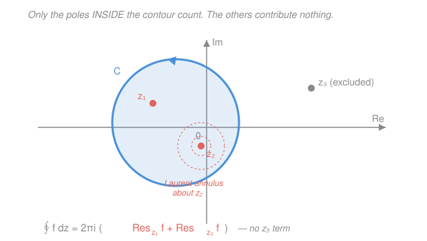

# Mathematical Methods for Physics · Lesson 2.3: Singularities, Laurent series, and residues

> ⏱ ~15 min · Module 2: Complex methods and contour integration · Builds on: [2.2 Contour integrals, Cauchy's theorem](02-02-contour-integrals-cauchy-theorem.md), [2.1 Analytic functions and Cauchy–Riemann](02-01-analytic-functions-cauchy-riemann.md) · Unlocks: [2.4 Evaluating real physics integrals by residues](02-04-real-integrals-by-residues.md)

## Why this matters

In [2.2](02-02-contour-integrals-cauchy-theorem.md) you learned that the integral of an analytic function around a closed loop is zero, and that the Cauchy integral formula extracts the value $f(z_0)$ from a loop around $z_0$. Both are really the *same* fact seen from two angles — and this lesson names it. The punchline: a closed contour integral depends on **one number per enclosed bad point**, the *residue*. Everything downstream in physics — evaluating $\int_{-\infty}^\infty \frac{\cos x}{x^2+a^2}\,dx$, summing series, inverting Laplace and Fourier transforms, finding the poles of a response function that signal resonances — reduces to *finding singularities and reading off residues*. Contour integration stops being calculus and becomes bookkeeping.

## The idea

An analytic function is smooth and boring wherever it's analytic. All the action lives at the **singularities** — the isolated points where it misbehaves. There are exactly three flavors of isolated singularity, in order of increasing wildness:

- **Removable:** the function just *looks* undefined but has a finite limit. Example: $\frac{\sin z}{z}$ at $z=0$ — plug in the limit ($=1$) and the trouble vanishes. Not really a singularity at all.
- **Pole of order $m$:** the function blows up like $\frac{1}{(z-z_0)^m}$. A simple pole ($m=1$) is the workhorse. This is the case that carries a residue.
- **Essential:** genuinely wild — infinitely many negative powers, like $e^{1/z}$ at $z=0$. Near it the function takes *every* value (almost) infinitely often. We classify these but mostly avoid integrating through them.

The tool that sorts them out is the **Laurent series**: a Taylor series that's allowed *negative* powers. Write $f$ near $z_0$ as a sum of powers of $(z-z_0)$, and the **negative-power part** (the "principal part") is a fingerprint of the singularity — no negative powers means removable, finitely many means a pole, infinitely many means essential. And buried in that expansion is one magic coefficient: the one on $\frac{1}{z-z_0}$. That's the **residue**, and it is the *only* thing a closed contour integral cares about, because $\frac{1}{z-z_0}$ is the only power whose loop integral isn't zero.

## The formal version

**Laurent series.** If $f$ is analytic in an *annulus* $0 \le r < |z-z_0| < R$ (a disk with the center possibly punctured out), then throughout that annulus

$$f(z) = \sum_{n=-\infty}^{\infty} a_n\,(z-z_0)^n, \qquad a_n = \frac{1}{2\pi i}\oint_C \frac{f(z)}{(z-z_0)^{n+1}}\,dz,$$

where $C$ is any positively-oriented (counterclockwise) loop in the annulus around $z_0$. *In words: like a Taylor series but with negative powers allowed; the sum over $n<0$ (the **principal part**) captures the blow-up.* The coefficients:

- all $a_n = 0$ for $n<0$ $\Rightarrow$ **removable**;
- lowest nonzero term is $a_{-m}(z-z_0)^{-m}$ with $m\ge 1$ finite $\Rightarrow$ **pole of order $m$**;
- infinitely many nonzero $a_n$ with $n<0$ $\Rightarrow$ **essential**.

**The residue.** The single coefficient

$$\operatorname{Res}_{z_0} f \equiv a_{-1} = \frac{1}{2\pi i}\oint_C f(z)\,dz$$

is the **residue** of $f$ at $z_0$. *In words: the residue is what's "left over" from a small loop around $z_0$ — it's literally the loop integral divided by $2\pi i$.* Why only $a_{-1}$? Because $\oint (z-z_0)^n\,dz = 0$ for every integer $n$ **except** $n=-1$, where it equals $2\pi i$ (you verified this in [2.2](02-02-contour-integrals-cauchy-theorem.md)). Every other term in the Laurent series integrates to zero around the loop.

**Residue theorem.** If $f$ is analytic inside and on a positively-oriented simple closed contour $C$ except for isolated singularities $z_1,\dots,z_N$ *enclosed* by $C$, then

$$\boxed{\;\oint_C f(z)\,dz = 2\pi i\sum_{k=1}^{N}\operatorname{Res}_{z_k} f\;}$$

*In words: a closed loop integral is $2\pi i$ times the sum of the residues at the poles it wraps around — poles outside $C$ contribute nothing.* This is Cauchy's theorem (no poles $\Rightarrow$ integral $0$) and the Cauchy integral formula ($\operatorname{Res}_{z_0}\frac{f(z)}{z-z_0} = f(z_0)$) rolled into one master statement.

**Computing residues** (so you never actually build the Laurent series unless forced):

- **Simple pole** ($m=1$): $\displaystyle \operatorname{Res}_{z_0} f = \lim_{z\to z_0}(z-z_0)\,f(z).$
- **Simple pole of a quotient** $f=\dfrac{p}{q}$ where $q(z_0)=0$ but $q'(z_0)\ne 0$: $\displaystyle \operatorname{Res}_{z_0} f = \frac{p(z_0)}{q'(z_0)}.$ *(This one is the fastest — memorize it.)*
- **Pole of order $m$:** $\displaystyle \operatorname{Res}_{z_0} f = \frac{1}{(m-1)!}\lim_{z\to z_0}\frac{d^{\,m-1}}{dz^{\,m-1}}\Big[(z-z_0)^m f(z)\Big].$

The order-$m$ formula is just "multiply away the pole, then Taylor-expand and pick off the right coefficient" — the derivatives do the picking.

## Picture

## Worked examples

**Example 1 (simple poles — the $p/q'$ shortcut).** Find the residues of $f(z)=\dfrac{1}{z^2+1}$ at its singularities.

Factor the denominator: $z^2+1=(z-i)(z+i)$, so there are simple poles at $z=\pm i$. Use $f=p/q$ with $p=1$, $q=z^2+1$, $q'=2z$:

$$\operatorname{Res}_{i} f = \frac{p(i)}{q'(i)} = \frac{1}{2i} = -\frac{i}{2}, \qquad \operatorname{Res}_{-i} f = \frac{1}{2(-i)} = \frac{i}{2}.$$

The two residues are complex conjugates and sum to zero — that's the seed of the $\int_{-\infty}^\infty \frac{dx}{x^2+1}=\pi$ calculation you'll finish in [2.4](02-04-real-integrals-by-residues.md), where closing in the upper half-plane keeps only the $+i$ pole.

**Example 2 (an order-2 pole — and a residue that's zero).** Classify the singularity of $f(z)=\dfrac{\cos z}{z^2}$ at $z=0$ and find its residue.

The numerator $\cos 0 = 1 \ne 0$, so $f$ blows up like $1/z^2$: a **pole of order 2**. Apply the order-$m$ formula with $m=2$:

$$\operatorname{Res}_{0} f = \frac{1}{(2-1)!}\lim_{z\to 0}\frac{d}{dz}\Big[z^2\cdot\frac{\cos z}{z^2}\Big] = \lim_{z\to 0}\frac{d}{dz}\cos z = \lim_{z\to 0}(-\sin z) = 0.$$

The residue is **zero** even though the singularity is real. Sanity check via the Laurent series: $\cos z = 1 - \frac{z^2}{2}+\cdots$, so $\frac{\cos z}{z^2} = \frac{1}{z^2} - \frac{1}{2} + \cdots$ — there is simply *no* $\frac{1}{z}$ term, hence $a_{-1}=0$. A pole can have a vanishing residue; "has a pole" and "has a nonzero residue" are different claims.

**Example 3 (an essential singularity).** Classify $f(z)=e^{1/z}$ at $z=0$ and read off its residue.

Substitute $w=1/z$ into the exponential series $e^w = \sum_{n\ge 0}\frac{w^n}{n!}$:

$$e^{1/z} = \sum_{n=0}^{\infty}\frac{1}{n!}\,z^{-n} = 1 + \frac{1}{z} + \frac{1}{2!\,z^2} + \frac{1}{3!\,z^3}+\cdots$$

This Laurent series has **infinitely many** negative powers, so $z=0$ is an **essential singularity** — not a pole of any finite order. The residue is the coefficient of $1/z$, the $n=1$ term: $\operatorname{Res}_{0}e^{1/z} = 1$. (So even a wild essential singularity hands you a residue directly from its Laurent series — you just can't get it from the pole formulas, which assume a finite-order pole.)

## Watch out

- **You might think "singularity" means "residue."** A *removable* singularity (like $\frac{\sin z}{z}$ at $0$) has no principal part and residue $0$; an order-2 pole can *also* have residue $0$ (Example 2). The residue is specifically $a_{-1}$, not "the strength of the blow-up." Only $a_{-1}$ survives the loop integral.
- **You might apply the simple-pole formula $\lim(z-z_0)f(z)$ to a higher-order pole.** For $\frac{\cos z}{z^2}$ that limit is $\lim z\cdot\frac{\cos z}{z^2}=\lim\frac{\cos z}{z}$, which diverges — a red flag that the pole isn't simple. If $\lim(z-z_0)f$ blows up, the pole has order $\ge 2$; use the order-$m$ formula (or expand).
- **You might forget that only *enclosed* poles count.** The residue theorem sums residues *inside* $C$ only. A pole sitting outside your contour — or on it (not allowed; deform around it) — contributes nothing. Choosing which poles to enclose *is* the art of [2.4](02-04-real-integrals-by-residues.md).
- **You might mismatch the annulus.** A single function has *different* Laurent series in different annuli (Problem 3). The one that gives the residue at $z_0$ is the expansion in the *innermost* punctured disk touching $z_0$.

## One-liner

> A closed contour integral is $2\pi i$ times the sum of the enclosed residues — and each residue is just $a_{-1}$, the coefficient of $\tfrac{1}{z-z_0}$, the one Laurent term a loop can't kill.

## Problems

**P1 (🟢)** For $f(z)=\dfrac{2z+3}{z^2+z-2}$, classify every singularity and find its residue.

**P2 (🟡)** Using the residue theorem and your P1 results, evaluate $\displaystyle\oint_C \frac{2z+3}{z^2+z-2}\,dz$ for two contours: (a) the circle $|z|=\tfrac{3}{2}$, and (b) the circle $|z|=3$, both counterclockwise. Explain why the answers differ.

**P3 (🔴, optional)** Find the Laurent series of $f(z)=\dfrac{1}{(z-1)(z-2)}$ valid in the annulus $1<|z|<2$ (powers of $z$, expanding about $0$). Read off the residue $a_{-1}$, and confirm it equals $\displaystyle\frac{1}{2\pi i}\oint_{|z|=3/2} f\,dz$ computed by the residue theorem.

Solutions

**P1** Factor: $z^2+z-2 = (z-1)(z+2)$, so there are **simple poles** at $z=1$ and $z=-2$. Use the quotient shortcut with $p=2z+3$, $q=z^2+z-2$, $q'=2z+1$:

$$\operatorname{Res}_{1} f = \frac{p(1)}{q'(1)} = \frac{2(1)+3}{2(1)+1} = \frac{5}{3}, \qquad \operatorname{Res}_{-2} f = \frac{p(-2)}{q'(-2)} = \frac{2(-2)+3}{2(-2)+1} = \frac{-1}{-3} = \frac{1}{3}.$$

*Check.* Partial fractions: $\frac{2z+3}{(z-1)(z+2)} = \frac{5/3}{z-1} + \frac{1/3}{z+2}$; the numerators over the linear factors *are* the residues ✓. As $z\to\infty$, $f\sim \frac{2}{z}$, and the residues sum to $\frac{5}{3}+\frac{1}{3}=2$, matching that leading $2/z$ behavior ✓.

**P2** (a) $|z|=\tfrac32$ encloses only $z=1$ (since $|1|=1<\tfrac32$ but $|-2|=2>\tfrac32$):

$$\oint_{|z|=3/2} f\,dz = 2\pi i\,\operatorname{Res}_{1} f = 2\pi i\cdot\frac{5}{3} = \frac{10\pi i}{3}.$$

(b) $|z|=3$ encloses **both** poles ($1<3$ and $2<3$):

$$\oint_{|z|=3} f\,dz = 2\pi i\left(\frac{5}{3}+\frac{1}{3}\right) = 2\pi i\cdot 2 = 4\pi i.$$

They differ because a contour integral counts only the residues it *wraps around*; the larger loop additionally catches $z=-2$, adding $2\pi i\cdot\frac13 = \frac{2\pi i}{3}$. Indeed $\frac{10\pi i}{3} + \frac{2\pi i}{3} = \frac{12\pi i}{3} = 4\pi i$ ✓.

*Check.* Both answers are pure imaginary multiples of the residues, as the residue theorem's $2\pi i$ demands ✓.

**P3** Split by partial fractions: $\dfrac{1}{(z-1)(z-2)} = \dfrac{1}{z-2} - \dfrac{1}{z-1}$ (since $\frac{A}{z-1}+\frac{B}{z-2}$ gives $A=-1$, $B=1$).

In the annulus $1<|z|<2$ we need each piece expanded in the regime where its geometric series converges:

- $\dfrac{1}{z-1} = \dfrac{1}{z}\cdot\dfrac{1}{1-1/z} = \dfrac{1}{z}\sum_{n=0}^{\infty}\Big(\frac{1}{z}\Big)^{n} = \sum_{n=0}^{\infty}\frac{1}{z^{\,n+1}}$, valid for $|z|>1$ ✓.
- $\dfrac{1}{z-2} = -\dfrac{1}{2}\cdot\dfrac{1}{1-z/2} = -\dfrac{1}{2}\sum_{n=0}^{\infty}\Big(\frac{z}{2}\Big)^{n} = -\sum_{n=0}^{\infty}\frac{z^{n}}{2^{\,n+1}}$, valid for $|z|<2$ ✓.

Therefore, in $1<|z|<2$,

$$f(z) = \frac{1}{z-2} - \frac{1}{z-1} = -\sum_{n=0}^{\infty}\frac{z^{n}}{2^{\,n+1}} \;-\; \sum_{n=0}^{\infty}\frac{1}{z^{\,n+1}}.$$

The coefficient of $\frac{1}{z}$ is the $n=0$ term of the second sum: $a_{-1} = -1$.

Now the residue-theorem cross-check. The contour $|z|=\tfrac32$ lies inside the annulus and encloses only the pole $z=1$, whose residue is $\operatorname{Res}_1 f = \frac{1}{(1-2)} = -1$. So

$$\frac{1}{2\pi i}\oint_{|z|=3/2} f\,dz = \operatorname{Res}_1 f = -1 = a_{-1} \checkmark.$$

*Check.* The negative powers came entirely from the $z=1$ pole (expanded for $|z|>1$) and the non-negative powers from the $z=2$ pole (expanded for $|z|<2$) — exactly as an annulus between the two poles should split things ✓.

## Flashback

**From Lesson 2.2 (Cauchy integral formula):** Evaluate $\displaystyle\oint_{|z|=3}\frac{z^2+1}{z-2}\,dz$ using the Cauchy integral formula. Then re-derive the same answer as a residue, and say why the two methods agree.

Solution

Write the integrand as $\frac{g(z)}{z-2}$ with $g(z)=z^2+1$, which is analytic everywhere (entire). The point $z_0=2$ lies inside $|z|=3$, so the Cauchy integral formula $\oint_C \frac{g(z)}{z-z_0}\,dz = 2\pi i\,g(z_0)$ gives

$$\oint_{|z|=3}\frac{z^2+1}{z-2}\,dz = 2\pi i\,g(2) = 2\pi i\,(2^2+1) = 10\pi i.$$

As a residue: the integrand has a simple pole at $z=2$ with $\operatorname{Res}_2\frac{z^2+1}{z-2} = \lim_{z\to 2}(z-2)\frac{z^2+1}{z-2} = 2^2+1 = 5$, so the residue theorem gives $2\pi i\cdot 5 = 10\pi i$ — the same.

They agree because the Cauchy integral formula *is* the residue theorem for a simple pole created by dividing an analytic $g$ by $(z-z_0)$: the residue there is exactly $g(z_0)$.

*Check.* Answer is a pure imaginary multiple of $2\pi i$, as any single-pole loop integral must be, and $g(2)=5$ is finite since $g$ is analytic at $2$ ✓.

## Connections

- **Backward:** this unifies both results of [2.2](02-02-contour-integrals-cauchy-theorem.md) — Cauchy's theorem is the no-enclosed-pole case ($\oint f=0$), and the Cauchy integral formula is the single-simple-pole case ($\operatorname{Res} = g(z_0)$). The key fact "$\oint(z-z_0)^n dz = 0$ except at $n=-1$" is what makes $a_{-1}$ the only survivor.
- **Forward:** [2.4 Evaluating real physics integrals by residues](02-04-real-integrals-by-residues.md) turns $\int_{-\infty}^\infty$ and $\int_0^{2\pi}$ integrals into residue sums by closing a contour and choosing which poles to enclose — Example 1's $\pm i$ poles are the very case you'll finish there. Residues also drive Laplace-transform inversion in [4.3](04-03-laplace-transform-ivp.md) and pinpoint resonances in [4.4](04-04-greens-functions.md), where a pole of a response function *is* a resonant mode.
- **Sideways (`complex-analysis`):** the rigorous development of Laurent's theorem, convergence of the annular series, and the classification of essential singularities (Casorati–Weierstrass, Picard) lives in [`complex-analysis`](../../complex-analysis/syllabus.md); here we take the machinery pragmatically and compute. The pole structure of scattering amplitudes and Green's functions reappears throughout [`quantum-mechanics`](../../quantum-mechanics/syllabus.md).
