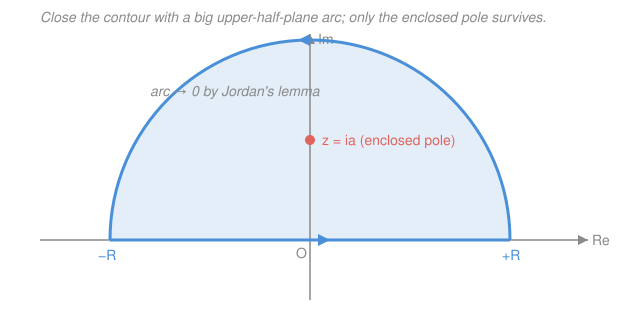

# Mathematical Methods for Physics · Lesson 2.4: Evaluating real physics integrals by residues

> ⏱ ~15 min · Module 2: Complex methods and contour integration · Builds on: [2.3 Singularities, Laurent series, and residues](02-03-singularities-laurent-residues.md) · Unlocks: [3.1 Power-series and Frobenius solutions of ODEs](03-01-power-series-frobenius.md)

## Why this matters

You keep meeting real integrals with no elementary antiderivative: the $\int_{-\infty}^{\infty}$ that appears when you Fourier-transform a Lorentzian line shape, the $\int_0^{2\pi}$ from an orbital average, the propagator integral in field theory. Real-variable tricks flail. But the residue theorem from [2.3](02-03-singularities-laurent-residues.md) says a closed contour integral equals $2\pi i$ times the sum of enclosed residues — pure bookkeeping over poles. The move in this lesson is a con: **the real integral you want is one piece of a closed contour whose other pieces you can make vanish.** Close the loop, throw away the free part, and read the answer off the poles. This is the single most reused computation in the physicist's complex-analysis toolkit.

## The idea

Your real integral runs along the real axis, from $-\infty$ to $+\infty$ or once around a circle. That's an *open* path (or, for the trig case, a circle you haven't yet recognized as one), and the residue theorem only speaks about *closed loops*. So you complete the loop with an extra arc, turning the open path into a closed contour that residues can evaluate.

The whole trick lives or dies on one question: **does the extra arc contribute anything?** If you can argue the arc integral goes to zero as it grows to infinity, then

$$\underbrace{\text{(what you want)}}_{\text{real axis}} = \underbrace{\text{(closed loop)}}_{2\pi i\,\sum\text{Res}} - \underbrace{\text{(arc)}}_{\to\,0}.$$

For the trig case there's no "throwing away" at all — the substitution $z=e^{i\theta}$ turns $\int_0^{2\pi}$ *itself* into a genuine closed loop around the unit circle. Three standard patterns cover almost everything you'll meet; the art is only in picking the closure and checking the arc dies.

## The formal version

**Type 1 — rational integrals $\displaystyle\int_{-\infty}^{\infty}\frac{P(x)}{Q(x)}\,dx$.** Close with a large semicircle of radius $R$ in the **upper half-plane** (UHP): the real segment $[-R,R]$ plus the arc $z=Re^{i\theta}$, $\theta\in[0,\pi]$. On the arc, $|P/Q|\sim R^{\deg P-\deg Q}$ and the arc length is $\pi R$, so the arc integral is bounded by $\sim R^{\,\deg P-\deg Q+1}$. That $\to 0$ provided

$$\boxed{\deg Q \ge \deg P + 2.}$$

Then, letting $R\to\infty$,

$$\int_{-\infty}^{\infty}\frac{P(x)}{Q(x)}\,dx = 2\pi i\!\!\sum_{\text{poles in UHP}}\!\!\operatorname{Res}\frac{P}{Q}.$$

*In words: if the denominator wins by at least two powers, the real integral is just $2\pi i$ times the residues sitting in the upper half-plane.* (You could close downward instead; then it's $-2\pi i\sum$ of the *lower*-half poles — the minus sign is the clockwise orientation.)

**Type 2 — Fourier integrals $\displaystyle\int_{-\infty}^{\infty} f(x)\,e^{iax}\,dx$ with $a>0$.** Here the extra factor $e^{iaz}=e^{ia(x+iy)}=e^{iax}e^{-ay}$ *decays* in the UHP (where $y>0$), and that decay is strong enough to kill the arc even when $f=P/Q$ only satisfies $\deg Q=\deg P+1$. This is **Jordan's lemma**:

$$\text{if } f(z)\to 0 \text{ uniformly as } |z|\to\infty \text{ in the UHP, then } \int_{\text{UHP arc}} f(z)\,e^{iaz}\,dz \to 0 \quad (a>0).$$

*In words: the oscillating exponential $e^{iaz}$ provides its own convergence upstairs, so you only need $f\to 0$, not $f$ decaying fast.* Close upward and

$$\int_{-\infty}^{\infty} f(x)\,e^{iax}\,dx = 2\pi i\!\!\sum_{\text{UHP}}\!\!\operatorname{Res}\big[f(z)\,e^{iaz}\big].$$

For $\cos ax$ and $\sin ax$, integrate $e^{iax}$ and take the **real or imaginary part at the end**: $\cos ax=\operatorname{Re}e^{iax}$, $\sin ax=\operatorname{Im}e^{iax}$. (If $a<0$, close *downward* instead — the exponential decays in the lower half-plane.)

**Type 3 — trig integrals $\displaystyle\int_0^{2\pi} R(\cos\theta,\sin\theta)\,d\theta$.** Substitute $z=e^{i\theta}$, so as $\theta$ runs $0\to2\pi$, $z$ traces the unit circle once counterclockwise. Then

$$\cos\theta=\frac{z+z^{-1}}{2},\qquad \sin\theta=\frac{z-z^{-1}}{2i},\qquad d\theta=\frac{dz}{iz},$$

and the integral becomes a contour integral around $|z|=1$:

$$\int_0^{2\pi} R(\cos\theta,\sin\theta)\,d\theta = \oint_{|z|=1}\!R\!\left(\tfrac{z+z^{-1}}{2},\tfrac{z-z^{-1}}{2i}\right)\frac{dz}{iz} = 2\pi i\!\!\sum_{\text{poles inside }|z|=1}\!\!\operatorname{Res}.$$

*In words: a real trig integral is already a closed loop in disguise — rewrite it around the unit circle and sum the residues trapped inside.*

**Two footnotes you'll need eventually.** (i) *Principal value / poles on the real axis.* If a pole sits **on** the contour (e.g. $\int \frac{\sin x}{x}dx$), the integral diverges literally; you take the **Cauchy principal value** and **indent** the contour with a tiny semicircle around the pole, which contributes $\pm i\pi\,(\text{Res})$ — half a residue, with sign set by whether you detour above or below. (ii) *Branch cuts.* For integrands with $\sqrt{z}$ or $\ln z$ (e.g. $\int_0^\infty x^{s-1}/(1+x)\,dx$) the function is multivalued; you route the contour around a branch cut (a "keyhole") so it stays single-valued. Both are extensions of the same close-the-loop idea — we flag them here and drill them when a physics problem forces the issue.

## Picture

## Worked examples

**Example 1 (Type 1 — a rational integral with several poles).** Evaluate $\displaystyle\int_{-\infty}^{\infty}\frac{dx}{x^4+1}$.

Here $P=1$, $Q=x^4+1$, and $\deg Q=4\ge\deg P+2=2$, so the UHP arc dies — Type 1 applies. The poles solve $z^4=-1$, i.e. $z=e^{i\pi/4},\,e^{i3\pi/4},\,e^{i5\pi/4},\,e^{i7\pi/4}$. Only the first two lie in the upper half-plane. Each is a **simple** pole, so use the quotient shortcut from [2.3](02-03-singularities-laurent-residues.md), $\operatorname{Res}_{z_k}\frac{1}{Q}=\frac{1}{Q'(z_k)}=\frac{1}{4z_k^3}$. Since $z_k^4=-1$, we have $z_k^3=z_k^4/z_k=-1/z_k$, so

$$\operatorname{Res}_{z_k}\frac{1}{z^4+1}=\frac{1}{4z_k^3}=-\frac{z_k}{4}.$$

Summing the two UHP poles, with $z_1=e^{i\pi/4}=\tfrac{\sqrt2}{2}(1+i)$ and $z_2=e^{i3\pi/4}=\tfrac{\sqrt2}{2}(-1+i)$:

$$\sum_{\text{UHP}}\operatorname{Res}=-\frac{z_1+z_2}{4}=-\frac{1}{4}\big(\sqrt2\,i\big)=-\frac{\sqrt2}{4}i.$$

Therefore

$$\int_{-\infty}^{\infty}\frac{dx}{x^4+1}=2\pi i\left(-\frac{\sqrt2}{4}i\right)=\frac{2\pi\sqrt2}{4}=\frac{\pi}{\sqrt2}\approx 2.221.$$

*Check.* Positive (the integrand is positive) ✓, and smaller than $\int\frac{dx}{x^2+1}=\pi$ (since $x^4+1>x^2+1$ for $|x|>1$, which dominates) ✓.

**Example 2 (Type 2 — Boss problem 2, fully worked).** Evaluate $\displaystyle\int_{-\infty}^{\infty}\frac{\cos x}{x^2+a^2}\,dx$ for $a>0$.

The obstacle is $\cos x$: as a real function on the arc it's unbounded off the real axis ($\cos(x+iy)$ grows like $e^{|y|}$), so you must **not** close the contour directly on $\cos z$. Instead write $\cos x=\operatorname{Re}\,e^{ix}$ and evaluate the well-behaved cousin

$$I=\int_{-\infty}^{\infty}\frac{e^{ix}}{x^2+a^2}\,dx,\qquad \int_{-\infty}^{\infty}\frac{\cos x}{x^2+a^2}\,dx=\operatorname{Re}\,I.$$

*Justify the closure.* Take $f(z)=\dfrac{1}{z^2+a^2}$, which $\to 0$ as $|z|\to\infty$, and the phase factor $e^{iz}$ (so $a=1>0$). By **Jordan's lemma** the UHP arc integral vanishes — note $\deg Q=2=\deg P+1$ only, so the plain Type-1 bound would be borderline; it's Jordan's exponential decay that saves us. Close upward.

*Find the enclosed pole and residue.* The poles are $z=\pm ia$; only $z=ia$ is in the UHP. It is simple, and

$$\operatorname{Res}_{z=ia}\frac{e^{iz}}{z^2+a^2}=\frac{e^{iz}}{2z}\bigg|_{z=ia}=\frac{e^{i(ia)}}{2(ia)}=\frac{e^{-a}}{2ia}.$$

*Assemble.*

$$I=2\pi i\cdot\frac{e^{-a}}{2ia}=\frac{\pi}{a}\,e^{-a},$$

which is already real, so

$$\boxed{\int_{-\infty}^{\infty}\frac{\cos x}{x^2+a^2}\,dx=\frac{\pi}{a}\,e^{-a}.}$$

(The imaginary part, $\int\frac{\sin x}{x^2+a^2}dx=\operatorname{Im}I=0$, is automatic: that integrand is odd.)

*Check the limits.* As $a\to\infty$, $\frac{\pi}{a}e^{-a}\to0$ — a very wide, flat denominator crushes the integral ✓. As $a\to0^+$, $\frac{\pi}{a}e^{-a}\to\infty$ — it **diverges**, which is correct: the integrand approaches $\cos x/x^2$, non-integrable at the origin ✓. And it's positive for all finite $a>0$, as a mostly-positive integrand should be ✓.

## Watch out

- **You might reach for $\cos z$ on the arc.** Don't. $\cos z$ and $\sin z$ blow up exponentially off the real axis, so they wreck any closure. Always promote to $e^{iaz}$ (which decays upward for $a>0$) and take $\operatorname{Re}$/$\operatorname{Im}$ *after* integrating.
- **You might close in the wrong half-plane.** The exponential $e^{iaz}$ decays in the UHP only when $a>0$; for $a<0$ you must close **downward**, and then pick up the *lower*-half poles with a $-2\pi i$ (clockwise) sign. Choose the closure where the arc dies, not by habit.
- **You might forget the degree condition for Type 1.** Without an $e^{iaz}$, the arc vanishes only if $\deg Q\ge\deg P+2$. If $\deg Q=\deg P+1$ (like $\int x/(x^2+1)\,dx$), the semicircle does **not** vanish and the integral is only conditionally defined — that's exactly when you need Jordan's lemma or a principal value, not a naive residue sum.

## One-liner

> Complete the real path into a closed loop whose extra arc vanishes — deg $Q\ge\deg P+2$ for rational, Jordan's lemma for $e^{iax}$, the unit circle for trig — and the integral is $2\pi i$ times the enclosed residues.

## Problems

**P1 (🟢)** Evaluate $\displaystyle\int_0^{2\pi}\frac{d\theta}{a+b\cos\theta}$ for $a>b>0$ using the $z=e^{i\theta}$ substitution.

**P2 (🟡)** Evaluate $\displaystyle\int_{-\infty}^{\infty}\frac{dx}{(x^2+1)^2}$. (You'll need a **double**-pole residue — recall the derivative formula from [2.3](02-03-singularities-laurent-residues.md).)

**P3 (🔴, optional)** Evaluate $\displaystyle\int_{-\infty}^{\infty}\frac{x\sin x}{x^2+a^2}\,dx$ for $a>0$. Note this is a Type-2 sibling of Example 2 with $\deg Q=\deg P+1$ — so Jordan's lemma, not the Type-1 bound, is what justifies the closure.

Solutions

**P1** Substitute $z=e^{i\theta}$, $\cos\theta=\tfrac12(z+z^{-1})$, $d\theta=dz/(iz)$:

$$\int_0^{2\pi}\frac{d\theta}{a+b\cos\theta}=\oint_{|z|=1}\frac{1}{a+\frac{b}{2}(z+z^{-1})}\frac{dz}{iz}=\oint_{|z|=1}\frac{2\,dz}{i\,(bz^2+2az+b)}.$$

The denominator's roots are $z_\pm=\dfrac{-a\pm\sqrt{a^2-b^2}}{b}$. Since $a>b>0$, only $z_+$ lies inside the unit circle ($z_+z_-=1$ from the product of roots, so exactly one is inside). At the simple pole $z_+$,

$$\operatorname{Res}_{z_+}\frac{1}{bz^2+2az+b}=\frac{1}{2bz_++2a}=\frac{1}{2\sqrt{a^2-b^2}},$$

using $2bz_+ +2a = 2\sqrt{a^2-b^2}$. Hence

$$\int_0^{2\pi}\frac{d\theta}{a+b\cos\theta}=\frac{2}{i}\cdot 2\pi i\cdot\frac{1}{2\sqrt{a^2-b^2}}=\frac{2\pi}{\sqrt{a^2-b^2}}.$$

*Check.* As $b\to0$ this $\to2\pi/a$, exactly $\int_0^{2\pi}d\theta/a$ ✓. It requires $a>b$ (else the denominator hits zero somewhere and the integral genuinely diverges) ✓.

**P2** $f(z)=\dfrac{1}{(z^2+1)^2}=\dfrac{1}{(z-i)^2(z+i)^2}$. With $\deg Q=4\ge\deg P+2$, close in the UHP (Type 1). The only UHP pole is $z=i$, a **double** pole, so

$$\operatorname{Res}_{z=i}f=\frac{d}{dz}\!\left[(z-i)^2 f\right]_{z=i}=\frac{d}{dz}\!\left[\frac{1}{(z+i)^2}\right]_{z=i}=\left[-\frac{2}{(z+i)^3}\right]_{z=i}=-\frac{2}{(2i)^3}=\frac{1}{4i}.$$

(Using $(2i)^3=8i^3=-8i$, so $-2/(-8i)=1/(4i)$.) Then

$$\int_{-\infty}^{\infty}\frac{dx}{(x^2+1)^2}=2\pi i\cdot\frac{1}{4i}=\frac{\pi}{2}.$$

*Check.* Positive ✓, and less than $\int\frac{dx}{x^2+1}=\pi$ since squaring the denominator shrinks the integrand ✓.

**P3** Write $x\sin x=\operatorname{Im}\big(x\,e^{ix}\big)$ and evaluate $J=\displaystyle\int_{-\infty}^{\infty}\frac{x\,e^{ix}}{x^2+a^2}\,dx$. Here $f(z)=\dfrac{z}{z^2+a^2}\to0$ as $|z|\to\infty$, so **Jordan's lemma** (with $a_{\text{phase}}=1>0$) kills the UHP arc even though $\deg Q=\deg P+1$. The UHP pole is $z=ia$:

$$\operatorname{Res}_{z=ia}\frac{z\,e^{iz}}{z^2+a^2}=\frac{z\,e^{iz}}{2z}\bigg|_{z=ia}=\frac{e^{iz}}{2}\bigg|_{z=ia}=\frac{e^{-a}}{2}.$$

So $J=2\pi i\cdot\frac{e^{-a}}{2}=\pi i\,e^{-a}$, and

$$\int_{-\infty}^{\infty}\frac{x\sin x}{x^2+a^2}\,dx=\operatorname{Im}J=\pi\,e^{-a}.$$

*Check.* The integrand $x\sin x/(x^2+a^2)$ is even and positive on average, so a positive answer is right ✓; as $a\to\infty$ it $\to0$ ✓. (Its partner $\int\frac{x\cos x}{x^2+a^2}dx=\operatorname{Re}J=0$, correct since that integrand is odd.)

## Flashback

**From Lesson 2.3 (Singularities, Laurent series, and residues):** Find the residue of $f(z)=\dfrac{z^2}{z^4-1}$ at its pole $z=i$.

Solution

The poles are the fourth roots of unity $z=\pm1,\pm i$, each a **simple** root of $z^4-1$, so use the quotient rule $\operatorname{Res}_{z_0}\frac{g}{h}=\frac{g(z_0)}{h'(z_0)}$ with $g=z^2$, $h=z^4-1$, $h'=4z^3$:

$$\operatorname{Res}_{z=i}\frac{z^2}{z^4-1}=\frac{z^2}{4z^3}\bigg|_{z=i}=\frac{1}{4z}\bigg|_{z=i}=\frac{1}{4i}=-\frac{i}{4}.$$

*Check.* $z=i$ is a simple root of $z^4-1$ (since $h'(i)=4i^3=-4i\neq0$), so the simple-pole formula is valid ✓. By symmetry the residue at $z=-i$ is $1/(4\cdot(-i))=+i/4$, the complex conjugate, as expected for a real-coefficient $f$ ✓.

## Connections

- **Backward:** this is [2.3](02-03-singularities-laurent-residues.md)'s residue theorem put to work — every example reduces to classifying a pole and reading off its residue, exactly the two skills from that lesson. The closure arguments rest on Cauchy's theorem / deforming contours from [2.2](02-02-contour-integrals-cauchy-theorem.md).
- **Forward:** the Type-2 machinery is the engine of the **Fourier transform** in Module 4 (see the [syllabus](../syllabus.md)) — the result $\int\frac{\cos x}{x^2+a^2}dx=\frac{\pi}{a}e^{-a}$ *is* the Fourier transform of a Lorentzian, and the same closure builds **Green's functions** by contour later in that module, where poles of the response become decaying/oscillating modes. Module 2 closes here; [3.1](03-01-power-series-frobenius.md) turns to series solutions of ODEs.
- **Sideways (complex-analysis):** the residue calculus you're using pragmatically is developed with full rigor — Jordan's lemma bounds, principal values, branch-cut (keyhole) contours — in [complex-analysis](../../complex-analysis/syllabus.md). The Lorentzian result also reappears physically as the **Yukawa/screened potential** and the resonance line shape in [quantum-mechanics](../../quantum-mechanics/syllabus.md).
