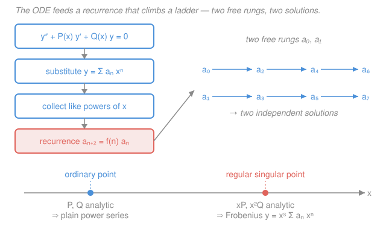

# Mathematical Methods for Physics · Lesson 3.1: Power-series and Frobenius solutions of ODEs

> ⏱ ~15 min · Module 3: Series solutions, special functions & Sturm–Liouville · Builds on: [2.4 Evaluating real physics integrals by residues](02-04-real-integrals-by-residues.md), [`ode-refresher` syllabus](../../ode-refresher/syllabus.md) · Unlocks: [3.2 Legendre polynomials and spherical harmonics](03-02-legendre-spherical-harmonics.md)

## Why this matters

Separate variables in Laplace's equation on a sphere and you get the Legendre equation; do it on a cylinder and you get Bessel's; do it for the quantum harmonic oscillator and you get Hermite's. None of these can be solved by the elementary tricks of [`ode-refresher`](../../ode-refresher/syllabus.md) — no exponential guess works. But every one of them *can* be solved by a single reflex: assume the answer is a power series, plug it in, and let the equation tell you the coefficients one at a time. That reflex — the power-series and **Frobenius** methods — is the machine that manufactures the special functions of physics. And, remarkably, the demand that the series *stay finite* is exactly where integer quantum numbers come from. The next three lessons are just this method, run three times.

## The idea

You already know that $e^x$, $\sin x$, and $\cos x$ *are* power series. So when an ODE refuses the usual guesses, try the most general series you can, $y = \sum_n a_n x^n$, with the coefficients $a_n$ unknown, and make the equation earn them. Substitute, and the ODE turns into a statement that some big power series equals zero. A power series is zero only if *every* coefficient is zero — so you get one equation per power of $x$. Those equations link $a_{n+2}$ back to earlier coefficients: a **recurrence**. Pick the first one or two coefficients freely (those are your two integration constants), and the recurrence grinds out all the rest. You've climbed a ladder: $a_0 \to a_2 \to a_4 \to \cdots$ and $a_1 \to a_3 \to \cdots$.

That works perfectly when $x=0$ is a well-behaved ("ordinary") point. But physics equations often blow up somewhere — $1/x$ or $1/x^2$ terms appear, usually at the origin or a boundary. At such a **singular point** a plain power series isn't flexible enough. **Frobenius**'s fix is one extra knob: multiply the whole series by $x^s$ for some exponent $s$ you solve for. The lowest power of $x$ then hands you a little quadratic — the **indicial equation** — whose two roots are the allowed $s$. That single quadratic decides everything about the solution's behavior right at the trouble spot.

## The formal version

Write the linear second-order ODE in standard form

$$y'' + P(x)\,y' + Q(x)\,y = 0,$$

with $y' = \mathrm{d}y/\mathrm{d}x$. A point $x_0$ is an **ordinary point** if both $P$ and $Q$ are analytic there (have convergent Taylor series). Otherwise it's a **singular point**.

**Power-series theorem (ordinary point).** If $x_0$ is ordinary, the ODE has two linearly independent solutions of the form $y = \sum_{n=0}^{\infty} a_n (x-x_0)^n$, convergent at least out to the nearest singularity. *In words: at a nice point, both solutions are ordinary Taylor series, and you get them by matching coefficients.* Take $x_0=0$ for cleanliness. The engine:

1. Write $y=\sum a_n x^n$, differentiate term by term, and **reindex** every sum so they all carry the same power $x^n$.
2. Collect the coefficient of each $x^n$ and set it to zero → the **recurrence relation** for $a_{n+2}$ in terms of lower $a_k$.
3. Leave $a_0,a_1$ free (the two constants); everything else follows.

**Singular points, sorted.** A singular point $x_0=0$ is a **regular** singular point if the "cleaned-up" coefficients

$$p(x) \equiv x\,P(x), \qquad q(x) \equiv x^2\,Q(x)$$

are *both* analytic at $0$ — i.e. $P$ blows up no worse than $1/x$ and $Q$ no worse than $1/x^2$. If they blow up faster, it's **irregular** (harder; not our business here). *In words: regular means the singularity is mild enough that multiplying by one power of $x$ tames the whole thing.*

**Frobenius method (regular singular point).** Seek

$$\boxed{\,y = x^{s}\sum_{n=0}^{\infty} a_n x^{n} = \sum_{n=0}^\infty a_n x^{n+s}, \qquad a_0 \neq 0.\,}$$

Substituting and collecting the *lowest* power $x^{s}$ gives $a_0\big[s(s-1) + p_0 s + q_0\big]=0$, where $p_0=p(0)$ and $q_0=q(0)$. Since $a_0\neq0$, the bracket must vanish — the **indicial equation**

$$s(s-1) + p_0\,s + q_0 = 0.$$

*In words: the exponent $s$ isn't free — the leading balance forces it to solve a quadratic.* Its roots $s_1 \ge s_2$ control the structure:

- **$s_1 - s_2$ not an integer:** two independent Frobenius series, one per root. Clean.
- **$s_1 = s_2$ (equal roots):** only one Frobenius series; the second solution needs a $\ln x$ term.
- **$s_1 - s_2$ a positive integer:** the larger root always gives a series; the smaller *may* need a $\ln x$ term (sometimes not — you check).

You won't memorize the log cases; you'll recognize them. What matters is the reflex: **indicial equation first, recurrence second.**

## Picture

## Worked examples

**Example 1 (ordinary point — recover $\cos$ and $\sin$).** Solve $y'' + y = 0$ by series. Put $y=\sum_{n\ge0} a_n x^n$, so $y'' = \sum_{n\ge 2} n(n-1)a_n x^{n-2}$. Reindex with $m=n-2$:

$$y'' = \sum_{m\ge 0}(m+2)(m+1)a_{m+2}\,x^{m}.$$

Then $y''+y = \sum_{m\ge0}\big[(m+2)(m+1)a_{m+2} + a_m\big]x^m = 0$, so each bracket vanishes:

$$a_{m+2} = -\frac{a_m}{(m+2)(m+1)}.$$

Start the even ladder from $a_0$: $a_2 = -\tfrac{a_0}{2!},\ a_4 = -\tfrac{a_2}{4\cdot3} = +\tfrac{a_0}{4!},\ a_6=-\tfrac{a_0}{6!},\dots$ so $a_{2k}=(-1)^k a_0/(2k)!$. That sum *is* $a_0\cos x$. The odd ladder from $a_1$ gives $a_{2k+1}=(-1)^k a_1/(2k+1)!$, i.e. $a_1\sin x$. So

$$y = a_0\cos x + a_1\sin x,$$

the general solution, with $a_0,a_1$ the two constants. The method reconstructed the trig functions from nothing but the recurrence.

**Example 2 (where quantum numbers are born — termination).** The Hermite-type equation $y'' - 2x\,y' + 2\lambda y = 0$ appears (rescaled) in the quantum harmonic oscillator, with $\lambda$ set by the energy. Point $x=0$ is ordinary. With $y=\sum a_n x^n$: $y''=\sum(n+2)(n+1)a_{n+2}x^n$, $-2xy' = -2\sum n a_n x^n$, and $2\lambda y = 2\lambda\sum a_n x^n$. Collecting $x^n$:

$$(n+2)(n+1)a_{n+2} - 2n\,a_n + 2\lambda a_n = 0 \;\Longrightarrow\; a_{n+2} = \frac{2(n-\lambda)}{(n+2)(n+1)}\,a_n.$$

Here's the payoff. For generic $\lambda$ the series runs forever and (it turns out) blows up like $e^{x^2}$, which is unphysical — a wavefunction must stay normalizable. The only escape: make the series **terminate** into a polynomial. Looking at the recurrence, $a_{n+2}=0$ exactly when $\lambda = n$ for some nonnegative integer $n$. So $\lambda$ is *forced* to be a nonnegative integer, and the solution becomes the degree-$n$ **Hermite polynomial** $H_n(x)$. *That integer is the quantum number* — energy quantization is nothing more than "the power series must stop." You'll meet this again, in earnest, in [3.4](03-04-hermite-generating-functions.md).

**Example 3 (Frobenius — read off the indicial equation).** Consider $2x^2 y'' - x\,y' + (1+x)\,y = 0$. Divide by $2x^2$ to standardize: $P = -\tfrac{1}{2x}$, $Q = \tfrac{1+x}{2x^2}$. Then $p(x)=xP=-\tfrac12$ and $q(x)=x^2Q=\tfrac{1+x}{2}$ are both analytic at $0$ — a **regular singular point**, with $p_0=-\tfrac12,\ q_0=\tfrac12$. The indicial equation:

$$s(s-1) -\tfrac12 s + \tfrac12 = 0 \;\Longrightarrow\; 2s^2 - 3s + 1 = 0 \;\Longrightarrow\; (2s-1)(s-1)=0,$$

so $s_1 = 1,\ s_2 = \tfrac12$. The roots differ by $\tfrac12$ — *not* an integer — so we get **two clean Frobenius series**, $y_1 = x\sum a_n x^n$ and $y_2 = x^{1/2}\sum b_n x^n$, no logarithms needed. The indicial roots told us the whole qualitative story before we computed a single $a_n$.

## Watch out

- **You might forget to reindex before collecting.** $y''$ naturally carries $x^{n-2}$; if you set "coefficient of $x^n$ to zero" without shifting the index, you'll pair the wrong coefficients. Always slide every sum to a common power first.
- **You might call any singularity "regular."** Regular is a *test*: check that **both** $xP(x)$ and $x^2Q(x)$ are analytic. If $P\sim 1/x^2$ or $Q\sim 1/x^3$, it's irregular and Frobenius may fail. (Bessel and Legendre are regular; that's why the method works on them.)
- **You might think $s$ is a free constant like $a_0$.** It isn't — the indicial equation *pins* $s$ to one of two values. The free constant is $a_0$; the exponent is determined.
- **You might expect two Frobenius series always.** When the roots are equal or differ by an integer, the second solution can hide a $\ln x$ term. Check the root spacing before assuming two tidy series.

## One-liner

> Assume a series, match powers to get a recurrence, and read the exponent off the indicial equation — the special functions of physics are just this machine run at a regular singular point, and quantization is the series being forced to stop.

## Problems

**P1 (🟢)** Solve $y'' - y = 0$ by the power-series method: find the recurrence for $a_{n+2}$, build the even and odd ladders, and identify the two independent solutions by name.

**P2 (🟡)** For the Airy equation $y'' - x\,y = 0$ (an ordinary point at $x=0$), derive the recurrence relating $a_{n+2}$ to earlier coefficients. What does the coefficient of $x^0$ force $a_2$ to be, and what "step size" does the recurrence have?

**P3 (🔴, optional)** Classify $x=0$ for $x^2 y'' + \tfrac{3}{2}x\,y' + (x^2 - \tfrac12)\,y = 0$ (ordinary / regular singular / irregular), and if regular, find the indicial equation and its roots. Do the two roots give two log-free Frobenius series?

Solutions

**P1** With $y=\sum a_n x^n$, reindexing $y''=\sum_{m\ge0}(m+2)(m+1)a_{m+2}x^m$, the equation $y''-y=0$ gives $(m+2)(m+1)a_{m+2}-a_m=0$, so

$$a_{m+2} = \frac{a_m}{(m+2)(m+1)}.$$

Even ladder from $a_0$: $a_2=\tfrac{a_0}{2!},\ a_4=\tfrac{a_0}{4!},\dots$ → $a_0\sum x^{2k}/(2k)! = a_0\cosh x$. Odd ladder from $a_1$: $a_1\sum x^{2k+1}/(2k+1)! = a_1\sinh x$. So $y = a_0\cosh x + a_1\sinh x$ — the two solutions are $\cosh x$ and $\sinh x$ (equivalently $e^{x}$ and $e^{-x}$).

*Check.* Only the sign differs from Example 1's $-a_m/[(m+2)(m+1)]$; the missing minus removes the sign-alternation, turning $\cos/\sin$ into $\cosh/\sinh$. And the characteristic roots of $y''-y=0$ are $r=\pm1$ (real), matching $e^{\pm x}$. ✓

**P2** $y''=\sum_{n\ge0}(n+2)(n+1)a_{n+2}x^n$ and $x y = \sum_{n\ge0}a_n x^{n+1} = \sum_{n\ge1}a_{n-1}x^n$. Subtracting, the coefficient of $x^n$ for $n\ge1$ gives

$$(n+2)(n+1)a_{n+2} - a_{n-1} = 0 \;\Longrightarrow\; a_{n+2} = \frac{a_{n-1}}{(n+2)(n+1)}.$$

The coefficient of $x^0$ is just $2\cdot1\cdot a_2 = 0$, so $a_2 = 0$. Because the recurrence links $a_{n+2}$ to $a_{n-1}$, its **step size is 3**: it couples indices three apart, generating three families — $\{a_0,a_3,a_6,\dots\}$, $\{a_1,a_4,a_7,\dots\}$, and $\{a_2,a_5,\dots\}$. Since $a_2=0$, that whole third family vanishes, leaving two independent solutions built on the free constants $a_0,a_1$.

*Check.* Two free constants ($a_0,a_1$) for a second-order ODE — exactly right. The step-3 pattern is the signature of the $xy$ term (multiplying by $x$ shifts the power by one, so $a_{n-1}$ appears). ✓

**P3** Standard form: $P = \dfrac{3/2\,x}{x^2}=\dfrac{3}{2x}$, $Q=\dfrac{x^2-1/2}{x^2}=1-\dfrac{1}{2x^2}$. Both singular at $0$, so *not* ordinary. Test regularity: $p(x)=xP=\tfrac32$ and $q(x)=x^2Q = x^2-\tfrac12$ are both analytic (polynomials), so $x=0$ is a **regular singular point**, with $p_0=\tfrac32$, $q_0=-\tfrac12$. Indicial equation:

$$s(s-1) + \tfrac32 s - \tfrac12 = 0 \;\Longrightarrow\; s^2 + \tfrac12 s - \tfrac12 = 0 \;\Longrightarrow\; 2s^2 + s - 1 = 0 \;\Longrightarrow\; (2s-1)(s+1)=0,$$

so $s_1=\tfrac12,\ s_2=-1$. The difference $s_1-s_2 = \tfrac32$ is **not** an integer, so yes — two independent, log-free Frobenius series, $y_1=x^{1/2}\sum a_n x^n$ and $y_2=x^{-1}\sum b_n x^n$.

*Check.* Read $q_0$ off the $x^2Q$ constant term ($-\tfrac12$), not off $Q$ itself — a common slip. And $\tfrac32$ non-integer ⇒ the easy case, consistent with the clean factorization. ✓

## Flashback

**From Lesson 2.4 (Evaluating real physics integrals by residues):** Evaluate $\displaystyle\int_{-\infty}^{\infty}\frac{\mathrm{d}x}{x^2+9}$ by closing the contour in the upper half-plane and summing residues. (Fresh variant — different denominator, no cosine factor.)

Solution

The integrand $f(z)=1/(z^2+9)=1/[(z-3i)(z+3i)]$ has simple poles at $z=\pm3i$; closing in the upper half-plane (the integrand decays like $1/|z|^2$, so the big semicircle contributes nothing) encloses only $z=3i$. Its residue:

$$\operatorname{Res}_{z=3i}\frac{1}{z^2+9} = \frac{1}{2z}\Big|_{z=3i} = \frac{1}{6i}.$$

By the residue theorem, $\displaystyle\int_{-\infty}^{\infty}\frac{\mathrm{d}x}{x^2+9} = 2\pi i\cdot\frac{1}{6i} = \frac{\pi}{3}.$

*Check.* The general result is $\int_{-\infty}^\infty \mathrm{d}x/(x^2+a^2)=\pi/a$; here $a=3$ gives $\pi/3$. It's also a real, positive number (the integrand is positive), and the elementary antiderivative $\tfrac13\arctan(x/3)$ evaluated over $\pm\infty$ gives $\tfrac13\cdot\pi = \pi/3$. ✓

## Connections

- **Backward:** the recurrence bookkeeping is the same "match coefficients of like powers" move you use for Taylor and Laurent series in [Module 2](../../mathematical-methods-physics/syllabus.md); a Frobenius series with a $\ln x$ term is a cousin of the Laurent expansions you built for residues in [2.4](02-04-real-integrals-by-residues.md). The failed-guess motivation comes straight from [`ode-refresher`](../../ode-refresher/syllabus.md), where exponentials solved everything — until now.
- **Forward:** [3.2 Legendre](03-02-legendre-spherical-harmonics.md), [3.3 Bessel](03-03-bessel-functions.md), and [3.4 Hermite](03-04-hermite-generating-functions.md) are this exact method applied to the three ODEs that separation of variables produces; [3.5 Sturm–Liouville](03-05-sturm-liouville-orthogonal-expansions.md) then explains why all their solutions come out orthogonal.
- **Sideways (quantum mechanics):** Example 2's "terminate the series or it blows up" is *the* origin of quantization. In [`quantum-mechanics`](../../quantum-mechanics/syllabus.md) the harmonic-oscillator and hydrogen energy levels are integer/half-integer precisely because their power series must truncate to stay normalizable — the same argument you just ran, wearing a physics uniform.
