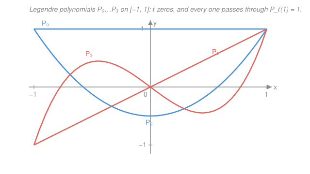

# Mathematical Methods for Physics · Lesson 3.2: Legendre polynomials and spherical harmonics

> ⏱ ~15 min · Module 3: Series solutions, special functions & Sturm–Liouville · Builds on: [3.1 Power-series and Frobenius solutions of ODEs](03-01-power-series-frobenius.md), [1.4 Curvilinear coordinates](01-04-curvilinear-coordinates.md) · Unlocks: [3.3 Bessel functions](03-03-bessel-functions.md)

## Why this matters

Every time you solve Laplace's or the wave or the Schrödinger equation in a region with a bit of spherical symmetry — the field around a charged sphere, the potential of a planet, the hydrogen atom, the pattern a satellite dish radiates — the *same* functions fall out of the angular part. They are the **Legendre polynomials** and their cousins, the **spherical harmonics**. Learn to recognize them on sight and a huge class of boundary problems becomes fill-in-the-coefficients. This lesson is where the abstract machinery of [3.1](03-01-power-series-frobenius.md) (series solutions that *terminate*) meets the geometry of [1.4](01-04-curvilinear-coordinates.md) (the spherical Laplacian) to produce named functions you will reuse for the rest of physics.

## The idea

Try to solve $\nabla^2 f = 0$ on a sphere by separating variables — write $f$ as (radial part) × (angular part). The angular part splits again into a $\theta$ (polar, north-to-south) piece and a $\varphi$ (azimuthal, around) piece. Focus on the $\theta$ piece. It obeys a second-order ODE, and if you try a power series you hit a wall: the series *blows up* at the poles $\theta = 0, \pi$ unless it **stops** — unless it's secretly a polynomial. And here's the punchline from [3.1](03-01-power-series-frobenius.md): the series terminates only for special values of a separation constant. Those special values are $\ell(\ell+1)$ with $\ell = 0, 1, 2, \dots$, and the surviving polynomials are the $P_\ell$.

So integers appear *not because we imposed them* but because they are the only way to keep the solution finite on the whole sphere. That is exactly the mechanism behind quantized angular momentum in quantum mechanics — the same termination argument, the same integers. The special functions of physics are, at heart, "the series that were forced to stop."

## The formal version

**Where it comes from.** Separating $\nabla^2 f = 0$ in spherical coordinates (using the $\nabla^2$ you built in [1.4](01-04-curvilinear-coordinates.md)) and substituting $x = \cos\theta$ turns the polar equation into the **Legendre equation**:

$$(1-x^2)\,y'' - 2x\,y' + \ell(\ell+1)\,y = 0, \qquad x \in [-1,1].$$

*In words: this is the ODE the Laplacian hands you for the angle-from-the-axis part of any spherically-flavored problem.* The variable is $x=\cos\theta$, so $x=1$ is the north pole, $x=-1$ the south pole; $y(x)$ is the angular shape.

**Why polynomials.** Point $x=0$ is an ordinary point, so a power series $y=\sum a_n x^n$ works there. Plugging in gives the two-term recurrence

$$a_{n+2} = \frac{n(n+1) - \ell(\ell+1)}{(n+1)(n+2)}\,a_n .$$

*In words: each coefficient two steps ahead is fixed by the current one.* If the numerator never hits zero, the series runs forever and diverges at $x=\pm1$ (the poles). It shuts off — becomes a polynomial of degree $\ell$ — precisely when the **separation constant equals $\ell(\ell+1)$** for a non-negative integer $\ell$, killing $a_{\ell+2}$ and everything after. That quantization is the [3.1](03-01-power-series-frobenius.md) termination story wearing spherical clothing. The resulting **Legendre polynomials** (fixed by the convention $P_\ell(1)=1$) are

$$P_0 = 1,\quad P_1 = x,\quad P_2 = \tfrac12(3x^2-1),\quad P_3 = \tfrac12(5x^3-3x),\ \dots$$

**Rodrigues' formula** — a closed form that spares you the recurrence:

$$P_\ell(x) = \frac{1}{2^\ell\,\ell!}\,\frac{d^\ell}{dx^\ell}\,(x^2-1)^\ell .$$

*In words: differentiate $(x^2-1)^\ell$ exactly $\ell$ times and normalize.* $P_\ell$ has $\ell$ real zeros in $(-1,1)$ and parity $P_\ell(-x)=(-1)^\ell P_\ell(x)$.

**Generating function** — the whole family packed into one expression:

$$\frac{1}{\sqrt{1 - 2xt + t^2}} = \sum_{\ell=0}^{\infty} P_\ell(x)\,t^\ell, \qquad |t|<1.$$

*In words: expand that square root in powers of $t$ and the coefficients are the $P_\ell$.* This is not a coincidence you'll use once — it **is** the multipole expansion of $1/|\mathbf r - \mathbf r'|$. Put a source at $\mathbf r'$ and observe at $\mathbf r$ with $r>r'$; writing $t=r'/r$ and $x=\cos\gamma$ (the angle between them),

$$\frac{1}{|\mathbf r - \mathbf r'|} = \frac{1}{r}\sum_{\ell=0}^\infty \left(\frac{r'}{r}\right)^\ell P_\ell(\cos\gamma) = \underbrace{\frac1r}_{\text{monopole}} + \underbrace{\frac{r'\cos\gamma}{r^2}}_{\text{dipole}} + \cdots$$

**Orthogonality** — the property that makes them *useful*:

$$\int_{-1}^{1} P_\ell(x)\,P_m(x)\,dx = \frac{2}{2\ell+1}\,\delta_{\ell m}.$$

*In words: two different $P_\ell$ are perpendicular as functions on $[-1,1]$; each has "length-squared" $2/(2\ell+1)$.* (This is a preview of [3.5](03-05-sturm-liouville-orthogonal-expansions.md): the Legendre equation is a Sturm–Liouville problem with weight $1$.) Consequently **any** reasonable $f$ on $[-1,1]$ expands in a Legendre series,

$$f(x) = \sum_{\ell=0}^{\infty} c_\ell\,P_\ell(x), \qquad c_\ell = \frac{2\ell+1}{2}\int_{-1}^{1} f(x)\,P_\ell(x)\,dx,$$

got by multiplying by $P_\ell$, integrating, and letting orthogonality collapse the sum. This is precisely the move Boss Problem 3 uses to match boundary data on a sphere.

**The full angular solution.** Keep the $\varphi$ dependence and the polar equation generalizes to the **associated Legendre** equation, whose solutions $P_\ell^m(x)$ (with $|m|\le\ell$) combine with $e^{im\varphi}$ into the **spherical harmonics**

$$Y_\ell^m(\theta,\varphi) = N_{\ell m}\,P_\ell^m(\cos\theta)\,e^{im\varphi},$$

the complete set of angular shapes on a sphere ($N_{\ell m}$ a normalization). *In words: $Y_\ell^m$ is the "Fourier basis" for functions on a sphere.* These are the orbital-angular-momentum eigenstates of quantum mechanics ($\ell$ the total, $m$ the projection) and the radiation patterns of multipole antennas — you'll meet them again there.

## Picture

Read off the structure: $P_\ell$ wiggles across zero exactly $\ell$ times, alternates even/odd symmetry, and every curve is pinned to $1$ at $x=1$ (the north-pole convention).

## Worked examples

**Example 1 (mechanical — Rodrigues gives $P_2$).** Take $\ell=2$ in Rodrigues' formula. First $(x^2-1)^2 = x^4 - 2x^2 + 1$. Differentiate twice: the first derivative is $4x^3 - 4x$, the second is $12x^2 - 4$. Normalize by $1/(2^2\,2!) = 1/8$:

$$P_2(x) = \frac{1}{8}(12x^2 - 4) = \frac{3x^2-1}{2}.\ \checkmark$$

This matches the list — and it shows Rodrigues is often faster than grinding the recurrence.

**Example 2 (why you'd care — expand a step in $P_\ell$).** Boundary data on a sphere is often "the top hemisphere is held at $+1$, the bottom at $-1$" — i.e. $f(x)=\operatorname{sign}(x)$ on $x=\cos\theta\in[-1,1]$. What is its Legendre series? Use $c_\ell = \frac{2\ell+1}{2}\int_{-1}^1 f P_\ell\,dx$. Because $f$ is **odd** and $P_\ell$ has parity $(-1)^\ell$, all even-$\ell$ coefficients vanish. For $\ell=1$:

$$c_1 = \frac{3}{2}\int_{-1}^{1}\operatorname{sign}(x)\,x\,dx = \frac{3}{2}\int_{-1}^{1}|x|\,dx = \frac{3}{2}\cdot 1 = \frac{3}{2}.$$

So the leading term is $f(x) \approx \tfrac32 P_1(x) = \tfrac32 x$: the dominant response to a top/bottom split is a **dipole**. That single coefficient, computed by orthogonality, is the entire technique behind separation-of-variables potential problems — you'll do exactly this, term by term, in Boss Problem 3.

## Watch out

- **You might think any integer separation constant works — it's the constant $\ell(\ell+1)$, not $\ell$, that appears.** The eigenvalue in the Legendre equation is $\ell(\ell+1)$ ($0, 2, 6, 12,\dots$); $\ell$ itself is just the label and the polynomial degree. Mixing them up wrecks the recurrence.
- **You might expand $f$ in $P_\ell$ and forget the normalization.** The $P_\ell$ are orthogonal but **not** orthonormal: $\int P_\ell^2 = 2/(2\ell+1)$, not $1$. That $2/(2\ell+1)$ is exactly why the coefficient carries a $(2\ell+1)/2$, not $1/2$. Drop it and every coefficient is off by a factor.
- **You might assume $P_\ell^m$ is $P_\ell$ raised to a power.** The superscript $m$ is an index, not an exponent — the *associated* Legendre function, a different object (it involves $m$ derivatives of $P_\ell$ times $(1-x^2)^{m/2}$). $P_\ell = P_\ell^0$.

## One-liner

> The Laplacian on a sphere forces its angular series to terminate, and the polynomials that survive — the orthogonal $P_\ell(x)$, generated by $1/\sqrt{1-2xt+t^2}$ — are the basis you expand any boundary data in.

## Problems

**P1 (🟢)** Verify by direct substitution that $P_2(x) = \tfrac12(3x^2-1)$ solves the Legendre equation with $\ell=2$, i.e. $(1-x^2)y'' - 2xy' + 6y = 0$.

**P2 (🟡)** Expand $f(x) = x^2$ on $[-1,1]$ as a finite Legendre series $f = c_0 P_0 + c_1 P_1 + c_2 P_2$. Use the orthogonality formula for the coefficients, and confirm your answer by re-deriving it algebraically from the definition of $P_2$.

**P3 (🔴, optional — ties to `em-refresher`)** Expand the generating function $g(x,t) = (1 - 2xt + t^2)^{-1/2}$ in powers of $t$ up to $t^2$, and read off $P_0, P_1, P_2$. Then set $x=1$ and use the closed form $g(1,t) = (1-t)^{-1}$ to show $P_\ell(1) = 1$ for all $\ell$ (the multipole "on-axis" limit).

Solutions

**P1** With $y = \tfrac12(3x^2-1)$: $y' = 3x$ and $y'' = 3$. Substitute:

$$(1-x^2)(3) - 2x(3x) + 6\cdot\tfrac12(3x^2-1) = 3 - 3x^2 - 6x^2 + (9x^2 - 3) = (3-3) + (-3-6+9)x^2 = 0.\ \checkmark$$

*Check.* Every power of $x$ cancels independently ($x^0\!: 3-3=0$; $x^2\!: -3-6+9=0$), as it must for an identity in $x$ — not just a coincidence at one point.

**P2** Orthogonality route, $c_\ell = \frac{2\ell+1}{2}\int_{-1}^1 x^2 P_\ell\,dx$:

$$c_0 = \frac12\int_{-1}^1 x^2\,dx = \frac12\cdot\frac23 = \frac13, \qquad c_1 = \frac32\int_{-1}^1 x^2\cdot x\,dx = 0\ (\text{odd integrand}),$$
$$c_2 = \frac52\int_{-1}^1 x^2\cdot\frac{3x^2-1}{2}\,dx = \frac54\int_{-1}^1 (3x^4 - x^2)\,dx = \frac54\left(3\cdot\frac25 - \frac23\right) = \frac54\cdot\frac{8}{15} = \frac23.$$

So $x^2 = \tfrac13 P_0 + \tfrac23 P_2$. *Check (algebraic).* Invert $P_2 = \tfrac12(3x^2-1)$: $x^2 = \tfrac13(2P_2 + 1) = \tfrac13 + \tfrac23 P_2$, identical. ✓ (Degree-2 $f$ needs only $\ell\le2$ terms — a polynomial of degree $n$ is an *exact* finite Legendre sum up to $\ell=n$.)

**P3** Let $u = 2xt - t^2$ and use $(1-u)^{-1/2} = 1 + \tfrac12 u + \tfrac38 u^2 + \cdots$. To order $t^2$, $u = 2xt - t^2$ and $u^2 = 4x^2t^2 + O(t^3)$, so

$$g = 1 + \tfrac12(2xt - t^2) + \tfrac38(4x^2 t^2) + O(t^3) = 1 + xt + \left(\tfrac32 x^2 - \tfrac12\right)t^2 + \cdots$$

Reading coefficients: $P_0 = 1$, $P_1 = x$, $P_2 = \tfrac32 x^2 - \tfrac12 = \tfrac12(3x^2-1)$. ✓ Now set $x=1$: $g(1,t) = (1 - 2t + t^2)^{-1/2} = \big[(1-t)^2\big]^{-1/2} = \dfrac{1}{1-t} = \sum_{\ell=0}^\infty t^\ell$. Matching to $\sum P_\ell(1)t^\ell$ gives $P_\ell(1) = 1$ for every $\ell$.

*Check.* The three recovered polynomials match the standard list, and $P_\ell(1)=1$ is the normalization convention itself — consistent. Physically, $x=\cos\gamma=1$ means source and field point are collinear (on-axis), where the multipole series sums to the plain Coulomb $1/(r-r')$. ✓

## Flashback

**From Lesson 3.1 (Power-series and Frobenius solutions):** The Legendre equation $(1-x^2)y'' - 2xy' + \ell(\ell+1)y = 0$ has singular points where the leading coefficient $1-x^2$ vanishes. Classify the point $x = 1$ (ordinary / regular singular / irregular singular), and find the **indicial equation** there.

Solution

Write the equation in standard form $y'' + P(x)y' + Q(x)y = 0$:

$$P(x) = \frac{-2x}{1-x^2}, \qquad Q(x) = \frac{\ell(\ell+1)}{1-x^2}.$$

Both blow up at $x=1$, so it is singular. Test whether it is **regular** by checking that $(x-1)P$ and $(x-1)^2 Q$ stay finite as $x\to1$. Using $1-x^2 = -(x-1)(x+1)$:

$$(x-1)P = \frac{-2x(x-1)}{-(x-1)(x+1)} = \frac{2x}{x+1} \xrightarrow{x\to1} 1 \equiv p_0, \qquad (x-1)^2 Q = \frac{\ell(\ell+1)(x-1)^2}{-(x-1)(x+1)} = \frac{-\ell(\ell+1)(x-1)}{x+1} \xrightarrow{x\to1} 0 \equiv q_0.$$

Both limits are finite, so $x=1$ is a **regular singular point** — Frobenius applies. The indicial equation is $r(r-1) + p_0 r + q_0 = 0$:

$$r(r-1) + 1\cdot r + 0 = r^2 = 0 \;\Longrightarrow\; r = 0 \ (\text{double root}).$$

*Check.* A double root $r=0$ predicts one analytic solution (the polynomial $P_\ell$, finite at the pole) and a second solution containing $\ln(x-1)$ — which is exactly the second Legendre function $Q_\ell$, and exactly *why* $Q_\ell$ diverges logarithmically at the poles and gets discarded on the full sphere. The Frobenius classification tells you in advance which solution survives. ✓

## Connections

- **Backward:** the quantization $\ell=0,1,2,\dots$ is the series-termination mechanism of [3.1](03-01-power-series-frobenius.md) applied to the polar equation, and that equation is the angular fragment of the spherical $\nabla^2$ you assembled with scale factors in [1.4](01-04-curvilinear-coordinates.md).
- **Forward:** [3.3 Bessel functions](03-03-bessel-functions.md) runs the identical story in *cylindrical* symmetry (a different termination, a different orthogonality), and [3.5 Sturm–Liouville theory](03-05-sturm-liouville-orthogonal-expansions.md) reveals $\int P_\ell P_m = \frac{2}{2\ell+1}\delta_{\ell m}$ as one instance of a general self-adjoint-operator orthogonality — the reason *every* special function comes with an expansion theorem.
- **Sideways:** the spherical harmonics $Y_\ell^m$ are the orbital-angular-momentum eigenstates in the [`quantum-mechanics`](../../quantum-mechanics/syllabus.md) course ($\ell,m$ literally label the states), and the generating function *is* the multipole expansion of the potential in [`em-refresher`](../../em-refresher/syllabus.md) — monopole, dipole, quadrupole reading straight off the powers of $r'/r$.
