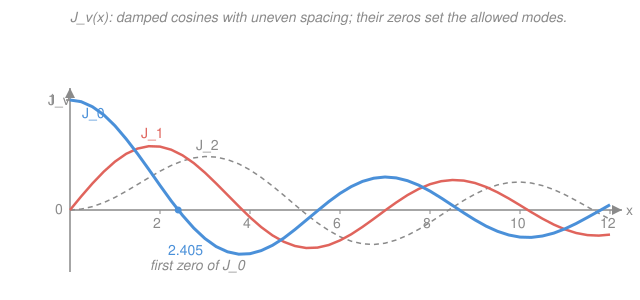

# Mathematical Methods for Physics · Lesson 3.3: Bessel functions

> ⏱ ~15 min · Module 3: Series solutions, special functions & Sturm–Liouville · Builds on: [3.2 Legendre polynomials and spherical harmonics](03-02-legendre-spherical-harmonics.md), [3.1 Power-series and Frobenius solutions](03-01-power-series-frobenius.md) · Unlocks: [3.4 Hermite functions and generating-function methods](03-04-hermite-generating-functions.md)

## Why this matters

Legendre functions were what the Laplacian handed you on a **sphere**. Swap the geometry to a **cylinder** — a drumhead, a coaxial cable, a circular waveguide, a laser beam's cross-section, the diffraction pattern of a round aperture — and separating $\nabla^2$ hands you a different family: the **Bessel functions**. They are to cylindrical problems exactly what $\cos$ and $\sin$ are to a vibrating string, except the modes are spaced *unevenly*, because a circular membrane rings at frequencies that are not simple multiples of each other. Learn to spot the Bessel equation the instant cylindrical symmetry appears, know which solution survives at the axis, and use the zeros to fit boundary conditions, and half of applied EM and quantum mechanics stops being mysterious.

## The idea

Picture a circular drumhead clamped at its rim. Pluck it and it vibrates in standing-wave patterns. Along the angular direction the pattern must repeat after a full turn, so it's an ordinary $\cos(m\phi)$ — nothing new. The **radial** direction is where the geometry bites: as you move outward from the center, a fixed slice of "angle" fans out over more and more circumference, so a wave spreading from the middle gets *diluted*. The radial profile therefore looks like a cosine whose amplitude slowly bleeds away as you go out — a **damped, unevenly-spaced cosine**. That profile is a Bessel function.

Two things make it more than "a cosine with a fudge factor." First, right at the center ($x=0$) there's a coordinate singularity — everything piles up on the axis — so one of the two solutions *blows up there* and the other stays finite. For any object that includes the axis (a solid drum, a filled cylinder) you keep only the finite one, called $J_\nu$. Second, because the membrane is clamped at the rim, the profile must hit zero exactly there; the allowed modes are the ones whose Bessel curve crosses zero at the rim. Those crossing points — the **zeros** of $J_\nu$ — are the quantization condition, the cylindrical analog of "an integer number of half-wavelengths fit on the string."

## The formal version

**Where it comes from.** Separating the Helmholtz equation $\nabla^2 u + k^2 u = 0$ in cylindrical coordinates (using the $\nabla^2$ you built in [1.4](01-04-curvilinear-coordinates.md)), with $u = R(r)\Phi(\phi)Z(z)$ and $\Phi \propto e^{im\phi}$, the radial part obeys — after rescaling to the dimensionless variable $x = kr$ —

$$x^2 y'' + x y' + (x^2 - \nu^2)\,y = 0,$$

the **Bessel equation** of order $\nu$. Here $y(x) = R(r)$, and $\nu \ge 0$ (equal to the angular index $m$ for the drum). *In words: it's almost the harmonic-oscillator equation, but the first-derivative $x y'$ term (the "geometric dilution" from spreading over circumference) and the $-\nu^2$ (the angular twist) bend the solutions.*

**A Frobenius problem.** $x=0$ is a **regular singular point** (from [3.1](03-01-power-series-frobenius.md)): divide by $x^2$ and the coefficients $\tfrac1x$ and $\tfrac{x^2-\nu^2}{x^2}$ blow up, but only mildly. Substituting $y = \sum_{n} a_n x^{n+r}$ gives the indicial equation $r^2 - \nu^2 = 0$, so the **indicial roots are $r = \pm\nu$** — one solution behaving like $x^{+\nu}$ (finite, in fact zero at the origin for $\nu>0$), the other like $x^{-\nu}$ (divergent).

**The two solutions.**

- $J_\nu(x)$ — the **Bessel function of the first kind**, the $r=+\nu$ branch, normalized as
$$J_\nu(x) = \sum_{m=0}^{\infty} \frac{(-1)^m}{m!\,\Gamma(m+\nu+1)}\left(\frac{x}{2}\right)^{2m+\nu}.$$
It is **finite at $x=0$**: $J_0(0)=1$ and $J_\nu(0)=0$ for $\nu>0$. *In words: the well-behaved solution, the one you keep whenever the axis is part of your domain.*
- $Y_\nu(x)$ — the **Bessel function of the second kind** (a.k.a. Neumann function). It is the independent partner, and it **diverges as $x\to 0$** ($Y_0 \sim \tfrac{2}{\pi}\ln x$, $Y_\nu \sim -x^{-\nu}$). *In words: the solution you throw away for any solid region containing the axis, and keep only for annular regions (like the gap in a coaxial cable) that exclude $r=0$.*

**Shape at large $x$.** Both decay and oscillate:

$$J_\nu(x) \;\approx\; \sqrt{\frac{2}{\pi x}}\,\cos\!\Big(x - \frac{\nu\pi}{2} - \frac{\pi}{4}\Big), \qquad x \gg 1.$$

*In words: a cosine of unit-ish spacing whose height fades like $1/\sqrt{x}$* — the "damped cosine" made precise. The energy spreads over a circle of circumference $\propto x$, and amplitude$^2 \times$ circumference stays constant, hence $1/\sqrt{x}$.

**Zeros.** $J_\nu$ has infinitely many positive zeros $\alpha_{\nu,1} < \alpha_{\nu,2} < \cdots$. For $J_0$: $\alpha_{0,1}=2.405,\ \alpha_{0,2}=5.520,\ \alpha_{0,3}=8.654$. For $J_1$: $\alpha_{1,1}=3.832,\ \alpha_{1,2}=7.016$. These are **not** evenly spaced near the origin (they settle toward spacing $\pi$ only far out, per the asymptotic form). A membrane clamped at radius $a$ forces $J_\nu(ka)=0$, i.e. $ka = \alpha_{\nu,n}$, selecting the mode wavenumbers $k_{\nu,n} = \alpha_{\nu,n}/a$.

**Recurrence relations** (the workhorses — they let you get any order from two neighbors, and every derivative in closed form):

$$J_{\nu-1}(x) + J_{\nu+1}(x) = \frac{2\nu}{x}\,J_\nu(x), \qquad \frac{\mathrm{d}}{\mathrm{d}x}\!\left[x^{\nu} J_\nu(x)\right] = x^{\nu} J_{\nu-1}(x).$$

A useful special case of the second, with $\nu=0$: $J_0'(x) = -J_1(x)$. *In words: differentiating $J_0$ just gives you $-J_1$ — the orders ladder into each other like $\sin$ and $\cos$.*

**Orthogonality (a Sturm–Liouville relation, weight $x$).** For a fixed order $\nu$, the functions $J_\nu(\alpha_{\nu,n}\,r/a)$ are mutually orthogonal on $[0,a]$ **with weight $r$** — the extra $r$ is the area element $r\,\mathrm{d}r\,\mathrm{d}\phi$ of the disk, and it is the Sturm–Liouville weight we'll systematize in [3.5](03-05-sturm-liouville-orthogonal-expansions.md):

$$\int_0^a J_\nu\!\Big(\alpha_{\nu,m}\frac{r}{a}\Big)\,J_\nu\!\Big(\alpha_{\nu,n}\frac{r}{a}\Big)\,r\,\mathrm{d}r \;=\; \frac{a^2}{2}\,\big[J_{\nu+1}(\alpha_{\nu,n})\big]^2\,\delta_{mn}.$$

*In words: distinct radial modes don't overlap, so you can pick off expansion coefficients one at a time — a Fourier trick with the weight $r$.* This makes the **Fourier–Bessel series**: any well-behaved $f(r)$ on $[0,a]$ (vanishing appropriately at the rim) expands as

$$f(r) = \sum_{n=1}^{\infty} c_n\,J_\nu\!\Big(\alpha_{\nu,n}\frac{r}{a}\Big), \qquad c_n = \frac{2}{a^2\,[J_{\nu+1}(\alpha_{\nu,n})]^2}\int_0^a f(r)\,J_\nu\!\Big(\alpha_{\nu,n}\frac{r}{a}\Big)\,r\,\mathrm{d}r.$$

## Picture

Notice: $J_0$ starts at $1$; $J_1$ and $J_2$ start at $0$ (the $x^\nu$ behavior). All three oscillate with slowly shrinking amplitude, and the zeros march outward at gradually widening intervals.

## Worked examples

**Example 1 (recurrence — build $J_2$ from its neighbors).** You have tabulated $J_0(2)=0.2239$ and $J_1(2)=0.5767$ and want $J_2(2)$ without another series sum. Use the recurrence with $\nu=1$, $x=2$:

$$J_0(x) + J_2(x) = \frac{2(1)}{x}J_1(x) \;\Longrightarrow\; J_2(2) = \frac{2}{2}J_1(2) - J_0(2) = 0.5767 - 0.2239 = 0.3528.$$

One subtraction replaces an infinite series. This is how tables and library routines climb to high order cheaply.

**Example 2 (why you'd care — a drumhead's fundamental).** A circular membrane of radius $a$, clamped at the rim, with transverse wave speed $c=\sqrt{T/\sigma}$ ($T$ tension per length, $\sigma$ mass per area), has vibration modes $u \propto J_m(k r)\cos(m\phi)\cos(\omega t)$ with $\omega = ck$. Clamping demands $J_m(ka)=0$, so $k_{m,n}=\alpha_{m,n}/a$ and the mode frequencies are

$$\omega_{m,n} = c\,\frac{\alpha_{m,n}}{a}.$$

The **lowest** mode is the one with the smallest zero of any order — that's $\alpha_{0,1}=2.405$, a smooth dome with no angular nodes ($m=0$). So

$$f_{0,1} = \frac{\omega_{0,1}}{2\pi} = \frac{c\,\alpha_{0,1}}{2\pi a}.$$

The **next** mode uses $\alpha_{1,1}=3.832$, giving $f_{1,1}/f_{0,1} = 3.832/2.405 = 1.59$ — an irrational-looking ratio, *not* an octave or a fifth. That inharmonicity is exactly why a drum sounds like a drum and not like a plucked string (whose overtones are integer multiples). The unevenly spaced Bessel zeros are audible.

## Watch out

- **You might think you always need both $J_\nu$ and $Y_\nu$.** For a *solid* cylinder or a full disk — any region that includes $r=0$ — physical fields must be finite on the axis, so the coefficient of $Y_\nu$ is forced to zero and only $J_\nu$ survives. You keep $Y_\nu$ **only** when the axis is excluded (an annulus, a coaxial region, the space *outside* a cylinder).
- **You might read the zeros off as evenly spaced.** They aren't — near the origin the spacing is irregular ($2.405, 5.520, 8.654,\dots$ for $J_0$, gaps $3.11, 3.13,\dots$ approaching $\pi$ only asymptotically). Always look up or compute the actual $\alpha_{\nu,n}$; don't assume $n\pi$.
- **You might drop the weight $r$ in the orthogonality integral.** The inner product on a disk carries the area element, so it's $\int_0^a (\cdots)\,r\,\mathrm{d}r$, not $\int_0^a (\cdots)\,\mathrm{d}r$. Forget the $r$ and every Fourier–Bessel coefficient comes out wrong. (This weight is the whole point of Sturm–Liouville theory in [3.5](03-05-sturm-liouville-orthogonal-expansions.md).)

## One-liner

> Cylindrical symmetry turns $\nabla^2$ into the Bessel equation; keep $J_\nu$ (finite on the axis), drop $Y_\nu$ (which blows up), and let the zeros $\alpha_{\nu,n}$ quantize the modes.

## Problems

**P1 (🟢)** A kettledrum head of radius $a = 0.30\ \mathrm{m}$ has a transverse wave speed $c = 100\ \mathrm{m/s}$. Using $\alpha_{0,1}=2.405$, find the frequency (in Hz) of its fundamental mode. Then find the frequency of the next mode up (use $\alpha_{1,1}=3.832$) and confirm it is not a whole-number multiple of the fundamental.

**P2 (🟡)** Starting from the recurrence $J_{\nu-1}(x)+J_{\nu+1}(x)=\dfrac{2\nu}{x}J_\nu(x)$ and the identity $J_0'(x)=-J_1(x)$, express $J_1'(x)$ in terms of $J_0(x)$ and $J_1(x)$. (Hint: there is also a "downward" derivative rule $\frac{\mathrm{d}}{\mathrm{d}x}[x^{-\nu}J_\nu] = -x^{-\nu}J_{\nu+1}$; or combine the two-term recurrence with the given $J_0$ derivative.)

**P3 (🔴, optional)** A long solid cylinder of radius $a$ carries a temperature profile that satisfies Laplace/Helmholtz-type separation, so the physical radial solution is a Bessel function. Explain in one or two sentences why the general solution $R(r)=A\,J_0(kr)+B\,Y_0(kr)$ must have $B=0$, and state what changes if instead the region is the annulus $b \le r \le a$ (a pipe wall).

Solutions

**P1** Fundamental: $f_{0,1} = \dfrac{c\,\alpha_{0,1}}{2\pi a} = \dfrac{100 \times 2.405}{2\pi \times 0.30} = \dfrac{240.5}{1.885} \approx 128\ \mathrm{Hz}.$

Next mode: $f_{1,1} = \dfrac{c\,\alpha_{1,1}}{2\pi a} = \dfrac{100 \times 3.832}{1.885} \approx 203\ \mathrm{Hz}.$

Ratio $f_{1,1}/f_{0,1} = 3.832/2.405 = 1.59$ — not $2, 3,\dots$, so the overtone is inharmonic. *Check.* Units: $(\mathrm{m/s})/\mathrm{m} = \mathrm{s^{-1}} = \mathrm{Hz}$ ✓ ($\alpha$ is dimensionless). Sanity: a stiffer (faster-$c$) or smaller ($a$) drum rings higher, as it should; and $\approx 128\ \mathrm{Hz}$ is a plausible low drum pitch (near a C below middle C). ✓

**P2** Use the two-term recurrence at $\nu=1$: $J_0(x)+J_2(x)=\dfrac{2}{x}J_1(x)$, so $J_2 = \dfrac{2}{x}J_1 - J_0$. The derivative rule $\frac{\mathrm{d}}{\mathrm{d}x}[x^{-\nu}J_\nu]=-x^{-\nu}J_{\nu+1}$ at $\nu=1$ gives, expanding the left side,

$$x^{-1}J_1' - x^{-2}J_1 = -x^{-1}J_2 \;\Longrightarrow\; J_1' = \frac{1}{x}J_1 - J_2.$$

Substitute $J_2 = \tfrac{2}{x}J_1 - J_0$:

$$J_1'(x) = \frac{1}{x}J_1 - \left(\frac{2}{x}J_1 - J_0\right) = J_0(x) - \frac{1}{x}J_1(x).$$

*Check.* A cleaner symmetric form of these rules is $J_\nu' = \tfrac12(J_{\nu-1}-J_{\nu+1})$; at $\nu=1$ that's $J_1' = \tfrac12(J_0 - J_2) = \tfrac12\big(J_0 - (\tfrac2x J_1 - J_0)\big) = J_0 - \tfrac1x J_1$ ✓, matching. And at $\nu=0$ the same symmetric rule gives $J_0' = \tfrac12(J_{-1}-J_1) = -J_1$ (using $J_{-1}=-J_1$), consistent with the given identity. ✓

**P3** $Y_0(r)\to -\infty$ as $r\to 0$ (it goes like $\tfrac{2}{\pi}\ln r$), but a physical temperature (or potential/field) on the solid cylinder must be **finite on the axis** $r=0$. The only way to keep $R(0)$ finite is $B=0$, leaving $R(r)=A\,J_0(kr)$; the boundary condition at $r=a$ then fixes the allowed $k$ via the zeros of $J_0$. For the annulus $b\le r\le a$ the point $r=0$ is **excluded**, so $Y_0$ is perfectly finite over the domain and must be kept: both $A$ and $B$ are generally nonzero, determined by the two boundary conditions at $r=b$ and $r=a$. *Check.* Two independent solutions ↔ two boundary conditions: the annulus has boundaries at both ends and needs both constants; the solid cylinder "spends" one condition on regularity at the axis. ✓

## Flashback

**From Lesson 3.1 (Power-series and Frobenius solutions):** Find the indicial equation and its roots for the ODE

$$2x^2 y'' + 3x y' - (1 + x)\,y = 0$$

about its regular singular point $x=0$. (You do not need the full series — just the indicial roots.)

Solution

Substitute the leading Frobenius behavior $y \sim x^r$ and keep only the lowest power of $x$. Each term $x^2 y''$, $x y'$, and the constant part of the $y$-coefficient all produce $x^r$:

$$2\,r(r-1) + 3\,r - 1 = 0 \;\Longrightarrow\; 2r^2 + r - 1 = 0 \;\Longrightarrow\; (2r-1)(r+1)=0.$$

So the **indicial roots are $r = \tfrac12$ and $r = -1$.** (The $-x\,y$ piece is one power higher, so it enters the recurrence for the coefficients, not the indicial equation.) *Check.* The roots differ by $\tfrac12 - (-1) = \tfrac32$, not an integer, so the two Frobenius series are independent and give the full general solution with no logarithm needed — contrast with the Bessel case here, where the roots $\pm\nu$ differ by the integer $2\nu$ (for integer $\nu$) and the second solution $Y_\nu$ *does* pick up a logarithm. ✓

## Connections

- **Backward:** the origin $x=0$ is the **regular singular point** of [3.1](03-01-power-series-frobenius.md), and the indicial roots $\pm\nu$ come straight from that machinery; the "recognize the special function from its ODE" reflex is the same one you built for Legendre in [3.2](03-02-legendre-spherical-harmonics.md), now for cylinders instead of spheres.
- **Forward:** the weight-$r$ orthogonality is a special case of **Sturm–Liouville theory** ([3.5](03-05-sturm-liouville-orthogonal-expansions.md)), which reveals *why* every special function in this module comes with its own orthogonality weight; the Fourier–Bessel series is a cousin of the Fourier series of [4.1](04-01-fourier-series-transform.md).
- **Sideways (EM & PDEs):** these are the mode functions of cylindrical **waveguides** and coaxial lines — see the [`em-refresher` syllabus](../../em-refresher/syllabus.md) — where $J_\nu$ zeros set cutoff frequencies exactly as they set drum pitches here; the vibrating-drumhead setup is a textbook separable **PDE** ([`pdes` syllabus](../../pdes/syllabus.md)), and $J_\nu$ also governs circular-aperture diffraction and the radial part of the hydrogen-like problem in cylindrical geometry ([`quantum-mechanics` syllabus](../../quantum-mechanics/syllabus.md)).
