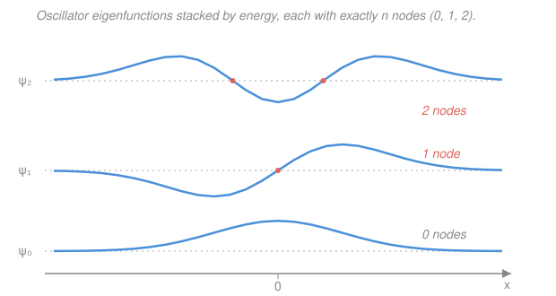

# Mathematical Methods for Physics · Lesson 3.4: Hermite functions and generating-function methods

> ⏱ ~15 min · Module 3: Series solutions, special functions & Sturm–Liouville · Builds on: [3.3 Bessel functions](03-03-bessel-functions.md) · Unlocks: [3.5 Sturm–Liouville theory and orthogonal expansions](03-05-sturm-liouville-orthogonal-expansions.md)

## Why this matters

The quantum harmonic oscillator is the single most reused model in physics — it stands in for a vibrating molecule, a mode of the electromagnetic field, a phonon in a crystal, and the low-energy end of nearly every quantum well. Its stationary states are the **Hermite functions**: a Gaussian envelope multiplied by a polynomial. Two big ideas fall out of solving it. First, the same trick you saw for Legendre and Bessel — power series into a physics ODE — forces the energy to be **quantized** the moment you demand a normalizable state. Second, you meet the **generating function**, a single closed-form expression that packs *all* the polynomials into one object and hands you every recurrence and identity by differentiation. It is the most efficient bookkeeping device for special functions, and this lesson is where you learn to run it.

## The idea

The quantum oscillator asks: what wavefunctions $\psi(x)$ live in the potential $\tfrac12 m\omega^2 x^2$? Far from the center the particle can't be, so $\psi$ must die off — and a Gaussian $e^{-x^2/2}$ (in the right units) is exactly the shape that dies off fast enough. So peel that Gaussian out: write $\psi = H(x)\,e^{-x^2/2}$ and ask what the leftover factor $H(x)$ must satisfy. The Schrödinger equation collapses into a clean ODE for $H$, the **Hermite equation**.

Now the punchline you already met in [3.1](03-01-power-series-frobenius.md): solve $H$ by a power series and the coefficients obey a two-term recurrence. For a *generic* energy the series never stops — and an infinite polynomial times $e^{-x^2/2}$ actually blows up, not down, so it's not a legal wavefunction. The only escape is for the series to **terminate**: the recurrence must hit zero and kill every higher term. That happens only at special energies, one for each cutoff degree $n = 0, 1, 2, \dots$. Series termination *is* energy quantization. What survives are the **Hermite polynomials** $H_n(x)$, and the states are $H_n(x)\,e^{-x^2/2}$ — a bump with exactly $n$ wiggles.

Then comes the labor-saving magic. Instead of grinding out each $H_n$ from the recurrence, one function

$$g(x,t) = e^{2xt - t^2}$$

has the property that if you expand it in powers of $t$, the coefficient of $t^n/n!$ *is* $H_n(x)$. Differentiate this one object with respect to $t$ or $x$ and match powers of $t$, and every recurrence relation drops out mechanically. That's the generating-function method: one machine, all the identities.

## The formal version

**The Hermite equation.** Peeling the Gaussian out of the oscillator's Schrödinger equation (worked in Example 2) leaves

$$y'' - 2x\,y' + 2n\,y = 0.$$

*In words: this is the ODE the polynomial factor must satisfy; the constant $2n$ is what the energy becomes after cleanup.* A power-series attempt $y=\sum_k a_k x^k$ gives the recurrence

$$a_{k+2} = \frac{2k - 2n}{(k+1)(k+2)}\,a_k .$$

*In words: each coefficient is fixed by the one two steps below it.* For non-integer $n$ the chain runs forever; at a non-negative integer $n$ the numerator $2k-2n$ vanishes at $k=n$, so $a_{n+2}=0$ and the series **terminates** at degree $n$. That truncation is the only way to get a normalizable state — hence $n\in\{0,1,2,\dots\}$, i.e. quantized.

**Hermite polynomials (physicists' convention).** The terminating solutions, normalized so the leading coefficient is $2^n$:

$$H_0 = 1,\quad H_1 = 2x,\quad H_2 = 4x^2 - 2,\quad H_3 = 8x^3 - 12x,\quad H_4 = 16x^4 - 48x^2 + 12.$$

$H_n$ has the parity of $n$ (even $n$ → even polynomial) and exactly $n$ real roots.

**Rodrigues' formula.** A closed form that spits out any $H_n$ by differentiation:

$$H_n(x) = (-1)^n\, e^{x^2}\,\frac{d^n}{dx^n}\,e^{-x^2}.$$

*In words: differentiate the Gaussian $n$ times, then divide back out the Gaussian (with a sign) — what's left is a degree-$n$ polynomial.* This mirrors the Rodrigues formula for $P_\ell$ from [3.2](03-02-legendre-spherical-harmonics.md); every classical orthogonal family has one.

**Generating function.** The compact packer of the whole family:

$$e^{2xt - t^2} = \sum_{n=0}^{\infty} H_n(x)\,\frac{t^n}{n!}.$$

*In words: Taylor-expand the left side in $t$; the coefficient of $t^n/n!$ is exactly $H_n(x)$.* Differentiating this identity yields, with no series algebra, the two workhorse relations

$$\boxed{\,H_{n+1}(x) = 2x\,H_n(x) - 2n\,H_{n-1}(x)\,}\qquad\text{and}\qquad \boxed{\,H_n'(x) = 2n\,H_{n-1}(x)\,}.$$

*In words: the first climbs the ladder of polynomials; the second says differentiating drops you one rung and pulls out a $2n$.* (Both are derived in Example 1.)

**Orthogonality with the Gaussian weight.** The $H_n$ are orthogonal on the whole line, but only against the weight $w(x)=e^{-x^2}$:

$$\int_{-\infty}^{\infty} H_m(x)\,H_n(x)\,e^{-x^2}\,dx = 2^n\,n!\,\sqrt{\pi}\;\delta_{mn}.$$

*In words: two different-degree Hermite polynomials integrate to zero once you tuck the Gaussian in; same-degree gives the normalization constant $2^n n!\sqrt\pi$.* The weight is not optional — it is the $e^{-x^2}$ that came from the two Gaussian envelopes multiplying together. (In [3.5](03-05-sturm-liouville-orthogonal-expansions.md) you'll see *every* special function's weight is dictated by writing its ODE in self-adjoint form.)

**The oscillator eigenfunctions.** Multiply back the peeled-off $e^{-x^2/2}$ and normalize so $\int|\psi_n|^2\,dx = 1$:

$$\psi_n(x) = N_n\,H_n(x)\,e^{-x^2/2}, \qquad N_n = \left(2^n\,n!\,\sqrt{\pi}\right)^{-1/2}.$$

*In words: each stationary state is a Hermite polynomial riding a Gaussian, scaled so its total probability is one.* The number of **nodes** (zero crossings) of $\psi_n$ equals $n$ — higher-energy states wiggle more, exactly the picture below. (Here $x$ is a dimensionless length $x=\sqrt{m\omega/\hbar}\,\tilde x$; restoring units just rescales the axis.)

## Picture

Each curve sits on its own baseline (an energy rung). Read off the node count: $\psi_0$ never crosses, $\psi_1$ crosses once at the center, $\psi_2$ crosses twice (at $x=\pm 1/\sqrt2$, the roots of $H_2=4x^2-2$).

## Worked examples

**Example 1 (mechanical — mine the generating function).** Let's *earn* the two recurrences from $g(x,t)=e^{2xt-t^2}=\sum_n H_n \tfrac{t^n}{n!}$.

*Recurrence in $n$.* Differentiate $g$ with respect to $t$:

$$\frac{\partial g}{\partial t} = (2x - 2t)\,e^{2xt - t^2} = (2x-2t)\,g.$$

Now write both sides as series. The left side, differentiating the sum term by term, is $\sum_n H_n \tfrac{n\,t^{n-1}}{n!} = \sum_n H_n \tfrac{t^{n-1}}{(n-1)!}$. The right side is $\sum_n (2x-2t)H_n\tfrac{t^n}{n!}$. Match the coefficient of $t^n$ on both sides:

$$\frac{H_{n+1}}{n!} = \frac{2x\,H_n}{n!} - \frac{2H_{n-1}}{(n-1)!} .$$

Multiply through by $n!$ and use $n!/(n-1)! = n$:

$$H_{n+1} = 2x\,H_n - 2n\,H_{n-1}.\qquad\checkmark$$

*Derivative relation.* Differentiate $g$ instead with respect to $x$: $\partial g/\partial x = 2t\,g$. The left side is $\sum_n H_n' \tfrac{t^n}{n!}$; the right is $\sum_n 2H_n\tfrac{t^{n+1}}{n!}$. Matching the coefficient of $t^n$ (so $2H_{n-1}\tfrac{t^n}{(n-1)!}$ on the right):

$$\frac{H_n'}{n!} = \frac{2H_{n-1}}{(n-1)!}\;\Longrightarrow\; H_n' = 2n\,H_{n-1}.\qquad\checkmark$$

Two differentiations of one exponential, and both ladder relations are yours — no ODE, no series-coefficient grind. *That* is why generating functions are worth learning.

**Example 2 (why you'd care — where the Hermite equation comes from).** The time-independent Schrödinger equation for a particle of mass $m$ in $V=\tfrac12 m\omega^2\tilde x^2$ is

$$-\frac{\hbar^2}{2m}\frac{d^2\psi}{d\tilde x^2} + \tfrac12 m\omega^2 \tilde x^2\,\psi = E\,\psi.$$

Switch to the dimensionless coordinate $x=\sqrt{m\omega/\hbar}\,\tilde x$ and the scaled energy $\epsilon = 2E/(\hbar\omega)$. The equation cleans up to

$$\psi'' + (\epsilon - x^2)\,\psi = 0.$$

Peel out the large-$x$ behavior with the ansatz $\psi = H(x)\,e^{-x^2/2}$. Then $\psi' = (H' - xH)e^{-x^2/2}$ and $\psi'' = (H'' - 2xH' + (x^2-1)H)e^{-x^2/2}$. Substituting and cancelling the common $e^{-x^2/2}$:

$$H'' - 2x\,H' + (\epsilon - 1)\,H = 0.$$

This is the Hermite equation with $2n = \epsilon - 1$. Termination forces $n=0,1,2,\dots$, so

$$\epsilon = 2n+1 \;\Longrightarrow\; E_n = \tfrac12\hbar\omega\,\epsilon = \left(n+\tfrac12\right)\hbar\omega.$$

The famous equally spaced ladder, with a $\tfrac12\hbar\omega$ zero-point offset, is nothing but "the power series has to stop." The same series-termination logic that fixed $\ell$ for Legendre in [3.2](03-02-legendre-spherical-harmonics.md) fixes the oscillator's energies here.

## Watch out

- **You might grab the wrong Hermite convention.** Physicists use $H_n$ with generating function $e^{2xt-t^2}$ and weight $e^{-x^2}$ (that's Arfken/Boas and this lesson). Probabilists use $He_n$ with $e^{xt-t^2/2}$ and weight $e^{-x^2/2}$. They differ by a scaling $He_n(x)=2^{-n/2}H_n(x/\sqrt2)$; mixing them corrupts every constant. Stay in the physicists' column.
- **You might drop the weight from orthogonality.** $\int H_m H_n\,dx$ **without** the $e^{-x^2}$ does *not* vanish and in fact diverges. Orthogonality lives with respect to $w=e^{-x^2}$; the polynomials alone are not orthogonal. The full eigenfunctions $\psi_n$, which absorb $e^{-x^2/2}$ each, *are* orthogonal in the plain sense $\int\psi_m\psi_n\,dx=\delta_{mn}$.
- **You might think higher $n$ means a narrower state.** Opposite: more nodes push probability *outward* toward the classical turning points, and $\psi_n$ spreads *wider* with $n$ (the classical particle spends most of its time near the turning points where it's slow). The Gaussian only dominates the ground state.

## One-liner

> Peel a Gaussian off the quantum oscillator and the leftover polynomial must terminate — that's quantization — leaving the Hermite functions, whose every identity you can crank out of the single generating function $e^{2xt-t^2}$.

## Problems

**P1 (🟢)** Use the generating function's ladder recurrence $H_{n+1}=2xH_n-2nH_{n-1}$, starting from $H_0=1$ and $H_1=2x$, to build $H_2$ and $H_3$. Then confirm $H_2$ agrees with the coefficient of $t^2/2!$ in the expansion of $e^{2xt-t^2}$.

**P2 (🟡)** Verify directly that $H_0=1$ and $H_2=4x^2-2$ are orthogonal with the Gaussian weight: show $\int_{-\infty}^{\infty}(4x^2-2)\,e^{-x^2}\,dx = 0$. (Use the two Gaussian integrals $\int_{-\infty}^{\infty}e^{-x^2}dx=\sqrt\pi$ and $\int_{-\infty}^{\infty}x^2e^{-x^2}dx=\tfrac{\sqrt\pi}{2}$.)

**P3 (🔴, optional)** Normalize the first excited oscillator state $\psi_1(x)=N_1\,(2x)\,e^{-x^2/2}$: find $N_1$ from $\int_{-\infty}^{\infty}\psi_1^2\,dx=1$, and state how many nodes $\psi_1$ has and where.

Solutions

**P1** Apply $H_{n+1}=2xH_n-2nH_{n-1}$.

For $n=1$: $H_2 = 2x\,H_1 - 2(1)H_0 = 2x(2x) - 2(1) = 4x^2 - 2.$

For $n=2$: $H_3 = 2x\,H_2 - 2(2)H_1 = 2x(4x^2-2) - 4(2x) = 8x^3 - 4x - 8x = 8x^3 - 12x.$

Cross-check $H_2$ against the generating function. Expand $e^{2xt-t^2}=e^{2xt}\,e^{-t^2}$ to order $t^2$:

$$e^{2xt} = 1 + 2xt + \tfrac{(2xt)^2}{2} + \cdots = 1 + 2xt + 2x^2t^2+\cdots,\qquad e^{-t^2}=1 - t^2 + \cdots.$$

Product, collecting $t^2$: $2x^2 t^2 + (1)(-t^2) = (2x^2 - 1)t^2$. The generating function says this coefficient is $H_2\,\tfrac{1}{2!}=\tfrac{H_2}{2}$, so $H_2 = 2(2x^2-1) = 4x^2 - 2.$ ✓

*Check.* Leading coefficients are $2^n$ ($4=2^2$, $8=2^3$) ✓, and parity matches degree — $H_2$ even, $H_3$ odd ✓.

**P2** Split the integral and pull out constants:

$$\int_{-\infty}^{\infty}(4x^2-2)e^{-x^2}\,dx = 4\int_{-\infty}^{\infty}x^2 e^{-x^2}\,dx - 2\int_{-\infty}^{\infty}e^{-x^2}\,dx = 4\cdot\frac{\sqrt\pi}{2} - 2\cdot\sqrt\pi = 2\sqrt\pi - 2\sqrt\pi = 0.\ \checkmark$$

*Check.* This is the $m=0,n=2$ case of the orthogonality relation, which predicts $0$ for $m\neq n$ ✓. It also shows *why* $H_2=4x^2-2$ has that particular constant $-2$: it's exactly what makes the weighted integral against $H_0=1$ cancel.

**P3** Compute $\int_{-\infty}^{\infty}\psi_1^2\,dx = N_1^2\int_{-\infty}^{\infty}4x^2 e^{-x^2}\,dx.$ Using $\int x^2 e^{-x^2}dx=\tfrac{\sqrt\pi}{2}$:

$$\int_{-\infty}^{\infty}4x^2 e^{-x^2}\,dx = 4\cdot\frac{\sqrt\pi}{2} = 2\sqrt\pi.$$

Setting $N_1^2\,(2\sqrt\pi)=1$ gives

$$N_1 = \left(2\sqrt\pi\right)^{-1/2} = \frac{1}{(2\sqrt\pi)^{1/2}} \approx 0.531.$$

This matches the general formula $N_n=(2^n n!\sqrt\pi)^{-1/2}$ at $n=1$: $2^1\,1!\,\sqrt\pi = 2\sqrt\pi$ ✓. The state $\psi_1\propto x\,e^{-x^2/2}$ vanishes only where $x=0$, so it has **one node, at the origin** — consistent with node count $=n=1$.

*Check.* $\psi_1$ is odd, so it must pass through zero at the center; and $N_1<N_0=\pi^{-1/4}\approx0.751$, sensible since $\psi_1$'s probability is spread wider and its polynomial factor is larger. ✓

## Flashback

**From Lesson 3.2 (Legendre polynomials):** Use the Legendre Rodrigues formula $P_\ell(x)=\dfrac{1}{2^\ell\,\ell!}\dfrac{d^\ell}{dx^\ell}(x^2-1)^\ell$ to compute $P_2(x)$. (Fresh variant — Legendre's Rodrigues formula, the sibling of the Hermite one you just used.)

Solution

For $\ell=2$: first form $(x^2-1)^2 = x^4 - 2x^2 + 1$, then differentiate twice:

$$\frac{d}{dx}(x^4-2x^2+1) = 4x^3 - 4x,\qquad \frac{d^2}{dx^2}(x^4-2x^2+1) = 12x^2 - 4.$$

The prefactor is $\dfrac{1}{2^2\,2!}=\dfrac{1}{8}$, so

$$P_2(x) = \frac{1}{8}\,(12x^2 - 4) = \frac{3x^2 - 1}{2}.$$

*Check.* $P_2(1)=\tfrac{3-1}{2}=1$ ✓ (all Legendre polynomials satisfy $P_\ell(1)=1$), and $P_2$ is even, matching even $\ell$ ✓. Same Rodrigues machinery as Hermite — differentiate a simple seed, divide out a normalizer.

## Connections

- **Backward:** the termination-forces-quantization argument is the [3.1](03-01-power-series-frobenius.md) Frobenius recurrence again, and the Rodrigues formula and weighted orthogonality are the direct analogues of what you built for Legendre in [3.2](03-02-legendre-spherical-harmonics.md) and Bessel in [3.3](03-03-bessel-functions.md). Three families, one template.
- **Forward:** [3.5 Sturm–Liouville theory](03-05-sturm-liouville-orthogonal-expansions.md) explains *why* each family carries its own weight ($e^{-x^2}$ here) — it's whatever puts the ODE in self-adjoint form — and shows the completeness that lets you expand any function in $H_n$'s, a generalized Fourier series.
- **Sideways (quantum mechanics):** the $\psi_n$ here *are* the stationary states of the quantum harmonic oscillator, and $E_n=(n+\tfrac12)\hbar\omega$ is its spectrum — the workhorse example of the [`quantum-mechanics`](../../quantum-mechanics/syllabus.md) course. The generating-function ladder recurrences are the polynomial shadow of the raising/lowering (creation/annihilation) operators you'll meet there.
