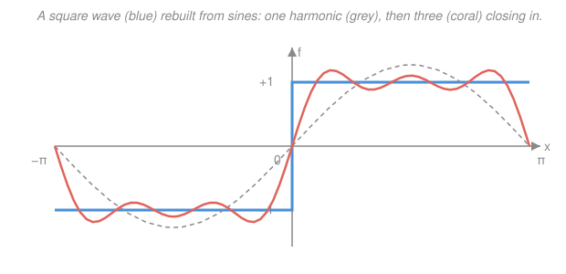

# Mathematical Methods for Physics · Lesson 4.1: Fourier series and the Fourier transform for physics

> ⏱ ~15 min · Module 4: Integral transforms, distributions & Green's functions · Builds on: [3.5 Sturm–Liouville theory and orthogonal expansions](03-05-sturm-liouville-orthogonal-expansions.md) · Unlocks: [4.2 The Dirac delta and distributions](04-02-dirac-delta-distributions.md)

## Why this matters

A prism splits white light into colors; your ear splits a chord into notes. Both are doing the same mathematical thing: **decomposing a signal into pure sinusoids** and reporting how much of each is present. That decomposition — the Fourier series for periodic things, the Fourier transform for everything else — is the physicist's single most-used tool. The payoff is not just the picture; it's the *algebra*. Under a Fourier transform, **differentiation becomes multiplication**, so a differential equation collapses into a division. That one trick powers the ODE and PDE methods of the rest of this module ([4.3](04-03-laplace-transform-ivp.md), [4.4](04-04-greens-functions.md)), quantum mechanics (position ↔ momentum), and every "frequency response" in signal processing.

## The idea

Back in [3.5](03-05-sturm-liouville-orthogonal-expansions.md) we found that the eigenfunctions of a Sturm–Liouville problem form an orthogonal basis, and *any* reasonable function on the interval can be written as a weighted sum of them — a generalized Fourier series. Fourier's original case is the archetype: on an interval of length $L$ the eigenfunctions are the pure waves $e^{ik_n x}$, and they are mutually orthogonal. So a periodic function is a **sum of waves**, and finding "how much of each wave" is just a projection — the same inner-product bookkeeping as 3.5, now with the simplest possible basis.

Then comes the leap. A Fourier *series* only describes periodic functions, because a sum of waves with period $L$ repeats every $L$. To handle a one-off pulse — a single lightning strike, a lone Gaussian bump — imagine stretching the period to infinity, $L\to\infty$. The allowed wavenumbers $k_n=2\pi n/L$ get packed infinitely close together, and the *sum over discrete modes becomes an integral over a continuum of modes*. That integral is the **Fourier transform**: instead of a list of coefficients $c_n$, you get a smooth function $\tilde f(k)$ that says how much of wavenumber $k$ is in your signal. Same idea, continuous version.

## The formal version

**Fourier series.** For a function $f$ with period $L$, defined on $[-L/2,\,L/2]$, write it as a sum of complex exponentials:

$$f(x)=\sum_{n=-\infty}^{\infty} c_n\, e^{i k_n x},\qquad k_n=\frac{2\pi n}{L},\qquad c_n=\frac{1}{L}\int_{-L/2}^{L/2} f(x)\, e^{-i k_n x}\,\mathrm{d}x.$$

*In words: $f$ is a stack of waves; the coefficient $c_n$ is the amount of the wave with wavenumber $k_n$.* Here $x$ is position (or time), $k_n$ is the **wavenumber** (radians per unit length) of the $n$-th mode, and $c_n$ is its complex **amplitude** (magnitude = strength, phase = where the wave peaks). The formula for $c_n$ is exactly the SL projection from [3.5](03-05-sturm-liouville-orthogonal-expansions.md): it works because the basis is orthogonal,

$$\int_{-L/2}^{L/2} e^{i k_m x}\, e^{-i k_n x}\,\mathrm{d}x = L\,\delta_{mn},$$

with $\delta_{mn}$ the Kronecker delta (1 if $m=n$, else 0). Multiply the series by $e^{-ik_m x}$, integrate, and only the $n=m$ term survives — that isolation *is* the coefficient formula.

**Real form.** Grouping $+n$ and $-n$ turns the complex waves into real cosines and sines:

$$f(x)=\frac{a_0}{2}+\sum_{n=1}^{\infty}\Big[a_n\cos k_n x + b_n\sin k_n x\Big],\quad a_n=\frac{2}{L}\int_{-L/2}^{L/2}\! f\cos k_n x\,\mathrm{d}x,\quad b_n=\frac{2}{L}\int_{-L/2}^{L/2}\! f\sin k_n x\,\mathrm{d}x.$$

*In words: an even function is built from cosines, an odd one from sines.* (Relation to the complex form: $c_n=\tfrac12(a_n-ib_n)$ for $n>0$.)

**The Fourier transform.** Let $L\to\infty$. The spacing $\Delta k=2\pi/L\to 0$, the sum $\sum_n(\cdots)$ becomes $\int \frac{\mathrm{d}k}{2\pi}(\cdots)$, and $Lc_n\to\tilde f(k)$. You get the **transform pair** (our convention — the "$2\pi$ downstairs on the inverse" convention):

$$\boxed{\;\tilde f(k)=\int_{-\infty}^{\infty} f(x)\, e^{-i k x}\,\mathrm{d}x,\qquad f(x)=\frac{1}{2\pi}\int_{-\infty}^{\infty}\tilde f(k)\, e^{i k x}\,\mathrm{d}k.\;}$$

*In words: $\tilde f(k)$ is the continuous amplitude of wavenumber $k$; the second formula stacks all those waves back into $f$.* We hang the whole $1/2\pi$ on the inverse transform; other books split it as $1/\sqrt{2\pi}$ on each, so always check a book's convention before quoting a formula. The transform is a **mode decomposition**: $|\tilde f(k)|$ large means "lots of wavenumber $k$ in $f$."

**The three power rules.** These are why physicists reach for the transform:

1. **Derivative → multiplication.** Differentiate the inverse formula under the integral: each $e^{ikx}$ brings down a factor $ik$. Hence

$$\widetilde{f'}(k)=ik\,\tilde f(k),\qquad \widetilde{f^{(n)}}(k)=(ik)^n\,\tilde f(k).$$

*In words: taking a derivative in $x$ just multiplies by $ik$ in $k$-space.* A differential operator becomes an ordinary number — this is the trick that turns calculus into algebra.

2. **Convolution theorem.** Define the convolution $(f*g)(x)=\int_{-\infty}^{\infty} f(x')\,g(x-x')\,\mathrm{d}x'$ (a "smearing" of $f$ by $g$). Then

$$\widetilde{f*g}(k)=\tilde f(k)\,\tilde g(k).$$

*In words: a messy smear in $x$ is just a plain product in $k$.* Filtering, blurring, and — crucially — the Green's-function solutions of [4.4](04-04-greens-functions.md) are all convolutions, so they multiply in $k$-space.

3. **Parseval / Plancherel.** Total "energy" is the same computed in either domain:

$$\int_{-\infty}^{\infty}|f(x)|^2\,\mathrm{d}x=\frac{1}{2\pi}\int_{-\infty}^{\infty}|\tilde f(k)|^2\,\mathrm{d}k.$$

*In words: the transform just relabels the energy by wavenumber; it doesn't create or destroy any.* $|\tilde f(k)|^2$ is the **power spectrum** — energy per unit wavenumber.

## Picture

The single sine already captures the gross shape; adding the third and fifth harmonics sharpens the corners. Keep adding odd harmonics and the coral curve marches toward the blue square — that convergence *is* the Fourier series. (The little overshoot at the jumps never fully goes away; that's the Gibbs phenomenon, a signature of representing a discontinuity with smooth waves.)

## Worked examples

**Example 1 (Gaussian → Gaussian — the width-inverts result).** Transform $f(x)=e^{-a x^2}$ with $a>0$:

$$\tilde f(k)=\int_{-\infty}^{\infty} e^{-a x^2}\,e^{-ikx}\,\mathrm{d}x.$$

Complete the square in the exponent: $-ax^2-ikx=-a\big(x+\tfrac{ik}{2a}\big)^2-\tfrac{k^2}{4a}$. The shifted Gaussian integrates to the standard $\sqrt{\pi/a}$ (shifting the contour off the real axis is legitimate here), leaving

$$\tilde f(k)=\sqrt{\frac{\pi}{a}}\;e^{-k^2/4a}.$$

A Gaussian of width $\sim 1/\sqrt a$ in $x$ transforms to a Gaussian of width $\sim\sqrt a$ in $k$. **Narrow in $x$ ⟺ wide in $k$**: a sharply localized pulse needs a broad band of wavenumbers to build it. That reciprocal spread is the mathematical heart of the Heisenberg uncertainty principle — squeeze a wavepacket in position and its momentum content fans out.

**Example 2 (solving an ODE by transforming — the whole point).** Solve $-u''(x)+u(x)=f(x)$ on the whole line (a screened-Poisson / Yukawa equation; $f$ is a given source). Transform both sides, using rule 1 with $\widetilde{u''}=(ik)^2\tilde u=-k^2\tilde u$:

$$-(-k^2\tilde u)+\tilde u=\tilde f\;\Longrightarrow\;(k^2+1)\,\tilde u(k)=\tilde f(k)\;\Longrightarrow\;\tilde u(k)=\frac{\tilde f(k)}{k^2+1}.$$

The differential equation became **division**. In $k$-space $\tilde u=\tilde f\cdot\tilde G$ with $\tilde G(k)=1/(k^2+1)$, so by the convolution theorem (rule 2) the solution is $u=f*G$ — a smear of the source against the fixed response $G(x)=\tfrac12 e^{-|x|}$ (the inverse transform of $1/(k^2+1)$). That $G$ is exactly the **Green's function** of [4.4](04-04-greens-functions.md): the transform hands it to you as one over the operator's symbol.

## Watch out

- **You might think $\tilde f(k)$ is always real.** It's generally **complex** — its magnitude gives the amount of each wave and its phase gives that wave's alignment. Only special symmetries force it real: $f$ real and even ⟹ $\tilde f$ real and even; $f$ real and odd ⟹ $\tilde f$ purely imaginary.
- **You might drop a factor of $2\pi$.** Conventions differ on where the $2\pi$ and the sign of the exponent live. Fix one convention (ours: $e^{-ikx}$ forward, $1/2\pi$ on the inverse) and use it consistently, or Parseval and the inversion will be off by factors.
- **You might read $ik$ as a typo for $k$.** The derivative rule genuinely carries an $i$: $\widetilde{f'}=ik\tilde f$. The imaginary unit encodes that differentiation shifts a wave's phase by a quarter cycle ($\cos\to-\sin$). Two derivatives give $(ik)^2=-k^2$ — real and negative, which is why $-\partial_x^2$ acts like the positive number $k^2$ (it's a positive operator).

## One-liner

> The Fourier transform re-expresses a function as its recipe of pure waves $\tilde f(k)$, and in that language differentiation is multiplication by $ik$, convolution is multiplication, and energy is preserved.

## Problems

**P1 (🟢)** Find the complex Fourier-series coefficients $c_n$ of the $2\pi$-periodic **square wave** $f(x)=+1$ for $0<x<\pi$ and $f(x)=-1$ for $-\pi<x<0$. Then write the real (sine) series. *(Here $L=2\pi$, so $k_n=n$.)*

**P2 (🟢)** Find the Fourier transform $\tilde f(k)$ of the **box function** $f(x)=1$ for $|x|<b$ and $0$ otherwise. Identify the shape of the result and its first zeros.

**P3 (🟡)** Use the derivative rule to solve $u'(x)+\gamma\,u(x)=f(x)$ on the whole line for $\tilde u(k)$, with $\gamma>0$ a constant. What is $\tilde G(k)$, and by the convolution theorem what integral gives $u(x)$?

Solutions

**P1** With $L=2\pi$ and $k_n=n$,

$$c_n=\frac{1}{2\pi}\int_{-\pi}^{\pi} f(x)e^{-inx}\,\mathrm{d}x=\frac{1}{2\pi}\Big[\int_{0}^{\pi}e^{-inx}\,\mathrm{d}x-\int_{-\pi}^{0}e^{-inx}\,\mathrm{d}x\Big].$$

For $n\neq 0$, $\int_0^{\pi}e^{-inx}\mathrm{d}x=\dfrac{1-e^{-in\pi}}{in}$ and $\int_{-\pi}^{0}e^{-inx}\mathrm{d}x=\dfrac{e^{in\pi}-1}{in}$. Subtracting, and using $e^{\pm in\pi}=(-1)^n$:

$$c_n=\frac{1}{2\pi}\cdot\frac{1-2(-1)^n+1}{in}=\frac{1-(-1)^n}{i\pi n}.$$

So $c_n=0$ for even $n$, and $c_n=\dfrac{2}{i\pi n}$ for odd $n$; $c_0=0$ (the wave has zero average). Regrouping $\pm n$ with $c_{-n}=\overline{c_n}$ gives the real sine series (the function is odd, so no cosines):

$$f(x)=\frac{4}{\pi}\sum_{m=0}^{\infty}\frac{\sin\big((2m+1)x\big)}{2m+1}=\frac{4}{\pi}\Big(\sin x+\tfrac{1}{3}\sin 3x+\tfrac{1}{5}\sin 5x+\cdots\Big).$$

*Check.* Odd function ⟹ only sines, ✓ (matches the figure, whose harmonics are exactly $\sin x$, $\sin 3x/3$, $\sin 5x/5$). At $x=\pi/2$ the series gives $\tfrac{4}{\pi}(1-\tfrac13+\tfrac15-\cdots)=\tfrac{4}{\pi}\cdot\tfrac{\pi}{4}=1=f(\pi/2)$, ✓.

**P2** The box is $1$ on $(-b,b)$:

$$\tilde f(k)=\int_{-b}^{b} e^{-ikx}\,\mathrm{d}x=\Big[\frac{e^{-ikx}}{-ik}\Big]_{-b}^{b}=\frac{e^{-ikb}-e^{ikb}}{-ik}=\frac{2\sin(kb)}{k}=2b\,\frac{\sin(kb)}{kb}.$$

This is a **sinc** function, $2b\,\mathrm{sinc}(kb)$. Its central peak has height $\tilde f(0)=2b$ (the area of the box, as it must be), and its first zeros are where $\sin(kb)=0$ with $k\neq 0$, i.e. $k=\pm\pi/b$.

*Check.* Box ↔ sinc is the reciprocal-width story again: a **wider** box (larger $b$) gives zeros at **smaller** $|k|=\pi/b$, i.e. a narrower spectral peak. Real and even $f$ ⟹ real and even $\tilde f$, ✓ ($\sin(kb)/k$ is even). Reassuringly it is the $L\to\infty$ cousin of P1's discrete sine coefficients.

**P3** Transform $u'+\gamma u=f$, using $\widetilde{u'}=ik\,\tilde u$:

$$ik\,\tilde u+\gamma\,\tilde u=\tilde f\;\Longrightarrow\;(\gamma+ik)\,\tilde u=\tilde f\;\Longrightarrow\;\tilde u(k)=\frac{\tilde f(k)}{\gamma+ik}.$$

So $\tilde G(k)=\dfrac{1}{\gamma+ik}$. By the convolution theorem, $u=f*G$, i.e.

$$u(x)=\int_{-\infty}^{\infty} f(x')\,G(x-x')\,\mathrm{d}x',\qquad G(x)=e^{-\gamma x}\ \text{for }x>0,\ \ 0\ \text{for }x<0.$$

*(That $G$ is the inverse transform of $1/(\gamma+ik)$ — the causal decaying exponential.)*

*Check.* Dimensionally $\gamma$ has units of $1/x$, so $\gamma+ik$ is homogeneous, ✓. Limiting case $f\to$ a sharp spike at the origin: $u(x)\to G(x)$, the pure impulse response — a decaying exponential switched on at the source, exactly what a first-order relaxation equation should do. This is the [4.4](04-04-greens-functions.md) Green's-function pattern in miniature.

## Flashback

**From Lesson 3.5 (Sturm–Liouville theory and orthogonal expansions):** The functions $\{\sin(n\pi x/\ell)\}_{n=1}^{\infty}$ are the eigenfunctions of $-y''=\lambda y$ on $[0,\ell]$ with $y(0)=y(\ell)=0$, and they are orthogonal with weight $1$. Compute $\displaystyle\int_0^{\ell}\sin\!\Big(\frac{m\pi x}{\ell}\Big)\sin\!\Big(\frac{n\pi x}{\ell}\Big)\,\mathrm{d}x$ and use it to find the coefficient $b_n$ in the sine expansion $f(x)=\sum_{n\ge1} b_n\sin(n\pi x/\ell)$.

Solution

Use $\sin A\sin B=\tfrac12[\cos(A-B)-\cos(A+B)]$. For $m\neq n$ both cosine terms integrate to zero over $[0,\ell]$ (each argument is an integer multiple of $\pi x/\ell$ completing whole half-cycles), giving $0$. For $m=n$,

$$\int_0^{\ell}\sin^2\!\Big(\frac{n\pi x}{\ell}\Big)\,\mathrm{d}x=\int_0^{\ell}\frac{1-\cos(2n\pi x/\ell)}{2}\,\mathrm{d}x=\frac{\ell}{2}.$$

So $\int_0^\ell \sin(m\pi x/\ell)\sin(n\pi x/\ell)\,\mathrm{d}x=\tfrac{\ell}{2}\,\delta_{mn}$ — orthogonal, with squared norm $\ell/2$. Projecting $f$ onto the $n$-th eigenfunction (multiply by $\sin(n\pi x/\ell)$, integrate, divide by the norm):

$$b_n=\frac{2}{\ell}\int_0^{\ell} f(x)\,\sin\!\Big(\frac{n\pi x}{\ell}\Big)\,\mathrm{d}x.$$

*Check.* This is the SL projection formula "coefficient = inner product over norm," and it is exactly the $b_n$ of the real Fourier series in this lesson, specialized to a half-interval with Dirichlet ends. The Fourier basis is just the simplest Sturm–Liouville system, ✓.

## Connections

- **Backward:** the coefficient formula $c_n=\tfrac1L\int f\,e^{-ik_n x}\,\mathrm{d}x$ is the [3.5](03-05-sturm-liouville-orthogonal-expansions.md) Sturm–Liouville projection with the wave basis $e^{ik_n x}$; orthogonality is what makes the projection clean. The whole lesson is 3.5's "expand in eigenfunctions" applied to the simplest eigenproblem, then pushed to a continuum.
- **Forward:** the derivative→$ik$ rule is the engine of [4.3 the Laplace transform](04-03-laplace-transform-ivp.md) (its close cousin for initial-value problems) and of [4.4 Green's functions](04-04-greens-functions.md), where "$\tilde u=\tilde f/(\text{operator symbol})$" becomes the standard recipe; it also linearizes PDEs — see the [`pdes` syllabus](../../pdes/syllabus.md).
- **Sideways:** the full development — sampling, FFT, filtering, distributions, uncertainty — lives in the dedicated [`fourier-analysis` syllabus](../../fourier-analysis/syllabus.md). In [`quantum-mechanics`](../../quantum-mechanics/syllabus.md) this same transform is the position↔momentum change of basis, and Example 1's width inversion is literally the uncertainty principle $\Delta x\,\Delta p\gtrsim\hbar$.
