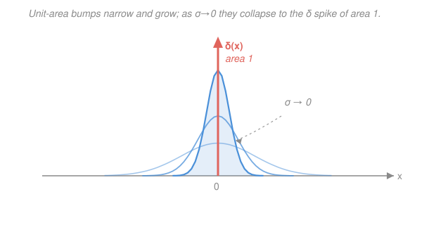

# Mathematical Methods for Physics · Lesson 4.2: The Dirac delta and distributions

> ⏱ ~15 min · Module 4: Integral transforms, distributions & Green's functions · Builds on: [4.1 Fourier series and the Fourier transform](04-01-fourier-series-transform.md) · Unlocks: [4.3 The Laplace transform and initial-value problems](04-03-laplace-transform-ivp.md)

## Why this matters

Physics is full of things that live at a single point: a point charge, a unit impulse from a hammer blow, a mass concentrated at one location, the "source" that a Green's function responds to. You want a mathematical object that is *zero everywhere except one point*, yet carries a finite total — one unit of charge, one unit of impulse. No ordinary function can do that (a function that is zero except at one point integrates to zero). The **Dirac delta** $\delta(x)$ is the object that does, and learning to push it around under integrals is the price of admission to Green's functions ([4.4](04-04-greens-functions.md)), Laplace transforms of impulses ([4.3](04-03-laplace-transform-ivp.md)), and the point-charge Poisson equation. It also settles the paradox you were left with back in [1.3](01-03-integral-theorems.md): a field with zero divergence everywhere yet flux $4\pi$.

## The idea

Stop thinking of $\delta(x)$ as a function that has a *value* at each point. Think of it as an **instruction**: "reach into an integral and pull out the value of whatever you're multiplying, at the point where I'm centered." That single instruction — the **sifting property** — *is* the definition. Everything else is bookkeeping.

Where does such a thing come from? Picture a bump with **area exactly 1** — a Gaussian, or a tall thin rectangle. Now squeeze it: make it narrower and, to keep the area at 1, taller. Keep going. The bump concentrates all its area over a shrinking neighborhood of the origin. In the limit it is infinitely tall, infinitely thin, still area 1. That limit isn't a function — pointwise it would be $0$ everywhere except $\infty$ at the origin, which is nonsense as a number — but it behaves perfectly sensibly *inside an integral against a smooth function*. That's the whole trick: $\delta$ only ever means something under an integral sign.

Objects defined by how they act inside integrals, rather than by their pointwise values, are called **distributions** (or generalized functions). $\delta$ is the first and most important one.

## The formal version

**The sifting property (the definition).** For any function $f$ continuous at $a$,

$$\int_{-\infty}^{\infty} f(x)\,\delta(x-a)\,dx = f(a).$$

*In words: integrating $f$ against a delta centered at $a$ samples $f$ at exactly that point.* Setting $f=1$ gives the normalization $\int_{-\infty}^{\infty}\delta(x)\,dx = 1$ — the "unit area" — and taking $a=0$ gives $\int f(x)\delta(x)\,dx = f(0)$.

**As a limit of unit-area bumps.** Any family of functions that concentrates unit area at the origin does the job. Three standard **nascent deltas**:

$$\delta(x)=\lim_{\sigma\to 0}\frac{1}{\sqrt{2\pi\sigma^2}}\,e^{-x^2/2\sigma^2}\ \ (\text{Gaussian}),\qquad \delta(x)=\lim_{\varepsilon\to 0}\frac{1}{\pi}\frac{\varepsilon}{x^2+\varepsilon^2}\ \ (\text{Lorentzian}),\qquad \delta(x)=\lim_{L\to\infty}\frac{\sin(Lx)}{\pi x}\ \ (\text{sinc}).$$

*In words: pick your favorite narrowing spike of area 1; they all act identically under an integral.* Each has total area $1$ for every value of the parameter; the limit is a way of *saying* $\delta$, not a formula you evaluate.

**Algebra of the delta.** These follow by changing variables inside the sifting integral (define every new symbol as it appears):

- **Even:** $\delta(-x)=\delta(x)$. The spike doesn't care which way $x$ runs.
- **Scaling:** $\displaystyle \delta(ax)=\frac{1}{|a|}\,\delta(x)$ for a constant $a\neq 0$. *Squeezing the argument by $a$ squeezes the width, so the height (and the area you extract) rescales by $1/|a|$.*
- **Composition (the big one).** If $g(x)$ has simple zeros at $x_1,x_2,\dots$ (so $g(x_i)=0$ but $g'(x_i)\neq 0$),

$$\delta\big(g(x)\big)=\sum_i \frac{\delta(x-x_i)}{|g'(x_i)|}.$$

*In words: a delta of a function fires once at each root, each weighted by $1/|\text{slope}|$ there — a steeper crossing gives a thinner, lighter spike.* Scaling is just the one-root case $g(x)=ax$.

**The derivative of a delta.** Define $\delta'$ by integration by parts, throwing the derivative onto the smooth test function (the boundary term dies because $\delta$ vanishes at $\pm\infty$):

$$\int_{-\infty}^{\infty} f(x)\,\delta'(x-a)\,dx = -f'(a).$$

*In words: $\delta'$ samples minus the slope of $f$ at $a$.* Higher derivatives pick up more signs: $\int f\,\delta^{(n)}(x-a)\,dx = (-1)^n f^{(n)}(a)$.

**Delta as the derivative of a step.** Let $H(x)$ be the **Heaviside step**, $H(x)=0$ for $x<0$ and $H(x)=1$ for $x>0$. Then

$$H'(x)=\delta(x).$$

*In words: the delta is the "rate of change" of a jump — all of the jump's change is packed into the instant it happens.* This is how impulses enter differential equations.

**The Fourier connection.** From [4.1](04-01-fourier-series-transform.md), a delta is the ingredient that contains *every wavenumber equally*:

$$\delta(x)=\frac{1}{2\pi}\int_{-\infty}^{\infty} e^{ikx}\,dk,\qquad\text{equivalently}\qquad \mathcal{F}\{\delta\}(k)=\int_{-\infty}^{\infty}\delta(x)\,e^{-ikx}\,dx = 1.$$

*In words: a perfectly localized spike in position is perfectly spread out in frequency — its transform is the flat function $1$.* (The sinc nascent delta above is exactly this integral cut off at $|k|\le L$.)

**In three dimensions.** A point source at the origin needs $\delta^3(\mathbf{r})=\delta(x)\,\delta(y)\,\delta(z)$, defined by $\iiint f(\mathbf{r})\,\delta^3(\mathbf{r})\,dV = f(\mathbf{0})$ and normalized to $\iiint \delta^3(\mathbf{r})\,dV = 1$. This is the tool that closes the Module-1 puzzle (below).

## Picture

## Worked examples

**Example 1 (sift, scale, differentiate — the three moves).**

$$\int_{-\infty}^{\infty} (x^2+3)\,\delta(x-2)\,dx = (2^2+3) = 7\quad(\text{just evaluate the multiplier at }x=2).$$

Now a scaled argument, $\delta(3x-6)=\delta\big(3(x-2)\big)=\tfrac{1}{3}\delta(x-2)$ by scaling:

$$\int_{-\infty}^{\infty} e^{-x}\,\delta(3x-6)\,dx = \tfrac{1}{3}\,e^{-2}\approx 0.045.$$

And a derivative of a delta, using $\int f\,\delta'(x-a)\,dx=-f'(a)$ with $f(x)=x^3$, $a=1$:

$$\int_{-\infty}^{\infty} x^3\,\delta'(x-1)\,dx = -\frac{d}{dx}\big(x^3\big)\Big|_{x=1} = -3x^2\big|_{x=1} = -3.$$

**Example 2 (a delta of a function — the point source in disguise).** Evaluate $\displaystyle\int_{-\infty}^{\infty} x^2\,\delta(x^2-9)\,dx$. The argument $g(x)=x^2-9$ has simple zeros at $x=\pm 3$, with $g'(x)=2x$, so $|g'(\pm 3)|=6$. The composition rule turns the one delta into two:

$$\delta(x^2-9)=\frac{\delta(x-3)}{6}+\frac{\delta(x+3)}{6}.$$

Sifting $f(x)=x^2$ at each root:

$$\int_{-\infty}^{\infty} x^2\,\delta(x^2-9)\,dx = \frac{(3)^2}{6}+\frac{(-3)^2}{6}=\frac{9}{6}+\frac{9}{6}=3.$$

This is exactly the structure of a physical source located wherever $g$ vanishes — e.g. a shell of charge sitting where an energy condition $g(x)=0$ is met, contributing once per crossing.

## Watch out

- **You might think $\delta(x)$ has a value you can plug in.** It doesn't — "$\delta(0)=\infty$" is not a usable number. A delta only means something *inside an integral against a smooth function*. Any equation with a lone $\delta$ is shorthand for "multiply by a test function and integrate."
- **You might drop the $1/|a|$ in scaling, or forget the absolute value.** $\delta(ax)=\delta(x)/|a|$, *not* $\delta(x)/a$. The area it extracts is positive; a negative $a$ still gives a positive weight (that's the evenness $\delta(-x)=\delta(x)$ at work).
- **You might mishandle a delta whose root sits at an integration endpoint.** If the spike is exactly at a limit of integration, you get *half* the sifted value (only half the bump is inside). Keep roots strictly interior, or split carefully.
- **You might forget the minus sign for $\delta'$.** $\int f\,\delta'=-f'(0)$, not $+f'(0)$ — the sign comes from the integration by parts and flips again for each further derivative.

## One-liner

> The delta isn't a function but an instruction — "sample me here" — an infinitely thin unit-area spike that only lives inside integrals, and the idealized point source every Green's function answers.

## Problems

**P1 (🟢)** Evaluate each, stating which property you use:
(a) $\displaystyle\int_{-\infty}^{\infty}(x^2+2)\,\delta(2x-4)\,dx$; &nbsp; (b) $\displaystyle\int_{-\infty}^{\infty}(x^2+x)\,\delta'(x)\,dx$.

**P2 (🟡)** Evaluate $\displaystyle\int_{-\infty}^{\infty}\cos(\pi x)\,\delta(x^2-1)\,dx$ using the composition rule. (Watch the two roots and the slope factor.)

**P3 (🔴, the Module-1 puzzle, resolved)** For $\phi(\mathbf{r})=1/r$ (with $r=|\mathbf{r}|$): (a) using the spherical Laplacian $\nabla^2\phi=\frac{1}{r^2}\frac{d}{dr}\!\big(r^2\frac{d\phi}{dr}\big)$, show $\nabla^2(1/r)=0$ for all $r>0$. (b) Compute the flux of $\nabla(1/r)=-\hat{\mathbf{r}}/r^2$ through a sphere of radius $R$ about the origin, and use the divergence theorem to get $\iiint_V \nabla^2(1/r)\,dV$. (c) Reconcile (a) and (b): what is $\nabla^2(1/r)$ as a distribution, and what point-charge equation does it give?

Solutions

**P1** (a) **Scaling.** $\delta(2x-4)=\delta\big(2(x-2)\big)=\tfrac{1}{2}\delta(x-2)$, so

$$\int_{-\infty}^{\infty}(x^2+2)\,\delta(2x-4)\,dx=\tfrac12\,(2^2+2)=\tfrac12\cdot 6=3.$$

(b) **Derivative of a delta**, $\int f\,\delta'(x)\,dx=-f'(0)$ with $f(x)=x^2+x$, so $f'(x)=2x+1$ and $f'(0)=1$:

$$\int_{-\infty}^{\infty}(x^2+x)\,\delta'(x)\,dx=-f'(0)=-1.$$

*Check.* (a) Units/scale: the $\tfrac12$ is the $1/|a|$ with $a=2$; dropping it would wrongly give $6$. (b) Only the *linear* part of $f$ survives ($\delta'$ sees the slope at $0$); the $x^2$ term has zero slope at the origin and contributes nothing — consistent with $-f'(0)=-1$. $\checkmark$

**P2** $g(x)=x^2-1$ has simple zeros at $x=\pm 1$; $g'(x)=2x$ so $|g'(\pm 1)|=2$. Thus $\delta(x^2-1)=\tfrac{1}{2}\delta(x-1)+\tfrac{1}{2}\delta(x+1)$, and with $f(x)=\cos(\pi x)$:

$$\int_{-\infty}^{\infty}\cos(\pi x)\,\delta(x^2-1)\,dx=\frac{\cos(\pi)}{2}+\frac{\cos(-\pi)}{2}=\frac{-1}{2}+\frac{-1}{2}=-1.$$

*Check.* $\cos$ is even so both roots contribute equally; $\cos(\pm\pi)=-1$, giving $-1$. Sanity on the slope factor: if instead $g=x^2-1$ were replaced by $2x^2-2$ the same roots would carry $|g'|=4$ and halve the answer to $-\tfrac12$ — steeper crossing, lighter spike. $\checkmark$

**P3** (a) $\dfrac{d}{dr}(1/r)=-1/r^2$, so $r^2\dfrac{d\phi}{dr}=r^2(-1/r^2)=-1$, a constant. Then

$$\nabla^2\!\left(\frac1r\right)=\frac{1}{r^2}\frac{d}{dr}(-1)=0\qquad(r>0).$$

(b) On the sphere of radius $R$ the outward normal is $\hat{\mathbf{r}}$ and $\nabla(1/r)=-\hat{\mathbf{r}}/r^2$, so $\nabla(1/r)\cdot d\mathbf{A}=(-1/R^2)\,dA$:

$$\oiint_S \nabla\!\left(\tfrac1r\right)\cdot d\mathbf{A}=-\frac{1}{R^2}\oiint_S dA=-\frac{1}{R^2}\,(4\pi R^2)=-4\pi.$$

By the divergence theorem this flux equals $\iiint_V\nabla\cdot\nabla(1/r)\,dV=\iiint_V\nabla^2(1/r)\,dV=-4\pi$, for *every* $R$.

(c) The volume integral is $-4\pi$ no matter how small the sphere, yet the integrand is $0$ everywhere except the origin (part a). All of it is concentrated at $r=0$ — the signature of a delta:

$$\boxed{\ \nabla^2\!\left(\frac1r\right)=-4\pi\,\delta^3(\mathbf{r}).\ }$$

Equivalently $\nabla\cdot(\hat{\mathbf{r}}/r^2)=+4\pi\,\delta^3(\mathbf{r})$, which is exactly the [1.3](01-03-integral-theorems.md) paradox (zero divergence for $r>0$, flux $4\pi$) resolved. The point-charge statement: the potential of a charge $q$ is $\phi=q/(4\pi\varepsilon_0 r)$, so $\nabla^2\phi=-\dfrac{q}{\varepsilon_0}\,\delta^3(\mathbf{r})=-\dfrac{\rho}{\varepsilon_0}$ with charge density $\rho=q\,\delta^3(\mathbf{r})$ — **Poisson's equation** for a point charge.

*Check.* The $R$-independence is the tell: flux $\propto (1/R^2)\times(\text{area}\propto R^2)$ cancels, so the enclosed "source" is the same at every radius — a single point. The sign matches physics: $1/r$ is a potential well/hill whose Laplacian is a *negative* point source in this convention. $\checkmark$

## Flashback

**From Lesson 4.1 (Fourier series and the Fourier transform):** With the convention $\hat f(k)=\int_{-\infty}^{\infty} f(x)\,e^{-ikx}\,dx$, find the Fourier transform of the box $f(x)=1$ for $|x|<L$ and $0$ otherwise. Then divide by its area and let $L\to\infty$ — what nascent delta does the *inverse* picture reproduce? (Fresh variant — a finite-width box, not a delta.)

Solution

$$\hat f(k)=\int_{-L}^{L} e^{-ikx}\,dx=\left[\frac{e^{-ikx}}{-ik}\right]_{-L}^{L}=\frac{e^{-ikL}-e^{ikL}}{-ik}=\frac{-2i\sin(kL)}{-ik}=\frac{2\sin(kL)}{k}=2L\,\frac{\sin(kL)}{kL}.$$

So the box transforms to a **sinc**, $\hat f(k)=2L\,\operatorname{sinc}(kL)$ with $\operatorname{sinc}(u)=\sin(u)/u$. As $L\to\infty$ the box itself becomes the constant $1$, whose transform is $2\pi\,\delta(k)$; running it the other way, the function $\frac{\sin(Lx)}{\pi x}$ (the sinc, unit area) is precisely the sinc **nascent delta** from this lesson — a wide box in position is a narrow spike in frequency, the same width–spread trade-off that makes $\mathcal{F}\{\delta\}=1$.

*Check.* At $k=0$, $\hat f(0)=\int_{-L}^{L}dx=2L$, matching $2L\operatorname{sinc}(0)=2L$ since $\operatorname{sinc}(0)=1$. Units: $\hat f$ has an extra length (integral over $x$), and $2L$ carries exactly that. $\checkmark$

## Connections

- **Backward:** this is the object that resolves the [1.3](01-03-integral-theorems.md) flux paradox — zero divergence away from a point, finite flux around it — as $\nabla\cdot(\hat{\mathbf{r}}/r^2)=4\pi\delta^3(\mathbf{r})$; and it is built directly on [4.1](04-01-fourier-series-transform.md)'s transform, since $\mathcal{F}\{\delta\}=1$ and $\delta(x)=\frac{1}{2\pi}\int e^{ikx}dk$.
- **Forward:** [4.3](04-03-laplace-transform-ivp.md) uses $\delta$ as the *impulse* driving a differential equation (a hammer blow), and [4.4 Green's functions](04-04-greens-functions.md) is entirely the study of a system's **response to a point source** $\delta$ — solve $L\,G=\delta$ once, and any source is a superposition of deltas.
- **Sideways (electromagnetism):** the point-charge Poisson equation $\nabla^2\phi=-\rho/\varepsilon_0$ with $\rho=q\,\delta^3(\mathbf{r})$ is the foundation of electrostatics in [`em-refresher`](../../em-refresher/syllabus.md); the same $\delta^3$ models point masses in gravitation and point sources in diffusion.
