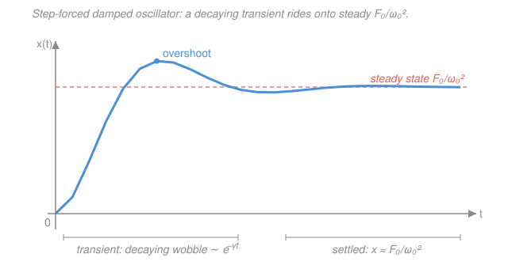

# Mathematical Methods for Physics · Lesson 4.3: The Laplace transform and initial-value problems

> ⏱ ~15 min · Module 4: Integral transforms, distributions & Green's functions · Builds on: [4.2 The Dirac delta and distributions](04-02-dirac-delta-distributions.md), [`ode-refresher` 2.1](../../ode-refresher/lessons/02-01-second-order-constant-coefficient.md) · Unlocks: [4.4 Green's functions for driven linear systems](04-04-greens-functions.md)

## Why this matters

You already know how to solve a driven oscillator — guess a particular solution, add the homogeneous one, then grind through two simultaneous equations to fix the constants from the initial conditions. It works, but it's fiddly, and the guessing gets worse as the forcing gets uglier. The Laplace transform replaces all of it with a recipe: turn the differential equation into an *algebraic* equation, solve for one unknown by hand, and read the answer off a short table. The initial conditions and the forcing walk in the front door automatically — no guessing, no separate step to fix constants. This is the everyday tool for transients in circuits, control systems, and any linear system kicked from rest, and it sets up the Green's function of [4.4](04-04-greens-functions.md) directly.

## The idea

The Fourier transform of [4.1](04-01-fourier-series-transform.md) asked "what frequencies is this signal built from?" and ran over *all* time, $-\infty$ to $\infty$. But physics problems usually start at a definite moment — you release the mass, close the switch, strike the drum at $t=0$ — and you don't care what happened before. The **Laplace transform** is the one-sided cousin built exactly for that: it integrates only from $t=0$ onward, and instead of a pure oscillation $e^{-i k t}$ it uses a *decaying* probe $e^{-st}$ that can capture both wobble and die-off at once.

Here's the whole trick in one breath. Differentiation in the time world becomes *multiplication by $s$* in the transformed world — and multiplication is algebra. So a differential equation, which mixes $x$, $\dot x$, $\ddot x$, turns into a polynomial equation in a single function $F(s)$. You solve that polynomial equation the way you solved for $x$ in high school, then translate back. The genius touch: when derivatives become multiplication, the leftover boundary terms are *exactly the initial values* — so $x(0)$ and $\dot x(0)$ get baked in from the start rather than fitted at the end.

## The formal version

**Definition.** For a function $f(t)$ defined for $t \ge 0$, its Laplace transform is

$$F(s) = \mathcal{L}\{f\}(s) = \int_0^\infty f(t)\,e^{-st}\,\mathrm{d}t,$$

a function of the new variable $s$ (generally complex; take $\operatorname{Re} s$ large enough that the integral converges). *In words: weight $f$ by a decaying exponential and add it all up — the result records how $f$ behaves for every decay rate $s$.* Two entries straight from the definition:

$$\mathcal{L}\{1\} = \int_0^\infty e^{-st}\,\mathrm{d}t = \frac1s, \qquad \mathcal{L}\{e^{at}\} = \int_0^\infty e^{(a-s)t}\,\mathrm{d}t = \frac{1}{s-a}.$$

**The derivative rule (the whole point).** Integrate $\mathcal{L}\{f'\}$ by parts:

$$\mathcal{L}\{f'\} = \int_0^\infty f'(t)e^{-st}\,\mathrm{d}t = \big[f(t)e^{-st}\big]_0^\infty + s\int_0^\infty f(t)e^{-st}\,\mathrm{d}t = sF(s) - f(0).$$

Apply it twice for the second derivative:

$$\boxed{\;\mathcal{L}\{f'\} = sF(s) - f(0), \qquad \mathcal{L}\{f''\} = s^2F(s) - s\,f(0) - f'(0).\;}$$

*In words: each derivative brings down a factor of $s$ and coughs up one initial value.* That is why IVPs solve themselves — the data $f(0), f'(0)$ are *in the equation* the moment you transform.

**A working table.** These cover almost every physics IVP:

| $f(t)$ | $F(s)$ | | $f(t)$ | $F(s)$ |
|---|---|---|---|---|
| $1$ | $1/s$ | | $\sin \omega t$ | $\omega/(s^2+\omega^2)$ |
| $t^n$ | $n!/s^{\,n+1}$ | | $\cos \omega t$ | $s/(s^2+\omega^2)$ |
| $e^{at}$ | $1/(s-a)$ | | $\delta(t)$ | $1$ |
| step $\theta(t)$ | $1/s$ | | $e^{at}f(t)$ | $F(s-a)$ |

The last row is the **shift rule**: multiplying by $e^{at}$ in time just slides $s \to s-a$. It is what turns bare $\sin\omega t$ into the *damped* $e^{-\gamma t}\sin\omega t$ we'll need below. Note $\mathcal{L}\{\delta(t)\} = \int_0^\infty \delta(t)e^{-st}\,\mathrm{d}t = e^{0} = 1$ by the sifting property from [4.2](04-02-dirac-delta-distributions.md) — the impulse transforms to the constant $1$, a fact that becomes the Green's function in [4.4](04-04-greens-functions.md).

**The method.** To solve a linear constant-coefficient ODE:

1. **Transform** the whole equation, using the derivative rule to absorb the initial conditions.
2. **Solve** the resulting algebraic equation for $F(s)$ — pure algebra, one unknown.
3. **Invert** back to $f(t)$: split $F(s)$ by **partial fractions** into table-shaped pieces, then read each off.

**Convolution theorem.** If $F = \mathcal{L}\{f\}$ and $G = \mathcal{L}\{g\}$, then a *product* of transforms is the transform of a *convolution*:

$$\mathcal{L}\{(f * g)(t)\} = F(s)\,G(s), \qquad (f*g)(t) \equiv \int_0^t f(\tau)\,g(t-\tau)\,\mathrm{d}\tau.$$

*In words: multiplying two transforms corresponds to smearing one function against the other in time.* Hold onto this — in [4.4](04-04-greens-functions.md) the response of a system to *any* forcing will be the convolution of the forcing against the system's impulse response, and this theorem is why.

## Picture

## Worked examples

**Example 1 (mechanical — watch the IC fold in).** Solve $y' + 3y = 0$, $y(0) = 2$. Transform, using $\mathcal{L}\{y'\} = sY - y(0)$:

$$\big(sY - 2\big) + 3Y = 0 \;\Longrightarrow\; (s+3)Y = 2 \;\Longrightarrow\; Y = \frac{2}{s+3}.$$

The table's $e^{at} \to 1/(s-a)$ with $a=-3$ gives $y(t) = 2e^{-3t}$. Notice the initial value $2$ appeared as a source term in the algebra — we never solved for a constant afterward. That is the whole labor-saving idea, on the smallest possible equation.

**Example 2 (why you'd care — a damped oscillator switched on).** A damped oscillator sitting at rest is hit with a constant force at $t=0$:

$$\ddot x + 2\dot x + 5x = 5, \qquad x(0) = 0,\; \dot x(0) = 0.$$

(Here $2\gamma = 2$ so $\gamma = 1$, and $\omega_0^2 = 5$.) Transform every term; with both initial values zero, $\mathcal{L}\{\ddot x\} = s^2X$ and $\mathcal{L}\{\dot x\} = sX$, and the step force $5$ transforms to $5/s$:

$$(s^2 + 2s + 5)\,X = \frac{5}{s} \;\Longrightarrow\; X(s) = \frac{5}{s\,(s^2 + 2s + 5)}.$$

**Partial fractions.** Write $\dfrac{5}{s(s^2+2s+5)} = \dfrac{A}{s} + \dfrac{Bs + C}{s^2 + 2s + 5}$. Clearing denominators, $5 = A(s^2+2s+5) + (Bs+C)s$. Match powers of $s$: the constant term gives $5 = 5A$, so $A = 1$; the $s^2$ term gives $0 = A + B$, so $B = -1$; the $s^1$ term gives $0 = 2A + C$, so $C = -2$. Thus

$$X(s) = \frac{1}{s} - \frac{s+2}{s^2 + 2s + 5}.$$

**Invert.** Complete the square in the denominator: $s^2 + 2s + 5 = (s+1)^2 + 2^2$, so the damped frequency is $\omega_d = 2$. Rewrite the numerator around the shifted variable $s+1$:

$$\frac{s+2}{(s+1)^2 + 2^2} = \frac{(s+1)}{(s+1)^2 + 2^2} + \frac{1}{(s+1)^2+2^2}.$$

By the shift rule ($s \to s+1$, i.e. multiply the inverse by $e^{-t}$) applied to the $\cos$ and $\sin$ table rows, the first piece inverts to $e^{-t}\cos 2t$ and the second — after supplying the missing factor $\omega_d = 2$ — to $\tfrac12 e^{-t}\sin 2t$. Therefore

$$\boxed{\,x(t) = \underbrace{1}_{\text{steady}} - \underbrace{e^{-t}\Big(\cos 2t + \tfrac12 \sin 2t\Big)}_{\text{transient}}.}$$

Read the physics straight off the **poles** of $X(s)$ — the values of $s$ where the denominator vanishes:

- **Pole at $s = 0$** (from the forcing's $1/s$) → the constant **steady state** $x_\infty = 1 = F_0/\omega_0^2$, the displacement the force eventually holds it at.
- **Poles at $s = -1 \pm 2i$** (from $s^2+2s+5$) → the **transient**. Their real part $-\gamma = -1$ is the decay rate $e^{-t}$; their imaginary part $\pm\omega_d = \pm 2$ is the ringing frequency $\cos 2t,\ \sin 2t$.

The transient overshoots to $x \approx 1.21$ near $t \approx 1.5$, then rings down and settles onto the steady line — exactly the curve in the Picture. Sanity checks: $x(0) = 1 - (1+0) = 0$ ✓, and as $t \to \infty$ the exponential kills the transient so $x \to 1 = F_0/\omega_0^2$ ✓. Contrast this with the guessing method: here the split into transient + steady, the decay rate, the frequency, and the initial-condition fit *all* fell out of factoring one rational function.

## Watch out

- **You might drop the initial-value terms.** $\mathcal{L}\{f''\} = s^2F - s\,f(0) - f'(0)$, **not** $s^2F$. The $-s\,f(0)$ and $-f'(0)$ are the whole reason Laplace handles IVPs; forget them and you've silently solved the *zero* initial-condition problem. (In Example 2 they vanished only because the oscillator started from rest.)
- **You might mismatch a $\sin$ table entry.** $\mathcal{L}\{\sin\omega t\} = \omega/(s^2+\omega^2)$ carries an $\omega$ in the **numerator**. When you invert $1/[(s+1)^2 + 4]$ you must insert $\tfrac1{\omega_d} = \tfrac12$ to build the exact table shape — that stray factor is a classic sign/scale slip.
- **You might expect Fourier's two-sided symmetry.** Laplace runs only over $t \ge 0$, so there is no "negative-time" content and no requirement that $f$ be bounded — it happily transforms growing functions like $e^{2t}$ (just $1/(s-2)$, valid for $\operatorname{Re} s > 2$). That one-sidedness is a feature: it is why initial conditions, not boundary conditions at $\pm\infty$, are the natural data.

## One-liner

> Transform the ODE so derivatives become multiplication by $s$ (dragging the initial conditions in for free), solve the resulting algebra for $F(s)$, and the poles of $F(s)$ hand you the decay rates and frequencies — real part is how fast it dies, imaginary part is how fast it rings.

## Problems

**P1 (🟢)** Solve the general first-order decay IVP $y' + a y = 0$, $y(0) = y_0$ (with $a > 0$ constant) by Laplace transform.

**P2 (🟡)** Invert $F(s) = \dfrac{s+3}{(s+1)(s+2)}$ by partial fractions to recover $f(t)$.

**P3 (🔴, optional)** Solve the *undamped* driven oscillator $\ddot x + \omega_0^2 x = F_0$ (constant step force), $x(0) = 0$, $\dot x(0) = 0$, by Laplace. Interpret the result in light of Example 2: what happened to the transient, and why, in terms of the poles?

Solutions

**P1** Transform, using $\mathcal{L}\{y'\} = sY - y(0) = sY - y_0$:

$$(sY - y_0) + aY = 0 \;\Longrightarrow\; (s+a)Y = y_0 \;\Longrightarrow\; Y = \frac{y_0}{s+a}.$$

The table row $e^{\alpha t} \to 1/(s-\alpha)$ with $\alpha = -a$ gives

$$y(t) = y_0\,e^{-at}.$$

*Check.* $y(0) = y_0$ ✓; $a > 0$ means decay, as a relaxation problem should. The single pole at $s = -a$ has real part $-a$, i.e. decay rate $a$ — consistent with the exponent. ✓

**P2** Partial fractions: $\dfrac{s+3}{(s+1)(s+2)} = \dfrac{A}{s+1} + \dfrac{B}{s+2}$. Cover-up (multiply by a factor and set $s$ to its root):

$$A = \left.\frac{s+3}{s+2}\right|_{s=-1} = \frac{2}{1} = 2, \qquad B = \left.\frac{s+3}{s+1}\right|_{s=-2} = \frac{1}{-1} = -1.$$

So $F(s) = \dfrac{2}{s+1} - \dfrac{1}{s+2}$, and inverting each row,

$$f(t) = 2e^{-t} - e^{-2t}.$$

*Check.* Initial-value theorem: $f(0^+) = \lim_{s\to\infty} sF(s) = \lim_{s\to\infty} \frac{s(s+3)}{(s+1)(s+2)} = 1$, and directly $f(0) = 2 - 1 = 1$ ✓. Both terms decay, matching poles at $s = -1, -2$. ✓

**P3** With $x(0) = \dot x(0) = 0$, transform: $(s^2 + \omega_0^2)X = F_0/s$, so

$$X(s) = \frac{F_0}{s(s^2 + \omega_0^2)} = \frac{F_0}{\omega_0^2}\left(\frac{1}{s} - \frac{s}{s^2+\omega_0^2}\right),$$

using $\dfrac{1}{s(s^2+\omega_0^2)} = \dfrac{1}{\omega_0^2}\left(\dfrac1s - \dfrac{s}{s^2+\omega_0^2}\right)$ (partial fractions, or just verify by combining). Inverting with $1 \to 1/s$ and $\cos\omega_0 t \to s/(s^2+\omega_0^2)$:

$$x(t) = \frac{F_0}{\omega_0^2}\big(1 - \cos\omega_0 t\big).$$

*Interpretation.* With no damping ($\gamma = 0$), the "transient" poles sit at $s = \pm i\omega_0$ — **purely imaginary, zero real part**, so nothing decays. The oscillation about the steady value $F_0/\omega_0^2$ persists forever, swinging between $0$ and $2F_0/\omega_0^2$. Example 2's damping ($\gamma = 1$) pushed those poles to $s = -1 \pm 2i$, giving them a negative real part and turning the everlasting ring into a dying transient.

*Check.* $x(0) = \frac{F_0}{\omega_0^2}(1-1) = 0$ ✓; $\dot x(0) = \frac{F_0}{\omega_0^2}\omega_0\sin 0 = 0$ ✓; the time-average of $x$ is $F_0/\omega_0^2$, the static displacement the force alone would produce. ✓

## Flashback

**From Lesson 4.2 (The Dirac delta and distributions):** Evaluate $\displaystyle\int_{-\infty}^{\infty} (3t^2 - 1)\,\delta(t - 2)\,\mathrm{d}t$.

Solution

The sifting property picks out the value of the smooth factor at the spike location $t = 2$:

$$\int_{-\infty}^{\infty} (3t^2 - 1)\,\delta(t - 2)\,\mathrm{d}t = 3(2)^2 - 1 = 11.$$

*Check / bridge.* This is exactly the mechanism behind today's table entry for a shifted impulse: $\mathcal{L}\{\delta(t-a)\} = \int_0^\infty e^{-st}\delta(t-a)\,\mathrm{d}t = e^{-as}$ — the sifting property evaluates the smooth factor $e^{-st}$ at $t=a$. The delta doesn't integrate; it *samples*. ✓

## Connections

- **Backward:** the impulse's transform $\mathcal{L}\{\delta(t)\} = 1$ rests directly on the sifting property from [4.2](04-02-dirac-delta-distributions.md), and the derivative rule reuses integration by parts from [`calc-refresher`](../../calc-refresher/syllabus.md). The oscillator being solved is the damped–driven equation whose homogeneous version you met as complex roots in [`ode-refresher` 2.1](../../ode-refresher/lessons/02-01-second-order-constant-coefficient.md) — Laplace just reaches the same solution without splitting into homogeneous + particular.
- **Forward:** [4.4 Green's functions](04-04-greens-functions.md) feeds the *impulse* $\delta(t)$ through this same machinery ($\mathcal{L}\{\delta\}=1$) to get the system's impulse response, then uses the convolution theorem to write the response to *any* forcing as $x = \int G(t-t')f(t')\,\mathrm{d}t'$ — the boss problem for this module.
- **Sideways (complex analysis):** the poles of $F(s)$ that gave us decay rates and frequencies are the same poles-and-residues machinery from [Module 2](02-03-singularities-laurent-residues.md). Inverting the transform is formally the **Bromwich integral** $f(t) = \frac{1}{2\pi i}\int_{c-i\infty}^{c+i\infty} F(s)e^{st}\,\mathrm{d}s$, a contour running up the complex $s$-plane; closing it and summing residues at the poles reproduces exactly the partial-fraction terms we read off the table — see [`complex-analysis`](../../complex-analysis/syllabus.md).
