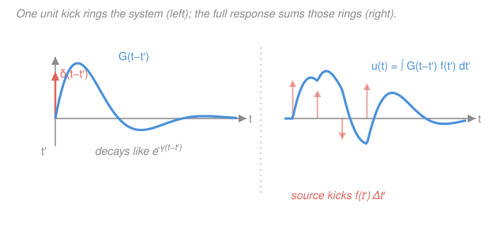

# Mathematical Methods for Physics · Lesson 4.4: Green's functions for driven linear systems

> ⏱ ~15 min · Module 4: Integral transforms, distributions & Green's functions · Builds on: [4.3 The Laplace transform and initial-value problems](04-03-laplace-transform-ivp.md), [4.2 The Dirac delta and distributions](04-02-dirac-delta-distributions.md) · Unlocks: [5.1 Calculus of variations and the Euler–Lagrange equation](05-01-calculus-of-variations-euler-lagrange.md)

## Why this matters

You have a linear system — a driven oscillator, a heated rod, a charge distribution — and a source pushing on it: $L\,u = f$. You could re-solve the differential equation from scratch for every new source $f$. Or you could solve it **once**, for the simplest possible source — a single point kick — and then get the answer for *any* $f$ by adding up kicks. That once-and-for-all solution is the **Green's function**, and it turns "solve a differential equation" into "do an integral." It is how physicists get the potential of an arbitrary charge distribution from the potential of one point charge, and how you get a driven oscillator's motion from its response to one sharp tap.

## The idea

Here is the whole trick in one breath. Your operator $L$ is **linear**, so if you know its response to each piece of the source, the total response is the sum of the pieces. And the Dirac delta from [4.2](04-02-dirac-delta-distributions.md) lets you chop *any* source into pieces: the sifting property says

$$f(x) = \int f(x')\,\delta(x - x')\,\mathrm{d}x',$$

which reads "$f$ is a continuous pile of point sources, one at each location $x'$, each with weight $f(x')$." So if you can solve $L\,u = \delta(x-x')$ — the response to a *single unit point source at $x'$* — you can get the response to $f$ by superposing those responses with weights $f(x')$.

Call that single-source solution $G(x, x')$: the **Green's function**. Then the solution to $L\,u = f$ is just

$$u(x) = \int G(x, x')\,f(x')\,\mathrm{d}x'.$$

**In words: $G$ is the system's response to a unit kick at $x'$; the full response is all the kicks summed, each weighted by how hard the source pushes there.** $G$ is essentially the *inverse* of the operator $L$: where $L$ turns $u$ into $f$, integrating against $G$ turns $f$ back into $u$. The differential equation is solved once, forever, and reused by quadrature.

## The formal version

Let $L$ be a linear differential operator (in $x$, or in $t$). The **Green's function** $G(x,x')$ is defined by

$$L\,G(x, x') = \delta(x - x'),$$

with $L$ acting on the first argument $x$, plus enough **boundary or initial conditions** to make $G$ unique. *In words: $G$ is what the system does when poked at the single point $x'$.*

**Superposition gives the solution.** Apply $L$ to the proposed $u(x) = \int G(x,x')f(x')\,\mathrm{d}x'$. Because $L$ acts on $x$ and the integral is over $x'$, we can pull $L$ inside:

$$L\,u(x) = \int \underbrace{L\,G(x,x')}_{=\,\delta(x-x')}\,f(x')\,\mathrm{d}x' = \int \delta(x-x')\,f(x')\,\mathrm{d}x' = f(x). \checkmark$$

So $u$ genuinely solves $L\,u = f$. *In words: applying $L$ collapses each Green's function back to the delta that made it, and the sifting property reassembles $f$.*

**The boundary/initial conditions select which $G$.** The equation $LG=\delta$ alone has many solutions (you can always add a homogeneous solution $Lv=0$). What pins $G$ down is the physics:

- **Boundary-value problems** (a rod on $[0,L]$, a field in a box): impose the *homogeneous* version of $u$'s boundary conditions on $G$ — e.g. $G=0$ at both ends for Dirichlet data. Then $u=\int G f$ automatically satisfies them.
- **Initial-value / time problems** (a driven oscillator): impose **causality** — the system cannot respond before it is kicked, so $G(t,t') = 0$ for $t < t'$. The effect follows the cause.

**Time-translation invariance.** If $L$ has constant coefficients in $t$, kicking at $t'$ gives the same shape as kicking at $0$, only shifted: $G(t,t') = G(t-t')$. Then the superposition becomes a genuine **convolution**,

$$u(t) = \int_{-\infty}^{\infty} G(t-t')\,f(t')\,\mathrm{d}t' = (G * f)(t),$$

the same convolution you met in [4.3](04-03-laplace-transform-ivp.md) — there the convolution theorem was an inversion trick; here it *is* the solution, and $G$ is the impulse response whose transform is the transfer function.

## Picture

## Worked examples

**Example 1 — the driven damped oscillator (Boss problem 4).** This is the workhorse. Take

$$\ddot{x} + 2\gamma\dot{x} + \omega_0^2\,x = f(t), \qquad L = \frac{\mathrm{d}^2}{\mathrm{d}t^2} + 2\gamma\frac{\mathrm{d}}{\mathrm{d}t} + \omega_0^2,$$

with damping rate $\gamma > 0$ and natural frequency $\omega_0$. We build $G$, then convolve.

*Step 1 — solve for the unit kick.* With time-translation invariance, set $t'=0$ and write $\tau = t$ for now; $G(\tau)$ solves

$$\ddot{G} + 2\gamma\dot{G} + \omega_0^2\,G = \delta(\tau), \qquad G(\tau) = 0 \text{ for } \tau < 0 \ \ (\text{causality}).$$

*Step 2 — jump conditions from the delta.* For $\tau \neq 0$ the right side is zero, so $G$ solves the homogeneous equation. The delta lives at $\tau=0$; integrate the ODE across a sliver $[-\epsilon, \epsilon]$. The $\omega_0^2 G$ term integrates to $0$ (it is finite), and $\int \ddot G = [\dot G]$, $\int 2\gamma\dot G = 2\gamma[G]$:

$$\big[\dot G\big]_{0^-}^{0^+} + 2\gamma\big[G\big]_{0^-}^{0^+} = 1.$$

$G$ itself must be **continuous** at $0$ (a jump in $G$ would make $\dot G$ a delta and $\ddot G$ a delta', too singular for a plain $\delta$ source), so $G(0^+)=G(0^-)=0$ and the $2\gamma[G]$ term drops. That leaves

$$G(0^+) = 0, \qquad \dot G(0^+) = 1.$$

*In words: a unit impulse leaves the position unmoved but instantly hands the oscillator one unit of velocity* — exactly the "impulse = change in momentum" you know from mechanics.

*Step 3 — solve the homogeneous ODE with those data (underdamped, $\gamma < \omega_0$).* The characteristic roots are $r = -\gamma \pm i\omega_d$ with the **damped frequency**

$$\omega_d = \sqrt{\omega_0^2 - \gamma^2}.$$

So for $\tau > 0$, $G(\tau) = e^{-\gamma\tau}\big(A\cos\omega_d\tau + B\sin\omega_d\tau\big)$. The condition $G(0^+)=0$ kills $A$. Differentiating, $\dot G(0^+) = B\omega_d = 1$, so $B = 1/\omega_d$. Reinstating the general kick time via $\tau = t-t'$ and the causal switch $H$ (the Heaviside step):

$$\boxed{\,G(t-t') = \frac{1}{\omega_d}\,e^{-\gamma(t-t')}\sin\!\big(\omega_d(t-t')\big)\,H(t-t')\,}$$

This is the blue curve in the figure: kick it, and it rings at $\omega_d$ while decaying at rate $\gamma$. Setting $\gamma\to 0$ recovers $G = \sin(\omega_0\tau)/\omega_0$, the undamped [SHM](../../mechanics-refresher/lessons/03-01-simple-harmonic-motion.md) impulse response — a ring that never dies.

*Step 4 — the general solution is a convolution.* Because $G$ vanishes for $t'>t$ (causality), the upper limit collapses to $t$:

$$x(t) = \int_{-\infty}^{\infty} G(t-t')\,f(t')\,\mathrm{d}t' = \int_{-\infty}^{t} \frac{1}{\omega_d}\,e^{-\gamma(t-t')}\sin\!\big(\omega_d(t-t')\big)\,f(t')\,\mathrm{d}t'.$$

Every past kick $f(t')$ contributes a ring; the present motion is their sum.

**Example 2 — verify against the Laplace step response.** Take a step force switched on at $t=0$ from rest: $f(t)=F_0 H(t)$, with $x(0)=\dot x(0)=0$. Two independent routes must agree.

*Green's route.* Substitute $\tau = t-t'$:

$$x(t) = \frac{F_0}{\omega_d}\int_0^t e^{-\gamma\tau}\sin(\omega_d\tau)\,\mathrm{d}\tau.$$

Using $\int_0^t e^{-\gamma\tau}\sin\omega_d\tau\,\mathrm{d}\tau = \dfrac{\omega_d - e^{-\gamma t}(\gamma\sin\omega_d t + \omega_d\cos\omega_d t)}{\gamma^2+\omega_d^2}$ and $\gamma^2+\omega_d^2=\omega_0^2$,

$$x(t) = \frac{F_0}{\omega_0^2}\left[\,1 - e^{-\gamma t}\!\left(\cos\omega_d t + \frac{\gamma}{\omega_d}\sin\omega_d t\right)\right].$$

*Laplace route (from [4.3](04-03-laplace-transform-ivp.md)).* Transforming with zero initial data, $(s^2+2\gamma s+\omega_0^2)X(s) = F_0/s$, so $X(s) = \dfrac{F_0}{s(s^2+2\gamma s+\omega_0^2)}$. Partial fractions give

$$X(s) = \frac{F_0}{\omega_0^2}\left[\frac{1}{s} - \frac{(s+\gamma)+\gamma}{(s+\gamma)^2+\omega_d^2}\right],$$

and inverting term by term (the shift $e^{-\gamma t}$ from $s\to s+\gamma$) reproduces **exactly** the boxed $x(t)$ above. The two methods agree — as they must, since convolving with $G$ *is* the inverse-Laplace operation done in the time domain. The steady state is $x(\infty) = F_0/\omega_0^2$ (the static deflection); the transient rings down at rate $\gamma$.

**Frequency-domain view (poles set resonance).** Fourier-transform $L\,x=f$ using derivative $\to i\omega$ multiplication (from [4.1](04-01-fourier-series-transform.md)): $(-\omega^2 + 2i\gamma\omega + \omega_0^2)\tilde x(\omega) = \tilde f(\omega)$. So $\tilde x = \tilde G\,\tilde f$ with the **transfer function**

$$\tilde G(\omega) = \frac{1}{-\omega^2 + 2i\gamma\omega + \omega_0^2}.$$

This is the Fourier transform of the impulse response $G$ — the convolution theorem again. Its **poles** sit where the denominator vanishes, $\omega = i\gamma \pm \omega_d$: a small damping $\gamma$ puts them just above the real axis near $\pm\omega_d$, and driving at that frequency makes $|\tilde G|$ blow up — **resonance**. Those poles are exactly the residue machinery of [Module 2](02-02-contour-integrals-cauchy-theorem.md) and the Laplace poles of [4.3](04-03-laplace-transform-ivp.md): inverting $\tilde G$ by closing a contour picks up $e^{(-\gamma\pm i\omega_d)t}$, rebuilding the decaying ring.

## Watch out

- **You might think the Green's function is one fixed function of $L$.** It is not — $LG=\delta$ has infinitely many solutions until you impose conditions. The *causal* $G$ (used above) and the *retarded/advanced* choices in electrodynamics solve the same equation with different boundary data. Always state the conditions.
- **You might forget the continuity-plus-jump bookkeeping.** For a second-order operator, $G$ is **continuous** at the source but its **first derivative jumps** by $1/(\text{coefficient of the highest derivative})$. Get that jump wrong and your $G$ solves $LG = c\,\delta$ for the wrong $c$.
- **You might drop the causal $H(t-t')$ and integrate over all $t'$.** Then future kicks would influence the present. For time problems the step function is not decoration — it *is* causality, and it is what cuts the convolution's upper limit down to $t$.

## One-liner

> Solve the system once for a unit kick — $LG=\delta$ with the right boundary/causal conditions — and every source's response is the kicks summed: $u=\int G f$, with $G$ the inverse of $L$.

## Problems

**P1 (🟢)** Build the Green's function for $L = -\dfrac{\mathrm{d}^2}{\mathrm{d}x^2}$ on $[0,L]$ with Dirichlet conditions $G(0,x')=G(L,x')=0$. That is, solve $-G'' = \delta(x-x')$ with those endpoints. (Hint: $G$ is piecewise linear, continuous at $x'$, with $G'$ jumping by $-1$ there.)

**P2 (🟡)** Verify that the oscillator Green's function $G(\tau) = \frac{1}{\omega_d}e^{-\gamma\tau}\sin(\omega_d\tau)$ (for $\tau>0$) satisfies the homogeneous equation $\ddot G + 2\gamma\dot G + \omega_0^2 G = 0$ for $\tau>0$, and check the jump conditions $G(0^+)=0$, $\dot G(0^+)=1$. Conclude it solves $LG=\delta(\tau)$.

**P3 (🔴, optional)** Use the causal oscillator $G$ to find the response to a single sharp pulse $f(t)=I_0\,\delta(t-t_0)$ (an impulse of strength $I_0$ delivered at time $t_0$), from rest. Interpret the answer physically.

Solutions

**P1** Away from $x'$, $-G''=0$ so $G$ is linear on each side. With $G(0)=0$ and $G(L)=0$:

$$G(x,x') = \begin{cases} a\,x, & 0 \le x \le x', \\ b\,(L-x), & x' \le x \le L. \end{cases}$$

Continuity at $x'$: $a\,x' = b\,(L-x')$. The jump: integrate $-G''=\delta$ across $x'$ to get $-[G']_{x'^-}^{x'^+} = 1$, i.e. $G'(x'^+) - G'(x'^-) = -1$. Here $G'(x'^-)=a$ and $G'(x'^+)=-b$, so $-b - a = -1 \Rightarrow a+b=1$. Solving with $a x' = b(L-x')$: $a = (L-x')/L$, $b = x'/L$. Hence

$$G(x,x') = \begin{cases} \dfrac{(L-x')\,x}{L}, & x \le x', \\[4pt] \dfrac{x'\,(L-x)}{L}, & x \ge x'. \end{cases}$$

*Check.* Symmetric under $x \leftrightarrow x'$ (as a self-adjoint $L$ demands), continuous at $x=x'$ (both branches give $x'(L-x')/L$), zero at both ends, and it is the tent-shaped static deflection of a string pinned at the ends and pulled at $x'$ — physically exactly right. ✓

**P2** For $\tau>0$, write $G = \frac{1}{\omega_d}e^{-\gamma\tau}\sin\omega_d\tau$. Differentiate:

$$\dot G = \frac{1}{\omega_d}e^{-\gamma\tau}\big(-\gamma\sin\omega_d\tau + \omega_d\cos\omega_d\tau\big),$$
$$\ddot G = \frac{1}{\omega_d}e^{-\gamma\tau}\big((\gamma^2-\omega_d^2)\sin\omega_d\tau - 2\gamma\omega_d\cos\omega_d\tau\big).$$

Then $\ddot G + 2\gamma\dot G + \omega_0^2 G$. The cosine terms: $-2\gamma\omega_d + 2\gamma\omega_d = 0$. The sine terms (times $\frac{1}{\omega_d}e^{-\gamma\tau}$): $(\gamma^2-\omega_d^2) - 2\gamma^2 + \omega_0^2 = -\gamma^2 - \omega_d^2 + \omega_0^2 = 0$, since $\omega_d^2 = \omega_0^2-\gamma^2$. So the sum is $0$. ✓ At $\tau=0^+$: $G(0^+)=\frac{1}{\omega_d}\cdot 1\cdot 0 = 0$, and $\dot G(0^+) = \frac{1}{\omega_d}\cdot 1\cdot(0 + \omega_d) = 1$. ✓ A function that solves the homogeneous equation for $\tau>0$, is continuous with $G(0)=0$, and has $\dot G$ jumping by $1$ at the origin is precisely a solution of $LG=\delta(\tau)$ (the jump manufactures the delta).

*Check.* Limit $\gamma\to 0$: $G\to \sin(\omega_0\tau)/\omega_0$, the undamped impulse response — and $\ddot G + \omega_0^2 G = 0$ trivially. ✓

**P3** Convolve:

$$x(t) = \int_{-\infty}^{t} G(t-t')\,I_0\,\delta(t'-t_0)\,\mathrm{d}t' = I_0\,G(t-t_0),$$

by the sifting property (valid once $t>t_0$; zero before). Explicitly, for $t>t_0$,

$$x(t) = \frac{I_0}{\omega_d}\,e^{-\gamma(t-t_0)}\sin\!\big(\omega_d(t-t_0)\big).$$

*Interpretation:* a single sharp impulse just **is** a scaled, time-shifted copy of the Green's function — the oscillator gets kicked at $t_0$, jumps to velocity $I_0$ with zero displacement, then rings down. This is why $G$ is called the impulse response: feed it an impulse and it hands back itself.

*Check.* At $t=t_0^+$: $x=0$ (position unmoved by an instantaneous kick) and $\dot x = I_0$ (velocity jumps by the impulse strength), matching the jump conditions with weight $I_0$. Units: $[I_0]$ has velocity units for this equation, and $G$ has units of time, so $I_0 G$ has units of length. ✓

## Flashback

**From Lesson 4.3 (The Laplace transform and initial-value problems):** Solve $\ddot{x} + 3\dot{x} + 2x = 0$ with $x(0)=1$, $\dot x(0)=0$ by Laplace transform. (Fresh variant — a homogeneous, overdamped case, no forcing.)

Solution

Transform, using $\mathcal{L}\{\ddot x\} = s^2 X - s\,x(0) - \dot x(0)$ and $\mathcal{L}\{\dot x\} = sX - x(0)$:

$$\big(s^2 X - s\big) + 3\big(sX - 1\big) + 2X = 0 \;\Longrightarrow\; (s^2+3s+2)X = s+3.$$

Factor $s^2+3s+2=(s+1)(s+2)$ and split by partial fractions:

$$X(s) = \frac{s+3}{(s+1)(s+2)} = \frac{2}{s+1} - \frac{1}{s+2}.$$

(Cover-up: at $s=-1$, $(s+3)/(s+2)=2$; at $s=-2$, $(s+3)/(s+1)=-1$.) Inverting each simple pole $1/(s+a)\to e^{-at}$:

$$x(t) = 2e^{-t} - e^{-2t}.$$

*Check.* $x(0) = 2-1 = 1$ ✓. $\dot x = -2e^{-t}+2e^{-2t}$, so $\dot x(0) = -2+2 = 0$ ✓. Both roots $-1,-2$ are real and negative (overdamped, since here the "damping" $3/2 > \sqrt{2}$), so no oscillation — pure decay, as expected. ✓

## Connections

- **Backward:** this lesson fuses [4.2](04-02-dirac-delta-distributions.md)'s delta (which chops the source into point kicks via sifting) with [4.3](04-03-laplace-transform-ivp.md)'s convolution (which sums the responses). The transfer function $\tilde G(\omega)$ and its poles are the residue calculus of [Module 2](02-02-contour-integrals-cauchy-theorem.md), and the undamped limit is the [SHM](../../mechanics-refresher/lessons/03-01-simple-harmonic-motion.md) ring.
- **Forward:** [5.1 Calculus of variations](05-01-calculus-of-variations-euler-lagrange.md) turns to a different way of packaging physics — extremizing a functional — but the linear-operator-plus-boundary-conditions structure returns there in the Euler–Lagrange equation and its self-adjoint (Sturm–Liouville) operators, whose Green's functions diagonalize in eigenmodes.
- **Sideways:** Green's functions recur everywhere. In [`em-refresher`](../../em-refresher/syllabus.md) the potential of an arbitrary charge/current source is $\int G\rho$ with $G=1/(4\pi\varepsilon_0|\mathbf{r}-\mathbf{r}'|)$ — the point-charge potential, literally a Green's function of $-\nabla^2$. In [`quantum-mechanics`](../../quantum-mechanics/syllabus.md) the same object is the **propagator**, the amplitude to go from $x'$ to $x$. And in [`pdes`](../../pdes/syllabus.md) it is the standard tool for solving the heat, wave, and Poisson equations with sources.
