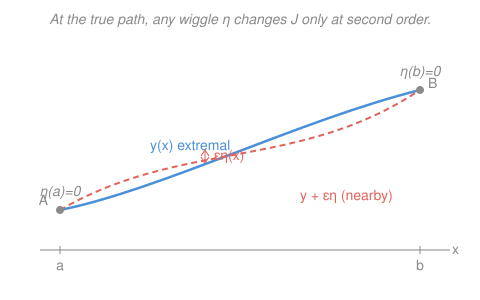

# Mathematical Methods for Physics · Lesson 5.1: Calculus of variations and the Euler–Lagrange equation

> ⏱ ~15 min · Module 5: Variational methods & symmetry · Builds on: [4.4 Green's functions for driven linear systems](04-04-greens-functions.md) · Unlocks: [5.2 Constraints and variational estimates](05-02-constraints-variational-estimates.md)

## Why this matters

Nature is lazy in a very precise way. Light takes the fastest route between two points; a hanging chain settles into the shape that minimizes its energy; a free particle coasts along the path that extremizes a quantity called the *action*. In every case the unknown is not a *number* but an entire *curve* — the shape of a path, a profile, a trajectory — and the rule that picks it out is "make some integral as small (or as stationary) as possible." The calculus of variations is the machine for solving exactly that class of problem, and its output, the **Euler–Lagrange equation**, is the single most reused equation in theoretical physics: set it up once and you have geometry (geodesics), optics (Fermat), and all of mechanics (Lagrange) in one stroke.

## The idea

Ordinary calculus finds where a *function* is stationary: to minimize $f(x)$ you nudge $x$ and demand $f'(x)=0$ — the value doesn't change to first order. Variational calculus does the same thing one level up. The object you feed in is now a whole function $y(x)$; the number you get out is an integral over it. A rule that eats a function and returns a number is a **functional**, written with square brackets:

$$J[y] = \int_a^b L\big(x,\,y(x),\,y'(x)\big)\,\mathrm{d}x.$$

*In words: pick any curve $y$ running from $x=a$ to $x=b$, and $J$ scores it with a single number by summing up a local density $L$ along it.* Here $L$ (the **Lagrangian**, or integrand) is a plain function of three ordinary variables: the position $x$, the height $y$, and the slope $y'=\mathrm{d}y/\mathrm{d}x$. A functional maps a function to a number; contrast an ordinary function, which maps a number to a number.

To extremize $J$, mimic $f'(x)=0$. Hold the endpoints pinned (they're given: the curve must start at $A$ and end at $B$) and wiggle the curve in the middle:

$$y(x) \longrightarrow y(x) + \varepsilon\,\eta(x), \qquad \eta(a)=\eta(b)=0.$$

Here $\eta(x)$ is any smooth "wiggle" shape that vanishes at both ends (so the endpoints stay fixed), and $\varepsilon$ is a small dial controlling its size. Plugging this in makes $J$ a plain function of the single number $\varepsilon$. The true extremal is the curve for which *no* wiggle changes $J$ to first order:

$$\left.\frac{\mathrm{d}J}{\mathrm{d}\varepsilon}\right|_{\varepsilon=0} = 0 \quad\text{for every allowed }\eta.$$

That derivative is called the **first variation**. Demanding it vanish, for *all* wiggles at once, is what turns an infinite search over curves into a single differential equation.

## The formal version

Differentiate $J[y+\varepsilon\eta]$ under the integral sign and set $\varepsilon=0$. Since $\partial y/\partial\varepsilon=\eta$ and $\partial y'/\partial\varepsilon=\eta'$, the chain rule gives

$$\left.\frac{\mathrm{d}J}{\mathrm{d}\varepsilon}\right|_{\varepsilon=0} = \int_a^b\!\left(\frac{\partial L}{\partial y}\,\eta + \frac{\partial L}{\partial y'}\,\eta'\right)\mathrm{d}x = 0.$$

The second term carries $\eta'$, but we want a statement about $\eta$ alone. Integrate it by parts, throwing the derivative off $\eta'$ and onto the $\partial L/\partial y'$ factor:

$$\int_a^b \frac{\partial L}{\partial y'}\,\eta'\,\mathrm{d}x = \underbrace{\left[\frac{\partial L}{\partial y'}\,\eta\right]_a^b}_{=\,0} - \int_a^b \frac{\mathrm{d}}{\mathrm{d}x}\!\left(\frac{\partial L}{\partial y'}\right)\eta\,\mathrm{d}x.$$

The boundary term dies because $\eta(a)=\eta(b)=0$ — this is exactly why we pinned the wiggle at the ends. What remains is

$$\int_a^b\!\left(\frac{\partial L}{\partial y} - \frac{\mathrm{d}}{\mathrm{d}x}\frac{\partial L}{\partial y'}\right)\eta(x)\,\mathrm{d}x = 0 \quad\text{for every }\eta.$$

Now the **fundamental lemma** finishes it: if a continuous function multiplied by *every* vanishing-endpoint $\eta$ integrates to zero, that function must itself be zero everywhere (otherwise choose an $\eta$ bumped up right where it's nonzero and the integral wouldn't vanish). Therefore the bracket vanishes pointwise:

$$\boxed{\;\frac{\mathrm{d}}{\mathrm{d}x}\!\left(\frac{\partial L}{\partial y'}\right) - \frac{\partial L}{\partial y} = 0\;}$$

*In words: this is the condition a path must satisfy at every point to make $J$ stationary.* It's the **Euler–Lagrange (EL) equation** — an ordinary differential equation for the extremal $y(x)$. Note $\partial L/\partial y$ and $\partial L/\partial y'$ treat $x,y,y'$ as independent slots; the $\mathrm{d}/\mathrm{d}x$ is then a *total* derivative that does see $y(x)$ and $y'(x)$ vary with $x$.

**The Beltrami identity (a free first integral).** Often $L$ depends on $y$ and $y'$ but *not explicitly on $x$* (the integrand looks the same at every station along the axis). Then EL has an immediate first integral. Compute $\mathrm{d}L/\mathrm{d}x$ by the chain rule, use EL to substitute, and everything collapses to

$$\boxed{\;L - y'\,\frac{\partial L}{\partial y'} = \text{const}\;}\qquad(\text{when }\partial L/\partial x = 0).$$

*In words: when the setup has no preferred location along $x$, a certain combination stays constant all along the extremal — a conserved quantity.* This is the variational ancestor of energy conservation, and it drops the order of the problem by one, which is what makes the hard examples tractable. (We'll see in [5.3](05-03-groups-symmetry.md) that "$L$ doesn't depend on $x$ $\Rightarrow$ something is conserved" is a baby case of Noether's theorem: a symmetry — here invariance under sliding along $x$ — buys you a conservation law.)

## Picture

The blue curve is the extremal; the dashed coral curve is one competitor $y+\varepsilon\eta$. All competitors are pinned to $A$ and $B$ ($\eta=0$ there). "Stationary" means: along the blue curve, *every* such nudge leaves $J$ unchanged to first order in $\varepsilon$.

## Worked examples

**Example 1 (the shortest path is a straight line).** The length of a curve $y(x)$ from $A=(a,y_a)$ to $B=(b,y_b)$ is $J[y]=\int_a^b \sqrt{1+y'^2}\,\mathrm{d}x$, so $L=\sqrt{1+y'^2}$. It has no $y$ and no explicit $x$. Then

$$\frac{\partial L}{\partial y}=0, \qquad \frac{\partial L}{\partial y'}=\frac{y'}{\sqrt{1+y'^2}}.$$

EL says $\dfrac{\mathrm{d}}{\mathrm{d}x}\dfrac{y'}{\sqrt{1+y'^2}}=0$, so $\dfrac{y'}{\sqrt{1+y'^2}}=\text{const}$. That forces $y'=\text{const}$, i.e. $y(x)=mx+c$ — a **straight line**. The single most obvious fact in geometry, delivered by the machine. (When $L$ is free of $y$, EL always reduces to "$\partial L/\partial y'$ is conserved.")

**Example 2 (the brachistochrone — Boss problem 5).** A bead slides frictionlessly from $A=(0,0)$ down to a lower point $B$. Which curve gets it there in the *least time*? Measure $y$ **downward** from the start, so after dropping a height $y$ the speed is $v=\sqrt{2gy}$ (energy conservation). An arc length $\mathrm{d}s=\sqrt{1+y'^2}\,\mathrm{d}x$ takes time $\mathrm{d}s/v$, so the descent-time functional is

$$T[y]=\int_0^{x_B}\frac{\sqrt{1+y'^2}}{\sqrt{2gy}}\,\mathrm{d}x,\qquad L=\sqrt{\frac{1+y'^2}{2gy}}.$$

The integrand contains $y$ and $y'$ but **no explicit $x$** — so use Beltrami instead of grinding through EL. Compute $\partial L/\partial y' = \dfrac{y'}{\sqrt{2gy}\,\sqrt{1+y'^2}}$, then

$$L-y'\frac{\partial L}{\partial y'}=\frac{\sqrt{1+y'^2}}{\sqrt{2gy}}-\frac{y'^2}{\sqrt{2gy}\,\sqrt{1+y'^2}}=\frac{1}{\sqrt{2gy}\,\sqrt{1+y'^2}}=\text{const}.$$

Absorb the constants: $y\,(1+y'^2)=C$ for some constant $C>0$. Solve for the slope, $y'=\sqrt{(C-y)/y}$, and integrate via the substitution $y=\tfrac{C}{2}(1-\cos\theta)$. Then $\mathrm{d}y=\tfrac{C}{2}\sin\theta\,\mathrm{d}\theta$ and a short simplification gives $\mathrm{d}x=\tfrac{C}{2}(1-\cos\theta)\,\mathrm{d}\theta$, so

$$x=\frac{C}{2}\,(\theta-\sin\theta),\qquad y=\frac{C}{2}\,(1-\cos\theta).$$

That is a **cycloid** — the curve traced by a point on a rolling wheel. The bead's fastest descent is a cycloid arc, not a straight ramp. And notice *why* the problem cracked open: the descent-time density looks identical at every $x$ (nothing in $L$ marks a special horizontal location), i.e. it is invariant under sliding along $x$. That translation symmetry is what handed us the Beltrami first integral — a preview of the symmetry $\Rightarrow$ conservation-law story in [5.3](05-03-groups-symmetry.md).

## Watch out

- **You might think $\dfrac{\mathrm{d}}{\mathrm{d}x}$ and $\dfrac{\partial}{\partial y'}$ are interchangeable.** They are not. $\partial L/\partial y'$ is a *partial* derivative: freeze $x$ and $y$, differentiate $L$ in its third slot, and the result is still a function of $x,y,y'$. The outer $\mathrm{d}/\mathrm{d}x$ is a *total* derivative that then differentiates *that* along the actual curve, using the chain rule through $y(x)$ and $y'(x)$. Getting the order wrong is the classic EL mistake.
- **You might reach for Beltrami whenever $L$ has no $y$.** Wrong condition. Beltrami's shortcut needs no explicit **$x$**. When $L$ lacks $y$ (like Example 1), the useful shortcut is the *other* one: $\partial L/\partial y'=\text{const}$ directly, since EL's $\mathrm{d}/\mathrm{d}x(\partial L/\partial y')=\partial L/\partial y=0$.
- **You might forget that the boundary term must vanish.** Killing $[\,\partial L/\partial y'\,\eta\,]_a^b$ relied on *fixed* endpoints ($\eta=0$ there). If an endpoint is free instead, that term survives and imposes its own "natural boundary condition" $\partial L/\partial y'=0$ at the loose end — a real effect, not an oversight.

## One-liner

> Make a functional stationary by demanding its first variation vanish for every fixed-endpoint wiggle; integration by parts plus the fundamental lemma distills that into the Euler–Lagrange equation $\frac{\mathrm d}{\mathrm dx}(\partial L/\partial y') = \partial L/\partial y$, and if $L$ has no explicit $x$, Beltrami hands you a conserved first integral for free.

## Problems

**P1 (🟢)** Write the Euler–Lagrange equation for $L(x,y,y') = \tfrac12 y'^2 - \tfrac12\omega^2 y^2$ (here $x$ plays the role of time and $y$ of position). Identify the resulting differential equation.

**P2 (🟡)** A surface of revolution is formed by spinning a curve $y(x)$ (with $y>0$) about the $x$-axis. Its area is $J[y]=\int_a^b 2\pi y\sqrt{1+y'^2}\,\mathrm{d}x$. The integrand has no explicit $x$. Use the Beltrami identity to show the minimal-area profile satisfies $y = c\sqrt{1+y'^2}$ for a constant $c$, and verify that $y(x)=c\cosh\!\big(\tfrac{x-x_0}{c}\big)$ (a **catenary**) solves it.

**P3 (🔴, optional)** For a general $L(x,y,y')$, prove the Beltrami identity: show that if $\partial L/\partial x = 0$ then $\dfrac{\mathrm{d}}{\mathrm{d}x}\!\big(L - y'\,\partial L/\partial y'\big)=0$ along any solution of the Euler–Lagrange equation.

Solutions

**P1** Read off the partials: $\partial L/\partial y' = y'$ and $\partial L/\partial y = -\omega^2 y$. The Euler–Lagrange equation $\frac{\mathrm d}{\mathrm dx}(\partial L/\partial y') - \partial L/\partial y = 0$ becomes

$$\frac{\mathrm d}{\mathrm dx}(y') - (-\omega^2 y) = 0 \;\Longrightarrow\; y'' + \omega^2 y = 0.$$

That's simple harmonic motion. This is the whole point of Lagrangian mechanics in miniature: $L = \tfrac12 y'^2 - \tfrac12\omega^2 y^2$ is (kinetic $-$ potential) for a unit-mass oscillator, and extremizing the action $\int L\,\mathrm{d}x$ reproduces Newton's law $\ddot y = -\omega^2 y$.

*Check.* Compare with [`mechanics-refresher` 3.1](../../mechanics-refresher/lessons/03-01-simple-harmonic-motion.md): the same $\ddot x + \omega^2 x = 0$, now *derived* from a variational principle rather than from $F=ma$. Units are consistent since every term carries the dimension of $y$ times $\omega^2$. ✓

**P2** With $L = 2\pi y\sqrt{1+y'^2}$ (drop the constant $2\pi$; it doesn't affect the extremal), compute

$$\frac{\partial L}{\partial y'} = \frac{y\,y'}{\sqrt{1+y'^2}}.$$

Beltrami: $L - y'\,\partial L/\partial y' = \text{const}$, so

$$y\sqrt{1+y'^2} - \frac{y\,y'^2}{\sqrt{1+y'^2}} = \frac{y\,(1+y'^2) - y\,y'^2}{\sqrt{1+y'^2}} = \frac{y}{\sqrt{1+y'^2}} = c.$$

Rearranged, $y = c\sqrt{1+y'^2}$, as claimed. Now test $y = c\cosh\!\big(\tfrac{x-x_0}{c}\big)$: its derivative is $y' = \sinh\!\big(\tfrac{x-x_0}{c}\big)$, so $1+y'^2 = 1+\sinh^2 = \cosh^2\!\big(\tfrac{x-x_0}{c}\big)$ and $\sqrt{1+y'^2} = \cosh\!\big(\tfrac{x-x_0}{c}\big) = y/c$. Then $c\sqrt{1+y'^2} = y$ ✓.

*Check.* The minimal surface spanning two coaxial rings is the **catenoid** (the surface of the catenary), a standard soap-film result — the film minimizes area exactly as this functional demands. The hyperbolic identity $\cosh^2-\sinh^2=1$ is what makes the algebra close. ✓

**P3** Expand the total derivative along a curve, remembering $L=L(x,y,y')$:

$$\frac{\mathrm{d}L}{\mathrm{d}x} = \frac{\partial L}{\partial x} + \frac{\partial L}{\partial y}\,y' + \frac{\partial L}{\partial y'}\,y''.$$

Now differentiate the Beltrami combination:

$$\frac{\mathrm{d}}{\mathrm{d}x}\!\left(L - y'\frac{\partial L}{\partial y'}\right) = \frac{\mathrm{d}L}{\mathrm{d}x} - y''\frac{\partial L}{\partial y'} - y'\,\frac{\mathrm{d}}{\mathrm{d}x}\frac{\partial L}{\partial y'}.$$

Substitute $\mathrm{d}L/\mathrm{d}x$ from above; the $\frac{\partial L}{\partial y'}y''$ term cancels the $-y''\frac{\partial L}{\partial y'}$ term, leaving

$$= \frac{\partial L}{\partial x} + y'\!\left(\frac{\partial L}{\partial y} - \frac{\mathrm{d}}{\mathrm{d}x}\frac{\partial L}{\partial y'}\right).$$

The parenthesis is exactly $-1$ times the Euler–Lagrange expression, so it vanishes on any solution. Hence

$$\frac{\mathrm{d}}{\mathrm{d}x}\!\left(L - y'\frac{\partial L}{\partial y'}\right) = \frac{\partial L}{\partial x}.$$

If $\partial L/\partial x = 0$, the right side is zero and $L - y'\,\partial L/\partial y'$ is constant. ∎

*Check.* This also reveals the general structure: the Beltrami quantity changes at rate $\partial L/\partial x$, so it's conserved precisely when $L$ carries no explicit $x$ — the "no preferred location along $x$" symmetry. In mechanics, with $x\to t$, this quantity is the energy, and "$L$ has no explicit $t$ $\Rightarrow$ energy conserved" is the statement. ✓

## Flashback

**From Lesson 4.4 (Green's functions for driven linear systems):** For the operator equation $-G''(x) = \delta(x-x_0)$ on $0\le x\le 1$ with $G(0)=G(1)=0$, the Green's function is the tent-shaped response $G(x,x_0) = x_<(1-x_>)$, where $x_< = \min(x,x_0)$ and $x_> = \max(x,x_0)$. Using it, write the solution of $-u''(x) = 1$ (a uniform source) with $u(0)=u(1)=0$ as a convolution $u(x)=\int_0^1 G(x,x_0)\,\mathrm{d}x_0$, and evaluate it.

Solution

Superpose the impulse responses against the constant source $f(x_0)=1$:

$$u(x) = \int_0^1 G(x,x_0)\,(1)\,\mathrm{d}x_0 = \int_0^x x_0(1-x)\,\mathrm{d}x_0 + \int_x^1 x(1-x_0)\,\mathrm{d}x_0,$$

splitting at $x_0=x$ so that $x_<$ and $x_>$ resolve correctly on each piece. The first integral is $(1-x)\cdot\tfrac{x^2}{2}$. The second is $x\int_x^1(1-x_0)\,\mathrm{d}x_0 = x\big[\tfrac{(1-x)^2}{2}\big]$. Adding,

$$u(x) = \frac{x^2(1-x)}{2} + \frac{x(1-x)^2}{2} = \frac{x(1-x)}{2}\big[x+(1-x)\big] = \frac{x(1-x)}{2}.$$

*Check.* Differentiate: $u'=\tfrac12(1-2x)$, $u''=-1$, so $-u''=1$ ✓, and $u(0)=u(1)=0$ ✓. The parabola peaks at the middle, $u(\tfrac12)=\tfrac18$, exactly as a uniformly loaded pinned string sags — the Green's function did the integral, no ODE solved directly. (Foreshadowing this module: that pinned string is *also* the minimizer of an elastic-energy functional, which the Euler–Lagrange equation would produce as $-u''=1$.)

## Connections

- **Backward:** the integration by parts that dumps the boundary term is the same move that built the [4.4](04-04-greens-functions.md) Green's function's jump condition and that underlies self-adjointness in the Sturm–Liouville lessons of Module 3 — "throw the derivative across, watch the boundary term." Here it converts the first variation into a pointwise equation.
- **Forward:** [5.2 Constraints and variational estimates](05-02-constraints-variational-estimates.md) adds side conditions (fixed length, normalization) via Lagrange multipliers for functionals and turns EL into the Rayleigh–Ritz method for estimating eigenvalues; [5.3](05-03-groups-symmetry.md) promotes the Beltrami "$\partial L/\partial x=0\Rightarrow$ conserved" observation into Noether's theorem.
- **Sideways (mechanics & geometry):** setting $L = T - V$ (kinetic minus potential) and extremizing the action $\int L\,\mathrm{d}t$ *is* Hamilton's least-action principle — the entire foundation of [`analytical-mechanics`](../../analytical-mechanics/syllabus.md), where EL becomes Newton's laws (P1 is the one-line proof). Extremizing arc length instead gives **geodesics**, the straightest-possible paths on a curved surface, which is where variational calculus meets [`differential-geometry`](../../differential-geometry/syllabus.md) and general relativity.
