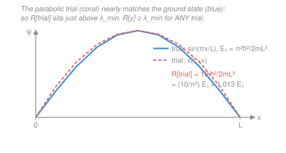

# Mathematical Methods for Physics · Lesson 5.2: Constraints and variational estimates

> ⏱ ~15 min · Module 5: Variational methods & symmetry · Builds on: [5.1 Calculus of variations and the Euler–Lagrange equation](05-01-calculus-of-variations-euler-lagrange.md), [3.5 Sturm–Liouville theory](03-05-sturm-liouville-orthogonal-expansions.md) · Unlocks: [5.3 Groups and symmetry in physics — a taste](05-03-groups-symmetry.md)

## Why this matters

Two payoffs, both huge. First, real optimization problems come with *strings attached*: nature maximizes the area a soap film encloses, but the perimeter is fixed; a hanging chain minimizes energy, but its length is fixed. The tool is the **Lagrange multiplier** you met for ordinary functions in [`calc-refresher`](../../calc-refresher/syllabus.md) — lifted to functionals. Second, and this is the workhorse of quantum chemistry: the same variational idea lets you *estimate the ground-state energy* of a system you can't solve exactly, and — remarkably — the estimate is guaranteed to lie **above** the true value. Guess a wavefunction, turn a crank, get a rigorous upper bound. That's the **Rayleigh–Ritz method**, and it's how much of computational physics actually runs.

## The idea

Recall the finite-dimensional trick: to extremize $f(x,y)$ subject to $g(x,y)=0$, you don't parametrize the constraint — you extremize $f - \lambda g$ freely and let the multiplier $\lambda$ enforce the tie. The functional version is identical in spirit. To extremize a functional $J[y]$ subject to a *second* functional being held fixed, $K[y] = \text{const}$, you extremize $J - \lambda K$ with no constraint at all, and solve the resulting Euler–Lagrange equation. One number $\lambda$ buys you the whole constraint.

The eigenvalue idea is sneakier and more beautiful. For a Sturm–Liouville problem ([3.5](03-05-sturm-liouville-orthogonal-expansions.md)) there's a functional — the **Rayleigh quotient** — that is *stationary* exactly at the eigenfunctions and *equals the eigenvalue* there. But here's the gift: for the **lowest** eigenvalue, the quotient isn't just stationary, it's a genuine minimum. So *any* function you plug in gives a value $\geq \lambda_{\min}$. Feed it a crude guess with a couple of tunable knobs, minimize over the knobs, and you've squeezed the tightest upper bound your guess can give. You never solved the differential equation — you just evaluated some integrals.

## The formal version

### Isoperimetric constraints (a fixed functional)

We want to extremize
$$J[y] = \int_a^b F(x,y,y')\,\mathrm{d}x \quad\text{subject to}\quad K[y] = \int_a^b G(x,y,y')\,\mathrm{d}x = \ell\ (\text{fixed}).$$
The recipe: introduce a constant **Lagrange multiplier** $\lambda$ and extremize the combined functional $J - \lambda K$ freely. Its Euler–Lagrange equation is
$$\boxed{\ \frac{\partial (F-\lambda G)}{\partial y} - \frac{\mathrm{d}}{\mathrm{d}x}\frac{\partial (F-\lambda G)}{\partial y'} = 0\ }$$
solved together with the constraint $K[y]=\ell$, which fixes $\lambda$. *In words: pretend there's no constraint, but subtract $\lambda$ times the constrained quantity from the integrand; the leftover freedom in $\lambda$ is exactly what you need to hit the target $\ell$.* This is the literal functional analog of the [`calc-refresher`](../../calc-refresher/syllabus.md) multiplier — "isoperimetric" because the classic case is fixed perimeter (*iso* = same, *perimetric* = perimeter).

### Holonomic (pointwise) constraints

If instead the constraint must hold *at every point* — say a bead confined to a surface $g(x,y)=0$ for all $x$ — one constant isn't enough. You promote the multiplier to a **function** $\lambda(x)$ and extremize $\int [F + \lambda(x)\,g]\,\mathrm{d}x$, treating $y$ and $\lambda(x)$ as independent. Varying $\lambda(x)$ reproduces $g=0$; varying $y$ gives the constrained equation of motion. This is exactly how constraint *forces* enter Lagrangian mechanics.

### The Rayleigh quotient and eigenvalue bounds

Take a Sturm–Liouville eigenproblem in self-adjoint form ([3.5](03-05-sturm-liouville-orthogonal-expansions.md)), with the sign convention
$$-\left(p\,y'\right)' + q\,y = \lambda\, w\,y,$$
on $[a,b]$ with boundary conditions that kill the boundary term $[p\,y\,y']_a^b$ (e.g. $y(a)=y(b)=0$). Here $p(x)>0$, weight $w(x)>0$. Multiply by $y$, integrate, and integrate the first term by parts:
$$\int_a^b y\left[-(p y')' + q y\right]\mathrm{d}x = \int_a^b \left(p\,y'^2 + q\,y^2\right)\mathrm{d}x .$$
Dividing by $\int w y^2$, define the **Rayleigh quotient**
$$\boxed{\ R[y] = \frac{\displaystyle\int_a^b \left(p\,y'^2 + q\,y^2\right)\mathrm{d}x}{\displaystyle\int_a^b w\,y^2\,\mathrm{d}x}\ }$$
*In words: it's the "energy" of $y$ divided by its weighted size.* Two facts do all the work:

1. **Stationary at eigenfunctions.** If $y=y_n$ (the $n$-th eigenfunction), then $R[y_n]=\lambda_n$, and $R$ is stationary there ($\delta R = 0$). The Rayleigh quotient's stationary values *are* the eigenvalues.
2. **Minimum principle.** For the *lowest* eigenvalue,
$$R[y] \geq \lambda_{\min} \quad\text{for every admissible } y,$$
with equality only when $y$ is the ground eigenfunction. **Proof (one line):** expand any trial $y=\sum_n c_n y_n$ in the orthonormal eigenbasis; orthogonality gives $R[y]=\dfrac{\sum_n \lambda_n c_n^2}{\sum_n c_n^2}\geq \lambda_{\min}\dfrac{\sum_n c_n^2}{\sum_n c_n^2}=\lambda_{\min}$, since every $\lambda_n\geq\lambda_{\min}$. $\blacksquare$

**Rayleigh–Ritz method.** Pick a trial function with adjustable parameters $y(x;\alpha,\beta,\dots)$ that satisfies the boundary conditions, compute $R$ as a function of the parameters, and **minimize over them**. The minimum is the best upper bound your trial family can produce. In quantum mechanics the operator is the Hamiltonian and $R$ is the energy expectation value $\langle H\rangle/\langle\psi|\psi\rangle \geq E_0$ — this is *the* variational method (link: [`quantum-mechanics`](../../quantum-mechanics/syllabus.md)).

## Picture

## Worked examples

**Example 1 (isoperimetric — fixed length encloses maximum area → the circle).** Among smooth curves $y(x)\geq 0$ of fixed arc length $\ell$ joining $(-a,0)$ to $(a,0)$, which encloses the greatest area under it? Maximize
$$J[y]=\int_{-a}^{a} y\,\mathrm{d}x \quad\text{subject to}\quad K[y]=\int_{-a}^{a}\sqrt{1+y'^2}\,\mathrm{d}x=\ell .$$
Form $F-\lambda G = y - \lambda\sqrt{1+y'^2}$. It has no explicit $x$, so use the **Beltrami identity** from [5.1](05-01-calculus-of-variations-euler-lagrange.md), $(F-\lambda G) - y'\,\partial(F-\lambda G)/\partial y' = C$:
$$y - \lambda\sqrt{1+y'^2} - y'\left(\frac{-\lambda y'}{\sqrt{1+y'^2}}\right) = y - \frac{\lambda}{\sqrt{1+y'^2}} = C.$$
Rearrange: $\sqrt{1+y'^2} = \dfrac{\lambda}{\,y-C\,}$, so $(y-C)^2(1+y'^2)=\lambda^2$. That is precisely the differential equation of a **circle of radius $\lambda$**: $(x-x_0)^2 + (y-C)^2 = \lambda^2$ (differentiate it to check). The extremal is a circular arc, and closing the curve (fixed *perimeter*, maximum area) gives the full **circle** — the isoperimetric theorem. The multiplier has a clean meaning: $\lambda$ is the radius. For a closed loop of perimeter $\ell$, $\ell=2\pi\lambda \Rightarrow \lambda = \ell/2\pi$.

**Example 2 (Rayleigh–Ritz — ground state of a particle in a box).** A particle in an infinite well on $[0,L]$ obeys the Schrödinger eigenproblem $-\dfrac{\hbar^2}{2m}\psi'' = E\,\psi$ with $\psi(0)=\psi(L)=0$. This is Sturm–Liouville with $p=\hbar^2/2m$, $q=0$, $w=1$, so the energy functional is
$$E[\psi] = \frac{\dfrac{\hbar^2}{2m}\displaystyle\int_0^L \psi'^2\,\mathrm{d}x}{\displaystyle\int_0^L \psi^2\,\mathrm{d}x}\ \geq\ E_1.$$
The exact ground state is $\psi_1=\sin(\pi x/L)$ with $E_1 = \dfrac{\pi^2\hbar^2}{2mL^2}$. Suppose we didn't know that and guessed the simplest curve that vanishes at both walls: the parabola $\psi = x(L-x)$. Then
$$\psi' = L-2x,\qquad \int_0^L (L-2x)^2\,\mathrm{d}x = \frac{L^3}{3},\qquad \int_0^L x^2(L-x)^2\,\mathrm{d}x = \frac{L^5}{30}.$$
So
$$E[\psi] = \frac{\hbar^2}{2m}\cdot\frac{L^3/3}{L^5/30} = \frac{\hbar^2}{2m}\cdot\frac{10}{L^2} = \frac{10\,\hbar^2}{2mL^2}.$$
Compare to exact: the ratio is $10/\pi^2 = 1.0132$. Our throwaway parabola overshoots the true ground-state energy by just **1.3 %** — and, by the minimum principle, we *know* it's an overestimate without ever comparing. That guaranteed-from-above property is what makes the method trustworthy: refine the trial and the bound can only tighten.

## Watch out

- **You might think the multiplier is just a bookkeeping nuisance — but it's physics.** $\lambda$ carries units and meaning: in Example 1 it's the radius of curvature; in mechanics $\lambda(x)$ is (proportional to) the constraint *force*; in thermodynamics such multipliers become temperature and chemical potential. Don't discard it after solving — read it.
- **You might think a lower Rayleigh–Ritz estimate is a "better" number in the sense of being closer, so any decrease is progress — true, but the bound is only ever an *upper* bound on $\lambda_{\min}$.** Minimizing over parameters pushes it *down* toward $\lambda_{\min}$; it can never dip below. If your "estimate" comes out below a known exact value, you have an arithmetic error.
- **You might forget the trial function must satisfy the boundary conditions.** A trial that doesn't vanish where the true solution must (e.g. at the walls of the box) is not admissible — the boundary term you dropped in the integration by parts reappears and the bound fails. Enforce the BCs first, adjust parameters second.

## One-liner

> Tie down a variation with a Lagrange multiplier ($J-\lambda K$); estimate a lowest eigenvalue by feeding *any* trial function to the Rayleigh quotient — it always answers with an upper bound.

## Problems

**P1 (🟢)** For the particle in a box on $[0,L]$, plug the *exact* ground state $\psi=\sin(\pi x/L)$ into the energy functional $E[\psi]=\dfrac{\hbar^2}{2m}\dfrac{\int_0^L\psi'^2\,\mathrm{d}x}{\int_0^L\psi^2\,\mathrm{d}x}$ and confirm you recover $E_1=\dfrac{\pi^2\hbar^2}{2mL^2}$. (This checks that the Rayleigh quotient *equals* the eigenvalue at the eigenfunction.)

**P2 (🟡)** A closed loop of string has fixed length (perimeter) $\ell$. Using the Example 1 result that the maximizing shape is a circle of radius $\lambda=\ell/2\pi$, find the maximum enclosed area $A_{\max}$ in terms of $\ell$. Then verify the classic **isoperimetric inequality** $A \leq \ell^2/4\pi$ is saturated by the circle.

**P3 (🔴, optional)** Estimate the ground-state energy of the 1D harmonic oscillator, $H=-\dfrac{\hbar^2}{2m}\dfrac{\mathrm{d}^2}{\mathrm{d}x^2}+\tfrac12 m\omega^2 x^2$, with the Gaussian trial $\psi=e^{-\alpha x^2}$ ($\alpha>0$ the parameter). Compute $E(\alpha)=\langle H\rangle/\langle\psi|\psi\rangle$, minimize over $\alpha$, and report the bound. Useful integrals: $\int_{-\infty}^{\infty} e^{-2\alpha x^2}\mathrm{d}x=\sqrt{\tfrac{\pi}{2\alpha}}$, $\int_{-\infty}^{\infty} x^2 e^{-2\alpha x^2}\mathrm{d}x=\tfrac{1}{4\alpha}\sqrt{\tfrac{\pi}{2\alpha}}$.

Solutions

**P1** With $\psi=\sin(\pi x/L)$, $\psi'=\dfrac{\pi}{L}\cos(\pi x/L)$. Over a half-period on $[0,L]$, $\int_0^L\cos^2(\pi x/L)\,\mathrm{d}x=\int_0^L\sin^2(\pi x/L)\,\mathrm{d}x=\dfrac{L}{2}$. Hence
$$\int_0^L\psi'^2\,\mathrm{d}x=\frac{\pi^2}{L^2}\cdot\frac{L}{2}=\frac{\pi^2}{2L},\qquad \int_0^L\psi^2\,\mathrm{d}x=\frac{L}{2},$$
$$E[\psi]=\frac{\hbar^2}{2m}\cdot\frac{\pi^2/2L}{L/2}=\frac{\hbar^2}{2m}\cdot\frac{\pi^2}{L^2}=\frac{\pi^2\hbar^2}{2mL^2}=E_1.\ \checkmark$$
*Check.* Exact eigenfunction returns the exact eigenvalue with *equality* — consistent with the minimum principle ($R[y]\geq\lambda_{\min}$, equality at the ground state). The crude parabola of Example 2 gave $10\,\hbar^2/2mL^2 > \pi^2\hbar^2/2mL^2$, strictly above, as required.

**P2** A circle of radius $\lambda=\ell/2\pi$ has area
$$A_{\max}=\pi\lambda^2=\pi\left(\frac{\ell}{2\pi}\right)^2=\frac{\pi\ell^2}{4\pi^2}=\frac{\ell^2}{4\pi}.$$
Since the circle *maximizes* area at fixed perimeter, every other closed curve of the same length $\ell$ has $A\leq \ell^2/4\pi$ — the isoperimetric inequality, with equality iff the curve is a circle.
*Check.* Units: $[\ell^2]=$ length$^2=$ area $\checkmark$. Sanity: a unit-perimeter circle gives $A=1/4\pi\approx 0.0796$; a unit-perimeter square (side $1/4$) gives $A=1/16=0.0625<0.0796$ $\checkmark$ — the circle wins, as it must.

**P3** Write $E(\alpha)=\langle T\rangle+\langle V\rangle$ with each term a ratio to $N\equiv\int\psi^2=\sqrt{\pi/2\alpha}$.

*Kinetic:* $\psi'=-2\alpha x\,e^{-\alpha x^2}$, so $\int\psi'^2=4\alpha^2\int x^2 e^{-2\alpha x^2}\mathrm{d}x=4\alpha^2\cdot\tfrac{1}{4\alpha}\sqrt{\tfrac{\pi}{2\alpha}}=\alpha\,N$. Thus
$$\langle T\rangle=\frac{\hbar^2}{2m}\frac{\int\psi'^2}{N}=\frac{\hbar^2}{2m}\,\alpha=\frac{\hbar^2\alpha}{2m}.$$
*Potential:* $\int x^2\psi^2=\int x^2 e^{-2\alpha x^2}\mathrm{d}x=\tfrac{1}{4\alpha}N$, so
$$\langle V\rangle=\tfrac12 m\omega^2\frac{\int x^2\psi^2}{N}=\tfrac12 m\omega^2\cdot\frac{1}{4\alpha}=\frac{m\omega^2}{8\alpha}.$$
Therefore
$$E(\alpha)=\frac{\hbar^2\alpha}{2m}+\frac{m\omega^2}{8\alpha}.$$
Minimize: $E'(\alpha)=\dfrac{\hbar^2}{2m}-\dfrac{m\omega^2}{8\alpha^2}=0 \Rightarrow \alpha^2=\dfrac{m^2\omega^2}{4\hbar^2}\Rightarrow \alpha=\dfrac{m\omega}{2\hbar}.$ Substituting back,
$$E_{\min}=\frac{\hbar^2}{2m}\cdot\frac{m\omega}{2\hbar}+\frac{m\omega^2}{8}\cdot\frac{2\hbar}{m\omega}=\frac{\hbar\omega}{4}+\frac{\hbar\omega}{4}=\boxed{\tfrac12\hbar\omega}.$$
*Check.* This equals the *exact* oscillator ground-state energy — because the true ground state $e^{-m\omega x^2/2\hbar}$ is itself a Gaussian, so the trial family contains the exact answer and the bound is saturated. A neat illustration that when your trial function happens to include the true eigenfunction, Rayleigh–Ritz nails it exactly rather than merely bounding it.

## Flashback

**From Lesson 5.1 (Calculus of variations / Beltrami identity):** Find the curve $y(x)$ that, when revolved about the $x$-axis, generates the **minimal surface of revolution** — i.e. extremize $S=\int 2\pi y\sqrt{1+y'^2}\,\mathrm{d}x$. Since the integrand has no explicit $x$, use the Beltrami identity and identify the resulting shape.

Solution

Drop the constant $2\pi$; the integrand is $F=y\sqrt{1+y'^2}$, with no explicit $x$. Beltrami: $F-y'\,\partial F/\partial y'=C$. Since $\partial F/\partial y'=\dfrac{y\,y'}{\sqrt{1+y'^2}}$,
$$y\sqrt{1+y'^2}-\frac{y\,y'^2}{\sqrt{1+y'^2}}=\frac{y}{\sqrt{1+y'^2}}=C.$$
So $y=C\sqrt{1+y'^2}\Rightarrow y'=\sqrt{(y/C)^2-1}$. Separating and integrating ($\int \mathrm{d}y/\sqrt{(y/C)^2-1}=C\,\operatorname{arcosh}(y/C)$) gives
$$y(x)=C\cosh\!\left(\frac{x-x_0}{C}\right),$$
a **catenary**; the surface it sweeps out is the **catenoid** — the shape a soap film forms between two coaxial rings.
*Check.* Same integrand structure $y\sqrt{1+y'^2}$ appears wherever a "cost" is weighted by height $y$; here Beltrami collapsed a second-order ODE to first order in one step, exactly as it did for the brachistochrone. Limiting sense: as the rings' separation shrinks, $C\to$ their radius and the film becomes nearly cylindrical, matching $\cosh\approx 1$. $\checkmark$

## Connections

- **Backward:** the constrained recipe is just [5.1](05-01-calculus-of-variations-euler-lagrange.md)'s Euler–Lagrange (and Beltrami) applied to $F-\lambda G$; the Rayleigh quotient is built directly on the self-adjoint Sturm–Liouville form of [3.5](03-05-sturm-liouville-orthogonal-expansions.md), whose real eigenvalues and orthogonal eigenfunctions are what make the minimum principle work.
- **Forward:** [5.3 Groups and symmetry](05-03-groups-symmetry.md) closes the module; more importantly, Rayleigh–Ritz is the computational backbone of [`quantum-mechanics`](../../quantum-mechanics/syllabus.md) — the variational method for ground-state energies, and (extended to several trial functions) the linear-variational / basis-set methods behind all of quantum chemistry.
- **Sideways:** the functional multiplier $\lambda$ is the exact analog of the finite-dimensional **Lagrange multiplier** for constrained optimization in [`calc-refresher`](../../calc-refresher/syllabus.md) — the same object that appears as constrained utility maximization in microeconomics and as constraint forces in analytical mechanics. One idea, three departments.
