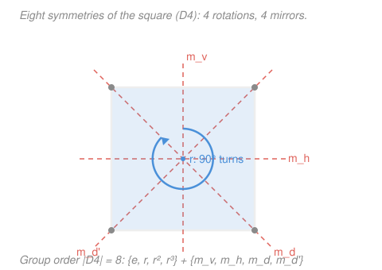

# Mathematical Methods for Physics · Lesson 5.3: Groups and symmetry in physics — a taste

> ⏱ ~15 min · Module 5: Variational methods & symmetry · Builds on: [5.2 Constraints and variational estimates](05-02-constraints-variational-estimates.md), [5.1 Calculus of variations](05-01-calculus-of-variations-euler-lagrange.md) · Unlocks: bridges forward to [`quantum-mechanics`](../../quantum-mechanics/syllabus.md) and [`analytical-mechanics`](../../analytical-mechanics/syllabus.md)

## Why this matters

You have spent this course computing. This last lesson is different: it hands you a lens, not a technique. A **symmetry** is any change you can make to a system that leaves something essential untouched — rotate a sphere, slide a crystal by one lattice step, shift the clock forward. Two enormous payoffs follow, and both are why symmetry is the organizing principle of modern physics. First, every *continuous* symmetry of the action hands you a **conserved quantity** for free — that is Noether's theorem, and you already met a baby version of it in [5.1](05-01-calculus-of-variations-euler-lagrange.md) when a Lagrangian with no explicit $x$ gave a first integral. Second, the symmetries of a quantum system organize its energy levels — forcing **degeneracies** and dictating which transitions are **allowed** — before you solve a single Schrödinger equation. This is a *taste*: enough to recognize the structure and know which door to walk through next.

## The idea

Hold a square and turn it 90°. It looks identical — you couldn't tell it moved. Now collect *all* the moves that leave it looking identical: turns by 90°, 180°, 270°, the "do nothing" move, and four flips across mirror lines. That collection is not just a list; it has structure. Do one move, then another, and you land on a move that's *already in the list* — never something new. Every move can be undone. There's a "do nothing" that changes nothing. A set of transformations with exactly this structure is a **group**, and the group *is* the symmetry.

The magic is that this structure is the same whether the "moves" are rotations of a square, shuffles of a deck, or rotations of empty space — so anything you prove about the abstract group applies to all of them at once. Physics cares because nature's laws have symmetry groups, and a law's group constrains its solutions with almost no calculation: it tells you what is conserved, which energy levels must coincide, and which processes are forbidden.

## The formal version

**Group.** A **group** is a set $G$ together with a composition law $\ast$ (a rule that takes two elements and returns a third) satisfying four axioms:

1. **Closure:** for all $a,b\in G$, the product $a\ast b$ is again in $G$.
2. **Associativity:** $(a\ast b)\ast c = a\ast(b\ast c)$ for all $a,b,c$.
3. **Identity:** there is an element $e\in G$ with $e\ast a = a\ast e = a$ for every $a$.
4. **Inverses:** each $a\in G$ has an $a^{-1}\in G$ with $a\ast a^{-1} = a^{-1}\ast a = e$.

*In words: you can combine any two moves and stay inside the set, grouping doesn't matter, there's a "do nothing" move, and every move can be reversed.* If in addition $a\ast b = b\ast a$ for all elements, the group is **abelian** (order-independent); otherwise it is **non-abelian** (order matters).

**Discrete example — the square, $D_4$.** The symmetries of a square form the **dihedral group** $D_4$ with **8 elements**: four rotations $\{e, r, r^2, r^3\}$ (by $0°,90°,180°,270°$, where $r$ is a $90°$ turn and $r^4 = e$) and four reflections $\{m_v, m_h, m_d, m_{d'}\}$ across the vertical, horizontal, and two diagonal mirror lines. The composition law is "do this move, then that one." Closure is the striking part: a reflection followed by a reflection is a *rotation*. And $D_4$ is **non-abelian** — reflecting then rotating differs from rotating then reflecting (worked below).

**Continuous (Lie) groups.** When the transformations are labeled by a continuous parameter, the group is a **Lie group**. Three that run all of physics:

- $SO(2)$ — rotations of the plane, labeled by one angle $\theta\in[0,2\pi)$. Abelian: planar rotations commute.
- $SO(3)$ — rotations of 3D space, labeled by three parameters (e.g. an axis plus an angle). **Non-abelian**: rotating about $x$ then $y$ is not the same as $y$ then $x$ — you feel this every time you turn a book two ways.
- Translations — sliding by a vector $\mathbf{a}\in\mathbb{R}^3$. Abelian, and the symmetry of empty space.

("$SO$" is *special orthogonal*: rotation matrices $R$ with $R^{\mathsf T}R = I$ and $\det R = +1$ — length-preserving and orientation-preserving.)

**Why physics cares, part 1 — symmetry $\to$ conservation (Noether preview).** Every *continuous* symmetry of the action yields a conserved quantity:

$$\text{time-shift invariance} \to \text{energy}, \quad \text{translation} \to \text{momentum}, \quad \text{rotation} \to \text{angular momentum}.$$

*In words: if shifting the clock/space/orientation leaves the physics unchanged, something stays constant in time.* You have already seen the first case bare-handed. In [5.1](05-01-calculus-of-variations-euler-lagrange.md), when the integrand $f(y,y')$ had **no explicit $x$-dependence** — invariance under $x\to x+\text{const}$ — the Beltrami identity gave the first integral

$$f - y'\frac{\partial f}{\partial y'} = \text{const}.$$

For a mechanical Lagrangian $L(q,\dot q)$ with no explicit time, that constant is exactly the **energy**. The abstract statement (continuous symmetry $\Rightarrow$ conservation) is Noether's theorem; Beltrami is its time-translation instance.

**Why physics cares, part 2 — representations.** To *use* a group in physics you let its elements act on states as matrices: a **representation** assigns to each group element $g$ a matrix $D(g)$ so that composition becomes matrix multiplication, $D(g_1)D(g_2)=D(g_1 g_2)$. If the physical laws are invariant under the group, states that the group shuffles into one another **must share the same energy** — the group organizes the spectrum. Two consequences you can quote:

- **Degeneracies.** The rotation group $SO(3)$ acting on the hydrogen atom forces each level $\ell$ to come as a multiplet of $2\ell+1$ equal-energy states (the $m = -\ell,\dots,\ell$ orbitals). The degeneracy is *required by the symmetry*, not a numerical accident.
- **Selection rules.** Whether a transition (say, an atom emitting a photon) is **allowed or forbidden** is decided by whether the relevant matrix element respects the symmetry — the group tells you which are automatically zero, without computing the integral.

## Picture

## Worked examples

**Example 1 (mechanical — closure and non-commutativity in $D_4$).** Label the corners of the square $1,2,3,4$ counterclockwise starting top-left. Track where corner $1$ (and its neighbors) go.

Take $r$ = rotate $90°$ counterclockwise, and $m_v$ = reflect across the vertical mirror. Compute $m_v \ast r$ ("do $r$ first, then $m_v$") versus $r \ast m_v$.

- $r$ sends the top edge to the left edge; then $m_v$ flips left$\leftrightarrow$right. Tracking corners, the net effect leaves the top-right and bottom-left corners fixed and swaps the other two — it fixes the TR–BL diagonal, i.e. the **diagonal reflection** $m_{d'}$.
- $m_v \ast r = m_{d'}$, a reflection. So *reflection-after-rotation is a reflection* — the product stays in $D_4$ (**closure**), and it is not a rotation, confirming the group mixes the two types.
- Now $r \ast m_v$ ("$m_v$ first, then $r$"): tracing corners the same way instead fixes the TL–BR diagonal, landing on the *other* diagonal reflection $m_d$.

Since $m_v\ast r = m_{d'} \ne m_d = r\ast m_v$, the group is **non-abelian**: order matters. (Concretely, $m_v r m_v^{-1} = r^{-1}$ — reflecting reverses the sense of rotation, the defining relation of every dihedral group.)

**Example 2 (why you'd care — reading conservation off a symmetry).** A particle moves in the central potential $U(r)$ depending only on distance $r=|\mathbf{r}|$ from the origin (gravity, Coulomb). What is conserved, and why, *without* solving the equations of motion?

The Lagrangian $L = \tfrac12 m|\dot{\mathbf r}|^2 - U(r)$ is unchanged if you rotate the whole configuration about the origin — $r$ doesn't notice a rotation. That is a continuous $SO(3)$ symmetry, so by Noether the conserved quantity is **angular momentum** $\mathbf{L} = \mathbf{r}\times m\dot{\mathbf r}$, all three components. Likewise, $U$ has no explicit time dependence, so time-translation symmetry conserves **energy**. Two conservation laws, read straight off the symmetries — this is the payoff the lens buys you. (That $\mathbf L$ is conserved is why planetary orbits lie in a fixed plane.)

## Watch out

- **You might think any set of transformations is a group.** It isn't — you must check all four axioms. The rotations of a square by $90°$ *alone* fail nothing, but "rotations by $90°$ and $180°$ only" fails **closure** ($90°+90°=180°$ is fine, but you're missing $270°$, forced on you as $90°\ast180°$). Closure is the axiom beginners drop.
- **You might assume composition commutes.** For $SO(2)$ and translations it does; for $D_4$, $SO(3)$, and most of physics it does *not*. Non-commutativity is not a defect — it is the source of the rich structure (and, quantum-mechanically, of uncertainty relations).
- **You might think a "representation" is the group itself.** The group is abstract; a representation is one concrete way to realize its elements as matrices acting on states. The same group has many representations (the hydrogen multiplets are its different-$\ell$ representations), and *which* ones appear is exactly what fixes the degeneracies.

## One-liner

> A symmetry is a transformation that leaves something invariant; the symmetries form a group, and that group hands you conservation laws (continuous case, via Noether) and organizes a quantum system's levels into degenerate multiplets with selection rules (via its representations).

## Problems

**P1 (🟢)** Show that $G=\{1,-1,i,-i\}$ (the fourth roots of unity, $i=\sqrt{-1}$) under ordinary multiplication is a group. Verify closure, identity, and inverses, and state whether it is abelian. *(Check that this group has the same structure as the four rotations $\{e,r,r^2,r^3\}$ of the square.)*

**P2 (🟡)** In $D_4$, using $r$ = rotate $90°$ and $m_h$ = reflect across the horizontal mirror, compute the product $m_h \ast r$ (do $r$ first). Is the result a rotation or a reflection? Then compute $r \ast m_h$ and confirm the two differ (non-abelian).

**P3 (🔴, optional)** For each continuous symmetry, name the conserved quantity: (a) a Lagrangian invariant under time translation $t\to t+\tau$; (b) a free particle whose Lagrangian is invariant under spatial translation $\mathbf r\to\mathbf r+\mathbf a$; (c) a bead on a frictionless circular hoop, whose energy depends on the angular position only through a term $-mgR\cos\phi$ — is angular momentum about the hoop's axis conserved? Explain.

Solutions

**P1** The four elements are $\{1,-1,i,-i\}$.

- **Closure:** products cycle within the set: $i\cdot i = -1$, $i\cdot(-1)=-i$, $(-i)(i)=1$, $(-1)(-1)=1$, etc. Every product of two elements is again a fourth root of unity, since $(\text{root})^4=1$ multiplies to another root. ✓
- **Associativity:** inherited from ordinary complex multiplication, which is associative. ✓
- **Identity:** $e=1$, since $1\cdot z = z$ for all $z$. ✓
- **Inverses:** $1^{-1}=1$, $(-1)^{-1}=-1$, $i^{-1}=-i$ (since $i\cdot(-i)=1$), $(-i)^{-1}=i$. Each inverse is in the set. ✓

Multiplication of complex numbers commutes, so the group is **abelian**.

*Check.* Identify $i \leftrightarrow r$ (a $90°$ rotation): $i^1=i, i^2=-1, i^3=-i, i^4=1$ mirrors $r, r^2, r^3, r^4=e$. This is the **cyclic group $C_4$** — exactly the rotation subgroup of $D_4$. So the four roots of unity *are* the four rotations of a square in disguise, confirming the structure. ✓

**P2** Track the corners (label $1,2,3,4$ counterclockwise from top-left).

- $m_h\ast r$: apply $r$ ($90°$ CCW), then $m_h$ (flip top$\leftrightarrow$bottom). Tracking corners, the top-left and bottom-right corners end up fixed — it fixes the TL–BR diagonal, so $m_h\ast r = m_d$, a **reflection**.
- $r\ast m_h$: apply $m_h$ first, then $r$. Tracing corners fixes the TR–BL diagonal instead, giving the *other* diagonal reflection $m_{d'}$.
- Since $m_d\ne m_{d'}$, we have $m_h\ast r \ne r\ast m_h$: **non-abelian**. ✓

*Check.* Both products are reflections, consistent with the rule "reflection $\ast$ rotation = reflection" (odd number of flips $\Rightarrow$ orientation-reversing). A quick count works too: $D_4$ has 4 rotations and 4 reflections; multiplying a reflection by a rotation must give an orientation-reversing element, i.e. a reflection. ✓

**P3**

- **(a)** Invariance under time translation $\Rightarrow$ **energy** is conserved (Noether's time-translation instance — the Beltrami first integral of [5.1](05-01-calculus-of-variations-euler-lagrange.md)).
- **(b)** Invariance under spatial translation $\Rightarrow$ **linear momentum** $\mathbf p = m\dot{\mathbf r}$ is conserved (each direction of $\mathbf a$ giving one component).
- **(c)** The bead's potential $-mgR\cos\phi$ **does** depend on $\phi$, so the system is *not* invariant under $\phi\to\phi+\text{const}$: the rotational symmetry is broken by gravity. Hence angular momentum about the axis is **not** conserved — gravity exerts a torque. (Only if the hoop were horizontal, removing the $\cos\phi$ term, would $\phi$-translation symmetry return and conserve angular momentum.)

*Check.* The pattern: a conserved quantity exists exactly when a coordinate is **cyclic** (absent from the Lagrangian). In (c) $\phi$ appears explicitly, so its conjugate momentum is not conserved — matching the physical fact that a pendulum-like bead speeds up and slows down. ✓

## Flashback

**From Lesson 5.1 (Calculus of variations and the Euler–Lagrange equation):** A curve $y(x)$ extremizes the functional $J[y]=\displaystyle\int \sqrt{1+y'^2}\,\big(1 + y^2\big)\,\mathrm{d}x$. The integrand $f(y,y')=\sqrt{1+y'^2}\,(1+y^2)$ has **no explicit $x$-dependence**. Write down the conserved first integral (Beltrami), and name the symmetry responsible for it. *(Fresh variant — different integrand.)*

Solution

Because $f$ has no explicit $x$, the Euler–Lagrange equation admits the **Beltrami first integral**

$$f - y'\frac{\partial f}{\partial y'} = C \quad(\text{constant}).$$

Compute $\dfrac{\partial f}{\partial y'} = (1+y^2)\dfrac{y'}{\sqrt{1+y'^2}}$. Then

$$f - y'\frac{\partial f}{\partial y'} = (1+y^2)\sqrt{1+y'^2} - (1+y^2)\frac{y'^2}{\sqrt{1+y'^2}} = (1+y^2)\,\frac{(1+y'^2)-y'^2}{\sqrt{1+y'^2}} = \frac{1+y^2}{\sqrt{1+y'^2}} = C.$$

The responsible symmetry is **invariance under translation in $x$** ($x\to x+\text{const}$): shifting the independent variable leaves $J$ unchanged, so its Noether "charge" — here $(1+y^2)/\sqrt{1+y'^2}$ — is constant along the extremal.

*Check.* The general Beltrami form reduces to a first-order ODE (one derivative lower than Euler–Lagrange), the concrete win from the symmetry. Dimensionally the expression is a ratio of like quantities, consistent with a pure constant $C$. ✓

## Connections

- **Backward:** the "no explicit $x$ $\Rightarrow$ first integral" shortcut of [5.1](05-01-calculus-of-variations-euler-lagrange.md) (Beltrami) and the energy-estimate stance of [5.2](05-02-constraints-variational-estimates.md) are the variational face of Noether's theorem — this lesson names the structure (a continuous symmetry group) behind that shortcut.
- **Forward:** Noether's theorem gets its full derivation in the [`analytical-mechanics`](../../analytical-mechanics/syllabus.md) syllabus (symmetry $\to$ conservation from the Lagrangian), and the representation story — degenerate multiplets, angular-momentum ladders, and selection rules — is the backbone of the [`quantum-mechanics`](../../quantum-mechanics/syllabus.md) syllabus.
- **Sideways:** the full machinery — group axioms, subgroups, characters, irreducible representations — belongs to a dedicated **group theory / representation theory** course; this lesson is only the taste. The rotation matrices of $SO(3)$ are the orthogonal matrices you diagonalized in [1.5](01-05-index-notation-cartesian-tensors.md) and `linalg-refresher`, now read as a *group* rather than one at a time.
