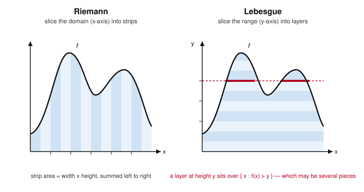

# Measure Theory · Lesson 1.1: Where the Riemann integral fails

> ⏱ ~15 min · Module 1: σ-algebras and the construction of measure · Builds on: nothing (course start) · Unlocks: [1.2 σ-algebras and measurable spaces](01-02-sigma-algebras.md)

## Why this matters

You already have an integral — the Riemann integral from calculus — and for continuous functions it works fine. So why rebuild it from scratch over four modules? Because the Riemann integral has three cracks, and each one blocks something you will absolutely need downstream. It can't integrate a function as simple as "1 on the rationals," it refuses to swap a limit with an integral (the single most-used move in analysis and probability), and the space of functions it can integrate has holes in it — Cauchy sequences that converge to nothing inside the space. That last failure is why there is no complete function space to do Fourier analysis or quantum mechanics in. Lebesgue's fix repairs all three at once, and the fix is a single change of viewpoint. This lesson is the diagnosis; the rest of the course is the cure.

## The idea

The Riemann integral chops the **domain** into little vertical strips. Over each strip $[x_{i-1},x_i]$ it pretends $f$ is roughly constant, multiplies that height by the width $\Delta x_i$, and adds up. This is fine when $f$ doesn't wiggle too violently across a strip — i.e. when $f$ is continuous enough. It breaks the moment $f$ oscillates wildly at every scale, because then no strip is ever "roughly constant."

Lebesgue chops the **range** instead. Fix a height $y$ and ask: *how big is the set of inputs where $f(x)\approx y$?* Multiply that height $y$ by the *size of that set* and add up over heights. A function can jump around as madly as it likes across the domain — all Lebesgue cares about is, for each output level, the total size of the set producing it.

That reframing hides a demand that turns out to be the whole subject. To multiply "height $y$" by "size of the set where $f\approx y$," you first need to know **how to measure the size of an arbitrary set** — not just an interval, but a set that might be scattered dust like the rationals. Riemann never has to measure anything worse than an interval (its widths $\Delta x_i$). Lebesgue has to measure the set $\{x : f(x) > y\}$, which can be genuinely wild. So the logical order flips: **measure sets first, integrate second.** Modules 1 builds the measuring machine; Module 2 builds the integral on top of it.

## The formal version

Fix a bounded $f:[a,b]\to\mathbb{R}$ and a partition $P: a=x_0<x_1<\dots<x_n=b$. On each subinterval let
$$M_i=\sup_{[x_{i-1},x_i]} f,\qquad m_i=\inf_{[x_{i-1},x_i]} f,\qquad \Delta x_i = x_i-x_{i-1}.$$
The **upper and lower Darboux sums** are
$$U(f,P)=\sum_{i=1}^n M_i\,\Delta x_i,\qquad L(f,P)=\sum_{i=1}^n m_i\,\Delta x_i,$$
and the **upper and lower integrals** are $\overline{\int_a^b} f=\inf_P U(f,P)$ and $\underline{\int_a^b} f=\sup_P L(f,P)$. We say $f$ is **Riemann integrable** when these agree, and call the common value $\int_a^b f\,dx$.

*In words:* over each strip, overshoot with the sup and undershoot with the inf; $f$ is integrable exactly when refining the partition squeezes overshoot and undershoot together to the same number.

One clean characterization tells us precisely when the squeeze succeeds. We won't prove it now (it needs the "measure zero" we're about to build), but state it as the target we're chasing:

**Lebesgue's criterion for Riemann integrability.** A bounded $f:[a,b]\to\mathbb{R}$ is Riemann integrable **if and only if** its set of discontinuities has *Lebesgue measure zero* — informally, can be covered by intervals of arbitrarily small total length.

*In words:* Riemann integration works exactly when $f$ is continuous "almost everywhere." The three failures below are all failures of this condition — or of the space it carves out. (Defining "measure zero" rigorously is Lesson [1.4](01-04-outer-measure-caratheodory.md); for now, a countable set of points is measure zero, since you can cover the $k$-th point by an interval of length $\varepsilon/2^k$ for total length $\varepsilon$.)

### Failure 1 — the Dirichlet function is not integrable

Let $f=\mathbf{1}_{\mathbb{Q}\cap[0,1]}$ on $[0,1]$: the value $1$ on rationals, $0$ on irrationals ($\mathbf{1}_E$ denotes the *indicator* of $E$, equal to $1$ on $E$ and $0$ off it). Take *any* partition $P$. Every subinterval $[x_{i-1},x_i]$, no matter how tiny, contains both a rational and an irrational (both are dense). So on every subinterval $M_i=1$ and $m_i=0$, giving
$$U(f,P)=\sum_i 1\cdot\Delta x_i = 1,\qquad L(f,P)=\sum_i 0\cdot\Delta x_i = 0.$$
This holds for every $P$, so $\overline{\int_0^1} f = 1$ and $\underline{\int_0^1} f = 0$. They never meet: **$f$ is not Riemann integrable.** Yet morally its integral *should* be $0$ — the rationals are a negligible, countable dust, and $f$ is $0$ off that dust. Lebesgue will assign $\int_0^1 f = 0$ without blinking. (Consistent with the criterion: $f$ is discontinuous at *every* point of $[0,1]$, a set of measure $1$, not $0$.)

### Failure 2 — limits don't commute with the integral

Enumerate the rationals in $[0,1]$ as $q_1,q_2,q_3,\dots$ (they're countable, so this is possible), and set
$$f_n=\mathbf{1}_{\{q_1,\dots,q_n\}}.$$
Each $f_n$ is $0$ except at $n$ points, so it is Riemann integrable with $\int_0^1 f_n\,dx = 0$ (cover the $n$ spikes by intervals of total length $\varepsilon$: the upper sum is $\le\varepsilon$, the lower sum is $0$). And $f_n(x)\uparrow f(x)$ pointwise for every $x$ — once $n$ is large enough to include a given rational, the value stays $1$ there forever; at irrationals it's always $0$. But the limit $f=\mathbf{1}_{\mathbb{Q}\cap[0,1]}$ is the Dirichlet function, which Failure 1 just showed is **not** Riemann integrable. So
$$\lim_{n\to\infty}\int_0^1 f_n\,dx = 0 \quad\text{exists},\qquad\text{yet}\qquad \int_0^1 \Big(\lim_{n\to\infty} f_n\Big)\,dx \quad\text{does not even exist.}$$
The limit and the integral don't just disagree — the right-hand side is undefined. Any theorem letting you pass a limit inside an integral is impossible in this framework, because the class of integrable functions isn't even *closed* under pointwise limits. Module 2's convergence theorems (monotone, Fatou, dominated) exist precisely to fix this, and they need the Lebesgue integral to have a fighting chance.

### Failure 3 — the space of integrable functions is not complete

Measure the "size" of a function by $\lVert f\rVert_1=\int_0^1 |f|\,dx$, the $L^1$ norm. A sequence $(f_n)$ is **Cauchy** in this norm if $\lVert f_n-f_m\rVert_1\to 0$ as $n,m\to\infty$; "complete" means every Cauchy sequence has a limit *inside the space*. The Riemann-integrable functions fail this.

Build a **fat Cantor set** $K\subseteq[0,1]$: start with $[0,1]$ and, at stage $n$, delete an open middle piece from each remaining interval, but shrink what you delete so the total deleted length is only, say, $1/2$. The nested closed sets $K_1\supset K_2\supset\cdots$ are each a finite union of intervals, and $K=\bigcap_n K_n$ is closed, has *empty interior* (it's full of gaps), yet has total length $1/2>0$. Now let $f_n=\mathbf{1}_{K_n}$: a step function, hence Riemann integrable. For $m>n$, $K_m\subseteq K_n$, so
$$\lVert f_n-f_m\rVert_1=\big(\text{length of }K_n\big)-\big(\text{length of }K_m\big)\to \tfrac12-\tfrac12=0,$$
so $(f_n)$ is **Cauchy** in $\lVert\cdot\rVert_1$. Its natural limit is $\mathbf{1}_K$. But $\mathbf{1}_K$ is *not* Riemann integrable: because $K$ is closed with empty interior and positive length, $\mathbf{1}_K$ is discontinuous at every one of the length-$1/2$ set of points of $K$ (each is approached by gap-points where the value is $0$), violating Lebesgue's criterion. And no Riemann-integrable function can equal $\mathbf{1}_K$ up to a negligible set either — the discontinuities have positive measure no matter how you patch a measure-zero set. **The Cauchy sequence has escaped the space.**

*In words:* Riemann integration has "holes" — sequences that ought to converge point at a limit that isn't there. The Lebesgue $L^p$ spaces (Module 3) fill every hole; that completeness, proved as the Riesz–Fischer theorem in Lesson [3.4](03-04-completeness-riesz-fischer.md), is what makes $L^2$ a Hilbert space and Fourier series converge in mean.

## Picture

Same curve, two philosophies. **Left (Riemann):** partition the $x$-axis; each strip contributes (width)$\times$(height). **Right (Lebesgue):** partition the $y$-axis; the layer at height $y$ sits over the set $\{x:f(x)>y\}$ (the two thick red segments), and its contribution is $y$ times the *measure* of that set. When $f$ oscillates violently, the strips on the left never settle — but the layers on the right only ever ask you to measure a set, which is a question Module 1 will answer for sets far worse than this smooth curve.

## Worked examples

**Example 1 (mechanical — the Darboux squeeze fails).** Verify directly that $g=\mathbf{1}_{\mathbb{Q}\cap[0,1]}$ has upper integral $1$ and lower integral $0$, so the gap $\overline{\int} - \underline{\int} = 1$ never closes.

Take *any* partition $P: 0=x_0<\dots<x_n=1$. Fix a subinterval $[x_{i-1},x_i]$. By density of $\mathbb{Q}$ it contains a rational $r$ with $g(r)=1$, so $M_i=\sup g \ge 1$; since $g\le 1$ everywhere, $M_i=1$. By density of the irrationals it contains an irrational $t$ with $g(t)=0$, so $m_i=\inf g \le 0$; since $g\ge 0$, $m_i=0$. Therefore $U(g,P)=\sum_i 1\cdot\Delta x_i=\sum_i\Delta x_i=1$ and $L(g,P)=\sum_i 0\cdot\Delta x_i=0$, **for every $P$**. Taking $\inf_P$ and $\sup_P$: $\overline{\int_0^1} g=1$, $\underline{\int_0^1} g=0$. No refinement helps, because the argument used no property of $P$ at all. Contrast a continuous $g$, where fine partitions drive $M_i-m_i\to 0$ on each strip and the sums converge.

**Example 2 (why you'd care — the interchange that Lebesgue rescues).** The sequence $f_n=\mathbf{1}_{\{q_1,\dots,q_n\}}$ from Failure 2 shows that under Riemann rules "$\lim\int = \int\lim$" is not even a well-posed statement. Watch how Lebesgue repairs it *without changing a single value of any $f_n$*: once we define the Lebesgue integral, each $\int_0^1 f_n = 0$ (the set $\{q_1,\dots,q_n\}$ has measure $0$), the limit $f=\mathbf{1}_{\mathbb{Q}\cap[0,1]}$ *is* Lebesgue integrable with $\int_0^1 f = 0$, and so
$$\lim_{n\to\infty}\int_0^1 f_n = 0 = \int_0^1 \lim_{n\to\infty} f_n.$$
Both sides exist and agree. The monotone convergence theorem (Lesson [2.4](02-04-monotone-convergence-fatou.md)) will make this interchange automatic for *any* increasing sequence of nonnegative measurable functions — turning a Riemann impossibility into a one-line application.

## Watch out

- You might think "the rationals are countable, so the Dirichlet function's integral is obviously $0$" settles it — but *obviously $0$ under which integral?* Under Riemann it is genuinely undefined (the Darboux sums don't meet); the value $0$ only exists once you have Lebesgue measure to declare the rationals negligible. The intuition is right; the Riemann machinery can't cash it.
- You might think completeness is a technicality — but it's the load-bearing wall. Without it there is no Hilbert space $L^2$, no "$L^p$ is a Banach space," and Fourier series have nothing to converge *to*. Failure 3 is the reason `functional-analysis` and `fourier-analysis` are built on Lebesgue, not Riemann.
- You might think Lebesgue simply "makes more functions integrable." That undersells it: the real gain is that the integrable functions form a *complete* space and that limits pass through the integral. New functions are a symptom; the good limit behavior and completeness are the cure.
- You might conflate "$f_n\to f$ pointwise" with "$\int f_n \to \int f$." Failure 2 shows pointwise convergence guarantees *nothing* about integrals on its own — you need a convergence theorem, with hypotheses, to license the swap. That caveat never goes away; it just gets sharp, usable sufficient conditions.

## One-liner

> Riemann slices the domain and dies on wild functions; Lebesgue slices the range and only ever needs to measure a set — so you must learn to measure sets first, then integrate.

## Problems

**P1 (🟢)** Let $h=\mathbf{1}_{(\mathbb{R}\setminus\mathbb{Q})\cap[0,1]}$ — the indicator of the *irrationals* in $[0,1]$ (so $h=1-g$ for the Dirichlet $g$). Compute the upper and lower Darboux integrals of $h$ from scratch and conclude whether $h$ is Riemann integrable. What "should" its integral be, and why?

**P2 (🟡)** Let $\{q_1,q_2,\dots\}$ enumerate $\mathbb{Q}\cap[0,1]$ and define $f_n=\mathbf{1}_{\{q_1,\dots,q_n\}}$. Prove directly from the Darboux definition (no appeal to Lebesgue's criterion) that each $f_n$ is Riemann integrable with $\int_0^1 f_n\,dx = 0$. *(Hint: cover the $n$ spikes by short intervals and bound the upper sum.)*

**P3 (🔴, optional)** Let $K\subseteq[0,1]$ be a fat Cantor set: closed, with empty interior, and total length $\tfrac12$ (take these three facts as given from the construction in Failure 3; "total length" is the outer measure $m^*$ made rigorous in Lesson [1.4](01-04-outer-measure-caratheodory.md), and here $m^*(K)=\tfrac12$). Working *only* from the Darboux definition — do **not** invoke Lebesgue's criterion — prove that $\mathbf 1_K$ is not Riemann integrable by showing $\underline{\int_0^1}\mathbf 1_K = 0$ while $\overline{\int_0^1}\mathbf 1_K \ge \tfrac12$. *(This is the rigorous core of Failure 3: the Cauchy sequence's would-be limit genuinely lies outside the Riemann-integrable functions.)*

Solutions

**P1** Take any partition $P:0=x_0<\dots<x_n=1$. Each subinterval $[x_{i-1},x_i]$ contains an irrational (so $M_i=\sup h = 1$) and a rational (so $m_i=\inf h = 0$), by density of both sets. Hence $U(h,P)=\sum_i 1\cdot\Delta x_i = 1$ and $L(h,P)=\sum_i 0\cdot\Delta x_i = 0$ for every $P$. Therefore $\overline{\int_0^1} h = \inf_P U = 1$ and $\underline{\int_0^1} h = \sup_P L = 0$; since $1\ne 0$, **$h$ is not Riemann integrable.** Morally its integral "should" be $1$: $h=1$ off the countable rational dust, and the dust is negligible, so $h$ agrees with the constant $1$ except on a measure-zero set. Consistency check with Failure 1: if both $g$ and $h$ had Riemann integrals they would sum to $\int_0^1 (g+h) = \int_0^1 1 = 1$ by linearity — and indeed the Lebesgue integral delivers $\int g = 0$, $\int h = 1$, summing to $1$. Riemann can't even start this computation.

**P2** Fix $n$ and let $\varepsilon>0$. The function $f_n$ is $0$ except at the $n$ points $q_1,\dots,q_n$, where it is $1$; it is bounded ($0\le f_n\le 1$). Choose a partition $P_\varepsilon$ that traps each of these $n$ points inside its own subinterval of length at most $\varepsilon/n$ (possible since finitely many points can be separated). On a subinterval containing one of the spikes, $M_i=1$; on every other subinterval $f_n\equiv 0$, so $M_i=0$. Thus
$$U(f_n,P_\varepsilon)=\sum_{i:\ \text{spike}} 1\cdot\Delta x_i \le n\cdot\frac{\varepsilon}{n}=\varepsilon.$$
Meanwhile $m_i=0$ on *every* subinterval (each contains a point where $f_n=0$ — any subinterval has positive length and at most finitely many spikes, so it contains a non-spike point), giving $L(f_n,P_\varepsilon)=0$. Hence $0=\underline{\int_0^1} f_n \le \overline{\int_0^1} f_n \le U(f_n,P_\varepsilon)\le\varepsilon$. Since $\varepsilon>0$ was arbitrary, $\overline{\int_0^1} f_n = 0 = \underline{\int_0^1} f_n$, so $f_n$ is Riemann integrable with $\int_0^1 f_n\,dx=0$. $\blacksquare$

**P3** Let $P:0=x_0<x_1<\dots<x_n=1$ be an arbitrary partition.

*Lower integral is $0$.* On each subinterval $[x_{i-1},x_i]$, the value $m_i=\inf \mathbf 1_K$. Because $K$ has **empty interior**, it contains no interval, so the (positive-length) subinterval $[x_{i-1},x_i]$ must contain at least one point $x\notin K$, where $\mathbf 1_K(x)=0$. Hence $m_i=0$ on every subinterval, so $L(\mathbf 1_K,P)=\sum_i 0\cdot\Delta x_i = 0$ for *every* $P$, giving $\underline{\int_0^1}\mathbf 1_K=\sup_P L = 0$.

*Upper integral is $\ge\tfrac12$.* On each subinterval, $M_i=\sup\mathbf 1_K = 1$ if $[x_{i-1},x_i]\cap K\ne\varnothing$, and $M_i=0$ otherwise. Therefore
$$U(\mathbf 1_K,P)=\sum_{i:\,[x_{i-1},x_i]\cap K\ne\varnothing}\Delta x_i = \text{total length of the subintervals that meet } K.$$
Those subintervals together **cover** $K$ (every point of $K$ lies in some subinterval of $P$). A cover of $K$ by finitely many intervals has total length at least the outer measure $m^*(K)=\tfrac12$ — this is exactly monotonicity of outer measure over covers, the defining property developed in Lesson [1.4](01-04-outer-measure-caratheodory.md). Hence $U(\mathbf 1_K,P)\ge\tfrac12$ for every $P$, so $\overline{\int_0^1}\mathbf 1_K=\inf_P U \ge \tfrac12$.

*Conclusion.* $\underline{\int_0^1}\mathbf 1_K = 0 < \tfrac12 \le \overline{\int_0^1}\mathbf 1_K$, so the Darboux sums never meet and $\mathbf 1_K$ is **not** Riemann integrable. $\blacksquare$

This is what dooms Failure 3's Cauchy sequence $\mathbf 1_{K_n}$: it is $\lVert\cdot\rVert_1$-Cauchy, its pointwise limit is $\mathbf 1_K$, and we've now shown from first principles that $\mathbf 1_K$ is not Riemann integrable — the limit really does live outside the space. (The two ingredients split cleanly: empty interior kills the lower sum, positive outer measure props up the upper sum. Compare P2, where a *measure-zero* spike set made the upper sum collapse instead.)

## Connections

- **Forward (next lesson):** To "measure the set $\{x:f(x)>y\}$" we first need to know *which* sets can be measured and how such collections behave under unions, intersections, and complements. Lesson [1.2](01-02-sigma-algebras.md) introduces σ-algebras — the domains on which a measure can live — and the Borel σ-algebra generated by the intervals.
- **Forward (the payoff):** Failure 2 is cured by the convergence theorems of Module 2 (Lessons [2.4](02-04-monotone-convergence-fatou.md)–[2.5](02-05-dominated-convergence.md)); Failure 3 is cured by the completeness of $L^p$ (Lesson [3.4](03-04-completeness-riesz-fischer.md), Riesz–Fischer).
- **Sideways (probability):** In [probability-theory](../../probability-theory/syllabus.md) a probability *is* a measure with total mass $1$, and an expectation *is* a Lebesgue integral. The reason probabilists can freely write $\mathbb{E}[\lim X_n]=\lim\mathbb{E}[X_n]$ (under the usual hypotheses) is precisely that they integrate à la Lebesgue, not Riemann — Failure 2 is why the naive version is banned.
- **Sideways (functional & Fourier analysis):** Completeness (Failure 3's cure) is what makes the $L^p$ spaces of [functional-analysis](../../functional-analysis/syllabus.md) Banach spaces, and $L^2$ a Hilbert space. In [fourier-analysis](../../fourier-analysis/syllabus.md), the mean-square convergence of Fourier series is exactly a statement in the *complete* space $L^2$ — impossible over the holey Riemann space.
