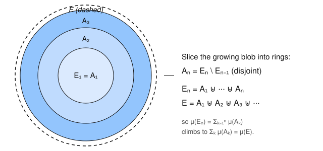

# Measure Theory · Lesson 1.3: Measures and their properties

> ⏱ ~15 min · Module 1: σ-algebras and the construction of measure · Builds on: [Lesson 1.2](01-02-sigma-algebras.md) (σ-algebras and measurable spaces) · Unlocks: [Lesson 1.4](01-04-outer-measure-caratheodory.md) (outer measure and Carathéodory)

## Why this matters

A σ-algebra (Lesson 1.2) says *which* sets we're allowed to measure. A **measure** is the function that actually assigns each of them a size — length, area, mass, probability. The astonishing thing is how little you have to demand of that function: just "the empty set has size zero" and "the size of a disjoint countable pile is the sum of the sizes." From those two axioms, *everything* you expect of size follows as a theorem — bigger sets weigh more, sizes of growing sets converge to the size of their union, overlapping pieces can only over-count. This lesson proves those consequences once and for all, so that when we build Lebesgue measure in Lesson 1.5 we get all of them for free. It's also the exact point where this course becomes the floor under probability: a *probability* is nothing but a measure whose total is $1$.

## The idea

Think of a measure as a way of weighing sets that never double-counts and never loses mass. The one substantive promise is **countable additivity**: if you break a set into countably many non-overlapping pieces, the weights of the pieces add up to the weight of the whole — no more, no less, even when there are infinitely many pieces. That single promise is strong enough to force size to behave: a set inside another can't outweigh it, and if you fill a set up by an increasing sequence of approximations, their weights climb continuously to the answer.

Why *countable* and not just finite? Because the whole point of Lebesgue's theory is to take limits — of sets, and later of functions. Finite additivity is what a schoolchild means by area; countable additivity is what lets area survive an infinite limiting process. It is the difference between a fragile theory and a robust one.

## The formal version

Throughout, $(X,\mathcal{A})$ is a **measurable space**: a set $X$ with a σ-algebra $\mathcal{A}$ of subsets (Lesson 1.2). We write $\biguplus_n E_n$ for a union we are asserting is **disjoint** ($E_i\cap E_j=\varnothing$ for $i\neq j$).

**Definition (measure).** A **measure** on $(X,\mathcal{A})$ is a function $\mu:\mathcal{A}\to[0,\infty]$ such that

1. $\mu(\varnothing)=0$, and
2. **(countable additivity)** for every sequence $E_1,E_2,\dots\in\mathcal{A}$ of pairwise disjoint sets,
$$\mu\!\left(\biguplus_{n=1}^{\infty} E_n\right)=\sum_{n=1}^{\infty}\mu(E_n).$$

The triple $(X,\mathcal{A},\mu)$ is a **measure space**. Values are allowed to be $+\infty$; the sum on the right is a sum of terms in $[0,\infty]$, so it always converges in $[0,\infty]$ (possibly to $\infty$).

*In words:* a measure is a non-negative, empty-set-vanishing set function whose value on a countable disjoint pile is the sum of its values on the pieces.

Two immediate remarks. **Finite additivity is included:** given disjoint $E_1,\dots,E_n$, pad the sequence with $E_{n+1}=E_{n+2}=\dots=\varnothing$; axiom 2 and $\mu(\varnothing)=0$ give $\mu(E_1\uplus\cdots\uplus E_n)=\sum_{k=1}^n\mu(E_k)$. And **axiom 1 is what rules out the useless $\mu\equiv\infty$:** without it, $\mu(\varnothing)=\mu(\varnothing\uplus\varnothing)=\mu(\varnothing)+\mu(\varnothing)$ only forces $\mu(\varnothing)\in\{0,\infty\}$, so we simply demand $0$.

Everything below is a **theorem**, proved from these two axioms alone.

**Monotonicity.** If $E\subseteq F$ (both in $\mathcal{A}$) then $\mu(E)\le\mu(F)$.
*Proof.* Write $F=E\uplus(F\setminus E)$, a disjoint union of two measurable sets. Finite additivity gives $\mu(F)=\mu(E)+\mu(F\setminus E)\ge\mu(E)$, since $\mu(F\setminus E)\ge 0$. $\blacksquare$
As a bonus, when $\mu(E)<\infty$ we may subtract: $\mu(F\setminus E)=\mu(F)-\mu(E)$. (The finiteness matters — you can't subtract $\infty$ from $\infty$.)

**Finite subadditivity.** $\mu(E\cup F)\le\mu(E)+\mu(F)$, disjoint or not.
*Proof.* $E\cup F=E\uplus(F\setminus E)$, so $\mu(E\cup F)=\mu(E)+\mu(F\setminus E)\le\mu(E)+\mu(F)$ using monotonicity on $F\setminus E\subseteq F$. $\blacksquare$

**Countable subadditivity.** For *any* sequence $E_1,E_2,\dots\in\mathcal{A}$ (no disjointness assumed),
$$\mu\!\left(\bigcup_{n=1}^\infty E_n\right)\le\sum_{n=1}^\infty\mu(E_n).$$
*Proof (disjointification).* Define $B_1=E_1$ and $B_n=E_n\setminus(E_1\cup\cdots\cup E_{n-1})$. The $B_n$ are pairwise disjoint, each $B_n\subseteq E_n$, and $\bigcup_n B_n=\bigcup_n E_n$. By countable additivity then monotonicity,
$$\mu\!\left(\bigcup_n E_n\right)=\mu\!\left(\biguplus_n B_n\right)=\sum_n\mu(B_n)\le\sum_n\mu(E_n).\qquad\blacksquare$$

**Continuity from below.** If $E_1\subseteq E_2\subseteq\cdots$ and $E=\bigcup_n E_n$ (written $E_n\uparrow E$), then $\mu(E_n)\to\mu(E)$.

**Continuity from above.** If $E_1\supseteq E_2\supseteq\cdots$ and $E=\bigcap_n E_n$ (written $E_n\downarrow E$) **and $\mu(E_1)<\infty$**, then $\mu(E_n)\to\mu(E)$.

*In words:* the size of a set is the limit of the sizes of any increasing sequence filling it up — and also of any decreasing sequence shrinking down to it, *provided you start from a set of finite measure.* Both are proved in the worked section; the finiteness proviso is not a technicality, and the counterexample below shows exactly what goes wrong without it.

**Definition (null set, complete measure).** A set $N\in\mathcal{A}$ with $\mu(N)=0$ is a **null set**. The measure $\mu$ is **complete** if every subset of a null set is itself in $\mathcal{A}$ (and hence null). By monotonicity a null set's *measurable* subsets are automatically null; completeness demands that even its non-measurable-looking subsets get swept in.

## Concrete instance

Three measures to keep in your head, from trivial to the one this whole course is building toward.

**Counting measure.** On any $X$ with $\mathcal{A}=2^X$ (all subsets), set $\mu(E)=$ the number of points in $E$ (and $\mu(E)=\infty$ if $E$ is infinite). Disjoint piles literally add their cardinalities, so it's a measure. On $X=\mathbb{N}$ this turns "integrate" into "sum a series" — the reason sequence spaces $\ell^p$ are just $L^p$ of the counting measure.

**Dirac measure $\delta_x$.** Fix a point $x\in X$. Define $\delta_x(E)=1$ if $x\in E$, else $0$. This is a unit mass sitting at $x$: a disjoint union contains $x$ in at most one piece, so exactly one term of $\sum_n\delta_x(E_n)$ is $1$ and the rest are $0$ — countable additivity holds. It is also our first **probability measure**, since $\delta_x(X)=1$.

**Lebesgue measure (forward reference).** The goal of Lessons 1.4–1.5: a measure $\lambda$ on $\mathbb{R}^n$ with $\lambda\big([a,b]\big)=b-a$ on intervals, translation-invariant, and *complete*. Building it is the entire point of the outer-measure machinery you meet next. Every property proved above will hold for it automatically.

## Worked examples

The two derivations this lesson is really about.

**Worked derivation — continuity from below.** Given $E_n\uparrow E$, disjointify into rings (Figure 1): put $A_1=E_1$ and $A_n=E_n\setminus E_{n-1}$ for $n\ge2$. Because the $E_n$ increase, the $A_n$ are pairwise disjoint, and
$$E_n=\biguplus_{k=1}^{n}A_k,\qquad E=\bigcup_{n}E_n=\biguplus_{k=1}^{\infty}A_k.$$
Apply countable additivity to $E$, then recognize the partial sums as $\mu(E_n)$ (finite additivity):
$$\mu(E)=\sum_{k=1}^{\infty}\mu(A_k)=\lim_{n\to\infty}\sum_{k=1}^{n}\mu(A_k)=\lim_{n\to\infty}\mu(E_n).$$
The definition of an infinite sum as the limit of its partial sums is doing all the work — continuity from below is *literally* countable additivity, reorganized. $\blacksquare$

**Worked derivation — continuity from above (and why finiteness is required).** Given $E_n\downarrow E$ with $\mu(E_1)<\infty$, look at the *complements inside $E_1$*: let $F_n=E_1\setminus E_n$. Since the $E_n$ shrink, the $F_n$ grow, and $F_n\uparrow E_1\setminus E$. Continuity from below gives $\mu(F_n)\to\mu(E_1\setminus E)$. Now cash in the finiteness: because $\mu(E_1)<\infty$, monotonicity lets us subtract, $\mu(F_n)=\mu(E_1)-\mu(E_n)$ and $\mu(E_1\setminus E)=\mu(E_1)-\mu(E)$. Substituting,
$$\mu(E_1)-\mu(E_n)\;\longrightarrow\;\mu(E_1)-\mu(E),$$
and cancelling the finite constant $\mu(E_1)$ gives $\mu(E_n)\to\mu(E)$. $\blacksquare$

**Counterexample without finiteness.** On $(\mathbb{R},\mathcal{B}(\mathbb{R}),\lambda)$ take $E_n=[n,\infty)$. These decrease, $E_n\downarrow\bigcap_n[n,\infty)=\varnothing$, so $\mu(E)=\lambda(\varnothing)=0$. But $\lambda(E_n)=\infty$ for every $n$, so $\lambda(E_n)\to\infty\neq0$. Continuity from above *fails*, and the only hypothesis we dropped was $\mu(E_1)<\infty$ (here $\mu(E_1)=\infty$). The mass "escapes to infinity" instead of concentrating on the limit. This is the standard warning: **from above needs a finite cap; from below never does.**

## Watch out

- You might think countable additivity is a mild upgrade of finite additivity — but it is a genuinely stronger axiom. There exist finitely-additive set functions that are not countably additive, and *all* of the limit theorems above (and the entire integration theory) depend on the countable version. Never prove an infinite-pile identity by finite additivity alone.
- You might think continuity from above always holds because "sets shrinking to a limit have shrinking measures." The $[n,\infty)$ example kills that intuition: you *must* have $\mu(E_n)<\infty$ for some $n$ (equivalently $\mu(E_1)<\infty$). From below carries no such caveat.
- You might think a null set must be small or even empty — but "measure zero" is about *weight*, not cardinality. Under Lebesgue measure $\mathbb{Q}$ is null yet dense and infinite (Lesson 1.5). And completeness is a property of the *measure*, not of $X$: it asks whether the σ-algebra is fat enough to contain every subset of every null set.

## One-liner

> A measure is just "empty weighs nothing" plus "disjoint countable piles add" — and from those two lines fall monotonicity, subadditivity, and the continuity of size along monotone sequences (downward only with a finite cap).

## Problems

**P1 (🟢)** Let $\mu$ be a measure on $(X,\mathcal{A})$ and let $E,F\in\mathcal{A}$ with $\mu(E\cap F)<\infty$. Prove the inclusion–exclusion identity $\mu(E\cup F)=\mu(E)+\mu(F)-\mu(E\cap F)$. Where exactly is the finiteness of $\mu(E\cap F)$ used?

**P2 (🟡)** Let $\delta_x$ and $\delta_y$ be Dirac measures at distinct points $x\neq y$ of $X$, and let $\mu=\tfrac12\delta_x+\tfrac12\delta_y$. Show $\mu$ is a measure and that it is a probability measure ($\mu(X)=1$). Then decide, with reasons, whether $\mu$ is **complete** when $\mathcal{A}=2^X$ and when $\mathcal{A}=\{\varnothing,\{x\},\{y\},\{x,y\}\}$ with $X=\{x,y,z\}$.

**P3 (🔴, optional)** Suppose $\mu$ is finitely additive on a σ-algebra $\mathcal{A}$ and satisfies continuity from below (i.e. $E_n\uparrow E\Rightarrow\mu(E_n)\to\mu(E)$). Prove that $\mu$ is in fact countably additive — so continuity from below is not merely a consequence of the measure axioms but *equivalent* to countable additivity (given finite additivity).

Solutions

**P1** Decompose each side into disjoint pieces. Write $E\cup F$ as the disjoint union
$$E\cup F=(E\setminus F)\;\uplus\;(E\cap F)\;\uplus\;(F\setminus E).$$
Also $E=(E\setminus F)\uplus(E\cap F)$ and $F=(F\setminus E)\uplus(E\cap F)$. By finite additivity,
$$\mu(E)+\mu(F)=\mu(E\setminus F)+\mu(E\cap F)+\mu(F\setminus E)+\mu(E\cap F)=\mu(E\cup F)+\mu(E\cap F).$$
Rearranging gives $\mu(E\cup F)=\mu(E)+\mu(F)-\mu(E\cap F)$. The subtraction is only legal because $\mu(E\cap F)<\infty$; if $\mu(E\cap F)=\infty$ then both sides are $\infty$ and the identity reads $\infty=\infty$ (true but content-free), while the *rearrangement* $\infty-\infty$ is undefined. $\blacksquare$

**P2** *Measure.* $\mu(\varnothing)=\tfrac12\delta_x(\varnothing)+\tfrac12\delta_y(\varnothing)=0$. For disjoint $E_1,E_2,\dots$, each of $\delta_x,\delta_y$ is countably additive, and a non-negative combination of countably-additive functions is countably additive:
$$\mu\Big(\biguplus_n E_n\Big)=\tfrac12\sum_n\delta_x(E_n)+\tfrac12\sum_n\delta_y(E_n)=\sum_n\Big(\tfrac12\delta_x(E_n)+\tfrac12\delta_y(E_n)\Big)=\sum_n\mu(E_n),$$
the middle step just reindexing two convergent non-negative series. *Probability.* $\mu(X)=\tfrac12\cdot1+\tfrac12\cdot1=1$ since $x,y\in X$.

*Completeness.* First, what are the null sets? $\mu(N)=0$ iff $N$ contains neither $x$ nor $y$. With $\mathcal{A}=2^X$: every subset of any set is already in $2^X$, so completeness holds trivially. With $X=\{x,y,z\}$ and $\mathcal{A}=\{\varnothing,\{x\},\{y\},\{x,y\}\}$: note $z$ appears in none of these, so $\{z\}\notin\mathcal{A}$ — but is $\{z\}$ a subset of a null set of $\mathcal{A}$? The null sets in $\mathcal{A}$ are just $\varnothing$ (the only member avoiding both $x,y$). Since $\{z\}\not\subseteq\varnothing$, there is no null set of which $\{z\}$ is a subset, so completeness is *not violated by $\{z\}$*. In fact the only null set is $\varnothing$, whose only subset $\varnothing$ lies in $\mathcal{A}$ — so this $\mu$ **is** complete on this $\mathcal{A}$ as well. (The instructive point: completeness can hold on a small σ-algebra precisely because it has so few null sets; incompleteness needs a null set with a missing subset, e.g. a nonempty null set none of whose proper nonempty subsets are measurable.) $\blacksquare$

**P3** Let $E_1,E_2,\dots\in\mathcal{A}$ be pairwise disjoint with union $E=\biguplus_n E_n$. Set the partial unions $S_N=\biguplus_{n=1}^N E_n\in\mathcal{A}$. Then $S_1\subseteq S_2\subseteq\cdots$ and $\bigcup_N S_N=E$, i.e. $S_N\uparrow E$. By finite additivity, $\mu(S_N)=\sum_{n=1}^N\mu(E_n)$. By the assumed continuity from below, $\mu(S_N)\to\mu(E)$. Therefore
$$\mu(E)=\lim_{N\to\infty}\mu(S_N)=\lim_{N\to\infty}\sum_{n=1}^{N}\mu(E_n)=\sum_{n=1}^{\infty}\mu(E_n),$$
which is exactly countable additivity. Combined with the derivation in the lesson (countable additivity $\Rightarrow$ continuity from below), the two are equivalent given finite additivity. $\blacksquare$

## Flashback

**From Lesson 1.2 (σ-algebras and measurable spaces):** Let $X$ be an *uncountable* set and define
$$\mathcal{A}=\{\,E\subseteq X:\ E\text{ is countable, or } X\setminus E\text{ is countable}\,\}$$
(the **countable–cocountable** collection). Verify that $\mathcal{A}$ is a σ-algebra on $X$. Then, in one sentence, say why $\mathcal{A}\neq 2^X$ for such $X$.

Solution

Check the three σ-algebra axioms.

1. **Contains $X$:** $X\setminus X=\varnothing$ is countable, so $X\in\mathcal{A}$. (And $\varnothing\in\mathcal{A}$ since $\varnothing$ is countable.)
2. **Closed under complement:** if $E\in\mathcal{A}$, then either $E$ or $X\setminus E$ is countable; that is exactly the condition, symmetric in $E$ and $X\setminus E$, for $X\setminus E\in\mathcal{A}$.
3. **Closed under countable unions:** let $E_1,E_2,\dots\in\mathcal{A}$ and $E=\bigcup_n E_n$. *Case A:* every $E_n$ is countable — then $E$ is a countable union of countable sets, hence countable, so $E\in\mathcal{A}$. *Case B:* some $E_{n_0}$ is cocountable, i.e. $X\setminus E_{n_0}$ is countable. Then $X\setminus E=\bigcap_n(X\setminus E_n)\subseteq X\setminus E_{n_0}$ is a subset of a countable set, hence countable, so $E$ is cocountable and $E\in\mathcal{A}$.

All three hold, so $\mathcal{A}$ is a σ-algebra. $\blacksquare$

Why $\mathcal{A}\neq 2^X$: because $X$ is uncountable, it can be split into two uncountable pieces (e.g. $X=\mathbb{R}$ split at $0$), and such a piece is neither countable nor cocountable, so it lies in $2^X$ but not in $\mathcal{A}$.

(Bridge to this lesson: setting $\mu(E)=0$ when $E$ is countable and $\mu(E)=1$ when $E$ is cocountable defines a genuine measure on this $\mathcal{A}$ — a good post-lesson check that you can verify the two axioms.)

## Connections

- **Backward:** this rests entirely on [Lesson 1.2](01-02-sigma-algebras.md) — a measure is only defined on a σ-algebra, and the closure axioms there are exactly what let the disjointification unions $B_n$, $A_n$ stay measurable in the subadditivity and continuity proofs.
- **Forward:** [Lesson 1.4](01-04-outer-measure-caratheodory.md) constructs Lebesgue outer measure $m^*$ (which is only *countably subadditive*, not additive) and uses the Carathéodory criterion to carve out the σ-algebra where it upgrades to a genuine measure obeying every property proved here. Continuity from below returns as a workhorse throughout Module 2, where it powers the Monotone Convergence Theorem ([Lesson 2.4](02-04-monotone-convergence-fatou.md)).
- **Sideways (probability theory):** a **probability measure** is exactly a measure with $\mu(X)=1$; monotonicity is "more events, more probability," continuity from below is the statement that $\mathbb{P}(A_n)\uparrow\mathbb{P}(A)$ for increasing events, and the Dirac $\delta_x$ is a point mass. This is the precise sense in which measure theory is the rigorous foundation under [probability-theory](../../probability-theory/syllabus.md) — expectation will turn out to be the Lebesgue integral against a probability measure.
