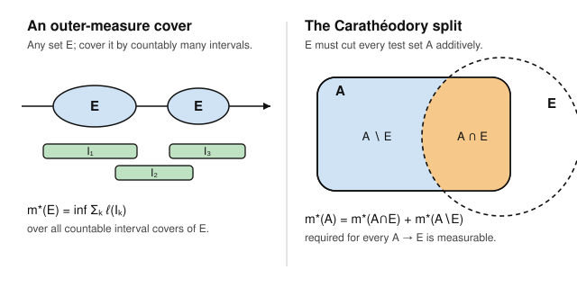

# Measure Theory · Lesson 1.4: Outer measure and the Carathéodory criterion

> ⏱ ~15 min · Module 1: σ-algebras and the construction of measure · Builds on: [Lesson 1.3](01-03-measures-properties.md) (measure axioms) · Unlocks: [Lesson 1.5](01-05-lebesgue-measure-rn.md) (Lebesgue measure on $\mathbb{R}^n$)

## Why this matters

Lesson 1.3 told you what a measure *is* — a countably additive, monotone set function. It did not hand you a single nontrivial example on $\mathbb{R}$. That is the real problem: we know the length of an interval, and we want a measure that agrees with it, is defined on as many sets as possible, and never breaks countable additivity. This lesson is the construction that delivers it, and the idea behind it — **define something crude on *all* sets, then keep only the sets it behaves well on** — is one of the most reused moves in analysis. It builds Lebesgue measure (Lesson 1.5), and the very same Carathéodory machine later produces Hausdorff measures, product measures ([Lesson 4.1](04-01-product-measures.md)), and every measure you meet in `probability-theory`.

## The idea

Start with the one thing that is not in dispute: the length of an interval $I = (a,b)$ is $\ell(I) = b - a$. Now take *any* set $E \subseteq \mathbb{R}$, however jagged. Drape it in a countable collection of intervals — a **cover** — and add up their lengths. That overshoots $E$'s "true size" (intervals overlap, spill past the edges), but it is an honest upper bound. Then squeeze: take the **infimum** of the total length over *all* countable covers. That infimum is the **Lebesgue outer measure** $m^*(E)$.

Two things make this attractive and one thing makes it fail.

- *Attractive:* $m^*$ is defined for **every** subset of $\mathbb{R}$ — no exceptions, no measurability hypotheses. And it is monotone and countably subadditive for free, just from the definition.
- *Fails:* $m^*$ is **not additive**. There exist disjoint sets $A, B$ with $m^*(A \cup B) < m^*(A) + m^*(B)$ — the whole becomes cheaper to cover than its parts, because a clever cover of the union exploits how the two bad sets interleave. A measure must never do this.

Carathéodory's fix is surgical. Instead of asking "is $E$ nice?" in some geometric way, he asks: **does $E$ slice every set cleanly?** A set $E$ is *measurable* if, for every test set $A$, cutting $A$ into its part inside $E$ and its part outside $E$ loses no outer measure:
$$m^*(A) = m^*(A \cap E) + m^*(A \setminus E).$$
Discard every set that fails this test. What remains, remarkably, is a σ-algebra, and $m^*$ restricted to it *is* a genuine countably additive measure. The pathology is quarantined; the survivors form the world we integrate over.

## The formal version

**Definition (Lebesgue outer measure).** For $E \subseteq \mathbb{R}$,
$$m^*(E) \;=\; \inf\left\{ \sum_{k=1}^{\infty} \ell(I_k) \;:\; E \subseteq \bigcup_{k=1}^{\infty} I_k,\ \text{each } I_k \text{ an open interval} \right\}.$$

*In words:* the cheapest total length of any countable family of open intervals that together swallow $E$. (Using open intervals, or all intervals, gives the same number; allowing finitely many by padding with empty intervals is harmless.)

Three properties hold for **all** sets, straight from the definition.

**(O1) Monotonicity.** If $E \subseteq F$ then $m^*(E) \le m^*(F)$.
*Why:* every cover of $F$ is also a cover of $E$, so the infimum for $E$ is taken over a larger family and can only be smaller.

**(O2) Countable subadditivity.** $m^*\!\left(\bigcup_{k} E_k\right) \le \sum_{k} m^*(E_k)$.
*In words:* covering the pieces separately and pooling the intervals is one way to cover the union, so it can't beat the best cover. (Proved below — this is the $\varepsilon/2^k$ trick.)

**(O3) Agreement on intervals.** $m^*(I) = \ell(I)$ for every interval $I$.
*In words:* outer measure genuinely extends length. The easy half is $m^*(I) \le \ell(I)$ (cover $I$ by itself). The hard half, $m^*(I) \ge \ell(I)$, says you cannot cover $[a,b]$ with intervals of total length $< b-a$; the proof reduces a candidate cover to a *finite* subcover using **Heine–Borel compactness**, then adds up lengths along the line. We take (O3) as established here and revisit the compactness argument in [Lesson 1.5](01-05-lebesgue-measure-rn.md).

Now the crux.

**Definition (Carathéodory measurability).** A set $E \subseteq \mathbb{R}$ is **$m^*$-measurable** if
$$m^*(A) = m^*(A \cap E) + m^*(A \setminus E) \qquad \text{for every } A \subseteq \mathbb{R}.$$
Write $\mathcal{M}$ for the collection of all such sets.

*In words:* $E$ is measurable when it partitions every test set additively. Note the $A$ ranges over *all* sets, including ones straddling the boundary of $E$ — that universality is exactly what makes the criterion strong enough to force additivity.

**One-sided reduction (use this constantly).** By subadditivity (O2), since $A = (A \cap E) \cup (A \setminus E)$,
$$m^*(A) \le m^*(A \cap E) + m^*(A \setminus E)$$
holds *automatically*, for every $A$ and every $E$. So to prove $E \in \mathcal{M}$ you only ever check the reverse inequality
$$m^*(A) \;\ge\; m^*(A \cap E) + m^*(A \setminus E).$$

**Carathéodory's theorem.** $\mathcal{M}$ is a σ-algebra containing every interval, and $m := m^*\big|_{\mathcal{M}}$ is a **complete, countably additive measure** on $\mathcal{M}$.

*In words:* the sets that split additively are closed under complements and countable unions, they include the sets we care about, and on them outer measure obeys every axiom from Lesson 1.3 — plus completeness (every subset of a measure-zero set is measurable). We prove the two easiest structural pieces below and in the Problems ($E^c$, finite unions, null sets); the countable-union step layers subadditivity over the finite one and is finished in Lesson 1.5.

## Picture

Left: $m^*(E)$ is the tightest total interval-length you can drape over $E$. Right: $E$ is measurable exactly when, for *every* possible $A$, the orange piece $A \cap E$ and the blue piece $A \setminus E$ together account for all of $m^*(A)$ — no measure leaks at the boundary.

## Worked examples

**Example 1 — countable subadditivity, the $\varepsilon/2^k$ trick (proof of O2).**
Let $E = \bigcup_{k=1}^\infty E_k$. If some $m^*(E_k) = \infty$ the right-hand side is $\infty$ and there is nothing to prove, so assume every $m^*(E_k) < \infty$. Fix $\varepsilon > 0$. For each $k$, the infimum defining $m^*(E_k)$ gives a countable cover $\{I_{k,j}\}_{j}$ of $E_k$ that beats the infimum by at most $\varepsilon/2^k$:
$$\sum_{j} \ell(I_{k,j}) \;\le\; m^*(E_k) + \frac{\varepsilon}{2^k}.$$
The doubly-indexed family $\{I_{k,j}\}_{k,j}$ is a *countable* collection (a countable union of countable sets), and it covers $E$. Hence
$$m^*(E) \;\le\; \sum_{k}\sum_{j} \ell(I_{k,j}) \;\le\; \sum_{k}\left(m^*(E_k) + \frac{\varepsilon}{2^k}\right) \;=\; \sum_{k} m^*(E_k) + \varepsilon.$$
The geometric budget $\sum_k \varepsilon/2^k = \varepsilon$ is the whole point: a shrinking allowance per set keeps the total error bounded. Since $\varepsilon > 0$ was arbitrary, $m^*(E) \le \sum_k m^*(E_k)$. $\blacksquare$

**Example 2 — verifying the criterion: every null set is measurable (this is completeness).**
Suppose $m^*(E) = 0$. We check $E \in \mathcal{M}$ using the one-sided reduction. Let $A$ be any test set. Since $A \cap E \subseteq E$, monotonicity (O1) gives
$$m^*(A \cap E) \le m^*(E) = 0, \qquad\text{so}\qquad m^*(A \cap E) = 0.$$
And $A \setminus E \subseteq A$, so $m^*(A \setminus E) \le m^*(A)$. Adding,
$$m^*(A \cap E) + m^*(A \setminus E) = 0 + m^*(A \setminus E) \le m^*(A).$$
That is the reverse inequality, and the forward one is automatic, so equality holds for every $A$: $E \in \mathcal{M}$. The same argument shows *any* subset of a null set is measurable (a subset also has outer measure $0$ by monotonicity) — precisely the statement that the measure is **complete**. This is why Lebesgue measure has no "invisible" tiny sets sitting just outside its domain, unlike its restriction to the Borel σ-algebra ([Lesson 1.5](01-05-lebesgue-measure-rn.md)).

## Watch out

- **You might think $m^*$ is a measure.** It is not — it fails countable (even finite) additivity on general sets; the disjoint bad sets of [Lesson 1.6](01-06-non-measurable-set.md) make $m^*(A \cup B) < m^*(A) + m^*(B)$. It is only *sub*additive. Additivity is bought by restricting to $\mathcal{M}$; that restriction is the entire content of the Carathéodory theorem.
- **You might think you must prove both inequalities in the criterion.** You never do. Subadditivity gives $m^*(A) \le m^*(A\cap E) + m^*(A\setminus E)$ for *free*; measurability is only ever the reverse "$\ge$". Forgetting this doubles your work and hides the actual idea.
- **You might read the criterion as "$E$ splits itself."** The test set $A$ is arbitrary and external — it is not $E$. Checking only $A = E$ (or $A \subseteq E$) is trivially satisfied by every set and proves nothing. The strength comes entirely from $A$'s that straddle $E$'s boundary.
- **$m^*(E) = 0$ is not the same as $E = \varnothing$.** Every countable set — $\mathbb{Q}$, for instance — has outer measure $0$ (Problem 1), yet is dense and infinite. "Negligible" is a measure statement, not a topological one.

## One-liner

> Outer measure covers *everything* but is only subadditive; Carathéodory keeps exactly the sets that split every test set additively, and on those survivors $m^*$ becomes a real measure.

## Problems

**P1 (🟢)** Prove that every countable set $C = \{c_1, c_2, \dots\} \subseteq \mathbb{R}$ has $m^*(C) = 0$. (Hint: cover $c_k$ by an interval of length $\varepsilon/2^k$.) Deduce $m^*(\mathbb{Q} \cap [0,1]) = 0$ — the measure-theoretic reason the Dirichlet function of [Lesson 1.1](01-01-where-riemann-fails.md) is "small."

**P2 (🟡)** Prove that Lebesgue outer measure is **translation invariant**: for every $E \subseteq \mathbb{R}$ and every $x \in \mathbb{R}$, $m^*(E + x) = m^*(E)$, where $E + x = \{e + x : e \in E\}$. (This is one of the two pillars of the non-measurable-set construction in [Lesson 1.6](01-06-non-measurable-set.md).)

**P3 (🔴, optional)** Prove that $\mathcal{M}$ is closed under finite unions: if $E_1, E_2 \in \mathcal{M}$ then $E_1 \cup E_2 \in \mathcal{M}$. (This, with closure under complements, makes $\mathcal{M}$ an algebra — the last mile to a σ-algebra is upgrading finite to countable unions.)

Solutions

**P1** Fix $\varepsilon > 0$. Cover the $k$-th point by the open interval $I_k = \left(c_k - \tfrac{\varepsilon}{2^{k+1}},\ c_k + \tfrac{\varepsilon}{2^{k+1}}\right)$, which has length $\ell(I_k) = \varepsilon/2^{k}$ and contains $c_k$. Then $C \subseteq \bigcup_k I_k$, so
$$m^*(C) \le \sum_{k=1}^{\infty} \ell(I_k) = \sum_{k=1}^{\infty} \frac{\varepsilon}{2^{k}} = \varepsilon.$$
Since $\varepsilon > 0$ was arbitrary and $m^*(C) \ge 0$, we get $m^*(C) = 0$. As $\mathbb{Q}\cap[0,1]$ is countable, $m^*(\mathbb{Q}\cap[0,1]) = 0$. Thus the set on which the Dirichlet function equals $1$ is measure-zero, so that function is $0$ almost everywhere — exactly why it has Lebesgue integral $0$ though it is Riemann-nonintegrable. $\blacksquare$

**P2** The map $I \mapsto I + x$ is a bijection from intervals to intervals preserving length: if $I = (a,b)$ then $I + x = (a+x, b+x)$ has $\ell(I+x) = (b+x)-(a+x) = b - a = \ell(I)$. Now if $\{I_k\}$ is any countable cover of $E$, then $\{I_k + x\}$ is a cover of $E + x$ (translating a point of $E$ by $x$ lands it in the translate of whatever interval contained it), with identical total length. Hence every cover of $E$ yields a cover of $E+x$ of the same cost, so
$$m^*(E + x) \le \sum_k \ell(I_k + x) = \sum_k \ell(I_k),$$
and taking the infimum over covers of $E$ gives $m^*(E+x) \le m^*(E)$. Applying the same inequality to the set $E + x$ and the shift $-x$ gives $m^*(E) = m^*((E+x) + (-x)) \le m^*(E+x)$. The two inequalities force $m^*(E+x) = m^*(E)$. $\blacksquare$

**P3** Let $A$ be an arbitrary test set; by the one-sided reduction it suffices to show
$$m^*(A) \ge m^*\big(A \cap (E_1 \cup E_2)\big) + m^*\big(A \setminus (E_1 \cup E_2)\big).$$
Apply measurability of $E_1$ with test set $A$:
$$m^*(A) = m^*(A \cap E_1) + m^*(A \setminus E_1).$$
Now apply measurability of $E_2$ with the test set $A \setminus E_1$:
$$m^*(A \setminus E_1) = m^*\big((A \setminus E_1) \cap E_2\big) + m^*\big((A \setminus E_1) \setminus E_2\big).$$
Since $(A \setminus E_1)\setminus E_2 = A \setminus (E_1 \cup E_2)$, substituting gives
$$m^*(A) = m^*(A \cap E_1) + m^*\big((A \setminus E_1)\cap E_2\big) + m^*\big(A \setminus (E_1 \cup E_2)\big). \tag{$\ast$}$$
The set $A \cap (E_1 \cup E_2)$ decomposes as $(A \cap E_1) \cup \big((A \setminus E_1) \cap E_2\big)$: a point of $A$ lying in $E_1 \cup E_2$ is either in $E_1$ (first piece) or outside $E_1$ but in $E_2$ (second piece). By subadditivity (O2),
$$m^*(A \cap E_1) + m^*\big((A \setminus E_1)\cap E_2\big) \ge m^*\big(A \cap (E_1 \cup E_2)\big).$$
Feeding this into $(\ast)$,
$$m^*(A) \ge m^*\big(A \cap (E_1 \cup E_2)\big) + m^*\big(A \setminus (E_1 \cup E_2)\big),$$
which is the reverse inequality we needed. Hence $E_1 \cup E_2 \in \mathcal{M}$. $\blacksquare$

## Flashback

**From Lesson 1.3 (measures and their properties).** Continuity from above states: if $E_1 \supseteq E_2 \supseteq \cdots$ is a decreasing sequence of measurable sets and $\mu(E_1) < \infty$, then $\mu\!\left(\bigcap_n E_n\right) = \lim_{n} \mu(E_n)$. Show by an explicit example that the finiteness hypothesis $\mu(E_1) < \infty$ cannot be dropped.

Solution

Take $\mu = m$ (Lebesgue measure, which this lesson is busy constructing) on $\mathbb{R}$, and set $E_n = [n, \infty)$. These are nested downward, $E_1 \supseteq E_2 \supseteq \cdots$, and their intersection is empty: no real number exceeds every $n$, so $\bigcap_n E_n = \varnothing$ and $\mu\!\left(\bigcap_n E_n\right) = 0$. But each $E_n$ is an unbounded interval, so $\mu(E_n) = \infty$ for every $n$, giving $\lim_n \mu(E_n) = \infty \ne 0$. Continuity from above fails precisely because **no** $E_n$ has finite measure — in particular $\mu(E_1) = \infty$, so the hypothesis is violated. (Contrast continuity from *below*, which needs no finiteness assumption; the asymmetry comes from the fact that the proof of continuity-from-above subtracts measures, and $\infty - \infty$ is meaningless.) $\blacksquare$

## Connections

- **Backward:** This constructs the first real example of the abstract measure from [Lesson 1.3](01-03-measures-properties.md); "complete measure" and "null set" from that lesson are exactly what Example 2 delivers here. Countable subadditivity uses the sup/inf and geometric-series facts assumed from real-analysis.
- **Forward:** [Lesson 1.5](01-05-lebesgue-measure-rn.md) upgrades $\mathcal{M}$'s closure under finite unions (Problem 3) to countable unions, pins down $m^*(I) = \ell(I)$ via Heine–Borel, and proves translation invariance (Problem 2) for the finished measure. [Lesson 1.6](01-06-non-measurable-set.md) exhibits the disjoint sets on which $m^*$ is not additive — the pathology this whole apparatus exists to exclude. The Carathéodory construction returns for product measures in [Lesson 4.1](04-01-product-measures.md).
- **Sideways (probability):** in `probability-theory`, a probability measure is built by this exact recipe with total mass $1$; "almost surely" is "outside a null set," the completeness proved in Example 2. The interplay of null sets and completeness also underlies the a.e.-defined function spaces $L^p$ of `functional-analysis`.
