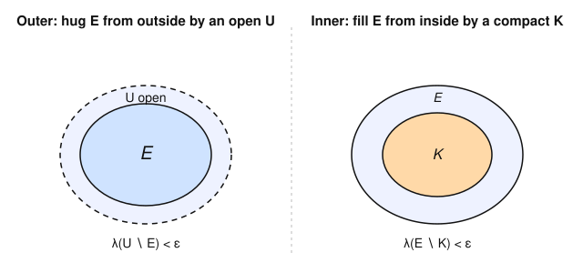

# Measure Theory · Lesson 1.5: Lebesgue measure on $\mathbb{R}^n$

> ⏱ ~15 min · Module 1: σ-algebras and the construction of measure · Builds on: [Lesson 1.4](01-04-outer-measure-caratheodory.md) (outer measure and the Carathéodory criterion) · Unlocks: [Lesson 1.6](01-06-non-measurable-set.md) (a non-measurable set)

## Why this matters

Lesson 1.4 did the hard machinery: it turned the outer measure $m^*$ — an infimum over box-covers, defined on *every* subset of $\mathbb{R}^n$ — into a genuine measure by carving out the Carathéodory-measurable sets. That construction is abstract. This lesson cashes it in for the object the rest of analysis actually uses: **Lebesgue measure** $\lambda$, the notion of "$n$-dimensional volume" that assigns $1$ to the unit cube, doesn't move when you slide a set around, and is rich enough to measure every set you can build by countable operations on open sets. Its three defining virtues — translation invariance, regularity, and completeness — are exactly the properties every downstream theorem quietly assumes. Translation invariance is also the property that will *break* in the next lesson, forcing a non-measurable set into existence.

## The idea

We already have $m^*$ on all subsets and a σ-algebra $\mathcal{L}$ of well-behaved ("measurable") sets on which $m^*$ is countably additive. **Lebesgue measure is just $m^*$ with its domain cut down to $\mathcal{L}$** — no new construction, only a restriction. All the personality of $\lambda$ is inherited from the box-cover definition of $m^*$, so every property we want traces back to one fact about boxes.

Three things we insist $\lambda$ must satisfy, each a plain-English demand:

- **Translation invariance.** Sliding a set by a vector $x$ doesn't change its volume. This is *forced* by the cover definition: translate a box-cover of $E$ and you get a box-cover of $E+x$ with the same total volume, because a box's volume doesn't depend on *where* it sits.
- **Regularity.** A measurable set is "almost open" and "almost compact." From the *outside* you can hug it arbitrarily tightly by an open set; from the *inside* you can fill it arbitrarily well by a compact set. So even a fractal-looking measurable set is a whisker away from the friendly sets of topology.
- **Completeness.** Anything sitting inside a set of volume zero is itself measurable (with volume zero). No "invisible" subset of a negligible set can sneak past $\lambda$.

And one structural payoff: the **Borel sets** — everything you can generate from open sets by countable unions, intersections, complements — are all measurable, and $\mathcal{L}$ is exactly the Borel σ-algebra *completed* by throwing in every subset of every null set. So a Lebesgue set is a Borel set, blurred by a negligible smudge.

## The formal version

**Boxes and volume.** A *box* (or rectangle) in $\mathbb{R}^n$ is a product of intervals $Q = \prod_{i=1}^n [a_i, b_i]$ (open, closed, or half-open — it won't matter for $m^*$). Its *volume* is
$$|Q| \;=\; \prod_{i=1}^n (b_i - a_i).$$
Recall from Lesson 1.4 the **Lebesgue outer measure**
$$m^*(E) \;=\; \inf\Big\{ \textstyle\sum_{j=1}^\infty |Q_j| \;:\; E \subseteq \bigcup_{j=1}^\infty Q_j,\ \ Q_j \text{ boxes}\Big\},$$
the infimum of total cover-volume over all countable box-covers of $E$.

**Definition (Lebesgue measure).** Let $\mathcal{L}$ be the σ-algebra of Carathéodory-measurable sets from Lesson 1.4 — those $E$ with $m^*(A) = m^*(A\cap E) + m^*(A\cap E^c)$ for every test set $A\subseteq\mathbb{R}^n$. **Lebesgue measure** is the restriction
$$\lambda \;:=\; m^*\big|_{\mathcal{L}}.$$
Carathéodory's theorem (1.4) guarantees $\lambda$ is a countably additive measure on $\mathcal{L}$.

*In words:* Lebesgue measure is nothing but the outer measure, evaluated only on the sets where it behaves.

**Theorem (completeness).** If $N\in\mathcal{L}$ with $\lambda(N)=0$ and $F\subseteq N$, then $F\in\mathcal{L}$ and $\lambda(F)=0$. In fact *every* $m^*$-null set is measurable.

*In words:* subsets of negligible sets are negligible — no exceptions.

*Proof.* Let $m^*(N)=0$ and $F\subseteq N$. By monotonicity of $m^*$, $m^*(F)\le m^*(N)=0$, so $m^*(F)=0$. Now check $F$ satisfies the Carathéodory criterion. For any test set $A$, subadditivity gives $m^*(A)\le m^*(A\cap F)+m^*(A\cap F^c)$ for free. For the reverse: $A\cap F\subseteq F$ so $m^*(A\cap F)\le m^*(F)=0$, and $A\cap F^c\subseteq A$ so $m^*(A\cap F^c)\le m^*(A)$. Adding, $m^*(A\cap F)+m^*(A\cap F^c)\le 0+m^*(A)=m^*(A)$. Equality holds, so $F\in\mathcal{L}$. $\blacksquare$

**Theorem (translation invariance).** For every $E\subseteq\mathbb{R}^n$ and $x\in\mathbb{R}^n$, writing $E+x=\{e+x:e\in E\}$,
$$m^*(E+x)=m^*(E).$$
Moreover $E\in\mathcal{L}\iff E+x\in\mathcal{L}$, so $\lambda(E+x)=\lambda(E)$ for measurable $E$.

*In words:* sliding a set never changes its (outer) measure. Proof in Worked Example 1.

**Theorem (regularity).** Let $E\in\mathcal{L}$.
- **(Outer)** For every $\varepsilon>0$ there is an *open* $U\supseteq E$ with $\lambda(U\setminus E)<\varepsilon$. Equivalently $\lambda(E)=\inf\{\lambda(U): U\supseteq E \text{ open}\}$.
- **(Inner)** $\lambda(E)=\sup\{\lambda(K): K\subseteq E \text{ compact}\}$; when $\lambda(E)<\infty$, for every $\varepsilon>0$ there is a compact $K\subseteq E$ with $\lambda(E\setminus K)<\varepsilon$.

*In words:* every measurable set can be squeezed between an open set barely bigger and a compact set barely smaller.

*Proof of outer regularity (case $\lambda(E)<\infty$).* By definition of the infimum, choose a box-cover $E\subseteq\bigcup_j Q_j$ with $\sum_j |Q_j| < m^*(E)+\varepsilon$. Enlarge each $Q_j$ to an *open* box $Q_j^\circ\supseteq Q_j$ with $|Q_j^\circ| < |Q_j| + \varepsilon\,2^{-j}$ (fatten each side length slightly). Then $U:=\bigcup_j Q_j^\circ$ is open, $U\supseteq E$, and by subadditivity
$$\lambda(U)\le\sum_j |Q_j^\circ| < \sum_j |Q_j| + \varepsilon < m^*(E)+2\varepsilon.$$
Since $E\subseteq U$ are both measurable and $\lambda(E)<\infty$, additivity gives $\lambda(U\setminus E)=\lambda(U)-\lambda(E)<2\varepsilon$. Rescale $\varepsilon$. (For $\lambda(E)=\infty$, slice $E$ into the bounded pieces $E\cap([-k,k]^n\setminus[-(k{-}1),k{-}1]^n)$, approximate each with error $\varepsilon\,2^{-k}$, and union the open sets.) $\blacksquare$

*Proof of inner regularity (case $\lambda(E)<\infty$).* Apply outer regularity to the complement $E^c\in\mathcal{L}$: get open $U\supseteq E^c$ with $\lambda(U\setminus E^c)<\varepsilon$. Set $F:=U^c$, a *closed* set with $F\subseteq E$, and note $E\setminus F = E\cap U = U\setminus E^c$, so $\lambda(E\setminus F)<\varepsilon$. Finally trade closed for compact: $K_R:=F\cap\overline{B(0,R)}$ is compact, $K_R\uparrow F$, so by continuity from below $\lambda(K_R)\to\lambda(F)$; pick $R$ large enough that $\lambda(E\setminus K_R)<2\varepsilon$. (If $\lambda(E)=\infty$ the compact exhaustion gives $\lambda(K_R)\to\infty$, so the supremum is $\infty=\lambda(E)$.) $\blacksquare$

**Theorem (Borel $\subseteq$ Lebesgue, and $\mathcal{L}$ is the completion).** Let $\mathcal{B}(\mathbb{R}^n)$ be the Borel σ-algebra (generated by the open sets).
1. $\mathcal{B}(\mathbb{R}^n)\subseteq\mathcal{L}$: every Borel set is Lebesgue measurable.
2. For every $E\in\mathcal{L}$ there is a $G_\delta$ set $G\supseteq E$ (a countable intersection of open sets, hence Borel) with $\lambda(G\setminus E)=0$. Thus $E=G\setminus(G\setminus E)$ differs from a Borel set by a null set — i.e. $\mathcal{L}$ is exactly $\mathcal{B}$ completed by the null sets.

*In words:* Borel sets are always measurable, and every measurable set is a Borel set corrected by something invisible to $\lambda$.

*Proof.* (1) One checks from the Carathéodory criterion that every box is measurable (splitting any test set across a box's bounding hyperplanes is additive — this is the concrete computation from 1.4). Every open subset of $\mathbb{R}^n$ is a countable union of boxes (e.g. dyadic cubes), so open sets lie in the σ-algebra $\mathcal{L}$. Since $\mathcal{B}(\mathbb{R}^n)$ is the *smallest* σ-algebra containing the open sets and $\mathcal{L}$ is *a* σ-algebra containing them, $\mathcal{B}\subseteq\mathcal{L}$. (2) By outer regularity pick open $U_k\supseteq E$ with $\lambda(U_k\setminus E)<1/k$, and set $G:=\bigcap_k U_k$. Then $G$ is $G_\delta$, $E\subseteq G$, and $\lambda(G\setminus E)\le\lambda(U_k\setminus E)<1/k$ for every $k$, forcing $\lambda(G\setminus E)=0$. $\blacksquare$

## Picture

Regularity says a measurable $E$ is trapped between two friendly sets: an open $U$ only $\varepsilon$ bigger and a compact $K$ only $\varepsilon$ smaller. The two slivers $U\setminus E$ and $E\setminus K$ can be made to have as little measure as you like — that is the precise sense in which "measurable = almost open = almost closed."

## Worked examples

**Example 1 (mechanical — translation invariance of $m^*$).** *Claim:* $m^*(E+x)=m^*(E)$ for all $E\subseteq\mathbb{R}^n$, $x\in\mathbb{R}^n$.

Start with the one fact that carries everything: **a box's volume is translation-invariant.** Translating $Q=\prod_i[a_i,b_i]$ by $x$ gives $Q+x=\prod_i[a_i+x_i,\,b_i+x_i]$, whose $i$-th side length is $(b_i+x_i)-(a_i+x_i)=b_i-a_i$, unchanged. Hence $|Q+x|=|Q|$.

Now take any box-cover $E\subseteq\bigcup_j Q_j$. If $e\in E$ then $e\in Q_j$ for some $j$, so $e+x\in Q_j+x$; therefore $E+x\subseteq\bigcup_j (Q_j+x)$ is covered by the translated boxes, with the *same* total volume $\sum_j|Q_j+x|=\sum_j|Q_j|$. Every cover of $E$ thus yields a cover of $E+x$ of equal cost, so taking the infimum,
$$m^*(E+x)\le m^*(E).$$
This holds for *all* sets and all shifts, so apply it to the set $E+x$ and the shift $-x$: $m^*(E)=m^*((E+x)+(-x))\le m^*(E+x)$. The two inequalities give $m^*(E+x)=m^*(E)$. $\blacksquare$

Measurability transfers too: because the Carathéodory criterion is written entirely in terms of $m^*$ and unions/intersections commute with the translation $A\mapsto A+x$, testing $E+x$ against $A$ is the same as testing $E$ against $A-x$. So $E\in\mathcal{L}\iff E+x\in\mathcal{L}$, and then $\lambda(E+x)=m^*(E+x)=m^*(E)=\lambda(E)$.

**Example 2 (why you'd care — outer regularity on a concrete set).** Let $E=\mathbb{Q}\cap[0,1]$, the rationals in the unit interval — the very set the Dirichlet function was built on in [Lesson 1.1](01-01-where-riemann-fails.md), the one Riemann's integral choked on. Enumerate it as $E=\{r_1,r_2,r_3,\dots\}$. Fix $\varepsilon>0$ and around each $r_k$ put the open interval
$$I_k=\Big(r_k-\tfrac{\varepsilon}{2^{k+1}},\ r_k+\tfrac{\varepsilon}{2^{k+1}}\Big),\qquad |I_k|=\tfrac{\varepsilon}{2^{k}}.$$
Then $U:=\bigcup_k I_k$ is open, $U\supseteq E$, and by countable subadditivity
$$\lambda(U)\le\sum_{k=1}^\infty|I_k|=\sum_{k=1}^\infty\frac{\varepsilon}{2^k}=\varepsilon.$$
So $E$ is hugged from outside by an open set of measure $\le\varepsilon$, for every $\varepsilon$. Since $0\le\lambda(E)\le\lambda(U)\le\varepsilon$ for all $\varepsilon>0$, we conclude $\lambda(\mathbb{Q}\cap[0,1])=0$. A dense set — one that touches every subinterval — is still *negligible* to Lebesgue. That is precisely why $\lambda$ succeeds where Riemann failed: the "size" of a set has nothing to do with how spread out it looks.

## Watch out

- You might think outer regularity says $\lambda(E)=\lambda(\overline{E})$ or that you can approximate by *closed* sets from outside — but the outside approximant must be **open**, and the closure can be far too big ($\overline{\mathbb{Q}\cap[0,1]}=[0,1]$ has measure $1$, not $0$). It is the *interior* approximation that uses compact/closed sets.
- You might think "$\mathcal{L}=\mathcal{B}$." Not quite: $\mathcal{L}$ is strictly larger. There are $2^{\mathfrak c}$ Lebesgue sets but only $\mathfrak c$ Borel sets, and the extra ones are precisely the non-Borel subsets of null sets (e.g. subsets of the measure-zero Cantor set). What's true is $\mathcal{L}=\mathcal{B}$ *up to null sets*.
- You might think translation invariance is a deep theorem — it's the box-volume computation and one infimum argument. What's deep is that *no* countably additive, translation-invariant measure can be defined on **all** subsets of $\mathbb{R}$ with $\lambda([0,1])=1$; that clash is the engine of [Lesson 1.6](01-06-non-measurable-set.md).

## One-liner

> Lebesgue measure is the outer measure restricted to where it's additive: it doesn't move when you slide a set, it's trapped between an open set just bigger and a compact set just smaller, and every measurable set is a Borel set blurred by a null smudge.

## Problems

**P1 (🟢)** Give an explicit open set $U\supseteq[0,1]$ in $\mathbb{R}$ with $\lambda(U\setminus[0,1])<\varepsilon$, and confirm it directly. Then, using translation invariance, do the same for the shifted interval $[7,8]$ with a single sentence rather than a fresh computation.

**P2 (🟡)** Prove that $\mathcal{L}$ is closed under translation: if $E\in\mathcal{L}$ then $E+x\in\mathcal{L}$ for every $x\in\mathbb{R}^n$. (Use the Carathéodory criterion and translation invariance of $m^*$ from Example 1; the key move is that intersecting the shifted set $E+x$ with a test set $A$ is the same as intersecting $E$ with the shifted test set $A-x$.)

**P3 (🔴, optional)** Prove the "$G_\delta$ hull" refinement: for every $E\in\mathcal{L}$ (no finiteness assumption) there is a $G_\delta$ set $G\supseteq E$ with $\lambda(G\setminus E)=0$. (Handle $\lambda(E)=\infty$ by first splitting $\mathbb{R}^n$ into the bounded shells $S_k=\{x: k-1\le|x|<k\}$.)

Solutions

**P1** Take $U=\left(-\tfrac{\varepsilon}{2},\,1+\tfrac{\varepsilon}{2}\right)$. It is open and contains $[0,1]$. Since $[0,1]\subseteq U$ are both measurable, $\lambda(U\setminus[0,1])=\lambda(U)-\lambda([0,1])=\left(1+\varepsilon\right)-1=\varepsilon$. (If you want strict $<\varepsilon$, use radius $\varepsilon/3$ instead, giving $\lambda(U\setminus[0,1])=2\varepsilon/3<\varepsilon$.)

For $[7,8]$: it is the translate $[0,1]+7$, so by translation invariance the open set $U+7=\left(7-\tfrac{\varepsilon}{2},\,8+\tfrac{\varepsilon}{2}\right)$ contains it with $\lambda\big((U+7)\setminus[7,8]\big)=\lambda(U\setminus[0,1])=\varepsilon$ — no recomputation needed.

**P2** Let $E\in\mathcal{L}$ and fix $x$. We must show $E+x$ satisfies the Carathéodory criterion: $m^*(A)=m^*(A\cap(E+x))+m^*(A\cap(E+x)^c)$ for every test set $A$.

First, two set identities. For any $A$,
$$A\cap(E+x)=\big[(A-x)\cap E\big]+x,\qquad A\cap(E+x)^c=A\cap(E^c+x)=\big[(A-x)\cap E^c\big]+x,$$
because $y\in A\cap(E+x)$ iff $y\in A$ and $y-x\in E$, iff $y-x\in(A-x)\cap E$. (Also $(E+x)^c=E^c+x$: translation is a bijection.)

Now apply translation invariance of $m^*$ (Example 1) to each piece:
$$m^*\big(A\cap(E+x)\big)=m^*\big((A-x)\cap E\big),\qquad m^*\big(A\cap(E+x)^c\big)=m^*\big((A-x)\cap E^c\big).$$
Adding and using that $E\in\mathcal{L}$ tested against the set $A-x$,
$$m^*\big(A\cap(E+x)\big)+m^*\big(A\cap(E+x)^c\big)=m^*\big((A-x)\cap E\big)+m^*\big((A-x)\cap E^c\big)=m^*(A-x).$$
Finally $m^*(A-x)=m^*(A)$ by translation invariance again. So the criterion holds for $E+x$, i.e. $E+x\in\mathcal{L}$. $\blacksquare$

**P3** *Finite case first.* If $\lambda(E)<\infty$, outer regularity gives open $U_k\supseteq E$ with $\lambda(U_k\setminus E)<1/k$. Put $G=\bigcap_{k\ge1}U_k$: a countable intersection of open sets, hence $G_\delta$, with $E\subseteq G\subseteq U_k$ for each $k$. Then $G\setminus E\subseteq U_k\setminus E$, so $\lambda(G\setminus E)\le\lambda(U_k\setminus E)<1/k$ for all $k$; letting $k\to\infty$ gives $\lambda(G\setminus E)=0$.

*Infinite case.* Split $\mathbb{R}^n$ into the disjoint bounded shells $S_k=\{x:k-1\le|x|<k\}$, $k\ge1$, and let $E_k=E\cap S_k$. Each $E_k$ is measurable with $\lambda(E_k)\le\lambda(S_k)<\infty$, so by the finite case there is a $G_\delta$ set $G_k\supseteq E_k$ with $\lambda(G_k\setminus E_k)=0$. Set $G=\bigcup_k G_k$. Then $G\supseteq\bigcup_k E_k=E$, and
$$G\setminus E=\Big(\bigcup_k G_k\Big)\setminus E\subseteq\bigcup_k(G_k\setminus E_k),$$
since any point of $G\setminus E$ lies in some $G_k$ but, being outside $E$, is outside $E_k$. By countable subadditivity $\lambda(G\setminus E)\le\sum_k\lambda(G_k\setminus E_k)=0$.

(Technical note: a countable *union* of $G_\delta$ sets need not be $G_\delta$. To keep $G$ genuinely $G_\delta$, first apply the finite case with error bound $\varepsilon\,2^{-k}$ per shell to build a single open $U_j\supseteq E$ with $\lambda(U_j\setminus E)<1/j$ for each $j$ — take $U_j=\bigcup_k(\text{open }j\text{-approximant of }E_k)$ — and then intersect: $G=\bigcap_j U_j$. This lands $\lambda(G\setminus E)=0$ with $G$ a bona fide $G_\delta$.) $\blacksquare$

## Flashback

**From [Lesson 1.4](01-04-outer-measure-caratheodory.md) (outer measure):** Working directly from the box-cover definition of $m^*$, show that the set $A=\{0\}\cup\{1/n : n\ge1\}\subseteq\mathbb{R}$ has $m^*(A)=0$. (This is a countable set — reuse the countable-subadditivity / geometric-series trick, not any theorem about $\lambda$.)

Solution

$A$ is countable; enumerate it $A=\{a_1,a_2,a_3,\dots\}$ (e.g. $a_1=0$, $a_{k+1}=1/k$). Fix $\varepsilon>0$ and cover the $k$-th point by the interval
$$I_k=\Big[a_k-\tfrac{\varepsilon}{2^{k+1}},\ a_k+\tfrac{\varepsilon}{2^{k+1}}\Big],\qquad |I_k|=\frac{\varepsilon}{2^{k}}.$$
Then $A\subseteq\bigcup_k I_k$, so by the definition of $m^*$ as an infimum over covers (and the geometric series),
$$m^*(A)\le\sum_{k=1}^\infty|I_k|=\sum_{k=1}^\infty\frac{\varepsilon}{2^k}=\varepsilon.$$
This holds for every $\varepsilon>0$, and $m^*(A)\ge0$ always, so $m^*(A)=0$. The single accumulation point $0$ costs nothing: a point has $m^*(\{a\})=0$ (cover it by one interval of length $\to0$), and countable subadditivity spreads that over all of $A$. $\blacksquare$

## Connections

- **Backward:** This restricts the [outer measure and Carathéodory machinery](01-04-outer-measure-caratheodory.md) to a concrete measure, and reuses monotonicity and countable subadditivity of $m^*$ (from 1.4) and continuity from below (from [Lesson 1.3](01-03-measures-properties.md)) inside the regularity proofs.
- **Forward:** Translation invariance is the hypothesis [Lesson 1.6](01-06-non-measurable-set.md) pushes to the breaking point — a Vitali set shows it cannot coexist with countable additivity on *all* subsets, so $\mathcal{L}\ne\mathcal{P}(\mathbb{R})$. Regularity and the Borel/null structure resurface in [Lusin's and Egorov's theorems](03-02-egorov-lusin.md) (measurable ≈ continuous) and throughout the differentiation theory of [Lesson 4.5](04-05-lebesgue-differentiation.md).
- **Sideways (probability-theory):** A probability measure is just a measure with total mass $1$; Lebesgue measure on $[0,1]$ *is* the uniform distribution, and translation invariance is the statement that the uniform law is unchanged by shifting mod $1$. This course is the rigorous floor under [probability-theory](../../probability-theory/syllabus.md), where "event" means "measurable set" and "expectation" means "Lebesgue integral."
- **Sideways (functional-analysis):** Completeness of $\lambda$ is what lets us ignore null sets freely, which is exactly why the $L^p$ spaces of [functional-analysis](../../functional-analysis/syllabus.md) — built by identifying functions equal a.e. — are well-defined Banach spaces (Lesson [3.4](03-04-completeness-riesz-fischer.md)).
</content>
</invoke>
