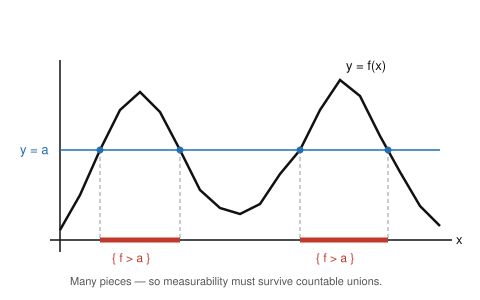

# Measure Theory · Lesson 2.1: Measurable functions

> ⏱ ~15 min · Module 2: The Lebesgue integral and the convergence theorems · Builds on: [Lesson 1.2](01-02-sigma-algebras.md) (σ-algebras & Borel sets) and all of [Module 1](01-01-where-riemann-fails.md) · Unlocks: [Lesson 2.2](02-02-simple-functions-integral.md)

## Why this matters

Before you can integrate a function you need to know it belongs to a class you can integrate — and that class must be closed under the operations analysis actually performs, above all taking limits. This is precisely where Riemann broke down (Lesson 1.1): a pointwise limit of Riemann-integrable functions need not be Riemann-integrable, so the theory could not chase functions built by limiting processes. **Measurable functions** are the fix. They are stable under sums, products, composition with continuous maps, and — the payoff — under countable sups, infs, limsups, and pointwise limits. In `probability-theory` a measurable function is exactly a *random variable* and its integral is the *expectation*; in `functional-analysis` the elements of $L^p$ are measurable functions taken modulo the almost-everywhere equality we define at the end.

## The idea

A function is **measurable** if every "measurable question" you ask about its output pulls back to a measurable question about its input. If you want to know where the function exceeds a threshold, or lands in an interval, or hits a Borel set, the set of inputs producing that outcome must be something your σ-algebra can measure.

Two moves make this workable.

**First: you don't have to check every Borel set.** The Borel σ-algebra $\mathcal{B}(\mathbb{R})$ is *generated* by the rays $(a,\infty)$ (Lesson 1.2). It turns out that if preimages of the generators behave, preimages of *everything they generate* behave automatically — because "preimage" respects complements and countable unions, the very operations that build a σ-algebra. So checking the single family of superlevel sets $\{f>a\}$ suffices.

**Second: the class is closed under limits.** A superlevel set of a supremum is a *countable union* of superlevel sets: $\sup_n f_n(x)>a$ exactly when *some* $f_n(x)>a$. Countable unions are exactly what a σ-algebra can absorb. Stack this idea and you get $\inf$, $\limsup$, $\liminf$, and ordinary limits for free. This closure under countable limit operations is the structural gift Riemann integration never had.

## The formal version

Throughout, $(X,\mathcal{A})$ is a measurable space and the target is $\mathbb{R}$ (or the extended reals) with its Borel σ-algebra.

**Definition (measurable function).** A function $f:X\to\mathbb{R}$ is **$\mathcal{A}$-measurable** if
$$f^{-1}(B)=\{x\in X: f(x)\in B\}\in\mathcal{A}\quad\text{for every }B\in\mathcal{B}(\mathbb{R}).$$

*In words:* pulling any Borel set back through $f$ lands you in a measurable set.

**Lemma (generators suffice).** If $\mathcal{B}(\mathbb{R})=\sigma(\mathcal{G})$ for some family $\mathcal{G}$, then $f$ is measurable **iff** $f^{-1}(E)\in\mathcal{A}$ for every $E\in\mathcal{G}$.

*In words:* to test measurability, you only need to check preimages of a generating family — the rest follows.

**Proposition (the ray test).** $f:X\to\mathbb{R}$ is measurable iff
$$\{f>a\}:=f^{-1}\big((a,\infty)\big)\in\mathcal{A}\qquad\text{for every }a\in\mathbb{R}.$$
The same holds with $\{f\ge a\}$, $\{f<a\}$, or $\{f\le a\}$ — any one family works.

*In words:* a function is measurable exactly when every threshold set is measurable.

**Stability under algebra and continuous maps.** If $f,g$ are measurable and $c\in\mathbb{R}$, then $cf,\ f+g,\ fg,\ |f|,\ \max(f,g),\ \min(f,g)$ are measurable; and if $\varphi:\mathbb{R}\to\mathbb{R}$ is continuous then $\varphi\circ f$ is measurable (because a continuous map is Borel measurable, and a composition of measurable-then-Borel maps is measurable).

**Theorem (closure under countable limits).** Let $(f_n)$ be measurable functions $X\to[-\infty,\infty]$. Then
$$\sup_n f_n,\quad \inf_n f_n,\quad \limsup_{n} f_n,\quad \liminf_{n} f_n$$
are all measurable. In particular, if $f_n\to f$ pointwise, then $f$ is measurable.

*In words:* you cannot escape the class of measurable functions by any countable limiting process — this is the property Riemann integration lacked.

**Extended-real values.** We allow $f:X\to[-\infty,\infty]$; the appropriate σ-algebra is generated by the rays together with $\{+\infty\}$ and $\{-\infty\}$. The ray test still governs: $f$ is measurable iff $\{f>a\}\in\mathcal{A}$ for all real $a$, and then $\{f=+\infty\}=\bigcap_n\{f>n\}$ and $\{f=-\infty\}=\big(\bigcup_n\{f>-n\}\big)^c$ are measurable automatically. Extended values are needed because a $\sup$ or a limit of finite functions can legitimately be $\pm\infty$.

**Definition (almost everywhere).** Fix a measure $\mu$ on $(X,\mathcal{A})$. A property holds **$\mu$-almost everywhere** ($\mu$-a.e.) if the set where it fails is contained in a $\mu$-null set. We write $f=g$ $\mu$-a.e. when $\mu(\{f\ne g\})=0$.

**Completeness and a.e. limits.** If $(X,\mathcal{A},\mu)$ is a **complete** measure space (every subset of a null set is measurable — Lesson 1.3), then: (i) $g$ measurable and $f=g$ a.e. $\Rightarrow$ $f$ measurable; and hence (ii) an a.e.-pointwise limit of measurable functions is measurable. (Both are proved in P3.)

## Picture

The ray test in one image. The horizontal line $y=a$ slices the graph; the set $\{f>a\}$ is the shadow on the $x$-axis of the part of the graph lying *above* the line. A single threshold can carve the domain into several intervals — so the very definition demands that measurability survive taking unions, and countably many at that.

This is also a first glimpse of Lebesgue's guiding idea: instead of chopping the *domain* into thin vertical strips (Riemann), we will slice the *range* horizontally and measure the sets $\{f>a\}$ — which is exactly why we insist those sets be measurable.

## Worked examples

**Example 1 (the ray test is genuinely sufficient — proof of the Proposition).**
*Claim.* If $\{f>a\}\in\mathcal{A}$ for every $a\in\mathbb{R}$, then $f$ is measurable.

Consider the collection of "good" target sets
$$\Sigma=\{E\subseteq\mathbb{R}: f^{-1}(E)\in\mathcal{A}\}.$$
We show $\Sigma$ is a σ-algebra on $\mathbb{R}$, using only that preimages commute with set operations:

- $f^{-1}(\mathbb{R})=X\in\mathcal{A}$, so $\mathbb{R}\in\Sigma$.
- If $E\in\Sigma$, then $f^{-1}(E^c)=X\setminus f^{-1}(E)\in\mathcal{A}$ (complement, using $\mathcal{A}$ closed under complements), so $E^c\in\Sigma$.
- If $E_1,E_2,\dots\in\Sigma$, then $f^{-1}\big(\bigcup_n E_n\big)=\bigcup_n f^{-1}(E_n)\in\mathcal{A}$, so $\bigcup_n E_n\in\Sigma$.

So $\Sigma$ is a σ-algebra. By hypothesis every ray $(a,\infty)$ lies in $\Sigma$. Now recall from Lesson 1.2 that these rays *generate* the Borel sets: each $(a,\infty)$ is open so lies in $\mathcal{B}(\mathbb{R})$, while conversely
$$[b,\infty)=\bigcap_{n=1}^{\infty}\Big(b-\tfrac1n,\ \infty\Big),\qquad (a,b)=(a,\infty)\setminus[b,\infty),$$
and every open subset of $\mathbb{R}$ is a countable union of such open intervals — so $\sigma(\{(a,\infty)\})=\mathcal{B}(\mathbb{R})$. Since $\Sigma$ is a σ-algebra containing the rays, it contains the σ-algebra they generate:
$$\mathcal{B}(\mathbb{R})=\sigma(\{(a,\infty):a\in\mathbb{R}\})\subseteq\Sigma.$$
That is exactly $f^{-1}(B)\in\mathcal{A}$ for every Borel $B$: $f$ is measurable. $\blacksquare$

This argument *is* the "generators suffice" Lemma — nothing about rays was special except that they generate.

**Example 2 (closure under sup — the workhorse of Module 2).**
*Claim.* If each $f_n:X\to[-\infty,\infty]$ is measurable, so is $g=\sup_n f_n$.

Fix $a\in\mathbb{R}$ and use the ray test on $g$. The key identity is
$$\{g>a\}=\bigcup_{n=1}^{\infty}\{f_n>a\}.$$
*Why:* if $g(x)=\sup_n f_n(x)>a$, then $a$ is not an upper bound for the values $f_n(x)$, so some $f_n(x)>a$ — hence $x$ lies in the right side. Conversely if $f_n(x)>a$ for some $n$, then $g(x)\ge f_n(x)>a$, so $x\in\{g>a\}$. (Note the strict inequality is essential: with $\ge$ the identity can fail, since a sup may be attained only in the limit.)

Each $\{f_n>a\}\in\mathcal{A}$ by measurability of $f_n$, and a σ-algebra is closed under countable unions, so $\{g>a\}\in\mathcal{A}$. By the ray test, $g=\sup_n f_n$ is measurable. $\blacksquare$

Everything else in the Theorem now falls out cheaply:
$$\inf_n f_n=-\sup_n(-f_n),\qquad \limsup_n f_n=\inf_{n}\ \sup_{k\ge n} f_k,\qquad \liminf_n f_n=\sup_{n}\ \inf_{k\ge n} f_k,$$
each a countable $\sup$/$\inf$ of measurable functions, hence measurable. If $f_n\to f$ pointwise then $f=\limsup_n f_n=\liminf_n f_n$, so $f$ is measurable.

## Watch out

- **You might think** you must verify $f^{-1}(B)\in\mathcal{A}$ for *every* Borel $B$ to call $f$ measurable — **actually** checking the single family $\{f>a\}$ (even only for rational $a$, see the Flashback) is enough. Testing all Borel sets is never how it's done.
- **You might think** the sup-identity works with $\ge$: $\{\sup_n f_n\ge a\}=\bigcup_n\{f_n\ge a\}$ — **actually** it does not, because a supremum can equal $a$ without any single $f_n$ reaching $a$ (e.g. $f_n=a-\tfrac1n$). Use strict $>$ for $\sup$, strict $<$ for $\inf$.
- **You might think** "$f=g$ almost everywhere" makes $g$ measurable whenever $f$ is — **actually** this needs the measure to be **complete**. Without completeness a null set can hide a non-measurable subset, and modifying $f$ there can wreck measurability. Lebesgue measure is complete, so in practice you're safe; abstractly, state the hypothesis.
- **You might think** measurability is about the measure $\mu$ — **actually** it depends only on the σ-algebra $\mathcal{A}$ (and the Borel structure on the target). The measure enters only when we speak of "almost everywhere."

## One-liner

> A function is measurable when every threshold set $\{f>a\}$ is measurable — and because that test rides on countable unions, the class is sealed shut under sups, infs, and limits, which is exactly what Riemann never had.

## Problems

**P1 (🟢)** Let $f:X\to\mathbb{R}$ be measurable.
(a) Show $\{f\ge a\}$, $\{f=a\}$, and $\{a<f<b\}$ are measurable for all reals $a<b$, using only that all sets $\{f>c\}$ are measurable.
(b) Show $f^2$ is measurable by applying the ray test directly to $f^2$ (do not just cite "composition with a continuous map").

**P2 (🟡)** Let $(f_n)$ be measurable. Prove that the set
$$C=\{x\in X: \lim_{n\to\infty} f_n(x)\text{ exists as a finite real number}\}$$
is measurable. (Hint: compare $\limsup$ and $\liminf$, and handle finiteness. You'll want the fact that $\{g<h\}$ is measurable for measurable $g,h$.)

**P3 (🔴, optional)** Let $(X,\mathcal{A},\mu)$ be a **complete** measure space.
(a) Prove: if $g$ is measurable and $f=g$ $\mu$-a.e., then $f$ is measurable.
(b) Deduce: if $f_n$ are measurable and $f_n\to f$ $\mu$-a.e., then $f$ is measurable.
(This is the completeness clause of the Theorem, and it is what lets the convergence theorems of Lessons 2.4–2.5 conclude the *limit* is integrable.)

Solutions

**P1 (a).** Use countable operations on the given threshold sets.
$$\{f\ge a\}=\bigcap_{n=1}^{\infty}\Big\{f>a-\tfrac1n\Big\}\in\mathcal{A},$$
since if $f(x)\ge a$ then $f(x)>a-\tfrac1n$ for all $n$, and conversely $f(x)>a-\tfrac1n$ for every $n$ forces $f(x)\ge a$ (let $n\to\infty$). Next $\{f\le a\}=\{f>a\}^c\in\mathcal{A}$, so
$$\{f=a\}=\{f\ge a\}\cap\{f\le a\}\in\mathcal{A}.$$
Finally, with $\{f<b\}=\{f\ge b\}^c\in\mathcal{A}$,
$$\{a<f<b\}=\{f>a\}\cap\{f<b\}\in\mathcal{A}.\qquad\blacksquare$$

**P1 (b).** Test $\{f^2>a\}$ for each real $a$.
- If $a<0$: $\{f^2>a\}=X$ (since $f^2\ge0>a$ everywhere), and $X\in\mathcal{A}$.
- If $a\ge0$: $f(x)^2>a\iff |f(x)|>\sqrt a\iff f(x)>\sqrt a\ \text{or}\ f(x)<-\sqrt a$, so
$$\{f^2>a\}=\{f>\sqrt a\}\cup\{f<-\sqrt a\}\in\mathcal{A}$$
(the two pieces are measurable by measurability of $f$ and part (a)).

In every case $\{f^2>a\}\in\mathcal{A}$, so by the ray test $f^2$ is measurable. $\blacksquare$

**P2.** Set $g=\limsup_n f_n$ and $h=\liminf_n f_n$; both are measurable (extended-real-valued) by the Theorem, and $h\le g$ pointwise always.

*The limit exists finitely at $x$ iff $g(x)=h(x)$ and this common value is finite.* So
$$C=\{g=h\}\cap\{g<\infty\}\cap\{g>-\infty\}.$$
Each factor is measurable:

- $\{g<\infty\}=\bigcup_{n}\{g\le n\}$ (measurable, $g$ measurable) and $\{g>-\infty\}=\bigcup_n\{g>-n\}$ — both in $\mathcal{A}$.
- For $\{g=h\}$: first note that for measurable $g,h$,
$$\{g<h\}=\bigcup_{q\in\mathbb{Q}}\big(\{g<q\}\cap\{h>q\}\big)\in\mathcal{A},$$
because $g(x)<h(x)$ iff some rational $q$ lies strictly between them; this is a *countable* union. By symmetry $\{h<g\}\in\mathcal{A}$, so
$$\{g=h\}=\big(\{g<h\}\cup\{h<g\}\big)^c\in\mathcal{A}.$$

A finite intersection of measurable sets is measurable, so $C\in\mathcal{A}$. $\blacksquare$

**P3 (a).** Let $N=\{f\ne g\}$. By hypothesis $\mu(N)=0$, and completeness gives $N\in\mathcal{A}$ (it is a subset of a null set), as is every subset of $N$. Fix $a\in\mathbb{R}$ and split:
$$\{f>a\}=\big(\{f>a\}\cap N^c\big)\ \cup\ \big(\{f>a\}\cap N\big).$$
On $N^c$ we have $f=g$, so $\{f>a\}\cap N^c=\{g>a\}\cap N^c\in\mathcal{A}$ (intersection of two measurable sets). And $\{f>a\}\cap N\subseteq N$ is a subset of a null set, hence measurable by completeness. The union of two measurable sets is measurable, so $\{f>a\}\in\mathcal{A}$ for all $a$; by the ray test $f$ is measurable. $\blacksquare$

**P3 (b).** Let $g=\limsup_n f_n$, which is measurable by the Theorem *regardless of convergence*. Let $E$ be the set where $f_n(x)\to f(x)$; by hypothesis $\mu(E^c)=0$. On $E$ the limit exists, so $f(x)=\lim_n f_n(x)=\limsup_n f_n(x)=g(x)$. Thus $\{f\ne g\}\subseteq E^c$, i.e. $f=g$ $\mu$-a.e. Since $g$ is measurable and the space is complete, part (a) gives $f$ measurable. $\blacksquare$

## Flashback

**From Lesson 1.2 (σ-algebras & Borel generators):** Show that the Borel σ-algebra of $\mathbb{R}$ is already generated by the *rational* right-rays,
$$\mathcal{B}(\mathbb{R})=\sigma\big(\{(q,\infty):q\in\mathbb{Q}\}\big).$$
Conclude that to check a function $f:X\to\mathbb{R}$ is measurable, it suffices to verify $\{f>q\}\in\mathcal{A}$ for every *rational* $q$.

Solution

Let $\mathcal{D}=\{(q,\infty):q\in\mathbb{Q}\}$. Every $(q,\infty)$ is open, hence Borel, so $\sigma(\mathcal{D})\subseteq\mathcal{B}(\mathbb{R})$.

Conversely, take any real ray $(b,\infty)$ with $b\in\mathbb{R}$. Since the rationals are dense, there is a sequence $q_1>q_2>\cdots$ of rationals with $q_k\downarrow b$, and
$$(b,\infty)=\bigcup_{k=1}^{\infty}(q_k,\infty).$$
Indeed $x>b$ iff $x>q_k$ for some $k$: if $x>b$, density gives a $q_k\in(b,x)$; conversely $x>q_k$ forces $x>q_k>b$ since every $q_k>b$. This is a *countable* union of members of $\mathcal{D}$, so $(b,\infty)\in\sigma(\mathcal{D})$ for every real $b$. Therefore
$$\mathcal{B}(\mathbb{R})=\sigma\big(\{(b,\infty):b\in\mathbb{R}\}\big)\subseteq\sigma(\mathcal{D}),$$
and combined with the first inclusion, $\mathcal{B}(\mathbb{R})=\sigma(\mathcal{D})$.

Now if $\{f>q\}=f^{-1}((q,\infty))\in\mathcal{A}$ for all rational $q$, then the collection $\Sigma=\{E:f^{-1}(E)\in\mathcal{A}\}$ (a σ-algebra, as in Example 1) contains $\mathcal{D}$, hence contains $\sigma(\mathcal{D})=\mathcal{B}(\mathbb{R})$. So $f$ is measurable — verifying countably many rational thresholds is enough. $\blacksquare$

## Connections

- **Backward:** This rests entirely on Lesson 1.2. The ray test is the "generators suffice" principle applied to the Borel σ-algebra's ray generators, and the closure proofs use nothing but the σ-algebra axioms (complements, countable unions) and continuity from below/above of Lesson 1.3.
- **Forward:** Lesson 2.2 uses measurability to run the **simple-function approximation theorem** — every nonnegative measurable $f$ is an increasing pointwise limit of simple functions — and defines $\int f\,d\mu$ as a supremum over those. The whole point of building the integral on measurable functions is that Lessons 2.4–2.5 (monotone convergence, Fatou, dominated convergence) may take limits and *stay inside the class* — the closure theorem proved here is what guarantees the limit is again integrable.
- **Sideways (`probability-theory`):** a measurable function $X\to\mathbb{R}$ on a probability space is exactly a **random variable**; the threshold sets $\{f>a\}$ are its events, its distribution is the pushforward measure, and its expectation is the Lebesgue integral $\int f\,d\mu$ of Module 2.
- **Sideways (`functional-analysis` / `fourier-analysis`):** the almost-everywhere equality defined here is the equivalence relation whose classes are the elements of the $L^p$ spaces. It is because we identify functions equal a.e. that $\lVert f\rVert_p=0\Rightarrow f=0$ becomes true, making $\lVert\cdot\rVert_p$ a genuine norm (Lesson 3.3) and $L^2$ the Hilbert space on which Fourier series converge in mean.
