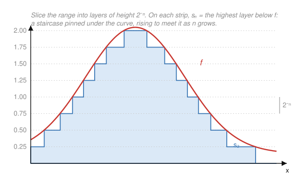

# Measure Theory · Lesson 2.2: Simple functions and the integral of nonnegative functions

> ⏱ ~15 min · Module 2: The Lebesgue integral and the convergence theorems · Builds on: [Lesson 2.1](02-01-measurable-functions.md) · Unlocks: [Lesson 2.3](02-03-general-lebesgue-integral.md)

## Why this matters

We finally build the integral. Riemann chops the *domain* into thin vertical strips and hopes the function doesn't wiggle too much across each one — which is exactly why it chokes on the Dirichlet function ([Lesson 1.1](01-01-where-riemann-fails.md)). Lebesgue instead chops the *range*: group together all the points where $f$ is roughly the same height, and pay $\text{height} \times \text{measure of that set}$. The building block for "roughly the same height" is a **simple function**, and the whole Lebesgue integral is defined by pushing simple functions up against $f$ from below. Every convergence theorem in this module, and expectation in `probability-theory`, is this one definition in disguise.

## The idea

A simple function takes only finitely many values. Picture a function that is constantly $3$ on one measurable set, $1$ on another, $0$ elsewhere — a "step function" but with arbitrary measurable sets as the steps, not just intervals. Its integral is forced on us: the area under a flat slab of height $a_i$ over a set $E_i$ is $a_i\,\mu(E_i)$, and we just add the slabs.

Then comes the move that defines the subject. Given any nonnegative measurable $f$, we **approximate it from below** by simple functions and declare its integral to be the largest area any such under-approximation can capture — a supremum. Two facts make this honest: (1) you can *always* build simple functions increasing up to $f$ (slice the range into thin dyadic layers), and (2) the answer doesn't depend on which simple functions you use, because it's a sup over *all* of them.

## The formal version

Throughout, $(X,\mathcal{M},\mu)$ is a measure space and $\chi_E$ is the indicator of $E$ ($\chi_E(x)=1$ if $x\in E$, else $0$).

**Definition (simple function).** A measurable $s:X\to[0,\infty)$ is **simple** if its range is a finite set. Equivalently
$$s=\sum_{i=1}^{n} a_i\,\chi_{E_i},\qquad E_i\in\mathcal{M}.$$
The **canonical form** takes $a_1,\dots,a_n$ to be the *distinct nonzero* values of $s$ and $E_i=\{x: s(x)=a_i\}=s^{-1}(\{a_i\})$; these $E_i$ are disjoint and measurable (measurability is Lesson 2.1: preimages of Borel sets are measurable).

*In words:* a simple function is a finite "measurable staircase" — finitely many flat heights, each sitting over a measurable set.

**Definition (integral of a nonnegative simple function).** For simple $s=\sum_{i=1}^n a_i\chi_{E_i}$ (in canonical form),
$$\int_X s\,d\mu \;=\; \sum_{i=1}^{n} a_i\,\mu(E_i)\ \in[0,\infty],$$
with the convention $0\cdot\infty=0$ (a height-$0$ slab contributes nothing even over an infinite set).

**Lemma (well-defined).** The value $\sum_i a_i\mu(E_i)$ is the same for *every* representation of $s$ as a finite sum $\sum a_i\chi_{E_i}$ with the $E_i$ a measurable partition of $X$ — not just the canonical one. (Proved via a common refinement; you do it in **P3**.)

*In words:* it doesn't matter how you slice the staircase into pieces; the total area is the same.

**Theorem (simple-function approximation).** Let $f:X\to[0,\infty]$ be measurable. Then there exist simple functions with
$$0\le s_1\le s_2\le\cdots\le f,\qquad s_n(x)\uparrow f(x)\ \text{for every }x\in X,$$
and the convergence is *uniform* on any set where $f$ is bounded.

*In words:* every nonnegative measurable function is the increasing pointwise limit of simple functions — you can sneak up on it from below with staircases.

*Proof (the dyadic construction).* Fix $n$. Slice the range $[0,n]$ into $n2^n$ layers of height $2^{-n}$, and put everything above $n$ into one top piece:
$$E_{n,k}=\Big\{x:\tfrac{k}{2^n}\le f(x)<\tfrac{k+1}{2^n}\Big\}\ (0\le k<n2^n),\qquad F_n=\{x:f(x)\ge n\}.$$
Each set is measurable because $f$ is (they are built from sets $\{a\le f<b\}$, which are measurable by Lesson 2.1). Define
$$s_n=\sum_{k=0}^{n2^n-1}\frac{k}{2^n}\,\chi_{E_{n,k}}+n\,\chi_{F_n}\qquad\Longleftrightarrow\qquad s_n(x)=\min\!\Big(\tfrac{\lfloor 2^n f(x)\rfloor}{2^n},\,n\Big).$$
So $s_n(x)$ is just $f(x)$ **rounded down** to the nearest multiple of $2^{-n}$, capped at $n$.

*Below $f$:* by construction $s_n\le f$, and $0\le f-s_n\le 2^{-n}$ wherever $f<n$ — that is the uniform bound. *Increasing:* halving the layer height refines every layer, so a floor-to-$2^{-n}$ can only rise (or stay) when passed to $2^{-(n+1)}$; hence $s_n\le s_{n+1}$. *Limit:* if $f(x)<\infty$, then for all $n>f(x)$ we have $0\le f(x)-s_n(x)\le 2^{-n}\to 0$; if $f(x)=\infty$, then $s_n(x)=n\to\infty=f(x)$. $\blacksquare$

**Definition (integral of a nonnegative measurable function).** For measurable $f:X\to[0,\infty]$,
$$\int_X f\,d\mu \;=\; \sup\Big\{\int_X s\,d\mu \;:\; s\ \text{simple},\ 0\le s\le f\Big\}\ \in[0,\infty].$$

*In words:* the integral of $f$ is the most area you can trap underneath it with a simple staircase.

Two consistency checks fall out immediately. If $f$ is *itself* simple, then $s=f$ is admissible, so the sup is $\ge\int f\,d\mu$; and every admissible $s\le f$ has $\int s\le\int f$ by monotonicity — the two definitions agree. And the sup need not be attained by any single $s$: for unbounded $f$ it is approached only in the limit (that's what the approximation theorem is for, and why the sup is over *all* simple minorants).

## Picture

The range is sliced into horizontal layers of height $2^{-n}$. On each vertical strip, $s_n$ is the *highest layer still below $f$* — the blue staircase is pinned under the red curve, and halving the layer height presses it upward toward $f$. Contrast Riemann, which would slice the horizontal axis instead; Lebesgue's horizontal slicing is what makes wild functions integrable.

## Worked examples

**Example 1 (a simple-function integral, computed two ways).** On $(\mathbb{R},\mathcal{L},m)$ (Lebesgue measure) let
$$s=3\,\chi_{[0,1)}+1\,\chi_{[1,3)}.$$
This is already canonical (distinct nonzero values $3,1$ on disjoint sets), so
$$\int_{\mathbb{R}} s\,dm=3\cdot m([0,1))+1\cdot m([1,3))=3\cdot 1+1\cdot 2=5.$$
Now write the *same* $s$ non-canonically by splitting the height-$1$ slab: $s=3\chi_{[0,1)}+1\chi_{[1,2)}+1\chi_{[2,3)}$. Then $3\cdot1+1\cdot1+1\cdot1=5$ — identical, as the Lemma promises. Splitting slabs never changes the area.

**Example 2 (build the dyadic approximation and integrate).** Take $f(x)=x$ on $X=[0,1]$ with Lebesgue measure; we know the answer *should* be $\int_0^1 x\,dx=\tfrac12$. Watch the definition produce it.

Here $f\le 1$, so the cap at $n$ never bites and $s_n(x)=\dfrac{\lfloor 2^n x\rfloor}{2^n}$, i.e. round $x$ down to a multiple of $2^{-n}$. Its level sets are the dyadic subintervals $E_{n,k}=\big[\tfrac{k}{2^n},\tfrac{k+1}{2^n}\big)$, each of measure $2^{-n}$, on which $s_n=\tfrac{k}{2^n}$:

- **$n=1$:** $s_1=0$ on $[0,\tfrac12)$, $\ \tfrac12$ on $[\tfrac12,1)$. So $\displaystyle\int s_1=0\cdot\tfrac12+\tfrac12\cdot\tfrac12=\tfrac14.$
- **$n=2$:** $s_2$ takes $0,\tfrac14,\tfrac12,\tfrac34$ on the four quarter-intervals. So $\displaystyle\int s_2=\big(0+\tfrac14+\tfrac12+\tfrac34\big)\cdot\tfrac14=\tfrac{3/2}{4}=\tfrac38.$
- **General $n$:** $\displaystyle\int s_n=\sum_{k=0}^{2^n-1}\frac{k}{2^n}\cdot\frac{1}{2^n}=\frac{1}{2^{2n}}\cdot\frac{(2^n-1)2^n}{2}=\frac{2^n-1}{2^{n+1}}.$

These values $\tfrac14,\tfrac38,\tfrac{7}{16},\dots$ increase to $\tfrac12$. Since $\int f=\sup_{s\le f}\int s\ge\sup_n\int s_n=\tfrac12$, and one can check no simple minorant beats $\tfrac12$, we get $\int_0^1 x\,dm=\tfrac12$. The staircase integrals climbing to the true value *is* the picture above, quantified.

## Watch out

- **You might think** the sup in $\int f\,d\mu$ is achieved by some best simple $s$ — **but** for typical (especially unbounded) $f$ no single simple minorant hits the value; the integral is only *approached* by the increasing dyadic $s_n$. That is precisely why the definition is a supremum, not a maximum.
- **You might think** $s_n\to f$ uniformly always — **but** uniformity holds only where $f$ is bounded. On $\{f=\infty\}$ we merely have $s_n=n\uparrow\infty$; the cap at $n$ is what lets the construction cope with unbounded $f$ at all. Pointwise-everywhere convergence, however, is genuine.
- **You might think** a simple function's integral depends on how you write it — **but** the Lemma kills that: any two partition representations agree (common refinement). Do insist the pieces be *measurable*; and remember the $0\cdot\infty=0$ convention, or a height-$0$ term over an infinite set will wrongly read as $\infty$.
- **You might think** "finitely many values" lets $f$ be simple even if a level set is non-measurable — **no**: simple *requires* each $E_i=s^{-1}(\{a_i\})\in\mathcal{M}$. Finiteness of the range is not enough; measurability of the pieces is part of the definition.

## One-liner

> To integrate a nonnegative function, slice its *range* into thin layers, trap it from below with simple staircases, and take the supremum of their areas.

## Problems

**P1 (🟢)** On $(\mathbb{R},\mathcal{L},m)$ let $s=2\,\chi_{[0,2)}+5\,\chi_{[1,3)}$. Note the sets **overlap**, so this is not canonical. (a) Find the canonical form of $s$ (its distinct values and their level sets). (b) Compute $\int_{\mathbb{R}} s\,dm$ from the canonical form, and check it equals $2\,m([0,2))+5\,m([1,3))$ read off the original expression.

**P2 (🟡)** Let $f(x)=x^2$ on $X=[0,1]$ with Lebesgue measure. Write down the dyadic approximant $s_2$ explicitly (its value on each of the four sets $E_{2,k}=\{k/4\le f<(k+1)/4\}$, given as subintervals of $[0,1]$) and compute $\int s_2\,dm$. Is your value $\le\int_0^1 x^2\,dx=\tfrac13$, as it must be?

**P3 (🔴)** Prove the well-definedness Lemma. Suppose a simple function has two partition representations
$$s=\sum_{i=1}^m a_i\chi_{A_i}=\sum_{j=1}^n b_j\chi_{B_j},$$
where $\{A_i\}$ and $\{B_j\}$ are each finite measurable partitions of $X$. Show $\sum_i a_i\mu(A_i)=\sum_j b_j\mu(B_j)$.

Solutions

**P1** On $[0,1)$ only the first slab is on: $s=2$. On $[1,2)$ both are on: $s=2+5=7$. On $[2,3)$ only the second: $s=5$. Elsewhere $s=0$.

(a) Distinct nonzero values are $2,7,5$ with level sets
$$s^{-1}(2)=[0,1),\quad s^{-1}(7)=[1,2),\quad s^{-1}(5)=[2,3),$$
so the canonical form is $s=2\chi_{[0,1)}+7\chi_{[1,2)}+5\chi_{[2,3)}$.

(b) $\int s\,dm = 2\cdot m([0,1))+7\cdot m([1,2))+5\cdot m([2,3)) = 2\cdot1+7\cdot1+5\cdot1 = 14.$

Reading the original (overlapping) expression additively: $2\,m([0,2))+5\,m([1,3))=2\cdot2+5\cdot2=4+10=14$. ✓ Same total — the Lemma applies even to overlapping representations, since $\int(\text{sum of indicators})$ is additive slab-by-slab.

**P2** Since $f(x)=x^2$ is increasing on $[0,1]$, the layer $\{k/4\le x^2<(k+1)/4\}$ is the interval $\big[\sqrt{k}/2,\ \sqrt{k+1}/2\big)$, and $s_2=\tfrac{k}{4}$ there. Explicitly:

| $k$ | value $s_2=k/4$ | set $E_{2,k}=\{k/4\le x^2<(k{+}1)/4\}$ | length $m(E_{2,k})$ |
|---|---|---|---|
| 0 | 0 | $[0,\ \tfrac12)$ | $\tfrac12$ |
| 1 | $\tfrac14$ | $[\tfrac12,\ \tfrac{\sqrt2}{2})$ | $\tfrac{\sqrt2-1}{2}$ |
| 2 | $\tfrac12$ | $[\tfrac{\sqrt2}{2},\ \tfrac{\sqrt3}{2})$ | $\tfrac{\sqrt3-\sqrt2}{2}$ |
| 3 | $\tfrac34$ | $[\tfrac{\sqrt3}{2},\ 1)$ | $\tfrac{2-\sqrt3}{2}$ |

(The $k=4$ layer $\{x^2\ge1\}$ meets $[0,1]$ only at the single point $x=1$, of measure $0$; and $n=2\ge f$ so the cap is irrelevant.) Then
$$\int s_2\,dm=\tfrac14\cdot\tfrac{\sqrt2-1}{2}+\tfrac12\cdot\tfrac{\sqrt3-\sqrt2}{2}+\tfrac34\cdot\tfrac{2-\sqrt3}{2}=\tfrac{1}{8}\big[(\sqrt2-1)+2(\sqrt3-\sqrt2)+3(2-\sqrt3)\big].$$
Inside the bracket: $\sqrt2-1+2\sqrt3-2\sqrt2+6-3\sqrt3=5-\sqrt2-\sqrt3$. So
$$\int s_2\,dm=\frac{5-\sqrt2-\sqrt3}{8}\approx\frac{5-1.414-1.732}{8}=\frac{1.854}{8}\approx 0.2318.$$
Indeed $0.2318\le\tfrac13\approx0.3333$, consistent with $s_2\le f$ forcing $\int s_2\le\int f$. (The gap shrinks as $n$ grows.)

**P3** Refine the two partitions against each other: let $C_{ij}=A_i\cap B_j$. These are measurable, pairwise disjoint, and for each fixed $i$, since $\{B_j\}$ partitions $X$,
$$A_i=\biguplus_{j} C_{ij}\quad\Longrightarrow\quad \mu(A_i)=\sum_j\mu(C_{ij})\quad(\text{countable additivity}),$$
and symmetrically $\mu(B_j)=\sum_i\mu(C_{ij})$.

**Key equality of heights:** if $C_{ij}\ne\varnothing$, pick $x\in C_{ij}$. Then $s(x)=a_i$ (as $x\in A_i$) and $s(x)=b_j$ (as $x\in B_j$), so $a_i=b_j$ on every nonempty $C_{ij}$. When $C_{ij}=\varnothing$ we have $\mu(C_{ij})=0$, so $a_i\mu(C_{ij})=b_j\mu(C_{ij})=0$ regardless. Hence $a_i\mu(C_{ij})=b_j\mu(C_{ij})$ for *all* $i,j$. Now sum:
$$\sum_i a_i\mu(A_i)=\sum_i a_i\sum_j\mu(C_{ij})=\sum_{i,j}a_i\mu(C_{ij})=\sum_{i,j}b_j\mu(C_{ij})=\sum_j b_j\sum_i\mu(C_{ij})=\sum_j b_j\mu(B_j).$$
$\blacksquare$ The only measure-theoretic input is finite additivity of $\mu$ over the disjoint pieces; everything else is bookkeeping on the common refinement.

## Flashback

**From [Lesson 2.1](02-01-measurable-functions.md) (measurable functions):** Let $(f_n)_{n\ge1}$ be measurable functions $X\to[-\infty,\infty]$. Prove that $g=\sup_n f_n$ and $h=\limsup_n f_n$ are measurable. *(This is exactly the machinery that lets the increasing $s_n$ from the approximation theorem have a measurable limit — and it underwrites Fatou's lemma next lesson.)*

Solution

Recall (Lesson 2.1) that a function $\phi$ is measurable iff $\{\phi>a\}\in\mathcal{M}$ for every $a\in\mathbb{R}$.

**Sup.** For any $a$,
$$\{g>a\}=\Big\{x:\sup_n f_n(x)>a\Big\}=\bigcup_{n=1}^\infty\{f_n>a\}.$$
Indeed $\sup_n f_n(x)>a$ iff *some* $f_n(x)>a$ (the sup exceeds $a$ precisely when one term does). Each $\{f_n>a\}\in\mathcal{M}$ since $f_n$ is measurable, and $\mathcal{M}$ is closed under countable unions, so $\{g>a\}\in\mathcal{M}$. Hence $g$ is measurable.

By the mirror identity $\{\inf_n f_n\ge a\}=\bigcap_n\{f_n\ge a\}$ (or applying the sup result to $-f_n$), $\inf_n f_n$ is measurable too.

**Limsup.** Write $h=\limsup_n f_n=\inf_{N\ge1}\Big(\sup_{n\ge N} f_n\Big)$. For each fixed $N$, $g_N:=\sup_{n\ge N} f_n$ is measurable by the sup result (a sup over the tail is still a countable sup). Then $h=\inf_N g_N$ is an inf of countably many measurable functions, hence measurable. $\blacksquare$

## Connections

- **Backward:** the level sets $E_{n,k}=\{k/2^n\le f<(k+1)/2^n\}$ are measurable *only because* of [Lesson 2.1](02-01-measurable-functions.md) — measurable functions have measurable "$a\le f<b$" sets. Simple functions are the finite-range measurable functions from that lesson.
- **Forward:** [Lesson 2.3](02-03-general-lebesgue-integral.md) removes the nonnegativity restriction by splitting $f=f^+-f^-$ and integrating each part with today's definition; [Lesson 2.4](02-04-monotone-convergence-fatou.md) proves the Monotone Convergence Theorem, which says exactly that $\int s_n\uparrow\int f$ for the dyadic $s_n$ — turning today's "sup over minorants" into an honest limit.
- **Sideways (`probability-theory`):** a probability is a measure with $\mu(X)=1$, and the **expectation** $\mathbb{E}[X]=\int_\Omega X\,d\mathbb{P}$ is this very integral; simple functions are exactly the *discrete random variables* $\sum a_i\chi_{E_i}$, and $\mathbb{E}[X]=\sum a_i\,\mathbb{P}(E_i)$ is $\int s\,d\mu$. The approximation theorem is why every nonnegative random variable has a well-defined expectation.
- **Sideways (`functional-analysis`):** simple functions are dense in $L^p$, so they are the workhorse for proving statements about $L^p$ (Riesz–Fischer completeness, duality) by first checking them on simple functions and passing to the limit.
