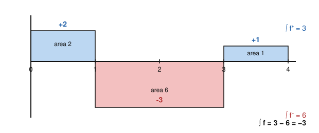

# Measure Theory · Lesson 2.3: The general Lebesgue integral

> ⏱ ~15 min · Module 2: The Lebesgue integral and the convergence theorems · Builds on: [Lesson 2.2](02-02-simple-functions-integral.md) · Unlocks: [Lesson 2.4](02-04-monotone-convergence-fatou.md) (monotone convergence and Fatou)

## Why this matters

Lesson 2.2 built the integral only for *nonnegative* functions, as a supremum over simple functions from below. But the functions you actually integrate — a velocity that changes sign, a profit-minus-loss stream, a wavefunction's real part — swing positive and negative. This lesson finishes the construction for arbitrary measurable $f$, and in doing so pins down the single most important word in the theory: **integrable**. The class $L^1(\mu)$ of integrable functions is where expectation lives (a probability is a measure with $\mu(X)=1$, and $\mathbb{E}[X]=\int X\,d\mu$), and it is the first of the $L^p$ spaces that all of functional analysis runs on. We'll also see the price of admission — Lebesgue demands *absolute* integrability — and exactly why $\int_1^\infty \frac{\sin x}{x}\,dx$ is a perfectly good improper Riemann integral that the Lebesgue theory refuses to touch.

## The idea

You already know how to integrate a nonnegative function. So take *any* measurable $f$ and slice it into its nonnegative building blocks: the part sitting **above** the axis and the part hanging **below**. Integrate each — both are ordinary nonnegative integrals — and subtract.

The only thing that can go wrong is $\infty - \infty$. If the positive part encloses infinite area *and* so does the negative part, "add up the signed area" is meaningless. So we make a clean rule: $f$ is **integrable** exactly when the *total* area of $|f|$ is finite. No conditional cancellation is allowed — you can't rescue an integral by hoping the infinite positive and infinite negative areas politely cancel. That absoluteness is the sharpest break from the improper Riemann integral, and it is a feature, not a bug: it is precisely what will make $L^1$ *complete* (Module 3).

## The formal version

Let $(X,\mathcal{M},\mu)$ be a measure space and $f:X\to[-\infty,\infty]$ measurable.

**Definition (positive and negative parts).**
$$f^+ = \max(f,0), \qquad f^- = \max(-f,0).$$
Both are nonnegative and measurable (each is a $\max$ of two measurable functions, and Lesson 2.1 closed measurability under $\max$), and they reconstruct $f$:
$$f = f^+ - f^-, \qquad |f| = f^+ + f^-.$$

*In words:* $f^+$ keeps $f$ where it's positive and zeroes it elsewhere; $f^-$ keeps the *size* of $f$ where it's negative. At every point exactly one of $f^+,f^-$ is nonzero, so their difference is $f$ and their sum is $|f|$.

**Definition (the integral).** Using the nonnegative integral from Lesson 2.2,
$$\int_X f\,d\mu \;=\; \int_X f^+\,d\mu \;-\; \int_X f^-\,d\mu,$$
**provided the right-hand side is not $\infty-\infty$** (i.e. at least one of the two terms is finite). If both are finite we call $f$ **integrable**; if exactly one is infinite the integral is defined but equals $\pm\infty$; if both are infinite $\int f$ is *undefined*.

*In words:* signed area = (area above) − (area below), and we only forbid the one case where both areas are infinite.

**Definition (integrable / $L^1$).** $f$ is **integrable** iff
$$\int_X |f|\,d\mu < \infty,$$
and we write $f\in L^1(\mu)$. Since $|f|=f^++f^-$ and the nonnegative integral is additive (Lesson 2.2), $\int|f| = \int f^+ + \int f^-$; this sum is finite iff *both* $\int f^+<\infty$ and $\int f^-<\infty$. So the two definitions of "integrable" agree.

*In words:* $f$ is integrable exactly when the total (unsigned) area under $|f|$ is finite — **absolute integrability**. There is no notion of conditional convergence here.

**Theorem (linearity and monotonicity).** For $f,g\in L^1(\mu)$ and $a,b\in\mathbb{R}$: $af+bg\in L^1(\mu)$ and
$$\int (af+bg)\,d\mu = a\int f\,d\mu + b\int g\,d\mu, \qquad\text{and if } f\le g \text{ a.e. then } \int f\,d\mu \le \int g\,d\mu.$$

*In words:* the integral is a linear, order-preserving functional on $L^1$ — it behaves exactly as an "average" should.

*Proof (additivity — the one step that needs care).* First $|f+g|\le|f|+|g|$, so by monotonicity and additivity of the *nonnegative* integral, $\int|f+g|\le\int|f|+\int|g|<\infty$; hence $h:=f+g\in L^1$. Now $h^+-h^- = (f^+-f^-)+(g^+-g^-)$. We cannot split this across the $-$ directly, because $h^+\ne f^++g^+$ in general. Instead rearrange into an equation of **nonnegative** functions:
$$h^+ + f^- + g^- = h^- + f^+ + g^+.$$
Apply additivity of the nonnegative integral (Lesson 2.2) to both sides:
$$\int h^+ + \int f^- + \int g^- = \int h^- + \int f^+ + \int g^+.$$
Every term is finite, so we may transpose:
$$\underbrace{\int h^+ - \int h^-}_{=\int h} = \Big(\int f^+ - \int f^-\Big) + \Big(\int g^+ - \int g^-\Big) = \int f + \int g.$$
For scalars: if $c\ge0$ then $(cf)^\pm = c\,f^\pm$; if $c<0$ then $(cf)^+ = |c|f^-$ and $(cf)^- = |c|f^+$, and either way $\int cf = c\int f$ by homogeneity of the nonnegative integral. Combining gives full linearity. Monotonicity: $f\le g$ a.e. means $g-f\ge0$ a.e., so $\int(g-f)\ge0$, and linearity finishes. $\blacksquare$

**Theorem (triangle inequality).** For $f\in L^1(\mu)$,
$$\left|\int_X f\,d\mu\right| \le \int_X |f|\,d\mu.$$

*In words:* the size of a signed integral never exceeds the total unsigned area. *Proof:* $-|f|\le f\le|f|$ pointwise; apply monotonicity to each inequality to get $-\int|f|\le\int f\le\int|f|$, which is the claim. $\blacksquare$

**Theorem (Lebesgue extends Riemann).** Let $f:[a,b]\to\mathbb{R}$ be bounded. Then $f$ is **Riemann integrable iff $f$ is continuous $\lambda$-almost everywhere** (its set of discontinuities has Lebesgue measure zero). In that case $f$ is Lebesgue integrable and the two integrals agree:
$$\int_a^b f(x)\,dx \;=\; \int_{[a,b]} f\,d\lambda.$$

*In words:* on a bounded interval, every bounded Riemann-integrable function is also Lebesgue-integrable to the same number — Lebesgue *extends* the Riemann integral, it doesn't overturn it. (This is **Lebesgue's criterion** for Riemann integrability; e.g. the Dirichlet function $\mathbf{1}_{\mathbb{Q}\cap[0,1]}$ is discontinuous everywhere, so it is *not* Riemann integrable — yet it is trivially Lebesgue integrable, with integral $0$, exactly the failure from Lesson 1.1 now resolved.)

## Concrete instance

**A signed simple function.** On $(\mathbb{R},\lambda)$ take
$$f = 2\cdot\mathbf{1}_{[0,1)} \;-\; 3\cdot\mathbf{1}_{[1,3)} \;+\; \mathbf{1}_{[3,4]}.$$
Split it. Where $f>0$ we keep it; where $f<0$ we record its size:
$$f^+ = 2\cdot\mathbf{1}_{[0,1)} + \mathbf{1}_{[3,4]}, \qquad f^- = 3\cdot\mathbf{1}_{[1,3)}.$$
Integrate each as a nonnegative simple function (value $\times$ measure of its level set, from Lesson 2.2):
$$\int f^+\,d\lambda = 2\cdot\lambda[0,1) + 1\cdot\lambda[3,4] = 2\cdot1 + 1\cdot1 = 3,$$
$$\int f^-\,d\lambda = 3\cdot\lambda[1,3) = 3\cdot2 = 6.$$
Therefore $\displaystyle\int f\,d\lambda = 3 - 6 = -3$, while $\displaystyle\int|f|\,d\lambda = 3+6 = 9<\infty$, so $f\in L^1(\lambda)$.

The picture is the whole idea: blue area above the axis is $\int f^+$, red area below is $\int f^-$, and the integral is their signed difference.

## Worked examples

**Example 1 (mechanical — a signed integral on a finite measure).** On $([0,2\pi],\lambda)$ compute $\int_0^{2\pi}\sin x\,d\lambda$. Since $\sin$ is continuous, it is Riemann integrable, so the Lebesgue integral equals the Riemann one: $\int_0^{2\pi}\sin x\,dx = [-\cos x]_0^{2\pi}=0$. The decomposition makes the cancellation explicit: $\sin^+$ lives on $[0,\pi]$ and $\sin^-$ on $[\pi,2\pi]$, each with area $\int_0^\pi\sin x\,dx = 2$, so $\int\sin x\,d\lambda = 2-2 = 0$. Note it is genuinely integrable: $\int_0^{2\pi}|\sin x|\,dx = 4<\infty$.

**Example 2 (why you'd care — improperly Riemann integrable but *not* Lebesgue integrable).** Let $f(x)=\dfrac{\sin x}{x}$ on $[1,\infty)$.

*It is improperly Riemann integrable.* Integrating by parts, for $R>1$,
$$\int_1^R \frac{\sin x}{x}\,dx = \left[-\frac{\cos x}{x}\right]_1^R - \int_1^R \frac{\cos x}{x^2}\,dx.$$
As $R\to\infty$ the boundary term tends to $\cos 1$ (finite), and $\int_1^\infty \frac{\cos x}{x^2}\,dx$ converges absolutely because $|\cos x/x^2|\le 1/x^2$ and $\int_1^\infty x^{-2}\,dx=1$. So the limit $\int_1^\infty\frac{\sin x}{x}\,dx$ exists as a (conditionally convergent) improper Riemann integral.

*It is not Lebesgue integrable.* We show $\int_1^\infty\frac{|\sin x|}{x}\,d\lambda=\infty$. On each block $[n\pi,(n+1)\pi]$ (for $n\ge1$) the denominator is at most $(n+1)\pi$, so
$$\int_{n\pi}^{(n+1)\pi}\frac{|\sin x|}{x}\,dx \;\ge\; \frac{1}{(n+1)\pi}\int_{n\pi}^{(n+1)\pi}|\sin x|\,dx \;=\; \frac{2}{(n+1)\pi},$$
using $\int_{n\pi}^{(n+1)\pi}|\sin x|\,dx=2$. Summing over $n\ge1$ gives $\sum_n \frac{2}{(n+1)\pi}=\infty$ (harmonic). Hence $\int|f|\,d\lambda=\infty$, so $\int f^+=\int f^-=\infty$ and $\int f\,d\lambda$ is the forbidden $\infty-\infty$: **undefined**. The function is *not* in $L^1[1,\infty)$.

The moral: the improper Riemann integral wins here only by *conditional cancellation* — chopping off at $R$ and taking a limit lets positive and negative tails nearly annihilate. Lebesgue integration measures $f^+$ and $f^-$ independently and never negotiates, so it declares the object undefined. Absolute integrability is the whole difference.

## Watch out

- **You might think $f^+ + f^- = f$** — but that's $|f|$. It's $f^+ - f^-$ that equals $f$. Mixing these up flips the sign of half your integrals.
- **You might think "the integral exists" and "$f$ is integrable" are the same** — but $\int f$ can be a well-defined $+\infty$ (e.g. $f(x)=1$ on $[0,\infty)$) while $f\notin L^1$. Integrable is the *stronger* condition $\int|f|<\infty$; it is what linearity, DCT, and the $L^p$ theory all require.
- **You might think a convergent improper Riemann integral is automatically a Lebesgue integral** — false, as $\sin x/x$ shows. Conditional convergence is a Riemann-limit phenomenon; Lebesgue only recognizes absolute convergence. (On a *bounded* interval with a *bounded* function there's no such gap — that's the Lebesgue-extends-Riemann theorem.)
- **You might think you can split $\int(f+g)$ using $(f+g)^+=f^++g^+$** — you cannot; that identity is false pointwise. The additivity proof routes around it through the rearranged nonnegative equation above.

## One-liner

> Slice $f$ into $f^+$ and $f^-$, integrate each, subtract — and call $f$ integrable only when the *total* area $\int|f|$ is finite, because Lebesgue never bargains with $\infty-\infty$.

## Problems

**P1 (🟢)** On $(\mathbb{R},\lambda)$ let $f = 4\cdot\mathbf{1}_{[0,1)} - 2\cdot\mathbf{1}_{[1,4)} + 3\cdot\mathbf{1}_{[4,6)}$. (a) Write $f^+$ and $f^-$. (b) Compute $\int f^+\,d\lambda$, $\int f^-\,d\lambda$, $\int f\,d\lambda$, and $\int|f|\,d\lambda$. (c) Is $f\in L^1(\lambda)$?

**P2 (🟡)** Using monotonicity and linearity, prove that for $f,g\in L^1(\mu)$,
$$\left|\int f\,d\mu - \int g\,d\mu\right| \le \int |f-g|\,d\mu.$$
(This is the estimate that makes $f\mapsto\int f\,d\mu$ continuous on $L^1$ — the seed of the $L^1$ norm $\lVert f\rVert_1=\int|f|\,d\mu$ in Module 3.)

**P3 (🔴)** *The counting-measure shadow of $\sin x/x$.* Let $\mu$ be counting measure on $\mathbb{N}=\{1,2,\dots\}$, so $\int_{\mathbb{N}} f\,d\mu = \sum_{n\ge1} f(n)$ for $f\ge0$. Define $f(n)=\dfrac{(-1)^n}{n}$. (a) Show the series $\sum_n f(n)$ converges (as an ordinary series). (b) Show $f\notin L^1(\mu)$. (c) Conclude that $\int_{\mathbb{N}} f\,d\mu$ is *undefined*, and explain in one sentence why this is the exact discrete analogue of the $\sin x/x$ example.

Solutions

**P1** (a) Keep the positive pieces and the sizes of the negative pieces:
$$f^+ = 4\cdot\mathbf{1}_{[0,1)} + 3\cdot\mathbf{1}_{[4,6)}, \qquad f^- = 2\cdot\mathbf{1}_{[1,4)}.$$
(b) $\int f^+ = 4\cdot\lambda[0,1) + 3\cdot\lambda[4,6) = 4\cdot1 + 3\cdot2 = 10$. $\int f^- = 2\cdot\lambda[1,4) = 2\cdot3 = 6$. So $\int f = 10-6 = 4$ and $\int|f| = 10+6 = 16$.
(c) Yes: $\int|f| = 16<\infty$, so $f\in L^1(\lambda)$.

**P2** Set $h = f-g$. By linearity $h\in L^1$ and $\int h = \int f - \int g$. By the triangle inequality applied to $h$,
$$\left|\int f - \int g\right| = \left|\int h\right| \le \int|h| = \int|f-g|. \qquad\blacksquare$$
(The triangle inequality itself: $-|h|\le h\le|h|$ pointwise, and monotonicity gives $-\int|h|\le\int h\le\int|h|$, i.e. $|\int h|\le\int|h|$.)

**P3** (a) $\sum_n \frac{(-1)^n}{n} = -1 + \tfrac12 - \tfrac13 + \cdots$ is the alternating harmonic series; its terms decrease to $0$ in absolute value, so by the alternating series test it converges (in fact to $-\ln 2$).
(b) $\int|f|\,d\mu = \sum_n \frac{1}{n} = \infty$ (harmonic series). Equivalently $\int f^+\,d\mu = \sum_{n\text{ even}}\frac1n = \infty$ and $\int f^-\,d\mu = \sum_{n\text{ odd}}\frac1n = \infty$. Since $\int|f|=\infty$, $f\notin L^1(\mu)$.
(c) With $\int f^+ = \int f^- = \infty$, the definition gives $\int f\,d\mu = \infty-\infty$, which is undefined. It is the discrete twin of $\sin x/x$: an object that *conditionally* sums/converges by cancellation of infinite positive and negative parts, which the Lebesgue integral — measuring $f^+$ and $f^-$ separately — refuses to assign a value. (Rearranging the alternating harmonic series can produce *any* real number, which is precisely why order-independent Lebesgue integration insists on absolute convergence.) $\blacksquare$

## Flashback

**From [Lesson 2.2](02-02-simple-functions-integral.md) (dyadic approximation of a nonnegative function):** Recall the canonical increasing simple functions
$$\varphi_n = \sum_{k=0}^{n2^n-1} \frac{k}{2^n}\,\mathbf{1}_{\{k/2^n \,\le\, f \,<\, (k+1)/2^n\}} \;+\; n\,\mathbf{1}_{\{f\ge n\}}, \qquad \varphi_n\uparrow f,$$
whose integrals rise to $\int f$. Take $f(x)=x$ on $([0,1],\lambda)$. Compute $\int \varphi_1\,d\lambda$ and $\int \varphi_2\,d\lambda$, and check they bracket $\int_{[0,1]} x\,d\lambda$ from below.

Solution

**$n=1$** (step $\tfrac12$, cap at height $1$): on $[0,1)$ the value $f(x)=x$ sorts into $\{0\le x<\tfrac12\}$ (level $0$) and $\{\tfrac12\le x<1\}$ (level $\tfrac12$). So
$$\varphi_1 = 0\cdot\mathbf{1}_{[0,1/2)} + \tfrac12\cdot\mathbf{1}_{[1/2,1)}, \qquad \int\varphi_1\,d\lambda = 0\cdot\tfrac12 + \tfrac12\cdot\tfrac12 = \tfrac14.$$

**$n=2$** (step $\tfrac14$): the levels $k/4$ for $k=0,1,2,3$ occupy $[0,\tfrac14),[\tfrac14,\tfrac12),[\tfrac12,\tfrac34),[\tfrac34,1)$ respectively (each of length $\tfrac14$; the point $x=1$ has measure zero). So
$$\int\varphi_2\,d\lambda = \sum_{k=0}^{3}\frac{k}{4}\cdot\frac14 = \frac{1}{16}(0+1+2+3) = \frac{6}{16} = \frac38.$$

**Check:** $\int_{[0,1]} x\,d\lambda = \int_0^1 x\,dx = \tfrac12$ (Riemann = Lebesgue, by today's extension theorem). Indeed $\tfrac14 < \tfrac38 < \tfrac12$, and $\varphi_n\uparrow x$ forces $\int\varphi_n\uparrow\tfrac12$ — the monotone convergence you'll prove in general next lesson. $\blacksquare$

## Connections

- **Backward:** this rests entirely on the nonnegative integral of [Lesson 2.2](02-02-simple-functions-integral.md) — we only ever integrate the nonnegative $f^+,f^-,|f|$ built there, and reuse its additivity in the linearity proof. It also closes the loop on [Lesson 1.1](01-01-where-riemann-fails.md): the Dirichlet function, un-integrable for Riemann, is now integrable with integral $0$.
- **Forward:** [Lesson 2.4](02-04-monotone-convergence-fatou.md) and [Lesson 2.5](02-05-dominated-convergence.md) are the convergence theorems that let you pass limits through $\int$; every one of them is stated for functions in this signed/integrable setting, and DCT's hypothesis "dominated by an integrable $g$" is exactly the $L^1$ membership defined here.
- **Sideways ($L^p$ and functional analysis):** $L^1(\mu)$ is the first of the $L^p$ spaces of [Lesson 3.3](03-03-lp-holder-minkowski.md); the estimate in P2 is the continuity of the integral in the $L^1$ norm $\lVert f\rVert_1=\int|f|\,d\mu$, and completeness of these spaces (Riesz–Fischer) is the floor under [functional-analysis](../../functional-analysis/syllabus.md).
- **Sideways (probability):** in [probability-theory](../../probability-theory/syllabus.md) a random variable $X$ is a measurable function on a space with $\mu(X)=1$, and its **expectation is exactly this Lebesgue integral**, $\mathbb{E}[X]=\int X\,d\mu$; "$X$ has finite expectation" *is* the statement $X\in L^1$, and $\mathbb{E}|X|<\infty$ is why expectation is even defined.
