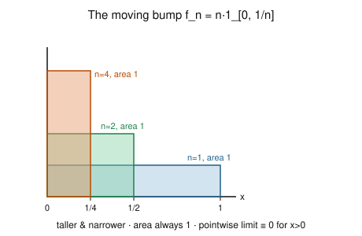

# Measure Theory · Lesson 2.4: Monotone convergence and Fatou's lemma

> ⏱ ~15 min · Module 2: The Lebesgue integral and the convergence theorems · Builds on: [Lesson 2.3](02-03-general-lebesgue-integral.md) (the general integral, $f^\pm$) · Unlocks: [Lesson 2.5](02-05-dominated-convergence.md) (dominated convergence)

## Why this matters

The one thing the Riemann integral could never reliably do is swap a limit with an integral: $\int \lim_n f_n \overset{?}{=} \lim_n \int f_n$. Every serious computation eventually needs this — summing a series term by term, differentiating under the integral sign, taking expectations of limits in probability. This lesson gives you the two workhorses for the *nonnegative* case. The monotone convergence theorem (MCT) says the swap is **free** when the functions climb upward; Fatou's lemma says that even with no monotonicity, you can never *gain* mass in the limit — integration is lower-semicontinuous. Together they are the foundation of the dominated convergence theorem (Lesson 2.5) and of expectation in [probability-theory](../../probability-theory/syllabus.md).

## The idea

Picture filling a bathtub. If you pour water in without ever removing any — the water level only rises — then the final volume is exactly the limit of the volumes along the way. Nothing is lost, so the limit of the integrals *is* the integral of the limit. That is MCT: monotone-up sequences are safe.

The danger is when mass can **escape**. Imagine a bump of area $1$ that gets taller and narrower, sliding toward a single point, or a bump of area $1$ that marches off to $+\infty$. At every finite stage the integral is $1$, but the pointwise limit is the zero function — the mass ran off the edge of the world. Here $\int \lim f_n = 0 < 1 = \lim \int f_n$. Fatou's lemma is the precise statement that this is the *only* thing that can go wrong: in the limit you might **lose** mass, but you can never **create** it. So $\int \liminf f_n \le \liminf \int f_n$ — always an inequality, one-directional, in favor of the integrals.

## The formal version

Throughout, $(X,\mathcal{M},\mu)$ is a measure space and "measurable" means $\mathcal{M}$-measurable. Recall from [Lesson 2.2](02-02-simple-functions-integral.md) that for a nonnegative measurable $f$,
$$\int_X f\,d\mu \;=\; \sup\Big\{ \int_X s\,d\mu \;:\; s \text{ simple},\ 0 \le s \le f \Big\},$$
and this integral is **monotone**: $0 \le g \le h \Rightarrow \int g \le \int h$. Values $+\infty$ are allowed.

**Monotone Convergence Theorem (MCT).** Let $f_n$ be measurable with $0 \le f_1 \le f_2 \le \cdots$ and $f_n \uparrow f$ pointwise (i.e. $f(x) = \lim_n f_n(x) = \sup_n f_n(x)$). Then $f$ is measurable and
$$\int_X f_n\,d\mu \;\uparrow\; \int_X f\,d\mu .$$

*In words:* for functions that only climb upward, the limit of the integrals equals the integral of the limit — no hypothesis on finiteness needed (both sides may be $+\infty$).

**Proof idea.** The "$\le$" direction is free: $f_n \le f$ gives $\int f_n \le \int f$, and the sequence $\int f_n$ is increasing, so $\lim_n \int f_n \le \int f$. For "$\ge$", it suffices to show $\lim_n \int f_n \ge \int s$ for every simple $s$ with $0 \le s \le f$ (then take the sup over $s$). Fix such an $s$ and a constant $c \in (0,1)$, and set
$$E_n = \{x : f_n(x) \ge c\,s(x)\}.$$
The $E_n$ increase (since $f_n$ increases), and $\bigcup_n E_n = X$: where $s(x)=0$ the condition holds trivially; where $s(x)>0$ we have $c\,s(x) < s(x) \le f(x) = \lim f_n(x)$, so $f_n(x) \ge c\,s(x)$ eventually. Now
$$\int_X f_n\,d\mu \;\ge\; \int_{E_n} f_n\,d\mu \;\ge\; c\int_{E_n} s\,d\mu.$$
The map $E \mapsto \int_E s\,d\mu$ is a measure (a finite nonnegative combination of $E \mapsto \mu(A_i \cap E)$), so by **continuity from below** (Lesson 1.3), $\int_{E_n} s \uparrow \int_X s$. Hence $\lim_n \int f_n \ge c\int_X s$. Let $c \uparrow 1$ to get $\lim_n \int f_n \ge \int_X s$, then sup over $s$. $\blacksquare$

**Corollary (term-by-term integration of a nonnegative series).** If $g_n \ge 0$ are measurable, then
$$\int_X \sum_{n=1}^{\infty} g_n \,d\mu \;=\; \sum_{n=1}^{\infty} \int_X g_n\,d\mu .$$

*In words:* you may integrate a series of nonnegative functions one term at a time — no convergence check required, because with no negative terms there is nothing to cancel.

*Proof.* The partial sums $S_N = \sum_{n=1}^N g_n$ satisfy $0 \le S_1 \le S_2 \le \cdots$ and $S_N \uparrow \sum_n g_n$. Finite linearity gives $\int S_N = \sum_{n=1}^N \int g_n$, and MCT lets $N \to \infty$ on both sides. $\blacksquare$

**Fatou's Lemma.** If $f_n \ge 0$ are measurable, then
$$\int_X \liminf_{n\to\infty} f_n \,d\mu \;\le\; \liminf_{n\to\infty} \int_X f_n\,d\mu .$$

*In words:* mass can only leak away, never appear, so the integral of the pointwise $\liminf$ can only be smaller than (or equal to) the $\liminf$ of the integrals.

*Proof (from MCT).* Set $g_k = \inf_{n \ge k} f_n$. Each $g_k$ is measurable, $0 \le g_1 \le g_2 \le \cdots$, and by definition $g_k \uparrow \liminf_n f_n$. For every $n \ge k$ we have $g_k \le f_n$, hence $\int g_k \le \int f_n$; taking the inf over $n \ge k$ gives $\int g_k \le \inf_{n\ge k}\int f_n$. Now apply MCT to the left side:
$$\int \liminf_n f_n = \lim_{k} \int g_k \;\le\; \lim_k \Big(\inf_{n\ge k}\int f_n\Big) = \liminf_n \int f_n. \qquad \blacksquare$$

## Picture

Each bump $f_n = n\,\chi_{[0,1/n]}$ has area $\int f_n = n \cdot \tfrac1n = 1$, yet for every fixed $x>0$ the bump has slid past $x$ once $\tfrac1n < x$, so $f_n(x) \to 0$. The pointwise limit is the zero function (the single leftover point $x=0$ has measure $0$). Thus $\int \lim f_n = 0 < 1 = \lim \int f_n$: the mass escaped upward through the shrinking base. The sequence is *not* monotone, so MCT does not apply; Fatou gives $0 = \int \liminf f_n \le \liminf \int f_n = 1$ — true, and strict.

## Worked examples

**Example 1 (mechanical — summing a series term by term).** Evaluate $\displaystyle \int_0^1 \frac{dx}{2-x}$ by expanding the integrand as a nonnegative series. On $[0,1)$,
$$\frac{1}{2-x} = \frac{1}{2}\cdot\frac{1}{1 - x/2} = \frac12\sum_{n=0}^{\infty}\Big(\frac{x}{2}\Big)^{n} = \sum_{n=1}^{\infty}\frac{x^{n-1}}{2^{n}},$$
and every term $g_n(x) = x^{n-1}/2^n$ is $\ge 0$ on $[0,1)$. The corollary applies with no further justification:
$$\int_0^1 \frac{dx}{2-x} = \sum_{n=1}^{\infty}\frac{1}{2^n}\int_0^1 x^{n-1}\,dx = \sum_{n=1}^{\infty}\frac{1}{2^n}\cdot\frac{1}{n} = \sum_{n=1}^\infty \frac{1}{n\,2^n}.$$
Directly, $\int_0^1 \frac{dx}{2-x} = \big[-\ln(2-x)\big]_0^1 = \ln 2 - \ln 1 = \ln 2$. So we have proved $\sum_{n\ge1} \frac{1}{n\,2^n} = \ln 2$ as a free byproduct — the term-by-term swap was legal purely because the terms are nonnegative.

**Example 2 (why you'd care — Fatou strict, escaping mass).** Take the marching bump $f_n = \chi_{[n,\,n+1]}$ on $(\mathbb{R}, \lambda)$ (Lebesgue measure). For each fixed $x$, once $n > x$ we have $x \notin [n,n+1]$, so $f_n(x) \to 0$; hence $\liminf_n f_n \equiv 0$ and $\int \liminf_n f_n = 0$. But $\int f_n = \lambda([n,n+1]) = 1$ for every $n$, so $\liminf_n \int f_n = 1$. Fatou reads
$$0 = \int \liminf_n f_n \;\le\; \liminf_n \int f_n = 1,$$
a **strict** inequality. Where did the mass go? It didn't shrink or spike — the unit of area slid off to $+\infty$, never captured by any pointwise limit. This is the whole content of Fatou: the deficit $1 - 0$ is exactly the escaped mass, and the lemma guarantees the sign of that deficit is never negative. (Equality is what the dominating hypothesis of Lesson 2.5 will buy back.)

## Watch out

- **Fatou is an inequality, and the direction is fixed.** You might hope for $\int \liminf \ge \liminf \int$ or for equality — but Examples above make it strict, and always with $\int\liminf$ on the *small* side. Mnemonic: *liminf loses mass.* If you ever "prove" the reverse, you dropped mass somewhere.
- **MCT needs monotone *increasing* and $\ge 0$ (or bounded below by an integrable function).** Decreasing sequences can fail spectacularly: $h_n = \chi_{[n,\infty)}$ decreases to $0$ pointwise, yet $\int h_n = \infty$ for all $n$, so $\lim \int h_n = \infty \ne 0 = \int \lim h_n$. There *is* a downward MCT, but only under an extra finiteness hypothesis ($\int h_1 < \infty$) — never assume the decreasing case for free.
- **The corollary is unconditional only because the $g_n$ are nonnegative.** For signed terms, term-by-term integration is exactly the delicate swap that needs dominated convergence; do not use the nonnegative corollary on a series with cancellation.
- **Pointwise a.e. is enough.** All three results hold if the hypotheses (monotonicity, nonnegativity, convergence) hold $\mu$-almost everywhere — a null set never affects an integral.

## One-liner

> If the functions only climb, the integral climbs with them (MCT); and even when they don't, the integral of the limit can only fall short, never overshoot (Fatou) — because mass can escape but never materialize.

## Problems

**P1 (🟢)** Let $f_n = n^2\,\chi_{[0,\,1/n]}$ on $([0,1],\lambda)$. (a) Find $\lim_n f_n(x)$ for each $x$. (b) Compute $\lim_n \int f_n\,d\lambda$ and $\int \lim_n f_n\,d\lambda$. (c) Write out Fatou's inequality for this sequence and confirm it holds, noting whether it is strict. (d) Which hypothesis of MCT does this sequence violate?

**P2 (🟡)** Use term-by-term integration to prove $\displaystyle \int_0^1 \frac{\ln(1/x)}{1-x}\,dx = \frac{\pi^2}{6}$. You may use the facts $\frac{1}{1-x} = \sum_{n=0}^\infty x^n$ on $(0,1)$, that $\int_0^1 x^{k}\ln(1/x)\,dx = \frac{1}{(k+1)^2}$, and $\sum_{m=1}^\infty \frac1{m^2} = \frac{\pi^2}{6}$. Say explicitly why the swap is justified.

**P3 (🔴)** Let $f \ge 0$ be measurable on $(X,\mathcal{M},\mu)$ and define $\nu(E) = \int_E f\,d\mu = \int_X f\,\chi_E\,d\mu$ for $E \in \mathcal{M}$. Prove that $\nu$ is a measure on $(X,\mathcal{M})$. (This $\nu$ is the measure "with density $f$"; in Lesson 4.4 you'll recognize $f = \tfrac{d\nu}{d\mu}$, the Radon–Nikodym derivative — so you are proving the object it differentiates is genuinely a measure.)

Solutions

**P1** (a) For $x = 0$, $f_n(0) = n^2 \to \infty$. For any fixed $x \in (0,1]$, once $n > 1/x$ we have $x \notin [0,1/n]$, so $f_n(x) = 0$ eventually; thus $\lim_n f_n(x) = 0$. The pointwise limit is $0$ everywhere except at the single point $x=0$.
(b) $\int f_n\,d\lambda = n^2 \cdot \lambda([0,1/n]) = n^2 \cdot \tfrac1n = n \to \infty$, so $\lim_n \int f_n = +\infty$. The pointwise limit is $0$ $\lambda$-a.e. (differs from $0$ only on the null set $\{0\}$), so $\int \lim_n f_n\,d\lambda = 0$.
(c) $\liminf_n f_n = 0$ a.e., so Fatou says $0 = \int \liminf_n f_n \le \liminf_n \int f_n = +\infty$. It holds, and is strict ($0 < \infty$). This is escaping mass with an even faster spike than the area-$1$ bump — here the "area" $n$ itself blows up.
(d) The sequence is not monotone increasing: e.g. $f_1 = \chi_{[0,1]}$ has $f_1(1) = 1$ while $f_2(1) = 0$, so $f_1 \not\le f_2$. MCT's monotonicity hypothesis fails, which is why $\lim\int \ne \int\lim$.

**P2** On $(0,1)$ the integrand is $\dfrac{\ln(1/x)}{1-x} = \ln(1/x)\sum_{n=0}^\infty x^n = \sum_{n=0}^\infty x^n \ln(1/x)$. Each term $g_n(x) = x^n \ln(1/x)$ is $\ge 0$ on $(0,1)$ (there $x^n \ge 0$ and $\ln(1/x) = -\ln x \ge 0$). Because the terms are nonnegative, the term-by-term corollary of MCT applies with no convergence hypothesis:
$$\int_0^1 \frac{\ln(1/x)}{1-x}\,dx = \sum_{n=0}^\infty \int_0^1 x^n \ln(1/x)\,dx = \sum_{n=0}^\infty \frac{1}{(n+1)^2} = \sum_{m=1}^\infty \frac{1}{m^2} = \frac{\pi^2}{6}.$$
The justification is precisely nonnegativity of every $g_n$ — no cancellation to worry about, so the swap is unconditional. $\blacksquare$

**P3** First, $\nu(\emptyset) = \int_X f\,\chi_\emptyset\,d\mu = \int_X 0 \,d\mu = 0$, and $\nu(E) = \int_E f\,d\mu \ge 0$ since $f \ge 0$. It remains to prove countable additivity. Let $E_1, E_2, \dots \in \mathcal{M}$ be pairwise disjoint with union $E = \biguplus_k E_k$. Pointwise, indicators of disjoint sets add:
$$\chi_E = \sum_{k=1}^\infty \chi_{E_k}, \qquad\text{so}\qquad f\,\chi_E = \sum_{k=1}^\infty f\,\chi_{E_k},$$
and each summand $f\,\chi_{E_k} \ge 0$ is measurable. By the term-by-term integration corollary,
$$\nu(E) = \int_X f\,\chi_E\,d\mu = \int_X \sum_{k=1}^\infty f\,\chi_{E_k}\,d\mu = \sum_{k=1}^\infty \int_X f\,\chi_{E_k}\,d\mu = \sum_{k=1}^\infty \nu(E_k).$$
Thus $\nu$ is countably additive with $\nu(\emptyset)=0$ and $\nu \ge 0$: it is a measure. $\blacksquare$ (Note the corollary — hence MCT — is doing all the work; this is why the convergence theorems are logically upstream of Radon–Nikodym.)

## Flashback

**From [Lesson 2.3](02-03-general-lebesgue-integral.md) ($L^1$ vs. improper Riemann):** Define $f:[1,\infty) \to \mathbb{R}$ by $f = \sum_{n=1}^\infty \frac{(-1)^{n-1}}{n}\,\chi_{[n,\,n+1)}$ (so $f$ equals $\frac{(-1)^{n-1}}{n}$ on each unit interval $[n,n+1)$). Is $f$ Lebesgue integrable on $[1,\infty)$? Does the improper Riemann integral $\lim_{R\to\infty}\int_1^R f$ exist? Reconcile.

Solution

Recall $f \in L^1$ means $\int |f|\,d\lambda < \infty$, where $\int |f| = \int f^+ + \int f^-$ with $f^\pm$ the positive/negative parts. Here $|f| = \sum_n \frac1n \chi_{[n,n+1)}$, so by term-by-term integration of this nonnegative series (this lesson's corollary),
$$\int_{[1,\infty)} |f|\,d\lambda = \sum_{n=1}^\infty \frac1n \cdot \lambda([n,n+1)) = \sum_{n=1}^\infty \frac1n = +\infty.$$
So $f \notin L^1$: it is **not** Lebesgue integrable. Equivalently $\int f^+ = \sum_{n \text{ odd}} \frac1n = \infty$ and $\int f^- = \sum_{n \text{ even}} \frac1n = \infty$, so the Lebesgue integral $\int f^+ - \int f^-$ is the indeterminate $\infty - \infty$ — undefined.

Yet the improper Riemann integral exists: $\int_1^{N+1} f = \sum_{n=1}^{N}\frac{(-1)^{n-1}}{n}$, the partial sums of the alternating harmonic series, which converge to $\ln 2$ (and one checks the limit over general $R$ agrees). This is the sharp distinction from Lesson 2.3: Lebesgue integrability is **absolute** integrability, so it rejects conditionally convergent objects that improper Riemann accepts. Same phenomenon as $\int_0^\infty \frac{\sin x}{x}\,dx$.

## Connections

- **Backward:** MCT is proved directly from the sup-definition of the integral ([Lesson 2.2](02-02-simple-functions-integral.md)) and continuity from below of a measure ([Lesson 1.3](01-03-measures-properties.md)); Fatou is then pure corollary. The flashback and P2/P3 all reduce to the $f^\pm$ and absolute-integrability machinery of [Lesson 2.3](02-03-general-lebesgue-integral.md).
- **Forward:** [Lesson 2.5](02-05-dominated-convergence.md) uses Fatou twice (applied to $g + f_n$ and $g - f_n$ under a dominator $g$) to upgrade the one-sided inequality into the two-sided *equality* $\int \lim f_n = \lim \int f_n$ — the dominated convergence theorem. The term-by-term corollary and P3 (integral-with-density) are the direct ancestors of the Radon–Nikodym theorem ([Lesson 4.4](04-04-radon-nikodym.md)) and reappear inside Tonelli ([Lesson 4.2](04-02-fubini-tonelli.md)).
- **Sideways (probability):** in [probability-theory](../../probability-theory/syllabus.md) a probability is a measure with $\mu(X)=1$ and expectation *is* the Lebesgue integral, so MCT and Fatou become $\mathbb{E}[X_n]\uparrow\mathbb{E}[X]$ for increasing $X_n$ and $\mathbb{E}[\liminf X_n]\le\liminf\mathbb{E}[X_n]$ — the standard tools for limits of random variables. The escaping-mass examples are exactly "probability leaking to infinity" (loss of tightness).
- **Sideways (functional analysis):** term-by-term integration of nonnegative series is what makes the countable-additivity arguments in the $L^p$ completeness proof (Riesz–Fischer, [Lesson 3.4](03-04-completeness-riesz-fischer.md)) go through — the bridge to [functional-analysis](../../functional-analysis/syllabus.md).
