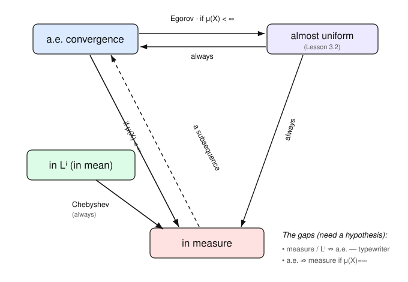

# Measure Theory · Lesson 3.1: Modes of convergence

> ⏱ ~15 min · Module 3: $L^p$ spaces and modes of convergence · Builds on: [The dominated convergence theorem (2.5)](02-05-dominated-convergence.md) · Unlocks: [Egorov's and Lusin's theorems (3.2)](03-02-egorov-lusin.md)

## Why this matters

The sentence "$f_n \to f$" hides at least three genuinely different claims, and analysis breaks the moment you conflate them. In probability, this same trichotomy is the difference between the strong law of large numbers (almost-sure convergence), the weak law (convergence in probability), and mean-square estimates ($L^2$). The point of this lesson is to draw the map once — which mode forces which — so that for the rest of your life you know exactly what a limit theorem is promising and what it is not.

## The idea

Fix a measure space $(X, \mathcal{M}, \mu)$ and measurable functions $f_n, f : X \to \mathbb{R}$. There are three ways to say $f_n$ approaches $f$, and they disagree about *where* and *how much* closeness is allowed to fail.

- **Pointwise a.e.** — at (almost) every fixed $x$, the numbers $f_n(x)$ eventually settle on $f(x)$. This is a *local* promise, made one point at a time, with no coordination across points.
- **In measure** — for any tolerance $\varepsilon$, the *set* of points still further than $\varepsilon$ from $f$ shrinks to zero size. This is a *global, set-sized* promise: it lets a shrinking rogue region misbehave, as long as it shrinks.
- **In $L^p$ (in mean)** — the *total accumulated error*, measured as $\int |f_n - f|^p$, goes to zero. This weighs both how large the error is and how much room it occupies.

The tension: a.e. convergence ignores the size of the bad set (a tall thin spike at one point is invisible), while $L^p$ and in-measure convergence ignore individual points but punish mass. So a spike that gets taller as it gets thinner can go to zero in one sense and blow up in another. The whole lesson is bookkeeping this tension precisely.

## The formal version

Throughout, $(X, \mathcal{M}, \mu)$ is a measure space, $1 \le p < \infty$, and $f_n, f$ are measurable and (for $L^p$) $p$-integrable.

**Definition (a.e. convergence).** $f_n \to f$ **almost everywhere** if $\mu\big(\{x : f_n(x) \not\to f(x)\}\big) = 0$.

*In words:* the set of points where the numerical limit fails is a null set — everywhere else, ordinary pointwise convergence holds.

**Definition (convergence in measure).** $f_n \to f$ **in measure** if for every $\varepsilon > 0$,
$$\mu\big(\{x : |f_n(x) - f(x)| > \varepsilon\}\big) \xrightarrow[n\to\infty]{} 0.$$

*In words:* no matter how small a tolerance $\varepsilon$ you pick, the region where $f_n$ is still more than $\varepsilon$ off eventually has arbitrarily small measure.

**Definition (convergence in $L^p$, "in mean").** $f_n \to f$ **in $L^p$** if
$$\lVert f_n - f \rVert_p^p = \int_X |f_n - f|^p \, d\mu \xrightarrow[n\to\infty]{} 0.$$

*In words:* the total $p$-th-power error, integrated over all of $X$, vanishes. For $p=1$ this is convergence "in mean"; for $p=2$, "in mean square."

Here is the entire implication map for this course, with each arrow's price tag:

| From | To | Holds? | Cost |
|---|---|---|---|
| $L^p$ | in measure | **always** | Chebyshev's inequality |
| a.e. | in measure | only if $\mu(X) < \infty$ | finite total measure |
| in measure | a.e. | **for a subsequence only** | Borel–Cantelli extraction |
| $L^p$ | a.e. | never (in general) | — (typewriter kills it) |
| a.e. | $L^p$ | never (in general) | — (need domination: [DCT 2.5](02-05-dominated-convergence.md)) |

We prove the first three. The last two are counterexamples — the typewriter and the escaping bump.

**Theorem ($L^p \Rightarrow$ in measure).** If $f_n \to f$ in $L^p$, then $f_n \to f$ in measure.

*Proof.* The engine is **Chebyshev's inequality** (a.k.a. Markov's): for measurable $g \ge 0$ and $t > 0$,
$$\mu(\{g \ge t\}) \le \frac{1}{t}\int_X g \, d\mu,$$
because $g \ge t\,\chi_{\{g \ge t\}}$ pointwise, and integrating that inequality gives $\int g \ge t\,\mu(\{g \ge t\})$. Apply it to $g = |f_n - f|^p$ and $t = \varepsilon^p$. Since $|f_n - f| > \varepsilon \iff |f_n - f|^p > \varepsilon^p$,
$$\mu\big(\{|f_n - f| > \varepsilon\}\big) \le \frac{1}{\varepsilon^p}\int_X |f_n - f|^p \, d\mu = \frac{\lVert f_n - f\rVert_p^p}{\varepsilon^p}.$$
The right side $\to 0$ by hypothesis, for each fixed $\varepsilon$. $\blacksquare$

**Theorem (a.e. $\Rightarrow$ in measure, on a finite measure space).** If $\mu(X) < \infty$ and $f_n \to f$ a.e., then $f_n \to f$ in measure.

*Proof.* Fix $\varepsilon > 0$ and set $B_N = \bigcup_{n \ge N} \{|f_n - f| > \varepsilon\}$. These sets decrease as $N$ grows ($B_1 \supseteq B_2 \supseteq \cdots$), and $\bigcap_N B_N$ is exactly the set of $x$ that fail $|f_n(x)-f(x)| \le \varepsilon$ for infinitely many $n$ — which is contained in $\{f_n \not\to f\}$, a null set. Because $\mu(X) < \infty$ we have $\mu(B_1) < \infty$, so **continuity from above** ([Lesson 1.3](01-03-measures-properties.md)) applies:
$$\mu\big(\{|f_N - f| > \varepsilon\}\big) \le \mu(B_N) \xrightarrow[N\to\infty]{} \mu\Big(\bigcap_N B_N\Big) = 0. \qquad \blacksquare$$
Finiteness is not decoration: continuity from above genuinely requires a set of finite measure, and the escaping bump below shows the theorem is false without it.

**Theorem (in measure $\Rightarrow$ a.e. along a subsequence).** If $f_n \to f$ in measure, there is a subsequence $f_{n_k} \to f$ a.e.

*Proof.* For each $k$, convergence in measure at tolerance $2^{-k}$ lets us pick $n_k$ (increasing) with
$$\mu(E_k) < 2^{-k}, \qquad E_k := \{|f_{n_k} - f| > 2^{-k}\}.$$
Then $\sum_k \mu(E_k) < \sum_k 2^{-k} = 1 < \infty$. By the **Borel–Cantelli lemma** — if $\sum_k \mu(E_k) < \infty$ then $\mu(\limsup_k E_k) = 0$, since $\mu(\limsup_k E_k) \le \mu\big(\bigcup_{k \ge N} E_k\big) \le \sum_{k \ge N}\mu(E_k) \to 0$ as a convergent tail — almost every $x$ lies in only finitely many $E_k$. For such an $x$, eventually $|f_{n_k}(x) - f(x)| \le 2^{-k} \to 0$, so $f_{n_k}(x) \to f(x)$. $\blacksquare$

## Picture

The map below is the mental model for the whole module. Solid arrows are unconditional or carry a stated hypothesis; the dashed arrow up the middle is the subsequence-only extraction. The two "gaps" listed are exactly where the two counterexamples live.

## Worked examples

**Example 1 (the typewriter — in $L^p$ and in measure, but at *no* point).** Work on $([0,1], m)$ with Lebesgue measure. Enumerate the dyadic subintervals level by level:
$$\underbrace{[0,1]}_{k=0}; \quad \underbrace{[0,\tfrac12],\,[\tfrac12,1]}_{k=1}; \quad \underbrace{[0,\tfrac14],[\tfrac14,\tfrac12],[\tfrac12,\tfrac34],[\tfrac34,1]}_{k=2}; \ \dots$$
and let $f_n = \chi_{I_n}$ where $I_n$ is the $n$-th interval in this list. As $n$ grows, the current interval sits at level $k$ with $k \to \infty$, so its length is $2^{-k}$.

- **In $L^p$:** $\lVert f_n\rVert_p^p = \int_0^1 \chi_{I_n}^p\,dm = m(I_n) = 2^{-k} \to 0$. So $f_n \to 0$ in every $L^p$, $1 \le p < \infty$.
- **In measure:** for $0 < \varepsilon < 1$, $\{f_n > \varepsilon\} = I_n$, so $\mu(\{f_n > \varepsilon\}) = 2^{-k} \to 0$. So $f_n \to 0$ in measure.
- **At no point:** fix any $x \in [0,1]$. At every level $k$ there is an interval containing $x$ (giving $f_n(x) = 1$ for that $n$) and, for $k \ge 1$, an interval missing $x$ (giving $f_n(x) = 0$). So the sequence $f_n(x)$ hits both $1$ and $0$ infinitely often and *never converges*.

The typewriter (a bar of value $1$ marching left-to-right, then halving its width and marching again) is the standard proof that in-measure and $L^p$ convergence do **not** imply a.e. convergence — only that a subsequence does. Indeed the subsequence $f_{n_k} = \chi_{[0,2^{-k}]}$ (take the leftmost interval at each level) converges to $0$ everywhere except $x=0$.

**Example 2 (the escaping bump — a.e. but *not* in measure, on infinite measure).** Work on $(\mathbb{R}, m)$ and let $f_n = \chi_{[n,\,n+1]}$: a unit bump that slides off to $+\infty$.

- **A.e. (in fact everywhere):** fix $x$. Once $n > x$, the interval $[n, n+1]$ is entirely to the right of $x$, so $f_n(x) = 0$. Hence $f_n(x) \to 0$ for every $x$.
- **Not in measure:** for $0 < \varepsilon < 1$, $\{|f_n| > \varepsilon\} = [n, n+1]$, which has measure $1$ for all $n$. That does not go to $0$, so $f_n \not\to 0$ in measure.
- **Not in $L^p$:** $\lVert f_n\rVert_p^p = m([n,n+1]) = 1 \not\to 0$.

The a.e. $\Rightarrow$ in-measure theorem fails here for one reason only: $m(\mathbb{R}) = \infty$, so the bad set can keep its unit mass forever by fleeing rather than shrinking. On any *finite* measure space it has nowhere to flee.

## Watch out

- You might think $L^p$ convergence gives you pointwise convergence "almost everywhere at least." It does not — the typewriter converges in $L^p$ while converging at **no** point. All you're guaranteed is a *subsequence* that converges a.e.
- You might think a.e. convergence always beats in-measure convergence. Only when $\mu(X) < \infty$. The escaping bump converges a.e. but not in measure on $\mathbb{R}$. (On a probability space, where $\mu(X)=1$, you're always safe — this is why "almost sure $\Rightarrow$ in probability" needs no hypothesis.)
- You might think "in $L^p$" is one condition. It's a family: $f_n \to f$ in $L^1$ does **not** imply $f_n \to f$ in $L^2$ (see P3). Chebyshev only pushes *every* $L^p$ down to the single mode "in measure"; it doesn't relate the $L^p$'s to each other. (Interpolating between them is Boss Problem 3, via [Hölder in 3.3](03-03-lp-holder-minkowski.md).)

## One-liner

> A.e. ignores the size of the bad set, $L^p$/in-measure ignore individual points — so a spike that thins as it climbs converges in one sense and diverges in the other; the only free bridges are Chebyshev ($L^p \Rightarrow$ measure) and a subsequence back to a.e.

## Problems

**P1 (🟢)** Suppose $f_n \to f$ in $L^2([0,1], m)$ with $\lVert f_n - f\rVert_2 = 1/n$. Show directly (via Chebyshev) that $f_n \to f$ in measure, and give an explicit upper bound on $\mu\big(\{|f_n - f| > \tfrac{1}{10}\}\big)$.

**P2 (🟡)** For the escaping bump $f_n = \chi_{[n, n+1]}$ on $(\mathbb{R}, m)$, you saw $f_n \to 0$ a.e. Show carefully that $f_n \not\to 0$ in measure and $f_n \not\to 0$ in $L^1$, and state in one sentence which hypothesis of the "a.e. $\Rightarrow$ in measure" theorem fails and why that's the whole story.

**P3 (🔴, optional)** On $([0,1], m)$ let $f_n = n\,\chi_{(0,\,1/n^2)}$. Show that $f_n \to 0$ (a) a.e., (b) in measure, and (c) in $L^1$, but that $\lVert f_n\rVert_2 = 1$ for all $n$, so $f_n \not\to 0$ in $L^2$. Conclude that $L^1$ convergence does not imply $L^2$ convergence, and say which of the two "gaps" on the map this sits inside.

Solutions

**P1** Chebyshev with $g = |f_n - f|^2$, $t = \varepsilon^2$: for any $\varepsilon > 0$,
$$\mu\big(\{|f_n - f| > \varepsilon\}\big) \le \frac{1}{\varepsilon^2}\int_0^1 |f_n - f|^2\,dm = \frac{\lVert f_n - f\rVert_2^2}{\varepsilon^2} = \frac{1}{\varepsilon^2 n^2}.$$
For fixed $\varepsilon$ this $\to 0$ as $n \to \infty$, so $f_n \to f$ in measure. At $\varepsilon = \tfrac{1}{10}$: $\mu\big(\{|f_n - f| > \tfrac1{10}\}\big) \le \dfrac{1}{(1/10)^2\,n^2} = \dfrac{100}{n^2}$.

**P2** *Not in measure:* fix $0 < \varepsilon < 1$. Then $\{|f_n| > \varepsilon\} = \{f_n = 1\} = [n, n+1]$, so $m(\{|f_n| > \varepsilon\}) = 1$ for every $n$. This constant sequence does not tend to $0$, so $f_n \not\to 0$ in measure. *Not in $L^1$:* $\int_{\mathbb{R}} |f_n|\,dm = m([n,n+1]) = 1 \not\to 0$. *Which hypothesis fails:* the theorem "a.e. $\Rightarrow$ in measure" requires $\mu(X) < \infty$; here $m(\mathbb{R}) = \infty$, so the bad set (always of measure $1$) can escape to infinity instead of shrinking — continuity from above, the crux of the proof, has no finite-measure set to apply to.

**P3** Write $A_n = (0, 1/n^2)$, so $f_n = n\,\chi_{A_n}$ and $m(A_n) = 1/n^2$.

(a) *A.e.:* fix $x \in (0,1]$. Once $n^2 > 1/x$, i.e. $x > 1/n^2$, we have $x \notin A_n$, so $f_n(x) = 0$. Thus $f_n(x) \to 0$ for every $x > 0$, i.e. a.e.

(b) *In measure:* for $0 < \varepsilon < n$, $\{f_n > \varepsilon\} = A_n$, so $\mu(\{|f_n| > \varepsilon\}) \le m(A_n) = 1/n^2 \to 0$. (For $\varepsilon \ge n$ the set is empty.) So $f_n \to 0$ in measure.

(c) *In $L^1$:* $\int_0^1 |f_n|\,dm = n \cdot m(A_n) = n \cdot \tfrac{1}{n^2} = \tfrac1n \to 0$. So $f_n \to 0$ in $L^1$.

*But not in $L^2$:* $\int_0^1 |f_n|^2\,dm = n^2 \cdot m(A_n) = n^2 \cdot \tfrac1{n^2} = 1$, so $\lVert f_n\rVert_2 = 1 \not\to 0$. Hence $f_n \to 0$ in $L^1$ but not in $L^2$: **$L^1$ convergence does not imply $L^2$ convergence** (the extra height $n$ is invisible to $L^1$ once the width is $1/n^2$, but $L^2$ squares the height first). Where on the map: since $f_n$ *does* go to $0$ a.e. and in measure, this is not the a.e./measure gap — it lives inside the single "in $L^p$" node, showing that node is really a whole ladder of inequivalent modes indexed by $p$.

## Flashback

**From Lesson 2.5 (the dominated convergence theorem):** On $([0,1], m)$ let $g_n = n\,\chi_{(0,\,1/n)}$. Compute $\lim_n \int_0^1 g_n\,dm$ and $\int_0^1 \lim_n g_n \, dm$, show they disagree, and pinpoint exactly which hypothesis of the DCT is violated — then confirm Fatou's lemma is *not* violated.

Solution

Pointwise limit: for any $x \in (0,1]$, once $n > 1/x$ we have $x \notin (0,1/n)$, so $g_n(x) = 0$; and $g_n(0)=0$ for all $n$. Hence $\lim_n g_n = 0$ everywhere, giving $\int_0^1 \lim_n g_n \, dm = 0$.

But $\int_0^1 g_n\,dm = n \cdot m\big((0,1/n)\big) = n \cdot \tfrac1n = 1$ for every $n$, so $\lim_n \int_0^1 g_n\,dm = 1 \ne 0 = \int_0^1 \lim_n g_n\,dm$: the limit and the integral do **not** commute.

*Which DCT hypothesis fails:* there is no integrable dominator. Any $G$ with $G \ge g_n$ for all $n$ must satisfy $G(x) \ge n$ on $(0,1/n)$ for every $n$, forcing $G(x) \ge 1/x$ on $(0,1]$ (each $x \in (1/(k+1), 1/k]$ is covered by the bump of height $k \approx 1/x$); and $\int_0^1 \tfrac1x\,dm = \infty$. With no $G \in L^1$ dominating the sequence, DCT simply does not apply.

*Fatou survives:* Fatou's lemma asserts $\int \liminf_n g_n \le \liminf_n \int g_n$, i.e. $0 \le 1$ — true, and strict. Fatou needs only $g_n \ge 0$ (which holds), never a dominator, so this moving spike is consistent with it. The mass $1$ "leaks away" as the spike thins, and Fatou only ever promises you don't *gain* mass in the limit, not that you keep it.

## Connections

- **Backward:** this classifies the very pathology [DCT (2.5)](02-05-dominated-convergence.md) was built to defeat. DCT says: a.e. convergence *plus an integrable dominator* upgrades all the way to $L^1$ convergence — precisely closing the "a.e. $\Rightarrow L^p$" gap that the escaping bump and the spike (flashback) exploit. Chebyshev here is the same Markov inequality that underlies tail estimates throughout.
- **Forward:** [Egorov (3.2)](03-02-egorov-lusin.md) sharpens "a.e. $\Rightarrow$ in measure" on finite spaces to *almost uniform* convergence (the top-right box on the map). And the "in measure $\Rightarrow$ a.e. subsequence" extraction is the exact engine of the [Riesz–Fischer completeness proof (3.4)](03-04-completeness-riesz-fischer.md): an $L^p$-Cauchy sequence is Cauchy in measure, so a subsequence converges a.e. to the candidate limit.
- **Sideways (probability):** in [probability-theory](../../probability-theory/syllabus.md) these are the named modes of stochastic convergence — a.e. is *almost sure*, in measure is *in probability*, $L^p$ is *convergence in $p$-th mean*. The map is identical, and because a probability space has $\mu(X)=1 < \infty$, "almost sure $\Rightarrow$ in probability" holds with no extra hypothesis; the escaping-bump obstruction cannot occur.
- **Sideways (functional / Fourier analysis):** convergence "in mean" is $L^2$ convergence, the mode in which Fourier series actually converge; that this mode is *complete* (Cauchy sequences have limits) is the [functional-analysis](../../functional-analysis/syllabus.md) fact Riesz–Fischer supplies and the reason [fourier-analysis](../../fourier-analysis/syllabus.md) can trust $L^2$ expansions.
