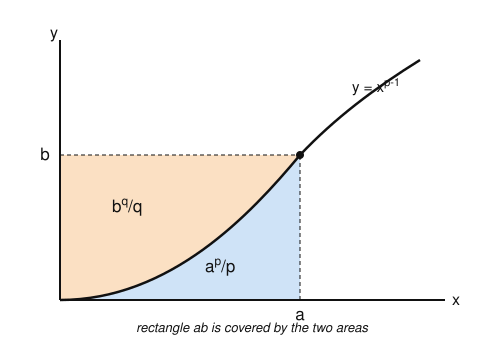

# Measure Theory · Lesson 3.3: The $L^p$ spaces — Hölder and Minkowski

> ⏱ ~15 min · Module 3: $L^p$ spaces and modes of convergence · Builds on: [Lesson 2.3](02-03-general-lebesgue-integral.md) (the general Lebesgue integral) · Unlocks: [Lesson 3.4](03-04-completeness-riesz-fischer.md) (completeness / Riesz–Fischer)

## Why this matters

Once you can integrate, the natural next move is to treat *functions themselves* as points in a space and measure distances between them. The distance that makes analysis work is $\lVert f-g\rVert_p=\left(\int|f-g|^p\,d\mu\right)^{1/p}$ — but calling it a distance is a bluff until you prove the triangle inequality. That is exactly **Minkowski's inequality**, and it rests on **Hölder's inequality**, which rests on a one-line convexity fact (**Young's inequality**). Nail this chain and $L^p$ becomes a genuine normed vector space: the Banach spaces of [functional analysis](../../functional-analysis/syllabus.md), the $L^2$ Hilbert space where Fourier series live in [fourier-analysis](../../fourier-analysis/syllabus.md), and the home of random variables with finite variance in [probability-theory](../../probability-theory/syllabus.md) ($L^2$ = finite second moment).

## The idea

Fix a measure space $(X,\mathcal{M},\mu)$ and an exponent $1\le p<\infty$. The $p$-norm of $f$ averages $|f|^p$ and takes the $p$-th root:
$$\lVert f\rVert_p=\left(\int_X |f|^p\,d\mu\right)^{1/p}.$$
For a norm we need three things: it's nonnegative and zero only for the "zero" function, it scales ($\lVert cf\rVert_p=|c|\,\lVert f\rVert_p$ — immediate), and it obeys the triangle inequality. Scaling is free; positivity is almost free. **The triangle inequality is the whole fight**, and the surprise is that it does *not* follow from the pointwise inequality $|f+g|\le|f|+|g|$ once you raise to the $p$-th power. You need a genuinely new tool.

That tool is a duality between the exponents $p$ and $q=\tfrac{p}{p-1}$. These are **conjugate**: $\tfrac1p+\tfrac1q=1$. Hölder says the integral of a product is controlled by the $p$-norm of one factor times the $q$-norm of the other — a vast generalization of Cauchy–Schwarz (which is the self-dual case $p=q=2$). And Hölder, applied cleverly to $|f+g|^{p-1}$, delivers Minkowski. The seed of the whole tower is a picture about areas.

## The formal version

**Definition ($L^p$ space, $1\le p<\infty$).** $L^p(\mu)$ is the set of measurable $f:X\to\mathbb{R}$ (or $\mathbb{C}$) with $\int_X|f|^p\,d\mu<\infty$, equipped with $\lVert f\rVert_p=\left(\int_X|f|^p\,d\mu\right)^{1/p}$.

**Definition ($L^\infty$ and essential sup).** The **essential supremum** of $|f|$ is
$$\lVert f\rVert_\infty=\operatorname*{ess\,sup}_{X}|f|:=\inf\{M\ge 0:\ |f(x)|\le M\text{ for }\mu\text{-a.e. }x\}=\inf\{M\ge 0:\ \mu(\{|f|>M\})=0\}.$$
$L^\infty(\mu)$ is the set of $f$ with $\lVert f\rVert_\infty<\infty$.
*In words:* the smallest ceiling $|f|$ respects once you're allowed to ignore a null set — the sup that doesn't care about measure-zero misbehavior.

**Definition (conjugate exponents).** $p,q\in[1,\infty]$ are **conjugate** if $\tfrac1p+\tfrac1q=1$ (with the conventions $\tfrac1\infty=0$, so $p=1\leftrightarrow q=\infty$). Equivalently, for $1<p<\infty$, $q=\tfrac{p}{p-1}$, and note $(p-1)q=p$.

**Young's inequality.** For $a,b\ge 0$ and conjugate $p,q\in(1,\infty)$,
$$ab\le \frac{a^p}{p}+\frac{b^q}{q},\qquad\text{with equality }\iff a^p=b^q.$$
*In words:* a product is dominated by a weighted sum of pure powers, the weights being the reciprocal exponents.

**Hölder's inequality.** For measurable $f,g$ and conjugate $p,q\in[1,\infty]$,
$$\int_X |fg|\,d\mu\ \le\ \lVert f\rVert_p\,\lVert g\rVert_q.$$
*In words:* the $L^1$ size of a product never exceeds the $p$-size of one factor times the dual $q$-size of the other. (In particular $fg\in L^1$ when $f\in L^p,\ g\in L^q$.)

**Minkowski's inequality.** For $1\le p<\infty$ and $f,g\in L^p(\mu)$,
$$\lVert f+g\rVert_p\ \le\ \lVert f\rVert_p+\lVert g\rVert_p.$$
*In words:* the triangle inequality holds — $\lVert\cdot\rVert_p$ is subadditive, so it's a legitimate way to measure length and distance.

**Consequence ($\lVert\cdot\rVert_p$ is a norm).** On $L^p$, $\lVert f\rVert_p\ge0$; $\lVert cf\rVert_p=|c|\,\lVert f\rVert_p$; and Minkowski gives the triangle inequality. The one catch: $\lVert f\rVert_p=0$ means $\int|f|^p=0$, which forces $|f|^p=0$ a.e. (the integral of a nonnegative function vanishes iff the function is $0$ a.e. — Module 2), i.e. $f=0$ **almost everywhere**, not everywhere. So $\lVert\cdot\rVert_p$ is a *seminorm* on functions and a genuine norm only after we identify $f\sim g$ when $f=g$ a.e. Officially $L^p(\mu)$ is this space of **equivalence classes mod a.e.-equality**; we keep writing "$f$" but mean its class.

## Concrete instance

Here is the entire chain, proved, ending in a norm computation. **Young $\Rightarrow$ Hölder $\Rightarrow$ Minkowski.**

**Young, from concavity of $\log$.** If $a=0$ or $b=0$ the claim is trivial, so take $a,b>0$. The function $\log$ is concave on $(0,\infty)$, so for weights $\tfrac1p,\tfrac1q\ge0$ summing to $1$,
$$\log\!\left(\tfrac1p a^p+\tfrac1q b^q\right)\ \ge\ \tfrac1p\log(a^p)+\tfrac1q\log(b^q)=\log a+\log b=\log(ab).$$
Since $\log$ is increasing, exponentiating gives $ab\le \tfrac{a^p}{p}+\tfrac{b^q}{q}$. Concavity is strict, so equality requires $a^p=b^q$. $\blacksquare$

The picture is the geometry behind it. The curve $y=x^{p-1}$ is the same as $x=y^{q-1}$ (because $\tfrac1{p-1}=q-1$). The area under it up to $x=a$ is $\int_0^a x^{p-1}\,dx=\tfrac{a^p}{p}$; the area left of it up to $y=b$ is $\int_0^b y^{q-1}\,dy=\tfrac{b^q}{q}$. Those two regions always cover the $a\times b$ rectangle, so their areas sum to at least $ab$ — with equality exactly when the corner $(a,b)$ sits on the curve, i.e. $b=a^{p-1}$, i.e. $a^p=b^q$.

**Hölder, from Young.** Take $1<p<\infty$. If $\lVert f\rVert_p=0$ then $f=0$ a.e., so $fg=0$ a.e. and both sides are $0$; likewise if $\lVert g\rVert_q=0$. If either norm is $+\infty$ (and the other nonzero) the right side is $+\infty$ and there is nothing to prove. So assume $0<\lVert f\rVert_p,\lVert g\rVert_q<\infty$ and **normalize**: set
$$F=\frac{|f|}{\lVert f\rVert_p},\qquad G=\frac{|g|}{\lVert g\rVert_q},\qquad\text{so } \lVert F\rVert_p=\lVert G\rVert_q=1.$$
Apply Young pointwise with $a=F(x),\ b=G(x)$:
$$F(x)G(x)\ \le\ \frac{F(x)^p}{p}+\frac{G(x)^q}{q}\qquad\text{for every }x.$$
Integrate — everything is nonnegative, so the integral respects the inequality:
$$\int_X FG\,d\mu\ \le\ \frac1p\int_X F^p\,d\mu+\frac1q\int_X G^q\,d\mu=\frac1p\cdot 1+\frac1q\cdot 1=1.$$
Now un-normalize. Since $\int FG=\dfrac{\int|fg|}{\lVert f\rVert_p\lVert g\rVert_q}$, the bound $\int FG\le 1$ says exactly
$$\int_X|fg|\,d\mu\ \le\ \lVert f\rVert_p\,\lVert g\rVert_q. \qquad\blacksquare$$
(The endpoint case $p=1,\ q=\infty$ is even simpler: $|g|\le\lVert g\rVert_\infty$ a.e., so $\int|fg|\le\lVert g\rVert_\infty\int|f|=\lVert f\rVert_1\lVert g\rVert_\infty$.)

**Minkowski, from Hölder.** For $p=1$ it's just $\int|f+g|\le\int|f|+\int|g|$, the pointwise triangle inequality integrated. Take $1<p<\infty$. First, $f+g\in L^p$: since $|f+g|^p\le\big(2\max(|f|,|g|)\big)^p\le 2^p(|f|^p+|g|^p)$, the integral is finite. If $\lVert f+g\rVert_p=0$ we're done, so assume it's positive (and finite). Split the integrand using $|f+g|^p=|f+g|\cdot|f+g|^{p-1}$ and the pointwise triangle inequality:
$$\int_X|f+g|^p\,d\mu\ \le\ \int_X|f|\,|f+g|^{p-1}\,d\mu+\int_X|g|\,|f+g|^{p-1}\,d\mu.$$
Apply Hölder to each term, pairing $|f|\in L^p$ with $|f+g|^{p-1}$. The second factor lands in $L^q$ because $(p-1)q=p$:
$$\left(\int_X\big(|f+g|^{p-1}\big)^q\,d\mu\right)^{1/q}=\left(\int_X|f+g|^{p}\,d\mu\right)^{1/q}=\lVert f+g\rVert_p^{\,p/q}.$$
Therefore
$$\int_X|f+g|^p\,d\mu\ \le\ \big(\lVert f\rVert_p+\lVert g\rVert_p\big)\,\lVert f+g\rVert_p^{\,p/q}.$$
The left side is $\lVert f+g\rVert_p^{\,p}$. Divide both sides by $\lVert f+g\rVert_p^{\,p/q}$ (legal: it's positive and finite), and use $p-\tfrac{p}{q}=p\big(1-\tfrac1q\big)=p\cdot\tfrac1p=1$:
$$\lVert f+g\rVert_p^{\,p-p/q}=\lVert f+g\rVert_p\ \le\ \lVert f\rVert_p+\lVert g\rVert_p. \qquad\blacksquare$$

**A norm, computed.** Take $X=[1,\infty)$ with Lebesgue measure and $f(x)=1/x$. For $p>1$,
$$\lVert f\rVert_p^{\,p}=\int_1^\infty x^{-p}\,dx=\left[\frac{x^{-p+1}}{-p+1}\right]_1^\infty=\frac{1}{p-1}\quad\Rightarrow\quad \lVert f\rVert_p=(p-1)^{-1/p},$$
finite for every $p>1$, while $\lVert f\rVert_1=\int_1^\infty x^{-1}\,dx=\infty$. So $1/x\in L^p([1,\infty))$ for all $p>1$ but $1/x\notin L^1$: **on an infinite-measure space the $L^p$ spaces are genuinely different, and larger $p$ tolerates fatter tails.**

## Worked examples

**Example 1 (essential sup ignores null sets).** On $([0,1],\lambda)$ let
$$g(x)=\begin{cases}7,& x\in\mathbb{Q}\cap[0,1],\\ x,& x\notin\mathbb{Q}.\end{cases}$$
The ordinary supremum is $7$. But $\mathbb{Q}\cap[0,1]$ is countable, hence $\lambda$-null, so for a.e. $x$ we have $g(x)=x\le 1$, and no smaller ceiling works (values approach $1$ on the irrationals). Thus $\lVert g\rVert_\infty=\operatorname*{ess\,sup}|g|=1$. The essential sup sees the "typical" behavior and discards the measure-zero spike — precisely the robustness $L^\infty$ is built for.

**Example 2 (Hölder gives nesting of $L^p$ on finite measure).** Suppose $\mu(X)<\infty$ and $1\le r<p<\infty$. Claim: $L^p(\mu)\subseteq L^r(\mu)$ with
$$\lVert f\rVert_r\ \le\ \mu(X)^{\frac1r-\frac1p}\,\lVert f\rVert_p.$$
Write $|f|^r=|f|^r\cdot 1$ and apply Hölder with the conjugate pair $s=\tfrac pr>1$ and $s'=\tfrac{p}{p-r}$ (check: $\tfrac1s+\tfrac1{s'}=\tfrac rp+\tfrac{p-r}p=1$):
$$\int_X|f|^r\,d\mu\ \le\ \left(\int_X\big(|f|^r\big)^{s}d\mu\right)^{1/s}\left(\int_X 1^{s'}d\mu\right)^{1/s'}=\left(\int_X|f|^p\,d\mu\right)^{r/p}\mu(X)^{(p-r)/p}.$$
Raise to the power $1/r$: $\lVert f\rVert_r\le\lVert f\rVert_p^{}\cdot\mu(X)^{(p-r)/(pr)}=\mu(X)^{\frac1r-\frac1p}\lVert f\rVert_p$. When $\mu(X)=1$ — a **probability space** — the prefactor is $1$ and the norms are monotone in $p$: $\lVert f\rVert_r\le\lVert f\rVert_p$. That is exactly why, in [probability-theory](../../probability-theory/syllabus.md), finite variance ($L^2$) implies finite mean ($L^1$): higher moments control lower ones.

## Watch out

- You might think $\lVert\cdot\rVert_p$ is a norm on functions — but $\lVert f\rVert_p=0$ only forces $f=0$ *almost everywhere*. On raw functions it's a seminorm; positive-definiteness holds only after passing to equivalence classes mod a.e.-equality. When someone says "$f\in L^p$," they mean a class of functions agreeing a.e.
- You might think Hölder is a statement about $p=q=2$ (Cauchy–Schwarz) — but that's just the self-conjugate case. The real hypothesis is conjugacy $\tfrac1p+\tfrac1q=1$; and it includes the endpoint $p=1,\ q=\infty$ with $\int|fg|\le\lVert f\rVert_1\lVert g\rVert_\infty$. Forget the constraint $\tfrac1p+\tfrac1q=1$ and the inequality is simply false.
- You might think you can prove Minkowski by raising $|f+g|\le|f|+|g|$ to the $p$-th power and integrating — but $(A+B)^p\ne A^p+B^p$, and $\left(\int(|f|+|g|)^p\right)^{1/p}$ is not obviously $\le\lVert f\rVert_p+\lVert g\rVert_p$. The whole point is that the split $|f+g|^p=|f+g|\,|f+g|^{p-1}$ plus Hölder is the move that actually closes it; the exponent bookkeeping $(p-1)q=p$ is not a coincidence but the definition of conjugacy doing its job.

## One-liner

> One convexity fact (Young) gives duality of products (Hölder), which gives the triangle inequality (Minkowski) — and that is the entire reason $\lVert\cdot\rVert_p$ is a norm.

## Problems

**P1 (🟢)** (a) On $([0,1],\lambda)$ let $f(x)=x^{-1/3}$. For which $p\in[1,\infty)$ is $f\in L^p$? Compute $\lVert f\rVert_2$. (b) On $([0,1],\lambda)$ compute $\operatorname*{ess\,sup}|h|$ where $h(x)=\dfrac1{x}$ for $x\in(0,1]$ irrational and $h(x)=0$ for $x$ rational.

**P2 (🟡)** Let $f\in L^2(\mu)$ on a space with $\mu(X)<\infty$. Use Hölder (with a well-chosen conjugate pair) to prove $f\in L^1(\mu)$ and $\lVert f\rVert_1\le \mu(X)^{1/2}\,\lVert f\rVert_2$. Then state what this says on a probability space and name the elementary probability inequality it reproduces.

**P3 (🔴, optional)** Equality in Hölder. Let $1<p<\infty$, $f\in L^p$, $g\in L^q$ with $\lVert f\rVert_p,\lVert g\rVert_q>0$. Prove that $\displaystyle\int_X|fg|\,d\mu=\lVert f\rVert_p\lVert g\rVert_q$ holds **iff** there exist constants $\alpha,\beta\ge0$, not both zero, with $\alpha\,|f|^p=\beta\,|g|^q$ almost everywhere. (Hint: trace the equality case of Young through the normalized proof.)

Solutions

**P1** (a) $\displaystyle\lVert f\rVert_p^{\,p}=\int_0^1 x^{-p/3}\,dx$, which converges iff $\tfrac p3<1$, i.e. $p<3$. So $f\in L^p([0,1])\iff 1\le p<3$. For $p=2$: $\int_0^1 x^{-2/3}\,dx=\big[3x^{1/3}\big]_0^1=3$, hence $\lVert f\rVert_2=\sqrt3$.

(b) The rationals are $\lambda$-null, so they don't affect the essential sup; on the irrationals $h(x)=1/x$ is unbounded as $x\to0^+$, and $\{h>M\}\supseteq (0,1/M)\cap(\text{irrationals})$ has positive measure for every $M$. Hence no finite ceiling holds a.e.: $\operatorname*{ess\,sup}|h|=+\infty$ (so $h\notin L^\infty$). Note $h\in L^p$ still fails here for $p\ge1$ too since $\int x^{-p}=\infty$, but the question is only about the essential sup.

**P2** Apply Example 2 with $r=1,\ p=2$ (so $s=2$, $s'=2$): Hölder on $|f|=|f|\cdot 1$ gives
$$\int_X|f|\,d\mu\le\left(\int_X|f|^2\,d\mu\right)^{1/2}\left(\int_X 1\,d\mu\right)^{1/2}=\lVert f\rVert_2\,\mu(X)^{1/2}.$$
The right side is finite (since $f\in L^2$ and $\mu(X)<\infty$), so $f\in L^1$ and $\lVert f\rVert_1\le\mu(X)^{1/2}\lVert f\rVert_2$. On a probability space $\mu(X)=1$, giving $\lVert f\rVert_1\le\lVert f\rVert_2$, i.e. $\mathbb{E}|f|\le\big(\mathbb{E}|f|^2\big)^{1/2}$. Squaring: $(\mathbb{E}|f|)^2\le\mathbb{E}|f|^2$ — the statement that variance $\mathrm{Var}(f)=\mathbb{E}|f|^2-(\mathbb{E}|f|)^2\ge0$, equivalently Jensen's inequality for the convex function $t\mapsto t^2$.

**P3** ($\Leftarrow$, sketch of tightness) By homogeneity we may normalize $\lVert f\rVert_p=\lVert g\rVert_q=1$; the claimed proportionality $\alpha|f|^p=\beta|g|^q$ a.e. then forces $|f|^p=|g|^q$ a.e. (both integrate to $1$, so the constants match), which is the equality case of Young at every point — see below.

($\Rightarrow$, the real direction) Normalize $F=|f|/\lVert f\rVert_p$, $G=|g|/\lVert g\rVert_q$, so $\lVert F\rVert_p=\lVert G\rVert_q=1$ and the hypothesis becomes $\int FG\,d\mu=1$. Young gives, pointwise, $FG\le \tfrac{F^p}p+\tfrac{G^q}q$, and integrating both sides yields $\int FG\le \tfrac1p+\tfrac1q=1$. Since the two ends are equal ($=1$), the nonnegative gap $\big(\tfrac{F^p}p+\tfrac{G^q}q\big)-FG$ integrates to $0$, so it is $0$ almost everywhere. But by the equality clause of Young, $FG=\tfrac{F^p}p+\tfrac{G^q}q$ at a point iff $F^p=G^q$ there. Hence $F^p=G^q$ a.e., i.e.
$$\frac{|f|^p}{\lVert f\rVert_p^{\,p}}=\frac{|g|^q}{\lVert g\rVert_q^{\,q}}\quad\text{a.e.}$$
which is $\alpha|f|^p=\beta|g|^q$ a.e. with $\alpha=\lVert f\rVert_p^{-p},\ \beta=\lVert g\rVert_q^{-q}$ (both positive). $\blacksquare$

## Flashback

**From [Lesson 2.3](02-03-general-lebesgue-integral.md) (positive/negative parts and $L^1$):** Let $f(x)=\cos x$ on $X=[0,\pi]$ with Lebesgue measure. Write $f=f^+-f^-$ with $f^\pm=\max(\pm f,0)$, compute $\int_X f\,d\lambda$ and $\int_X|f|\,d\lambda$ *from the two parts separately*, and confirm $f\in L^1(X)$.

Solution

On $[0,\pi]$, $\cos x\ge0$ for $x\in[0,\tfrac\pi2]$ and $\cos x\le0$ for $x\in[\tfrac\pi2,\pi]$. So
$$f^+(x)=\begin{cases}\cos x,&x\in[0,\tfrac\pi2]\\0,&\text{else}\end{cases}\qquad f^-(x)=\begin{cases}-\cos x,&x\in[\tfrac\pi2,\pi]\\0,&\text{else}.\end{cases}$$
Then
$$\int_X f^+=\int_0^{\pi/2}\cos x\,dx=\big[\sin x\big]_0^{\pi/2}=1,\qquad \int_X f^-=\int_{\pi/2}^{\pi}(-\cos x)\,dx=-\big[\sin x\big]_{\pi/2}^{\pi}=-(0-1)=1.$$
By definition of the general integral, $\int_X f\,d\lambda=\int f^+-\int f^-=1-1=0$, and $\int_X|f|\,d\lambda=\int f^++\int f^-=1+1=2$. Since $\int|f|=2<\infty$, indeed $f\in L^1(X)$ (integrability is *absolute* integrability — the defining lesson of $L^1$). This is $\lVert f\rVert_1=2$, and it previews P2: on the finite-measure space $[0,\pi]$ one also has $\lVert f\rVert_1\le \pi^{1/2}\lVert f\rVert_2$.

## Connections

- **Backward:** the positivity step "$\int|f|^p=0\Rightarrow f=0$ a.e." and the pointwise-to-integral monotonicity used throughout come straight from the integral built in Module 2 ([Lesson 2.3](02-03-general-lebesgue-integral.md)); the whole $L^p$ construction is just that integral wearing a norm.
- **Forward:** [Lesson 3.4](03-04-completeness-riesz-fischer.md) uses Minkowski to make sense of $\big\lVert\sum f_k\big\rVert_p\le\sum\lVert f_k\rVert_p$ for series, the key estimate in the Riesz–Fischer proof that $L^p$ is **complete** — a Banach space.
- **Sideways ([functional-analysis](../../functional-analysis/syllabus.md)):** $L^p$ spaces are *the* motivating examples of Banach spaces; Hölder is the pairing that identifies the dual $(L^p)^*=L^q$, and $L^2$ (self-conjugate, $p=q=2$, Hölder = Cauchy–Schwarz) is the model **Hilbert space**.
- **Sideways ([fourier-analysis](../../fourier-analysis/syllabus.md)) and ([probability-theory](../../probability-theory/syllabus.md)):** completeness of $L^2$ is exactly what makes Fourier series converge *in mean square*; and in probability, $L^2$ = finite variance, with Example 2's nesting $\lVert f\rVert_1\le\lVert f\rVert_2$ (on a probability space) being why finite variance implies finite mean.
