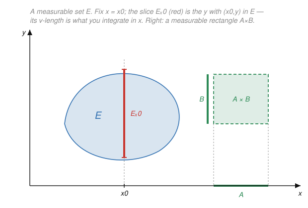

# Measure Theory · Lesson 4.1: Product measures

> ⏱ ~15 min · Module 4: Product measures, Radon–Nikodym, and differentiation · Builds on: [Lesson 1.2](01-02-sigma-algebras.md), [Lesson 1.3](01-03-measures-properties.md), [Lesson 2.4](02-04-monotone-convergence-fatou.md) · Unlocks: [Lesson 4.2](04-02-fubini-tonelli.md)

## Why this matters

Every double integral you have ever written — the area of a region in the plane, a joint probability $P(X\in A,\,Y\in B)$, the energy $\iint |u(x,y)|^2\,dx\,dy$ of a field — silently assumes there is a single measure on the *product* space $X\times Y$ that assigns a rectangle $A\times B$ the "obvious" size $\mu(A)\,\nu(B)$. That measure is not free: you must first decide *which* subsets of $X\times Y$ are measurable, then prove a measure with the rectangle property exists and is unique. This lesson builds that object. It is the entire foundation Fubini–Tonelli (Lesson 4.2) stands on, and it is exactly why a joint distribution in `probability-theory` is a genuine measure and why $L^2(\mathbb{R}^2)$ in `functional-analysis` is a well-defined Hilbert space and not wishful notation.

## The idea

You know how to measure sets in $X$ and sets in $Y$ separately. You want to measure sets in $X\times Y$. The honest starting point is the only shape whose size is beyond dispute: a **rectangle** $A\times B$, which should have size $\mu(A)\cdot\nu(B)$ — width times height. Everything else is built from these.

Two moves do all the work.

- **Generate the σ-algebra from rectangles.** Take the smallest σ-algebra containing every measurable rectangle. This is the arena $\mathcal{A}\otimes\mathcal{B}$ of "answerable questions" about pairs $(x,y)$ — the exact same "generate from a convenient family" trick you used for the Borel sets in Lesson 1.2, now with rectangles playing the role the open intervals played there.
- **Slice, then integrate the slices.** To size a general set $E$, cut it with the vertical line at each $x$ and measure the slice $E_x=\{y:(x,y)\in E\}$ with $\nu$. That gives a number $\nu(E_x)$ for each $x$; sweeping $x$ across $X$ and integrating $\int_X \nu(E_x)\,d\mu(x)$ sums up the slices. For a rectangle this reproduces $\mu(A)\nu(B)$ (each slice is $B$, of height $\nu(B)$, over the base $A$ of width $\mu(A)$), and for a general $E$ it *defines* the product measure.

The one non-obvious hypothesis is **σ-finiteness**: both spaces must be a countable union of finite-measure pieces. Without it the slicing is not even well-defined — the two ways of slicing ($x$-first vs. $y$-first) can disagree, so "the" product measure loses both its uniqueness and its right to be called a product. We will see exactly where that breaks.

## The formal version

Fix measurable spaces $(X,\mathcal{A})$ and $(Y,\mathcal{B})$.

**Definition (measurable rectangle, product σ-algebra).** A **measurable rectangle** is a set $A\times B$ with $A\in\mathcal{A}$ and $B\in\mathcal{B}$. The **product σ-algebra** is
$$\mathcal{A}\otimes\mathcal{B} \;:=\; \sigma\big(\{\,A\times B : A\in\mathcal{A},\ B\in\mathcal{B}\,\}\big).$$

*In words:* the smallest σ-algebra on $X\times Y$ containing every measurable rectangle — the product analogue of "the Borel sets are generated by the intervals."

The rectangles are a **π-system** (closed under finite intersection), because
$$(A_1\times B_1)\cap(A_2\times B_2)=(A_1\cap A_2)\times(B_1\cap B_2).$$
Hold onto this — it is what makes Dynkin's lemma applicable below.

**Definition (sections).** For $E\subseteq X\times Y$ and a point $x\in X$, the **$x$-section** is
$$E_x:=\{y\in Y : (x,y)\in E\}\subseteq Y,$$
and symmetrically the **$y$-section** $E^y:=\{x\in X:(x,y)\in E\}\subseteq X$. For a function $f$ on $X\times Y$, the section $f_x:Y\to\mathbb{R}$ is $f_x(y):=f(x,y)$.

*In words:* $E_x$ is the vertical slice of $E$ above the point $x$; $E^y$ the horizontal slice.

The engine behind everything is that **sectioning commutes with all set operations**:
$$(E^c)_x=(E_x)^c,\qquad \Big(\bigcup_n E_n\Big)_x=\bigcup_n (E_n)_x,\qquad (A\times B)_x=\begin{cases}B,& x\in A,\\ \varnothing,& x\notin A.\end{cases}$$

**Lemma (sections of measurable sets are measurable).** If $E\in\mathcal{A}\otimes\mathcal{B}$, then $E_x\in\mathcal{B}$ for every $x\in X$, and $E^y\in\mathcal{A}$ for every $y\in Y$.

*Proof.* Fix $x$ and let $\mathcal{C}:=\{E\subseteq X\times Y : E_x\in\mathcal{B}\}$. By the display above, every rectangle lies in $\mathcal{C}$ (its section is $B$ or $\varnothing$, both in $\mathcal{B}$), and $\mathcal{C}$ is a σ-algebra: it is closed under complement because $(E^c)_x=(E_x)^c$, and under countable union because sectioning distributes over unions. So $\mathcal{C}$ is a σ-algebra containing all rectangles, hence contains the σ-algebra they generate: $\mathcal{A}\otimes\mathcal{B}\subseteq\mathcal{C}$. The $y$-section claim is identical. $\blacksquare$

*In words:* you never lose measurability by slicing — proved by the standard "the good sets form a σ-algebra containing the generators" move.

**The promotion tool.** To push a property from rectangles to *all* of $\mathcal{A}\otimes\mathcal{B}$ we use:

**Dynkin's π–λ theorem.** If $\mathcal{P}$ is a π-system and $\mathcal{L}\supseteq\mathcal{P}$ is a λ-system (contains $X\times Y$, is closed under proper differences $F\setminus E$ with $E\subseteq F$, and under increasing countable unions), then $\sigma(\mathcal{P})\subseteq\mathcal{L}$. *(The monotone class theorem — for algebras and monotone classes — is the same idea in a different dress; either one does the job here.)*

**Theorem (product measure).** Let $(X,\mathcal{A},\mu)$ and $(Y,\mathcal{B},\nu)$ be **σ-finite**. For every $E\in\mathcal{A}\otimes\mathcal{B}$:
1. $x\mapsto\nu(E_x)$ is $\mathcal{A}$-measurable and $y\mapsto\mu(E^y)$ is $\mathcal{B}$-measurable;
2. the two integrals agree, and we *define*
$$(\mu\times\nu)(E)\;:=\;\int_X \nu(E_x)\,d\mu(x)\;=\;\int_Y \mu(E^y)\,d\nu(y);$$
3. $\mu\times\nu$ is a measure on $\mathcal{A}\otimes\mathcal{B}$ with $(\mu\times\nu)(A\times B)=\mu(A)\,\nu(B)$, and it is the **unique** measure with that rectangle property.

*In words:* size a set by integrating the $\nu$-length of its slices; σ-finiteness guarantees both slicings give the same answer and that no second measure can share the rectangle values.

*Proof (structure — the part worth internalizing).* Assume first $\mu,\nu$ **finite**. Let $\mathcal{D}$ be the collection of $E\in\mathcal{A}\otimes\mathcal{B}$ satisfying (1) and the equality in (2). Then:
- **Rectangles lie in $\mathcal{D}$.** $\nu((A\times B)_x)=\nu(B)\,\mathbf{1}_A(x)$ is measurable with integral $\mu(A)\nu(B)$; the $y$-side gives $\mu(A)\,\mathbf{1}_B(y)$ with the same integral. So the rectangle π-system sits inside $\mathcal{D}$.
- **$\mathcal{D}$ is a λ-system.** It contains $X\times Y$. If $E\subseteq F$ are in $\mathcal{D}$, then finiteness lets us subtract: $\nu((F\setminus E)_x)=\nu(F_x)-\nu(E_x)$ is measurable, and both integrals subtract while staying equal — so $F\setminus E\in\mathcal{D}$. If $E_n\uparrow E$, then $(E_n)_x\uparrow E_x$, so $\nu((E_n)_x)\uparrow\nu(E_x)$ by continuity from below (Lesson 1.3); the limit is measurable, and monotone convergence (Lesson 2.4) carries the equality of integrals to the limit — so $E\in\mathcal{D}$.

By π–λ, $\mathcal{D}=\mathcal{A}\otimes\mathcal{B}$: the finite case is done. For the **σ-finite** case, write $X=\bigcup_j X_j$ and $Y=\bigcup_k Y_k$ as increasing unions of finite-measure sets; apply the finite result to each $E\cap(X_j\times Y_k)$ and let $j,k\to\infty$, using monotone convergence again. Finally, $\mu\times\nu$ is a **measure**: disjoint $E^{(i)}$ have disjoint sections, so $\nu\big((\biguplus_i E^{(i)})_x\big)=\sum_i \nu(E^{(i)}_x)$ by countable additivity of $\nu$, and integrating term-by-term (monotone convergence for the partial sums) gives countable additivity of $\mu\times\nu$. **Uniqueness:** any measure $\rho$ with $\rho(A\times B)=\mu(A)\nu(B)$ agrees with $\mu\times\nu$ on the rectangle π-system, and the sets $X_j\times Y_k$ exhaust $X\times Y$ with finite measure — so Dynkin's uniqueness theorem (two σ-finite measures agreeing on a generating π-system are equal) forces $\rho=\mu\times\nu$ on all of $\mathcal{A}\otimes\mathcal{B}$. $\blacksquare$

**Lebesgue measure as a product.** On $\mathbb{R}^{m+n}=\mathbb{R}^m\times\mathbb{R}^n$ one has $\mathcal{B}(\mathbb{R}^m)\otimes\mathcal{B}(\mathbb{R}^n)=\mathcal{B}(\mathbb{R}^{m+n})$ (both are generated by open rational boxes), and on these Borel sets $\lambda_{m+n}=\lambda_m\times\lambda_n$ — because both are measures giving the box $\prod(a_i,b_i)$ its volume $\prod(b_i-a_i)$, and uniqueness does the rest. So the volume in $\mathbb{R}^3$ really is "area of base times height," promoted to a theorem.

## Picture

The blob $E$ is a measurable set in the plane. Fix $x=x_0$: the red segment is the section $E_{x_0}=\{y:(x_0,y)\in E\}$, a measurable subset of the $y$-axis, and its $\nu$-length $\nu(E_{x_0})$ is the integrand you sweep across all $x$ to get $(\mu\times\nu)(E)$. On the right, the green rectangle $A\times B$ is an *atom* of the construction: its size is fixed to be $\mu(A)\nu(B)$, and $\mathcal{A}\otimes\mathcal{B}$ is everything you can build from such rectangles by countable set operations.

## Worked examples

**Example 1 (mechanical — a rectangle and a triangle by slicing).** Work in $(\mathbb{R}^2,\mathcal{B}\otimes\mathcal{B},\lambda\times\lambda)$; both factors are σ-finite ($\mathbb{R}=\bigcup_n[-n,n]$).

*Rectangle.* For $R=[0,2]\times[1,4]$, directly $(\lambda\times\lambda)(R)=\lambda([0,2])\,\lambda([1,4])=2\cdot 3=6$.

*Triangle.* Let $T=\{(x,y):0\le x\le 1,\ 0\le y\le x\}$. First, $T$ is measurable: it is closed, hence Borel, hence in $\mathcal{B}\otimes\mathcal{B}=\mathcal{B}(\mathbb{R}^2)$. Its $x$-section is
$$T_x=\begin{cases}[0,x], & 0\le x\le 1,\\[2pt]\varnothing, & \text{otherwise,}\end{cases}\qquad\Rightarrow\qquad \lambda(T_x)=\begin{cases}x,&0\le x\le1,\\0,&\text{else.}\end{cases}$$
This is a measurable (continuous) function of $x$, exactly as the Lemma and Theorem promise. Integrate the slices:
$$(\lambda\times\lambda)(T)=\int_{\mathbb{R}}\lambda(T_x)\,d\lambda(x)=\int_0^1 x\,dx=\tfrac12,$$
the familiar area of the triangle — but now delivered by the *definition* of product measure, no Fubini invoked.

**Example 2 (why you'd care — a curved region recovers its area, with measurable sections).** Let $E=\{(x,y):x^2+y^2<1\}$, the open unit disk. It is open, hence Borel, hence in $\mathcal{B}\otimes\mathcal{B}$. Its section
$$E_x=\big\{y : y^2<1-x^2\big\}=\big(-\sqrt{1-x^2},\ \sqrt{1-x^2}\big)\quad(|x|<1),\qquad E_x=\varnothing\ (|x|\ge1),$$
is an open interval — visibly a measurable subset of $\mathbb{R}$, so $x\mapsto\lambda(E_x)=2\sqrt{1-x^2}\,\mathbf{1}_{(-1,1)}(x)$ is a bona fide measurable integrand. Therefore
$$(\lambda\times\lambda)(E)=\int_{-1}^{1}2\sqrt{1-x^2}\,dx=\pi.$$
The area of the disk is not an axiom here — it is the product measure of a set whose every slice is a measurable interval. The same mechanism, run in $\mathbb{R}^{m+n}$, is what lets you compute volumes and joint probabilities by slicing.

## Watch out

- **You might think every subset of $X\times Y$ has measurable sections** — but the Lemma only guarantees it for $E\in\mathcal{A}\otimes\mathcal{B}$. A set outside the product σ-algebra can have a non-measurable slice. Measurability of the whole is what buys measurability of the parts, not the reverse: a set with all slices measurable need not itself be in $\mathcal{A}\otimes\mathcal{B}$.
- **You might think σ-finiteness is a technicality you can drop** — it is load-bearing. On $[0,1]$ take $\mu=\lambda$ (Lebesgue) and $\nu=$ counting measure ($\nu$ is *not* σ-finite). For the diagonal $D=\{(x,x)\}$, slicing in $x$ gives $\int\nu(D_x)\,d\mu=\int 1\,d\mu=1$, but slicing in $y$ gives $\int\mu(D^y)\,d\nu=\int 0\,d\nu=0$. The two slicings disagree, so clause (2) fails and "the" product measure is neither well-defined by this formula nor unique. (You'll meet this again as the canonical Fubini counterexample in Lesson 4.2.)
- **You might think $\mathcal{A}\otimes\mathcal{B}$ is "all subsets whose slices are measurable," or that products of *complete* measures stay complete** — neither. In particular the product of the Lebesgue σ-algebras on $\mathbb{R}^m,\mathbb{R}^n$ is strictly smaller than the Lebesgue σ-algebra on $\mathbb{R}^{m+n}$; you build the product on the Borel sets and then *complete* it. Do the product first, complete second.

## One-liner

> A product measure is manufactured from rectangles ($\mu(A)\nu(B)$) and delivered by slicing ($\int\nu(E_x)\,d\mu$) — and only σ-finiteness makes the slice-then-integrate recipe well-defined and unique.

## Problems

**P1 (🟢)** In $(\mathbb{R}^2,\mathcal{B}\otimes\mathcal{B},\lambda\times\lambda)$ let $E=\{(x,y):0\le x\le 2,\ 0\le y\le x^2\}$. (a) Explain in one line why $E\in\mathcal{B}\otimes\mathcal{B}$. (b) Write the section $E_x$ and the function $x\mapsto\lambda(E_x)$. (c) Compute $(\lambda\times\lambda)(E)$ by integrating the slices.

**P2 (🟡)** Let $f:X\times Y\to\mathbb{R}$ be $\mathcal{A}\otimes\mathcal{B}$-measurable. Prove that for each fixed $x\in X$ the section $f_x:Y\to\mathbb{R}$, $f_x(y)=f(x,y)$, is $\mathcal{B}$-measurable. (Reduce it to the section Lemma for sets — do not integrate anything.)

**P3 (🔴, optional)** With $X=Y=[0,1]$, $\mathcal{A}=\mathcal{B}=\mathcal{B}([0,1])$, $\mu=\lambda$, and $\nu=$ counting measure, let $D=\{(x,x):x\in[0,1]\}$. (a) Show $D\in\mathcal{A}\otimes\mathcal{B}$ by exhibiting it as a countable combination of rectangles. (b) Compute both iterated slice-integrals $\int\nu(D_x)\,d\mu(x)$ and $\int\mu(D^y)\,d\nu(y)$. (c) State precisely which hypothesis of the product-measure theorem fails and why it makes clause (2) collapse.

Solutions

**P1** (a) $E$ is the region below the continuous graph $y=x^2$ over $[0,2]$ and above $y=0$; it is closed (an intersection of the closed sets $\{x\ge0\},\{x\le2\},\{y\ge0\},\{y\le x^2\}$), hence Borel, and $\mathcal{B}\otimes\mathcal{B}=\mathcal{B}(\mathbb{R}^2)$.

(b) For $0\le x\le 2$ the slice is $E_x=[0,x^2]$, and $E_x=\varnothing$ otherwise. Thus
$$\lambda(E_x)=\begin{cases}x^2,&0\le x\le 2,\\ 0,&\text{else,}\end{cases}$$
a continuous, hence measurable, function of $x$.

(c) $(\lambda\times\lambda)(E)=\displaystyle\int_{\mathbb{R}}\lambda(E_x)\,d\lambda(x)=\int_0^2 x^2\,dx=\Big[\tfrac{x^3}{3}\Big]_0^2=\tfrac{8}{3}.$

**P2** Measurability of $f_x$ means: for every $a\in\mathbb{R}$, the set $\{y\in Y:f_x(y)>a\}$ lies in $\mathcal{B}$ (checking the generating rays $(a,\infty)$ suffices, by Lesson 1.2). Since $f$ is $\mathcal{A}\otimes\mathcal{B}$-measurable, the superlevel set
$$E:=\{(x',y)\in X\times Y : f(x',y)>a\}=f^{-1}\big((a,\infty)\big)\in\mathcal{A}\otimes\mathcal{B}.$$
Now take its $x$-section at the fixed point:
$$E_x=\{y\in Y:(x,y)\in E\}=\{y\in Y : f(x,y)>a\}=\{y:f_x(y)>a\}.$$
By the section Lemma, $E_x\in\mathcal{B}$. As $a$ was arbitrary, every ray-preimage of $f_x$ is in $\mathcal{B}$, so $f_x$ is $\mathcal{B}$-measurable. $\blacksquare$ (The identical argument with $y$-sections shows $f^y:x\mapsto f(x,y)$ is $\mathcal{A}$-measurable — the fact Fubini's inner integrals rely on.)

**P3** (a) For each $n$ partition $[0,1]$ into the $n$ dyadic-type intervals $I_{n,k}=[\tfrac{k-1}{n},\tfrac{k}{n}]$, $k=1,\dots,n$. Set $D_n=\bigcup_{k=1}^{n}(I_{n,k}\times I_{n,k})$, a finite union of rectangles, so $D_n\in\mathcal{A}\otimes\mathcal{B}$. If $x=y$ then $(x,y)$ lies in some $I_{n,k}\times I_{n,k}$ for every $n$; if $x\ne y$ then once $\tfrac1n<|x-y|$ the points fall in different subintervals and $(x,y)\notin D_n$. Hence $D=\bigcap_{n=1}^{\infty}D_n\in\mathcal{A}\otimes\mathcal{B}$. (Equivalently: $D$ is closed, and $\mathcal{B}([0,1])\otimes\mathcal{B}([0,1])=\mathcal{B}([0,1]^2)$.)

(b) The $x$-section is $D_x=\{y:y=x\}=\{x\}$, a single point, so $\nu(D_x)=1$ for every $x$, giving
$$\int_{[0,1]}\nu(D_x)\,d\mu(x)=\int_{[0,1]}1\,d\lambda=1.$$
The $y$-section is $D^y=\{x:x=y\}=\{y\}$, and $\mu(\{y\})=\lambda(\{y\})=0$ for every $y$, so
$$\int_{[0,1]}\mu(D^y)\,d\nu(y)=\int_{[0,1]}0\,d\nu=0.$$

(c) The two values, $1$ and $0$, disagree, so clause (2) — the equality of the two slice-integrals that *defines* $(\mu\times\nu)(D)$ — has no consistent value to take. The failed hypothesis is **σ-finiteness of $\nu$**: counting measure on the uncountable set $[0,1]$ cannot be written as a countable union of finite-measure sets, so the σ-finite step of the theorem (exhaust $Y$ by finite-measure $Y_k$ and pass to the limit) never gets off the ground. σ-finiteness is precisely what forces the two slicings to agree. $\blacksquare$

## Flashback

**From Lesson 1.2 (generated σ-algebras / choosing a convenient generating family):** Let $\pi_X:X\times Y\to X$ and $\pi_Y:X\times Y\to Y$ be the coordinate projections. Show that the product σ-algebra equals the smallest σ-algebra making both projections measurable:
$$\mathcal{A}\otimes\mathcal{B}=\sigma\big(\{\pi_X^{-1}(A):A\in\mathcal{A}\}\cup\{\pi_Y^{-1}(B):B\in\mathcal{B}\}\big).$$
(These preimages $\pi_X^{-1}(A)=A\times Y$ and $\pi_Y^{-1}(B)=X\times B$ are the "cylinders." This mirrors 1.2's fact that the rays $(a,\infty)$ generate $\mathcal{B}(\mathbb{R})$ just as well as the intervals do.)

Solution

Write $\mathcal{S}$ for the σ-algebra generated by the cylinders and use monotonicity/idempotence of $\sigma(\cdot)$ (Lesson 1.2, P3): if $\mathcal{E}\subseteq\sigma(\mathcal{F})$ then $\sigma(\mathcal{E})\subseteq\sigma(\mathcal{F})$.

**$\mathcal{A}\otimes\mathcal{B}\subseteq\mathcal{S}$.** Each measurable rectangle is an intersection of two cylinders,
$$A\times B=(A\times Y)\cap(X\times B)=\pi_X^{-1}(A)\cap\pi_Y^{-1}(B),$$
and both cylinders lie in $\mathcal{S}$, so $A\times B\in\mathcal{S}$. Thus the rectangles sit inside $\mathcal{S}$, and generating gives $\mathcal{A}\otimes\mathcal{B}=\sigma(\text{rectangles})\subseteq\mathcal{S}$.

**$\mathcal{S}\subseteq\mathcal{A}\otimes\mathcal{B}$.** Each cylinder is itself a measurable rectangle: $\pi_X^{-1}(A)=A\times Y$ with $Y\in\mathcal{B}$, and $\pi_Y^{-1}(B)=X\times B$ with $X\in\mathcal{A}$. So every generator of $\mathcal{S}$ already lies in $\mathcal{A}\otimes\mathcal{B}$, whence $\mathcal{S}=\sigma(\text{cylinders})\subseteq\mathcal{A}\otimes\mathcal{B}$.

The two inclusions give equality. In particular $\mathcal{A}\otimes\mathcal{B}$ is exactly the coarsest σ-algebra for which both projections are measurable — the product-space analogue of "generate the Borel sets from whichever convenient family you like." $\blacksquare$

## Connections

- **Backward (Lessons 1.2–1.3, 2.4):** the product σ-algebra is the *generate-from-a-convenient-family* construction of 1.2 with rectangles as generators; the existence proof runs on continuity from below (1.3) and monotone convergence (2.4) to promote the rectangle identity to all measurable sets.
- **Forward (Lesson 4.2):** Fubini–Tonelli turns $(\mu\times\nu)(E)=\int\nu(E_x)\,d\mu$ into the statement that a double integral equals either iterated integral — Tonelli for nonnegative integrands, Fubini for $L^1$ ones — and the σ-finiteness and diagonal counterexamples here are exactly its failure modes. Product measures also underlie the layer-cake formula and, later, convolution.
- **Sideways ([probability-theory](../../probability-theory/syllabus.md)):** the joint distribution of independent random variables $X,Y$ *is* the product measure $\mu_X\times\mu_Y$; independence is precisely the statement $P(X\in A,\,Y\in B)=P(X\in A)\,P(Y\in B)$ on rectangles, which uniqueness then extends to all joint events.
- **Sideways ([functional-analysis](../../functional-analysis/syllabus.md), [fourier-analysis](../../fourier-analysis/syllabus.md)):** the product measure on $\mathbb{R}^{m+n}$ is what makes $L^2(\mathbb{R}^2)$ a well-defined Hilbert space and gives meaning to the Fubini interchanges behind the Fourier transform on products and the convolution theorem.
