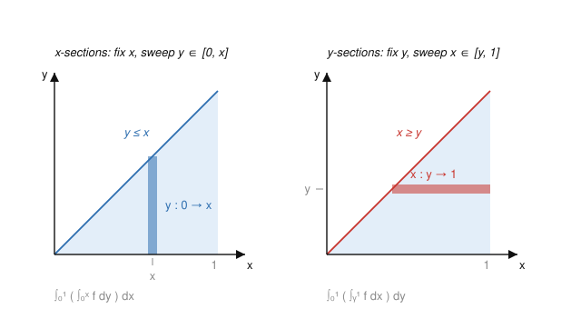

# Measure Theory · Lesson 4.2: Fubini–Tonelli

> ⏱ ~15 min · Module 4: Product measures, Radon–Nikodym, and differentiation · Builds on: [product measures 4.1](04-01-product-measures.md), MCT/DCT ([2.4](02-04-monotone-convergence-fatou.md), [2.5](02-05-dominated-convergence.md)) · Unlocks: [signed measures 4.3](04-03-signed-measures-decomposition.md)

## Why this matters

You compute double integrals by doing one variable at a time — this is the workhorse of every multivariable calculation in physics and probability. But calculus tells you *how*, not *when you're allowed to*. Swapping the order of integration is not free: there are honest-looking integrals where doing $x$ first gives $\pi/4$ and doing $y$ first gives $-\pi/4$. Fubini–Tonelli is the exact license — it tells you a double integral equals either iterated integral, and pins down the two hypotheses (σ-finiteness and integrability) whose failure produces exactly those contradictions. In `probability-theory` this is how a joint expectation factors into conditional ones; in `fourier-analysis` it is what justifies interchanging an integral with the sum inside a convolution.

## The idea

Lesson 4.1 built a single number, the double integral $\int_{X\times Y} f\,d(\mu\times\nu)$, by measuring subsets of the product space. That definition is clean but useless for computation. What you actually want is to **slice**: freeze $x$, integrate the slice $y\mapsto f(x,y)$ over $Y$, then integrate the resulting function of $x$ over $X$. Two theorems say the slice-and-integrate answer matches the true double integral — and that it doesn't matter which variable you freeze first.

The subtlety is that "integrate, then integrate" can hide cancellation. If $f$ takes both signs and has infinite total mass, the two orders can shuffle the $+\infty$ and $-\infty$ contributions differently and land on different finite numbers. So there are two regimes:

- **Tonelli** handles $f\ge 0$. No cancellation is possible, so the interchange *always* works — the common value may be $+\infty$, and that's fine.
- **Fubini** handles signed $f$, but demands $f$ be integrable first ($\int|f|<\infty$), which forbids the pathological cancellation.

The practical move chains them: run Tonelli on $|f|$ (always legal) to *check* $\int|f|<\infty$; if it's finite, Fubini licenses the swap for $f$ itself.

## The formal version

Throughout, $(X,\mathcal{M},\mu)$ and $(Y,\mathcal{N},\nu)$ are **σ-finite** measure spaces (each is a countable union of finite-measure pieces), and $\mu\times\nu$ is the product measure on $\mathcal{M}\otimes\mathcal{N}$ from Lesson 4.1.

**Tonelli's theorem.** Let $f:X\times Y\to[0,\infty]$ be $\mathcal{M}\otimes\mathcal{N}$-measurable. Then $x\mapsto\int_Y f(x,y)\,d\nu(y)$ is $\mathcal{M}$-measurable, $y\mapsto\int_X f(x,y)\,d\mu(x)$ is $\mathcal{N}$-measurable, and
$$\int_{X\times Y} f\,d(\mu\times\nu)=\int_X\!\Big(\int_Y f\,d\nu\Big)d\mu=\int_Y\!\Big(\int_X f\,d\mu\Big)d\mu.$$

*In words:* for a nonnegative function, the double integral equals both iterated integrals, no strings attached — all three are the same element of $[0,\infty]$.

**Fubini's theorem.** Let $f\in L^1(\mu\times\nu)$, i.e. $\int_{X\times Y}|f|\,d(\mu\times\nu)<\infty$. Then:
- for $\mu$-a.e. $x$ the slice $y\mapsto f(x,y)$ is in $L^1(\nu)$, and symmetrically for a.e. $y$;
- the a.e.-defined functions $x\mapsto\int_Y f\,d\nu$ and $y\mapsto\int_X f\,d\mu$ are integrable; and
$$\int_{X\times Y} f\,d(\mu\times\nu)=\int_X\!\Big(\int_Y f\,d\nu\Big)d\mu=\int_Y\!\Big(\int_X f\,d\mu\Big)d\mu.$$

*In words:* if $f$ is absolutely integrable over the product, the slices are integrable almost everywhere and the two orders agree with the double integral.

*Why the recipe works.* You rarely know $\int_{X\times Y}|f|$ in advance — that's a double integral, the thing you're trying to avoid. But $|f|\ge 0$, so **Tonelli applies to $|f|$ unconditionally**: compute one iterated integral of $|f|$ (pick the easy order). If it's finite, $|f|\in L^1$, so $f\in L^1$, and Fubini fires. If it's $+\infty$, stop — the swap may be illegal.

$$\boxed{\ \underbrace{\int_X\!\Big(\int_Y |f|\,d\nu\Big)d\mu<\infty}_{\text{Tonelli check on }|f|}\ \Longrightarrow\ \underbrace{\int_X\!\Big(\int_Y f\,d\nu\Big)d\mu=\int_Y\!\Big(\int_X f\,d\mu\Big)d\mu}_{\text{Fubini interchange on }f}\ }$$

Both theorems need σ-finiteness (it is what makes $\mu\times\nu$ well-defined and the slicing formula hold, via the monotone class argument of 4.1). Drop it and even Tonelli fails — see Watch out.

## Picture

Slicing a region two ways. The triangle $\{(x,y): 0\le y\le x\le 1\}$ is swept either by vertical $x$-sections (freeze $x$, let $y$ run from $0$ to $x$) or by horizontal $y$-sections (freeze $y$, let $x$ run from $y$ to $1$). Fubini–Tonelli says both sweeps compute the same integral — you just read the limits off whichever slicing is easier.

## Worked examples

**Example 1 (choose the easy order — a Tonelli evaluation).** Evaluate
$$I=\int_0^1\!\int_x^1 e^{-y^2}\,dy\,dx.$$
As written, the inner integral $\int_x^1 e^{-y^2}\,dy$ has no elementary antiderivative — you're stuck. The integrand $e^{-y^2}>0$ is nonnegative, so **Tonelli lets us swap orders with zero justification needed**. The region is $\{0\le x\le y\le 1\}$ (that's the left panel's triangle read the other way): for fixed $y\in[0,1]$, $x$ runs from $0$ to $y$. Hence
$$I=\int_0^1\!\int_0^y e^{-y^2}\,dx\,dy=\int_0^1 y\,e^{-y^2}\,dy=\Big[-\tfrac12 e^{-y^2}\Big]_0^1=\tfrac12\big(1-e^{-1}\big).$$
The outer $y$-integral is now trivial because the inner $x$-integral just multiplied by the slice length $y$. The whole trick was recognizing that nonnegativity buys the interchange for free.

**Example 2 (the classic failure — differing iterated integrals).** On the unit square $[0,1]^2$ with Lebesgue measure, let
$$f(x,y)=\frac{x^2-y^2}{(x^2+y^2)^2}\qquad(f(0,0):=0).$$
Compute each order. Notice the exact antiderivatives
$$\frac{\partial}{\partial x}\!\left(\frac{-x}{x^2+y^2}\right)=\frac{x^2-y^2}{(x^2+y^2)^2},\qquad \frac{\partial}{\partial y}\!\left(\frac{y}{x^2+y^2}\right)=\frac{x^2-y^2}{(x^2+y^2)^2}.$$
Integrate $x$ first, then $y$:
$$\int_0^1\!\Big(\int_0^1 f\,dx\Big)dy=\int_0^1\Big[\frac{-x}{x^2+y^2}\Big]_{x=0}^{1}dy=\int_0^1\frac{-1}{1+y^2}\,dy=-\arctan 1=-\frac{\pi}{4}.$$
Integrate $y$ first, then $x$:
$$\int_0^1\!\Big(\int_0^1 f\,dy\Big)dx=\int_0^1\Big[\frac{y}{x^2+y^2}\Big]_{y=0}^{1}dx=\int_0^1\frac{1}{1+x^2}\,dx=\arctan 1=+\frac{\pi}{4}.$$
The two orders give $-\pi/4$ and $+\pi/4$ — genuinely different numbers. (No mystery in the asymmetry: $f(y,x)=-f(x,y)$, so swapping the roles of the variables must flip the sign.)

Why is Fubini silent here? Run the **Tonelli check on $|f|$**. In polar coordinates near the origin, $|f|=\frac{|x^2-y^2|}{(x^2+y^2)^2}=\frac{|\cos 2\theta|}{r^2}$, and with area element $r\,dr\,d\theta$,
$$\int_{[0,1]^2}|f|\;\gtrsim\;\int_0^{\pi/2}\!|\cos 2\theta|\,d\theta\int_{0}^{1}\frac{1}{r^2}\,r\,dr=\Big(\text{const}\Big)\int_0^1\frac{dr}{r}=+\infty.$$
So $f\notin L^1([0,1]^2)$: Fubini's hypothesis fails, and the theorem makes **no promise** — the differing answers are allowed. The singularity at the origin has enough mass on each side of $y=x$ that the two orders cancel the infinities against each other differently. This is the whole reason the recipe insists on the $|f|$ check *first*.

## Watch out

- **You might think Tonelli needs integrability like Fubini — it doesn't.** For $f\ge 0$ the interchange is unconditional; the common value is just allowed to be $+\infty$. Integrability is Fubini's price for admitting *signed* functions. Never "check $\int|f|<\infty$" before applying Tonelli to a nonnegative $f$; that check *is* an application of Tonelli.
- **You might think equal-looking iterated integrals prove interchangeability — they don't, without the $|f|$ check.** Two orders can *coincidentally* agree yet still both be wrong relative to the true double integral, or (as in Example 2) disagree. The only clean certificate is $\int|f|<\infty$.
- **σ-finiteness is not optional — drop it and even Tonelli breaks.** Take $X=Y=[0,1]$ with $\mu=$ Lebesgue and $\nu=$ counting measure (not σ-finite: $[0,1]$ is uncountable). Let $f=\mathbf{1}_{D}$ be the indicator of the diagonal $D=\{(x,y):x=y\}$, a nonnegative measurable function. Then
$$\int_X\!\Big(\int_Y \mathbf{1}_D\,d\nu\Big)d\mu=\int_X \nu(\{x\})\,d\mu=\int_X 1\,d\mu=1,\quad\text{but}\quad\int_Y\!\Big(\int_X \mathbf{1}_D\,d\mu\Big)d\nu=\int_Y \mu(\{y\})\,d\nu=\int_Y 0\,d\nu=0.$$
Two iterated integrals of a nonnegative function, giving $1\ne 0$. Nothing is wrong with the arithmetic — Tonelli simply does not apply, because $\nu$ is not σ-finite.

## One-liner

> Tonelli swaps for free when $f\ge 0$; for signed $f$, use Tonelli on $|f|$ to earn Fubini's swap — and remember σ-finiteness is the ticket to the door.

## Problems

**P1 (🟢)** Evaluate $\displaystyle\int_0^1\!\int_{\sqrt{y}}^{1} \frac{\sin x}{x}\,dx\,dy$ by choosing the order that makes the inner integral elementary. State which theorem you invoke and why no integrability check is required.

**P2 (🟡)** Let $f(x,y)=x\,e^{-x(1+y^2)}$ on $[0,\infty)\times[0,\infty)$. (a) Justify interchanging the order of integration. (b) Compute $\int_0^\infty\big(\int_0^\infty f\,dx\big)dy$ and $\int_0^\infty\big(\int_0^\infty f\,dy\big)dx$ two ways, and by equating them evaluate the Gaussian integral $\int_0^\infty e^{-x^2}\,dx$.

**P3 (🔴, optional)** Give a function $g$ on $\mathbb{N}\times\mathbb{N}$ (with counting measure on each factor — this *is* σ-finite) whose two iterated *sums* differ. Then explain in one sentence which hypothesis of Fubini it violates, and confirm Tonelli's verdict on $|g|$ is consistent with the disagreement.

Solutions

**P1** The integrand $\frac{\sin x}{x}$ is bounded (it extends continuously to $1$ at $x=0$) but has no elementary antiderivative, so integrating in $x$ first is hopeless in the given order. Reverse it. The region is $\{(x,y): 0\le y\le 1,\ \sqrt{y}\le x\le 1\}=\{0\le x\le 1,\ 0\le y\le x^2\}$ (since $\sqrt{y}\le x\iff y\le x^2$). On $[0,1]$ we have $\sin x\ge 0$, so $\frac{\sin x}{x}\ge 0$ on the whole region and **Tonelli** applies with no integrability check:
$$\int_0^1\!\int_0^{x^2}\frac{\sin x}{x}\,dy\,dx=\int_0^1 \frac{\sin x}{x}\cdot x^2\,dx=\int_0^1 x\sin x\,dx.$$
Integrate by parts ($u=x$, $dv=\sin x\,dx$): $\int_0^1 x\sin x\,dx=[-x\cos x]_0^1+\int_0^1\cos x\,dx=-\cos 1+\sin 1$. So the value is $\sin 1-\cos 1\approx 0.301$.

**P2** (a) $f\ge 0$ on the whole quadrant, so **Tonelli** applies directly — no integrability check needed — and both iterated integrals equal the double integral (finite or infinite; we'll see it's finite).

(b) *Order 1 ($x$ first).* For fixed $y$, $\int_0^\infty x\,e^{-x(1+y^2)}\,dx$. With $a=1+y^2>0$, $\int_0^\infty x e^{-ax}dx=\frac{1}{a^2}$. So the inner integral is $\frac{1}{(1+y^2)^2}$, and
$$\int_0^\infty\frac{dy}{(1+y^2)^2}=\frac{\pi}{4}$$
(standard; e.g. $y=\tan\theta$ gives $\int_0^{\pi/2}\cos^2\theta\,d\theta=\pi/4$). So the double integral is $\pi/4$.

*Order 2 ($y$ first).* For fixed $x>0$, $\int_0^\infty x\,e^{-x(1+y^2)}\,dy=x\,e^{-x}\int_0^\infty e^{-xy^2}\,dy=x\,e^{-x}\cdot\frac{1}{2}\sqrt{\frac{\pi}{x}}=\frac{\sqrt\pi}{2}\,\sqrt{x}\,e^{-x}$. Then
$$\int_0^\infty \frac{\sqrt\pi}{2}\sqrt{x}\,e^{-x}\,dx=\frac{\sqrt\pi}{2}\,\Gamma\!\Big(\tfrac32\Big)=\frac{\sqrt\pi}{2}\cdot\frac{\sqrt\pi}{2}=\frac{\pi}{4}.$$
Consistent, as Tonelli guarantees. To extract the Gaussian, redo order 2 without the $\Gamma$ shortcut. Substitute $u=\sqrt{x}$ ($x=u^2$, $dx=2u\,du$): $\int_0^\infty \sqrt{x}\,e^{-x}dx=\int_0^\infty u\,e^{-u^2}\,2u\,du=2\int_0^\infty u^2 e^{-u^2}du$. That's a different route; cleaner is to instead set the two order-values equal *before* evaluating the Gaussian. Let $G=\int_0^\infty e^{-x^2}dx$. In order 2, $\int_0^\infty e^{-xy^2}dy=\frac{1}{2}\sqrt{\pi/x}$ used $\int_0^\infty e^{-t^2}dt=G$ via $t=y\sqrt x$: $\int_0^\infty e^{-xy^2}dy=\frac{1}{\sqrt x}\int_0^\infty e^{-t^2}dt=\frac{G}{\sqrt x}$. So the inner integral is $x e^{-x}\cdot \frac{G}{\sqrt x}=G\sqrt{x}\,e^{-x}$, and the outer integral is $G\,\Gamma(3/2)=G\cdot\frac{\sqrt\pi}{2}$. Equate to order 1's value $\pi/4$:
$$G\cdot\frac{\sqrt\pi}{2}=\frac{\pi}{4}\ \Longrightarrow\ G=\frac{\pi/4}{\sqrt\pi/2}=\frac{\sqrt\pi}{2}.$$
So $\int_0^\infty e^{-x^2}\,dx=\frac{\sqrt\pi}{2}$ — Fubini–Tonelli delivering the Gaussian integral without polar coordinates.

**P3** Index rows and columns by $m,n\ge 1$. Put $g(m,m)=1$, $g(m,m+1)=-1$, and $g=0$ elsewhere (a $+1$ on the diagonal, a $-1$ one step to its right). Sum along each row first (fix $m$, sum over $n$): every row has a $+1$ and a $-1$, so $\sum_n g(m,n)=0$, hence $\sum_m\big(\sum_n g\big)=0$. Sum along each column first (fix $n$, sum over $m$): column $n=1$ contains only $g(1,1)=+1$ (no $-1$ can land in column $1$, since $-1$'s sit in columns $\ge 2$), giving $1$; every column $n\ge 2$ contains $g(n,n)=+1$ and $g(n-1,n)=-1$, summing to $0$. So $\sum_n\big(\sum_m g\big)=1+0+0+\cdots=1\ne 0$.

Both factors are σ-finite (counting measure on $\mathbb{N}$ is $\sigma$-finite), so σ-finiteness is *not* the culprit — this is a pure **Fubini/integrability** failure: $g\notin L^1$. Indeed Tonelli on $|g|$ gives $\sum_{m,n}|g(m,n)|=\sum_m 2=\infty$, so the total mass is infinite; Fubini's hypothesis fails and the two iterated sums are permitted to disagree — exactly what we found.

## Flashback

**From Lesson 4.1 (product measures / section measurability):** On $([0,1],\lambda)\times([0,1],\lambda)$ (Lebesgue on each factor), let $E=\{(x,y):0\le y\le x^2\}$. (a) Show every vertical section $E_x=\{y:(x,y)\in E\}$ is Lebesgue measurable and compute $\lambda(E_x)$. (b) Using the section formula $(\mu\times\nu)(E)=\int_X \nu(E_x)\,d\mu(x)$ from 4.1, compute $(\lambda\times\lambda)(E)$.

Solution

(a) For fixed $x\in[0,1]$, $E_x=\{y\in[0,1]: 0\le y\le x^2\}=[0,x^2]$, a closed interval — hence Borel, hence Lebesgue measurable — with $\lambda(E_x)=x^2$. (That every section of a product-measurable set is measurable is precisely the 4.1 lemma; here $E$ is closed in $[0,1]^2$, so Borel, so in $\mathcal{B}\otimes\mathcal{B}$.)

(b) The section-measure $x\mapsto\lambda(E_x)=x^2$ is measurable, so
$$(\lambda\times\lambda)(E)=\int_0^1 \lambda(E_x)\,d\lambda(x)=\int_0^1 x^2\,dx=\frac{1}{3}.$$
This is the area under $y=x^2$, and it is exactly Tonelli applied to $f=\mathbf{1}_E$: $(\lambda\times\lambda)(E)=\int_{[0,1]^2}\mathbf{1}_E=\int_0^1\big(\int_0^1\mathbf{1}_E\,dy\big)dx$. The 4.1 section formula is Tonelli for indicators.

## Connections

- **Backward:** this is the payoff of [product measures 4.1](04-01-product-measures.md) — the product measure and section-measurability lemmas built there are exactly what make the iterated integrals well-defined. The proofs of both theorems run the monotone convergence machinery of [2.4](02-04-monotone-convergence-fatou.md) (start with indicators of rectangles, extend to simple, then nonnegative measurable functions via MCT).
- **Forward:** Boss problem 4 uses Tonelli to prove the layer-cake formula $\int|f|^p\,d\mu=p\int_0^\infty t^{p-1}\mu(\{|f|>t\})\,dt$; and [Radon–Nikodym 4.4](04-04-radon-nikodym.md) leans on Fubini to manipulate densities against a product background.
- **Sideways (`probability-theory`):** for independent random variables the joint law *is* a product measure, and Fubini is the theorem behind $\mathbb{E}[XY]=\mathbb{E}[X]\,\mathbb{E}[Y]$ and behind Tonelli-justified interchange of expectation with an integral (the "tower"/marginalization computations).
- **Sideways (`fourier-analysis`):** interchanging the integral defining a convolution $ (f*g)(x)=\int f(x-y)g(y)\,dy$ with an outer integral — the step that proves $\lVert f*g\rVert_1\le\lVert f\rVert_1\lVert g\rVert_1$ — is a direct Tonelli argument on $|f(x-y)g(y)|$.
