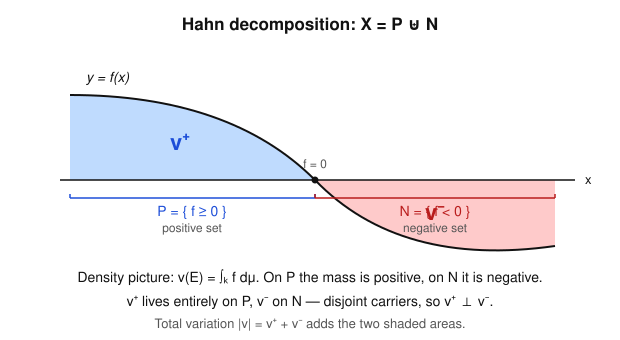

# Measure Theory · Lesson 4.3: Signed measures and decomposition

> ⏱ ~15 min · Module 4: Product measures, Radon–Nikodym, and differentiation · Builds on: [Lesson 1.3](01-03-measures-properties.md) (measures), [Lesson 2.3](02-03-general-lebesgue-integral.md) (positive/negative parts of a function) · Unlocks: [Lesson 4.4](04-04-radon-nikodym.md) (Radon–Nikodym)

## Why this matters

So far a measure has been a way of assigning nonnegative *size*. But the most useful set functions in analysis are allowed to be negative: an electric charge distribution is positive where there is net positive charge and negative elsewhere; a difference of two probability distributions $\mu-\nu$ is the object whose total size measures how far apart they are; and — the reason we need it right now — the map $E\mapsto\int_E f\,d\mu$ for a general integrable $f$ is negative exactly where $f$ is negative. These are **signed measures**, and the single structural fact that makes them tractable is that every one of them splits cleanly into a positive piece and a negative piece that live on *disjoint* parts of the space. That splitting (Hahn/Jordan) is the entire technical foundation of the Radon–Nikodym theorem in Lesson 4.4.

## The idea

Picture a density $f$ that is positive in some places and negative in others, and define the "charge" of a set $E$ by $\nu(E)=\int_E f\,d\mu$. Intuitively, the space breaks into two zones: the region $P$ where $f\ge 0$ and the region $N$ where $f<0$. Any chunk you carve out of $P$ has nonnegative charge; any chunk of $N$ has nonpositive charge. So $\nu$ is really two ordinary (nonnegative) measures in disguise — one counting the positive charge on $P$, one counting the *magnitude* of the negative charge on $N$ — glued together with a minus sign.

The remarkable theorem is that **you never need the density $f$ to do this splitting.** For *any* signed measure whatsoever, there is a partition $X=P\uplus N$ into a "positive set" and a "negative set" (the **Hahn decomposition**), and from it two genuine nonnegative measures $\nu^+,\nu^-$ living on the two pieces with $\nu=\nu^+-\nu^-$ (the **Jordan decomposition**). Because they live on disjoint carriers they are *mutually singular*. Adding their sizes back together gives the **total variation** $|\nu|=\nu^++\nu^-$, the honest nonnegative measure that tracks how much charge is present regardless of sign.

## The formal version

Throughout, $(X,\mathcal{A})$ is a measurable space.

**Definition (signed measure).** A **signed measure** is a function $\nu:\mathcal{A}\to(-\infty,\infty]$ with $\nu(\varnothing)=0$ that is **countably additive**: for pairwise disjoint $E_1,E_2,\dots\in\mathcal{A}$,
$$\nu\Big(\biguplus_{n=1}^\infty E_n\Big)=\sum_{n=1}^\infty \nu(E_n),$$
the series converging in $(-\infty,\infty]$ (and, when the left side is finite, converging absolutely so the value is independent of the order).

*In words:* it obeys every measure axiom except that it may be negative — with the one restriction that it takes **at most one** of the two infinite values. We fix the convention "omits $-\infty$," so $\nu(E)>-\infty$ always.

Why forbid both infinities? Because additivity would then produce $\infty-\infty$: if $\nu(A)=+\infty$ and $\nu(B)=-\infty$ for disjoint $A,B$, then $\nu(A\uplus B)$ has no consistent value. Ruling out one sign of infinity is exactly what keeps the arithmetic well-defined.

The archetype — carry it through the whole lesson: fix a measure $\mu$ and $f\in L^1(\mu)$ (or more generally $f$ with $\int f^-\,d\mu<\infty$). Then
$$\nu(E):=\int_E f\,d\mu$$
is a signed measure, countably additive by the term-by-term integration you proved for series in [Lesson 2.4](02-04-monotone-convergence-fatou.md).

**Definition (positive / negative / null sets).** A set $P\in\mathcal{A}$ is **positive for $\nu$** if $\nu(E)\ge0$ for *every* measurable $E\subseteq P$. It is **negative** if $\nu(E)\le0$ for every measurable $E\subseteq P$, and **null** if $\nu(E)=0$ for every measurable $E\subseteq P$.

*In words:* positive/negative is a statement about *all* sub-pieces, not just about $\nu(P)$ itself. A set can have $\nu(P)>0$ yet fail to be positive, because it hides a very negative sub-chunk.

**Theorem (Hahn decomposition).** For any signed measure $\nu$ there exist a positive set $P$ and a negative set $N$ with
$$X=P\uplus N.$$
The pair is **essentially unique**: if $(P',N')$ is another such pair, then $P\,\triangle\,P'$ (equivalently $N\,\triangle\,N'$) is $\nu$-null.

*In words:* every signed measure cleaves the space into an all-nonnegative region and an all-nonpositive region, uniquely up to shuffling null sets between them.

*Proof.* Two lemmas do the work.

**Lemma A (countable unions of negative sets are negative).** Let $N_1,N_2,\dots$ be negative sets and $N=\bigcup_j N_j$. Disjointify: $M_j:=N_j\setminus(N_1\cup\dots\cup N_{j-1})\subseteq N_j$, so each $M_j$ is a measurable subset of a negative set, hence negative, and $N=\biguplus_j M_j$. For any measurable $E\subseteq N$, $E=\biguplus_j (E\cap M_j)$ with each $\nu(E\cap M_j)\le0$, so $\nu(E)=\sum_j\nu(E\cap M_j)\le0$. Thus $N$ is negative. $\square$

**Lemma B (a set of negative measure contains a negative set no larger).** If $\nu(A)<0$ then $A$ contains a negative set $B$ with $\nu(B)\le\nu(A)$. *Proof:* strip off positive chunks greedily. If $A$ is already negative, take $B=A$. Otherwise let $n_1$ be the smallest positive integer for which some measurable $A_1\subseteq A$ has $\nu(A_1)\ge 1/n_1$, and set $A^{(1)}=A\setminus A_1$, so $\nu(A^{(1)})=\nu(A)-\nu(A_1)\le\nu(A)-1/n_1$. Repeat inside $A^{(1)}$ to peel off $A_2$ with $\nu(A_2)\ge1/n_2$ ($n_2$ smallest possible), and so on. Put $B=A\setminus\bigcup_k A_k$. Then $\nu(B)=\nu(A)-\sum_k\nu(A_k)\le\nu(A)$ since every $\nu(A_k)\ge0$. Because $\nu(B)>-\infty$ while $\nu(A)$ is finite, $\sum_k\nu(A_k)<\infty$, so $\nu(A_k)\to0$ and hence $n_k\to\infty$. Finally $B$ is negative: if some measurable $C\subseteq B$ had $\nu(C)>0$, then $\nu(C)\ge1/N$ for some fixed $N$; but $C\subseteq A^{(k-1)}$ for all $k$, and once $n_k-1\ge N$ the integer $N$ would have been an admissible (smaller) choice at step $k$, contradicting minimality of $n_k$. So no positive-measure subset exists — $B$ is negative. $\square$

Now assemble. Let $\ell=\inf\{\nu(E):E\text{ is a negative set}\}$; since $\varnothing$ is negative, $\ell\le0$. Pick negative sets $N_j$ with $\nu(N_j)\to\ell$ and set $N=\bigcup_j N_j$, negative by Lemma A. As $N\setminus N_j\subseteq N$ is negative, $\nu(N)=\nu(N_j)+\nu(N\setminus N_j)\le\nu(N_j)$; letting $j\to\infty$ gives $\nu(N)\le\ell$, and $\nu(N)\ge\ell$ because $N$ is negative. So $\nu(N)=\ell$, and $\ell>-\infty$ because $\nu$ omits $-\infty$. Put $P:=X\setminus N$. If $P$ were not positive, some measurable $A\subseteq P$ has $\nu(A)<0$; by Lemma B it contains a negative set $B$ with $\nu(B)<0$, whence $N\uplus B$ is negative (Lemma A) with $\nu(N\uplus B)=\ell+\nu(B)<\ell$ — contradicting the definition of $\ell$. So $P$ is positive.

*Essential uniqueness:* given another pair $(P',N')$, the set $P\setminus P'\subseteq P$ is positive and $=P\cap N'\subseteq N'$ is negative, so it is null; likewise $P'\setminus P$. Hence $P\triangle P'$ is null. $\blacksquare$

**Definition + Theorem (Jordan decomposition).** Fix a Hahn pair $(P,N)$ and define, for $E\in\mathcal{A}$,
$$\nu^+(E):=\nu(E\cap P),\qquad \nu^-(E):=-\,\nu(E\cap N).$$
Then $\nu^+,\nu^-$ are (nonnegative) measures, $\nu^-$ is finite, and
$$\nu=\nu^+-\nu^-.$$
These two measures do not depend on the chosen Hahn pair (only the essential-uniqueness null sets move), so the decomposition is unique.

*In words:* $\nu^+$ collects the positive charge (read off the positive set), $\nu^-$ the magnitude of the negative charge, and their difference rebuilds $\nu$. $\nu^-$ is finite precisely because $\nu$ omits $-\infty$.

**Definition (mutual singularity).** Two measures $\alpha,\beta$ on $\mathcal{A}$ are **mutually singular**, written $\alpha\perp\beta$, if there is a partition $X=A\uplus B$ with $\alpha(B)=0$ and $\beta(A)=0$ — each measure lives entirely on its own set, invisible to the other.

By construction $\nu^+(N)=\nu(N\cap P)=\nu(\varnothing)=0$ and $\nu^-(P)=0$, so with $A=P,\ B=N$:
$$\boxed{\ \nu^+\perp\nu^-\ }.$$

**Definition (total variation).** The **total variation** of $\nu$ is the measure
$$|\nu|:=\nu^++\nu^-,\qquad\text{and}\qquad \lVert\nu\rVert:=|\nu|(X)=\nu^+(X)+\nu^-(X).$$

*In words:* $|\nu|(E)$ is the total amount of charge in $E$ counted with *both* signs made positive; $\lVert\nu\rVert$ is the grand total. It is a genuine nonnegative measure, and $\lVert\nu\rVert<\infty$ iff $\nu^+$ is also finite (a *finite signed measure*).

## Picture

The density $f$ is nonnegative on $P$ and negative on $N$. Every sub-piece of $P$ collects nonnegative charge, so $P$ is a positive set; every sub-piece of $N$ collects nonpositive charge. The blue area *is* $\nu^+$, the red area *is* $\nu^-$; they sit over disjoint bases, which is mutual singularity, and adding the two areas gives $|\nu|$.

## Worked examples

**Example 1 (the density case, in full — this is the template).** Let $\mu$ be a measure, $f\in L^1(\mu)$, and $\nu(E)=\int_E f\,d\mu$. Recall the pointwise split $f=f^+-f^-$ with $f^+=\max(f,0)$, $f^-=\max(-f,0)$ from [Lesson 2.3](02-03-general-lebesgue-integral.md).

*Hahn sets.* Put $P=\{f\ge0\}$ and $N=\{f<0\}$ (both measurable since $f$ is). For any $E\subseteq P$, $f\ge0$ on $E$ so $\nu(E)=\int_E f\,d\mu\ge0$: $P$ is positive. Symmetrically $N$ is negative, and $X=P\uplus N$. So this *is* a Hahn decomposition — no abstract theorem needed, the density hands it to you.

*Jordan parts.* For any $E$,
$$\nu^+(E)=\nu(E\cap P)=\int_{E\cap\{f\ge0\}}f\,d\mu=\int_E f^+\,d\mu,$$
because $f=f^+$ where $f\ge0$ and $f^+=0$ where $f<0$. Likewise $\nu^-(E)=-\int_{E\cap\{f<0\}}f\,d\mu=\int_E f^-\,d\mu$. Check: $\nu^+(E)-\nu^-(E)=\int_E(f^+-f^-)\,d\mu=\int_E f\,d\mu=\nu(E)$. ✓

*Total variation.* $|\nu|(E)=\int_E f^+\,d\mu+\int_E f^-\,d\mu=\int_E(f^++f^-)\,d\mu=\int_E|f|\,d\mu$, and
$$\lVert\nu\rVert=|\nu|(X)=\int_X|f|\,d\mu=\lVert f\rVert_1.$$
The total variation of the measure *is* the $L^1$ norm of its density — the fact we will lean on in Lesson 4.4.

**Example 2 (a concrete charge, and why $|\nu|(X)\ne|\nu(X)|$).** On $X=[0,2\pi]$ with Lebesgue measure $\lambda$, let $\nu(E)=\int_E \sin x\,d\lambda(x)$ — think of $\sin x$ as a charge density. Since $\sin x\ge0$ on $[0,\pi]$ and $<0$ on $(\pi,2\pi)$,
$$P=[0,\pi],\qquad N=(\pi,2\pi].$$
Then
$$\nu^+(X)=\int_0^\pi\sin x\,dx=2,\qquad \nu^-(X)=\int_\pi^{2\pi}(-\sin x)\,dx=2,$$
so $|\nu|(X)=\lVert\nu\rVert=4$. But the *net* charge is
$$\nu(X)=\int_0^{2\pi}\sin x\,dx=0.$$
The set $[0,2\pi]$ has net charge $0$ yet total variation $4$: the positive and negative charge cancel in $\nu$ but *accumulate* in $|\nu|$. This is the standing warning $|\nu|(E)\ge|\nu(E)|$, usually strict — a signed measure that looks empty ($\nu(X)=0$) can be bursting with equal and opposite charge. Physically, $\lVert\nu\rVert$ is the total charge present; $\nu(X)$ is only the net.

## Watch out

- **"Positive set" is not "$\nu(P)>0$."** It means *every* measurable subset has nonnegative measure. A set with $\nu(P)=5$ can still contain a piece of measure $-100$; then $P$ is not positive. The Hahn theorem's content is that you can find sets with the strong, hereditary property.
- **$|\nu|(E)\ne|\nu(E)|$.** Total variation is a *measure* built from $\nu^++\nu^-$; the absolute value of the number $\nu(E)$ throws away internal cancellation. Example 2: $|\nu(X)|=0$ but $|\nu|(X)=4$. You always have $|\nu(E)|\le|\nu|(E)$ (Problem 2).
- **Hahn is only essentially unique; Jordan is unique.** You may move any $\nu$-null set from $P$ to $N$ and still have a valid Hahn pair, so the *sets* aren't pinned down. But the *measures* $\nu^+,\nu^-,|\nu|$ are completely determined by $\nu$ — the null-set ambiguity never touches them.
- **Don't conflate $\perp$ with $\ll$.** $\nu^+\perp\nu^-$ (they live on disjoint sets) is automatic. Absolute continuity $\ll$ (one measure vanishes wherever another does) is the *opposite* extreme and the subject of Lesson 4.4. Every signed measure decomposes against a reference $\mu$ into a $\ll\mu$ part and a $\perp\mu$ part — that is the Lebesgue decomposition, and mutual singularity is half of it.

## One-liner

> Every signed measure is a difference $\nu^+-\nu^-$ of two nonnegative measures living on disjoint halves $P,N$ of the space; add them instead of subtracting and you get the total variation $|\nu|=\nu^++\nu^-$.

## Problems

**P1 (🟢)** On $[0,3]$ with Lebesgue measure, let $\nu(E)=\int_E (2-x)\,dx$. Find a Hahn pair $(P,N)$, then compute $\nu^+([0,3])$, $\nu^-([0,3])$, $|\nu|([0,3])$, $\lVert\nu\rVert$, and the net $\nu([0,3])$.

**P2 (🟡)** For any signed measure $\nu$ and any $E\in\mathcal{A}$, prove $|\nu(E)|\le|\nu|(E)$. Then exhibit a set where the inequality is strict.

**P3 (🔴, optional)** Prove the *partition characterization* of total variation: for every $E\in\mathcal{A}$,
$$|\nu|(E)=\sup\Big\{\textstyle\sum_{j=1}^{n}|\nu(E_j)|\ :\ E=\biguplus_{j=1}^n E_j,\ E_j\in\mathcal{A}\Big\}.$$
(This shows $|\nu|$ can be *defined* without ever mentioning a Hahn set — the definition many texts start from.)

Solutions

**P1** The density $f(x)=2-x$ satisfies $f\ge0$ on $[0,2]$ and $f<0$ on $(2,3]$, so by Example 1
$$P=[0,2],\qquad N=(2,3].$$
Then
$$\nu^+([0,3])=\int_0^2(2-x)\,dx=\Big[2x-\tfrac{x^2}{2}\Big]_0^2=4-2=2,$$
$$\nu^-([0,3])=\int_2^3(x-2)\,dx=\Big[\tfrac{x^2}{2}-2x\Big]_2^3=\big(\tfrac92-6\big)-\big(2-4\big)=-\tfrac32+2=\tfrac12.$$
Hence $|\nu|([0,3])=2+\tfrac12=\tfrac52=\lVert\nu\rVert$, while the net is $\nu([0,3])=\nu^+-\nu^-=2-\tfrac12=\tfrac32$ (equivalently $\int_0^3(2-x)\,dx=[2x-\tfrac{x^2}2]_0^3=6-\tfrac92=\tfrac32$ ✓).

**P2** Fix a Hahn pair $(P,N)$. Split $E=(E\cap P)\uplus(E\cap N)$. Then
$$\nu(E)=\nu(E\cap P)+\nu(E\cap N)=\nu^+(E)-\nu^-(E).$$
Both $\nu^\pm(E)\ge0$, so by the triangle inequality for real numbers,
$$|\nu(E)|=|\nu^+(E)-\nu^-(E)|\le\nu^+(E)+\nu^-(E)=|\nu|(E).$$
(When $\nu^+(E)=+\infty$ the bound is trivial.) *Strict example:* Example 2 with $E=[0,2\pi]$ gives $|\nu(E)|=0<4=|\nu|(E)$; the inequality is an equality exactly when $E$ meets only one of $P,N$ up to a null set, i.e. when there is no cancellation. $\blacksquare$

**P3** Write $s(E)$ for the supremum on the right.

*($\ge$, i.e. $s(E)\le|\nu|(E)$).* For any finite partition $E=\biguplus_j E_j$, P2 gives $|\nu(E_j)|\le|\nu|(E_j)$, so
$$\sum_j|\nu(E_j)|\le\sum_j|\nu|(E_j)=|\nu|(E)$$
by additivity of the measure $|\nu|$. Taking the sup over partitions, $s(E)\le|\nu|(E)$.

*($\le$, i.e. $s(E)\ge|\nu|(E)$).* Use the specific two-set partition from a Hahn pair $(P,N)$: $E=(E\cap P)\uplus(E\cap N)$. Then
$$|\nu(E\cap P)|+|\nu(E\cap N)|=\nu^+(E)+\nu^-(E)=|\nu|(E),$$
using $\nu(E\cap P)=\nu^+(E)\ge0$ and $\nu(E\cap N)=-\nu^-(E)\le0$. This particular partition already achieves the value $|\nu|(E)$, so the supremum is at least $|\nu|(E)$.

Combining the two inequalities, $s(E)=|\nu|(E)$, and the supremum is attained by the Hahn partition. $\blacksquare$

## Flashback

**From Lesson 1.3 (measures and their properties):** You proved *continuity from below* for a (nonnegative) measure using the disjointification trick. Show it survives the drop to signed measures: if $\nu$ is a signed measure and $E_1\subseteq E_2\subseteq\cdots$ with $E=\bigcup_n E_n$, prove $\nu(E_n)\to\nu(E)$.

Solution

Disjointify exactly as in Lesson 1.3: set $A_1=E_1$ and $A_k=E_k\setminus E_{k-1}$ for $k\ge2$. These are pairwise disjoint, measurable, and
$$E_N=\biguplus_{k=1}^N A_k,\qquad E=\biguplus_{k=1}^\infty A_k.$$
Countable additivity of $\nu$ gives $\nu(E)=\sum_{k=1}^\infty\nu(A_k)$, where by definition the series is the limit of its partial sums in $(-\infty,\infty]$. But the $N$-th partial sum is precisely
$$\sum_{k=1}^N\nu(A_k)=\nu\Big(\biguplus_{k=1}^N A_k\Big)=\nu(E_N)$$
by finite additivity. Hence $\nu(E_N)\to\nu(E)$ as $N\to\infty$. $\blacksquare$

Note the asymmetry with the nonnegative case: continuity *from above* ($E_n\downarrow E$) still needs a finiteness hypothesis — here $|\nu|(E_1)<\infty$ — for the same reason it did in Lesson 1.3, since otherwise the telescoping series can diverge.

## Connections

- **Backward (Lesson 1.3, Module 2):** a signed measure is a measure with the nonnegativity axiom deleted and one infinite sign forbidden; the split $\nu=\nu^+-\nu^-$ is the exact measure-level mirror of the pointwise split $f=f^+-f^-$ you used to define the integral of a general function in [Lesson 2.3](02-03-general-lebesgue-integral.md). Same idea, one level up.
- **Forward (Lesson 4.4):** Radon–Nikodym represents a measure $\nu\ll\mu$ as $\nu(E)=\int_E g\,d\mu$; total variation $|\nu|$ and the finiteness of $\nu^-$ established here are the hypotheses that make the theorem run, and the **Lebesgue decomposition** writes any $\nu$ as (a part $\ll\mu$) $+$ (a part $\perp\mu$) — reusing today's mutual singularity.
- **Sideways ([probability-theory](../../probability-theory/syllabus.md)):** the difference of two probability measures $\mu-\nu$ is a finite signed measure, and its total variation gives the **total variation distance** $\tfrac12\lVert\mu-\nu\rVert=\sup_A|\mu(A)-\nu(A)|$ — the fundamental metric on distributions and the currency of mixing-time and coupling arguments.
- **Sideways (physics / [functional-analysis](../../functional-analysis/syllabus.md)):** signed (and complex) measures model charge and dipole distributions; on a compact space the finite signed measures are the *dual space* of the continuous functions $C(X)$ (Riesz representation), with $\lVert\nu\rVert$ the operator norm — the measure-theoretic doorway into duality.
