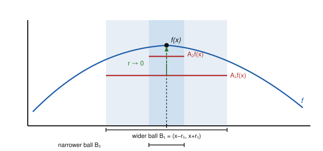

# Measure Theory · Lesson 4.5: The Lebesgue differentiation theorem

> ⏱ ~15 min · Module 4: Product measures, Radon–Nikodym, and differentiation · Builds on: [4.4 Radon–Nikodym](04-04-radon-nikodym.md), [2.3 the Lebesgue integral](02-03-general-lebesgue-integral.md), [2.5 dominated convergence](02-05-dominated-convergence.md) · Unlocks: nothing — course complete

## Why this matters

Freshman calculus's Fundamental Theorem says $\frac{d}{dx}\int_a^x f = f(x)$: differentiation undoes integration. That proof leans on $f$ being *continuous*, so you can evaluate $f$ at a point and watch a difference quotient converge. But the whole point of this course is that Lebesgue-integrable functions need not be continuous anywhere — worse, they are only defined *up to a null set*, so "the value $f(x)$" is not even well-posed at a single point. Does the FTC survive?

It does, and rescuing it forces a genuinely new idea — averaging instead of evaluating — plus one of the most reused tools in analysis: the Hardy–Littlewood maximal function. This is also the promised bridge from Radon–Nikodym (Lesson 4.4) back to the honest pointwise derivative: the abstract density $\frac{d\nu}{d\lambda}$ will turn out to equal an ordinary $F'$ almost everywhere. This is the **final lesson** — with it, the last box of the Dangerous Checklist ("state the Lebesgue differentiation theorem and connect it to the FTC") is ticked.

## The idea

You cannot recover $f$ by *evaluating* it: change $f$ on a null set and every integral is unchanged, yet pointwise values are wrecked. So stop evaluating and start **averaging**. Over a tiny ball around $x$, take the mean value of $f$:
$$
A_r f(x) \;=\; \frac{1}{\lambda\big(B_r(x)\big)}\int_{B_r(x)} f\,d\lambda ,
\qquad B_r(x) = (x-r,\,x+r)\ \text{on }\mathbb{R}.
$$
Averaging is immune to null-set surgery, so it is the *right* thing to ask about. The claim of the day: as the ball shrinks, the average converges to the value, for almost every $x$.

Why should that be true? If $f$ were continuous at $x$, it is obvious: on a small ball $f$ stays within $\varepsilon$ of $f(x)$, so its average does too. The entire difficulty is that a generic $L^1$ function is continuous nowhere. The fix is to (i) approximate $f$ in $L^1$ by a continuous function $g$ — where averaging trivially works — and (ii) control the *error* $f-g$ uniformly over all radii at once. That uniform control is exactly what the **maximal function** provides, and the estimate that makes it work comes from a clever geometric covering trick.

## The formal version

Throughout, $\lambda$ is Lebesgue measure on $\mathbb{R}^n$ and $f \in L^1_{\mathrm{loc}}$ (integrable on every ball — enough for the averages to make sense).

**The Hardy–Littlewood maximal function.**
$$
Mf(x) \;=\; \sup_{r>0} A_r|f|(x) \;=\; \sup_{r>0}\frac{1}{\lambda(B_r(x))}\int_{B_r(x)} |f|\,d\lambda .
$$
*In words:* $Mf(x)$ is the worst-case (largest) average of $|f|$ over all balls centered at $x$ — a single function that dominates every averaging window simultaneously.

**The Vitali covering lemma (finite form).** Given finitely many balls $B_1,\dots,B_N$ in $\mathbb{R}^n$, there is a *disjoint* subcollection $B_{i_1},\dots,B_{i_k}$ with
$$
\bigcup_{j=1}^{N} B_j \;\subseteq\; \bigcup_{\ell=1}^{k} 3B_{i_\ell},
$$
where $3B$ is the ball with the same center and triple the radius. *In words — the "$3r$ trick":* greedily grab the largest ball, throw away every ball that touches it (each such discarded ball has radius $\le$ the chosen one, so it fits inside the tripled chosen ball), and repeat. A disjoint handful of balls, blown up by $3$, recaptures everything. Tripling the radius multiplies volume by $3^n$, so $\lambda\big(\bigcup B_j\big) \le 3^n \sum_\ell \lambda(B_{i_\ell})$.

**The maximal inequality (weak-$(1,1)$).** For $f\in L^1(\mathbb{R}^n)$ and every $\alpha>0$,
$$
\lambda\big(\{\,Mf > \alpha\,\}\big) \;\le\; \frac{3^n}{\alpha}\,\lVert f\rVert_1 .
$$
*In words:* the set where the averages spike above $\alpha$ can't be large — its measure decays like $1/\alpha$. This is *weaker* than an $L^1$ bound on $Mf$ (see Watch out), but it is exactly enough.

*Proof.* Let $E_\alpha=\{Mf>\alpha\}$. For each $x\in E_\alpha$ pick a ball $B_x$ with $\frac{1}{\lambda(B_x)}\int_{B_x}|f|>\alpha$, i.e. $\lambda(B_x) < \frac1\alpha\int_{B_x}|f|$. Take any compact $K\subseteq E_\alpha$; finitely many $B_x$ cover $K$. Apply Vitali to extract disjoint $B_1,\dots,B_k$ with $K\subseteq\bigcup 3B_i$. Then
$$
\lambda(K) \le \sum_i \lambda(3B_i)=3^n\sum_i\lambda(B_i) < \frac{3^n}{\alpha}\sum_i\int_{B_i}|f| \le \frac{3^n}{\alpha}\int_{\mathbb{R}^n}|f| = \frac{3^n}{\alpha}\lVert f\rVert_1,
$$
the middle-to-last step using that the $B_i$ are disjoint. Taking the sup over compact $K\subseteq E_\alpha$ (inner regularity of $\lambda$, from Lesson 1.5) gives the claim. $\blacksquare$

**The Lebesgue differentiation theorem.** For $f\in L^1_{\mathrm{loc}}(\mathbb{R}^n)$,
$$
\lim_{r\to 0^+} A_r f(x) = f(x) \qquad\text{for almost every } x.
$$
*In words:* the averages of $f$ over shrinking balls recover the value of $f$ at almost every point.

*Proof.* Localize so we may take $f\in L^1$. Fix $\alpha>0$. By density of continuous compactly-supported functions in $L^1$ (a consequence of Lusin/simple-function approximation), choose $g$ continuous with $\lVert f-g\rVert_1<\varepsilon$, and set $h=f-g$. For the *continuous* $g$, $A_r g(x)\to g(x)$ everywhere. Split:
$$
\limsup_{r\to0}|A_r f(x)-f(x)| \;\le\; \underbrace{\limsup_r |A_r h(x)|}_{\le\, Mh(x)} \;+\; \underbrace{\limsup_r|A_r g(x)-g(x)|}_{=\,0} \;+\; \underbrace{|g(x)-f(x)|}_{=\,|h(x)|}.
$$
So the bad set $\{\limsup_r|A_rf-f|>2\alpha\}$ is contained in $\{Mh>\alpha\}\cup\{|h|>\alpha\}$. By the maximal inequality and Chebyshev's inequality,
$$
\lambda\big(\{\limsup>2\alpha\}\big) \le \frac{3^n}{\alpha}\lVert h\rVert_1 + \frac{1}{\alpha}\lVert h\rVert_1 < \frac{3^n+1}{\alpha}\,\varepsilon .
$$
Since $\varepsilon>0$ was arbitrary, this set is null for each $\alpha$; taking $\alpha=1/m$ and unioning over $m$, $\limsup_r|A_rf-f|=0$ a.e. $\blacksquare$

**Lebesgue points.** A point $x$ is a *Lebesgue point* of $f$ if
$$
\lim_{r\to 0^+}\frac{1}{\lambda(B_r(x))}\int_{B_r(x)} |f(y)-f(x)|\,d\lambda(y) = 0 .
$$
*In words:* not only does the average of $f$ converge to $f(x)$ — the average *distance* from $f(x)$ vanishes, so $f$ is genuinely close to $f(x)$ on most of the ball, not merely close on average through cancellation. Applying the theorem to $y\mapsto|f(y)-c|$ for each rational $c$ and intersecting the (countably many) full-measure sets shows: **almost every point is a Lebesgue point.** This is the sharp form.

**FTC, Lebesgue form.** Take $n=1$, $f\in L^1([a,b])$, and $F(x)=\int_a^x f\,d\lambda$. Then:

1. $F$ is **absolutely continuous**: for every $\varepsilon>0$ there is $\delta>0$ so that for any finite disjoint family of intervals $(a_k,b_k)$ with $\sum(b_k-a_k)<\delta$, we have $\sum|F(b_k)-F(a_k)|<\varepsilon$. (This is just absolute continuity of the integral, Lesson 4.4.)
2. $F$ is differentiable a.e. with $F'(x)=f(x)$ a.e. — because the one-sided difference quotient $\frac{F(x+h)-F(x)}{h}=\frac1h\int_x^{x+h}f$ is an average, and LDT sends it to $f(x)$ at every Lebesgue point.

Conversely — **the deep half**, Lebesgue's theorem — $F$ is absolutely continuous **iff** $F'$ exists a.e., $F'\in L^1$, and
$$
F(x) = F(a) + \int_a^x F'\,d\lambda .
$$
*In words:* absolute continuity is *exactly* the condition under which "integrate the derivative and you get the function back" holds. In Radon–Nikodym language (Lesson 4.4): $F$ AC $\iff$ the measure $dF$ satisfies $dF\ll\lambda$, and then $F'=\frac{dF}{d\lambda}$ $\lambda$-a.e. — the abstract density *is* the pointwise derivative.

## Picture

The averages over shrinking balls climb to the pointwise value. Over a wide ball $B_1$ the mean $A_1 f(x)$ sits well below the peak $f(x)$; shrink to $B_2$ and $A_2 f(x)$ is closer; as $r\to0$ the average converges to $f(x)$ — the content of the Lebesgue differentiation theorem at a point where it holds.

## Worked examples

**Example 1 (LDT/FTC on a concrete step function).** Let
$$
f = 3\cdot\mathbf 1_{[0,1)} + 1\cdot\mathbf 1_{[1,2]} \quad\text{on } \mathbb{R} \ (\text{zero elsewhere}), \qquad F(x)=\int_0^x f\,d\lambda .
$$
Then $F(x)=3x$ on $[0,1]$, $F(x)=3+(x-1)=x+2$ on $[1,2]$, and $F$ is flat outside $[0,2]$. Check the averaging claim directly at three kinds of points using $A_r f(x)=\frac{1}{2r}\int_{x-r}^{x+r}f$:

- *Interior of a constant piece*, $x=\tfrac12$: for $r<\tfrac12$ the ball lies inside $[0,1)$, so $A_r f(\tfrac12)=\frac{1}{2r}\cdot(3\cdot 2r)=3=f(\tfrac12)$. Converges (trivially). Matches $F'(\tfrac12)=3$.
- *A second interior point*, $x=\tfrac32$: for $r<\tfrac12$, $A_r f(\tfrac32)=1=f(\tfrac32)=F'(\tfrac32)$. ✓
- *The jump*, $x=1$: for small $r$, $\int_{1-r}^{1+r}f = 3r + 1\cdot r = 4r$, so $A_r f(1)=\frac{4r}{2r}=2$ for **every** $r$. It converges — to $2$, the average of the one-sided limits $3$ and $1$ — but **not** to any single "value $f(1)$." And indeed $F$ has a corner at $x=1$: $F'(1^-)=3\ne1=F'(1^+)$, so $F'(1)$ does not exist.

The lone bad point $x=1$ has measure zero, exactly as "$F'=f$ a.e." promises. LDT never claimed *everywhere*.

**Example 2 (why the "a.e." can't be upgraded: the Cantor function).** Let $C$ be the Cantor set and $F:[0,1]\to[0,1]$ the Cantor function (the "devil's staircase"): $F(0)=0$, $F(1)=1$, $F$ is continuous and nondecreasing, and $F$ is **constant on every interval removed** in the Cantor construction (the middle third $(\tfrac13,\tfrac23)$ where $F\equiv\tfrac12$, and so on). The removed intervals fill up $[0,1]\setminus C$, which has measure $1$. On each of them $F'=0$; hence
$$
F'(x)=0 \quad\text{for a.e. } x\in[0,1], \qquad\text{so}\qquad \int_0^1 F'\,d\lambda = 0 .
$$
But $F(1)-F(0)=1\ne 0$. The FTC formula $F(1)=F(0)+\int_0^1 F'$ **fails**. The function climbs from $0$ to $1$ while its derivative is zero almost everywhere — all the rise is smuggled across the null set $C$. By the theorem above, $F$ therefore **cannot** be absolutely continuous (Problem 3 exhibits the failure directly from the $\varepsilon$–$\delta$ definition).

The moral: $F'\in L^1$ alone is *not* enough to recover $F$ by integration — here $F'=0\in L^1$, yet integrating it loses the whole function. You need the strictly stronger hypothesis of absolute continuity. In measure terms (Lesson 4.4), the Cantor function induces a measure $\mu_C$ with $\mu_C\perp\lambda$ (it lives entirely on the null set $C$): a purely singular measure, the extreme opposite of $dF\ll\lambda$.

## Watch out

- **LDT is "almost everywhere," never "everywhere."** Example 1's jump point $x=1$ is a permanent exception; you cannot choose a representative of $f$ making the averages converge at *every* point. The honest statement is that a.e. point is a *Lebesgue* point.
- **$Mf$ is essentially never integrable.** You might hope to upgrade weak-$(1,1)$ to $\lVert Mf\rVert_1\le C\lVert f\rVert_1$. False: for $f=\mathbf 1_{[0,1]}$, $Mf(x)$ decays only like $\frac{1}{|x|}$ for large $|x|$ (Problem 2), and $\int \frac{dx}{|x|}$ diverges. So $Mf\notin L^1$ whenever $f\not\equiv0$; weak-$(1,1)$ is the best possible bound at the $L^1$ endpoint, and it is precisely the strength LDT needs.
- **Differentiable a.e. does not imply the FTC.** A monotone $F$ is *automatically* differentiable a.e. with $F'\in L^1$ (Lebesgue), so "$F'$ exists a.e. and is integrable" is a low bar the Cantor function clears — yet $\int_a^b F'\le F(b)-F(a)$ can be a strict inequality. Only absolute continuity forces equality. Don't mistake "$F'\in L^1$" for "$F$ recoverable from $F'$."
- **Two-sided vs one-sided averages.** LDT is stated with symmetric balls, but at a Lebesgue point the one-sided quotient $\frac1h\int_x^{x+h}f$ also converges to $f(x)$ (the Lebesgue-point condition controls $|f-f(x)|$ on every small interval touching $x$). That is what licenses "$F'(x)=f(x)$," which uses one-sided limits.

## One-liner

> You can't evaluate an $L^1$ function, but you can average it — and at almost every point the shrinking-ball average returns the value, which is the Fundamental Theorem of Calculus for functions too rough to be continuous.

## Problems

**P1 (🟢)** Let $f=\mathbf 1_{[0,1]}$ on $\mathbb{R}$. Compute $\lim_{r\to0^+}A_r f(x)$ for $x=\tfrac12$, $x=1$, and $x=2$, and confirm it equals $f(x)$ at the two points where $x$ is a Lebesgue point. At the remaining point, say what the limit is and why it doesn't contradict LDT.

**P2 (🟡)** With $f=\mathbf 1_{[0,1]}$ again, show that for $x>1$ the maximal function satisfies $Mf(x)\ge \dfrac{1}{2x}$ (use the smallest ball centered at $x$ that reaches all the way to $0$). Deduce $Mf\notin L^1(\mathbb{R})$, so the weak-$(1,1)$ inequality cannot be improved to a strong $(1,1)$ bound.

**P3 (🔴, optional)** Prove directly from the $\varepsilon$–$\delta$ definition that the Cantor function $F$ is **not** absolutely continuous. *(Hint: at stage $n$ of the construction, $C$ is covered by $2^n$ closed intervals of total length $(2/3)^n\to0$, and $F$ increases by exactly $2^{-n}$ across each, so their $F$-increments sum to $1$. Contradict absolute continuity with $\varepsilon=\tfrac12$.)*

Solutions

**P1** Here $A_r f(x)=\frac{1}{2r}\,\lambda\big((x-r,x+r)\cap[0,1]\big)$.

- $x=\tfrac12$: for $r<\tfrac12$ the ball is inside $[0,1]$, so the overlap is $2r$ and $A_r f=\frac{2r}{2r}=1$. Limit $=1=f(\tfrac12)$. ✓ ($\tfrac12$ is a Lebesgue point.)
- $x=2$: for $r<1$ the ball $(2-r,2+r)$ misses $[0,1]$ entirely, overlap $0$, $A_r f=0$. Limit $=0=f(2)$. ✓ (Lebesgue point.)
- $x=1$: for small $r$ the ball $(1-r,1+r)$ meets $[0,1]$ in $(1-r,1]$, length $r$, so $A_r f(1)=\frac{r}{2r}=\tfrac12$ for all small $r$. The limit is $\tfrac12$, *not* $f(1)=1$. No contradiction: $x=1$ is a single point, a null set, and it is a boundary (jump) point — precisely the measure-zero exceptional set LDT permits. The limit $\tfrac12$ is the average of the one-sided values $1$ and $0$.

**P2** Fix $x>1$ and use the ball $B_r(x)$ with $r=x$, namely $(0,2x)$ — the smallest ball centered at $x$ whose left end reaches $0$, so it contains all of $[0,1]$. Then
$$
A_x f(x)=\frac{1}{2x}\int_{(0,2x)}\mathbf 1_{[0,1]} = \frac{1}{2x}\cdot 1=\frac{1}{2x}.
$$
Hence $Mf(x)=\sup_{r>0} A_r f(x)\ge A_x f(x)=\frac{1}{2x}$ for all $x>1$. Therefore
$$
\int_{\mathbb{R}}Mf \ge \int_1^\infty \frac{dx}{2x} = \tfrac12\big[\ln x\big]_1^\infty = +\infty,
$$
so $Mf\notin L^1$. Thus no inequality $\lVert Mf\rVert_1\le C\lVert f\rVert_1$ can hold ($f=\mathbf 1_{[0,1]}$ has $\lVert f\rVert_1=1<\infty$), confirming that weak-$(1,1)$ is the sharp endpoint estimate. $\blacksquare$

**P3** Suppose, for contradiction, that $F$ is absolutely continuous. Apply the definition with $\varepsilon=\tfrac12$: there is $\delta>0$ such that any finite disjoint family of intervals of total length $<\delta$ has $F$-increments summing to $<\tfrac12$.

At stage $n$ the Cantor set is covered by $2^n$ disjoint closed intervals $I_1,\dots,I_{2^n}$, each of length $3^{-n}$, so the total length is $(2/3)^n\to0$; choose $n$ with $(2/3)^n<\delta$. The Cantor function increases by exactly $2^{-n}$ across each $I_j$ (the $2^n$ "treads" of the staircase each carry an equal share of the total rise $1$), because between consecutive stage-$n$ intervals $F$ is constant on the removed gaps. Hence
$$
\sum_{j=1}^{2^n}\big|F(\text{right end of }I_j)-F(\text{left end of }I_j)\big| = 2^n\cdot 2^{-n}=1 .
$$
So a disjoint family of total length $<\delta$ produces $F$-increments summing to $1\ge\tfrac12$ — contradicting absolute continuity with $\varepsilon=\tfrac12$. Therefore $F$ is not absolutely continuous. $\blacksquare$

(Consistency check with the theorem: were $F$ AC, we'd need $F(1)-F(0)=\int_0^1F'=0$, false. The direct $\varepsilon$–$\delta$ argument pins the failure to the concentration of $F$'s rise on the shrinking covers of the null set $C$.)

## Flashback

**From Lesson 4.4 (Radon–Nikodym):** On $(\mathbb{R},\mathcal{B}(\mathbb{R}))$ define $\nu(E)=\int_E e^{-|x|}\,d\lambda(x)$ and let $\sigma=\delta_0$ be the Dirac point mass at $0$ (so $\sigma(E)=1$ if $0\in E$, else $0$). Put $\mu=\nu+\sigma$.
(a) Show $\nu\ll\lambda$ and identify $\frac{d\nu}{d\lambda}$.
(b) Show $\sigma\perp\lambda$.
(c) Give the Lebesgue decomposition of $\mu$ with respect to $\lambda$ and state its absolutely continuous density.

Solution

(a) If $\lambda(E)=0$ then $\nu(E)=\int_E e^{-|x|}\,d\lambda=0$ (the integral of anything over a null set is $0$), so $\nu\ll\lambda$. By construction $\nu$ is *defined* as an integral of the nonnegative measurable density $e^{-|x|}$, so by the uniqueness in Radon–Nikodym, $\frac{d\nu}{d\lambda}(x)=e^{-|x|}$.

(b) Let $A=\{0\}$. Then $\lambda(A)=0$ while $\sigma(A^c)=\sigma(\mathbb{R}\setminus\{0\})=0$. The pair $(A,A^c)$ splits the space so that $\lambda$ lives entirely off $A$ and $\sigma$ entirely on $A$: $\sigma\perp\lambda$.

(c) $\mu=\nu+\sigma$ with $\nu\ll\lambda$ and $\sigma\perp\lambda$ is *already* in decomposed form, and Lebesgue decomposition is unique, so
$$
\mu_{\mathrm{ac}}=\nu, \qquad \mu_{\mathrm{s}}=\sigma=\delta_0, \qquad \frac{d\mu_{\mathrm{ac}}}{d\lambda}(x)=e^{-|x|}.
$$
The singular part $\delta_0$ has no density against $\lambda$ — it is concentrated on the null set $\{0\}$, exactly the phenomenon the Cantor function realizes with a *continuous* singular measure rather than an atom.

## Connections

- **Backward:** this closes the loop with Radon–Nikodym (Lesson [4.4](04-04-radon-nikodym.md)): for $F$ absolutely continuous, the pointwise derivative $F'$ *is* the Radon–Nikodym density $\frac{dF}{d\lambda}$, so LDT is how the abstract "density" acquires its calculus meaning. The proof reuses absolute continuity of the integral (Lesson [2.5](02-05-dominated-convergence.md)) and inner regularity of $\lambda$ (Lesson [1.5](01-05-lebesgue-measure-rn.md)); the Cantor counterexample recycles the mutual singularity $\nu\perp\lambda$ of Lesson [4.3](04-03-signed-measures-decomposition.md).
- **Sideways (real calculus):** this is the Fundamental Theorem of Calculus, rebuilt so it holds for functions far too rough to be continuous — the honest generalization of the theorem you learned first.
- **Sideways (the whole course):** the Hardy–Littlewood maximal function and the $3r$-covering argument are the prototype for a huge swath of harmonic analysis; the Lebesgue-point machinery is what lets Fourier series and singular integrals converge back to their functions.
- **Course complete.** With this the Dangerous Checklist is fully covered. Measure Theory is now the rigorous floor under three courses that quietly assumed it: [probability-theory](../../probability-theory/syllabus.md) (a probability *is* a measure with $\mu(X)=1$; expectation *is* the Lebesgue integral; conditional expectation *is* a Radon–Nikodym derivative), [functional-analysis](../../functional-analysis/syllabus.md) (the $L^p$ Banach spaces and Riesz–Fischer completeness built in Module 3), and [fourier-analysis](../../fourier-analysis/syllabus.md) (it is the completeness of $L^2$ that makes Fourier series converge in mean).
