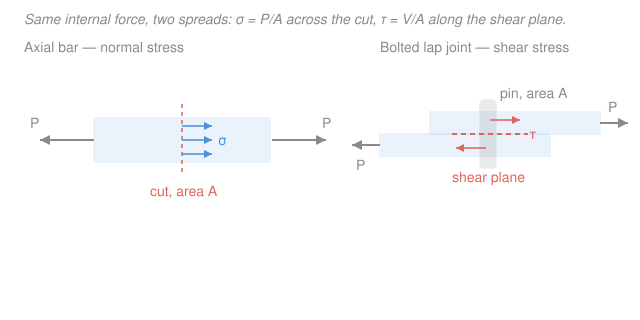

# Mechanics of Materials · Lesson 1.1: Normal and shear stress

> ⏱ ~15 min · Module 1: Axial loading · Builds on: [`statics` 4.1 Internal forces](../../statics/lessons/04-01-internal-forces-normal-shear-bending.md) · Unlocks: [1.2 Strain and the tension test](01-02-strain-tension-test.md)

## Why this matters

Statics could tell you the **force** on a cut through a member, but never whether the member survives. A tow cable and a bridge cable can carry the same 50 kN and one snaps while the other yawns — because failure isn't about total force, it's about how *concentrated* that force is. **Stress** is that concentration: force per unit area, the actual quantity a material feels and the number every design code is written in. This lesson turns the internal forces you already know how to find into stresses you can compare against a material's limit. Everything downstream — deformation, torsion, bending, buckling, yielding — is a variation on it.

## The idea

Take a bar, pull on it, and slice it with an imaginary cut. Statics ([`statics` 4.1](../../statics/lessons/04-01-internal-forces-normal-shear-bending.md)) says the material on one side pushes back on the other with an internal force $P$ equal to the pull. But that force doesn't act at a point — it's shared across the *whole* cut face. Spread 50 kN over a fat cross-section and each patch of material barely notices; spread it over a thin one and every patch is straining hard. Stress is force divided by the area it's spread over: the *intensity* of internal force.

There are two flavors, and the only difference is direction relative to the cut face. If the force pushes **straight through** the face (perpendicular), it's **normal stress** $\sigma$ — a stretch (tension) or a squeeze (compression). If the force **slides along** the face (parallel), like scissors shearing paper, it's **shear stress** $\tau$. Same idea, force over area, just resolved two ways. A third case, **bearing stress**, is what a bolt or pin presses onto the hole it sits in — a contact pressure, not a stress on a cut, but computed the same way.

## The formal version

Slice a member and let $\Delta F$ be the internal force carried by a small patch of area $\Delta A$ on the cut face. The **stress at a point** is the limit as that patch shrinks:

$$\sigma = \lim_{\Delta A \to 0} \frac{\Delta F_\perp}{\Delta A}, \qquad \tau = \lim_{\Delta A \to 0} \frac{\Delta F_\parallel}{\Delta A}.$$

*In words: stress is the internal force per unit area at a point — the perpendicular part is normal stress, the parallel part is shear stress.*

When the force is spread **uniformly** over the section (a good approximation for an axially loaded bar away from the ends), the limit is just a ratio:

$$\boxed{\;\sigma = \frac{P}{A}\;} \qquad \boxed{\;\tau = \frac{V}{A}\;} \qquad \boxed{\;\sigma_b = \frac{P}{A_b}\;}$$

- $P$ = internal **normal** force, perpendicular to the section (N). Sign convention: **tension positive, compression negative.**
- $V$ = internal **shear** force, parallel to the section (N).
- $A$ = cross-sectional area the force is spread over (m²).
- $\sigma_b$ = **bearing stress**; $A_b$ = **projected** contact area (for a pin of diameter $d$ through a plate of thickness $t$, $A_b = d\,t$, not the curved surface).

**Units.** Stress is N/m² = **pascal (Pa)**. A pascal is tiny, so engineering uses **megapascals**:

$$1\ \mathrm{MPa} = 10^{6}\ \mathrm{Pa} = 1\ \mathrm{N/mm^2}.$$

That last identity is the one you'll use constantly: **newtons over square-millimeters gives MPa directly.** Keep your units consistent — either all SI (N, m, Pa) or the engineer's shortcut (N, mm, MPa). Mixing mm and m is the single most common stress-calculation error.

**Single vs. double shear.** How many surfaces does the force have to shear across? In a **single-shear** lap joint the pin is cut by *one* plane, so that plane carries the whole load: $V = P$. In a **double-shear** joint (a pin in a clevis, supported on both sides), the load splits across *two* planes, so each carries half: $V = P/2$. The pin's cross-sectional area $A$ is the same either way — only $V$ changes. *In words: double shear puts the same pin against two cutting planes, halving the shear force on each.*

## Picture

## Worked examples

**Example 1 (axial — the definition in action).** A steel rod of diameter $d = 20\ \mathrm{mm}$ carries an axial tension $P = 50\ \mathrm{kN}$. Find the normal stress.

Cross-sectional area (work in mm to land in MPa):

$$A = \frac{\pi d^2}{4} = \frac{\pi (20)^2}{4} = 314.2\ \mathrm{mm^2}.$$

$$\sigma = \frac{P}{A} = \frac{50{,}000\ \mathrm{N}}{314.2\ \mathrm{mm^2}} = 159\ \mathrm{MPa}\ \ (\text{tension},\ +).$$

*Check.* N/mm² = MPa ✓. Sanity: 159 MPa is well under a typical mild-steel yield of ~250 MPa (see [`materials-science` 4.1](../../materials-science/lessons/04-01-elastic-behavior-stress-strain.md)), so the rod is safe but not idle. Redo in pure SI to confirm: $A = \pi(0.01)^2 = 3.142\times10^{-4}\ \mathrm{m^2}$, $\sigma = 50{,}000 / 3.142\times10^{-4} = 1.59\times10^{8}\ \mathrm{Pa} = 159\ \mathrm{MPa}$ ✓.

**Example 2 (shear + bearing on a pin joint).** A $16\ \mathrm{mm}$ pin fastens a clevis in **double shear**, carrying $P = 40\ \mathrm{kN}$. The pin bears on a central plate (tongue) of thickness $t = 10\ \mathrm{mm}$. Find the shear stress in the pin and the bearing stress on the plate.

Double shear → two planes → shear force per plane:

$$V = \frac{P}{2} = 20\ \mathrm{kN}. \qquad A = \frac{\pi (16)^2}{4} = 201.1\ \mathrm{mm^2}.$$

$$\tau = \frac{V}{A} = \frac{20{,}000}{201.1} = 99.5\ \mathrm{MPa}.$$

Bearing on the tongue uses the **projected** area $A_b = d\,t$, and the tongue transfers the *full* load onto the pin:

$$\sigma_b = \frac{P}{A_b} = \frac{40{,}000}{16 \times 10} = 250\ \mathrm{MPa}.$$

*Check.* Both come out in N/mm² = MPa ✓. Note the shape of the answer: had this been **single** shear, $V$ would be the full 40 kN and $\tau$ would double to ~199 MPa — the reason clevis pins are designed in double shear. Bearing (250 MPa) is much larger than shear here, so on this joint the plate crushing, not the pin shearing, is the governing check.

## Watch out

- **You might think a bigger load is what breaks a part — but it's the stress.** Two rods under the same 50 kN are *not* equally endangered; the thin one has the higher $\sigma = P/A$ and fails first. Force is what statics hands you; stress is what the material answers to. Always divide by the area before you judge safety.
- **You might reach for $\sigma$ when the loading is actually shear.** Normal stress uses the force *perpendicular* to the cut; shear uses the force *parallel* to it. On a bolt in a lap joint the load slides across the pin's cross-section — that's $\tau = V/A$, not $\sigma$. Ask which way the force points relative to the face before choosing the formula.
- **You might halve the area in double shear. Halve the force instead.** Double shear means the *same* pin is cut by *two* planes, so each plane sees $V = P/2$ over the pin's *full* area $A$: $\tau = P/(2A)$. Don't also shrink $A$.
- **You might use the pin's round surface for bearing. Use the projected rectangle $d\,t$.** Bearing stress is an average over the *flattened* contact patch, deliberately taken as diameter × thickness, not the curved half-cylinder.

## One-liner

> Stress is internal force spread over area — $\sigma = P/A$ when the force pierces the cut, $\tau = V/A$ when it slides along it — and it, not the raw force, is what a material actually feels.

## Problems

**P1 (🟢)** A square bar $25\ \mathrm{mm} \times 25\ \mathrm{mm}$ carries an axial **compressive** load of $75\ \mathrm{kN}$. Find the normal stress, including its sign, in MPa.

**P2 (🟡)** Two flat plates are joined by a **single** bolt of diameter $12\ \mathrm{mm}$ and pulled apart with $P = 15\ \mathrm{kN}$ (single shear). Each plate is $8\ \mathrm{mm}$ thick. Find (a) the shear stress in the bolt and (b) the bearing stress on a plate.

**P3 (🔴)** A steel tie rod must carry $100\ \mathrm{kN}$ in tension. Design codes limit it to an **allowable stress** $\sigma_{\text{allow}} = 150\ \mathrm{MPa}$ (this is the $\sigma_Y \approx 250\ \mathrm{MPa}$ yield of steel divided by a factor of safety of about $1.67$ — see [4.5](04-05-yield-failure-criteria.md)). Find the minimum required diameter, then round up to a sensible whole millimeter.

Solutions

**P1** Area $A = 25 \times 25 = 625\ \mathrm{mm^2}$. Compression makes the sign negative:

$$\sigma = -\frac{P}{A} = -\frac{75{,}000}{625} = -120\ \mathrm{MPa}\ \ (\text{compression}).$$

*Check.* N/mm² = MPa ✓; the minus sign records that the internal force squeezes the section rather than stretching it.

**P2** Single shear, so the one plane carries the whole load, $V = P = 15\ \mathrm{kN}$.

(a) Bolt area $A = \dfrac{\pi (12)^2}{4} = 113.1\ \mathrm{mm^2}$, so

$$\tau = \frac{V}{A} = \frac{15{,}000}{113.1} = 132.6\ \mathrm{MPa}.$$

(b) Bearing on projected area $A_b = d\,t = 12 \times 8 = 96\ \mathrm{mm^2}$:

$$\sigma_b = \frac{P}{A_b} = \frac{15{,}000}{96} = 156.3\ \mathrm{MPa}.$$

*Check.* Both in MPa ✓. Single shear (not double) means no halving of the load — a good habit is to state which you're in before computing $V$.

**P3** Rearrange $\sigma = P/A$ for the minimum area, using the allowable stress as the largest $\sigma$ permitted:

$$A_{\min} = \frac{P}{\sigma_{\text{allow}}} = \frac{100{,}000\ \mathrm{N}}{150\ \mathrm{N/mm^2}} = 666.7\ \mathrm{mm^2}.$$

For a circular rod, $A = \pi d^2 / 4$, so

$$d = \sqrt{\frac{4 A_{\min}}{\pi}} = \sqrt{\frac{4 (666.7)}{\pi}} = \sqrt{848.8} = 29.1\ \mathrm{mm} \;\Rightarrow\; d = 30\ \mathrm{mm}.$$

*Check.* Rounding *up* keeps the actual area (and thus safety) on the conservative side: a 30 mm rod has $A = 706.9\ \mathrm{mm^2}$, giving $\sigma = 100{,}000/706.9 = 141\ \mathrm{MPa} < 150\ \mathrm{MPa}$ ✓. Rounding down to 29 mm would have overshot the allowable, so the direction of rounding is not optional.

## Connections

- **Backward:** the $P$ and $V$ here are exactly the internal normal and shear forces you extracted with the method of sections in [`statics` 4.1](../../statics/lessons/04-01-internal-forces-normal-shear-bending.md). Mechanics of materials picks up where statics stops — dividing those forces by area to get something the material can respond to.
- **Forward:** [1.2 Strain and the tension test](01-02-strain-tension-test.md) measures the *deformation* stress causes; pairing the two ($\sigma$ with strain $\varepsilon$) gives Hooke's law and the stiffness $E$, the backbone of the rest of Module 1. The same $\sigma = $ force/area logic returns dressed up as torsional shear $\tau = Tr/J$ (Module 2) and bending $\sigma = -My/I$ (Module 2–3).
- **Sideways (materials science):** this course *computes* the stress that reaches a material; [`materials-science` 4.1](../../materials-science/lessons/04-01-elastic-behavior-stress-strain.md) explains *why* the material yields when it gets there — dislocations sliding, bonds stretching. Our $\sigma = P/A$ is the demand; their yield stress $\sigma_Y$ is the supply, and safe design keeps demand below supply.
