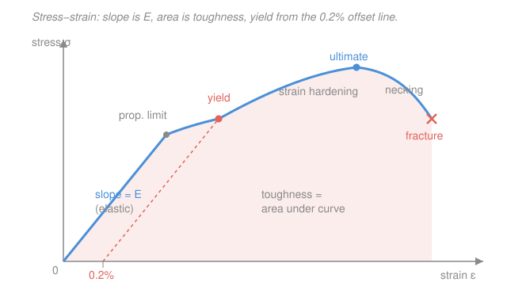

# Mechanics of Materials · Lesson 1.2: Strain and the tension test

> ⏱ ~15 min · Module 1: Stress, strain, and axial loading · Builds on: [1.1 Normal and shear stress](01-01-normal-shear-stress.md), [`materials-science` 4.1 (elastic behavior / stress–strain)](../../materials-science/lessons/04-01-elastic-behavior-stress-strain.md) · Unlocks: [1.3 Axial deformation](01-03-axial-deformation.md)

## Why this matters

Lesson 1.1 gave you stress — the internal force per unit area a part carries. But stress alone can't tell you whether the part *survives*: a stress of 150 MPa is trivial for steel and catastrophic for chalk. You need a second number, **strain** (how much the material stretched), and a chart that ties the two together for a given material — the **stress–strain diagram**. That chart is the material's fingerprint. From it you read the one constant that turns stress into deflection (Young's modulus $E$), the stress at which the part is permanently ruined (yield), and the stress at which it snaps (ultimate). Every "will it hold?" verdict in this course is ultimately a comparison against a number pulled off this curve.

## The idea

Pull on a bar and it gets longer. **Strain** is that stretch expressed as a *fraction of the original length* — not "it grew 1 mm," but "it grew 1 mm *per meter*." That normalization is the whole point: a 1 mm stretch is huge on a 10 mm pin and negligible on a 10 m cable, and strain captures exactly that difference. It's dimensionless.

Now do the experiment carefully: clamp a standard bar in a machine, pull with steadily rising force, and record stress ($\sigma = P/A$) against strain at every instant. You get a curve with a very consistent shape. At first it's a straight line — pull twice as hard, it stretches twice as far, and *let go and it springs right back* (elastic). Push past a certain point and the line bends over: now the bar keeps stretching for little extra load, and when you release it, it **doesn't** fully spring back — it's permanently bent (plastic). Keep going and it strengthens briefly (strain hardening), reaches a peak (ultimate strength), then thins down at one spot (necking) and breaks. The slope, the bends, and the area under that curve are the material's entire mechanical personality.

*Why* the curve has this shape — why metals yield at all — is a story about atomic bonds stretching and then dislocations sliding, which is [`materials-science` 4.1](../../materials-science/lessons/04-01-elastic-behavior-stress-strain.md)'s job. **That** course explains the physics that produces the curve; **this** course takes the curve as given and uses it to size parts.

## The formal version

**Normal strain.** A bar of original length $L$ (m) that elongates by $\delta$ (m) has normal strain

$$\varepsilon = \frac{\delta}{L}.$$

*In words: strain is elongation divided by original length — the fractional stretch.* It is dimensionless (m/m). The numbers are tiny for metals, so we often quote **microstrain**: $1\ \mu\varepsilon = 10^{-6}$, i.e. $750\ \mu\varepsilon$ means $\varepsilon = 0.000750$.

**Shear strain.** Where normal strain measures *stretch*, shear strain measures *skew*. Apply shear stress to a block and its originally right-angled corners tilt; the shear strain $\gamma$ (radians) is the change in that right angle:

$$\gamma = \frac{\pi}{2} - \theta',$$

where $\theta'$ is the distorted corner angle. *In words: shear strain is how far a right angle opens or closes, measured in radians.* For small distortions it equals the sideways slip divided by the height — a top face that slides $0.3\ \mathrm{mm}$ across a $40\ \mathrm{mm}$-tall block has $\gamma \approx 0.3/40 = 0.0075\ \mathrm{rad}$.

**Hooke's law.** In the initial straight region, stress and strain are proportional:

$$\sigma = E\,\varepsilon.$$

*In words: within the elastic range, stress is a fixed multiple of strain, and that multiple is the material's stiffness.* The constant $E$ (units of stress, GPa) is **Young's modulus** — the **slope** of the linear part of the diagram. Steel is stiff ($E = 200$ GPa); aluminum is a third as stiff ($E = 70$ GPa). Note what $E$ is *not*: it is a measure of stiffness, not of strength. A stiff material resists *deflecting*; a strong material resists *failing*. They are read off different features of the same curve.

**Landmarks on the diagram** (walk up the curve, low stress to fracture):

- **Proportional limit** — the stress where the line stops being straight (Hooke's law stops holding).
- **Elastic limit** — the highest stress from which the bar still returns to its original length. Very close to the proportional limit; often treated as the same point.
- **Yield strength $\sigma_Y$** — the stress marking the onset of appreciable permanent deformation. Because the knee is gradual, it's *defined by construction*: draw a line parallel to the elastic slope, offset by $0.2\%$ strain ($\varepsilon = 0.002$); where it crosses the curve is the **0.2% offset yield strength**. This is the number most designs are checked against.
- **Ultimate strength $\sigma_u$** — the peak of the curve, the maximum engineering stress the material carries.
- **Fracture** — where it breaks, past the peak, after necking.

Three whole-curve properties matter too:

- **Ductility** — how much it deforms before fracture, reported as **percent elongation** $\dfrac{L_f - L_0}{L_0}\times 100\%$. High = ductile (steel, ~25%); low = brittle (cast iron).
- **Resilience** — energy absorbed *elastically* (per unit volume): the area under the curve up to yield, $u_r = \tfrac12\sigma_Y\varepsilon_Y = \dfrac{\sigma_Y^2}{2E}$.
- **Toughness** — energy absorbed *total*, to fracture: the **entire area under the curve**. A tough material is both reasonably strong and ductile.

**Factor of safety.** You never design a part to run at yield or ultimate — you leave margin. The **factor of safety** is the ratio of the failure stress to the stress you actually allow:

$$FS = \frac{\sigma_{fail}}{\sigma_{allow}} \quad\Longrightarrow\quad \sigma_{allow} = \frac{\sigma_{fail}}{FS},$$

with $\sigma_{fail}$ taken as $\sigma_Y$ for parts that must not yield (or $\sigma_u$ for parts that must not break). *In words: the allowable working stress is the material's failure stress divided by a safety margin bigger than 1.* Choose $A$ so that $\sigma = P/A \le \sigma_{allow}$, and the part is safe.

## Picture

## Worked examples

**Example 1 (Hooke's law — stress to strain to stretch).** A steel bar ($E = 200$ GPa) carries an axial stress $\sigma = 150$ MPa. Find the strain, and the elongation over a $2\ \mathrm{m}$ length.

Strain straight from Hooke's law, keeping units in pascals ($1\ \mathrm{MPa} = 10^6\ \mathrm{Pa}$, $1\ \mathrm{GPa} = 10^9\ \mathrm{Pa}$):

$$\varepsilon = \frac{\sigma}{E} = \frac{150\times10^6\ \mathrm{Pa}}{200\times10^9\ \mathrm{Pa}} = 0.750\times10^{-3} = 750\ \mu\varepsilon.$$

Then elongation is strain times original length:

$$\delta = \varepsilon L = (0.750\times10^{-3})(2\ \mathrm{m}) = 1.5\times10^{-3}\ \mathrm{m} = 1.5\ \mathrm{mm}.$$

*Check.* $\sigma/E$ is $\mathrm{Pa}/\mathrm{Pa}$ = dimensionless ✓, so strain is unitless as required. $150$ MPa is well under steel's $\sim 250$ MPa yield, so we're safely in the elastic region where Hooke's law applies — and a $1.5\ \mathrm{mm}$ stretch over $2000\ \mathrm{mm}$ is $0.075\%$, comfortingly small. ✓

**Example 2 (read the curve, then size a rod).** A steel with yield strength $\sigma_Y = 250$ MPa must carry an axial pull of $P = 40\ \mathrm{kN}$ with a factor of safety of $2$ against yielding. What rod diameter do you need?

First the allowable stress:

$$\sigma_{allow} = \frac{\sigma_Y}{FS} = \frac{250\ \mathrm{MPa}}{2} = 125\ \mathrm{MPa}.$$

Now the required area, using $1\ \mathrm{MPa} = 1\ \mathrm{N/mm^2}$ so the load in newtons and area in $\mathrm{mm^2}$ line up cleanly:

$$A \ge \frac{P}{\sigma_{allow}} = \frac{40{,}000\ \mathrm{N}}{125\ \mathrm{N/mm^2}} = 320\ \mathrm{mm^2}.$$

For a solid round rod, $A = \pi d^2/4$, so

$$d \ge \sqrt{\frac{4A}{\pi}} = \sqrt{\frac{4(320)}{\pi}} = \sqrt{407.4} = 20.2\ \mathrm{mm}.$$

Specify the next standard size up, say $d = 22\ \mathrm{mm}$.

*Check.* At $d = 20.2\ \mathrm{mm}$ the actual stress is $P/A = 40{,}000/320 = 125\ \mathrm{MPa} = \sigma_{allow}$ ✓, which sits at exactly *half* of $\sigma_Y = 250\ \mathrm{MPa}$ — the safety factor of 2 made visible. Rounding the diameter *up* only lowers the stress, so it stays safe. ✓

## Watch out

- **You might think a 1 mm stretch tells you the strain.** It doesn't — strain is *per unit length*. The same 1 mm is a large strain on a short pin and a negligible one on a long cable. Always divide by the original length before comparing to a material limit.
- **You might think stiff means strong.** They're different features of the curve. **Stiffness** is the *slope* $E$ (resists deflecting); **strength** is the *height* at yield or ultimate (resists failing); **toughness** is the *area* (resists fracturing). A material can be stiff but brittle (glass), or flexible but tough (many polymers). Don't read one from another.
- **You might think the material weakens after the ultimate point** because the curve drops toward fracture. It's an artifact of *engineering* stress: we divide by the *original* area $A_0$, but the neck is shrinking, so the real (true) stress on that dwindling cross-section keeps rising. The material isn't giving up; our denominator is just out of date.
- **You might treat yield as "where the line bends."** For most metals the knee is rounded, so yield is *defined* by the 0.2% offset construction — a repeatable line-drawing rule, not a visually obvious kink.

## One-liner

> Strain is fractional stretch ($\varepsilon = \delta/L$), Hooke's law $\sigma = E\varepsilon$ makes the elastic line, and the stress–strain curve hands you $E$ (slope), yield and ultimate (heights), and toughness (area) — which you divide by a factor of safety to size the part.

## Problems

**P1 (🟢)** An aluminum rod ($E = 70$ GPa) with an original length of $1.5\ \mathrm{m}$ stretches by $1.2\ \mathrm{mm}$ under load, staying elastic. Find (a) the strain in $\mu\varepsilon$ and (b) the axial stress, in MPa.

**P2 (🟡)** A steel tie rod ($\sigma_Y = 250$ MPa) must carry a static tensile load of $P = 50\ \mathrm{kN}$ with a factor of safety of $2.5$ against yielding. Find the allowable stress and the minimum solid-round diameter.

**P3 (🔴)** For the same steel ($\sigma_Y = 250$ MPa, $E = 200$ GPa), estimate the **modulus of resilience** — the elastic strain energy stored per unit volume when the material is loaded right up to yield. Give a number with units, and say in one sentence how it differs from toughness.

Solutions

**P1** (a) Strain is elongation over original length:

$$\varepsilon = \frac{\delta}{L} = \frac{1.2\times10^{-3}\ \mathrm{m}}{1.5\ \mathrm{m}} = 0.800\times10^{-3} = 800\ \mu\varepsilon.$$

(b) Stress from Hooke's law:

$$\sigma = E\varepsilon = (70\times10^9\ \mathrm{Pa})(0.800\times10^{-3}) = 56\times10^6\ \mathrm{Pa} = 56\ \mathrm{MPa}.$$

*Check.* Strain dimensionless ✓; $56$ MPa is well below aluminum's yield (~$95$–$270$ MPa depending on alloy), so assuming elastic behavior was legitimate. ✓

**P2** Allowable stress first:

$$\sigma_{allow} = \frac{\sigma_Y}{FS} = \frac{250}{2.5} = 100\ \mathrm{MPa} = 100\ \mathrm{N/mm^2}.$$

Required area, then diameter:

$$A \ge \frac{P}{\sigma_{allow}} = \frac{50{,}000\ \mathrm{N}}{100\ \mathrm{N/mm^2}} = 500\ \mathrm{mm^2}, \qquad d \ge \sqrt{\frac{4A}{\pi}} = \sqrt{\frac{2000}{\pi}} = \sqrt{636.6} = 25.2\ \mathrm{mm}.$$

So $d \ge 25.2\ \mathrm{mm}$; round up to a standard $26$ or $28\ \mathrm{mm}$ rod.

*Check.* At $A = 500\ \mathrm{mm^2}$ the working stress is exactly $100$ MPa, which is $250/2.5$ — the factor of safety of 2.5 recovered. Units: $\mathrm{N} \div (\mathrm{N/mm^2}) = \mathrm{mm^2}$ ✓. A larger $FS$ than Example 2 for a similar load gave a fatter rod, as it should. ✓

**P3** The modulus of resilience is the triangular area under the elastic (straight) part of the curve, from $0$ to yield. With yield strain $\varepsilon_Y = \sigma_Y/E$:

$$u_r = \tfrac12\,\sigma_Y\,\varepsilon_Y = \frac{\sigma_Y^2}{2E} = \frac{(250\times10^6\ \mathrm{Pa})^2}{2(200\times10^9\ \mathrm{Pa})} = \frac{6.25\times10^{16}}{4.0\times10^{11}}\ \mathrm{Pa} = 1.56\times10^{5}\ \mathrm{Pa}.$$

That is $u_r \approx 0.156\ \mathrm{MJ/m^3}$ (equivalently $0.156\ \mathrm{MPa}$).

It differs from **toughness** in *how much* of the curve you count: resilience is only the *elastic* triangle up to yield (energy the part gives back on unloading), whereas toughness is the *whole* area to fracture (energy including all the plastic work that permanently deforms and finally breaks it).

*Check.* Units: $\mathrm{Pa}^2/\mathrm{Pa} = \mathrm{Pa} = \mathrm{N/m^2} = \mathrm{J/m^3}$ — energy per volume, exactly what a "modulus of resilience" should be. ✓ And $\varepsilon_Y = 250/200000 = 0.00125 = 1250\ \mu\varepsilon$, a believable metal yield strain. ✓

## Connections

- **Backward:** the stress in every formula here is [1.1](01-01-normal-shear-stress.md)'s $\sigma = P/A$ — this lesson simply gives that stress a partner (strain) and a rulebook (the diagram). Shear strain $\gamma$ pairs with 1.1's shear stress $\tau$ the same way normal strain pairs with normal stress.
- **Forward:** [1.3 Axial deformation](01-03-axial-deformation.md) fuses this lesson's $\varepsilon = \sigma/E$ with 1.1's $\sigma = P/A$ into the workhorse elongation formula $\delta = PL/AE$ — it's just Hooke's law with the geometry substituted in. Young's modulus $E$ reappears in *every* remaining module (torsion twist, beam deflection, buckling).
- **Sideways (materials science):** [`materials-science` 4.1](../../materials-science/lessons/04-01-elastic-behavior-stress-strain.md) explains *why* this curve looks as it does — elastic stretch is stretching atomic bonds, and yield is dislocations beginning to glide ([`materials-science` 4.2](../../materials-science/lessons/04-02-plastic-deformation-schmid.md)). That course produces the numbers ($E$, $\sigma_Y$, ductility); this course spends them to decide whether a part lives or dies.
