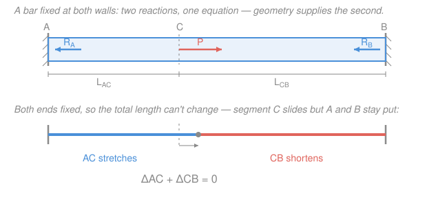

# Mechanics of Materials · Lesson 1.4: Statically indeterminate axial members

> ⏱ ~15 min · Module 1: Stress, strain, and axial loading · Builds on: [1.3 Axial deformation](01-03-axial-deformation.md), [`statics` 1.5 Rigid-body equilibrium and supports](../../statics/lessons/01-05-rigid-body-equilibrium-supports.md) · Unlocks: [1.5 Thermal stress and Poisson's ratio](01-05-thermal-stress-poisson.md), the same force method for shafts ([2.2](02-02-power-transmission-indeterminate-shafts.md)) and beams ([3.3](03-03-statically-indeterminate-beams.md))

## Why this matters

Anchor a rod at **one** end and pull it — statics alone hands you the reaction, and [1.3](01-03-axial-deformation.md) hands you the stretch. But anchor it at **both** ends, or nest a bolt inside a tube so two members share one load, and statics stalls: you have more unknown forces than equilibrium equations. This is not a rare edge case — it's how most real hardware is built. Bolted flanges, reinforced-concrete columns (steel bar carrying load beside the concrete), press-fit assemblies, a pipe restrained between two fixed supports: all statically indeterminate. The trick that rescues you here — pair equilibrium with a *geometry* equation — is the single most reused move in this whole course. Learn it on a bar and you'll reuse it verbatim on shafts and beams.

## The idea

Count the books. A bar fixed at both ends with a load somewhere in the middle has **two** unknown wall reactions, but pulling everything into a single free body gives you only **one** useful equation (forces along the axis must balance). One equation, two unknowns — you're one short. The system is *statically indeterminate*: statics can't finish the job.

Where does the missing equation come from? **Geometry.** The two walls don't move, so whatever happens inside, the bar's two ends stay exactly where they started — its total length can't change. One segment stretches, the other must shorten by precisely the same amount so the pieces still fit between the fixed walls. That "the deformations have to fit" statement is called a **compatibility condition**, and it's the equation statics couldn't give you. Then $\delta = PL/AE$ from [1.3](01-03-axial-deformation.md) converts that geometric statement into an equation in the unknown *forces*, and now you have two equations for two unknowns.

The punchline you'll feel by the end: **load flows to the stiffer path.** Between two members sharing a load, or two segments of one bar, the one that's harder to deform (bigger $AE/L$) grabs the larger share of the force. Stiffness, not strength, decides who carries what.

## The formal version

The recipe — the **force (flexibility) method** — is three steps, always in this order.

**1. Equilibrium.** Draw the free body and sum axial forces. For a bar fixed at both ends (call the reactions $R_A$ and $R_B$, in newtons) carrying an interior axial load $P$ (N):

$$R_A + R_B = P.$$

*In words: the two wall reactions together carry the whole applied load.* One equation, two unknowns — indeterminate by one, so we need exactly one more equation.

**2. Compatibility.** Write the geometry the supports force on the deformations. With both ends fixed, the segment on the $A$ side (length $L_{AC}$) and the segment on the $B$ side (length $L_{CB}$) must together change length by zero:

$$\delta_{AC} + \delta_{CB} = 0.$$

*In words: one segment's stretch is cancelled exactly by the other's squash, because the outer ends can't budge.* Sign convention: an elongation is $+$, a shortening is $-$. Carry that sign or the whole method collapses.

**3. Force–deformation law.** Replace each $\delta$ with $\delta = \dfrac{NL}{AE}$ (internal force $N$ in N, length $L$ in mm, area $A$ in mm², modulus $E$ in N/mm²). The $A$-side segment carries $R_A$ and the $B$-side carries $R_B$; with the applied load pulling toward $B$, segment $AC$ is in tension and $CB$ is in compression, so

$$\frac{R_A L_{AC}}{A E} - \frac{R_B L_{CB}}{A E} = 0 \quad\Longrightarrow\quad R_A L_{AC} = R_B L_{CB}.$$

Solve the pair. The clean result:

$$\boxed{\;R_A = P\,\frac{L_{CB}}{L_{AC}+L_{CB}}, \qquad R_B = P\,\frac{L_{AC}}{L_{AC}+L_{CB}}.\;}$$

*In words: each reaction is proportional to the length of the segment on the* **far** *side of the load — equivalently, to the stiffness $k=AE/L$ of its* own *segment.* The shorter segment is stiffer, so the nearer wall takes more.

**Parallel members sharing a load.** Same three steps, different geometry. If a rod and a tube (or two rods) of the same length $L$ share a load $P$ through rigid end caps, they must shorten *equally*: compatibility is $\delta_1 = \delta_2$. Equilibrium is $P_1 + P_2 = P$. The law gives $\dfrac{P_1 L}{A_1 E_1} = \dfrac{P_2 L}{A_2 E_2}$, so

$$\frac{P_1}{P_2} = \frac{A_1 E_1}{A_2 E_2} = \frac{k_1}{k_2}, \qquad P_i = P\,\frac{A_i E_i}{A_1E_1 + A_2 E_2}.$$

*In words: parallel members split the load in proportion to their axial stiffnesses $AE/L$.* Same-length members split by $AE$ alone — which folds in both material ($E$) and geometry ($A$).

## Picture

## Worked examples

**Example 1 — bar fixed at both ends (find the reactions, stresses, and displacement).**
A steel bar ($E = 200\ \mathrm{GPa} = 200{,}000\ \mathrm{N/mm^2}$), uniform area $A = 200\ \mathrm{mm^2}$, total length $800\ \mathrm{mm}$, is built into rigid walls at both ends. An axial load $P = 20\ \mathrm{kN}$ is applied toward wall $B$ at point $C$, located $L_{AC} = 300\ \mathrm{mm}$ from $A$ (so $L_{CB} = 500\ \mathrm{mm}$).

*Equilibrium:* $R_A + R_B = 20\ \mathrm{kN}$.

*Compatibility + law:* $R_A L_{AC} = R_B L_{CB} \Rightarrow R_A(300) = R_B(500)$. Substituting the boxed result,

$$R_A = 20\cdot\frac{500}{800} = 12.5\ \mathrm{kN}, \qquad R_B = 20\cdot\frac{300}{800} = 7.5\ \mathrm{kN}.$$

The nearer (shorter, stiffer) wall $A$ takes more. Segment stresses ($\sigma = N/A$, with $1\ \mathrm{kN/mm^2} = 1000\ \mathrm{MPa}$):

$$\sigma_{AC} = \frac{12{,}500}{200} = 62.5\ \mathrm{MPa}\ \text{(tension)}, \qquad \sigma_{CB} = \frac{7{,}500}{200} = 37.5\ \mathrm{MPa}\ \text{(compression)}.$$

Displacement of $C$ = stretch of $AC$: $\delta_C = \dfrac{R_A L_{AC}}{AE} = \dfrac{12{,}500 \times 300}{200 \times 200{,}000} = 0.0938\ \mathrm{mm}$ toward $B$.

*Check.* Compute $\delta_C$ from the other side — the shortening of $CB$: $\dfrac{R_B L_{CB}}{AE} = \dfrac{7{,}500 \times 500}{4.0\times10^{7}} = 0.0938\ \mathrm{mm}$. The two agree, which *is* compatibility satisfied. Units: $\frac{\mathrm{N}\cdot\mathrm{mm}}{\mathrm{mm^2}\cdot(\mathrm{N/mm^2})} = \mathrm{mm}$ ✓. Reactions sum to $20\ \mathrm{kN}$ ✓.

**Example 2 — rod-in-tube sharing a load (previews Boss problem 1).**
A steel rod ($E_s = 200\ \mathrm{GPa}$, $A_s = 200\ \mathrm{mm^2}$) runs concentrically inside a copper tube ($E_c = 117\ \mathrm{GPa}$, $A_c = 400\ \mathrm{mm^2}$), both of length $L = 250\ \mathrm{mm}$, capped by rigid plates that compress the assembly with $P = 40\ \mathrm{kN}$. Because the caps are rigid, rod and tube shorten by the same amount.

*Equilibrium:* $P_s + P_c = 40\ \mathrm{kN}$. *Compatibility:* $\delta_s = \delta_c$. With equal lengths, the load splits by stiffness $AE$:

$$A_s E_s = 200 \times 200 = 40{,}000, \qquad A_c E_c = 400 \times 117 = 46{,}800 \quad (\mathrm{mm^2\cdot GPa}).$$

$$P_s = 40\cdot\frac{40{,}000}{86{,}800} = 18.4\ \mathrm{kN}, \qquad P_c = 40\cdot\frac{46{,}800}{86{,}800} = 21.6\ \mathrm{kN}.$$

$$\sigma_s = \frac{18{,}430}{200} = 92.2\ \mathrm{MPa}, \qquad \sigma_c = \frac{21{,}570}{400} = 53.9\ \mathrm{MPa}\quad\text{(both compression)}.$$

Notice the copper carries *more* load (21.6 vs 18.4 kN) even though copper is the "softer" material — because its doubled area more than makes up for its lower $E$, giving it the larger $AE$. Load follows total stiffness, not material alone.

*Check.* Common shortening from the rod: $\delta = \dfrac{18{,}430 \times 250}{200 \times 200{,}000} = 0.115\ \mathrm{mm}$; from the tube: $\dfrac{21{,}570 \times 250}{400 \times 117{,}000} = 0.115\ \mathrm{mm}$ ✓ (equal, as compatibility demands). Both stresses sit well under yield ($\sigma_Y \approx 250\ \mathrm{MPa}$ for steel), so the elastic assumption holds ✓. Boss problem 1 adds a temperature rise on top of this exact setup — [1.5](01-05-thermal-stress-poisson.md) supplies the thermal piece.

## Watch out

- **You might think you can get the reactions from equilibrium alone** — you can't. Two unknown reactions, one axial-equilibrium equation: the deficit (here, one) is the *degree of indeterminacy*, and you must supply that many compatibility equations. If a problem gives you material properties ($E$) or areas when a purely-statics problem wouldn't need them, that's the tell: geometry is about to matter.
- **You might think the compatibility sum is zero because the two forces are equal.** No — for the fixed–fixed bar the *total elongation* is zero because the ends can't move, and that's what forces $\delta_{AC} = -\delta_{CB}$; the reactions are generally **unequal** ($12.5 \neq 7.5$ in Example 1). Keep the tension-$+$ / compression-$-$ sign on each $\delta$; drop it and you'll wrongly conclude $R_A = R_B$.
- **You might think the stronger or softer member carries less.** Sharing is decided by *stiffness* $AE/L$, not strength and not $E$ alone: the stiffer path attracts the larger force. A high-$E$ material can still carry the smaller share if the other member has enough extra area (Example 2).

## One-liner

> When equilibrium runs out of equations, geometry supplies the rest: deformations must fit (compatibility), $\delta = PL/AE$ turns that fit into an equation, and load flows to the stiffer path.

## Problems

**P1 (🟢)** A uniform steel bar ($A = 250\ \mathrm{mm^2}$) is fixed to rigid walls at both ends, total length $600\ \mathrm{mm}$. A load $P = 30\ \mathrm{kN}$ is applied toward the right wall at a point $200\ \mathrm{mm}$ from the left wall $A$. Find $R_A$ and $R_B$, and the stress in each segment (state tension or compression).

**P2 (🟡)** Two vertical rods of the same length hang from a ceiling and are joined at the bottom to a rigid block that carries a downward load $P = 24\ \mathrm{kN}$; the block descends uniformly, so both rods stretch equally. Rod 1 is steel ($E = 200\ \mathrm{GPa}$, $A_1 = 100\ \mathrm{mm^2}$), rod 2 is aluminum ($E = 70\ \mathrm{GPa}$, $A_2 = 200\ \mathrm{mm^2}$). Find the force in each rod. Which carries more, and why?

**P3 (🔴)** A steel bar is fixed at both ends. Segment $AC$ (length $400\ \mathrm{mm}$, area $400\ \mathrm{mm^2}$) and segment $CB$ (length $400\ \mathrm{mm}$, area $200\ \mathrm{mm^2}$) meet at $C$, where a load $P = 36\ \mathrm{kN}$ is applied toward $B$. The segments now have *different areas*, so lengths alone don't set the split. Find $R_A$ and $R_B$.

Solutions

**P1** $L_{AC} = 200\ \mathrm{mm}$, $L_{CB} = 400\ \mathrm{mm}$. Equilibrium $R_A + R_B = 30\ \mathrm{kN}$; compatibility (equal area) $R_A L_{AC} = R_B L_{CB}$. So

$$R_A = 30\cdot\frac{L_{CB}}{L_{AC}+L_{CB}} = 30\cdot\frac{400}{600} = 20\ \mathrm{kN}, \qquad R_B = 30\cdot\frac{200}{600} = 10\ \mathrm{kN}.$$

Stresses: $\sigma_{AC} = 20{,}000/250 = 80\ \mathrm{MPa}$ (tension, on the $A$ side pulling toward $B$), $\sigma_{CB} = 10{,}000/250 = 40\ \mathrm{MPa}$ (compression). *Check:* $R_A + R_B = 30\ \mathrm{kN}$ ✓; the nearer wall $A$ carries more, as expected for the shorter segment ✓.

**P2** Equal length and equal elongation ⇒ split by $AE$. $A_1E_1 = 100 \times 200 = 20{,}000$; $A_2E_2 = 200 \times 70 = 14{,}000$ (mm²·GPa); total $34{,}000$.

$$P_1 = 24\cdot\frac{20{,}000}{34{,}000} = 14.1\ \mathrm{kN}, \qquad P_2 = 24\cdot\frac{14{,}000}{34{,}000} = 9.9\ \mathrm{kN}.$$

The steel rod carries more ($14.1$ vs $9.9\ \mathrm{kN}$): here its higher $E$ wins even though it has half the area, because $A_1E_1 = 20{,}000 > A_2E_2 = 14{,}000$ — the steel path is stiffer overall. *Check:* $P_1 + P_2 = 24\ \mathrm{kN}$ ✓.

**P3** Equilibrium $R_A + R_B = 36\ \mathrm{kN}$. Compatibility $\delta_{AC} + \delta_{CB} = 0$ with the force–deformation law and *different areas*:

$$\frac{R_A L_{AC}}{A_{AC} E} = \frac{R_B L_{CB}}{A_{CB} E} \;\Rightarrow\; \frac{R_A (400)}{400} = \frac{R_B (400)}{200} \;\Rightarrow\; R_A = 2R_B.$$

Then $2R_B + R_B = 36 \Rightarrow R_B = 12\ \mathrm{kN}$, $R_A = 24\ \mathrm{kN}$. *Check by stiffness:* $k_{AC} = A_{AC}E/L_{AC} = 400E/400 = E$; $k_{CB} = 200E/400 = 0.5E$; ratio $2:1$, and reactions come out $24:12 = 2:1$ ✓. The stiffer segment carries the larger reaction — the general rule behind Example 1, now with area (not just length) doing the work.

## Flashback

**From Lesson 1.3 (Axial deformation):** A stepped steel rod ($E = 200\ \mathrm{GPa}$) hangs from a ceiling. The upper segment $AB$ is $500\ \mathrm{mm}$ long with area $500\ \mathrm{mm^2}$; the lower segment $BC$ is $400\ \mathrm{mm}$ long with area $250\ \mathrm{mm^2}$. A $15\ \mathrm{kN}$ load pulls down at the free bottom end $C$, and an additional $25\ \mathrm{kN}$ pulls down at the junction $B$. Find the total elongation of the rod.

Solution

This is *determinate* — find internal forces by sections, then sum $\delta = \sum \dfrac{N_i L_i}{A_i E}$. Cut below $B$: segment $BC$ carries only the bottom load, $N_{BC} = 15\ \mathrm{kN}$. Cut above $B$: segment $AB$ carries both, $N_{AB} = 15 + 25 = 40\ \mathrm{kN}$ (both tension).

$$\delta = \frac{N_{AB}L_{AB}}{A_{AB}E} + \frac{N_{BC}L_{BC}}{A_{BC}E} = \frac{40{,}000 \times 500}{500 \times 200{,}000} + \frac{15{,}000 \times 400}{250 \times 200{,}000}.$$

$$\delta = 0.20 + 0.12 = 0.32\ \mathrm{mm}\ \text{(elongation)}.$$

*Check.* Units $\frac{\mathrm{N}\cdot\mathrm{mm}}{\mathrm{mm^2}\cdot(\mathrm{N/mm^2})} = \mathrm{mm}$ ✓. The upper segment carries the larger force yet its bigger area holds its stretch to $0.20\ \mathrm{mm}$ — both terms are positive because the whole rod is in tension. ✓ (Contrast today's lesson: had this rod been fixed at *both* ends, the internal forces would be unknowns and we'd need a compatibility equation.)

## Connections

- **Backward:** the force–deformation law $\delta = PL/AE$ and the summation form come straight from [1.3](01-03-axial-deformation.md); the reaction bookkeeping and free-body discipline come from [`statics` 1.5](../../statics/lessons/01-05-rigid-body-equilibrium-supports.md). The new ingredient is the compatibility equation that converts "supports don't move" into algebra.
- **Forward:** [1.5 Thermal stress and Poisson's ratio](01-05-thermal-stress-poisson.md) adds a thermal strain $\delta_T = \alpha\,\Delta T\,L$ into this same compatibility equation — that plus a preload is exactly Boss problem 1 (bolt-in-tube). The identical three-step force method reappears for twisting shafts in [2.2](02-02-power-transmission-indeterminate-shafts.md) (compatibility on the angle of twist) and for beams in [3.3](03-03-statically-indeterminate-beams.md) (compatibility on deflection).
- **Sideways (materials science):** this lesson computes the *stress* each member reaches; [`materials-science` 4.1](../../materials-science/lessons/04-01-elastic-behavior-stress-strain.md) explains *why* a material yields when that stress gets high enough (dislocation motion, defects). Mechanics of materials sets the demand; materials science sets the capacity — failure is the two meeting.
