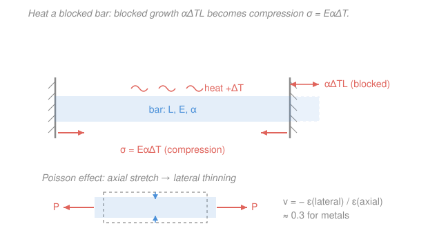

# Mechanics of Materials · Lesson 1.5: Thermal stress and Poisson's ratio

> ⏱ ~15 min · Module 1: Stress, strain, and axial loading · Builds on: [1.4 Statically indeterminate axial members](01-04-statically-indeterminate-axial.md), [1.3 Axial deformation](01-03-axial-deformation.md) · Unlocks: Boss problem 1, Module 4 (multiaxial Hooke)

## Why this matters

A bridge deck bakes to 50 °C in summer and drops below freezing in winter. A steam pipe goes from room temperature to 300 °C in minutes. If those parts are pinned so they can't grow, the temperature change alone can generate more stress than the mechanical load they were designed for — no external force required. That's why bridges have expansion joints and pipes have loops. This lesson gives you the one formula that predicts it, $\sigma = E\alpha\,\Delta T$, and it's built entirely from the compatibility idea you just met in [1.4](01-04-statically-indeterminate-axial.md). Then a second, unrelated fact you can't ignore in real parts: pull a bar longer and it gets *thinner* — **Poisson's ratio** — which is the doorway into the multiaxial stress of Module 4.

## The idea

Heat makes materials expand. If a bar is free — resting on rollers, one end loose — it simply gets longer by a predictable amount and feels *nothing*: no force pushed on it, so there is no stress. Expansion by itself is stress-free.

Now clamp both ends against rigid walls and heat it. The bar still "wants" to grow by that same amount, but the walls won't let it. So the walls shove back exactly hard enough to squeeze the extra length back out of it — and *that* squeeze is a real compressive stress. The trick to find it (straight from [1.4](01-04-statically-indeterminate-axial.md)): let the bar expand freely in your head, then apply whatever mechanical force is needed to push it back to its clamped length. The stress from that push *is* the thermal stress.

The second idea is simpler to picture. Stretch a rubber band and it narrows; squeeze a block and it bulges sideways. Metals do the same, just subtly: stretch a steel bar and every cross-section shrinks a little, by about 30% of the axial strain. That sideways-to-lengthwise ratio is a fixed material property, **Poisson's ratio** $\nu$.

## The formal version

**Free thermal strain.** Raise the temperature of an unconstrained member by $\Delta T$ (in °C) and it strains uniformly:

$$\varepsilon_T = \alpha\,\Delta T, \qquad \delta_T = \alpha\,\Delta T\,L,$$

where $\alpha$ is the **coefficient of thermal expansion** (units $/^\circ\mathrm{C}$; steel $\approx 12\times10^{-6}$, aluminum $\approx 23\times10^{-6}$, copper $\approx 17\times10^{-6}$), $L$ is the original length (m or mm), and $\delta_T$ is the free elongation. *In words: every unit of length grows by $\alpha\,\Delta T$, so the whole bar grows by that fraction of $L$.* If the bar is free, this is the whole story — the stress is **zero**.

**Thermal stress (fully constrained).** Now block both ends so the net length change must be zero. Use the [1.4](01-04-statically-indeterminate-axial.md) move — superpose a free thermal step and a mechanical step, then force the total strain to satisfy the constraint:

$$\varepsilon_{\text{total}} = \underbrace{\alpha\,\Delta T}_{\text{thermal}} + \underbrace{\frac{\sigma}{E}}_{\text{mechanical (Hooke)}} = 0 \quad\Longrightarrow\quad \boxed{\;\sigma = -E\,\alpha\,\Delta T\;}$$

*In words: the wall supplies exactly the mechanical strain $-\alpha\Delta T$ needed to cancel the free growth, and Hooke's law turns that strain into stress.* The minus sign says **heating a blocked bar puts it in compression** (cooling puts it in tension). Notice $L$ and $A$ have both dropped out — the *stress* depends only on $E$, $\alpha$, and $\Delta T$. The reaction *force* is $F = \sigma A = E\alpha\,\Delta T\,A$.

**Poisson's ratio.** Load a bar axially. It strains $\varepsilon_{\text{ax}}$ along the load and $\varepsilon_{\text{lat}}$ across it. Their ratio is a constant:

$$\nu = -\frac{\varepsilon_{\text{lat}}}{\varepsilon_{\text{ax}}}, \qquad 0 \le \nu \lesssim 0.5,\quad \nu\approx 0.3 \text{ for metals}.$$

*In words: for every bit of stretch lengthwise, the bar shrinks $\nu$ times as much sideways.* The minus sign makes $\nu$ positive, since stretching ($\varepsilon_{\text{ax}}>0$) gives thinning ($\varepsilon_{\text{lat}}<0$).

**Multiaxial (biaxial) Hooke's law.** With stresses acting on two axes at once, each stress strains its own direction directly *and* strains the other two directions through Poisson. In-plane:

$$\varepsilon_x = \frac{1}{E}\left(\sigma_x - \nu\,\sigma_y\right), \qquad \varepsilon_y = \frac{1}{E}\left(\sigma_y - \nu\,\sigma_x\right).$$

*In words: $\varepsilon_x$ is what $\sigma_x$ would do alone, minus the sideways pinch that $\sigma_y$ adds.* This is the engine of Module 4.

**Shear modulus link.** The three elastic constants aren't independent. For an isotropic material,

$$G = \frac{E}{2(1+\nu)}.$$

*In words: once you know two of $E$, $\nu$, $G$, the third is fixed.* Check for steel: $G = 200/(2\times1.3) = 76.9$ GPa $\approx 77$ GPa. ✓

## Picture

## Worked examples

**Example 1 (the bare formula).** A steel bar is rigidly clamped between two immovable walls and heated by $\Delta T = 60$ °C. Take $E = 200$ GPa and $\alpha = 12\times10^{-6}\ /^\circ\mathrm{C}$. Find the thermal stress.

The length can't change, so it's fully constrained — use $\sigma = E\alpha\,\Delta T$ directly. Keep everything in N and mm, so $E = 200{,}000\ \mathrm{MPa}$ ($1\ \mathrm{MPa}=1\ \mathrm{N/mm^2}$):

$$\sigma = E\alpha\,\Delta T = 200{,}000 \times (12\times10^{-6}) \times 60 = 144\ \mathrm{MPa}\ \text{(compression)}.$$

*Check.* Units: $\mathrm{MPa}\times(/^\circ\mathrm{C})\times{}^\circ\mathrm{C} = \mathrm{MPa}$ ✓. That is over half of steel's $\sim 250$ MPa yield from a routine summer-to-oven swing — with no external load at all. The length never entered.

**Example 2 (Boss-problem flavor: steel bolt in a copper tube).** A steel bolt runs through a copper sleeve; the nut is tightened to a preload of $P_0 = 15$ kN (bolt tension = tube compression). The whole assembly is then heated by $\Delta T = 50$ °C. Bolt: $A_b = 113\ \mathrm{mm^2}$ (12 mm dia), $E_b = 200$ GPa, $\alpha_b = 12\times10^{-6}$. Tube: $A_t = 200\ \mathrm{mm^2}$, $E_t = 117$ GPa, $\alpha_t = 17\times10^{-6}$. Find the stress in each after heating, and say whether preload or heating dominates.

*Equilibrium.* The nut and head clamp bolt and tube together, so their shared force is $P$: bolt tension $= P$, tube compression $= P$.

*Compatibility.* Clamped at both ends, bolt and tube must undergo the **same** length change. Each change is thermal plus mechanical (tension lengthens the bolt; compression shortens the tube):

$$\underbrace{\alpha_b\,\Delta T\,L + \frac{P L}{A_b E_b}}_{\delta_{\text{bolt}}} = \underbrace{\alpha_t\,\Delta T\,L - \frac{P L}{A_t E_t}}_{\delta_{\text{tube}}}.$$

The $L$ cancels. Solve for the *extra* force $\Delta P$ that heating adds on top of the preload:

$$\Delta P = \frac{(\alpha_t - \alpha_b)\,\Delta T}{\dfrac{1}{A_b E_b} + \dfrac{1}{A_t E_t}} = \frac{(5\times10^{-6})(50)}{4.42\times10^{-8} + 4.27\times10^{-8}\ \mathrm{N^{-1}}} = \frac{2.5\times10^{-4}}{8.69\times10^{-8}} \approx 2.88\ \mathrm{kN}.$$

Because copper expands more than steel ($\alpha_t>\alpha_b$), heating makes the sleeve push the clamp harder — it *adds* tension to the bolt and *adds* compression to the tube. Total force $P = 15 + 2.88 = 17.9$ kN. Stresses:

$$\sigma_b = \frac{17{,}900}{113} = 158\ \mathrm{MPa\ (tension)}, \qquad \sigma_t = \frac{17{,}900}{200} = 89\ \mathrm{MPa\ (compression)}.$$

*Check.* $\mathrm{N/mm^2 = MPa}$ ✓. The preload set the baseline ($15$ kN); heating added only $\sim 19\%$. **Preload dominates the magnitude** — but the physically important lesson is the *sign*: for this material pair heating *tightens* the joint rather than loosening it. (Swap in an aluminum bolt with a steel sleeve and the mismatch reverses — heating would relax the preload.)

## Watch out

- **You might think heating a part always stresses it.** Only if its expansion is *constrained*. A bar free on rollers heats up, grows by $\alpha\Delta T\,L$, and carries **zero** stress. Thermal stress is a story about the *supports*, not the temperature.
- **You might expect thermal stress to grow with length.** It doesn't: $\sigma = E\alpha\,\Delta T$ has no $L$. A stubby blocked bar and a long one reach the *same* stress — the long one just has more free growth $\delta_T$ to cancel and a larger reaction *force* if $A$ differs. Stress, no; force, maybe.
- **You might think $\varepsilon_x$ depends only on $\sigma_x$.** Under more than one stress it doesn't — a transverse $\sigma_y$ shifts $\varepsilon_x$ by $-\nu\sigma_y/E$ through Poisson. Forgetting that term is the classic Module 4 error.

## One-liner

> Free to grow, a heated bar carries no stress; block that growth and it pays $E\alpha\Delta T$ in compression — and every axial pull secretly thins the bar by $\nu$.

## Problems

**P1 (🟢)** An aluminum bar, $L = 2$ m, is heated by $\Delta T = 40$ °C. Use $E = 70$ GPa, $\alpha = 23\times10^{-6}\ /^\circ\mathrm{C}$. (a) If it sits free on rollers, how much does it lengthen, and what is the stress? (b) If instead it is rigidly clamped at both ends, what is the thermal stress?

**P2 (🟡)** A point in a steel plate is under biaxial stress $\sigma_x = 120$ MPa (tension) and $\sigma_y = -40$ MPa (compression), with $E = 200$ GPa, $\nu = 0.30$. Find the strains $\varepsilon_x$ and $\varepsilon_y$. Which direction stretches, which shrinks?

**P3 (🔴)** A steel bar, $L = 300$ mm, sits between two rigid walls with a **gap** of $g = 0.2$ mm at one end. It is heated by $\Delta T = 80$ °C ($E = 200$ GPa, $\alpha = 12\times10^{-6}$). Does it touch the far wall? If so, what compressive stress develops? (Hint: only the growth *beyond* the gap gets constrained.)

Solutions

**P1** (a) Free expansion, keep lengths in mm ($L = 2000$ mm):
$$\delta_T = \alpha\,\Delta T\,L = (23\times10^{-6})(40)(2000) = 1.84\ \mathrm{mm}.$$
Free means unconstrained, so the stress is **zero**.

(b) Fully clamped, so $\sigma = E\alpha\,\Delta T = 70{,}000 \times (23\times10^{-6}) \times 40 = 64.4\ \mathrm{MPa}$ (compression).

*Check.* Units $\mathrm{MPa}$ ✓. Note the length that mattered in (a) vanished in (b) — exactly as $\sigma = E\alpha\Delta T$ promises. Aluminum's larger $\alpha$ but smaller $E$ give a stress below the steel Example-1 value.

**P2** Biaxial Hooke:
$$\varepsilon_x = \frac{1}{E}(\sigma_x - \nu\sigma_y) = \frac{120 - 0.3(-40)}{200{,}000} = \frac{132}{200{,}000} = 6.6\times10^{-4}\ (\text{stretch}),$$
$$\varepsilon_y = \frac{1}{E}(\sigma_y - \nu\sigma_x) = \frac{-40 - 0.3(120)}{200{,}000} = \frac{-76}{200{,}000} = -3.8\times10^{-4}\ (\text{shrink}).$$
The $x$-direction stretches, the $y$-direction shrinks.

*Check.* Strains are dimensionless (MPa/MPa) ✓. The compressive $\sigma_y$ makes $\varepsilon_x$ *larger* than the $\sigma_x$-alone value $120/200{,}000 = 6.0\times10^{-4}$ — a sideways squeeze helps the bar stretch lengthwise, exactly the Poisson coupling. ✓

**P3** First check whether it reaches the wall. Free growth:
$$\delta_T = \alpha\,\Delta T\,L = (12\times10^{-6})(80)(300) = 0.288\ \mathrm{mm} > g = 0.2\ \mathrm{mm}.$$
Yes — it closes the gap and presses on the wall. Only the excess $\delta_T - g = 0.088$ mm is constrained; the wall pushes the bar back by that much, a mechanical strain of $(\delta_T-g)/L$:
$$\sigma = E\,\frac{\delta_T - g}{L} = 200{,}000 \times \frac{0.088}{300} = 58.7\ \mathrm{MPa}\ \text{(compression)}.$$

*Check.* Units $\mathrm{MPa}$ ✓. Sanity: if the gap were larger than $0.288$ mm the bar would never touch and $\sigma = 0$; here it just barely does, so the stress is well below the fully-blocked value $E\alpha\Delta T = 192$ MPa — the gap "absorbs" most of the growth. ✓

## Flashback

**From Lesson 1.4 (Statically indeterminate axial members):** A rigid plate is hung from two vertical rods of equal length $L$: one steel ($A = 100\ \mathrm{mm^2}$, $E = 200$ GPa) and one aluminum ($A = 100\ \mathrm{mm^2}$, $E = 70$ GPa). A load $P = 27$ kN is applied through the plate. How much does each rod carry, and what is the stress in each? (Fresh variant — load sharing, no temperature.)

Solution

Equilibrium alone gives one equation, $P_s + P_a = 27$ kN, for two unknowns — indeterminate. Add **compatibility**: both rods hang from the same rigid plate over the same length, so they stretch equally, $\delta_s = \delta_a$:
$$\frac{P_s L}{A_s E_s} = \frac{P_a L}{A_a E_a} \quad\Longrightarrow\quad \frac{P_s}{P_a} = \frac{A_s E_s}{A_a E_a} = \frac{200}{70}\quad(\text{equal }A,\ L).$$
So load splits in proportion to stiffness $AE/L$. With $P_s : P_a = 200 : 70$ and total $27$ kN:
$$P_s = 27\cdot\frac{200}{270} = 20\ \mathrm{kN}, \qquad P_a = 27\cdot\frac{70}{270} = 7\ \mathrm{kN}.$$
Stresses (both $A = 100\ \mathrm{mm^2}$): $\sigma_s = 20{,}000/100 = 200$ MPa, $\sigma_a = 7{,}000/100 = 70$ MPa.

*Check.* $P_s + P_a = 27$ kN ✓. The stiffer rod hogs more load — the same "equal displacement, force follows stiffness" logic that drives the bolt-and-tube compatibility in Example 2 above. ✓

## Connections

- **Backward:** the thermal-stress derivation is the [1.4](01-04-statically-indeterminate-axial.md) compatibility method with a free-expansion step spliced in, and it leans on $\delta = PL/AE$ from [1.3](01-03-axial-deformation.md) and Hooke's law $\sigma = E\varepsilon$ from [1.2](01-02-strain-tension-test.md).
- **Forward:** Example 2 *is* Boss problem 1 in miniature — carry the equilibrium + compatibility + thermal bookkeeping into it. Biaxial Hooke and the pair $(\nu, G)$ are the setup for Module 4: plane-stress transformation ([4.1](04-01-plane-stress-transformation.md)) and pressure-vessel strains ([4.3](04-03-combined-loadings.md)); $G$ itself shows up next module as the shear stiffness in torsion ([2.1](02-01-torsion-circular-shafts.md)).
- **Sideways:** *why* does $\alpha$ exist at all? Because the interatomic potential well is **asymmetric** — easier to stretch a bond than to compress it — so hotter, wider-amplitude vibrations sit at a larger average spacing. That's the bond-energy well of [`materials-science` 1.1](../../materials-science/lessons/01-01-bonding-energy-well.md); the same asymmetry that gives thermal expansion in [`engineering-thermodynamics`](../../engineering-thermodynamics/syllabus.md). This course computes the stress that mismatch produces; materials-science explains the atomic origin.
