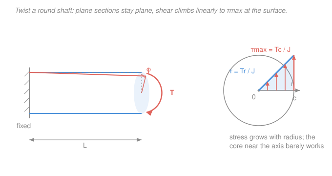

# Mechanics of Materials · Lesson 2.1: Torsion of circular shafts

> ⏱ ~15 min · Module 2: Torsion and bending · Builds on: [1.1 Normal and shear stress](01-01-normal-shear-stress.md), [1.5 Thermal stress and Poisson's ratio](01-05-thermal-stress-poisson.md) (shear modulus $G$) · Unlocks: [2.2 Power transmission](02-02-power-transmission-indeterminate-shafts.md), [4.3 Combined loadings](04-03-combined-loadings.md)

## Why this matters

Every drive shaft, axle, screwdriver bit, and drill string carries its load by *twisting*. The engine at one end applies a torque; the wheel at the other resists it; the shaft in between has to survive the shear that torque sets up — and not twist so much that the timing goes soft. This lesson is the axial story ([1.3](01-03-axial-deformation.md)) told again for twist: one formula for the **stress** ($\tau = Tr/J$), a twin formula for the **deformation** ($\phi = TL/GJ$), and a cross-section number ($J$) that decides how much each costs. It also settles a question every mechanical designer meets on day one: *why are drive shafts hollow?*

## The idea

Grab a round bar, clamp one end, and twist the other with your hand. Two things happen. Every cross-section rotates about the axis like a rigid disk — a section that was flat and circular stays flat and circular, it just spins a little relative to its neighbors (this is the key fact, and it holds *exactly* for circular shafts and only for them). And a straight line drawn along the surface skews into a gentle helix.

That skew is **shear strain** ([1.1](01-01-normal-shear-stress.md)). Here's the crux: a point on the *axis* doesn't move at all when its disk rotates, while a point on the *rim* sweeps the farthest. So the skew — the strain — is zero at the center and largest at the surface, growing in direct proportion to the radius $r$. Hooke's law in shear ($\tau = G\gamma$) then says the *stress* does the same: **zero at the axis, maximum at the skin, linear in between.** That single picture is the whole lesson. The material sitting near the axis is nearly idle — which is exactly why we'll drill it out.

## The formal version

Twist a circular shaft of length $L$ (m) and outer radius $c$ (m) with a torque $T$ (newton-metres, N·m). Let $\phi$ be the total **angle of twist** (radians) of one end relative to the other.

**Geometry — strain grows with radius.** Because sections stay plane and rotate rigidly, a fibre at radius $r$ (m) picks up a shear strain

$$\gamma = \frac{r\,\phi}{L}.$$

*In words: the shear strain at any point is set by how far out it sits — proportional to $r$, zero on the axis.* ($\gamma$ is dimensionless, in rad.)

**Hooke's law in shear** ([1.5](01-05-thermal-stress-poisson.md)) turns strain into stress with the shear modulus $G$ (pascals, Pa): $\tau = G\gamma = G r\phi/L$. So the shear stress is *also* linear in $r$. Enforcing that these stresses add up to the applied torque ($T = \int_A \tau\, r\, dA$) pins down the constant and gives the **torsion formula**:

$$\boxed{\;\tau = \frac{T r}{J}\;}\qquad\Longrightarrow\qquad \tau_{\max} = \frac{T c}{J}.$$

*In words: shear stress equals torque times radius over the polar second moment — biggest at the outer surface $r = c$, zero at the centre.* Here $J$ (metres$^4$, m$^4$) is the **polar second moment of area**, the twist analogue of the axial area $A$: it measures how far the material is spread from the axis, weighted by distance squared. For the two standard sections,

$$J_{\text{solid}} = \frac{\pi d^4}{32} = \frac{\pi c^4}{2},\qquad J_{\text{hollow}} = \frac{\pi}{32}\left(d_o^4 - d_i^4\right) = \frac{\pi}{2}\left(c_o^4 - c_i^4\right),$$

with $d$ the diameter and $d_o, d_i$ the outer and inner diameters (m). The **fourth power** is the headline: doubling the diameter multiplies $J$ — and the torque a shaft can carry at a given stress — by sixteen.

**Angle of twist.** Rearranging $\tau_{\max} = Gc\phi/L = Tc/J$ (the surface strain, times $G$, equals the surface stress) cancels $c$ and gives

$$\boxed{\;\phi = \frac{T L}{G J}\;}\quad(\text{rad}).$$

*In words: twist is torque times length over stiffness $GJ$* — the exact mirror of axial $\delta = PL/AE$, with $T \leftrightarrow P$, $\phi \leftrightarrow \delta$, and $GJ \leftrightarrow AE$. The group $GJ$ is the **torsional rigidity** and $GJ/L$ the **torsional stiffness** (N·m per rad): the torque needed to twist the shaft one radian. When a shaft is built from several segments with different torque, material, or section, twist accumulates segment by segment:

$$\phi = \sum_i \frac{T_i L_i}{G_i J_i},$$

where each $T_i$ is the *internal* torque in segment $i$, found by cutting and summing the applied torques on one side.

## Picture

## Worked examples

**Example 1 (mechanical — stress then twist).** A solid steel shaft, diameter $d = 40\ \mathrm{mm}$, length $L = 1.5\ \mathrm{m}$, carries $T = 1\ \mathrm{kN{\cdot}m} = 1000\ \mathrm{N{\cdot}m}$. Steel has $G = 77\ \mathrm{GPa}$. Find the maximum shear stress and the angle of twist.

Work in metres. Polar moment:

$$J = \frac{\pi d^4}{32} = \frac{\pi (0.040)^4}{32} = \frac{\pi (2.56\times10^{-6})}{32} = 2.51\times10^{-7}\ \mathrm{m^4}.$$

Maximum shear stress is at the surface, $c = d/2 = 0.020\ \mathrm{m}$:

$$\tau_{\max} = \frac{T c}{J} = \frac{(1000)(0.020)}{2.51\times10^{-7}} = 7.96\times10^{7}\ \mathrm{Pa} = 79.6\ \mathrm{MPa}.$$

Angle of twist:

$$\phi = \frac{T L}{G J} = \frac{(1000)(1.5)}{(77\times10^{9})(2.51\times10^{-7})} = \frac{1500}{1.935\times10^{4}} = 0.0775\ \mathrm{rad} = 4.44^\circ.$$

*Check.* Units of $\tau$: $\mathrm{(N{\cdot}m)(m)/m^4 = N/m^2 = Pa}$ ✓. Units of $\phi$: $\mathrm{(N{\cdot}m)(m)/[(N/m^2)(m^4)]} = \mathrm{rad}$ (dimensionless) ✓. Sanity: 80 MPa sits comfortably below steel's ~250 MPa yield, and 4.4° over 1.5 m is a modest twist — a reasonable, safe shaft.

**Example 2 (why you'd care — hollow beats solid).** Same steel, same torque $T = 1\ \mathrm{kN{\cdot}m}$. Compare the solid Ø40 shaft above with a **hollow** shaft of the *same weight* — outer diameter $d_o = 60\ \mathrm{mm}$, inner $d_i = 45\ \mathrm{mm}$.

Equal weight means equal cross-sectional area (same material and length):

$$A_{\text{solid}} = \tfrac{\pi}{4}(40)^2 = 1257\ \mathrm{mm^2},\qquad A_{\text{hollow}} = \tfrac{\pi}{4}(60^2 - 45^2) = 1237\ \mathrm{mm^2}.$$

Within 2 % — call it the same shaft's worth of steel. Now the polar moment of the hollow section:

$$J_{\text{hollow}} = \frac{\pi}{32}(d_o^4 - d_i^4) = \frac{\pi}{32}(60^4 - 45^4)\ \mathrm{mm^4} = \frac{\pi}{32}(1.296\times10^{7} - 4.10\times10^{6}) = 8.70\times10^{5}\ \mathrm{mm^4}.$$

That is $8.70\times10^{-7}\ \mathrm{m^4}$ — about **3.5 times** the solid shaft's $2.51\times10^{-7}\ \mathrm{m^4}$, for the same weight. The maximum stress:

$$\tau_{\max}^{\text{hollow}} = \frac{T c_o}{J} = \frac{(1000)(0.030)}{8.70\times10^{-7}} = 3.45\times10^{7}\ \mathrm{Pa} = 34.5\ \mathrm{MPa}.$$

**Same torque, same weight — but 34.5 MPa versus 79.6 MPa, well under half the stress.** The reason is the whole lesson in one line: stress is proportional to $r$, so the steel near the axis carries almost nothing. Push that idle core outward into a thin, large-diameter tube and every kilogram now works near the high-stress rim where it counts. That is why drive shafts, bike frames, and scaffold poles are tubes, not rods.

*Check.* Units as before give Pa ✓. Direction of the result makes sense: moving material to larger $r$ raises $J$ faster (fourth power) than it raises area (second power), so stress must drop. ✓

## Watch out

- **You might think $\tau = Tr/J$ works for any shaft shape.** It does not — the "plane sections stay plane" assumption is *only* exact for solid or hollow **circular** shafts. Square, I-beam, or open sections **warp** out of plane when twisted, and their torsion needs different formulas. Keep this one for round bars.
- **You might reach for the *outer* radius everywhere in a hollow shaft.** Use $c_o$ (or $d_o$) for $\tau_{\max}$, yes — but $J$ subtracts the *whole* inner core: $J = \frac{\pi}{32}(d_o^4 - d_i^4)$. A common slip is writing $\frac{\pi}{32}(d_o - d_i)^4$. The two are wildly different; subtract the fourth powers, never the diameters.
- **You might leave $\phi$ in degrees when using it as a strain.** Every formula here — $\gamma = r\phi/L$, $\phi = TL/GJ$ — is in **radians**. Convert to degrees only for the final human-readable answer ($\times\,180/\pi$), never mid-calculation.
- **You might mix millimetres and metres.** With $d$ in mm, $J$ comes out in mm$^4$; then $T$ in N·mm keeps $\tau$ in N/mm² $=$ MPa. Pick one system and carry it the whole way — a stray factor of $10^3$ is the classic torsion blunder.

## One-liner

> A twisted round shaft shears in proportion to radius: $\tau = Tr/J$ (max at the skin, zero at the core) and $\phi = TL/GJ$ — so hollowing out the idle centre buys stiffness and strength almost for free.

## Problems

**P1 (🟢)** A hollow steel shaft ($G = 77\ \mathrm{GPa}$) has outer diameter $d_o = 50\ \mathrm{mm}$, inner diameter $d_i = 40\ \mathrm{mm}$, and length $L = 1.2\ \mathrm{m}$. It carries a torque $T = 800\ \mathrm{N{\cdot}m}$. Find the maximum shear stress and the angle of twist in degrees.

**P2 (🟡)** A solid circular shaft must transmit a torque of $250\ \mathrm{N{\cdot}m}$ without the shear stress exceeding an allowable value of $60\ \mathrm{MPa}$. What is the minimum diameter? *(Hint: for a solid shaft $\tau_{\max} = 16T/\pi d^3$ — derive it from $Tc/J$.)*

**P3 (🔴, optional)** A solid steel shaft ($G = 77\ \mathrm{GPa}$) is fixed at $A$. Segment $AB$ ($L = 0.5\ \mathrm{m}$, $d = 40\ \mathrm{mm}$) runs to $B$; segment $BC$ ($L = 0.5\ \mathrm{m}$, $d = 30\ \mathrm{mm}$) runs to the free end $C$. External torques (same sense) are applied: $300\ \mathrm{N{\cdot}m}$ at $B$ and $200\ \mathrm{N{\cdot}m}$ at $C$. Find the total angle of twist of $C$ relative to $A$.

Solutions

**P1** Polar moment (work in metres):

$$J = \frac{\pi}{32}(d_o^4 - d_i^4) = \frac{\pi}{32}\big((0.050)^4 - (0.040)^4\big) = \frac{\pi}{32}(6.25\times10^{-6} - 2.56\times10^{-6}) = 3.62\times10^{-7}\ \mathrm{m^4}.$$

Maximum shear at the outer surface, $c_o = 0.025\ \mathrm{m}$:

$$\tau_{\max} = \frac{T c_o}{J} = \frac{(800)(0.025)}{3.62\times10^{-7}} = 5.52\times10^{7}\ \mathrm{Pa} = 55.2\ \mathrm{MPa}.$$

Angle of twist:

$$\phi = \frac{TL}{GJ} = \frac{(800)(1.2)}{(77\times10^{9})(3.62\times10^{-7})} = \frac{960}{2.79\times10^{4}} = 0.0344\ \mathrm{rad} = 1.97^\circ.$$

*Check.* Units give Pa and rad respectively ✓. Stress well under yield, twist about 2° — a stiff, safe shaft. ✓

**P2** For a solid shaft $J = \pi c^4/2 = \pi d^4/32$ and $c = d/2$, so

$$\tau_{\max} = \frac{Tc}{J} = \frac{T(d/2)}{\pi d^4/32} = \frac{16T}{\pi d^3}.$$

Set $\tau_{\max} = 60\ \mathrm{MPa} = 60\times10^{6}\ \mathrm{Pa}$ and solve for $d$:

$$d^3 = \frac{16T}{\pi\,\tau_{\max}} = \frac{16(250)}{\pi(60\times10^{6})} = \frac{4000}{1.885\times10^{8}} = 2.122\times10^{-5}\ \mathrm{m^3},$$

$$d = (2.122\times10^{-5})^{1/3} = 0.0277\ \mathrm{m} = 27.7\ \mathrm{mm}\;\Rightarrow\; \text{use } d = 28\ \mathrm{mm (round up)}.$$

*Check.* Units: $\mathrm{(N{\cdot}m)/(Pa) = (N{\cdot}m)/(N/m^2) = m^3}$ ✓, so $d$ in m. Rounding *up* is the safe direction — a larger diameter lowers stress. ✓

**P3** First find the *internal* torque in each segment by cutting and summing applied torques on the free-end side. Cut in $BC$: only the $200\ \mathrm{N{\cdot}m}$ at $C$ lies beyond, so $T_{BC} = 200\ \mathrm{N{\cdot}m}$. Cut in $AB$: both torques lie beyond, so $T_{AB} = 300 + 200 = 500\ \mathrm{N{\cdot}m}$.

Polar moments:

$$J_{AB} = \frac{\pi (0.040)^4}{32} = 2.51\times10^{-7}\ \mathrm{m^4},\qquad J_{BC} = \frac{\pi (0.030)^4}{32} = 7.95\times10^{-8}\ \mathrm{m^4}.$$

Sum the twist over segments ($\phi = \sum T_iL_i/G J_i$):

$$\phi_{AB} = \frac{(500)(0.5)}{(77\times10^{9})(2.51\times10^{-7})} = \frac{250}{1.935\times10^{4}} = 0.0129\ \mathrm{rad},$$

$$\phi_{BC} = \frac{(200)(0.5)}{(77\times10^{9})(7.95\times10^{-8})} = \frac{100}{6.12\times10^{3}} = 0.0163\ \mathrm{rad}.$$

$$\phi_C = \phi_{AB} + \phi_{BC} = 0.0129 + 0.0163 = 0.0292\ \mathrm{rad} = 1.68^\circ.$$

*Check.* The thinner segment $BC$ carries *less* torque yet twists *more* — because $J\propto d^4$, dropping from 40 to 30 mm cuts stiffness by a factor $(40/30)^4 \approx 3.2$, dominating the smaller torque. Both segments add (same twist sense), so the total exceeds either alone. Units are radians throughout. ✓

## Flashback

**From Lesson 1.3 (Axial deformation):** A steel rod ($E = 200\ \mathrm{GPa}$) has diameter $20\ \mathrm{mm}$ and length $2\ \mathrm{m}$. A tensile force $P = 30\ \mathrm{kN}$ is applied along its axis. How far does it stretch? *(Fresh variant — notice this is the exact twin of $\phi = TL/GJ$ you just learned.)*

Solution

Cross-sectional area:

$$A = \frac{\pi d^2}{4} = \frac{\pi (0.020)^2}{4} = 3.14\times10^{-4}\ \mathrm{m^2}.$$

Elongation from $\delta = PL/AE$:

$$\delta = \frac{PL}{AE} = \frac{(30\,000)(2)}{(3.14\times10^{-4})(200\times10^{9})} = \frac{60\,000}{6.28\times10^{7}} = 9.55\times10^{-4}\ \mathrm{m} = 0.955\ \mathrm{mm}.$$

*Check.* Stress $\sigma = P/A = 30\,000/3.14\times10^{-4} = 95.5\ \mathrm{MPa}$, below yield, so linear-elastic $\delta = PL/AE$ applies ✓. Units: $\mathrm{(N)(m)/[(m^2)(Pa)]} = \mathrm{m}$ ✓. Note the perfect parallel: axial load through *axial* compliance $L/AE$ gives stretch; torque through *torsional* compliance $L/GJ$ gives twist — same algebra, different letters. ✓

## Connections

- **Backward:** the engine here is Hooke's law in shear, $\tau = G\gamma$, and the shear modulus $G$ from [1.5](01-05-thermal-stress-poisson.md); the shear-stress concept itself is [1.1](01-01-normal-shear-stress.md). And $\phi = TL/GJ$ is [1.3](01-03-axial-deformation.md)'s $\delta = PL/AE$ wearing a torsion uniform — load over stiffness, every time.
- **Forward:** [2.2 Power transmission](02-02-power-transmission-indeterminate-shafts.md) feeds a rotating shaft's power $P = T\omega$ into this stress formula to size real machine shafts, and applies the segment-sum $\phi = \sum T_iL_i/GJ_i$ to *statically indeterminate* (fixed–fixed) shafts where equilibrium alone can't split the torque — the torsion cousin of [1.4](01-04-statically-indeterminate-axial.md). [4.3 Combined loadings](04-03-combined-loadings.md) then stacks this surface shear $\tau = Tc/J$ on top of bending stress at a point, the setup for Module 4's Mohr's-circle capstone.
- **Sideways:** the cross-section number $J = \int_A r^2\,dA$ is a *second moment of area*, the same family as the bending $I$ you met in [`statics` 4.3](../../statics/lessons/04-03-second-moment-of-area-parallel-axis.md) — in fact $J = I_x + I_y$ for any section. Bending will lean on $I$ exactly as torsion leans on $J$. Whether that computed $\tau$ actually causes failure is the province of *why materials yield* — dislocation motion and slip in [`materials-science` 4.2](../../materials-science/lessons/04-02-plastic-deformation-schmid.md); this course supplies the stress that reaches that threshold.
