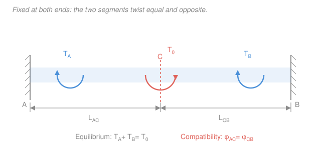

# Mechanics of Materials · Lesson 2.2: Power transmission and indeterminate shafts

> ⏱ ~15 min · Module 2: Torsion and bending · Builds on: [2.1 Torsion of circular shafts](02-01-torsion-circular-shafts.md), [1.4 Statically indeterminate axial members](01-04-statically-indeterminate-axial.md) · Unlocks: [4.3 Combined loadings](04-03-combined-loadings.md)

## Why this matters

Every shaft that carries power — a motor spinning a pump, a car's driveline, a wind-turbine main shaft — is rated in kilowatts and RPM, not in newton-metres. The engineer's first job is to convert that rating into a torque, then size the shaft so it survives. That's the whole game of **power transmission**: two lines of algebra to get $T$, then last lesson's torsion formula to pick a diameter. The second half of this lesson handles shafts held at *both* ends — one more equation than equilibrium provides, cracked with the exact compatibility trick you used for axial bars in [1.4](01-04-statically-indeterminate-axial.md), now written in twist instead of stretch.

## The idea

A rotating shaft delivers power the way a wrench delivers work: torque times how fast it turns. Push harder (more torque) or spin faster (more speed) and you move more power. So if you know the power and the speed, the torque is forced — divide one by the other. Once you have the torque, sizing is just [2.1](02-01-torsion-circular-shafts.md): the shear stress at the surface must stay under what the material allows, and that sets a minimum diameter.

The indeterminate case has the same flavour as a tug-of-war anchored to two walls. Twist a shaft that's clamped at both ends, and *both* walls push back — but equilibrium (torques must balance) is one equation with two unknown reactions. The missing equation is geometric: the shaft is continuous and its ends can't rotate, so the twist you build up going from one wall to the applied torque must exactly cancel the twist coming back from the other wall. Stiffer segments (short, fat, high $GJ$) resist more, so they grab a bigger share of the reaction — just like a stiffer spring in a parallel pair carries more load.

## The formal version

**Power transmitted by a rotating shaft.** A shaft carrying torque $T$ (in $\mathrm{N\cdot m}$) while rotating at angular speed $\omega$ (in $\mathrm{rad/s}$) transmits power

$$P = T\,\omega, \qquad \omega = 2\pi f,$$

where $P$ is in watts ($\mathrm{W}=\mathrm{N\cdot m/s}$) and $f$ is the rotational frequency in revolutions per second (rev/s $=\mathrm{Hz}$). *In words: power is torque times spin rate; each revolution is $2\pi$ radians.* Engineers usually quote speed in **rev/min** (rpm), call it $n$; since $\omega = 2\pi n/60$,

$$P = \frac{2\pi n\,T}{60} \qquad\Longleftrightarrow\qquad T = \frac{60\,P}{2\pi n}.$$

*In words: to get the torque, divide power by speed (in the right units).*

**Sizing for allowable stress.** From [2.1](02-01-torsion-circular-shafts.md), the peak shear stress in a circular shaft is $\tau_{\max} = Tc/J$, at the outer radius $c$. Hold it below the allowable stress $\tau_{\text{allow}}$:

$$\tau_{\max} = \frac{T\,c}{J} \le \tau_{\text{allow}} \qquad\Longrightarrow\qquad \frac{J}{c} \ge \frac{T}{\tau_{\text{allow}}}.$$

The group $J/c$ is the **polar section modulus** — the shaft's geometric capacity to carry torque. For a solid shaft, $J = \pi d^4/32$ and $c = d/2$, so

$$\frac{J}{c} = \frac{\pi d^3}{16} \ge \frac{T}{\tau_{\text{allow}}} \qquad\Longrightarrow\qquad d \ge \left(\frac{16\,T}{\pi\,\tau_{\text{allow}}}\right)^{1/3}.$$

*In words: the required diameter grows as the cube root of the torque.* (Watch units: with $T$ in $\mathrm{N\cdot m}$ and $\tau$ in $\mathrm{Pa}=\mathrm{N/m^2}$, $d$ comes out in metres.)

**Statically indeterminate shafts.** A shaft fixed at both ends (or stepped with a fixed far end) has *two* unknown reaction torques but only *one* equilibrium equation. This is the **force method** from [1.4](01-04-statically-indeterminate-axial.md), transposed to torsion. Three ingredients:

1. **Equilibrium** — reaction torques and applied torque balance. For an interior torque $T_0$ between fixed ends $A$ and $B$: $T_A + T_B = T_0$.
2. **Torque–twist law** — each segment twists by $\phi = \dfrac{T\,L}{G\,J}$ (from [2.1](02-01-torsion-circular-shafts.md)), where $G$ is the shear modulus and $L$, $J$ the segment length and polar moment.
3. **Compatibility** — the ends can't rotate, so the total twist across the shaft is zero. Segment $AC$ twists one way, $CB$ the other, and they must match: $\phi_{AC} = \phi_{CB}$.

For a *uniform* shaft ($GJ$ constant) with an interior torque, compatibility $\dfrac{T_A L_{AC}}{GJ} = \dfrac{T_B L_{CB}}{GJ}$ reduces to $T_A L_{AC} = T_B L_{CB}$. Solving with equilibrium:

$$T_A = T_0\,\frac{L_{CB}}{L_{AC}+L_{CB}}, \qquad T_B = T_0\,\frac{L_{AC}}{L_{AC}+L_{CB}}.$$

*In words: each end's reaction is proportional to its torsional stiffness $GJ/L$ — the shorter (stiffer) segment carries the larger reaction.*

## Picture

## Worked examples

**Example 1 (power shaft sizing — the everyday calc).** A motor delivers $P = 50\ \mathrm{kW}$ to a solid steel shaft turning at $n = 1500\ \mathrm{rpm}$. The allowable shear stress is $\tau_{\text{allow}} = 60\ \mathrm{MPa}$. Find the minimum diameter.

First the torque. $\omega = 2\pi n/60 = 2\pi(1500)/60 = 157.1\ \mathrm{rad/s}$, so

$$T = \frac{P}{\omega} = \frac{50\,000}{157.1} = 318.3\ \mathrm{N\cdot m}.$$

Now size it. Require $\dfrac{J}{c} = \dfrac{\pi d^3}{16} \ge \dfrac{T}{\tau_{\text{allow}}} = \dfrac{318.3}{60\times10^6} = 5.305\times10^{-6}\ \mathrm{m^3}$, so

$$d \ge \left(\frac{16\,T}{\pi\,\tau_{\text{allow}}}\right)^{1/3} = \left(\frac{16(318.3)}{\pi(60\times10^6)}\right)^{1/3} = (2.702\times10^{-5})^{1/3} = 0.0300\ \mathrm{m} = 30.0\ \mathrm{mm}.$$

*Check.* Units: $\big(\mathrm{N\cdot m}/(\mathrm{N/m^2})\big)^{1/3} = (\mathrm{m^3})^{1/3} = \mathrm{m}$ ✓. Pick the next standard size *up* (say 32 mm) — rounding down would exceed the allowable stress. A 30 mm steel shaft moving 50 kW is physically sensible (about the diameter of a broom handle for a decent electric motor). ✓

**Example 2 (fixed–fixed shaft — the indeterminate calc).** A uniform steel shaft is fixed at walls $A$ and $B$, $2\ \mathrm{m}$ apart. A torque $T_0 = 200\ \mathrm{N\cdot m}$ is applied at point $C$, located $L_{AC} = 0.5\ \mathrm{m}$ from $A$ (so $L_{CB} = 1.5\ \mathrm{m}$). Find the reaction torques.

**Equilibrium:** $T_A + T_B = 200$.
**Compatibility:** uniform shaft, so $T_A L_{AC} = T_B L_{CB}$, i.e. $0.5\,T_A = 1.5\,T_B \Rightarrow T_A = 3\,T_B$.

Substitute: $3T_B + T_B = 200 \Rightarrow T_B = 50\ \mathrm{N\cdot m}$, $T_A = 150\ \mathrm{N\cdot m}$.

*Check.* $T_A + T_B = 200$ ✓, and $T_A L_{AC} = 150(0.5) = 75 = 50(1.5) = T_B L_{CB}$ ✓ — both segments twist the same $75/(GJ)$, as they must. The near wall (short, stiff $0.5\ \mathrm{m}$ segment) takes $3\times$ the reaction of the far wall. That also tells you *where it fails*: segment $AC$ carries the larger internal torque $150\ \mathrm{N\cdot m}$, so it's the more highly stressed half. With a 30 mm shaft, $\tau_{AC} = T_A/(J/c) = 150/(5.30\times10^{-6}) = 28.3\ \mathrm{MPa}$. ✓

## Watch out

- **You might think you plug RPM straight into $P = T\omega$.** But $\omega$ must be in $\mathrm{rad/s}$, not rev/min. Convert first: $\omega = 2\pi n/60$. Forgetting the $2\pi$ (or the $/60$) is the single most common power-shaft error — it throws the torque off by a factor of $\sim 9.55$ or $\sim 60$.
- **You might halve $d$ to get the radius before cubing.** The sizing formula $d \ge (16T/\pi\tau)^{1/3}$ already solves for the *diameter* $d$, using $J/c = \pi d^3/16$. If you instead work with $J/c = \pi c^3/2$ you get the *radius* $c$ — both are correct, but don't mix them.
- **You might think the two segments of a fixed–fixed shaft carry equal torque.** They carry $T_A$ and $T_B$, which are equal *only* if the shaft is symmetric ($L_{AC} = L_{CB}$ and same $J$). Off-centre, the stiffer (shorter or fatter) segment grabs more. Compatibility, not a 50/50 guess, sets the split.

## One-liner

> Turn kilowatts-and-RPM into a torque with $T = P/\omega$, then size with $\pi d^3/16 \ge T/\tau_{\text{allow}}$; clamp both ends and you add one equation — twists must match — splitting the reaction by stiffness $GJ/L$.

## Problems

**P1 (🟢)** A solid shaft transmits $P = 10\ \mathrm{kW}$ at $n = 300\ \mathrm{rpm}$. If the allowable shear stress is $\tau_{\text{allow}} = 50\ \mathrm{MPa}$, find the required torque and the minimum diameter.

**P2 (🟡)** A uniform shaft is fixed at both ends, total length $3\ \mathrm{m}$. A torque $T_0 = 600\ \mathrm{N\cdot m}$ is applied at a point $1\ \mathrm{m}$ from the left end $A$. Find the reaction torques $T_A$ and $T_B$, and say which segment is more highly stressed.

**P3 (🔴)** A *stepped* shaft is fixed at both ends. Segment $AC$ (near $A$) is $0.5\ \mathrm{m}$ long with diameter $50\ \mathrm{mm}$; segment $CB$ (near $B$) is $0.5\ \mathrm{m}$ long with diameter $25\ \mathrm{mm}$. A torque $T_0 = 340\ \mathrm{N\cdot m}$ is applied at the step $C$. Find the reaction torques. (Hint: equal lengths, but different $J$ — split by stiffness $GJ/L$.)

Solutions

**P1** Torque from power: $\omega = 2\pi n/60 = 2\pi(300)/60 = 31.42\ \mathrm{rad/s}$, so

$$T = \frac{P}{\omega} = \frac{10\,000}{31.42} = 318.3\ \mathrm{N\cdot m}.$$

Minimum diameter:

$$d \ge \left(\frac{16T}{\pi\tau_{\text{allow}}}\right)^{1/3} = \left(\frac{16(318.3)}{\pi(50\times10^6)}\right)^{1/3} = (3.242\times10^{-5})^{1/3} = 0.0319\ \mathrm{m} = 31.9\ \mathrm{mm}.$$

*Check.* Same torque as Example 1 but a lower allowable stress (50 vs 60 MPa) forces a fatter shaft (31.9 vs 30.0 mm) — correct direction, and only slightly larger because $d\propto \tau^{-1/3}$. Units resolve to metres as before. ✓

**P2** **Equilibrium:** $T_A + T_B = 600$. **Compatibility** (uniform shaft): $T_A L_{AC} = T_B L_{CB}$ with $L_{AC}=1$, $L_{CB}=2$, so $T_A = 2T_B$. Then $2T_B + T_B = 600 \Rightarrow T_B = 200\ \mathrm{N\cdot m}$, $T_A = 400\ \mathrm{N\cdot m}$.

Segment $AC$ carries the larger internal torque ($400\ \mathrm{N\cdot m}$) on the same cross-section, so it sees the higher shear stress and governs the design.

*Check.* $T_A + T_B = 600$ ✓; $T_A L_{AC} = 400(1) = 400 = 200(2) = T_B L_{CB}$ ✓. The shorter left segment (stiffer) takes twice the reaction — consistent with the stiffness rule. ✓

**P3** Equal lengths and $G$, so stiffness $GJ/L$ scales with $J\propto d^4$. Diameter ratio $50/25 = 2$, so $J_{AC}/J_{CB} = 2^4 = 16$. The reaction splits in proportion to stiffness:

$$T_A = T_0\,\frac{J_{AC}}{J_{AC}+J_{CB}} = 340\cdot\frac{16}{17} = 320\ \mathrm{N\cdot m}, \qquad T_B = 340\cdot\frac{1}{17} = 20\ \mathrm{N\cdot m}.$$

*Check.* Set up compatibility from scratch: $\phi_{AC} = \phi_{CB} \Rightarrow \dfrac{T_A L}{G J_{AC}} = \dfrac{T_B L}{G J_{CB}} \Rightarrow T_A = T_B\,\dfrac{J_{AC}}{J_{CB}} = 16\,T_B$. With $T_A + T_B = 340$: $16T_B + T_B = 340 \Rightarrow T_B = 20$, $T_A = 320$ ✓. The fat segment is $16\times$ stiffer and hogs almost all the reaction. (Aside: the thin segment isn't off the hook — with its tiny $J$ it still reaches $\tau = T_B c/J = 6.5\ \mathrm{MPa}$, versus $13.0\ \mathrm{MPa}$ in the fat one, so here the fat segment governs.) ✓

## Flashback

**From Lesson 2.1 (Torsion of circular shafts):** A solid steel shaft ($G = 77\ \mathrm{GPa}$) has diameter $40\ \mathrm{mm}$ and length $1.5\ \mathrm{m}$, and carries a torque of $500\ \mathrm{N\cdot m}$. Find the maximum shear stress and the angle of twist (in degrees).

Solution

Polar moment: $J = \dfrac{\pi d^4}{32} = \dfrac{\pi(0.04)^4}{32} = 2.513\times10^{-7}\ \mathrm{m^4}$, with $c = d/2 = 0.02\ \mathrm{m}$.

Maximum shear stress:

$$\tau_{\max} = \frac{T c}{J} = \frac{500(0.02)}{2.513\times10^{-7}} = 3.98\times10^{7}\ \mathrm{Pa} = 39.8\ \mathrm{MPa}.$$

Angle of twist:

$$\phi = \frac{TL}{GJ} = \frac{500(1.5)}{(77\times10^9)(2.513\times10^{-7})} = 0.0388\ \mathrm{rad} = 0.0388\times\frac{180}{\pi} = 2.22^\circ.$$

*Check.* Units: $\tau = \mathrm{(N\cdot m)(m)/m^4 = N/m^2}$ ✓; $\phi = \mathrm{(N\cdot m)(m)/[(N/m^2)(m^4)]}$, dimensionless (radians) ✓. Both numbers are modest — well under steel's $\sim$250 MPa yield and a fraction of a degree per metre — so a 40 mm shaft is comfortable at this torque. ✓

## Connections

- **Backward:** the sizing half is [2.1](02-01-torsion-circular-shafts.md)'s torsion formula $\tau = Tc/J$ solved for geometry; the indeterminate half is the *same* three-step force method (equilibrium + member law + compatibility) you built for axial bars in [1.4](01-04-statically-indeterminate-axial.md) — swap $\delta = PL/AE$ for $\phi = TL/GJ$ and stiffness $AE/L$ for $GJ/L$, and every step transfers.
- **Forward:** [4.3 Combined loadings](04-03-combined-loadings.md) puts a torque *and* a bending moment on the same shaft (a real drive shaft does both at once), superposing the torsional shear from this lesson with bending stress to find the critical point — the setup for the course's final boss problem.
- **Sideways:** the compatibility idea returns a third time in [3.3 Statically indeterminate beams](03-03-statically-indeterminate-beams.md), where a beam's *deflection* (not twist or stretch) plays the role of the geometric constraint. Same method, three different member laws — recognizing that pattern is most of what "indeterminate" mastery is.
