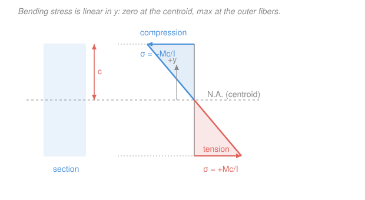

# Mechanics of Materials · Lesson 2.4: The flexure formula

> ⏱ ~15 min · Module 2: Torsion and bending · Builds on: [2.3 Shear & moment diagrams](02-03-shear-moment-diagrams.md), [`statics` 4.3 second moment of area](../../statics/lessons/04-03-second-moment-of-area-parallel-axis.md) · Unlocks: [2.5 transverse shear](02-05-transverse-shear-stress.md), [4.3 combined loadings](04-03-combined-loadings.md), Module 3 (deflection)

## Why this matters

In [2.3](02-03-shear-moment-diagrams.md) you learned to read the internal bending moment $M$ at every point of a beam. But a moment in newton-metres is not something a material can "feel" — steel doesn't yield at a moment, it yields at a *stress*, in MPa. The flexure formula is the converter: it turns the moment $M$ at a cross-section into the actual push-and-pull stress on every fibre of that section. It is the single most-used equation in structural design — every floor joist, bridge girder, and aircraft spar is sized by it. Master it and "is this beam strong enough?" becomes a one-line calculation.

## The idea

Bend a rubber eraser and watch the grid lines. The top surface stretches, the bottom surface bunches up, and somewhere through the middle there's a layer that does neither — it keeps its original length. That neutral layer is the **neutral axis (NA)**.

Now the key experimental fact, true for slender beams: **plane cross-sections stay plane** as the beam bends — a flat slice just *rotates* about the NA, it doesn't warp. Picture two neighbouring slices tilting toward each other like the pages of a slightly opened book. A fibre near the top gets pulled a lot; a fibre halfway up gets pulled half as much; a fibre at the NA doesn't move. So the **strain grows in exact proportion to the distance $y$ from the neutral axis** — linearly. And since the material is elastic, stress follows strain ($\sigma = E\varepsilon$), so **stress is linear in $y$ too**: zero at the NA, maximum tension on one outer face, maximum compression on the other. That triangle of stress is the whole picture. Everything else is bookkeeping to find the slope of the triangle.

Two questions remain, and geometry answers both. *Where is the NA?* It must pass through the **centroid** of the cross-section — that's the only height where the tension pulls above and compression pushes below balance out to zero net axial force (pure bending has no net push). *How steep is the triangle?* That's set by the moment $M$ and by how the area is spread out, captured by the second moment of area $I$ from [statics 4.3](../../statics/lessons/04-03-second-moment-of-area-parallel-axis.md).

## The formal version

For a beam in **pure bending** (moment $M$ about the horizontal centroidal axis, material linear-elastic), the normal stress on a fibre a signed distance $y$ (m, measured **up** from the neutral axis) is

$$\boxed{\;\sigma = -\frac{M\,y}{I}\;}$$

where

- $\sigma$ — bending (normal) stress on the fibre, in pascals (Pa) or MPa. $1\ \mathrm{MPa} = 1\ \mathrm{N/mm^2}$.
- $M$ — internal bending moment at that section (N·m), positive = **sagging** (concave up).
- $y$ — distance from the neutral axis to the fibre (m), positive upward.
- $I$ — second moment of area of the cross-section about the neutral (centroidal) axis, in $\mathrm{m^4}$ (or $\mathrm{mm^4}$).

*In words: stress is proportional to the moment and to how far the fibre sits from the neutral axis, divided by how well the section resists bending.* The minus sign is a sign-convention choice: with a positive sagging $M$, the **top** fibres ($y>0$) go into **compression** ($\sigma<0$) and the **bottom** fibres ($y<0$) go into **tension** ($\sigma>0$) — exactly what the bent eraser showed. If you keep track of tension/compression by physical reasoning, you can compute magnitudes with $|\sigma| = M|y|/I$ and drop the sign.

**The extreme fibre.** The stress is biggest where $|y|$ is biggest — at the fibre farthest from the NA, a distance $c$ (m) away. So

$$\sigma_{\max} = \frac{M c}{I} = \frac{M}{S}, \qquad S \equiv \frac{I}{c}.$$

*In words: the worst stress is the moment divided by the section modulus.* The **section modulus** $S$ ($\mathrm{m^3}$ or $\mathrm{mm^3}$) rolls the two geometry facts ($I$ and $c$) into one number that says, by itself, how much bending a section can take. Bigger $S$, stronger beam.

**The geometry input $I$.** From [statics 4.3](../../statics/lessons/04-03-second-moment-of-area-parallel-axis.md), for bending about the horizontal centroidal axis:

$$I_{\text{rect}} = \frac{b h^3}{12}, \qquad I_{\text{circle}} = \frac{\pi d^4}{64},$$

with $b$ the width, $h$ the height (in the bending direction), $d$ the diameter. For a rectangle this also gives the handy $S_{\text{rect}} = I/c = (bh^3/12)/(h/2) = bh^2/6$.

The cubic $h^3$ is the headline: **depth matters enormously**. Double a beam's depth and $I$ jumps by $2^3 = 8\times$, so the same section carries 8 times the moment at a given stress (well, $4\times$ once you account for $c$ doubling too, via $S \propto bh^2$). That is *why* joists stand tall and thin, and why an **I-beam** shoves its material — the flanges — as far from the NA as possible: a fibre at large $y$ contributes to $I$ as $y^2$, so metal parked out at the extremes is metal working hardest. Metal near the NA barely earns its weight, which is why the middle is thinned to a web. For a **built-up or flanged section**, you get $I$ by the **parallel-axis theorem** — sum each piece's own $\bar I$ plus $A d^2$ (area times distance from its centroid to the section's NA), straight from statics 4.3.

**Design use.** Turn it around. If the largest moment anywhere in the beam is $M_{\max}$ (read off the moment diagram from [2.3](02-03-shear-moment-diagrams.md)) and the material may be worked up to an allowable stress $\sigma_{\text{allow}}$, then you need

$$\sigma_{\max} = \frac{M_{\max}}{S} \le \sigma_{\text{allow}} \quad\Longrightarrow\quad S \ge \frac{M_{\max}}{\sigma_{\text{allow}}}.$$

*In words: compute the required section modulus, then pick any section whose $S$ meets or beats it.* This is the actual workflow behind steel-beam selection tables.

## Picture

## Worked examples

**Example 1 (mechanical — read off the stress).** A rectangular beam, width $b = 50\ \mathrm{mm}$, depth $h = 100\ \mathrm{mm}$, carries an internal moment $M = 8\ \mathrm{kN\cdot m}$ at some section. Find the maximum bending stress.

The neutral axis is at mid-depth (rectangle centroid), so $c = h/2 = 50\ \mathrm{mm}$. The second moment of area:

$$I = \frac{b h^3}{12} = \frac{(50)(100)^3}{12} = \frac{50 \times 10^6}{12} = 4.17\times 10^6\ \mathrm{mm^4}.$$

Convert the moment to consistent units: $M = 8\ \mathrm{kN\cdot m} = 8\times 10^3\ \mathrm{N}\cdot(10^3\ \mathrm{mm}) = 8\times 10^6\ \mathrm{N\cdot mm}$. Then

$$\sigma_{\max} = \frac{M c}{I} = \frac{(8\times 10^6)(50)}{4.17\times 10^6} = \frac{4.0\times 10^8}{4.17\times 10^6} = 96\ \mathrm{N/mm^2} = 96\ \mathrm{MPa}.$$

Top fibres are in compression at $-96$ MPa, bottom in tension at $+96$ MPa (for a sagging $M$). *Check.* Units: $\mathrm{(N\cdot mm)(mm)/mm^4 = N/mm^2 = MPa}$ ✓. Sanity: 96 MPa sits comfortably below a structural-steel yield of $\sigma_Y \approx 250$ MPa, so this section survives — with a factor of safety of about $250/96 \approx 2.6$. (Via the section modulus: $S = bh^2/6 = (50)(100)^2/6 = 8.33\times 10^4\ \mathrm{mm^3}$, and $\sigma_{\max} = M/S = 8\times 10^6 / 8.33\times 10^4 = 96$ MPa — same answer, one step.)

**Example 2 (why you'd care — size a beam).** A simply supported beam spans $L = 3\ \mathrm{m}$ and carries a single central point load $P = 20\ \mathrm{kN}$. For this loading the moment diagram peaks at midspan with $M_{\max} = PL/4$ (a standard result you can rederive from [2.3](02-03-shear-moment-diagrams.md): reactions $P/2$ each, moment at centre $= (P/2)(L/2)$). The allowable stress is $\sigma_{\text{allow}} = 150\ \mathrm{MPa}$. Find the required section modulus, and pick a rectangular section $50\ \mathrm{mm}$ wide.

Peak moment:

$$M_{\max} = \frac{PL}{4} = \frac{(20\times 10^3)(3)}{4} = 15\times 10^3\ \mathrm{N\cdot m} = 15\times 10^6\ \mathrm{N\cdot mm}.$$

Required section modulus:

$$S \ge \frac{M_{\max}}{\sigma_{\text{allow}}} = \frac{15\times 10^6\ \mathrm{N\cdot mm}}{150\ \mathrm{N/mm^2}} = 1.0\times 10^5\ \mathrm{mm^3}.$$

For a rectangle, $S = bh^2/6$. With $b = 50\ \mathrm{mm}$, solve for the depth:

$$h \ge \sqrt{\frac{6 S}{b}} = \sqrt{\frac{6(1.0\times 10^5)}{50}} = \sqrt{1.2\times 10^4} = 109.5\ \mathrm{mm}.$$

Round **up** to a buildable size, $h = 110\ \mathrm{mm}$. *Check.* The chosen section delivers $S = bh^2/6 = (50)(110)^2/6 = 1.008\times 10^5\ \mathrm{mm^3} \ge 1.0\times 10^5$ ✓, so $\sigma_{\max} = M_{\max}/S = 15\times 10^6 / 1.008\times 10^5 = 149\ \mathrm{MPa} \le 150\ \mathrm{MPa}$ ✓. Rounding *down* to 109 mm would have failed the stress check — always round a required depth up.

## Watch out

- **You might think the neutral axis sits wherever you like, e.g. the geometric middle of a bounding box.** It sits at the **centroid** of the actual cross-sectional area. For a symmetric shape (rectangle, circle, I-beam) that *is* the middle, so $c$ is the same top and bottom. But for an **unsymmetric** section (a T, a channel), the centroid is off-centre, $c$ differs on the two faces, and the larger $c$ governs — the tension and compression peaks are unequal. Find the centroid first ([statics 3.2](../../statics/lessons/03-02-centroids-of-areas.md)), then $I$ about it.
- **You might use $I$ about the wrong axis.** $I$ must be taken about the **neutral (centroidal bending) axis**, and orientation matters: a $50\times100$ rectangle bent about its strong axis uses $I = bh^3/12$ with $h=100$; lay the same beam flat and $h=50$, cutting $I$ by fourfold. Always put the depth $h$ in the direction the beam bends.
- **You might mix millimetres and metres mid-formula.** $I$ in $\mathrm{mm^4}$ demands $M$ in $\mathrm{N\cdot mm}$ and $y$ in $\mathrm{mm}$ to land on $\mathrm{N/mm^2 = MPa}$. A stray factor of $10^3$ between $\mathrm{kN\cdot m}$ and $\mathrm{N\cdot mm}$ is the single most common flexure error — write the units on every line.

## One-liner

> Bending turns a moment into a triangle of stress that is zero at the centroidal neutral axis and peaks at the extreme fibre: $\sigma_{\max} = Mc/I = M/S$, so strength lives in depth ($I \propto h^3$).

## Problems

**P1 (🟢)** A solid circular shaft of diameter $d = 60\ \mathrm{mm}$ carries a bending moment $M = 2\ \mathrm{kN\cdot m}$. Compute $I$, the section modulus $S$, and the maximum bending stress $\sigma_{\max}$.

**P2 (🟡)** A simply supported timber beam spans $L = 4\ \mathrm{m}$ under a uniform load $w = 3\ \mathrm{kN/m}$ (so $M_{\max} = wL^2/8$). The allowable stress is $\sigma_{\text{allow}} = 10\ \mathrm{MPa}$. If the section is rectangular with depth $h$ twice the width $b$ ($h = 2b$), find the smallest $b$ (round the width up to the next whole millimetre).

**P3 (🔴)** Two identical rectangular planks, each $b = 100\ \mathrm{mm}$ wide and $t = 40\ \mathrm{mm}$ thick, must carry the same moment. Compare the maximum bending stress for (a) the two planks stacked and bending as *separate* boards that slide freely against each other, versus (b) the two glued into a single solid $100 \times 80\ \mathrm{mm}$ section. By what factor does gluing reduce the peak stress? (This previews why the glue-line shear of [2.5](02-05-transverse-shear-stress.md) matters.)

Solutions

**P1** For a circle, $c = d/2 = 30\ \mathrm{mm}$ and

$$I = \frac{\pi d^4}{64} = \frac{\pi (60)^4}{64} = \frac{\pi (1.296\times 10^7)}{64} = 6.36\times 10^5\ \mathrm{mm^4}.$$

Section modulus:

$$S = \frac{I}{c} = \frac{6.36\times 10^5}{30} = 2.12\times 10^4\ \mathrm{mm^3}.$$

With $M = 2\ \mathrm{kN\cdot m} = 2\times 10^6\ \mathrm{N\cdot mm}$:

$$\sigma_{\max} = \frac{M}{S} = \frac{2\times 10^6}{2.12\times 10^4} = 94\ \mathrm{MPa}.$$

*Check.* Units $\mathrm{(N\cdot mm)/mm^3 = N/mm^2 = MPa}$ ✓. (For a circle you can also use the closed form $S = \pi d^3/32 = \pi(60)^3/32 = 2.12\times 10^4\ \mathrm{mm^3}$ — matches.)

**P2** Peak moment:

$$M_{\max} = \frac{wL^2}{8} = \frac{(3\times 10^3)(4)^2}{8} = \frac{(3\times 10^3)(16)}{8} = 6\times 10^3\ \mathrm{N\cdot m} = 6\times 10^6\ \mathrm{N\cdot mm}.$$

Required section modulus:

$$S \ge \frac{M_{\max}}{\sigma_{\text{allow}}} = \frac{6\times 10^6}{10} = 6.0\times 10^5\ \mathrm{mm^3}.$$

For a rectangle with $h = 2b$, $S = bh^2/6 = b(2b)^2/6 = 4b^3/6 = 2b^3/3$. Set $\ge$ required:

$$\frac{2b^3}{3} \ge 6.0\times 10^5 \;\Longrightarrow\; b^3 \ge 9.0\times 10^5 \;\Longrightarrow\; b \ge 96.5\ \mathrm{mm}.$$

Round up: $b = 97\ \mathrm{mm}$, giving $h = 194\ \mathrm{mm}$. *Check.* $S = 2(97)^3/3 = 2(9.13\times 10^5)/3 = 6.08\times 10^5\ \mathrm{mm^3} \ge 6.0\times 10^5$ ✓, so $\sigma_{\max} = 6\times 10^6/6.08\times 10^5 = 9.9\ \mathrm{MPa} \le 10$ ✓. Timber-scale stress and a chunky deep section — sensible for wood.

**P3** Same moment $M$ in both; compare $S$.

(a) **Separate planks.** Each board bends about *its own* centroid and carries half the total moment, but the cleaner way: each plank has $S_1 = bt^2/6 = (100)(40)^2/6 = 2.67\times 10^4\ \mathrm{mm^3}$, and the two share the load, so together $S_{\text{sep}} = 2S_1 = 5.33\times 10^4\ \mathrm{mm^3}$.

(b) **Glued solid**, $b = 100$, $h = 80$:

$$S_{\text{solid}} = \frac{bh^2}{6} = \frac{(100)(80)^2}{6} = \frac{6.4\times 10^5}{6} = 1.067\times 10^5\ \mathrm{mm^3}.$$

Since $\sigma_{\max} = M/S$, the stress ratio is the inverse of the $S$ ratio:

$$\frac{\sigma_{\text{sep}}}{\sigma_{\text{solid}}} = \frac{S_{\text{solid}}}{S_{\text{sep}}} = \frac{1.067\times 10^5}{5.33\times 10^4} = 2.0.$$

*Gluing halves the peak stress* — a factor of **2**. *Check / intuition.* Doubling the depth of a solid rectangle multiplies $S = bh^2/6$ by $2^2 = 4$; but the separate stack already had twice the section modulus of one plank, so the net gain from gluing is $4/2 = 2$ ✓. The glue is what forces the two boards to *act as one deep beam* instead of two shallow ones — but that only works if the joint can carry the sliding (shear) between them, which is exactly the transverse-shear problem of [2.5](02-05-transverse-shear-stress.md).

## Flashback

**From Lesson 2.3 (Shear & moment diagrams):** A simply supported beam spans $L = 6\ \mathrm{m}$ and carries a uniform distributed load $w = 4\ \mathrm{kN/m}$ over its full length. Find the support reactions, the location where the shear force $V$ is zero, and the maximum bending moment $M_{\max}$.

Solution

By symmetry each support carries half the total load $wL$:

$$R = \frac{wL}{2} = \frac{(4)(6)}{2} = 12\ \mathrm{kN}\ \text{(each end)}.$$

Measuring $x$ from the left support, the shear is the left reaction minus the load shed so far:

$$V(x) = R - wx = 12 - 4x \ (\mathrm{kN}).$$

$V = 0$ at $x = R/w = 12/4 = 3\ \mathrm{m}$ — the midspan, as symmetry demands. Since $dM/dx = V$, the moment peaks where $V$ crosses zero. Integrating (area under the shear diagram from $0$ to $3$, a triangle of base 3 m and height 12 kN):

$$M_{\max} = \tfrac12 (3)(12) = 18\ \mathrm{kN\cdot m},$$

matching the standard UDL result $M_{\max} = wL^2/8 = (4)(6)^2/8 = 18\ \mathrm{kN\cdot m}$. *Check.* Units: $\mathrm{(kN/m)(m^2) = kN\cdot m}$ ✓. This $M_{\max}$ is exactly the number you would feed into the flexure formula to size the beam. ✓

## Connections

- **Backward:** the geometry input $I$ (and the parallel-axis theorem for flanged sections) is straight from [statics 4.3](../../statics/lessons/04-03-second-moment-of-area-parallel-axis.md), and locating the neutral axis at the centroid uses [statics 3.2](../../statics/lessons/03-02-centroids-of-areas.md). The moment $M$ itself comes from the diagrams of [2.3](02-03-shear-moment-diagrams.md) — the flexure formula is the bridge from "internal moment" to "actual stress."
- **Forward:** [2.5 transverse shear](02-05-transverse-shear-stress.md) computes the *other* stress bending induces — the shear that holds the fibres together (and glue-lines closed). [4.3 combined loadings](04-03-combined-loadings.md) superposes this bending stress with axial and torsional stresses at a critical point, and Module 3 integrates the curvature $M/EI$ to get how far the beam actually deflects.
- **Sideways (materials science):** the flexure formula tells you the stress a beam *reaches*; whether the material *survives* it is the domain of [`materials-science` 4.1 elastic behavior](../../materials-science/lessons/04-01-elastic-behavior-stress-strain.md) and [4.4 fracture & fatigue](../../materials-science/lessons/04-04-failure-fracture-fatigue-creep.md). That course explains *why* metals yield at the atomic scale (dislocations gliding); this course computes the $\sigma$ that reaches the yield line $\sigma_Y$.
