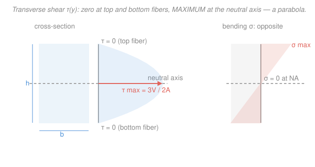

# Mechanics of Materials · Lesson 2.5: Transverse shear stress

> ⏱ ~15 min · Module 2: Torsion & Bending · Builds on: [2.4 Flexure formula](02-04-flexure-formula.md), [2.3 Shear & moment diagrams](02-03-shear-moment-diagrams.md), [1.1 Normal & shear stress](01-01-normal-shear-stress.md) · Unlocks: [4.3 Combined loadings](04-03-combined-loadings.md), Boss problem 2

## Why this matters

The flexure formula in [2.4](02-04-flexure-formula.md) gave you the *bending* stress — the pull-and-squeeze along the beam's length. But a loaded beam also carries a **shear force** $V$ (the $V$ you plotted in [2.3](02-03-shear-moment-diagrams.md)), and that force has to travel through the material as **shear stress**. This is why a stack of loose planks slides into a staircase when you stand on it, why a wooden beam splits *along the grain* near its supports, and why glued or nailed built-up beams pop their joints. Bending stress tells you if the beam breaks by snapping; transverse shear tells you if it breaks by *sliding apart*.

## The idea

Picture a beam as a deck of cards laid flat and supported at both ends. Push down in the middle: each card bends, but they also **slide past one another** — the top card ends up poking out past the bottom one. Glue the cards together and they can't slide, so the glue has to carry that sliding tendency. That glue force, spread over the area, is a **longitudinal shear stress** running along the beam's length.

Here's the trick: whenever a shear stress acts on one face of a tiny material cube, an equal shear stress must act on the perpendicular face, or the cube would spin — this is **complementary shear** from [1.1](01-01-normal-shear-stress.md). So the longitudinal (card-sliding) shear and the vertical (transverse) shear are *the same number* at any point. That's the key that lets us compute the shear stress on a cross-section by asking how hard the material above a cut is trying to slide forward.

And how hard *is* it trying to slide? It depends on how much bending stress is stacked up above the cut. At the very top fiber there's nothing above to slide, so shear is **zero**. At the neutral axis, the entire top half is pushing forward, so the sliding tendency — and the shear stress — is **greatest**. This is the mirror image of bending stress, which is biggest at the edges and zero at the neutral axis.

## The formal version

**The shear formula.** At a point a height $y$ from the neutral axis, the transverse shear stress is

$$\tau = \frac{VQ}{It},$$

where

- $\tau$ = transverse shear stress at that level (Pa, or N/mm² = MPa),
- $V$ = the internal shear force on the cross-section (N), read from the shear diagram [2.3](02-03-shear-moment-diagrams.md),
- $Q = A'\bar{y}'$ = the **first moment of area** of the portion *above* (or equivalently *below*) the cut, taken about the neutral axis (mm³); $A'$ is that area and $\bar{y}'$ is the distance from the NA to *its* centroid,
- $I$ = second moment of area of the *whole* cross-section about the NA (mm⁴), same $I$ as in the flexure formula (see [statics 04-03](../../statics/lessons/04-03-second-moment-of-area-parallel-axis.md)),
- $t$ = the width of the cross-section *at the level where you want $\tau$* (mm).

*In words: the shear stress at a level is set by how much cross-sectional area sits beyond that level ($Q$) and how narrow the section is there ($t$).*

**Why $Q$ controls the distribution.** $Q = A'\bar{y}'$ is largest at the neutral axis (you're summing the whole top half) and shrinks to **zero at the top and bottom fibers** (no area beyond them). So $\tau$ traces a **parabola: zero at the extreme fibers, maximum at the neutral axis** — exactly opposite to the linear bending stress $\sigma = -My/I$, which is maximum at the edges and zero at the NA. That opposition is the point Boss problem 2 hinges on: at a beam's surface bending dominates and shear vanishes; at its core shear peaks and bending vanishes.

**Handy closed forms.** For a solid **rectangle** of area $A$, carrying the algebra through gives the maximum (at the NA)

$$\tau_{max} = \frac{3V}{2A} = 1.5\,\tau_{avg}, \qquad \tau_{avg} \equiv \frac{V}{A}.$$

*In words: the peak shear in a rectangular beam is 50% higher than the crude "force over area" average.* For a solid **circle**, $\tau_{max} = \dfrac{4V}{3A}$.

**Shear flow.** For a built-up beam (boards nailed or glued together), the connectors must carry the longitudinal shear crossing the joint. Per unit length of beam, that force is the **shear flow**

$$q = \frac{VQ}{It} \cdot t = \frac{VQ}{I} \qquad (\text{N/mm}),$$

where now $Q$ is the first moment of the area *attached by that joint* (the piece the fasteners hold on). *In words: $q$ is the sliding force per millimetre of length the fasteners must resist.* A single row of fasteners each good for $F$ (N) must be spaced no farther than

$$s = \frac{F}{q}.$$

## Picture

## Worked examples

**Example 1 (rectangular beam — two routes to the same number).** A rectangular beam has width $b = 50\ \mathrm{mm}$, height $h = 100\ \mathrm{mm}$, and carries a shear force $V = 20\ \mathrm{kN}$. Find the maximum transverse shear stress.

*Route A — the shortcut.* Area $A = bh = 50 \times 100 = 5000\ \mathrm{mm^2}$, so

$$\tau_{max} = \frac{3V}{2A} = \frac{3(20{,}000\ \mathrm{N})}{2(5000\ \mathrm{mm^2})} = \frac{60{,}000}{10{,}000} = 6\ \mathrm{MPa}.$$

*Route B — first principles, $\tau = VQ/It$ at the neutral axis.* The area above the NA is the top half: $A' = b\,(h/2) = 50 \times 50 = 2500\ \mathrm{mm^2}$, with its centroid at $\bar{y}' = h/4 = 25\ \mathrm{mm}$ above the NA, so

$$Q = A'\bar{y}' = 2500 \times 25 = 62{,}500\ \mathrm{mm^3}.$$

The section's second moment is $I = \dfrac{bh^3}{12} = \dfrac{50 \times 100^3}{12} = 4.167\times10^{6}\ \mathrm{mm^4}$, and the width at the NA is $t = b = 50\ \mathrm{mm}$. Then

$$\tau = \frac{VQ}{It} = \frac{20{,}000 \times 62{,}500}{(4.167\times10^{6})(50)} = \frac{1.25\times10^{9}}{2.083\times10^{8}} = 6\ \mathrm{MPa}. \checkmark$$

*Check.* Both routes agree. Units: $\dfrac{\mathrm{N}\cdot\mathrm{mm^3}}{\mathrm{mm^4}\cdot\mathrm{mm}} = \dfrac{\mathrm{N}}{\mathrm{mm^2}} = \mathrm{MPa}$ ✓. And $\tau_{max} = 6\ \mathrm{MPa}$ is exactly $1.5\times$ the average $\tau_{avg} = V/A = 4\ \mathrm{MPa}$, as it must be for a rectangle.

**Example 2 (shear flow — nail spacing in a built-up T-beam).** A T-beam is built from two boards: a **flange** 200 mm wide × 40 mm thick laid on top of a **web** 40 mm wide × 200 mm tall, nailed together at the interface. The beam carries $V = 5\ \mathrm{kN}$, and each nail can safely resist $F = 1200\ \mathrm{N}$. Find the required nail spacing.

*Step 1 — locate the neutral axis (centroid).* Measure $y$ upward from the bottom of the web. Both boards have area $8000\ \mathrm{mm^2}$ (flange $200\times40$, web $40\times200$). Their centroids: web at $100\ \mathrm{mm}$, flange at $200 + 20 = 220\ \mathrm{mm}$. Equal areas, so

$$\bar{y} = \frac{100 + 220}{2} = 160\ \mathrm{mm \ from \ the \ bottom.}$$

*Step 2 — second moment $I$ about the NA* (parallel-axis theorem, [statics 04-03](../../statics/lessons/04-03-second-moment-of-area-parallel-axis.md)). Each board is 60 mm from the NA ($220-160 = 60$, $160-100 = 60$):

$$I = \underbrace{\left[\tfrac{200\cdot40^3}{12} + 8000(60)^2\right]}_{\text{flange} \,=\, 2.987\times10^{7}} + \underbrace{\left[\tfrac{40\cdot200^3}{12} + 8000(60)^2\right]}_{\text{web} \,=\, 5.547\times10^{7}} = 8.533\times10^{7}\ \mathrm{mm^4}.$$

*Step 3 — $Q$ for the joint.* The nails hold the **flange** on, so $Q$ is the first moment of the flange about the NA: $A' = 8000\ \mathrm{mm^2}$ at $\bar{y}' = 60\ \mathrm{mm}$, giving $Q = 8000 \times 60 = 4.8\times10^{5}\ \mathrm{mm^3}$.

*Step 4 — shear flow and spacing.*

$$q = \frac{VQ}{I} = \frac{5000 \times 4.8\times10^{5}}{8.533\times10^{7}} = 28.1\ \mathrm{N/mm}, \qquad s = \frac{F}{q} = \frac{1200}{28.1} = 42.7\ \mathrm{mm}.$$

Round *down* to a practical, safe spacing: **space the nails at 40 mm.**

*Check.* Units: $q = \dfrac{\mathrm{N}\cdot\mathrm{mm^3}}{\mathrm{mm^4}} = \mathrm{N/mm}$ ✓; $s = \dfrac{\mathrm{N}}{\mathrm{N/mm}} = \mathrm{mm}$ ✓. Sanity: each nail (1200 N) covers 42.7 mm of a beam that sheds 28.1 N per mm — $28.1 \times 42.7 \approx 1200$ N ✓. We round the *spacing down* (never up), because tighter nails are the conservative choice.

## Watch out

- **You might think shear stress peaks at the top and bottom surfaces, like bending stress.** Actually it's the reverse: shear is **zero** at the extreme fibers (no area beyond them, so $Q = 0$) and **maximum at the neutral axis**. Bending and shear stresses are geographic opposites across the depth — the crux of Boss problem 2.
- **You might use the whole section's area or width in $Q$ and $t$.** $Q$ is the first moment of *only the area beyond the cut* (above **or** below — same magnitude), and $t$ is the width *right at that cut*, not the widest part of the section. In a thin-flanged I-beam, switching from flange width to web width makes $\tau$ jump — that's real, and it's why webs carry almost all the shear.
- **You might forget the longitudinal shear is there at all.** The transverse shear on the cross-section is matched by an equal **longitudinal** shear along the beam ([1.1](01-01-normal-shear-stress.md)'s complementary property). That longitudinal stress is what actually rips a wooden beam along its grain or shears a glue line — you feel it as $VQ/It$ on the horizontal plane.

## One-liner

> Bending stress is max at the skin and zero at the core; transverse shear $\tau = VQ/It$ is the exact opposite — zero at the skin, max ($1.5\,V/A$ for a rectangle) at the neutral axis — and its longitudinal twin ($q = VQ/I$) is what your nails and glue must hold.

## Problems

**P1 (🟢)** A solid circular shaft of diameter $d = 60\ \mathrm{mm}$ carries a transverse shear force $V = 9\ \mathrm{kN}$. Find the maximum transverse shear stress. (Use $\tau_{max} = 4V/3A$.)

**P2 (🟡)** A rectangular timber beam is $b = 100\ \mathrm{mm}$ wide and $h = 200\ \mathrm{mm}$ deep, carrying $V = 12\ \mathrm{kN}$. (a) Find $\tau_{max}$. (b) Find the transverse shear stress at a point $50\ \mathrm{mm}$ *above* the neutral axis, and confirm it is smaller.

**P3 (🔴)** Two identical boards, each $150\ \mathrm{mm}$ wide × $30\ \mathrm{mm}$ thick, are glued face-to-face to form a $150 \times 60\ \mathrm{mm}$ rectangular beam. The beam carries $V = 6\ \mathrm{kN}$. Find the shear stress the glue line (at the mid-height interface) must carry, and compare it to $\tau_{max}$.

Solutions

**P1** Area $A = \dfrac{\pi d^2}{4} = \dfrac{\pi (60)^2}{4} = 2827\ \mathrm{mm^2}$. Then

$$\tau_{max} = \frac{4V}{3A} = \frac{4(9000)}{3(2827)} = \frac{36{,}000}{8482} = 4.24\ \mathrm{MPa}.$$

*Check.* Units N/mm² = MPa ✓. The circular factor $4/3 \approx 1.33$ is milder than the rectangle's $1.5$, because a circle bunches more area near the NA. ✓

**P2** Area $A = bh = 100 \times 200 = 20{,}000\ \mathrm{mm^2}$; $I = \dfrac{bh^3}{12} = \dfrac{100 \times 200^3}{12} = 6.667\times10^{7}\ \mathrm{mm^4}$.

(a) $\tau_{max} = \dfrac{3V}{2A} = \dfrac{3(12{,}000)}{2(20{,}000)} = 0.9\ \mathrm{MPa}.$

(b) At $y = 50\ \mathrm{mm}$ above the NA, the area beyond the cut runs from $y = 50$ to the top $y = 100$: $A' = b(100 - 50) = 100 \times 50 = 5000\ \mathrm{mm^2}$, its centroid at $\bar{y}' = \dfrac{50 + 100}{2} = 75\ \mathrm{mm}$, so $Q = 5000 \times 75 = 3.75\times10^{5}\ \mathrm{mm^3}$. With $t = b = 100\ \mathrm{mm}$,

$$\tau = \frac{VQ}{It} = \frac{12{,}000 \times 3.75\times10^{5}}{(6.667\times10^{7})(100)} = 0.675\ \mathrm{MPa} < 0.9\ \mathrm{MPa}. \checkmark$$

*Check.* The parabola predicts $\tau(y) = \tau_{max}\big[1 - (y/c)^2\big]$ with $c = 100$: $\tau_{max}(1 - 0.25) = 0.9 \times 0.75 = 0.675\ \mathrm{MPa}$ ✓, matching exactly. Away from the NA the shear drops, as it should.

**P3** The glue sits at mid-height, which *is* the neutral axis, so the glue carries the **maximum** shear. For the $150 \times 60\ \mathrm{mm}$ section, $A = 9000\ \mathrm{mm^2}$:

$$\tau_{glue} = \tau_{max} = \frac{3V}{2A} = \frac{3(6000)}{2(9000)} = 1.0\ \mathrm{MPa}.$$

(Confirm via $VQ/It$: $I = \dfrac{150\times60^3}{12} = 2.7\times10^{6}\ \mathrm{mm^4}$; the top board has $A' = 150\times30 = 4500\ \mathrm{mm^2}$ at $\bar{y}' = 15\ \mathrm{mm}$, so $Q = 67{,}500\ \mathrm{mm^3}$; $\tau = \dfrac{6000 \times 67{,}500}{2.7\times10^{6}\times150} = 1.0\ \mathrm{MPa}$ ✓.)

*Check.* Because the interface lands exactly on the NA, the glue sees the worst-case shear — the honest design number. If the glue's allowable shear were below 1.0 MPa, this beam would delaminate before it ever failed in bending.

## Flashback

**From Lesson 2.4 (Flexure formula):** A simply supported beam has a solid rectangular cross-section $b = 60\ \mathrm{mm}$ wide × $h = 120\ \mathrm{mm}$ deep and reaches a maximum bending moment $M = 6\ \mathrm{kN\cdot m}$. Find the maximum bending stress $\sigma_{max}$.

Solution

The extreme fiber is at $c = h/2 = 60\ \mathrm{mm}$, and $I = \dfrac{bh^3}{12} = \dfrac{60 \times 120^3}{12} = 8.64\times10^{6}\ \mathrm{mm^4}$. Using the section modulus $S = I/c = 8.64\times10^{6}/60 = 1.44\times10^{5}\ \mathrm{mm^3}$ (and $M = 6\ \mathrm{kN\cdot m} = 6\times10^{6}\ \mathrm{N\cdot mm}$):

$$\sigma_{max} = \frac{Mc}{I} = \frac{M}{S} = \frac{6\times10^{6}}{1.44\times10^{5}} = 41.7\ \mathrm{MPa}.$$

*Check.* Units: $\dfrac{\mathrm{N\cdot mm}}{\mathrm{mm^3}} = \mathrm{N/mm^2} = \mathrm{MPa}$ ✓. Note where this stress *lives*: at the top and bottom fibers ($y = \pm c$) — precisely where the transverse shear from this lesson is **zero**. Move to the neutral axis and the two swap roles. ✓

## Connections

- **Backward:** the $V$ here is the internal shear force from [2.3](02-03-shear-moment-diagrams.md), the $I$ and centroid come from [statics 04-03](../../statics/lessons/04-03-second-moment-of-area-parallel-axis.md), and the complementary (longitudinal = transverse) shear identity is [1.1](01-01-normal-shear-stress.md)'s. This lesson is the shear-stress companion to [2.4](02-04-flexure-formula.md)'s bending stress — same cross-section, opposite distribution.
- **Forward:** [4.3 Combined loadings](04-03-combined-loadings.md) evaluates *both* $\sigma = -My/I$ and $\tau = VQ/It$ at the *same* point of a beam and assembles them into a stress element — the input to plane-stress transformation and Mohr's circle ([4.1](04-01-plane-stress-transformation.md)–[4.2](04-02-mohrs-circle.md)). Knowing that $\sigma$ peaks where $\tau$ vanishes (and vice versa) tells you *which* point is the worst.
- **Sideways (materials science):** whether the peak $\tau$ here actually shears the material apart is governed by the material's shear strength and the defect mechanics in [`materials-science` 04-04](../../materials-science/lessons/04-04-failure-fracture-fatigue-creep.md). This course computes the stress that arrives at the joint; that course explains why the wood, glue, or steel yields when it does.
